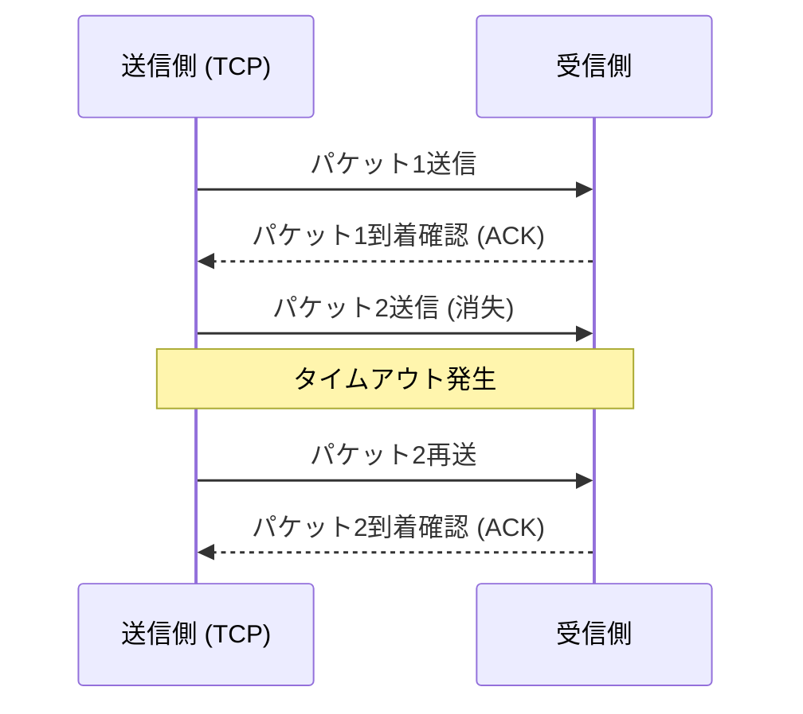

## 1. 速度か、正確性か。インターネットの究極の選択

私たちがインターネットを通じてデータをやり取りする際、その土台（トランスポート層）で働くプロトコル（通信規約）には、大きく分けて2つの主役が存在します。
一つは、Webサイトの閲覧やファイルのダウンロードなど、インターネットの通信の大部分を担う「**TCP（Transmission Control Protocol）**」。
そしてもう一つが、本記事の主役である「**UDP（User Datagram Protocol）**」です。

TCPが「絶対に荷物を紛失させない、書留郵便のような丁寧な配達員」だとすれば、UDPは「荷物を次々と投げつけ、届かなくても振り返らない、超高速なピッチングマシン」のような存在です。

なぜ、インターネットには「届く保証がない」プロトコルが必要なのでしょうか？

## 2. TCPの限界：「正確性」がもたらす遅延

UDPの必要性を理解するために、まずはライバルであるTCPの動きを見てみましょう。

TCPは「**コネクション指向**」のプロトコルです。データを送る前に、相手に「今から送ってもいいですか？」「いいですよ」という事前確認（3ウェイ・ハンドシェイク）を必ず行います。
さらに、データを細切れ（パケット）にして送る際、すべてのパケットに順番の番号を振り、相手から「1番届きました」「2番届きました」という受領確認（ACK）を待ちます。もし途中で3番のパケットがネットワーク上で迷子になり、受領確認が来なければ、TCPはタイマーでそれを検知し、「3番を再送します」とやり直します。

この仕組みのおかげで、私たちは1バイトの欠落もなく綺麗な画像を見たり、プログラムをダウンロードしたりできます。
しかし、この「確認」と「再送」のプロセスは、<strong>致命的な時間的遅延（レイテンシ）</strong>を生み出します。

## 3. UDPの哲学：「届かなくてもいいから、今すぐ送れ」

リアルタイム性が極めて重要なアプリケーション、例えば「オンラインゲーム（FPSや格闘ゲーム）」や「Zoomなどのビデオ通話」、「スポーツのライブ配信」において、TCPの丁寧さは逆に仇となります。

ビデオ通話中に一瞬だけ音声データが途切れたとします。もしTCPを使っていたら、システムは「先ほどの0.5秒前の音声データが届いていないので、再送します。それまで動画全体を一時停止させます」という処理を行います。結果として、画面がカクカクに止まってしまいます。
人間にとって、リアルタイム通話では「0.5秒前の過去の音声が遅れて綺麗に届く」ことよりも、「少しノイズが入ってもいいから、今の音声をそのまま流し続ける」ことの方が遥かに重要です。

ここで活躍するのが「**コネクションレス型**」であるUDPです。

UDPは、相手が受け取る準備ができているかどうかの確認を一切しません。パケットに順番も振りませんし、届いたかどうかの確認も、再送処理も行いません。
ただひたすらに、アプリケーションから渡されたデータをヘッダー（宛先情報などのわずかなメタデータ）だけを付けて、ネットワークの海へ「投げっぱなし」にします。

### UDPのヘッダーは極限まで軽い
TCPのヘッダーが通常20バイトの様々な制御情報を持つのに対し、UDPのヘッダーはわずか「**8バイト**」しかありません。
1. 送信元ポート番号 (2バイト)
2. 宛先ポート番号 (2バイト)
3. パケットの長さ (2バイト)
4. チェックサム (2バイト: データ破損がないかの最低限の確認)

この圧倒的な軽さと処理のシンプルさが、通信のレイテンシを極限まで削り落とし、リアルタイムな体験を可能にしているのです。

## 4. UDPの活躍場所

UDPの「軽くて速いが、信頼性がない」という特性は、現代のインターネットインフラの至る所で利用されています。

* **DNS (Domain Name System)**
  URL（例: google.com）をIPアドレスに変換するシステムです。DNSへの問い合わせは非常に小さなデータであり、もし返事が返ってこなければもう一度問い合わせれば済むため、高速なUDPが使われます。
* **NTP (Network Time Protocol)**
  PCやスマホの時計を正確に合わせるための通信です。時間情報は古くなると意味がないため、再送による遅延を嫌うUDPが最適です。
* **ストリーミング配信とVoIP**
  YouTubeのライブ配信や、LINE通話、Discordの音声通話などは、一部のパケット欠落をソフトウェア側で補間（予測して埋める）することで、遅延のないUDP通信を実現しています。

## 5. 新たな進化：「QUIC」プロトコル

長年、インターネットは「正確なTCP」と「速いUDP」に二分されてきましたが、近年、この歴史を変える革命が起きました。
それが、Googleが開発し、現在の「HTTP/3」の基盤となっているプロトコル「**QUIC（クイック）**」です。

Webサイトの表示をさらに高速化したいGoogleは、TCPの「最初の挨拶（ハンドシェイク）にかかる遅延」が限界に達していることに気づきました。そこで彼らは、TCPを改良するのではなく、**なんとUDPをベースにして、その上にソフトウェア制御による独自の「速くて正確な通信手順」を作り上げた**のです。

QUICは、ベースがUDPであるためOSカーネルの複雑なTCP制御をバイパスでき、独自の暗号化通信（TLS）のハンドシェイクを同時に行うことで、通信開始までの時間を劇的に短縮しました。現在、私たちがYouTubeを見たりGoogleのサービスを使うとき、その裏ではTCPではなく、UDPベースのQUICが爆速でデータを運んでいます。

「信頼できない」と言われ続けたUDPが、工夫次第で現代の最先端Webインフラの土台へと大出世を遂げた事実は、コンピュータネットワークの設計において「軽さとシンプルさ」がいかに強力な武器になるかを物語っています。
