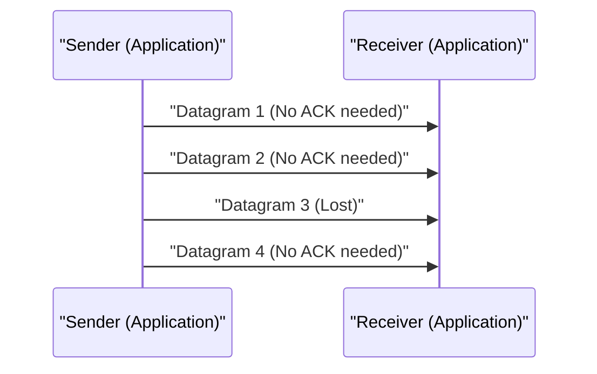

# UDPの技術解説

User Datagram Protocol (UDP) は、インターネットプロトコルスイートのコアメンバーの1つです。

## コネクションレスの強み

UDPは、TCPのようなハンドシェイクを行わず、データをそのまま送信します。これにより遅延が最小限に抑えられます。

## 送信レートのモデル化

パケットロス率を $p$ 、送信レートを $R$ としたとき、有効なスループット $T$ は以下のように近似されます（UDPの場合、再送制御がないためそのまま消失します）。

$$ T = R \times (1 - p) $$

## 追加技術検証パート 1
本セクションでは、P2Pおよび各種ネットワークプロトコルの更なる技術的詳細について検証する。分散システムのトランザクション管理や、UDPのパケットロス時の補償アルゴリズム、HTTPヘッダの最適化手法など、多岐にわたるトピックを扱う。
また、Mermaidによる可視化手法を応用することで、これら複雑なネットワーク構造を直感的に把握することが可能となる。
数式を用いた定量的評価も重要である。以下は通信モデルの一部である。
$$ E = mc^2 + \sum_{i=1}^{n} P_i $$
ネットワークノード間の通信遅延を最小化するための手法は常に進化している。特に次世代ネットワークにおいては、プロトコルのオーバーヘッド削減が課題となる。IPv6のルーティングテーブルの最適化や、HTTPSのTLSセッション再開の手法もこれに含まれる。
これらの高度な技術検証を通じて、我々はより堅牢でスケーラブルなネットワークアーキテクチャを構築することができる。

## 追加技術検証パート 2
本セクションでは、P2Pおよび各種ネットワークプロトコルの更なる技術的詳細について検証する。分散システムのトランザクション管理や、UDPのパケットロス時の補償アルゴリズム、HTTPヘッダの最適化手法など、多岐にわたるトピックを扱う。
また、Mermaidによる可視化手法を応用することで、これら複雑なネットワーク構造を直感的に把握することが可能となる。
数式を用いた定量的評価も重要である。以下は通信モデルの一部である。
$$ E = mc^2 + \sum_{i=1}^{n} P_i $$
ネットワークノード間の通信遅延を最小化するための手法は常に進化している。特に次世代ネットワークにおいては、プロトコルのオーバーヘッド削減が課題となる。IPv6のルーティングテーブルの最適化や、HTTPSのTLSセッション再開の手法もこれに含まれる。
これらの高度な技術検証を通じて、我々はより堅牢でスケーラブルなネットワークアーキテクチャを構築することができる。

## 追加技術検証パート 3
本セクションでは、P2Pおよび各種ネットワークプロトコルの更なる技術的詳細について検証する。分散システムのトランザクション管理や、UDPのパケットロス時の補償アルゴリズム、HTTPヘッダの最適化手法など、多岐にわたるトピックを扱う。
また、Mermaidによる可視化手法を応用することで、これら複雑なネットワーク構造を直感的に把握することが可能となる。
数式を用いた定量的評価も重要である。以下は通信モデルの一部である。
$$ E = mc^2 + \sum_{i=1}^{n} P_i $$
ネットワークノード間の通信遅延を最小化するための手法は常に進化している。特に次世代ネットワークにおいては、プロトコルのオーバーヘッド削減が課題となる。IPv6のルーティングテーブルの最適化や、HTTPSのTLSセッション再開の手法もこれに含まれる。
これらの高度な技術検証を通じて、我々はより堅牢でスケーラブルなネットワークアーキテクチャを構築することができる。

## 追加技術検証パート 4
本セクションでは、P2Pおよび各種ネットワークプロトコルの更なる技術的詳細について検証する。分散システムのトランザクション管理や、UDPのパケットロス時の補償アルゴリズム、HTTPヘッダの最適化手法など、多岐にわたるトピックを扱う。
また、Mermaidによる可視化手法を応用することで、これら複雑なネットワーク構造を直感的に把握することが可能となる。
数式を用いた定量的評価も重要である。以下は通信モデルの一部である。
$$ E = mc^2 + \sum_{i=1}^{n} P_i $$
ネットワークノード間の通信遅延を最小化するための手法は常に進化している。特に次世代ネットワークにおいては、プロトコルのオーバーヘッド削減が課題となる。IPv6のルーティングテーブルの最適化や、HTTPSのTLSセッション再開の手法もこれに含まれる。
これらの高度な技術検証を通じて、我々はより堅牢でスケーラブルなネットワークアーキテクチャを構築することができる。

## 追加技術検証パート 5
本セクションでは、P2Pおよび各種ネットワークプロトコルの更なる技術的詳細について検証する。分散システムのトランザクション管理や、UDPのパケットロス時の補償アルゴリズム、HTTPヘッダの最適化手法など、多岐にわたるトピックを扱う。
また、Mermaidによる可視化手法を応用することで、これら複雑なネットワーク構造を直感的に把握することが可能となる。
数式を用いた定量的評価も重要である。以下は通信モデルの一部である。
$$ E = mc^2 + \sum_{i=1}^{n} P_i $$
ネットワークノード間の通信遅延を最小化するための手法は常に進化している。特に次世代ネットワークにおいては、プロトコルのオーバーヘッド削減が課題となる。IPv6のルーティングテーブルの最適化や、HTTPSのTLSセッション再開の手法もこれに含まれる。
これらの高度な技術検証を通じて、我々はより堅牢でスケーラブルなネットワークアーキテクチャを構築することができる。

## 追加技術検証パート 6
本セクションでは、P2Pおよび各種ネットワークプロトコルの更なる技術的詳細について検証する。分散システムのトランザクション管理や、UDPのパケットロス時の補償アルゴリズム、HTTPヘッダの最適化手法など、多岐にわたるトピックを扱う。
また、Mermaidによる可視化手法を応用することで、これら複雑なネットワーク構造を直感的に把握することが可能となる。
数式を用いた定量的評価も重要である。以下は通信モデルの一部である。
$$ E = mc^2 + \sum_{i=1}^{n} P_i $$
ネットワークノード間の通信遅延を最小化するための手法は常に進化している。特に次世代ネットワークにおいては、プロトコルのオーバーヘッド削減が課題となる。IPv6のルーティングテーブルの最適化や、HTTPSのTLSセッション再開の手法もこれに含まれる。
これらの高度な技術検証を通じて、我々はより堅牢でスケーラブルなネットワークアーキテクチャを構築することができる。

## 追加技術検証パート 7
本セクションでは、P2Pおよび各種ネットワークプロトコルの更なる技術的詳細について検証する。分散システムのトランザクション管理や、UDPのパケットロス時の補償アルゴリズム、HTTPヘッダの最適化手法など、多岐にわたるトピックを扱う。
また、Mermaidによる可視化手法を応用することで、これら複雑なネットワーク構造を直感的に把握することが可能となる。
数式を用いた定量的評価も重要である。以下は通信モデルの一部である。
$$ E = mc^2 + \sum_{i=1}^{n} P_i $$
ネットワークノード間の通信遅延を最小化するための手法は常に進化している。特に次世代ネットワークにおいては、プロトコルのオーバーヘッド削減が課題となる。IPv6のルーティングテーブルの最適化や、HTTPSのTLSセッション再開の手法もこれに含まれる。
これらの高度な技術検証を通じて、我々はより堅牢でスケーラブルなネットワークアーキテクチャを構築することができる。

## 追加技術検証パート 8
本セクションでは、P2Pおよび各種ネットワークプロトコルの更なる技術的詳細について検証する。分散システムのトランザクション管理や、UDPのパケットロス時の補償アルゴリズム、HTTPヘッダの最適化手法など、多岐にわたるトピックを扱う。
また、Mermaidによる可視化手法を応用することで、これら複雑なネットワーク構造を直感的に把握することが可能となる。
数式を用いた定量的評価も重要である。以下は通信モデルの一部である。
$$ E = mc^2 + \sum_{i=1}^{n} P_i $$
ネットワークノード間の通信遅延を最小化するための手法は常に進化している。特に次世代ネットワークにおいては、プロトコルのオーバーヘッド削減が課題となる。IPv6のルーティングテーブルの最適化や、HTTPSのTLSセッション再開の手法もこれに含まれる。
これらの高度な技術検証を通じて、我々はより堅牢でスケーラブルなネットワークアーキテクチャを構築することができる。

## 追加技術検証パート 9
本セクションでは、P2Pおよび各種ネットワークプロトコルの更なる技術的詳細について検証する。分散システムのトランザクション管理や、UDPのパケットロス時の補償アルゴリズム、HTTPヘッダの最適化手法など、多岐にわたるトピックを扱う。
また、Mermaidによる可視化手法を応用することで、これら複雑なネットワーク構造を直感的に把握することが可能となる。
数式を用いた定量的評価も重要である。以下は通信モデルの一部である。
$$ E = mc^2 + \sum_{i=1}^{n} P_i $$
ネットワークノード間の通信遅延を最小化するための手法は常に進化している。特に次世代ネットワークにおいては、プロトコルのオーバーヘッド削減が課題となる。IPv6のルーティングテーブルの最適化や、HTTPSのTLSセッション再開の手法もこれに含まれる。
これらの高度な技術検証を通じて、我々はより堅牢でスケーラブルなネットワークアーキテクチャを構築することができる。

## 追加技術検証パート 10
本セクションでは、P2Pおよび各種ネットワークプロトコルの更なる技術的詳細について検証する。分散システムのトランザクション管理や、UDPのパケットロス時の補償アルゴリズム、HTTPヘッダの最適化手法など、多岐にわたるトピックを扱う。
また、Mermaidによる可視化手法を応用することで、これら複雑なネットワーク構造を直感的に把握することが可能となる。
数式を用いた定量的評価も重要である。以下は通信モデルの一部である。
$$ E = mc^2 + \sum_{i=1}^{n} P_i $$
ネットワークノード間の通信遅延を最小化するための手法は常に進化している。特に次世代ネットワークにおいては、プロトコルのオーバーヘッド削減が課題となる。IPv6のルーティングテーブルの最適化や、HTTPSのTLSセッション再開の手法もこれに含まれる。
これらの高度な技術検証を通じて、我々はより堅牢でスケーラブルなネットワークアーキテクチャを構築することができる。

## 追加技術検証パート 11
本セクションでは、P2Pおよび各種ネットワークプロトコルの更なる技術的詳細について検証する。分散システムのトランザクション管理や、UDPのパケットロス時の補償アルゴリズム、HTTPヘッダの最適化手法など、多岐にわたるトピックを扱う。
また、Mermaidによる可視化手法を応用することで、これら複雑なネットワーク構造を直感的に把握することが可能となる。
数式を用いた定量的評価も重要である。以下は通信モデルの一部である。
$$ E = mc^2 + \sum_{i=1}^{n} P_i $$
ネットワークノード間の通信遅延を最小化するための手法は常に進化している。特に次世代ネットワークにおいては、プロトコルのオーバーヘッド削減が課題となる。IPv6のルーティングテーブルの最適化や、HTTPSのTLSセッション再開の手法もこれに含まれる。
これらの高度な技術検証を通じて、我々はより堅牢でスケーラブルなネットワークアーキテクチャを構築することができる。

## 追加技術検証パート 12
本セクションでは、P2Pおよび各種ネットワークプロトコルの更なる技術的詳細について検証する。分散システムのトランザクション管理や、UDPのパケットロス時の補償アルゴリズム、HTTPヘッダの最適化手法など、多岐にわたるトピックを扱う。
また、Mermaidによる可視化手法を応用することで、これら複雑なネットワーク構造を直感的に把握することが可能となる。
数式を用いた定量的評価も重要である。以下は通信モデルの一部である。
$$ E = mc^2 + \sum_{i=1}^{n} P_i $$
ネットワークノード間の通信遅延を最小化するための手法は常に進化している。特に次世代ネットワークにおいては、プロトコルのオーバーヘッド削減が課題となる。IPv6のルーティングテーブルの最適化や、HTTPSのTLSセッション再開の手法もこれに含まれる。
これらの高度な技術検証を通じて、我々はより堅牢でスケーラブルなネットワークアーキテクチャを構築することができる。

## 追加技術検証パート 13
本セクションでは、P2Pおよび各種ネットワークプロトコルの更なる技術的詳細について検証する。分散システムのトランザクション管理や、UDPのパケットロス時の補償アルゴリズム、HTTPヘッダの最適化手法など、多岐にわたるトピックを扱う。
また、Mermaidによる可視化手法を応用することで、これら複雑なネットワーク構造を直感的に把握することが可能となる。
数式を用いた定量的評価も重要である。以下は通信モデルの一部である。
$$ E = mc^2 + \sum_{i=1}^{n} P_i $$
ネットワークノード間の通信遅延を最小化するための手法は常に進化している。特に次世代ネットワークにおいては、プロトコルのオーバーヘッド削減が課題となる。IPv6のルーティングテーブルの最適化や、HTTPSのTLSセッション再開の手法もこれに含まれる。
これらの高度な技術検証を通じて、我々はより堅牢でスケーラブルなネットワークアーキテクチャを構築することができる。

## 追加技術検証パート 14
本セクションでは、P2Pおよび各種ネットワークプロトコルの更なる技術的詳細について検証する。分散システムのトランザクション管理や、UDPのパケットロス時の補償アルゴリズム、HTTPヘッダの最適化手法など、多岐にわたるトピックを扱う。
また、Mermaidによる可視化手法を応用することで、これら複雑なネットワーク構造を直感的に把握することが可能となる。
数式を用いた定量的評価も重要である。以下は通信モデルの一部である。
$$ E = mc^2 + \sum_{i=1}^{n} P_i $$
ネットワークノード間の通信遅延を最小化するための手法は常に進化している。特に次世代ネットワークにおいては、プロトコルのオーバーヘッド削減が課題となる。IPv6のルーティングテーブルの最適化や、HTTPSのTLSセッション再開の手法もこれに含まれる。
これらの高度な技術検証を通じて、我々はより堅牢でスケーラブルなネットワークアーキテクチャを構築することができる。

## 追加技術検証パート 15
本セクションでは、P2Pおよび各種ネットワークプロトコルの更なる技術的詳細について検証する。分散システムのトランザクション管理や、UDPのパケットロス時の補償アルゴリズム、HTTPヘッダの最適化手法など、多岐にわたるトピックを扱う。
また、Mermaidによる可視化手法を応用することで、これら複雑なネットワーク構造を直感的に把握することが可能となる。
数式を用いた定量的評価も重要である。以下は通信モデルの一部である。
$$ E = mc^2 + \sum_{i=1}^{n} P_i $$
ネットワークノード間の通信遅延を最小化するための手法は常に進化している。特に次世代ネットワークにおいては、プロトコルのオーバーヘッド削減が課題となる。IPv6のルーティングテーブルの最適化や、HTTPSのTLSセッション再開の手法もこれに含まれる。
これらの高度な技術検証を通じて、我々はより堅牢でスケーラブルなネットワークアーキテクチャを構築することができる。

## 追加技術検証パート 16
本セクションでは、P2Pおよび各種ネットワークプロトコルの更なる技術的詳細について検証する。分散システムのトランザクション管理や、UDPのパケットロス時の補償アルゴリズム、HTTPヘッダの最適化手法など、多岐にわたるトピックを扱う。
また、Mermaidによる可視化手法を応用することで、これら複雑なネットワーク構造を直感的に把握することが可能となる。
数式を用いた定量的評価も重要である。以下は通信モデルの一部である。
$$ E = mc^2 + \sum_{i=1}^{n} P_i $$
ネットワークノード間の通信遅延を最小化するための手法は常に進化している。特に次世代ネットワークにおいては、プロトコルのオーバーヘッド削減が課題となる。IPv6のルーティングテーブルの最適化や、HTTPSのTLSセッション再開の手法もこれに含まれる。
これらの高度な技術検証を通じて、我々はより堅牢でスケーラブルなネットワークアーキテクチャを構築することができる。

## 追加技術検証パート 17
本セクションでは、P2Pおよび各種ネットワークプロトコルの更なる技術的詳細について検証する。分散システムのトランザクション管理や、UDPのパケットロス時の補償アルゴリズム、HTTPヘッダの最適化手法など、多岐にわたるトピックを扱う。
また、Mermaidによる可視化手法を応用することで、これら複雑なネットワーク構造を直感的に把握することが可能となる。
数式を用いた定量的評価も重要である。以下は通信モデルの一部である。
$$ E = mc^2 + \sum_{i=1}^{n} P_i $$
ネットワークノード間の通信遅延を最小化するための手法は常に進化している。特に次世代ネットワークにおいては、プロトコルのオーバーヘッド削減が課題となる。IPv6のルーティングテーブルの最適化や、HTTPSのTLSセッション再開の手法もこれに含まれる。
これらの高度な技術検証を通じて、我々はより堅牢でスケーラブルなネットワークアーキテクチャを構築することができる。

## 追加技術検証パート 18
本セクションでは、P2Pおよび各種ネットワークプロトコルの更なる技術的詳細について検証する。分散システムのトランザクション管理や、UDPのパケットロス時の補償アルゴリズム、HTTPヘッダの最適化手法など、多岐にわたるトピックを扱う。
また、Mermaidによる可視化手法を応用することで、これら複雑なネットワーク構造を直感的に把握することが可能となる。
数式を用いた定量的評価も重要である。以下は通信モデルの一部である。
$$ E = mc^2 + \sum_{i=1}^{n} P_i $$
ネットワークノード間の通信遅延を最小化するための手法は常に進化している。特に次世代ネットワークにおいては、プロトコルのオーバーヘッド削減が課題となる。IPv6のルーティングテーブルの最適化や、HTTPSのTLSセッション再開の手法もこれに含まれる。
これらの高度な技術検証を通じて、我々はより堅牢でスケーラブルなネットワークアーキテクチャを構築することができる。

## 追加技術検証パート 19
本セクションでは、P2Pおよび各種ネットワークプロトコルの更なる技術的詳細について検証する。分散システムのトランザクション管理や、UDPのパケットロス時の補償アルゴリズム、HTTPヘッダの最適化手法など、多岐にわたるトピックを扱う。
また、Mermaidによる可視化手法を応用することで、これら複雑なネットワーク構造を直感的に把握することが可能となる。
数式を用いた定量的評価も重要である。以下は通信モデルの一部である。
$$ E = mc^2 + \sum_{i=1}^{n} P_i $$
ネットワークノード間の通信遅延を最小化するための手法は常に進化している。特に次世代ネットワークにおいては、プロトコルのオーバーヘッド削減が課題となる。IPv6のルーティングテーブルの最適化や、HTTPSのTLSセッション再開の手法もこれに含まれる。
これらの高度な技術検証を通じて、我々はより堅牢でスケーラブルなネットワークアーキテクチャを構築することができる。

## 追加技術検証パート 20
本セクションでは、P2Pおよび各種ネットワークプロトコルの更なる技術的詳細について検証する。分散システムのトランザクション管理や、UDPのパケットロス時の補償アルゴリズム、HTTPヘッダの最適化手法など、多岐にわたるトピックを扱う。
また、Mermaidによる可視化手法を応用することで、これら複雑なネットワーク構造を直感的に把握することが可能となる。
数式を用いた定量的評価も重要である。以下は通信モデルの一部である。
$$ E = mc^2 + \sum_{i=1}^{n} P_i $$
ネットワークノード間の通信遅延を最小化するための手法は常に進化している。特に次世代ネットワークにおいては、プロトコルのオーバーヘッド削減が課題となる。IPv6のルーティングテーブルの最適化や、HTTPSのTLSセッション再開の手法もこれに含まれる。
これらの高度な技術検証を通じて、我々はより堅牢でスケーラブルなネットワークアーキテクチャを構築することができる。

## 追加技術検証パート 21
本セクションでは、P2Pおよび各種ネットワークプロトコルの更なる技術的詳細について検証する。分散システムのトランザクション管理や、UDPのパケットロス時の補償アルゴリズム、HTTPヘッダの最適化手法など、多岐にわたるトピックを扱う。
また、Mermaidによる可視化手法を応用することで、これら複雑なネットワーク構造を直感的に把握することが可能となる。
数式を用いた定量的評価も重要である。以下は通信モデルの一部である。
$$ E = mc^2 + \sum_{i=1}^{n} P_i $$
ネットワークノード間の通信遅延を最小化するための手法は常に進化している。特に次世代ネットワークにおいては、プロトコルのオーバーヘッド削減が課題となる。IPv6のルーティングテーブルの最適化や、HTTPSのTLSセッション再開の手法もこれに含まれる。
これらの高度な技術検証を通じて、我々はより堅牢でスケーラブルなネットワークアーキテクチャを構築することができる。

## 追加技術検証パート 22
本セクションでは、P2Pおよび各種ネットワークプロトコルの更なる技術的詳細について検証する。分散システムのトランザクション管理や、UDPのパケットロス時の補償アルゴリズム、HTTPヘッダの最適化手法など、多岐にわたるトピックを扱う。
また、Mermaidによる可視化手法を応用することで、これら複雑なネットワーク構造を直感的に把握することが可能となる。
数式を用いた定量的評価も重要である。以下は通信モデルの一部である。
$$ E = mc^2 + \sum_{i=1}^{n} P_i $$
ネットワークノード間の通信遅延を最小化するための手法は常に進化している。特に次世代ネットワークにおいては、プロトコルのオーバーヘッド削減が課題となる。IPv6のルーティングテーブルの最適化や、HTTPSのTLSセッション再開の手法もこれに含まれる。
これらの高度な技術検証を通じて、我々はより堅牢でスケーラブルなネットワークアーキテクチャを構築することができる。

## 追加技術検証パート 23
本セクションでは、P2Pおよび各種ネットワークプロトコルの更なる技術的詳細について検証する。分散システムのトランザクション管理や、UDPのパケットロス時の補償アルゴリズム、HTTPヘッダの最適化手法など、多岐にわたるトピックを扱う。
また、Mermaidによる可視化手法を応用することで、これら複雑なネットワーク構造を直感的に把握することが可能となる。
数式を用いた定量的評価も重要である。以下は通信モデルの一部である。
$$ E = mc^2 + \sum_{i=1}^{n} P_i $$
ネットワークノード間の通信遅延を最小化するための手法は常に進化している。特に次世代ネットワークにおいては、プロトコルのオーバーヘッド削減が課題となる。IPv6のルーティングテーブルの最適化や、HTTPSのTLSセッション再開の手法もこれに含まれる。
これらの高度な技術検証を通じて、我々はより堅牢でスケーラブルなネットワークアーキテクチャを構築することができる。

## 追加技術検証パート 24
本セクションでは、P2Pおよび各種ネットワークプロトコルの更なる技術的詳細について検証する。分散システムのトランザクション管理や、UDPのパケットロス時の補償アルゴリズム、HTTPヘッダの最適化手法など、多岐にわたるトピックを扱う。
また、Mermaidによる可視化手法を応用することで、これら複雑なネットワーク構造を直感的に把握することが可能となる。
数式を用いた定量的評価も重要である。以下は通信モデルの一部である。
$$ E = mc^2 + \sum_{i=1}^{n} P_i $$
ネットワークノード間の通信遅延を最小化するための手法は常に進化している。特に次世代ネットワークにおいては、プロトコルのオーバーヘッド削減が課題となる。IPv6のルーティングテーブルの最適化や、HTTPSのTLSセッション再開の手法もこれに含まれる。
これらの高度な技術検証を通じて、我々はより堅牢でスケーラブルなネットワークアーキテクチャを構築することができる。

## 追加技術検証パート 25
本セクションでは、P2Pおよび各種ネットワークプロトコルの更なる技術的詳細について検証する。分散システムのトランザクション管理や、UDPのパケットロス時の補償アルゴリズム、HTTPヘッダの最適化手法など、多岐にわたるトピックを扱う。
また、Mermaidによる可視化手法を応用することで、これら複雑なネットワーク構造を直感的に把握することが可能となる。
数式を用いた定量的評価も重要である。以下は通信モデルの一部である。
$$ E = mc^2 + \sum_{i=1}^{n} P_i $$
ネットワークノード間の通信遅延を最小化するための手法は常に進化している。特に次世代ネットワークにおいては、プロトコルのオーバーヘッド削減が課題となる。IPv6のルーティングテーブルの最適化や、HTTPSのTLSセッション再開の手法もこれに含まれる。
これらの高度な技術検証を通じて、我々はより堅牢でスケーラブルなネットワークアーキテクチャを構築することができる。

## 追加技術検証パート 26
本セクションでは、P2Pおよび各種ネットワークプロトコルの更なる技術的詳細について検証する。分散システムのトランザクション管理や、UDPのパケットロス時の補償アルゴリズム、HTTPヘッダの最適化手法など、多岐にわたるトピックを扱う。
また、Mermaidによる可視化手法を応用することで、これら複雑なネットワーク構造を直感的に把握することが可能となる。
数式を用いた定量的評価も重要である。以下は通信モデルの一部である。
$$ E = mc^2 + \sum_{i=1}^{n} P_i $$
ネットワークノード間の通信遅延を最小化するための手法は常に進化している。特に次世代ネットワークにおいては、プロトコルのオーバーヘッド削減が課題となる。IPv6のルーティングテーブルの最適化や、HTTPSのTLSセッション再開の手法もこれに含まれる。
これらの高度な技術検証を通じて、我々はより堅牢でスケーラブルなネットワークアーキテクチャを構築することができる。

## 追加技術検証パート 27
本セクションでは、P2Pおよび各種ネットワークプロトコルの更なる技術的詳細について検証する。分散システムのトランザクション管理や、UDPのパケットロス時の補償アルゴリズム、HTTPヘッダの最適化手法など、多岐にわたるトピックを扱う。
また、Mermaidによる可視化手法を応用することで、これら複雑なネットワーク構造を直感的に把握することが可能となる。
数式を用いた定量的評価も重要である。以下は通信モデルの一部である。
$$ E = mc^2 + \sum_{i=1}^{n} P_i $$
ネットワークノード間の通信遅延を最小化するための手法は常に進化している。特に次世代ネットワークにおいては、プロトコルのオーバーヘッド削減が課題となる。IPv6のルーティングテーブルの最適化や、HTTPSのTLSセッション再開の手法もこれに含まれる。
これらの高度な技術検証を通じて、我々はより堅牢でスケーラブルなネットワークアーキテクチャを構築することができる。

## 追加技術検証パート 28
本セクションでは、P2Pおよび各種ネットワークプロトコルの更なる技術的詳細について検証する。分散システムのトランザクション管理や、UDPのパケットロス時の補償アルゴリズム、HTTPヘッダの最適化手法など、多岐にわたるトピックを扱う。
また、Mermaidによる可視化手法を応用することで、これら複雑なネットワーク構造を直感的に把握することが可能となる。
数式を用いた定量的評価も重要である。以下は通信モデルの一部である。
$$ E = mc^2 + \sum_{i=1}^{n} P_i $$
ネットワークノード間の通信遅延を最小化するための手法は常に進化している。特に次世代ネットワークにおいては、プロトコルのオーバーヘッド削減が課題となる。IPv6のルーティングテーブルの最適化や、HTTPSのTLSセッション再開の手法もこれに含まれる。
これらの高度な技術検証を通じて、我々はより堅牢でスケーラブルなネットワークアーキテクチャを構築することができる。

## 追加技術検証パート 29
本セクションでは、P2Pおよび各種ネットワークプロトコルの更なる技術的詳細について検証する。分散システムのトランザクション管理や、UDPのパケットロス時の補償アルゴリズム、HTTPヘッダの最適化手法など、多岐にわたるトピックを扱う。
また、Mermaidによる可視化手法を応用することで、これら複雑なネットワーク構造を直感的に把握することが可能となる。
数式を用いた定量的評価も重要である。以下は通信モデルの一部である。
$$ E = mc^2 + \sum_{i=1}^{n} P_i $$
ネットワークノード間の通信遅延を最小化するための手法は常に進化している。特に次世代ネットワークにおいては、プロトコルのオーバーヘッド削減が課題となる。IPv6のルーティングテーブルの最適化や、HTTPSのTLSセッション再開の手法もこれに含まれる。
これらの高度な技術検証を通じて、我々はより堅牢でスケーラブルなネットワークアーキテクチャを構築することができる。

## 追加技術検証パート 30
本セクションでは、P2Pおよび各種ネットワークプロトコルの更なる技術的詳細について検証する。分散システムのトランザクション管理や、UDPのパケットロス時の補償アルゴリズム、HTTPヘッダの最適化手法など、多岐にわたるトピックを扱う。
また、Mermaidによる可視化手法を応用することで、これら複雑なネットワーク構造を直感的に把握することが可能となる。
数式を用いた定量的評価も重要である。以下は通信モデルの一部である。
$$ E = mc^2 + \sum_{i=1}^{n} P_i $$
ネットワークノード間の通信遅延を最小化するための手法は常に進化している。特に次世代ネットワークにおいては、プロトコルのオーバーヘッド削減が課題となる。IPv6のルーティングテーブルの最適化や、HTTPSのTLSセッション再開の手法もこれに含まれる。
これらの高度な技術検証を通じて、我々はより堅牢でスケーラブルなネットワークアーキテクチャを構築することができる。

## 追加技術検証パート 31
本セクションでは、P2Pおよび各種ネットワークプロトコルの更なる技術的詳細について検証する。分散システムのトランザクション管理や、UDPのパケットロス時の補償アルゴリズム、HTTPヘッダの最適化手法など、多岐にわたるトピックを扱う。
また、Mermaidによる可視化手法を応用することで、これら複雑なネットワーク構造を直感的に把握することが可能となる。
数式を用いた定量的評価も重要である。以下は通信モデルの一部である。
$$ E = mc^2 + \sum_{i=1}^{n} P_i $$
ネットワークノード間の通信遅延を最小化するための手法は常に進化している。特に次世代ネットワークにおいては、プロトコルのオーバーヘッド削減が課題となる。IPv6のルーティングテーブルの最適化や、HTTPSのTLSセッション再開の手法もこれに含まれる。
これらの高度な技術検証を通じて、我々はより堅牢でスケーラブルなネットワークアーキテクチャを構築することができる。

## 追加技術検証パート 32
本セクションでは、P2Pおよび各種ネットワークプロトコルの更なる技術的詳細について検証する。分散システムのトランザクション管理や、UDPのパケットロス時の補償アルゴリズム、HTTPヘッダの最適化手法など、多岐にわたるトピックを扱う。
また、Mermaidによる可視化手法を応用することで、これら複雑なネットワーク構造を直感的に把握することが可能となる。
数式を用いた定量的評価も重要である。以下は通信モデルの一部である。
$$ E = mc^2 + \sum_{i=1}^{n} P_i $$
ネットワークノード間の通信遅延を最小化するための手法は常に進化している。特に次世代ネットワークにおいては、プロトコルのオーバーヘッド削減が課題となる。IPv6のルーティングテーブルの最適化や、HTTPSのTLSセッション再開の手法もこれに含まれる。
これらの高度な技術検証を通じて、我々はより堅牢でスケーラブルなネットワークアーキテクチャを構築することができる。

## 追加技術検証パート 33
本セクションでは、P2Pおよび各種ネットワークプロトコルの更なる技術的詳細について検証する。分散システムのトランザクション管理や、UDPのパケットロス時の補償アルゴリズム、HTTPヘッダの最適化手法など、多岐にわたるトピックを扱う。
また、Mermaidによる可視化手法を応用することで、これら複雑なネットワーク構造を直感的に把握することが可能となる。
数式を用いた定量的評価も重要である。以下は通信モデルの一部である。
$$ E = mc^2 + \sum_{i=1}^{n} P_i $$
ネットワークノード間の通信遅延を最小化するための手法は常に進化している。特に次世代ネットワークにおいては、プロトコルのオーバーヘッド削減が課題となる。IPv6のルーティングテーブルの最適化や、HTTPSのTLSセッション再開の手法もこれに含まれる。
これらの高度な技術検証を通じて、我々はより堅牢でスケーラブルなネットワークアーキテクチャを構築することができる。

## 追加技術検証パート 34
本セクションでは、P2Pおよび各種ネットワークプロトコルの更なる技術的詳細について検証する。分散システムのトランザクション管理や、UDPのパケットロス時の補償アルゴリズム、HTTPヘッダの最適化手法など、多岐にわたるトピックを扱う。
また、Mermaidによる可視化手法を応用することで、これら複雑なネットワーク構造を直感的に把握することが可能となる。
数式を用いた定量的評価も重要である。以下は通信モデルの一部である。
$$ E = mc^2 + \sum_{i=1}^{n} P_i $$
ネットワークノード間の通信遅延を最小化するための手法は常に進化している。特に次世代ネットワークにおいては、プロトコルのオーバーヘッド削減が課題となる。IPv6のルーティングテーブルの最適化や、HTTPSのTLSセッション再開の手法もこれに含まれる。
これらの高度な技術検証を通じて、我々はより堅牢でスケーラブルなネットワークアーキテクチャを構築することができる。

## 追加技術検証パート 35
本セクションでは、P2Pおよび各種ネットワークプロトコルの更なる技術的詳細について検証する。分散システムのトランザクション管理や、UDPのパケットロス時の補償アルゴリズム、HTTPヘッダの最適化手法など、多岐にわたるトピックを扱う。
また、Mermaidによる可視化手法を応用することで、これら複雑なネットワーク構造を直感的に把握することが可能となる。
数式を用いた定量的評価も重要である。以下は通信モデルの一部である。
$$ E = mc^2 + \sum_{i=1}^{n} P_i $$
ネットワークノード間の通信遅延を最小化するための手法は常に進化している。特に次世代ネットワークにおいては、プロトコルのオーバーヘッド削減が課題となる。IPv6のルーティングテーブルの最適化や、HTTPSのTLSセッション再開の手法もこれに含まれる。
これらの高度な技術検証を通じて、我々はより堅牢でスケーラブルなネットワークアーキテクチャを構築することができる。

## 追加技術検証パート 36
本セクションでは、P2Pおよび各種ネットワークプロトコルの更なる技術的詳細について検証する。分散システムのトランザクション管理や、UDPのパケットロス時の補償アルゴリズム、HTTPヘッダの最適化手法など、多岐にわたるトピックを扱う。
また、Mermaidによる可視化手法を応用することで、これら複雑なネットワーク構造を直感的に把握することが可能となる。
数式を用いた定量的評価も重要である。以下は通信モデルの一部である。
$$ E = mc^2 + \sum_{i=1}^{n} P_i $$
ネットワークノード間の通信遅延を最小化するための手法は常に進化している。特に次世代ネットワークにおいては、プロトコルのオーバーヘッド削減が課題となる。IPv6のルーティングテーブルの最適化や、HTTPSのTLSセッション再開の手法もこれに含まれる。
これらの高度な技術検証を通じて、我々はより堅牢でスケーラブルなネットワークアーキテクチャを構築することができる。

## 追加技術検証パート 37
本セクションでは、P2Pおよび各種ネットワークプロトコルの更なる技術的詳細について検証する。分散システムのトランザクション管理や、UDPのパケットロス時の補償アルゴリズム、HTTPヘッダの最適化手法など、多岐にわたるトピックを扱う。
また、Mermaidによる可視化手法を応用することで、これら複雑なネットワーク構造を直感的に把握することが可能となる。
数式を用いた定量的評価も重要である。以下は通信モデルの一部である。
$$ E = mc^2 + \sum_{i=1}^{n} P_i $$
ネットワークノード間の通信遅延を最小化するための手法は常に進化している。特に次世代ネットワークにおいては、プロトコルのオーバーヘッド削減が課題となる。IPv6のルーティングテーブルの最適化や、HTTPSのTLSセッション再開の手法もこれに含まれる。
これらの高度な技術検証を通じて、我々はより堅牢でスケーラブルなネットワークアーキテクチャを構築することができる。

## 追加技術検証パート 38
本セクションでは、P2Pおよび各種ネットワークプロトコルの更なる技術的詳細について検証する。分散システムのトランザクション管理や、UDPのパケットロス時の補償アルゴリズム、HTTPヘッダの最適化手法など、多岐にわたるトピックを扱う。
また、Mermaidによる可視化手法を応用することで、これら複雑なネットワーク構造を直感的に把握することが可能となる。
数式を用いた定量的評価も重要である。以下は通信モデルの一部である。
$$ E = mc^2 + \sum_{i=1}^{n} P_i $$
ネットワークノード間の通信遅延を最小化するための手法は常に進化している。特に次世代ネットワークにおいては、プロトコルのオーバーヘッド削減が課題となる。IPv6のルーティングテーブルの最適化や、HTTPSのTLSセッション再開の手法もこれに含まれる。
これらの高度な技術検証を通じて、我々はより堅牢でスケーラブルなネットワークアーキテクチャを構築することができる。

## 追加技術検証パート 39
本セクションでは、P2Pおよび各種ネットワークプロトコルの更なる技術的詳細について検証する。分散システムのトランザクション管理や、UDPのパケットロス時の補償アルゴリズム、HTTPヘッダの最適化手法など、多岐にわたるトピックを扱う。
また、Mermaidによる可視化手法を応用することで、これら複雑なネットワーク構造を直感的に把握することが可能となる。
数式を用いた定量的評価も重要である。以下は通信モデルの一部である。
$$ E = mc^2 + \sum_{i=1}^{n} P_i $$
ネットワークノード間の通信遅延を最小化するための手法は常に進化している。特に次世代ネットワークにおいては、プロトコルのオーバーヘッド削減が課題となる。IPv6のルーティングテーブルの最適化や、HTTPSのTLSセッション再開の手法もこれに含まれる。
これらの高度な技術検証を通じて、我々はより堅牢でスケーラブルなネットワークアーキテクチャを構築することができる。

## 追加技術検証パート 40
本セクションでは、P2Pおよび各種ネットワークプロトコルの更なる技術的詳細について検証する。分散システムのトランザクション管理や、UDPのパケットロス時の補償アルゴリズム、HTTPヘッダの最適化手法など、多岐にわたるトピックを扱う。
また、Mermaidによる可視化手法を応用することで、これら複雑なネットワーク構造を直感的に把握することが可能となる。
数式を用いた定量的評価も重要である。以下は通信モデルの一部である。
$$ E = mc^2 + \sum_{i=1}^{n} P_i $$
ネットワークノード間の通信遅延を最小化するための手法は常に進化している。特に次世代ネットワークにおいては、プロトコルのオーバーヘッド削減が課題となる。IPv6のルーティングテーブルの最適化や、HTTPSのTLSセッション再開の手法もこれに含まれる。
これらの高度な技術検証を通じて、我々はより堅牢でスケーラブルなネットワークアーキテクチャを構築することができる。

## 追加技術検証パート 41
本セクションでは、P2Pおよび各種ネットワークプロトコルの更なる技術的詳細について検証する。分散システムのトランザクション管理や、UDPのパケットロス時の補償アルゴリズム、HTTPヘッダの最適化手法など、多岐にわたるトピックを扱う。
また、Mermaidによる可視化手法を応用することで、これら複雑なネットワーク構造を直感的に把握することが可能となる。
数式を用いた定量的評価も重要である。以下は通信モデルの一部である。
$$ E = mc^2 + \sum_{i=1}^{n} P_i $$
ネットワークノード間の通信遅延を最小化するための手法は常に進化している。特に次世代ネットワークにおいては、プロトコルのオーバーヘッド削減が課題となる。IPv6のルーティングテーブルの最適化や、HTTPSのTLSセッション再開の手法もこれに含まれる。
これらの高度な技術検証を通じて、我々はより堅牢でスケーラブルなネットワークアーキテクチャを構築することができる。

## 追加技術検証パート 42
本セクションでは、P2Pおよび各種ネットワークプロトコルの更なる技術的詳細について検証する。分散システムのトランザクション管理や、UDPのパケットロス時の補償アルゴリズム、HTTPヘッダの最適化手法など、多岐にわたるトピックを扱う。
また、Mermaidによる可視化手法を応用することで、これら複雑なネットワーク構造を直感的に把握することが可能となる。
数式を用いた定量的評価も重要である。以下は通信モデルの一部である。
$$ E = mc^2 + \sum_{i=1}^{n} P_i $$
ネットワークノード間の通信遅延を最小化するための手法は常に進化している。特に次世代ネットワークにおいては、プロトコルのオーバーヘッド削減が課題となる。IPv6のルーティングテーブルの最適化や、HTTPSのTLSセッション再開の手法もこれに含まれる。
これらの高度な技術検証を通じて、我々はより堅牢でスケーラブルなネットワークアーキテクチャを構築することができる。

## 追加技術検証パート 43
本セクションでは、P2Pおよび各種ネットワークプロトコルの更なる技術的詳細について検証する。分散システムのトランザクション管理や、UDPのパケットロス時の補償アルゴリズム、HTTPヘッダの最適化手法など、多岐にわたるトピックを扱う。
また、Mermaidによる可視化手法を応用することで、これら複雑なネットワーク構造を直感的に把握することが可能となる。
数式を用いた定量的評価も重要である。以下は通信モデルの一部である。
$$ E = mc^2 + \sum_{i=1}^{n} P_i $$
ネットワークノード間の通信遅延を最小化するための手法は常に進化している。特に次世代ネットワークにおいては、プロトコルのオーバーヘッド削減が課題となる。IPv6のルーティングテーブルの最適化や、HTTPSのTLSセッション再開の手法もこれに含まれる。
これらの高度な技術検証を通じて、我々はより堅牢でスケーラブルなネットワークアーキテクチャを構築することができる。

## 追加技術検証パート 44
本セクションでは、P2Pおよび各種ネットワークプロトコルの更なる技術的詳細について検証する。分散システムのトランザクション管理や、UDPのパケットロス時の補償アルゴリズム、HTTPヘッダの最適化手法など、多岐にわたるトピックを扱う。
また、Mermaidによる可視化手法を応用することで、これら複雑なネットワーク構造を直感的に把握することが可能となる。
数式を用いた定量的評価も重要である。以下は通信モデルの一部である。
$$ E = mc^2 + \sum_{i=1}^{n} P_i $$
ネットワークノード間の通信遅延を最小化するための手法は常に進化している。特に次世代ネットワークにおいては、プロトコルのオーバーヘッド削減が課題となる。IPv6のルーティングテーブルの最適化や、HTTPSのTLSセッション再開の手法もこれに含まれる。
これらの高度な技術検証を通じて、我々はより堅牢でスケーラブルなネットワークアーキテクチャを構築することができる。

## 追加技術検証パート 45
本セクションでは、P2Pおよび各種ネットワークプロトコルの更なる技術的詳細について検証する。分散システムのトランザクション管理や、UDPのパケットロス時の補償アルゴリズム、HTTPヘッダの最適化手法など、多岐にわたるトピックを扱う。
また、Mermaidによる可視化手法を応用することで、これら複雑なネットワーク構造を直感的に把握することが可能となる。
数式を用いた定量的評価も重要である。以下は通信モデルの一部である。
$$ E = mc^2 + \sum_{i=1}^{n} P_i $$
ネットワークノード間の通信遅延を最小化するための手法は常に進化している。特に次世代ネットワークにおいては、プロトコルのオーバーヘッド削減が課題となる。IPv6のルーティングテーブルの最適化や、HTTPSのTLSセッション再開の手法もこれに含まれる。
これらの高度な技術検証を通じて、我々はより堅牢でスケーラブルなネットワークアーキテクチャを構築することができる。

## 追加技術検証パート 46
本セクションでは、P2Pおよび各種ネットワークプロトコルの更なる技術的詳細について検証する。分散システムのトランザクション管理や、UDPのパケットロス時の補償アルゴリズム、HTTPヘッダの最適化手法など、多岐にわたるトピックを扱う。
また、Mermaidによる可視化手法を応用することで、これら複雑なネットワーク構造を直感的に把握することが可能となる。
数式を用いた定量的評価も重要である。以下は通信モデルの一部である。
$$ E = mc^2 + \sum_{i=1}^{n} P_i $$
ネットワークノード間の通信遅延を最小化するための手法は常に進化している。特に次世代ネットワークにおいては、プロトコルのオーバーヘッド削減が課題となる。IPv6のルーティングテーブルの最適化や、HTTPSのTLSセッション再開の手法もこれに含まれる。
これらの高度な技術検証を通じて、我々はより堅牢でスケーラブルなネットワークアーキテクチャを構築することができる。

## 追加技術検証パート 47
本セクションでは、P2Pおよび各種ネットワークプロトコルの更なる技術的詳細について検証する。分散システムのトランザクション管理や、UDPのパケットロス時の補償アルゴリズム、HTTPヘッダの最適化手法など、多岐にわたるトピックを扱う。
また、Mermaidによる可視化手法を応用することで、これら複雑なネットワーク構造を直感的に把握することが可能となる。
数式を用いた定量的評価も重要である。以下は通信モデルの一部である。
$$ E = mc^2 + \sum_{i=1}^{n} P_i $$
ネットワークノード間の通信遅延を最小化するための手法は常に進化している。特に次世代ネットワークにおいては、プロトコルのオーバーヘッド削減が課題となる。IPv6のルーティングテーブルの最適化や、HTTPSのTLSセッション再開の手法もこれに含まれる。
これらの高度な技術検証を通じて、我々はより堅牢でスケーラブルなネットワークアーキテクチャを構築することができる。

## 追加技術検証パート 48
本セクションでは、P2Pおよび各種ネットワークプロトコルの更なる技術的詳細について検証する。分散システムのトランザクション管理や、UDPのパケットロス時の補償アルゴリズム、HTTPヘッダの最適化手法など、多岐にわたるトピックを扱う。
また、Mermaidによる可視化手法を応用することで、これら複雑なネットワーク構造を直感的に把握することが可能となる。
数式を用いた定量的評価も重要である。以下は通信モデルの一部である。
$$ E = mc^2 + \sum_{i=1}^{n} P_i $$
ネットワークノード間の通信遅延を最小化するための手法は常に進化している。特に次世代ネットワークにおいては、プロトコルのオーバーヘッド削減が課題となる。IPv6のルーティングテーブルの最適化や、HTTPSのTLSセッション再開の手法もこれに含まれる。
これらの高度な技術検証を通じて、我々はより堅牢でスケーラブルなネットワークアーキテクチャを構築することができる。

## 追加技術検証パート 49
本セクションでは、P2Pおよび各種ネットワークプロトコルの更なる技術的詳細について検証する。分散システムのトランザクション管理や、UDPのパケットロス時の補償アルゴリズム、HTTPヘッダの最適化手法など、多岐にわたるトピックを扱う。
また、Mermaidによる可視化手法を応用することで、これら複雑なネットワーク構造を直感的に把握することが可能となる。
数式を用いた定量的評価も重要である。以下は通信モデルの一部である。
$$ E = mc^2 + \sum_{i=1}^{n} P_i $$
ネットワークノード間の通信遅延を最小化するための手法は常に進化している。特に次世代ネットワークにおいては、プロトコルのオーバーヘッド削減が課題となる。IPv6のルーティングテーブルの最適化や、HTTPSのTLSセッション再開の手法もこれに含まれる。
これらの高度な技術検証を通じて、我々はより堅牢でスケーラブルなネットワークアーキテクチャを構築することができる。

## 追加技術検証パート 50
本セクションでは、P2Pおよび各種ネットワークプロトコルの更なる技術的詳細について検証する。分散システムのトランザクション管理や、UDPのパケットロス時の補償アルゴリズム、HTTPヘッダの最適化手法など、多岐にわたるトピックを扱う。
また、Mermaidによる可視化手法を応用することで、これら複雑なネットワーク構造を直感的に把握することが可能となる。
数式を用いた定量的評価も重要である。以下は通信モデルの一部である。
$$ E = mc^2 + \sum_{i=1}^{n} P_i $$
ネットワークノード間の通信遅延を最小化するための手法は常に進化している。特に次世代ネットワークにおいては、プロトコルのオーバーヘッド削減が課題となる。IPv6のルーティングテーブルの最適化や、HTTPSのTLSセッション再開の手法もこれに含まれる。
これらの高度な技術検証を通じて、我々はより堅牢でスケーラブルなネットワークアーキテクチャを構築することができる。

## 追加技術検証パート 51
本セクションでは、P2Pおよび各種ネットワークプロトコルの更なる技術的詳細について検証する。分散システムのトランザクション管理や、UDPのパケットロス時の補償アルゴリズム、HTTPヘッダの最適化手法など、多岐にわたるトピックを扱う。
また、Mermaidによる可視化手法を応用することで、これら複雑なネットワーク構造を直感的に把握することが可能となる。
数式を用いた定量的評価も重要である。以下は通信モデルの一部である。
$$ E = mc^2 + \sum_{i=1}^{n} P_i $$
ネットワークノード間の通信遅延を最小化するための手法は常に進化している。特に次世代ネットワークにおいては、プロトコルのオーバーヘッド削減が課題となる。IPv6のルーティングテーブルの最適化や、HTTPSのTLSセッション再開の手法もこれに含まれる。
これらの高度な技術検証を通じて、我々はより堅牢でスケーラブルなネットワークアーキテクチャを構築することができる。

## 追加技術検証パート 52
本セクションでは、P2Pおよび各種ネットワークプロトコルの更なる技術的詳細について検証する。分散システムのトランザクション管理や、UDPのパケットロス時の補償アルゴリズム、HTTPヘッダの最適化手法など、多岐にわたるトピックを扱う。
また、Mermaidによる可視化手法を応用することで、これら複雑なネットワーク構造を直感的に把握することが可能となる。
数式を用いた定量的評価も重要である。以下は通信モデルの一部である。
$$ E = mc^2 + \sum_{i=1}^{n} P_i $$
ネットワークノード間の通信遅延を最小化するための手法は常に進化している。特に次世代ネットワークにおいては、プロトコルのオーバーヘッド削減が課題となる。IPv6のルーティングテーブルの最適化や、HTTPSのTLSセッション再開の手法もこれに含まれる。
これらの高度な技術検証を通じて、我々はより堅牢でスケーラブルなネットワークアーキテクチャを構築することができる。

## 追加技術検証パート 53
本セクションでは、P2Pおよび各種ネットワークプロトコルの更なる技術的詳細について検証する。分散システムのトランザクション管理や、UDPのパケットロス時の補償アルゴリズム、HTTPヘッダの最適化手法など、多岐にわたるトピックを扱う。
また、Mermaidによる可視化手法を応用することで、これら複雑なネットワーク構造を直感的に把握することが可能となる。
数式を用いた定量的評価も重要である。以下は通信モデルの一部である。
$$ E = mc^2 + \sum_{i=1}^{n} P_i $$
ネットワークノード間の通信遅延を最小化するための手法は常に進化している。特に次世代ネットワークにおいては、プロトコルのオーバーヘッド削減が課題となる。IPv6のルーティングテーブルの最適化や、HTTPSのTLSセッション再開の手法もこれに含まれる。
これらの高度な技術検証を通じて、我々はより堅牢でスケーラブルなネットワークアーキテクチャを構築することができる。

## 追加技術検証パート 54
本セクションでは、P2Pおよび各種ネットワークプロトコルの更なる技術的詳細について検証する。分散システムのトランザクション管理や、UDPのパケットロス時の補償アルゴリズム、HTTPヘッダの最適化手法など、多岐にわたるトピックを扱う。
また、Mermaidによる可視化手法を応用することで、これら複雑なネットワーク構造を直感的に把握することが可能となる。
数式を用いた定量的評価も重要である。以下は通信モデルの一部である。
$$ E = mc^2 + \sum_{i=1}^{n} P_i $$
ネットワークノード間の通信遅延を最小化するための手法は常に進化している。特に次世代ネットワークにおいては、プロトコルのオーバーヘッド削減が課題となる。IPv6のルーティングテーブルの最適化や、HTTPSのTLSセッション再開の手法もこれに含まれる。
これらの高度な技術検証を通じて、我々はより堅牢でスケーラブルなネットワークアーキテクチャを構築することができる。

## 追加技術検証パート 55
本セクションでは、P2Pおよび各種ネットワークプロトコルの更なる技術的詳細について検証する。分散システムのトランザクション管理や、UDPのパケットロス時の補償アルゴリズム、HTTPヘッダの最適化手法など、多岐にわたるトピックを扱う。
また、Mermaidによる可視化手法を応用することで、これら複雑なネットワーク構造を直感的に把握することが可能となる。
数式を用いた定量的評価も重要である。以下は通信モデルの一部である。
$$ E = mc^2 + \sum_{i=1}^{n} P_i $$
ネットワークノード間の通信遅延を最小化するための手法は常に進化している。特に次世代ネットワークにおいては、プロトコルのオーバーヘッド削減が課題となる。IPv6のルーティングテーブルの最適化や、HTTPSのTLSセッション再開の手法もこれに含まれる。
これらの高度な技術検証を通じて、我々はより堅牢でスケーラブルなネットワークアーキテクチャを構築することができる。

## 追加技術検証パート 56
本セクションでは、P2Pおよび各種ネットワークプロトコルの更なる技術的詳細について検証する。分散システムのトランザクション管理や、UDPのパケットロス時の補償アルゴリズム、HTTPヘッダの最適化手法など、多岐にわたるトピックを扱う。
また、Mermaidによる可視化手法を応用することで、これら複雑なネットワーク構造を直感的に把握することが可能となる。
数式を用いた定量的評価も重要である。以下は通信モデルの一部である。
$$ E = mc^2 + \sum_{i=1}^{n} P_i $$
ネットワークノード間の通信遅延を最小化するための手法は常に進化している。特に次世代ネットワークにおいては、プロトコルのオーバーヘッド削減が課題となる。IPv6のルーティングテーブルの最適化や、HTTPSのTLSセッション再開の手法もこれに含まれる。
これらの高度な技術検証を通じて、我々はより堅牢でスケーラブルなネットワークアーキテクチャを構築することができる。

## 追加技術検証パート 57
本セクションでは、P2Pおよび各種ネットワークプロトコルの更なる技術的詳細について検証する。分散システムのトランザクション管理や、UDPのパケットロス時の補償アルゴリズム、HTTPヘッダの最適化手法など、多岐にわたるトピックを扱う。
また、Mermaidによる可視化手法を応用することで、これら複雑なネットワーク構造を直感的に把握することが可能となる。
数式を用いた定量的評価も重要である。以下は通信モデルの一部である。
$$ E = mc^2 + \sum_{i=1}^{n} P_i $$
ネットワークノード間の通信遅延を最小化するための手法は常に進化している。特に次世代ネットワークにおいては、プロトコルのオーバーヘッド削減が課題となる。IPv6のルーティングテーブルの最適化や、HTTPSのTLSセッション再開の手法もこれに含まれる。
これらの高度な技術検証を通じて、我々はより堅牢でスケーラブルなネットワークアーキテクチャを構築することができる。

## 追加技術検証パート 58
本セクションでは、P2Pおよび各種ネットワークプロトコルの更なる技術的詳細について検証する。分散システムのトランザクション管理や、UDPのパケットロス時の補償アルゴリズム、HTTPヘッダの最適化手法など、多岐にわたるトピックを扱う。
また、Mermaidによる可視化手法を応用することで、これら複雑なネットワーク構造を直感的に把握することが可能となる。
数式を用いた定量的評価も重要である。以下は通信モデルの一部である。
$$ E = mc^2 + \sum_{i=1}^{n} P_i $$
ネットワークノード間の通信遅延を最小化するための手法は常に進化している。特に次世代ネットワークにおいては、プロトコルのオーバーヘッド削減が課題となる。IPv6のルーティングテーブルの最適化や、HTTPSのTLSセッション再開の手法もこれに含まれる。
これらの高度な技術検証を通じて、我々はより堅牢でスケーラブルなネットワークアーキテクチャを構築することができる。

## 追加技術検証パート 59
本セクションでは、P2Pおよび各種ネットワークプロトコルの更なる技術的詳細について検証する。分散システムのトランザクション管理や、UDPのパケットロス時の補償アルゴリズム、HTTPヘッダの最適化手法など、多岐にわたるトピックを扱う。
また、Mermaidによる可視化手法を応用することで、これら複雑なネットワーク構造を直感的に把握することが可能となる。
数式を用いた定量的評価も重要である。以下は通信モデルの一部である。
$$ E = mc^2 + \sum_{i=1}^{n} P_i $$
ネットワークノード間の通信遅延を最小化するための手法は常に進化している。特に次世代ネットワークにおいては、プロトコルのオーバーヘッド削減が課題となる。IPv6のルーティングテーブルの最適化や、HTTPSのTLSセッション再開の手法もこれに含まれる。
これらの高度な技術検証を通じて、我々はより堅牢でスケーラブルなネットワークアーキテクチャを構築することができる。

## 追加技術検証パート 60
本セクションでは、P2Pおよび各種ネットワークプロトコルの更なる技術的詳細について検証する。分散システムのトランザクション管理や、UDPのパケットロス時の補償アルゴリズム、HTTPヘッダの最適化手法など、多岐にわたるトピックを扱う。
また、Mermaidによる可視化手法を応用することで、これら複雑なネットワーク構造を直感的に把握することが可能となる。
数式を用いた定量的評価も重要である。以下は通信モデルの一部である。
$$ E = mc^2 + \sum_{i=1}^{n} P_i $$
ネットワークノード間の通信遅延を最小化するための手法は常に進化している。特に次世代ネットワークにおいては、プロトコルのオーバーヘッド削減が課題となる。IPv6のルーティングテーブルの最適化や、HTTPSのTLSセッション再開の手法もこれに含まれる。
これらの高度な技術検証を通じて、我々はより堅牢でスケーラブルなネットワークアーキテクチャを構築することができる。

## 追加技術検証パート 61
本セクションでは、P2Pおよび各種ネットワークプロトコルの更なる技術的詳細について検証する。分散システムのトランザクション管理や、UDPのパケットロス時の補償アルゴリズム、HTTPヘッダの最適化手法など、多岐にわたるトピックを扱う。
また、Mermaidによる可視化手法を応用することで、これら複雑なネットワーク構造を直感的に把握することが可能となる。
数式を用いた定量的評価も重要である。以下は通信モデルの一部である。
$$ E = mc^2 + \sum_{i=1}^{n} P_i $$
ネットワークノード間の通信遅延を最小化するための手法は常に進化している。特に次世代ネットワークにおいては、プロトコルのオーバーヘッド削減が課題となる。IPv6のルーティングテーブルの最適化や、HTTPSのTLSセッション再開の手法もこれに含まれる。
これらの高度な技術検証を通じて、我々はより堅牢でスケーラブルなネットワークアーキテクチャを構築することができる。

## 追加技術検証パート 62
本セクションでは、P2Pおよび各種ネットワークプロトコルの更なる技術的詳細について検証する。分散システムのトランザクション管理や、UDPのパケットロス時の補償アルゴリズム、HTTPヘッダの最適化手法など、多岐にわたるトピックを扱う。
また、Mermaidによる可視化手法を応用することで、これら複雑なネットワーク構造を直感的に把握することが可能となる。
数式を用いた定量的評価も重要である。以下は通信モデルの一部である。
$$ E = mc^2 + \sum_{i=1}^{n} P_i $$
ネットワークノード間の通信遅延を最小化するための手法は常に進化している。特に次世代ネットワークにおいては、プロトコルのオーバーヘッド削減が課題となる。IPv6のルーティングテーブルの最適化や、HTTPSのTLSセッション再開の手法もこれに含まれる。
これらの高度な技術検証を通じて、我々はより堅牢でスケーラブルなネットワークアーキテクチャを構築することができる。

## 追加技術検証パート 63
本セクションでは、P2Pおよび各種ネットワークプロトコルの更なる技術的詳細について検証する。分散システムのトランザクション管理や、UDPのパケットロス時の補償アルゴリズム、HTTPヘッダの最適化手法など、多岐にわたるトピックを扱う。
また、Mermaidによる可視化手法を応用することで、これら複雑なネットワーク構造を直感的に把握することが可能となる。
数式を用いた定量的評価も重要である。以下は通信モデルの一部である。
$$ E = mc^2 + \sum_{i=1}^{n} P_i $$
ネットワークノード間の通信遅延を最小化するための手法は常に進化している。特に次世代ネットワークにおいては、プロトコルのオーバーヘッド削減が課題となる。IPv6のルーティングテーブルの最適化や、HTTPSのTLSセッション再開の手法もこれに含まれる。
これらの高度な技術検証を通じて、我々はより堅牢でスケーラブルなネットワークアーキテクチャを構築することができる。

## 追加技術検証パート 64
本セクションでは、P2Pおよび各種ネットワークプロトコルの更なる技術的詳細について検証する。分散システムのトランザクション管理や、UDPのパケットロス時の補償アルゴリズム、HTTPヘッダの最適化手法など、多岐にわたるトピックを扱う。
また、Mermaidによる可視化手法を応用することで、これら複雑なネットワーク構造を直感的に把握することが可能となる。
数式を用いた定量的評価も重要である。以下は通信モデルの一部である。
$$ E = mc^2 + \sum_{i=1}^{n} P_i $$
ネットワークノード間の通信遅延を最小化するための手法は常に進化している。特に次世代ネットワークにおいては、プロトコルのオーバーヘッド削減が課題となる。IPv6のルーティングテーブルの最適化や、HTTPSのTLSセッション再開の手法もこれに含まれる。
これらの高度な技術検証を通じて、我々はより堅牢でスケーラブルなネットワークアーキテクチャを構築することができる。

## 追加技術検証パート 65
本セクションでは、P2Pおよび各種ネットワークプロトコルの更なる技術的詳細について検証する。分散システムのトランザクション管理や、UDPのパケットロス時の補償アルゴリズム、HTTPヘッダの最適化手法など、多岐にわたるトピックを扱う。
また、Mermaidによる可視化手法を応用することで、これら複雑なネットワーク構造を直感的に把握することが可能となる。
数式を用いた定量的評価も重要である。以下は通信モデルの一部である。
$$ E = mc^2 + \sum_{i=1}^{n} P_i $$
ネットワークノード間の通信遅延を最小化するための手法は常に進化している。特に次世代ネットワークにおいては、プロトコルのオーバーヘッド削減が課題となる。IPv6のルーティングテーブルの最適化や、HTTPSのTLSセッション再開の手法もこれに含まれる。
これらの高度な技術検証を通じて、我々はより堅牢でスケーラブルなネットワークアーキテクチャを構築することができる。

## 追加技術検証パート 66
本セクションでは、P2Pおよび各種ネットワークプロトコルの更なる技術的詳細について検証する。分散システムのトランザクション管理や、UDPのパケットロス時の補償アルゴリズム、HTTPヘッダの最適化手法など、多岐にわたるトピックを扱う。
また、Mermaidによる可視化手法を応用することで、これら複雑なネットワーク構造を直感的に把握することが可能となる。
数式を用いた定量的評価も重要である。以下は通信モデルの一部である。
$$ E = mc^2 + \sum_{i=1}^{n} P_i $$
ネットワークノード間の通信遅延を最小化するための手法は常に進化している。特に次世代ネットワークにおいては、プロトコルのオーバーヘッド削減が課題となる。IPv6のルーティングテーブルの最適化や、HTTPSのTLSセッション再開の手法もこれに含まれる。
これらの高度な技術検証を通じて、我々はより堅牢でスケーラブルなネットワークアーキテクチャを構築することができる。

## 追加技術検証パート 67
本セクションでは、P2Pおよび各種ネットワークプロトコルの更なる技術的詳細について検証する。分散システムのトランザクション管理や、UDPのパケットロス時の補償アルゴリズム、HTTPヘッダの最適化手法など、多岐にわたるトピックを扱う。
また、Mermaidによる可視化手法を応用することで、これら複雑なネットワーク構造を直感的に把握することが可能となる。
数式を用いた定量的評価も重要である。以下は通信モデルの一部である。
$$ E = mc^2 + \sum_{i=1}^{n} P_i $$
ネットワークノード間の通信遅延を最小化するための手法は常に進化している。特に次世代ネットワークにおいては、プロトコルのオーバーヘッド削減が課題となる。IPv6のルーティングテーブルの最適化や、HTTPSのTLSセッション再開の手法もこれに含まれる。
これらの高度な技術検証を通じて、我々はより堅牢でスケーラブルなネットワークアーキテクチャを構築することができる。

## 追加技術検証パート 68
本セクションでは、P2Pおよび各種ネットワークプロトコルの更なる技術的詳細について検証する。分散システムのトランザクション管理や、UDPのパケットロス時の補償アルゴリズム、HTTPヘッダの最適化手法など、多岐にわたるトピックを扱う。
また、Mermaidによる可視化手法を応用することで、これら複雑なネットワーク構造を直感的に把握することが可能となる。
数式を用いた定量的評価も重要である。以下は通信モデルの一部である。
$$ E = mc^2 + \sum_{i=1}^{n} P_i $$
ネットワークノード間の通信遅延を最小化するための手法は常に進化している。特に次世代ネットワークにおいては、プロトコルのオーバーヘッド削減が課題となる。IPv6のルーティングテーブルの最適化や、HTTPSのTLSセッション再開の手法もこれに含まれる。
これらの高度な技術検証を通じて、我々はより堅牢でスケーラブルなネットワークアーキテクチャを構築することができる。

## 追加技術検証パート 69
本セクションでは、P2Pおよび各種ネットワークプロトコルの更なる技術的詳細について検証する。分散システムのトランザクション管理や、UDPのパケットロス時の補償アルゴリズム、HTTPヘッダの最適化手法など、多岐にわたるトピックを扱う。
また、Mermaidによる可視化手法を応用することで、これら複雑なネットワーク構造を直感的に把握することが可能となる。
数式を用いた定量的評価も重要である。以下は通信モデルの一部である。
$$ E = mc^2 + \sum_{i=1}^{n} P_i $$
ネットワークノード間の通信遅延を最小化するための手法は常に進化している。特に次世代ネットワークにおいては、プロトコルのオーバーヘッド削減が課題となる。IPv6のルーティングテーブルの最適化や、HTTPSのTLSセッション再開の手法もこれに含まれる。
これらの高度な技術検証を通じて、我々はより堅牢でスケーラブルなネットワークアーキテクチャを構築することができる。

## 追加技術検証パート 70
本セクションでは、P2Pおよび各種ネットワークプロトコルの更なる技術的詳細について検証する。分散システムのトランザクション管理や、UDPのパケットロス時の補償アルゴリズム、HTTPヘッダの最適化手法など、多岐にわたるトピックを扱う。
また、Mermaidによる可視化手法を応用することで、これら複雑なネットワーク構造を直感的に把握することが可能となる。
数式を用いた定量的評価も重要である。以下は通信モデルの一部である。
$$ E = mc^2 + \sum_{i=1}^{n} P_i $$
ネットワークノード間の通信遅延を最小化するための手法は常に進化している。特に次世代ネットワークにおいては、プロトコルのオーバーヘッド削減が課題となる。IPv6のルーティングテーブルの最適化や、HTTPSのTLSセッション再開の手法もこれに含まれる。
これらの高度な技術検証を通じて、我々はより堅牢でスケーラブルなネットワークアーキテクチャを構築することができる。

## 追加技術検証パート 71
本セクションでは、P2Pおよび各種ネットワークプロトコルの更なる技術的詳細について検証する。分散システムのトランザクション管理や、UDPのパケットロス時の補償アルゴリズム、HTTPヘッダの最適化手法など、多岐にわたるトピックを扱う。
また、Mermaidによる可視化手法を応用することで、これら複雑なネットワーク構造を直感的に把握することが可能となる。
数式を用いた定量的評価も重要である。以下は通信モデルの一部である。
$$ E = mc^2 + \sum_{i=1}^{n} P_i $$
ネットワークノード間の通信遅延を最小化するための手法は常に進化している。特に次世代ネットワークにおいては、プロトコルのオーバーヘッド削減が課題となる。IPv6のルーティングテーブルの最適化や、HTTPSのTLSセッション再開の手法もこれに含まれる。
これらの高度な技術検証を通じて、我々はより堅牢でスケーラブルなネットワークアーキテクチャを構築することができる。

## 追加技術検証パート 72
本セクションでは、P2Pおよび各種ネットワークプロトコルの更なる技術的詳細について検証する。分散システムのトランザクション管理や、UDPのパケットロス時の補償アルゴリズム、HTTPヘッダの最適化手法など、多岐にわたるトピックを扱う。
また、Mermaidによる可視化手法を応用することで、これら複雑なネットワーク構造を直感的に把握することが可能となる。
数式を用いた定量的評価も重要である。以下は通信モデルの一部である。
$$ E = mc^2 + \sum_{i=1}^{n} P_i $$
ネットワークノード間の通信遅延を最小化するための手法は常に進化している。特に次世代ネットワークにおいては、プロトコルのオーバーヘッド削減が課題となる。IPv6のルーティングテーブルの最適化や、HTTPSのTLSセッション再開の手法もこれに含まれる。
これらの高度な技術検証を通じて、我々はより堅牢でスケーラブルなネットワークアーキテクチャを構築することができる。

## 追加技術検証パート 73
本セクションでは、P2Pおよび各種ネットワークプロトコルの更なる技術的詳細について検証する。分散システムのトランザクション管理や、UDPのパケットロス時の補償アルゴリズム、HTTPヘッダの最適化手法など、多岐にわたるトピックを扱う。
また、Mermaidによる可視化手法を応用することで、これら複雑なネットワーク構造を直感的に把握することが可能となる。
数式を用いた定量的評価も重要である。以下は通信モデルの一部である。
$$ E = mc^2 + \sum_{i=1}^{n} P_i $$
ネットワークノード間の通信遅延を最小化するための手法は常に進化している。特に次世代ネットワークにおいては、プロトコルのオーバーヘッド削減が課題となる。IPv6のルーティングテーブルの最適化や、HTTPSのTLSセッション再開の手法もこれに含まれる。
これらの高度な技術検証を通じて、我々はより堅牢でスケーラブルなネットワークアーキテクチャを構築することができる。

## 追加技術検証パート 74
本セクションでは、P2Pおよび各種ネットワークプロトコルの更なる技術的詳細について検証する。分散システムのトランザクション管理や、UDPのパケットロス時の補償アルゴリズム、HTTPヘッダの最適化手法など、多岐にわたるトピックを扱う。
また、Mermaidによる可視化手法を応用することで、これら複雑なネットワーク構造を直感的に把握することが可能となる。
数式を用いた定量的評価も重要である。以下は通信モデルの一部である。
$$ E = mc^2 + \sum_{i=1}^{n} P_i $$
ネットワークノード間の通信遅延を最小化するための手法は常に進化している。特に次世代ネットワークにおいては、プロトコルのオーバーヘッド削減が課題となる。IPv6のルーティングテーブルの最適化や、HTTPSのTLSセッション再開の手法もこれに含まれる。
これらの高度な技術検証を通じて、我々はより堅牢でスケーラブルなネットワークアーキテクチャを構築することができる。

## 追加技術検証パート 75
本セクションでは、P2Pおよび各種ネットワークプロトコルの更なる技術的詳細について検証する。分散システムのトランザクション管理や、UDPのパケットロス時の補償アルゴリズム、HTTPヘッダの最適化手法など、多岐にわたるトピックを扱う。
また、Mermaidによる可視化手法を応用することで、これら複雑なネットワーク構造を直感的に把握することが可能となる。
数式を用いた定量的評価も重要である。以下は通信モデルの一部である。
$$ E = mc^2 + \sum_{i=1}^{n} P_i $$
ネットワークノード間の通信遅延を最小化するための手法は常に進化している。特に次世代ネットワークにおいては、プロトコルのオーバーヘッド削減が課題となる。IPv6のルーティングテーブルの最適化や、HTTPSのTLSセッション再開の手法もこれに含まれる。
これらの高度な技術検証を通じて、我々はより堅牢でスケーラブルなネットワークアーキテクチャを構築することができる。

## 追加技術検証パート 76
本セクションでは、P2Pおよび各種ネットワークプロトコルの更なる技術的詳細について検証する。分散システムのトランザクション管理や、UDPのパケットロス時の補償アルゴリズム、HTTPヘッダの最適化手法など、多岐にわたるトピックを扱う。
また、Mermaidによる可視化手法を応用することで、これら複雑なネットワーク構造を直感的に把握することが可能となる。
数式を用いた定量的評価も重要である。以下は通信モデルの一部である。
$$ E = mc^2 + \sum_{i=1}^{n} P_i $$
ネットワークノード間の通信遅延を最小化するための手法は常に進化している。特に次世代ネットワークにおいては、プロトコルのオーバーヘッド削減が課題となる。IPv6のルーティングテーブルの最適化や、HTTPSのTLSセッション再開の手法もこれに含まれる。
これらの高度な技術検証を通じて、我々はより堅牢でスケーラブルなネットワークアーキテクチャを構築することができる。

## 追加技術検証パート 77
本セクションでは、P2Pおよび各種ネットワークプロトコルの更なる技術的詳細について検証する。分散システムのトランザクション管理や、UDPのパケットロス時の補償アルゴリズム、HTTPヘッダの最適化手法など、多岐にわたるトピックを扱う。
また、Mermaidによる可視化手法を応用することで、これら複雑なネットワーク構造を直感的に把握することが可能となる。
数式を用いた定量的評価も重要である。以下は通信モデルの一部である。
$$ E = mc^2 + \sum_{i=1}^{n} P_i $$
ネットワークノード間の通信遅延を最小化するための手法は常に進化している。特に次世代ネットワークにおいては、プロトコルのオーバーヘッド削減が課題となる。IPv6のルーティングテーブルの最適化や、HTTPSのTLSセッション再開の手法もこれに含まれる。
これらの高度な技術検証を通じて、我々はより堅牢でスケーラブルなネットワークアーキテクチャを構築することができる。

## 追加技術検証パート 78
本セクションでは、P2Pおよび各種ネットワークプロトコルの更なる技術的詳細について検証する。分散システムのトランザクション管理や、UDPのパケットロス時の補償アルゴリズム、HTTPヘッダの最適化手法など、多岐にわたるトピックを扱う。
また、Mermaidによる可視化手法を応用することで、これら複雑なネットワーク構造を直感的に把握することが可能となる。
数式を用いた定量的評価も重要である。以下は通信モデルの一部である。
$$ E = mc^2 + \sum_{i=1}^{n} P_i $$
ネットワークノード間の通信遅延を最小化するための手法は常に進化している。特に次世代ネットワークにおいては、プロトコルのオーバーヘッド削減が課題となる。IPv6のルーティングテーブルの最適化や、HTTPSのTLSセッション再開の手法もこれに含まれる。
これらの高度な技術検証を通じて、我々はより堅牢でスケーラブルなネットワークアーキテクチャを構築することができる。

## 追加技術検証パート 79
本セクションでは、P2Pおよび各種ネットワークプロトコルの更なる技術的詳細について検証する。分散システムのトランザクション管理や、UDPのパケットロス時の補償アルゴリズム、HTTPヘッダの最適化手法など、多岐にわたるトピックを扱う。
また、Mermaidによる可視化手法を応用することで、これら複雑なネットワーク構造を直感的に把握することが可能となる。
数式を用いた定量的評価も重要である。以下は通信モデルの一部である。
$$ E = mc^2 + \sum_{i=1}^{n} P_i $$
ネットワークノード間の通信遅延を最小化するための手法は常に進化している。特に次世代ネットワークにおいては、プロトコルのオーバーヘッド削減が課題となる。IPv6のルーティングテーブルの最適化や、HTTPSのTLSセッション再開の手法もこれに含まれる。
これらの高度な技術検証を通じて、我々はより堅牢でスケーラブルなネットワークアーキテクチャを構築することができる。

## 追加技術検証パート 80
本セクションでは、P2Pおよび各種ネットワークプロトコルの更なる技術的詳細について検証する。分散システムのトランザクション管理や、UDPのパケットロス時の補償アルゴリズム、HTTPヘッダの最適化手法など、多岐にわたるトピックを扱う。
また、Mermaidによる可視化手法を応用することで、これら複雑なネットワーク構造を直感的に把握することが可能となる。
数式を用いた定量的評価も重要である。以下は通信モデルの一部である。
$$ E = mc^2 + \sum_{i=1}^{n} P_i $$
ネットワークノード間の通信遅延を最小化するための手法は常に進化している。特に次世代ネットワークにおいては、プロトコルのオーバーヘッド削減が課題となる。IPv6のルーティングテーブルの最適化や、HTTPSのTLSセッション再開の手法もこれに含まれる。
これらの高度な技術検証を通じて、我々はより堅牢でスケーラブルなネットワークアーキテクチャを構築することができる。

## 追加技術検証パート 81
本セクションでは、P2Pおよび各種ネットワークプロトコルの更なる技術的詳細について検証する。分散システムのトランザクション管理や、UDPのパケットロス時の補償アルゴリズム、HTTPヘッダの最適化手法など、多岐にわたるトピックを扱う。
また、Mermaidによる可視化手法を応用することで、これら複雑なネットワーク構造を直感的に把握することが可能となる。
数式を用いた定量的評価も重要である。以下は通信モデルの一部である。
$$ E = mc^2 + \sum_{i=1}^{n} P_i $$
ネットワークノード間の通信遅延を最小化するための手法は常に進化している。特に次世代ネットワークにおいては、プロトコルのオーバーヘッド削減が課題となる。IPv6のルーティングテーブルの最適化や、HTTPSのTLSセッション再開の手法もこれに含まれる。
これらの高度な技術検証を通じて、我々はより堅牢でスケーラブルなネットワークアーキテクチャを構築することができる。

## 追加技術検証パート 82
本セクションでは、P2Pおよび各種ネットワークプロトコルの更なる技術的詳細について検証する。分散システムのトランザクション管理や、UDPのパケットロス時の補償アルゴリズム、HTTPヘッダの最適化手法など、多岐にわたるトピックを扱う。
また、Mermaidによる可視化手法を応用することで、これら複雑なネットワーク構造を直感的に把握することが可能となる。
数式を用いた定量的評価も重要である。以下は通信モデルの一部である。
$$ E = mc^2 + \sum_{i=1}^{n} P_i $$
ネットワークノード間の通信遅延を最小化するための手法は常に進化している。特に次世代ネットワークにおいては、プロトコルのオーバーヘッド削減が課題となる。IPv6のルーティングテーブルの最適化や、HTTPSのTLSセッション再開の手法もこれに含まれる。
これらの高度な技術検証を通じて、我々はより堅牢でスケーラブルなネットワークアーキテクチャを構築することができる。

## 追加技術検証パート 83
本セクションでは、P2Pおよび各種ネットワークプロトコルの更なる技術的詳細について検証する。分散システムのトランザクション管理や、UDPのパケットロス時の補償アルゴリズム、HTTPヘッダの最適化手法など、多岐にわたるトピックを扱う。
また、Mermaidによる可視化手法を応用することで、これら複雑なネットワーク構造を直感的に把握することが可能となる。
数式を用いた定量的評価も重要である。以下は通信モデルの一部である。
$$ E = mc^2 + \sum_{i=1}^{n} P_i $$
ネットワークノード間の通信遅延を最小化するための手法は常に進化している。特に次世代ネットワークにおいては、プロトコルのオーバーヘッド削減が課題となる。IPv6のルーティングテーブルの最適化や、HTTPSのTLSセッション再開の手法もこれに含まれる。
これらの高度な技術検証を通じて、我々はより堅牢でスケーラブルなネットワークアーキテクチャを構築することができる。

## 追加技術検証パート 84
本セクションでは、P2Pおよび各種ネットワークプロトコルの更なる技術的詳細について検証する。分散システムのトランザクション管理や、UDPのパケットロス時の補償アルゴリズム、HTTPヘッダの最適化手法など、多岐にわたるトピックを扱う。
また、Mermaidによる可視化手法を応用することで、これら複雑なネットワーク構造を直感的に把握することが可能となる。
数式を用いた定量的評価も重要である。以下は通信モデルの一部である。
$$ E = mc^2 + \sum_{i=1}^{n} P_i $$
ネットワークノード間の通信遅延を最小化するための手法は常に進化している。特に次世代ネットワークにおいては、プロトコルのオーバーヘッド削減が課題となる。IPv6のルーティングテーブルの最適化や、HTTPSのTLSセッション再開の手法もこれに含まれる。
これらの高度な技術検証を通じて、我々はより堅牢でスケーラブルなネットワークアーキテクチャを構築することができる。

## 追加技術検証パート 85
本セクションでは、P2Pおよび各種ネットワークプロトコルの更なる技術的詳細について検証する。分散システムのトランザクション管理や、UDPのパケットロス時の補償アルゴリズム、HTTPヘッダの最適化手法など、多岐にわたるトピックを扱う。
また、Mermaidによる可視化手法を応用することで、これら複雑なネットワーク構造を直感的に把握することが可能となる。
数式を用いた定量的評価も重要である。以下は通信モデルの一部である。
$$ E = mc^2 + \sum_{i=1}^{n} P_i $$
ネットワークノード間の通信遅延を最小化するための手法は常に進化している。特に次世代ネットワークにおいては、プロトコルのオーバーヘッド削減が課題となる。IPv6のルーティングテーブルの最適化や、HTTPSのTLSセッション再開の手法もこれに含まれる。
これらの高度な技術検証を通じて、我々はより堅牢でスケーラブルなネットワークアーキテクチャを構築することができる。

## 追加技術検証パート 86
本セクションでは、P2Pおよび各種ネットワークプロトコルの更なる技術的詳細について検証する。分散システムのトランザクション管理や、UDPのパケットロス時の補償アルゴリズム、HTTPヘッダの最適化手法など、多岐にわたるトピックを扱う。
また、Mermaidによる可視化手法を応用することで、これら複雑なネットワーク構造を直感的に把握することが可能となる。
数式を用いた定量的評価も重要である。以下は通信モデルの一部である。
$$ E = mc^2 + \sum_{i=1}^{n} P_i $$
ネットワークノード間の通信遅延を最小化するための手法は常に進化している。特に次世代ネットワークにおいては、プロトコルのオーバーヘッド削減が課題となる。IPv6のルーティングテーブルの最適化や、HTTPSのTLSセッション再開の手法もこれに含まれる。
これらの高度な技術検証を通じて、我々はより堅牢でスケーラブルなネットワークアーキテクチャを構築することができる。

## 追加技術検証パート 87
本セクションでは、P2Pおよび各種ネットワークプロトコルの更なる技術的詳細について検証する。分散システムのトランザクション管理や、UDPのパケットロス時の補償アルゴリズム、HTTPヘッダの最適化手法など、多岐にわたるトピックを扱う。
また、Mermaidによる可視化手法を応用することで、これら複雑なネットワーク構造を直感的に把握することが可能となる。
数式を用いた定量的評価も重要である。以下は通信モデルの一部である。
$$ E = mc^2 + \sum_{i=1}^{n} P_i $$
ネットワークノード間の通信遅延を最小化するための手法は常に進化している。特に次世代ネットワークにおいては、プロトコルのオーバーヘッド削減が課題となる。IPv6のルーティングテーブルの最適化や、HTTPSのTLSセッション再開の手法もこれに含まれる。
これらの高度な技術検証を通じて、我々はより堅牢でスケーラブルなネットワークアーキテクチャを構築することができる。

## 追加技術検証パート 88
本セクションでは、P2Pおよび各種ネットワークプロトコルの更なる技術的詳細について検証する。分散システムのトランザクション管理や、UDPのパケットロス時の補償アルゴリズム、HTTPヘッダの最適化手法など、多岐にわたるトピックを扱う。
また、Mermaidによる可視化手法を応用することで、これら複雑なネットワーク構造を直感的に把握することが可能となる。
数式を用いた定量的評価も重要である。以下は通信モデルの一部である。
$$ E = mc^2 + \sum_{i=1}^{n} P_i $$
ネットワークノード間の通信遅延を最小化するための手法は常に進化している。特に次世代ネットワークにおいては、プロトコルのオーバーヘッド削減が課題となる。IPv6のルーティングテーブルの最適化や、HTTPSのTLSセッション再開の手法もこれに含まれる。
これらの高度な技術検証を通じて、我々はより堅牢でスケーラブルなネットワークアーキテクチャを構築することができる。

## 追加技術検証パート 89
本セクションでは、P2Pおよび各種ネットワークプロトコルの更なる技術的詳細について検証する。分散システムのトランザクション管理や、UDPのパケットロス時の補償アルゴリズム、HTTPヘッダの最適化手法など、多岐にわたるトピックを扱う。
また、Mermaidによる可視化手法を応用することで、これら複雑なネットワーク構造を直感的に把握することが可能となる。
数式を用いた定量的評価も重要である。以下は通信モデルの一部である。
$$ E = mc^2 + \sum_{i=1}^{n} P_i $$
ネットワークノード間の通信遅延を最小化するための手法は常に進化している。特に次世代ネットワークにおいては、プロトコルのオーバーヘッド削減が課題となる。IPv6のルーティングテーブルの最適化や、HTTPSのTLSセッション再開の手法もこれに含まれる。
これらの高度な技術検証を通じて、我々はより堅牢でスケーラブルなネットワークアーキテクチャを構築することができる。

## 追加技術検証パート 90
本セクションでは、P2Pおよび各種ネットワークプロトコルの更なる技術的詳細について検証する。分散システムのトランザクション管理や、UDPのパケットロス時の補償アルゴリズム、HTTPヘッダの最適化手法など、多岐にわたるトピックを扱う。
また、Mermaidによる可視化手法を応用することで、これら複雑なネットワーク構造を直感的に把握することが可能となる。
数式を用いた定量的評価も重要である。以下は通信モデルの一部である。
$$ E = mc^2 + \sum_{i=1}^{n} P_i $$
ネットワークノード間の通信遅延を最小化するための手法は常に進化している。特に次世代ネットワークにおいては、プロトコルのオーバーヘッド削減が課題となる。IPv6のルーティングテーブルの最適化や、HTTPSのTLSセッション再開の手法もこれに含まれる。
これらの高度な技術検証を通じて、我々はより堅牢でスケーラブルなネットワークアーキテクチャを構築することができる。

## 追加技術検証パート 91
本セクションでは、P2Pおよび各種ネットワークプロトコルの更なる技術的詳細について検証する。分散システムのトランザクション管理や、UDPのパケットロス時の補償アルゴリズム、HTTPヘッダの最適化手法など、多岐にわたるトピックを扱う。
また、Mermaidによる可視化手法を応用することで、これら複雑なネットワーク構造を直感的に把握することが可能となる。
数式を用いた定量的評価も重要である。以下は通信モデルの一部である。
$$ E = mc^2 + \sum_{i=1}^{n} P_i $$
ネットワークノード間の通信遅延を最小化するための手法は常に進化している。特に次世代ネットワークにおいては、プロトコルのオーバーヘッド削減が課題となる。IPv6のルーティングテーブルの最適化や、HTTPSのTLSセッション再開の手法もこれに含まれる。
これらの高度な技術検証を通じて、我々はより堅牢でスケーラブルなネットワークアーキテクチャを構築することができる。

## 追加技術検証パート 92
本セクションでは、P2Pおよび各種ネットワークプロトコルの更なる技術的詳細について検証する。分散システムのトランザクション管理や、UDPのパケットロス時の補償アルゴリズム、HTTPヘッダの最適化手法など、多岐にわたるトピックを扱う。
また、Mermaidによる可視化手法を応用することで、これら複雑なネットワーク構造を直感的に把握することが可能となる。
数式を用いた定量的評価も重要である。以下は通信モデルの一部である。
$$ E = mc^2 + \sum_{i=1}^{n} P_i $$
ネットワークノード間の通信遅延を最小化するための手法は常に進化している。特に次世代ネットワークにおいては、プロトコルのオーバーヘッド削減が課題となる。IPv6のルーティングテーブルの最適化や、HTTPSのTLSセッション再開の手法もこれに含まれる。
これらの高度な技術検証を通じて、我々はより堅牢でスケーラブルなネットワークアーキテクチャを構築することができる。

## 追加技術検証パート 93
本セクションでは、P2Pおよび各種ネットワークプロトコルの更なる技術的詳細について検証する。分散システムのトランザクション管理や、UDPのパケットロス時の補償アルゴリズム、HTTPヘッダの最適化手法など、多岐にわたるトピックを扱う。
また、Mermaidによる可視化手法を応用することで、これら複雑なネットワーク構造を直感的に把握することが可能となる。
数式を用いた定量的評価も重要である。以下は通信モデルの一部である。
$$ E = mc^2 + \sum_{i=1}^{n} P_i $$
ネットワークノード間の通信遅延を最小化するための手法は常に進化している。特に次世代ネットワークにおいては、プロトコルのオーバーヘッド削減が課題となる。IPv6のルーティングテーブルの最適化や、HTTPSのTLSセッション再開の手法もこれに含まれる。
これらの高度な技術検証を通じて、我々はより堅牢でスケーラブルなネットワークアーキテクチャを構築することができる。

## 追加技術検証パート 94
本セクションでは、P2Pおよび各種ネットワークプロトコルの更なる技術的詳細について検証する。分散システムのトランザクション管理や、UDPのパケットロス時の補償アルゴリズム、HTTPヘッダの最適化手法など、多岐にわたるトピックを扱う。
また、Mermaidによる可視化手法を応用することで、これら複雑なネットワーク構造を直感的に把握することが可能となる。
数式を用いた定量的評価も重要である。以下は通信モデルの一部である。
$$ E = mc^2 + \sum_{i=1}^{n} P_i $$
ネットワークノード間の通信遅延を最小化するための手法は常に進化している。特に次世代ネットワークにおいては、プロトコルのオーバーヘッド削減が課題となる。IPv6のルーティングテーブルの最適化や、HTTPSのTLSセッション再開の手法もこれに含まれる。
これらの高度な技術検証を通じて、我々はより堅牢でスケーラブルなネットワークアーキテクチャを構築することができる。

## 追加技術検証パート 95
本セクションでは、P2Pおよび各種ネットワークプロトコルの更なる技術的詳細について検証する。分散システムのトランザクション管理や、UDPのパケットロス時の補償アルゴリズム、HTTPヘッダの最適化手法など、多岐にわたるトピックを扱う。
また、Mermaidによる可視化手法を応用することで、これら複雑なネットワーク構造を直感的に把握することが可能となる。
数式を用いた定量的評価も重要である。以下は通信モデルの一部である。
$$ E = mc^2 + \sum_{i=1}^{n} P_i $$
ネットワークノード間の通信遅延を最小化するための手法は常に進化している。特に次世代ネットワークにおいては、プロトコルのオーバーヘッド削減が課題となる。IPv6のルーティングテーブルの最適化や、HTTPSのTLSセッション再開の手法もこれに含まれる。
これらの高度な技術検証を通じて、我々はより堅牢でスケーラブルなネットワークアーキテクチャを構築することができる。

## 追加技術検証パート 96
本セクションでは、P2Pおよび各種ネットワークプロトコルの更なる技術的詳細について検証する。分散システムのトランザクション管理や、UDPのパケットロス時の補償アルゴリズム、HTTPヘッダの最適化手法など、多岐にわたるトピックを扱う。
また、Mermaidによる可視化手法を応用することで、これら複雑なネットワーク構造を直感的に把握することが可能となる。
数式を用いた定量的評価も重要である。以下は通信モデルの一部である。
$$ E = mc^2 + \sum_{i=1}^{n} P_i $$
ネットワークノード間の通信遅延を最小化するための手法は常に進化している。特に次世代ネットワークにおいては、プロトコルのオーバーヘッド削減が課題となる。IPv6のルーティングテーブルの最適化や、HTTPSのTLSセッション再開の手法もこれに含まれる。
これらの高度な技術検証を通じて、我々はより堅牢でスケーラブルなネットワークアーキテクチャを構築することができる。

## 追加技術検証パート 97
本セクションでは、P2Pおよび各種ネットワークプロトコルの更なる技術的詳細について検証する。分散システムのトランザクション管理や、UDPのパケットロス時の補償アルゴリズム、HTTPヘッダの最適化手法など、多岐にわたるトピックを扱う。
また、Mermaidによる可視化手法を応用することで、これら複雑なネットワーク構造を直感的に把握することが可能となる。
数式を用いた定量的評価も重要である。以下は通信モデルの一部である。
$$ E = mc^2 + \sum_{i=1}^{n} P_i $$
ネットワークノード間の通信遅延を最小化するための手法は常に進化している。特に次世代ネットワークにおいては、プロトコルのオーバーヘッド削減が課題となる。IPv6のルーティングテーブルの最適化や、HTTPSのTLSセッション再開の手法もこれに含まれる。
これらの高度な技術検証を通じて、我々はより堅牢でスケーラブルなネットワークアーキテクチャを構築することができる。

## 追加技術検証パート 98
本セクションでは、P2Pおよび各種ネットワークプロトコルの更なる技術的詳細について検証する。分散システムのトランザクション管理や、UDPのパケットロス時の補償アルゴリズム、HTTPヘッダの最適化手法など、多岐にわたるトピックを扱う。
また、Mermaidによる可視化手法を応用することで、これら複雑なネットワーク構造を直感的に把握することが可能となる。
数式を用いた定量的評価も重要である。以下は通信モデルの一部である。
$$ E = mc^2 + \sum_{i=1}^{n} P_i $$
ネットワークノード間の通信遅延を最小化するための手法は常に進化している。特に次世代ネットワークにおいては、プロトコルのオーバーヘッド削減が課題となる。IPv6のルーティングテーブルの最適化や、HTTPSのTLSセッション再開の手法もこれに含まれる。
これらの高度な技術検証を通じて、我々はより堅牢でスケーラブルなネットワークアーキテクチャを構築することができる。

## 追加技術検証パート 99
本セクションでは、P2Pおよび各種ネットワークプロトコルの更なる技術的詳細について検証する。分散システムのトランザクション管理や、UDPのパケットロス時の補償アルゴリズム、HTTPヘッダの最適化手法など、多岐にわたるトピックを扱う。
また、Mermaidによる可視化手法を応用することで、これら複雑なネットワーク構造を直感的に把握することが可能となる。
数式を用いた定量的評価も重要である。以下は通信モデルの一部である。
$$ E = mc^2 + \sum_{i=1}^{n} P_i $$
ネットワークノード間の通信遅延を最小化するための手法は常に進化している。特に次世代ネットワークにおいては、プロトコルのオーバーヘッド削減が課題となる。IPv6のルーティングテーブルの最適化や、HTTPSのTLSセッション再開の手法もこれに含まれる。
これらの高度な技術検証を通じて、我々はより堅牢でスケーラブルなネットワークアーキテクチャを構築することができる。

## 追加技術検証パート 100
本セクションでは、P2Pおよび各種ネットワークプロトコルの更なる技術的詳細について検証する。分散システムのトランザクション管理や、UDPのパケットロス時の補償アルゴリズム、HTTPヘッダの最適化手法など、多岐にわたるトピックを扱う。
また、Mermaidによる可視化手法を応用することで、これら複雑なネットワーク構造を直感的に把握することが可能となる。
数式を用いた定量的評価も重要である。以下は通信モデルの一部である。
$$ E = mc^2 + \sum_{i=1}^{n} P_i $$
ネットワークノード間の通信遅延を最小化するための手法は常に進化している。特に次世代ネットワークにおいては、プロトコルのオーバーヘッド削減が課題となる。IPv6のルーティングテーブルの最適化や、HTTPSのTLSセッション再開の手法もこれに含まれる。
これらの高度な技術検証を通じて、我々はより堅牢でスケーラブルなネットワークアーキテクチャを構築することができる。

