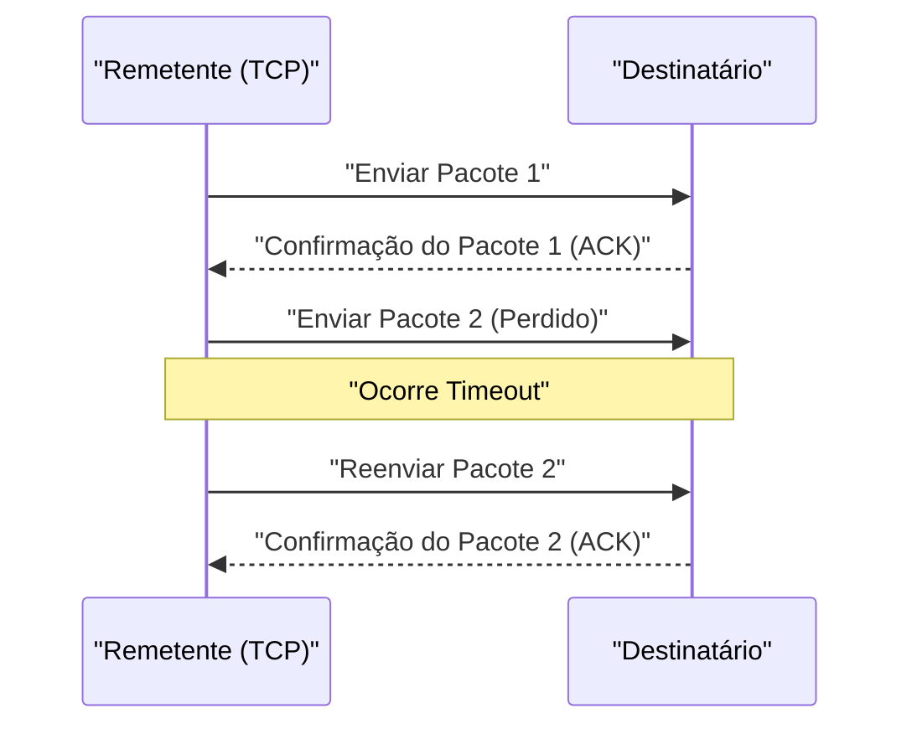

## 1. Velocidade ou Precisão? A Escolha Definitiva da Internet

Quando trocamos dados pela internet, existem dois protagonistas principais entre os protocolos (regras de comunicação) que operam na base (camada de transporte).
Um deles é o "**TCP (Transmission Control Protocol)**", que lida com a maior parte da comunicação na internet, como navegação em sites e download de arquivos.
E o outro, o protagonista deste artigo, é o "**UDP (User Datagram Protocol)**".

Se o TCP é "um entregador cuidadoso, como um correio registrado, que nunca perde uma encomenda", o UDP é como "uma máquina de arremesso super-rápida que atira encomendas uma após a outra, sem olhar para trás, mesmo que elas não cheguem".

Por que a internet precisa de um protocolo "sem garantia de entrega"?

## 2. Os Limites do TCP: O Atraso Causado pela "Precisão"

Para entender a necessidade do UDP, vamos primeiro dar uma olhada em como seu rival, o TCP, funciona.

O TCP é um protocolo "**orientado a conexão**". Antes de enviar dados, ele sempre faz uma verificação prévia (three-way handshake) com o destinatário: "Posso enviar agora?" "Pode sim".
Além disso, ao enviar dados fragmentados (pacotes), ele atribui um número de sequência a todos os pacotes e espera por confirmações de recebimento (ACK) do destinatário, como "O número 1 chegou", "O número 2 chegou". Se o pacote número 3 se perder na rede no meio do caminho e nenhuma confirmação de recebimento chegar, o TCP detecta isso com um temporizador e tenta novamente, dizendo: "Vou reenviar o número 3".

Graças a esse mecanismo, podemos visualizar belas imagens sem perder um único byte e fazer download de programas.
No entanto, esse processo de "confirmação" e "reenvio" cria um **atraso de tempo (latência) fatal**.

## 3. A Filosofia do UDP: "Não Importa se Não Chegar, Envie Agora Mesmo"

Em aplicações onde o tempo real é extremamente importante, como "jogos online (FPS e jogos de luta)", "videochamadas como Zoom" e "transmissões de esportes ao vivo", o cuidado do TCP acaba sendo um problema.

Imagine que os dados de áudio sejam interrompidos por um momento durante uma videochamada. Se você estivesse usando o TCP, o sistema faria o seguinte processamento: "Como os dados de áudio de 0,5 segundos atrás não chegaram, vou reenviá-los. Até lá, vou pausar todo o vídeo". Como resultado, a tela travaria.
Para os humanos, em chamadas em tempo real, "continuar reproduzindo o áudio atual como está, mesmo com um pouco de ruído" é muito mais importante do que "receber o áudio de 0,5 segundos atrás perfeitamente, mas com atraso".

Aqui é onde o UDP, que é do tipo "**sem conexão (connectionless)**", se destaca.

O UDP não verifica em momento algum se a outra parte está pronta para receber. Ele não numera os pacotes na sequência, não verifica se eles chegaram, nem realiza processos de reenvio.
Ele simplesmente pega os dados passados pelo aplicativo, anexa um cabeçalho (metadados mínimos, como as informações de destino) e os "joga" no mar da rede.

### O Cabeçalho do UDP é Extremamente Leve
Enquanto o cabeçalho do TCP geralmente possui 20 bytes de várias informações de controle, o cabeçalho do UDP tem apenas "**8 bytes**".
1. Número da porta de origem (2 bytes)
2. Número da porta de destino (2 bytes)
3. Comprimento do pacote (2 bytes)
4. Checksum (2 bytes: verificação mínima para confirmar que não há corrupção de dados)

Essa leveza avassaladora e simplicidade de processamento reduzem ao máximo a latência da comunicação, possibilitando uma experiência em tempo real.

## 4. Onde o UDP Atua

A característica do UDP de ser "leve e rápido, mas sem confiabilidade" é utilizada em todos os lugares da infraestrutura da internet moderna.

* **DNS (Domain Name System)**
  É um sistema que converte URLs (por exemplo, google.com) em endereços IP. Como a consulta ao DNS é um dado muito pequeno, e se nenhuma resposta retornar basta perguntar novamente, o UDP de alta velocidade é usado.
* **NTP (Network Time Protocol)**
  É uma comunicação para ajustar com precisão o relógio do seu PC ou smartphone. Como as informações de tempo não têm sentido quando ficam velhas, o UDP, que evita atrasos devido a reenvios, é o ideal.
* **Streaming e VoIP**
  As transmissões ao vivo no YouTube e chamadas de voz no LINE e Discord conseguem comunicações UDP sem atraso compensando a perda de alguns pacotes no lado do software (prevendo e preenchendo).

## 5. Uma Nova Evolução: O Protocolo "QUIC"

Por muitos anos, a internet esteve dividida entre o "TCP preciso" e o "UDP rápido", mas nos últimos anos, ocorreu uma revolução que mudou essa história.
Esse é o protocolo "**QUIC**", desenvolvido pelo Google e que serve como base do atual "HTTP/3".

O Google, querendo acelerar ainda mais o carregamento de sites, percebeu que "o atraso causado pela saudação inicial (handshake)" do TCP havia atingido seu limite. Assim, em vez de melhorar o TCP, **eles surpreendentemente usaram o UDP como base e construíram em cima dele um "procedimento de comunicação rápido e preciso" exclusivo, controlado por software**.

O QUIC, sendo baseado no UDP, pode contornar os complexos controles TCP do kernel do sistema operacional e reduzir drasticamente o tempo até o início da comunicação executando simultaneamente o handshake da sua própria criptografia de comunicação (TLS). Atualmente, quando assistimos ao YouTube ou usamos os serviços do Google, o que transporta dados em alta velocidade nos bastidores não é o TCP, mas o QUIC baseado em UDP.

O fato de o UDP, que sempre foi chamado de "não confiável", ter evoluído para a base da infraestrutura web de ponta com um pouco de engenhosidade mostra o quão poderosa pode ser a "leveza e simplicidade" no design de redes de computadores.
