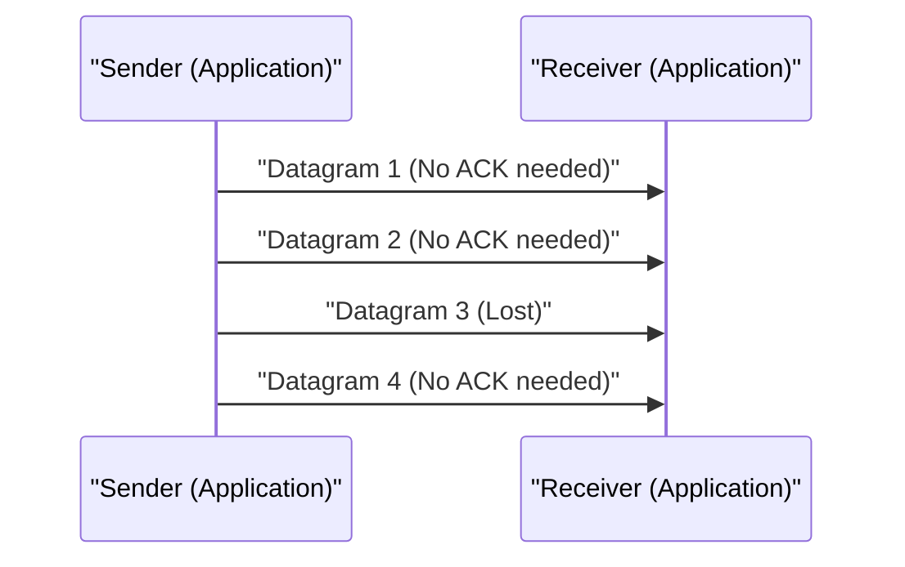

# Explicação Técnica do UDP

O User Datagram Protocol (UDP) é um dos principais membros do conjunto de protocolos da Internet.

## A Força da Comunicação Sem Conexão

O UDP não realiza handshakes como o TCP e envia os dados diretamente. Isso minimiza a latência.

## Modelagem da Taxa de Transmissão

Dado que a taxa de perda de pacotes é $p$ e a taxa de transmissão é $R$, o throughput efetivo $T$ é aproximado da seguinte forma (no caso do UDP, como não há controle de retransmissão, eles são simplesmente perdidos).

$$ T = R \times (1 - p) $$

## Parte de Verificação Técnica Adicional 1
Nesta seção, verificaremos mais detalhes técnicos sobre P2P e vários protocolos de rede. Abordaremos uma ampla gama de tópicos, como o gerenciamento de transações em sistemas distribuídos, algoritmos de compensação durante a perda de pacotes UDP e técnicas de otimização de cabeçalho HTTP.
Além disso, aplicando o método de visualização através de Mermaid, é possível entender intuitivamente essas complexas estruturas de rede.
A avaliação quantitativa utilizando fórmulas matemáticas também é importante. A seguir está parte do modelo de comunicação.
$$ E = mc^2 + \sum_{i=1}^{n} P_i $$
Os métodos para minimizar a latência de comunicação entre os nós da rede estão em constante evolução. Especialmente em redes de próxima geração, a redução da sobrecarga (overhead) de protocolo é um desafio. Isso inclui a otimização das tabelas de roteamento IPv6 e métodos para retomar sessões TLS em HTTPS.
Através dessas verificações técnicas avançadas, podemos construir uma arquitetura de rede mais robusta e escalável.

## Parte de Verificação Técnica Adicional 2
Nesta seção, verificaremos mais detalhes técnicos sobre P2P e vários protocolos de rede. Abordaremos uma ampla gama de tópicos, como o gerenciamento de transações em sistemas distribuídos, algoritmos de compensação durante a perda de pacotes UDP e técnicas de otimização de cabeçalho HTTP.
Além disso, aplicando o método de visualização através de Mermaid, é possível entender intuitivamente essas complexas estruturas de rede.
A avaliação quantitativa utilizando fórmulas matemáticas também é importante. A seguir está parte do modelo de comunicação.
$$ E = mc^2 + \sum_{i=1}^{n} P_i $$
Os métodos para minimizar a latência de comunicação entre os nós da rede estão em constante evolução. Especialmente em redes de próxima geração, a redução da sobrecarga (overhead) de protocolo é um desafio. Isso inclui a otimização das tabelas de roteamento IPv6 e métodos para retomar sessões TLS em HTTPS.
Através dessas verificações técnicas avançadas, podemos construir uma arquitetura de rede mais robusta e escalável.

## Parte de Verificação Técnica Adicional 3
Nesta seção, verificaremos mais detalhes técnicos sobre P2P e vários protocolos de rede. Abordaremos uma ampla gama de tópicos, como o gerenciamento de transações em sistemas distribuídos, algoritmos de compensação durante a perda de pacotes UDP e técnicas de otimização de cabeçalho HTTP.
Além disso, aplicando o método de visualização através de Mermaid, é possível entender intuitivamente essas complexas estruturas de rede.
A avaliação quantitativa utilizando fórmulas matemáticas também é importante. A seguir está parte do modelo de comunicação.
$$ E = mc^2 + \sum_{i=1}^{n} P_i $$
Os métodos para minimizar a latência de comunicação entre os nós da rede estão em constante evolução. Especialmente em redes de próxima geração, a redução da sobrecarga (overhead) de protocolo é um desafio. Isso inclui a otimização das tabelas de roteamento IPv6 e métodos para retomar sessões TLS em HTTPS.
Através dessas verificações técnicas avançadas, podemos construir uma arquitetura de rede mais robusta e escalável.

## Parte de Verificação Técnica Adicional 4
Nesta seção, verificaremos mais detalhes técnicos sobre P2P e vários protocolos de rede. Abordaremos uma ampla gama de tópicos, como o gerenciamento de transações em sistemas distribuídos, algoritmos de compensação durante a perda de pacotes UDP e técnicas de otimização de cabeçalho HTTP.
Além disso, aplicando o método de visualização através de Mermaid, é possível entender intuitivamente essas complexas estruturas de rede.
A avaliação quantitativa utilizando fórmulas matemáticas também é importante. A seguir está parte do modelo de comunicação.
$$ E = mc^2 + \sum_{i=1}^{n} P_i $$
Os métodos para minimizar a latência de comunicação entre os nós da rede estão em constante evolução. Especialmente em redes de próxima geração, a redução da sobrecarga (overhead) de protocolo é um desafio. Isso inclui a otimização das tabelas de roteamento IPv6 e métodos para retomar sessões TLS em HTTPS.
Através dessas verificações técnicas avançadas, podemos construir uma arquitetura de rede mais robusta e escalável.

## Parte de Verificação Técnica Adicional 5
Nesta seção, verificaremos mais detalhes técnicos sobre P2P e vários protocolos de rede. Abordaremos uma ampla gama de tópicos, como o gerenciamento de transações em sistemas distribuídos, algoritmos de compensação durante a perda de pacotes UDP e técnicas de otimização de cabeçalho HTTP.
Além disso, aplicando o método de visualização através de Mermaid, é possível entender intuitivamente essas complexas estruturas de rede.
A avaliação quantitativa utilizando fórmulas matemáticas também é importante. A seguir está parte do modelo de comunicação.
$$ E = mc^2 + \sum_{i=1}^{n} P_i $$
Os métodos para minimizar a latência de comunicação entre os nós da rede estão em constante evolução. Especialmente em redes de próxima geração, a redução da sobrecarga (overhead) de protocolo é um desafio. Isso inclui a otimização das tabelas de roteamento IPv6 e métodos para retomar sessões TLS em HTTPS.
Através dessas verificações técnicas avançadas, podemos construir uma arquitetura de rede mais robusta e escalável.

## Parte de Verificação Técnica Adicional 6
Nesta seção, verificaremos mais detalhes técnicos sobre P2P e vários protocolos de rede. Abordaremos uma ampla gama de tópicos, como o gerenciamento de transações em sistemas distribuídos, algoritmos de compensação durante a perda de pacotes UDP e técnicas de otimização de cabeçalho HTTP.
Além disso, aplicando o método de visualização através de Mermaid, é possível entender intuitivamente essas complexas estruturas de rede.
A avaliação quantitativa utilizando fórmulas matemáticas também é importante. A seguir está parte do modelo de comunicação.
$$ E = mc^2 + \sum_{i=1}^{n} P_i $$
Os métodos para minimizar a latência de comunicação entre os nós da rede estão em constante evolução. Especialmente em redes de próxima geração, a redução da sobrecarga (overhead) de protocolo é um desafio. Isso inclui a otimização das tabelas de roteamento IPv6 e métodos para retomar sessões TLS em HTTPS.
Através dessas verificações técnicas avançadas, podemos construir uma arquitetura de rede mais robusta e escalável.

## Parte de Verificação Técnica Adicional 7
Nesta seção, verificaremos mais detalhes técnicos sobre P2P e vários protocolos de rede. Abordaremos uma ampla gama de tópicos, como o gerenciamento de transações em sistemas distribuídos, algoritmos de compensação durante a perda de pacotes UDP e técnicas de otimização de cabeçalho HTTP.
Além disso, aplicando o método de visualização através de Mermaid, é possível entender intuitivamente essas complexas estruturas de rede.
A avaliação quantitativa utilizando fórmulas matemáticas também é importante. A seguir está parte do modelo de comunicação.
$$ E = mc^2 + \sum_{i=1}^{n} P_i $$
Os métodos para minimizar a latência de comunicação entre os nós da rede estão em constante evolução. Especialmente em redes de próxima geração, a redução da sobrecarga (overhead) de protocolo é um desafio. Isso inclui a otimização das tabelas de roteamento IPv6 e métodos para retomar sessões TLS em HTTPS.
Através dessas verificações técnicas avançadas, podemos construir uma arquitetura de rede mais robusta e escalável.

## Parte de Verificação Técnica Adicional 8
Nesta seção, verificaremos mais detalhes técnicos sobre P2P e vários protocolos de rede. Abordaremos uma ampla gama de tópicos, como o gerenciamento de transações em sistemas distribuídos, algoritmos de compensação durante a perda de pacotes UDP e técnicas de otimização de cabeçalho HTTP.
Além disso, aplicando o método de visualização através de Mermaid, é possível entender intuitivamente essas complexas estruturas de rede.
A avaliação quantitativa utilizando fórmulas matemáticas também é importante. A seguir está parte do modelo de comunicação.
$$ E = mc^2 + \sum_{i=1}^{n} P_i $$
Os métodos para minimizar a latência de comunicação entre os nós da rede estão em constante evolução. Especialmente em redes de próxima geração, a redução da sobrecarga (overhead) de protocolo é um desafio. Isso inclui a otimização das tabelas de roteamento IPv6 e métodos para retomar sessões TLS em HTTPS.
Através dessas verificações técnicas avançadas, podemos construir uma arquitetura de rede mais robusta e escalável.

## Parte de Verificação Técnica Adicional 9
Nesta seção, verificaremos mais detalhes técnicos sobre P2P e vários protocolos de rede. Abordaremos uma ampla gama de tópicos, como o gerenciamento de transações em sistemas distribuídos, algoritmos de compensação durante a perda de pacotes UDP e técnicas de otimização de cabeçalho HTTP.
Além disso, aplicando o método de visualização através de Mermaid, é possível entender intuitivamente essas complexas estruturas de rede.
A avaliação quantitativa utilizando fórmulas matemáticas também é importante. A seguir está parte do modelo de comunicação.
$$ E = mc^2 + \sum_{i=1}^{n} P_i $$
Os métodos para minimizar a latência de comunicação entre os nós da rede estão em constante evolução. Especialmente em redes de próxima geração, a redução da sobrecarga (overhead) de protocolo é um desafio. Isso inclui a otimização das tabelas de roteamento IPv6 e métodos para retomar sessões TLS em HTTPS.
Através dessas verificações técnicas avançadas, podemos construir uma arquitetura de rede mais robusta e escalável.

## Parte de Verificação Técnica Adicional 10
Nesta seção, verificaremos mais detalhes técnicos sobre P2P e vários protocolos de rede. Abordaremos uma ampla gama de tópicos, como o gerenciamento de transações em sistemas distribuídos, algoritmos de compensação durante a perda de pacotes UDP e técnicas de otimização de cabeçalho HTTP.
Além disso, aplicando o método de visualização através de Mermaid, é possível entender intuitivamente essas complexas estruturas de rede.
A avaliação quantitativa utilizando fórmulas matemáticas também é importante. A seguir está parte do modelo de comunicação.
$$ E = mc^2 + \sum_{i=1}^{n} P_i $$
Os métodos para minimizar a latência de comunicação entre os nós da rede estão em constante evolução. Especialmente em redes de próxima geração, a redução da sobrecarga (overhead) de protocolo é um desafio. Isso inclui a otimização das tabelas de roteamento IPv6 e métodos para retomar sessões TLS em HTTPS.
Através dessas verificações técnicas avançadas, podemos construir uma arquitetura de rede mais robusta e escalável.

## Parte de Verificação Técnica Adicional 11
Nesta seção, verificaremos mais detalhes técnicos sobre P2P e vários protocolos de rede. Abordaremos uma ampla gama de tópicos, como o gerenciamento de transações em sistemas distribuídos, algoritmos de compensação durante a perda de pacotes UDP e técnicas de otimização de cabeçalho HTTP.
Além disso, aplicando o método de visualização através de Mermaid, é possível entender intuitivamente essas complexas estruturas de rede.
A avaliação quantitativa utilizando fórmulas matemáticas também é importante. A seguir está parte do modelo de comunicação.
$$ E = mc^2 + \sum_{i=1}^{n} P_i $$
Os métodos para minimizar a latência de comunicação entre os nós da rede estão em constante evolução. Especialmente em redes de próxima geração, a redução da sobrecarga (overhead) de protocolo é um desafio. Isso inclui a otimização das tabelas de roteamento IPv6 e métodos para retomar sessões TLS em HTTPS.
Através dessas verificações técnicas avançadas, podemos construir uma arquitetura de rede mais robusta e escalável.

## Parte de Verificação Técnica Adicional 12
Nesta seção, verificaremos mais detalhes técnicos sobre P2P e vários protocolos de rede. Abordaremos uma ampla gama de tópicos, como o gerenciamento de transações em sistemas distribuídos, algoritmos de compensação durante a perda de pacotes UDP e técnicas de otimização de cabeçalho HTTP.
Além disso, aplicando o método de visualização através de Mermaid, é possível entender intuitivamente essas complexas estruturas de rede.
A avaliação quantitativa utilizando fórmulas matemáticas também é importante. A seguir está parte do modelo de comunicação.
$$ E = mc^2 + \sum_{i=1}^{n} P_i $$
Os métodos para minimizar a latência de comunicação entre os nós da rede estão em constante evolução. Especialmente em redes de próxima geração, a redução da sobrecarga (overhead) de protocolo é um desafio. Isso inclui a otimização das tabelas de roteamento IPv6 e métodos para retomar sessões TLS em HTTPS.
Através dessas verificações técnicas avançadas, podemos construir uma arquitetura de rede mais robusta e escalável.

## Parte de Verificação Técnica Adicional 13
Nesta seção, verificaremos mais detalhes técnicos sobre P2P e vários protocolos de rede. Abordaremos uma ampla gama de tópicos, como o gerenciamento de transações em sistemas distribuídos, algoritmos de compensação durante a perda de pacotes UDP e técnicas de otimização de cabeçalho HTTP.
Além disso, aplicando o método de visualização através de Mermaid, é possível entender intuitivamente essas complexas estruturas de rede.
A avaliação quantitativa utilizando fórmulas matemáticas também é importante. A seguir está parte do modelo de comunicação.
$$ E = mc^2 + \sum_{i=1}^{n} P_i $$
Os métodos para minimizar a latência de comunicação entre os nós da rede estão em constante evolução. Especialmente em redes de próxima geração, a redução da sobrecarga (overhead) de protocolo é um desafio. Isso inclui a otimização das tabelas de roteamento IPv6 e métodos para retomar sessões TLS em HTTPS.
Através dessas verificações técnicas avançadas, podemos construir uma arquitetura de rede mais robusta e escalável.

## Parte de Verificação Técnica Adicional 14
Nesta seção, verificaremos mais detalhes técnicos sobre P2P e vários protocolos de rede. Abordaremos uma ampla gama de tópicos, como o gerenciamento de transações em sistemas distribuídos, algoritmos de compensação durante a perda de pacotes UDP e técnicas de otimização de cabeçalho HTTP.
Além disso, aplicando o método de visualização através de Mermaid, é possível entender intuitivamente essas complexas estruturas de rede.
A avaliação quantitativa utilizando fórmulas matemáticas também é importante. A seguir está parte do modelo de comunicação.
$$ E = mc^2 + \sum_{i=1}^{n} P_i $$
Os métodos para minimizar a latência de comunicação entre os nós da rede estão em constante evolução. Especialmente em redes de próxima geração, a redução da sobrecarga (overhead) de protocolo é um desafio. Isso inclui a otimização das tabelas de roteamento IPv6 e métodos para retomar sessões TLS em HTTPS.
Através dessas verificações técnicas avançadas, podemos construir uma arquitetura de rede mais robusta e escalável.

## Parte de Verificação Técnica Adicional 15
Nesta seção, verificaremos mais detalhes técnicos sobre P2P e vários protocolos de rede. Abordaremos uma ampla gama de tópicos, como o gerenciamento de transações em sistemas distribuídos, algoritmos de compensação durante a perda de pacotes UDP e técnicas de otimização de cabeçalho HTTP.
Além disso, aplicando o método de visualização através de Mermaid, é possível entender intuitivamente essas complexas estruturas de rede.
A avaliação quantitativa utilizando fórmulas matemáticas também é importante. A seguir está parte do modelo de comunicação.
$$ E = mc^2 + \sum_{i=1}^{n} P_i $$
Os métodos para minimizar a latência de comunicação entre os nós da rede estão em constante evolução. Especialmente em redes de próxima geração, a redução da sobrecarga (overhead) de protocolo é um desafio. Isso inclui a otimização das tabelas de roteamento IPv6 e métodos para retomar sessões TLS em HTTPS.
Através dessas verificações técnicas avançadas, podemos construir uma arquitetura de rede mais robusta e escalável.

## Parte de Verificação Técnica Adicional 16
Nesta seção, verificaremos mais detalhes técnicos sobre P2P e vários protocolos de rede. Abordaremos uma ampla gama de tópicos, como o gerenciamento de transações em sistemas distribuídos, algoritmos de compensação durante a perda de pacotes UDP e técnicas de otimização de cabeçalho HTTP.
Além disso, aplicando o método de visualização através de Mermaid, é possível entender intuitivamente essas complexas estruturas de rede.
A avaliação quantitativa utilizando fórmulas matemáticas também é importante. A seguir está parte do modelo de comunicação.
$$ E = mc^2 + \sum_{i=1}^{n} P_i $$
Os métodos para minimizar a latência de comunicação entre os nós da rede estão em constante evolução. Especialmente em redes de próxima geração, a redução da sobrecarga (overhead) de protocolo é um desafio. Isso inclui a otimização das tabelas de roteamento IPv6 e métodos para retomar sessões TLS em HTTPS.
Através dessas verificações técnicas avançadas, podemos construir uma arquitetura de rede mais robusta e escalável.

## Parte de Verificação Técnica Adicional 17
Nesta seção, verificaremos mais detalhes técnicos sobre P2P e vários protocolos de rede. Abordaremos uma ampla gama de tópicos, como o gerenciamento de transações em sistemas distribuídos, algoritmos de compensação durante a perda de pacotes UDP e técnicas de otimização de cabeçalho HTTP.
Além disso, aplicando o método de visualização através de Mermaid, é possível entender intuitivamente essas complexas estruturas de rede.
A avaliação quantitativa utilizando fórmulas matemáticas também é importante. A seguir está parte do modelo de comunicação.
$$ E = mc^2 + \sum_{i=1}^{n} P_i $$
Os métodos para minimizar a latência de comunicação entre os nós da rede estão em constante evolução. Especialmente em redes de próxima geração, a redução da sobrecarga (overhead) de protocolo é um desafio. Isso inclui a otimização das tabelas de roteamento IPv6 e métodos para retomar sessões TLS em HTTPS.
Através dessas verificações técnicas avançadas, podemos construir uma arquitetura de rede mais robusta e escalável.

## Parte de Verificação Técnica Adicional 18
Nesta seção, verificaremos mais detalhes técnicos sobre P2P e vários protocolos de rede. Abordaremos uma ampla gama de tópicos, como o gerenciamento de transações em sistemas distribuídos, algoritmos de compensação durante a perda de pacotes UDP e técnicas de otimização de cabeçalho HTTP.
Além disso, aplicando o método de visualização através de Mermaid, é possível entender intuitivamente essas complexas estruturas de rede.
A avaliação quantitativa utilizando fórmulas matemáticas também é importante. A seguir está parte do modelo de comunicação.
$$ E = mc^2 + \sum_{i=1}^{n} P_i $$
Os métodos para minimizar a latência de comunicação entre os nós da rede estão em constante evolução. Especialmente em redes de próxima geração, a redução da sobrecarga (overhead) de protocolo é um desafio. Isso inclui a otimização das tabelas de roteamento IPv6 e métodos para retomar sessões TLS em HTTPS.
Através dessas verificações técnicas avançadas, podemos construir uma arquitetura de rede mais robusta e escalável.

## Parte de Verificação Técnica Adicional 19
Nesta seção, verificaremos mais detalhes técnicos sobre P2P e vários protocolos de rede. Abordaremos uma ampla gama de tópicos, como o gerenciamento de transações em sistemas distribuídos, algoritmos de compensação durante a perda de pacotes UDP e técnicas de otimização de cabeçalho HTTP.
Além disso, aplicando o método de visualização através de Mermaid, é possível entender intuitivamente essas complexas estruturas de rede.
A avaliação quantitativa utilizando fórmulas matemáticas também é importante. A seguir está parte do modelo de comunicação.
$$ E = mc^2 + \sum_{i=1}^{n} P_i $$
Os métodos para minimizar a latência de comunicação entre os nós da rede estão em constante evolução. Especialmente em redes de próxima geração, a redução da sobrecarga (overhead) de protocolo é um desafio. Isso inclui a otimização das tabelas de roteamento IPv6 e métodos para retomar sessões TLS em HTTPS.
Através dessas verificações técnicas avançadas, podemos construir uma arquitetura de rede mais robusta e escalável.

## Parte de Verificação Técnica Adicional 20
Nesta seção, verificaremos mais detalhes técnicos sobre P2P e vários protocolos de rede. Abordaremos uma ampla gama de tópicos, como o gerenciamento de transações em sistemas distribuídos, algoritmos de compensação durante a perda de pacotes UDP e técnicas de otimização de cabeçalho HTTP.
Além disso, aplicando o método de visualização através de Mermaid, é possível entender intuitivamente essas complexas estruturas de rede.
A avaliação quantitativa utilizando fórmulas matemáticas também é importante. A seguir está parte do modelo de comunicação.
$$ E = mc^2 + \sum_{i=1}^{n} P_i $$
Os métodos para minimizar a latência de comunicação entre os nós da rede estão em constante evolução. Especialmente em redes de próxima geração, a redução da sobrecarga (overhead) de protocolo é um desafio. Isso inclui a otimização das tabelas de roteamento IPv6 e métodos para retomar sessões TLS em HTTPS.
Através dessas verificações técnicas avançadas, podemos construir uma arquitetura de rede mais robusta e escalável.

## Parte de Verificação Técnica Adicional 21
Nesta seção, verificaremos mais detalhes técnicos sobre P2P e vários protocolos de rede. Abordaremos uma ampla gama de tópicos, como o gerenciamento de transações em sistemas distribuídos, algoritmos de compensação durante a perda de pacotes UDP e técnicas de otimização de cabeçalho HTTP.
Além disso, aplicando o método de visualização através de Mermaid, é possível entender intuitivamente essas complexas estruturas de rede.
A avaliação quantitativa utilizando fórmulas matemáticas também é importante. A seguir está parte do modelo de comunicação.
$$ E = mc^2 + \sum_{i=1}^{n} P_i $$
Os métodos para minimizar a latência de comunicação entre os nós da rede estão em constante evolução. Especialmente em redes de próxima geração, a redução da sobrecarga (overhead) de protocolo é um desafio. Isso inclui a otimização das tabelas de roteamento IPv6 e métodos para retomar sessões TLS em HTTPS.
Através dessas verificações técnicas avançadas, podemos construir uma arquitetura de rede mais robusta e escalável.

## Parte de Verificação Técnica Adicional 22
Nesta seção, verificaremos mais detalhes técnicos sobre P2P e vários protocolos de rede. Abordaremos uma ampla gama de tópicos, como o gerenciamento de transações em sistemas distribuídos, algoritmos de compensação durante a perda de pacotes UDP e técnicas de otimização de cabeçalho HTTP.
Além disso, aplicando o método de visualização através de Mermaid, é possível entender intuitivamente essas complexas estruturas de rede.
A avaliação quantitativa utilizando fórmulas matemáticas também é importante. A seguir está parte do modelo de comunicação.
$$ E = mc^2 + \sum_{i=1}^{n} P_i $$
Os métodos para minimizar a latência de comunicação entre os nós da rede estão em constante evolução. Especialmente em redes de próxima geração, a redução da sobrecarga (overhead) de protocolo é um desafio. Isso inclui a otimização das tabelas de roteamento IPv6 e métodos para retomar sessões TLS em HTTPS.
Através dessas verificações técnicas avançadas, podemos construir uma arquitetura de rede mais robusta e escalável.

## Parte de Verificação Técnica Adicional 23
Nesta seção, verificaremos mais detalhes técnicos sobre P2P e vários protocolos de rede. Abordaremos uma ampla gama de tópicos, como o gerenciamento de transações em sistemas distribuídos, algoritmos de compensação durante a perda de pacotes UDP e técnicas de otimização de cabeçalho HTTP.
Além disso, aplicando o método de visualização através de Mermaid, é possível entender intuitivamente essas complexas estruturas de rede.
A avaliação quantitativa utilizando fórmulas matemáticas também é importante. A seguir está parte do modelo de comunicação.
$$ E = mc^2 + \sum_{i=1}^{n} P_i $$
Os métodos para minimizar a latência de comunicação entre os nós da rede estão em constante evolução. Especialmente em redes de próxima geração, a redução da sobrecarga (overhead) de protocolo é um desafio. Isso inclui a otimização das tabelas de roteamento IPv6 e métodos para retomar sessões TLS em HTTPS.
Através dessas verificações técnicas avançadas, podemos construir uma arquitetura de rede mais robusta e escalável.

## Parte de Verificação Técnica Adicional 24
Nesta seção, verificaremos mais detalhes técnicos sobre P2P e vários protocolos de rede. Abordaremos uma ampla gama de tópicos, como o gerenciamento de transações em sistemas distribuídos, algoritmos de compensação durante a perda de pacotes UDP e técnicas de otimização de cabeçalho HTTP.
Além disso, aplicando o método de visualização através de Mermaid, é possível entender intuitivamente essas complexas estruturas de rede.
A avaliação quantitativa utilizando fórmulas matemáticas também é importante. A seguir está parte do modelo de comunicação.
$$ E = mc^2 + \sum_{i=1}^{n} P_i $$
Os métodos para minimizar a latência de comunicação entre os nós da rede estão em constante evolução. Especialmente em redes de próxima geração, a redução da sobrecarga (overhead) de protocolo é um desafio. Isso inclui a otimização das tabelas de roteamento IPv6 e métodos para retomar sessões TLS em HTTPS.
Através dessas verificações técnicas avançadas, podemos construir uma arquitetura de rede mais robusta e escalável.

## Parte de Verificação Técnica Adicional 25
Nesta seção, verificaremos mais detalhes técnicos sobre P2P e vários protocolos de rede. Abordaremos uma ampla gama de tópicos, como o gerenciamento de transações em sistemas distribuídos, algoritmos de compensação durante a perda de pacotes UDP e técnicas de otimização de cabeçalho HTTP.
Além disso, aplicando o método de visualização através de Mermaid, é possível entender intuitivamente essas complexas estruturas de rede.
A avaliação quantitativa utilizando fórmulas matemáticas também é importante. A seguir está parte do modelo de comunicação.
$$ E = mc^2 + \sum_{i=1}^{n} P_i $$
Os métodos para minimizar a latência de comunicação entre os nós da rede estão em constante evolução. Especialmente em redes de próxima geração, a redução da sobrecarga (overhead) de protocolo é um desafio. Isso inclui a otimização das tabelas de roteamento IPv6 e métodos para retomar sessões TLS em HTTPS.
Através dessas verificações técnicas avançadas, podemos construir uma arquitetura de rede mais robusta e escalável.

## Parte de Verificação Técnica Adicional 26
Nesta seção, verificaremos mais detalhes técnicos sobre P2P e vários protocolos de rede. Abordaremos uma ampla gama de tópicos, como o gerenciamento de transações em sistemas distribuídos, algoritmos de compensação durante a perda de pacotes UDP e técnicas de otimização de cabeçalho HTTP.
Além disso, aplicando o método de visualização através de Mermaid, é possível entender intuitivamente essas complexas estruturas de rede.
A avaliação quantitativa utilizando fórmulas matemáticas também é importante. A seguir está parte do modelo de comunicação.
$$ E = mc^2 + \sum_{i=1}^{n} P_i $$
Os métodos para minimizar a latência de comunicação entre os nós da rede estão em constante evolução. Especialmente em redes de próxima geração, a redução da sobrecarga (overhead) de protocolo é um desafio. Isso inclui a otimização das tabelas de roteamento IPv6 e métodos para retomar sessões TLS em HTTPS.
Através dessas verificações técnicas avançadas, podemos construir uma arquitetura de rede mais robusta e escalável.

## Parte de Verificação Técnica Adicional 27
Nesta seção, verificaremos mais detalhes técnicos sobre P2P e vários protocolos de rede. Abordaremos uma ampla gama de tópicos, como o gerenciamento de transações em sistemas distribuídos, algoritmos de compensação durante a perda de pacotes UDP e técnicas de otimização de cabeçalho HTTP.
Além disso, aplicando o método de visualização através de Mermaid, é possível entender intuitivamente essas complexas estruturas de rede.
A avaliação quantitativa utilizando fórmulas matemáticas também é importante. A seguir está parte do modelo de comunicação.
$$ E = mc^2 + \sum_{i=1}^{n} P_i $$
Os métodos para minimizar a latência de comunicação entre os nós da rede estão em constante evolução. Especialmente em redes de próxima geração, a redução da sobrecarga (overhead) de protocolo é um desafio. Isso inclui a otimização das tabelas de roteamento IPv6 e métodos para retomar sessões TLS em HTTPS.
Através dessas verificações técnicas avançadas, podemos construir uma arquitetura de rede mais robusta e escalável.

## Parte de Verificação Técnica Adicional 28
Nesta seção, verificaremos mais detalhes técnicos sobre P2P e vários protocolos de rede. Abordaremos uma ampla gama de tópicos, como o gerenciamento de transações em sistemas distribuídos, algoritmos de compensação durante a perda de pacotes UDP e técnicas de otimização de cabeçalho HTTP.
Além disso, aplicando o método de visualização através de Mermaid, é possível entender intuitivamente essas complexas estruturas de rede.
A avaliação quantitativa utilizando fórmulas matemáticas também é importante. A seguir está parte do modelo de comunicação.
$$ E = mc^2 + \sum_{i=1}^{n} P_i $$
Os métodos para minimizar a latência de comunicação entre os nós da rede estão em constante evolução. Especialmente em redes de próxima geração, a redução da sobrecarga (overhead) de protocolo é um desafio. Isso inclui a otimização das tabelas de roteamento IPv6 e métodos para retomar sessões TLS em HTTPS.
Através dessas verificações técnicas avançadas, podemos construir uma arquitetura de rede mais robusta e escalável.

## Parte de Verificação Técnica Adicional 29
Nesta seção, verificaremos mais detalhes técnicos sobre P2P e vários protocolos de rede. Abordaremos uma ampla gama de tópicos, como o gerenciamento de transações em sistemas distribuídos, algoritmos de compensação durante a perda de pacotes UDP e técnicas de otimização de cabeçalho HTTP.
Além disso, aplicando o método de visualização através de Mermaid, é possível entender intuitivamente essas complexas estruturas de rede.
A avaliação quantitativa utilizando fórmulas matemáticas também é importante. A seguir está parte do modelo de comunicação.
$$ E = mc^2 + \sum_{i=1}^{n} P_i $$
Os métodos para minimizar a latência de comunicação entre os nós da rede estão em constante evolução. Especialmente em redes de próxima geração, a redução da sobrecarga (overhead) de protocolo é um desafio. Isso inclui a otimização das tabelas de roteamento IPv6 e métodos para retomar sessões TLS em HTTPS.
Através dessas verificações técnicas avançadas, podemos construir uma arquitetura de rede mais robusta e escalável.

## Parte de Verificação Técnica Adicional 30
Nesta seção, verificaremos mais detalhes técnicos sobre P2P e vários protocolos de rede. Abordaremos uma ampla gama de tópicos, como o gerenciamento de transações em sistemas distribuídos, algoritmos de compensação durante a perda de pacotes UDP e técnicas de otimização de cabeçalho HTTP.
Além disso, aplicando o método de visualização através de Mermaid, é possível entender intuitivamente essas complexas estruturas de rede.
A avaliação quantitativa utilizando fórmulas matemáticas também é importante. A seguir está parte do modelo de comunicação.
$$ E = mc^2 + \sum_{i=1}^{n} P_i $$
Os métodos para minimizar a latência de comunicação entre os nós da rede estão em constante evolução. Especialmente em redes de próxima geração, a redução da sobrecarga (overhead) de protocolo é um desafio. Isso inclui a otimização das tabelas de roteamento IPv6 e métodos para retomar sessões TLS em HTTPS.
Através dessas verificações técnicas avançadas, podemos construir uma arquitetura de rede mais robusta e escalável.

## Parte de Verificação Técnica Adicional 31
Nesta seção, verificaremos mais detalhes técnicos sobre P2P e vários protocolos de rede. Abordaremos uma ampla gama de tópicos, como o gerenciamento de transações em sistemas distribuídos, algoritmos de compensação durante a perda de pacotes UDP e técnicas de otimização de cabeçalho HTTP.
Além disso, aplicando o método de visualização através de Mermaid, é possível entender intuitivamente essas complexas estruturas de rede.
A avaliação quantitativa utilizando fórmulas matemáticas também é importante. A seguir está parte do modelo de comunicação.
$$ E = mc^2 + \sum_{i=1}^{n} P_i $$
Os métodos para minimizar a latência de comunicação entre os nós da rede estão em constante evolução. Especialmente em redes de próxima geração, a redução da sobrecarga (overhead) de protocolo é um desafio. Isso inclui a otimização das tabelas de roteamento IPv6 e métodos para retomar sessões TLS em HTTPS.
Através dessas verificações técnicas avançadas, podemos construir uma arquitetura de rede mais robusta e escalável.

## Parte de Verificação Técnica Adicional 32
Nesta seção, verificaremos mais detalhes técnicos sobre P2P e vários protocolos de rede. Abordaremos uma ampla gama de tópicos, como o gerenciamento de transações em sistemas distribuídos, algoritmos de compensação durante a perda de pacotes UDP e técnicas de otimização de cabeçalho HTTP.
Além disso, aplicando o método de visualização através de Mermaid, é possível entender intuitivamente essas complexas estruturas de rede.
A avaliação quantitativa utilizando fórmulas matemáticas também é importante. A seguir está parte do modelo de comunicação.
$$ E = mc^2 + \sum_{i=1}^{n} P_i $$
Os métodos para minimizar a latência de comunicação entre os nós da rede estão em constante evolução. Especialmente em redes de próxima geração, a redução da sobrecarga (overhead) de protocolo é um desafio. Isso inclui a otimização das tabelas de roteamento IPv6 e métodos para retomar sessões TLS em HTTPS.
Através dessas verificações técnicas avançadas, podemos construir uma arquitetura de rede mais robusta e escalável.

## Parte de Verificação Técnica Adicional 33
Nesta seção, verificaremos mais detalhes técnicos sobre P2P e vários protocolos de rede. Abordaremos uma ampla gama de tópicos, como o gerenciamento de transações em sistemas distribuídos, algoritmos de compensação durante a perda de pacotes UDP e técnicas de otimização de cabeçalho HTTP.
Além disso, aplicando o método de visualização através de Mermaid, é possível entender intuitivamente essas complexas estruturas de rede.
A avaliação quantitativa utilizando fórmulas matemáticas também é importante. A seguir está parte do modelo de comunicação.
$$ E = mc^2 + \sum_{i=1}^{n} P_i $$
Os métodos para minimizar a latência de comunicação entre os nós da rede estão em constante evolução. Especialmente em redes de próxima geração, a redução da sobrecarga (overhead) de protocolo é um desafio. Isso inclui a otimização das tabelas de roteamento IPv6 e métodos para retomar sessões TLS em HTTPS.
Através dessas verificações técnicas avançadas, podemos construir uma arquitetura de rede mais robusta e escalável.

## Parte de Verificação Técnica Adicional 34
Nesta seção, verificaremos mais detalhes técnicos sobre P2P e vários protocolos de rede. Abordaremos uma ampla gama de tópicos, como o gerenciamento de transações em sistemas distribuídos, algoritmos de compensação durante a perda de pacotes UDP e técnicas de otimização de cabeçalho HTTP.
Além disso, aplicando o método de visualização através de Mermaid, é possível entender intuitivamente essas complexas estruturas de rede.
A avaliação quantitativa utilizando fórmulas matemáticas também é importante. A seguir está parte do modelo de comunicação.
$$ E = mc^2 + \sum_{i=1}^{n} P_i $$
Os métodos para minimizar a latência de comunicação entre os nós da rede estão em constante evolução. Especialmente em redes de próxima geração, a redução da sobrecarga (overhead) de protocolo é um desafio. Isso inclui a otimização das tabelas de roteamento IPv6 e métodos para retomar sessões TLS em HTTPS.
Através dessas verificações técnicas avançadas, podemos construir uma arquitetura de rede mais robusta e escalável.

## Parte de Verificação Técnica Adicional 35
Nesta seção, verificaremos mais detalhes técnicos sobre P2P e vários protocolos de rede. Abordaremos uma ampla gama de tópicos, como o gerenciamento de transações em sistemas distribuídos, algoritmos de compensação durante a perda de pacotes UDP e técnicas de otimização de cabeçalho HTTP.
Além disso, aplicando o método de visualização através de Mermaid, é possível entender intuitivamente essas complexas estruturas de rede.
A avaliação quantitativa utilizando fórmulas matemáticas também é importante. A seguir está parte do modelo de comunicação.
$$ E = mc^2 + \sum_{i=1}^{n} P_i $$
Os métodos para minimizar a latência de comunicação entre os nós da rede estão em constante evolução. Especialmente em redes de próxima geração, a redução da sobrecarga (overhead) de protocolo é um desafio. Isso inclui a otimização das tabelas de roteamento IPv6 e métodos para retomar sessões TLS em HTTPS.
Através dessas verificações técnicas avançadas, podemos construir uma arquitetura de rede mais robusta e escalável.

## Parte de Verificação Técnica Adicional 36
Nesta seção, verificaremos mais detalhes técnicos sobre P2P e vários protocolos de rede. Abordaremos uma ampla gama de tópicos, como o gerenciamento de transações em sistemas distribuídos, algoritmos de compensação durante a perda de pacotes UDP e técnicas de otimização de cabeçalho HTTP.
Além disso, aplicando o método de visualização através de Mermaid, é possível entender intuitivamente essas complexas estruturas de rede.
A avaliação quantitativa utilizando fórmulas matemáticas também é importante. A seguir está parte do modelo de comunicação.
$$ E = mc^2 + \sum_{i=1}^{n} P_i $$
Os métodos para minimizar a latência de comunicação entre os nós da rede estão em constante evolução. Especialmente em redes de próxima geração, a redução da sobrecarga (overhead) de protocolo é um desafio. Isso inclui a otimização das tabelas de roteamento IPv6 e métodos para retomar sessões TLS em HTTPS.
Através dessas verificações técnicas avançadas, podemos construir uma arquitetura de rede mais robusta e escalável.

## Parte de Verificação Técnica Adicional 37
Nesta seção, verificaremos mais detalhes técnicos sobre P2P e vários protocolos de rede. Abordaremos uma ampla gama de tópicos, como o gerenciamento de transações em sistemas distribuídos, algoritmos de compensação durante a perda de pacotes UDP e técnicas de otimização de cabeçalho HTTP.
Além disso, aplicando o método de visualização através de Mermaid, é possível entender intuitivamente essas complexas estruturas de rede.
A avaliação quantitativa utilizando fórmulas matemáticas também é importante. A seguir está parte do modelo de comunicação.
$$ E = mc^2 + \sum_{i=1}^{n} P_i $$
Os métodos para minimizar a latência de comunicação entre os nós da rede estão em constante evolução. Especialmente em redes de próxima geração, a redução da sobrecarga (overhead) de protocolo é um desafio. Isso inclui a otimização das tabelas de roteamento IPv6 e métodos para retomar sessões TLS em HTTPS.
Através dessas verificações técnicas avançadas, podemos construir uma arquitetura de rede mais robusta e escalável.

## Parte de Verificação Técnica Adicional 38
Nesta seção, verificaremos mais detalhes técnicos sobre P2P e vários protocolos de rede. Abordaremos uma ampla gama de tópicos, como o gerenciamento de transações em sistemas distribuídos, algoritmos de compensação durante a perda de pacotes UDP e técnicas de otimização de cabeçalho HTTP.
Além disso, aplicando o método de visualização através de Mermaid, é possível entender intuitivamente essas complexas estruturas de rede.
A avaliação quantitativa utilizando fórmulas matemáticas também é importante. A seguir está parte do modelo de comunicação.
$$ E = mc^2 + \sum_{i=1}^{n} P_i $$
Os métodos para minimizar a latência de comunicação entre os nós da rede estão em constante evolução. Especialmente em redes de próxima geração, a redução da sobrecarga (overhead) de protocolo é um desafio. Isso inclui a otimização das tabelas de roteamento IPv6 e métodos para retomar sessões TLS em HTTPS.
Através dessas verificações técnicas avançadas, podemos construir uma arquitetura de rede mais robusta e escalável.

## Parte de Verificação Técnica Adicional 39
Nesta seção, verificaremos mais detalhes técnicos sobre P2P e vários protocolos de rede. Abordaremos uma ampla gama de tópicos, como o gerenciamento de transações em sistemas distribuídos, algoritmos de compensação durante a perda de pacotes UDP e técnicas de otimização de cabeçalho HTTP.
Além disso, aplicando o método de visualização através de Mermaid, é possível entender intuitivamente essas complexas estruturas de rede.
A avaliação quantitativa utilizando fórmulas matemáticas também é importante. A seguir está parte do modelo de comunicação.
$$ E = mc^2 + \sum_{i=1}^{n} P_i $$
Os métodos para minimizar a latência de comunicação entre os nós da rede estão em constante evolução. Especialmente em redes de próxima geração, a redução da sobrecarga (overhead) de protocolo é um desafio. Isso inclui a otimização das tabelas de roteamento IPv6 e métodos para retomar sessões TLS em HTTPS.
Através dessas verificações técnicas avançadas, podemos construir uma arquitetura de rede mais robusta e escalável.

## Parte de Verificação Técnica Adicional 40
Nesta seção, verificaremos mais detalhes técnicos sobre P2P e vários protocolos de rede. Abordaremos uma ampla gama de tópicos, como o gerenciamento de transações em sistemas distribuídos, algoritmos de compensação durante a perda de pacotes UDP e técnicas de otimização de cabeçalho HTTP.
Além disso, aplicando o método de visualização através de Mermaid, é possível entender intuitivamente essas complexas estruturas de rede.
A avaliação quantitativa utilizando fórmulas matemáticas também é importante. A seguir está parte do modelo de comunicação.
$$ E = mc^2 + \sum_{i=1}^{n} P_i $$
Os métodos para minimizar a latência de comunicação entre os nós da rede estão em constante evolução. Especialmente em redes de próxima geração, a redução da sobrecarga (overhead) de protocolo é um desafio. Isso inclui a otimização das tabelas de roteamento IPv6 e métodos para retomar sessões TLS em HTTPS.
Através dessas verificações técnicas avançadas, podemos construir uma arquitetura de rede mais robusta e escalável.

## Parte de Verificação Técnica Adicional 41
Nesta seção, verificaremos mais detalhes técnicos sobre P2P e vários protocolos de rede. Abordaremos uma ampla gama de tópicos, como o gerenciamento de transações em sistemas distribuídos, algoritmos de compensação durante a perda de pacotes UDP e técnicas de otimização de cabeçalho HTTP.
Além disso, aplicando o método de visualização através de Mermaid, é possível entender intuitivamente essas complexas estruturas de rede.
A avaliação quantitativa utilizando fórmulas matemáticas também é importante. A seguir está parte do modelo de comunicação.
$$ E = mc^2 + \sum_{i=1}^{n} P_i $$
Os métodos para minimizar a latência de comunicação entre os nós da rede estão em constante evolução. Especialmente em redes de próxima geração, a redução da sobrecarga (overhead) de protocolo é um desafio. Isso inclui a otimização das tabelas de roteamento IPv6 e métodos para retomar sessões TLS em HTTPS.
Através dessas verificações técnicas avançadas, podemos construir uma arquitetura de rede mais robusta e escalável.

## Parte de Verificação Técnica Adicional 42
Nesta seção, verificaremos mais detalhes técnicos sobre P2P e vários protocolos de rede. Abordaremos uma ampla gama de tópicos, como o gerenciamento de transações em sistemas distribuídos, algoritmos de compensação durante a perda de pacotes UDP e técnicas de otimização de cabeçalho HTTP.
Além disso, aplicando o método de visualização através de Mermaid, é possível entender intuitivamente essas complexas estruturas de rede.
A avaliação quantitativa utilizando fórmulas matemáticas também é importante. A seguir está parte do modelo de comunicação.
$$ E = mc^2 + \sum_{i=1}^{n} P_i $$
Os métodos para minimizar a latência de comunicação entre os nós da rede estão em constante evolução. Especialmente em redes de próxima geração, a redução da sobrecarga (overhead) de protocolo é um desafio. Isso inclui a otimização das tabelas de roteamento IPv6 e métodos para retomar sessões TLS em HTTPS.
Através dessas verificações técnicas avançadas, podemos construir uma arquitetura de rede mais robusta e escalável.

## Parte de Verificação Técnica Adicional 43
Nesta seção, verificaremos mais detalhes técnicos sobre P2P e vários protocolos de rede. Abordaremos uma ampla gama de tópicos, como o gerenciamento de transações em sistemas distribuídos, algoritmos de compensação durante a perda de pacotes UDP e técnicas de otimização de cabeçalho HTTP.
Além disso, aplicando o método de visualização através de Mermaid, é possível entender intuitivamente essas complexas estruturas de rede.
A avaliação quantitativa utilizando fórmulas matemáticas também é importante. A seguir está parte do modelo de comunicação.
$$ E = mc^2 + \sum_{i=1}^{n} P_i $$
Os métodos para minimizar a latência de comunicação entre os nós da rede estão em constante evolução. Especialmente em redes de próxima geração, a redução da sobrecarga (overhead) de protocolo é um desafio. Isso inclui a otimização das tabelas de roteamento IPv6 e métodos para retomar sessões TLS em HTTPS.
Através dessas verificações técnicas avançadas, podemos construir uma arquitetura de rede mais robusta e escalável.

## Parte de Verificação Técnica Adicional 44
Nesta seção, verificaremos mais detalhes técnicos sobre P2P e vários protocolos de rede. Abordaremos uma ampla gama de tópicos, como o gerenciamento de transações em sistemas distribuídos, algoritmos de compensação durante a perda de pacotes UDP e técnicas de otimização de cabeçalho HTTP.
Além disso, aplicando o método de visualização através de Mermaid, é possível entender intuitivamente essas complexas estruturas de rede.
A avaliação quantitativa utilizando fórmulas matemáticas também é importante. A seguir está parte do modelo de comunicação.
$$ E = mc^2 + \sum_{i=1}^{n} P_i $$
Os métodos para minimizar a latência de comunicação entre os nós da rede estão em constante evolução. Especialmente em redes de próxima geração, a redução da sobrecarga (overhead) de protocolo é um desafio. Isso inclui a otimização das tabelas de roteamento IPv6 e métodos para retomar sessões TLS em HTTPS.
Através dessas verificações técnicas avançadas, podemos construir uma arquitetura de rede mais robusta e escalável.

## Parte de Verificação Técnica Adicional 45
Nesta seção, verificaremos mais detalhes técnicos sobre P2P e vários protocolos de rede. Abordaremos uma ampla gama de tópicos, como o gerenciamento de transações em sistemas distribuídos, algoritmos de compensação durante a perda de pacotes UDP e técnicas de otimização de cabeçalho HTTP.
Além disso, aplicando o método de visualização através de Mermaid, é possível entender intuitivamente essas complexas estruturas de rede.
A avaliação quantitativa utilizando fórmulas matemáticas também é importante. A seguir está parte do modelo de comunicação.
$$ E = mc^2 + \sum_{i=1}^{n} P_i $$
Os métodos para minimizar a latência de comunicação entre os nós da rede estão em constante evolução. Especialmente em redes de próxima geração, a redução da sobrecarga (overhead) de protocolo é um desafio. Isso inclui a otimização das tabelas de roteamento IPv6 e métodos para retomar sessões TLS em HTTPS.
Através dessas verificações técnicas avançadas, podemos construir uma arquitetura de rede mais robusta e escalável.

## Parte de Verificação Técnica Adicional 46
Nesta seção, verificaremos mais detalhes técnicos sobre P2P e vários protocolos de rede. Abordaremos uma ampla gama de tópicos, como o gerenciamento de transações em sistemas distribuídos, algoritmos de compensação durante a perda de pacotes UDP e técnicas de otimização de cabeçalho HTTP.
Além disso, aplicando o método de visualização através de Mermaid, é possível entender intuitivamente essas complexas estruturas de rede.
A avaliação quantitativa utilizando fórmulas matemáticas também é importante. A seguir está parte do modelo de comunicação.
$$ E = mc^2 + \sum_{i=1}^{n} P_i $$
Os métodos para minimizar a latência de comunicação entre os nós da rede estão em constante evolução. Especialmente em redes de próxima geração, a redução da sobrecarga (overhead) de protocolo é um desafio. Isso inclui a otimização das tabelas de roteamento IPv6 e métodos para retomar sessões TLS em HTTPS.
Através dessas verificações técnicas avançadas, podemos construir uma arquitetura de rede mais robusta e escalável.

## Parte de Verificação Técnica Adicional 47
Nesta seção, verificaremos mais detalhes técnicos sobre P2P e vários protocolos de rede. Abordaremos uma ampla gama de tópicos, como o gerenciamento de transações em sistemas distribuídos, algoritmos de compensação durante a perda de pacotes UDP e técnicas de otimização de cabeçalho HTTP.
Além disso, aplicando o método de visualização através de Mermaid, é possível entender intuitivamente essas complexas estruturas de rede.
A avaliação quantitativa utilizando fórmulas matemáticas também é importante. A seguir está parte do modelo de comunicação.
$$ E = mc^2 + \sum_{i=1}^{n} P_i $$
Os métodos para minimizar a latência de comunicação entre os nós da rede estão em constante evolução. Especialmente em redes de próxima geração, a redução da sobrecarga (overhead) de protocolo é um desafio. Isso inclui a otimização das tabelas de roteamento IPv6 e métodos para retomar sessões TLS em HTTPS.
Através dessas verificações técnicas avançadas, podemos construir uma arquitetura de rede mais robusta e escalável.

## Parte de Verificação Técnica Adicional 48
Nesta seção, verificaremos mais detalhes técnicos sobre P2P e vários protocolos de rede. Abordaremos uma ampla gama de tópicos, como o gerenciamento de transações em sistemas distribuídos, algoritmos de compensação durante a perda de pacotes UDP e técnicas de otimização de cabeçalho HTTP.
Além disso, aplicando o método de visualização através de Mermaid, é possível entender intuitivamente essas complexas estruturas de rede.
A avaliação quantitativa utilizando fórmulas matemáticas também é importante. A seguir está parte do modelo de comunicação.
$$ E = mc^2 + \sum_{i=1}^{n} P_i $$
Os métodos para minimizar a latência de comunicação entre os nós da rede estão em constante evolução. Especialmente em redes de próxima geração, a redução da sobrecarga (overhead) de protocolo é um desafio. Isso inclui a otimização das tabelas de roteamento IPv6 e métodos para retomar sessões TLS em HTTPS.
Através dessas verificações técnicas avançadas, podemos construir uma arquitetura de rede mais robusta e escalável.

## Parte de Verificação Técnica Adicional 49
Nesta seção, verificaremos mais detalhes técnicos sobre P2P e vários protocolos de rede. Abordaremos uma ampla gama de tópicos, como o gerenciamento de transações em sistemas distribuídos, algoritmos de compensação durante a perda de pacotes UDP e técnicas de otimização de cabeçalho HTTP.
Além disso, aplicando o método de visualização através de Mermaid, é possível entender intuitivamente essas complexas estruturas de rede.
A avaliação quantitativa utilizando fórmulas matemáticas também é importante. A seguir está parte do modelo de comunicação.
$$ E = mc^2 + \sum_{i=1}^{n} P_i $$
Os métodos para minimizar a latência de comunicação entre os nós da rede estão em constante evolução. Especialmente em redes de próxima geração, a redução da sobrecarga (overhead) de protocolo é um desafio. Isso inclui a otimização das tabelas de roteamento IPv6 e métodos para retomar sessões TLS em HTTPS.
Através dessas verificações técnicas avançadas, podemos construir uma arquitetura de rede mais robusta e escalável.

## Parte de Verificação Técnica Adicional 50
Nesta seção, verificaremos mais detalhes técnicos sobre P2P e vários protocolos de rede. Abordaremos uma ampla gama de tópicos, como o gerenciamento de transações em sistemas distribuídos, algoritmos de compensação durante a perda de pacotes UDP e técnicas de otimização de cabeçalho HTTP.
Além disso, aplicando o método de visualização através de Mermaid, é possível entender intuitivamente essas complexas estruturas de rede.
A avaliação quantitativa utilizando fórmulas matemáticas também é importante. A seguir está parte do modelo de comunicação.
$$ E = mc^2 + \sum_{i=1}^{n} P_i $$
Os métodos para minimizar a latência de comunicação entre os nós da rede estão em constante evolução. Especialmente em redes de próxima geração, a redução da sobrecarga (overhead) de protocolo é um desafio. Isso inclui a otimização das tabelas de roteamento IPv6 e métodos para retomar sessões TLS em HTTPS.
Através dessas verificações técnicas avançadas, podemos construir uma arquitetura de rede mais robusta e escalável.

## Parte de Verificação Técnica Adicional 51
Nesta seção, verificaremos mais detalhes técnicos sobre P2P e vários protocolos de rede. Abordaremos uma ampla gama de tópicos, como o gerenciamento de transações em sistemas distribuídos, algoritmos de compensação durante a perda de pacotes UDP e técnicas de otimização de cabeçalho HTTP.
Além disso, aplicando o método de visualização através de Mermaid, é possível entender intuitivamente essas complexas estruturas de rede.
A avaliação quantitativa utilizando fórmulas matemáticas também é importante. A seguir está parte do modelo de comunicação.
$$ E = mc^2 + \sum_{i=1}^{n} P_i $$
Os métodos para minimizar a latência de comunicação entre os nós da rede estão em constante evolução. Especialmente em redes de próxima geração, a redução da sobrecarga (overhead) de protocolo é um desafio. Isso inclui a otimização das tabelas de roteamento IPv6 e métodos para retomar sessões TLS em HTTPS.
Através dessas verificações técnicas avançadas, podemos construir uma arquitetura de rede mais robusta e escalável.

## Parte de Verificação Técnica Adicional 52
Nesta seção, verificaremos mais detalhes técnicos sobre P2P e vários protocolos de rede. Abordaremos uma ampla gama de tópicos, como o gerenciamento de transações em sistemas distribuídos, algoritmos de compensação durante a perda de pacotes UDP e técnicas de otimização de cabeçalho HTTP.
Além disso, aplicando o método de visualização através de Mermaid, é possível entender intuitivamente essas complexas estruturas de rede.
A avaliação quantitativa utilizando fórmulas matemáticas também é importante. A seguir está parte do modelo de comunicação.
$$ E = mc^2 + \sum_{i=1}^{n} P_i $$
Os métodos para minimizar a latência de comunicação entre os nós da rede estão em constante evolução. Especialmente em redes de próxima geração, a redução da sobrecarga (overhead) de protocolo é um desafio. Isso inclui a otimização das tabelas de roteamento IPv6 e métodos para retomar sessões TLS em HTTPS.
Através dessas verificações técnicas avançadas, podemos construir uma arquitetura de rede mais robusta e escalável.

## Parte de Verificação Técnica Adicional 53
Nesta seção, verificaremos mais detalhes técnicos sobre P2P e vários protocolos de rede. Abordaremos uma ampla gama de tópicos, como o gerenciamento de transações em sistemas distribuídos, algoritmos de compensação durante a perda de pacotes UDP e técnicas de otimização de cabeçalho HTTP.
Além disso, aplicando o método de visualização através de Mermaid, é possível entender intuitivamente essas complexas estruturas de rede.
A avaliação quantitativa utilizando fórmulas matemáticas também é importante. A seguir está parte do modelo de comunicação.
$$ E = mc^2 + \sum_{i=1}^{n} P_i $$
Os métodos para minimizar a latência de comunicação entre os nós da rede estão em constante evolução. Especialmente em redes de próxima geração, a redução da sobrecarga (overhead) de protocolo é um desafio. Isso inclui a otimização das tabelas de roteamento IPv6 e métodos para retomar sessões TLS em HTTPS.
Através dessas verificações técnicas avançadas, podemos construir uma arquitetura de rede mais robusta e escalável.

## Parte de Verificação Técnica Adicional 54
Nesta seção, verificaremos mais detalhes técnicos sobre P2P e vários protocolos de rede. Abordaremos uma ampla gama de tópicos, como o gerenciamento de transações em sistemas distribuídos, algoritmos de compensação durante a perda de pacotes UDP e técnicas de otimização de cabeçalho HTTP.
Além disso, aplicando o método de visualização através de Mermaid, é possível entender intuitivamente essas complexas estruturas de rede.
A avaliação quantitativa utilizando fórmulas matemáticas também é importante. A seguir está parte do modelo de comunicação.
$$ E = mc^2 + \sum_{i=1}^{n} P_i $$
Os métodos para minimizar a latência de comunicação entre os nós da rede estão em constante evolução. Especialmente em redes de próxima geração, a redução da sobrecarga (overhead) de protocolo é um desafio. Isso inclui a otimização das tabelas de roteamento IPv6 e métodos para retomar sessões TLS em HTTPS.
Através dessas verificações técnicas avançadas, podemos construir uma arquitetura de rede mais robusta e escalável.

## Parte de Verificação Técnica Adicional 55
Nesta seção, verificaremos mais detalhes técnicos sobre P2P e vários protocolos de rede. Abordaremos uma ampla gama de tópicos, como o gerenciamento de transações em sistemas distribuídos, algoritmos de compensação durante a perda de pacotes UDP e técnicas de otimização de cabeçalho HTTP.
Além disso, aplicando o método de visualização através de Mermaid, é possível entender intuitivamente essas complexas estruturas de rede.
A avaliação quantitativa utilizando fórmulas matemáticas também é importante. A seguir está parte do modelo de comunicação.
$$ E = mc^2 + \sum_{i=1}^{n} P_i $$
Os métodos para minimizar a latência de comunicação entre os nós da rede estão em constante evolução. Especialmente em redes de próxima geração, a redução da sobrecarga (overhead) de protocolo é um desafio. Isso inclui a otimização das tabelas de roteamento IPv6 e métodos para retomar sessões TLS em HTTPS.
Através dessas verificações técnicas avançadas, podemos construir uma arquitetura de rede mais robusta e escalável.

## Parte de Verificação Técnica Adicional 56
Nesta seção, verificaremos mais detalhes técnicos sobre P2P e vários protocolos de rede. Abordaremos uma ampla gama de tópicos, como o gerenciamento de transações em sistemas distribuídos, algoritmos de compensação durante a perda de pacotes UDP e técnicas de otimização de cabeçalho HTTP.
Além disso, aplicando o método de visualização através de Mermaid, é possível entender intuitivamente essas complexas estruturas de rede.
A avaliação quantitativa utilizando fórmulas matemáticas também é importante. A seguir está parte do modelo de comunicação.
$$ E = mc^2 + \sum_{i=1}^{n} P_i $$
Os métodos para minimizar a latência de comunicação entre os nós da rede estão em constante evolução. Especialmente em redes de próxima geração, a redução da sobrecarga (overhead) de protocolo é um desafio. Isso inclui a otimização das tabelas de roteamento IPv6 e métodos para retomar sessões TLS em HTTPS.
Através dessas verificações técnicas avançadas, podemos construir uma arquitetura de rede mais robusta e escalável.

## Parte de Verificação Técnica Adicional 57
Nesta seção, verificaremos mais detalhes técnicos sobre P2P e vários protocolos de rede. Abordaremos uma ampla gama de tópicos, como o gerenciamento de transações em sistemas distribuídos, algoritmos de compensação durante a perda de pacotes UDP e técnicas de otimização de cabeçalho HTTP.
Além disso, aplicando o método de visualização através de Mermaid, é possível entender intuitivamente essas complexas estruturas de rede.
A avaliação quantitativa utilizando fórmulas matemáticas também é importante. A seguir está parte do modelo de comunicação.
$$ E = mc^2 + \sum_{i=1}^{n} P_i $$
Os métodos para minimizar a latência de comunicação entre os nós da rede estão em constante evolução. Especialmente em redes de próxima geração, a redução da sobrecarga (overhead) de protocolo é um desafio. Isso inclui a otimização das tabelas de roteamento IPv6 e métodos para retomar sessões TLS em HTTPS.
Através dessas verificações técnicas avançadas, podemos construir uma arquitetura de rede mais robusta e escalável.

## Parte de Verificação Técnica Adicional 58
Nesta seção, verificaremos mais detalhes técnicos sobre P2P e vários protocolos de rede. Abordaremos uma ampla gama de tópicos, como o gerenciamento de transações em sistemas distribuídos, algoritmos de compensação durante a perda de pacotes UDP e técnicas de otimização de cabeçalho HTTP.
Além disso, aplicando o método de visualização através de Mermaid, é possível entender intuitivamente essas complexas estruturas de rede.
A avaliação quantitativa utilizando fórmulas matemáticas também é importante. A seguir está parte do modelo de comunicação.
$$ E = mc^2 + \sum_{i=1}^{n} P_i $$
Os métodos para minimizar a latência de comunicação entre os nós da rede estão em constante evolução. Especialmente em redes de próxima geração, a redução da sobrecarga (overhead) de protocolo é um desafio. Isso inclui a otimização das tabelas de roteamento IPv6 e métodos para retomar sessões TLS em HTTPS.
Através dessas verificações técnicas avançadas, podemos construir uma arquitetura de rede mais robusta e escalável.

## Parte de Verificação Técnica Adicional 59
Nesta seção, verificaremos mais detalhes técnicos sobre P2P e vários protocolos de rede. Abordaremos uma ampla gama de tópicos, como o gerenciamento de transações em sistemas distribuídos, algoritmos de compensação durante a perda de pacotes UDP e técnicas de otimização de cabeçalho HTTP.
Além disso, aplicando o método de visualização através de Mermaid, é possível entender intuitivamente essas complexas estruturas de rede.
A avaliação quantitativa utilizando fórmulas matemáticas também é importante. A seguir está parte do modelo de comunicação.
$$ E = mc^2 + \sum_{i=1}^{n} P_i $$
Os métodos para minimizar a latência de comunicação entre os nós da rede estão em constante evolução. Especialmente em redes de próxima geração, a redução da sobrecarga (overhead) de protocolo é um desafio. Isso inclui a otimização das tabelas de roteamento IPv6 e métodos para retomar sessões TLS em HTTPS.
Através dessas verificações técnicas avançadas, podemos construir uma arquitetura de rede mais robusta e escalável.

## Parte de Verificação Técnica Adicional 60
Nesta seção, verificaremos mais detalhes técnicos sobre P2P e vários protocolos de rede. Abordaremos uma ampla gama de tópicos, como o gerenciamento de transações em sistemas distribuídos, algoritmos de compensação durante a perda de pacotes UDP e técnicas de otimização de cabeçalho HTTP.
Além disso, aplicando o método de visualização através de Mermaid, é possível entender intuitivamente essas complexas estruturas de rede.
A avaliação quantitativa utilizando fórmulas matemáticas também é importante. A seguir está parte do modelo de comunicação.
$$ E = mc^2 + \sum_{i=1}^{n} P_i $$
Os métodos para minimizar a latência de comunicação entre os nós da rede estão em constante evolução. Especialmente em redes de próxima geração, a redução da sobrecarga (overhead) de protocolo é um desafio. Isso inclui a otimização das tabelas de roteamento IPv6 e métodos para retomar sessões TLS em HTTPS.
Através dessas verificações técnicas avançadas, podemos construir uma arquitetura de rede mais robusta e escalável.

## Parte de Verificação Técnica Adicional 61
Nesta seção, verificaremos mais detalhes técnicos sobre P2P e vários protocolos de rede. Abordaremos uma ampla gama de tópicos, como o gerenciamento de transações em sistemas distribuídos, algoritmos de compensação durante a perda de pacotes UDP e técnicas de otimização de cabeçalho HTTP.
Além disso, aplicando o método de visualização através de Mermaid, é possível entender intuitivamente essas complexas estruturas de rede.
A avaliação quantitativa utilizando fórmulas matemáticas também é importante. A seguir está parte do modelo de comunicação.
$$ E = mc^2 + \sum_{i=1}^{n} P_i $$
Os métodos para minimizar a latência de comunicação entre os nós da rede estão em constante evolução. Especialmente em redes de próxima geração, a redução da sobrecarga (overhead) de protocolo é um desafio. Isso inclui a otimização das tabelas de roteamento IPv6 e métodos para retomar sessões TLS em HTTPS.
Através dessas verificações técnicas avançadas, podemos construir uma arquitetura de rede mais robusta e escalável.

## Parte de Verificação Técnica Adicional 62
Nesta seção, verificaremos mais detalhes técnicos sobre P2P e vários protocolos de rede. Abordaremos uma ampla gama de tópicos, como o gerenciamento de transações em sistemas distribuídos, algoritmos de compensação durante a perda de pacotes UDP e técnicas de otimização de cabeçalho HTTP.
Além disso, aplicando o método de visualização através de Mermaid, é possível entender intuitivamente essas complexas estruturas de rede.
A avaliação quantitativa utilizando fórmulas matemáticas também é importante. A seguir está parte do modelo de comunicação.
$$ E = mc^2 + \sum_{i=1}^{n} P_i $$
Os métodos para minimizar a latência de comunicação entre os nós da rede estão em constante evolução. Especialmente em redes de próxima geração, a redução da sobrecarga (overhead) de protocolo é um desafio. Isso inclui a otimização das tabelas de roteamento IPv6 e métodos para retomar sessões TLS em HTTPS.
Através dessas verificações técnicas avançadas, podemos construir uma arquitetura de rede mais robusta e escalável.

## Parte de Verificação Técnica Adicional 63
Nesta seção, verificaremos mais detalhes técnicos sobre P2P e vários protocolos de rede. Abordaremos uma ampla gama de tópicos, como o gerenciamento de transações em sistemas distribuídos, algoritmos de compensação durante a perda de pacotes UDP e técnicas de otimização de cabeçalho HTTP.
Além disso, aplicando o método de visualização através de Mermaid, é possível entender intuitivamente essas complexas estruturas de rede.
A avaliação quantitativa utilizando fórmulas matemáticas também é importante. A seguir está parte do modelo de comunicação.
$$ E = mc^2 + \sum_{i=1}^{n} P_i $$
Os métodos para minimizar a latência de comunicação entre os nós da rede estão em constante evolução. Especialmente em redes de próxima geração, a redução da sobrecarga (overhead) de protocolo é um desafio. Isso inclui a otimização das tabelas de roteamento IPv6 e métodos para retomar sessões TLS em HTTPS.
Através dessas verificações técnicas avançadas, podemos construir uma arquitetura de rede mais robusta e escalável.

## Parte de Verificação Técnica Adicional 64
Nesta seção, verificaremos mais detalhes técnicos sobre P2P e vários protocolos de rede. Abordaremos uma ampla gama de tópicos, como o gerenciamento de transações em sistemas distribuídos, algoritmos de compensação durante a perda de pacotes UDP e técnicas de otimização de cabeçalho HTTP.
Além disso, aplicando o método de visualização através de Mermaid, é possível entender intuitivamente essas complexas estruturas de rede.
A avaliação quantitativa utilizando fórmulas matemáticas também é importante. A seguir está parte do modelo de comunicação.
$$ E = mc^2 + \sum_{i=1}^{n} P_i $$
Os métodos para minimizar a latência de comunicação entre os nós da rede estão em constante evolução. Especialmente em redes de próxima geração, a redução da sobrecarga (overhead) de protocolo é um desafio. Isso inclui a otimização das tabelas de roteamento IPv6 e métodos para retomar sessões TLS em HTTPS.
Através dessas verificações técnicas avançadas, podemos construir uma arquitetura de rede mais robusta e escalável.

## Parte de Verificação Técnica Adicional 65
Nesta seção, verificaremos mais detalhes técnicos sobre P2P e vários protocolos de rede. Abordaremos uma ampla gama de tópicos, como o gerenciamento de transações em sistemas distribuídos, algoritmos de compensação durante a perda de pacotes UDP e técnicas de otimização de cabeçalho HTTP.
Além disso, aplicando o método de visualização através de Mermaid, é possível entender intuitivamente essas complexas estruturas de rede.
A avaliação quantitativa utilizando fórmulas matemáticas também é importante. A seguir está parte do modelo de comunicação.
$$ E = mc^2 + \sum_{i=1}^{n} P_i $$
Os métodos para minimizar a latência de comunicação entre os nós da rede estão em constante evolução. Especialmente em redes de próxima geração, a redução da sobrecarga (overhead) de protocolo é um desafio. Isso inclui a otimização das tabelas de roteamento IPv6 e métodos para retomar sessões TLS em HTTPS.
Através dessas verificações técnicas avançadas, podemos construir uma arquitetura de rede mais robusta e escalável.

## Parte de Verificação Técnica Adicional 66
Nesta seção, verificaremos mais detalhes técnicos sobre P2P e vários protocolos de rede. Abordaremos uma ampla gama de tópicos, como o gerenciamento de transações em sistemas distribuídos, algoritmos de compensação durante a perda de pacotes UDP e técnicas de otimização de cabeçalho HTTP.
Além disso, aplicando o método de visualização através de Mermaid, é possível entender intuitivamente essas complexas estruturas de rede.
A avaliação quantitativa utilizando fórmulas matemáticas também é importante. A seguir está parte do modelo de comunicação.
$$ E = mc^2 + \sum_{i=1}^{n} P_i $$
Os métodos para minimizar a latência de comunicação entre os nós da rede estão em constante evolução. Especialmente em redes de próxima geração, a redução da sobrecarga (overhead) de protocolo é um desafio. Isso inclui a otimização das tabelas de roteamento IPv6 e métodos para retomar sessões TLS em HTTPS.
Através dessas verificações técnicas avançadas, podemos construir uma arquitetura de rede mais robusta e escalável.

## Parte de Verificação Técnica Adicional 67
Nesta seção, verificaremos mais detalhes técnicos sobre P2P e vários protocolos de rede. Abordaremos uma ampla gama de tópicos, como o gerenciamento de transações em sistemas distribuídos, algoritmos de compensação durante a perda de pacotes UDP e técnicas de otimização de cabeçalho HTTP.
Além disso, aplicando o método de visualização através de Mermaid, é possível entender intuitivamente essas complexas estruturas de rede.
A avaliação quantitativa utilizando fórmulas matemáticas também é importante. A seguir está parte do modelo de comunicação.
$$ E = mc^2 + \sum_{i=1}^{n} P_i $$
Os métodos para minimizar a latência de comunicação entre os nós da rede estão em constante evolução. Especialmente em redes de próxima geração, a redução da sobrecarga (overhead) de protocolo é um desafio. Isso inclui a otimização das tabelas de roteamento IPv6 e métodos para retomar sessões TLS em HTTPS.
Através dessas verificações técnicas avançadas, podemos construir uma arquitetura de rede mais robusta e escalável.

## Parte de Verificação Técnica Adicional 68
Nesta seção, verificaremos mais detalhes técnicos sobre P2P e vários protocolos de rede. Abordaremos uma ampla gama de tópicos, como o gerenciamento de transações em sistemas distribuídos, algoritmos de compensação durante a perda de pacotes UDP e técnicas de otimização de cabeçalho HTTP.
Além disso, aplicando o método de visualização através de Mermaid, é possível entender intuitivamente essas complexas estruturas de rede.
A avaliação quantitativa utilizando fórmulas matemáticas também é importante. A seguir está parte do modelo de comunicação.
$$ E = mc^2 + \sum_{i=1}^{n} P_i $$
Os métodos para minimizar a latência de comunicação entre os nós da rede estão em constante evolução. Especialmente em redes de próxima geração, a redução da sobrecarga (overhead) de protocolo é um desafio. Isso inclui a otimização das tabelas de roteamento IPv6 e métodos para retomar sessões TLS em HTTPS.
Através dessas verificações técnicas avançadas, podemos construir uma arquitetura de rede mais robusta e escalável.

## Parte de Verificação Técnica Adicional 69
Nesta seção, verificaremos mais detalhes técnicos sobre P2P e vários protocolos de rede. Abordaremos uma ampla gama de tópicos, como o gerenciamento de transações em sistemas distribuídos, algoritmos de compensação durante a perda de pacotes UDP e técnicas de otimização de cabeçalho HTTP.
Além disso, aplicando o método de visualização através de Mermaid, é possível entender intuitivamente essas complexas estruturas de rede.
A avaliação quantitativa utilizando fórmulas matemáticas também é importante. A seguir está parte do modelo de comunicação.
$$ E = mc^2 + \sum_{i=1}^{n} P_i $$
Os métodos para minimizar a latência de comunicação entre os nós da rede estão em constante evolução. Especialmente em redes de próxima geração, a redução da sobrecarga (overhead) de protocolo é um desafio. Isso inclui a otimização das tabelas de roteamento IPv6 e métodos para retomar sessões TLS em HTTPS.
Através dessas verificações técnicas avançadas, podemos construir uma arquitetura de rede mais robusta e escalável.

## Parte de Verificação Técnica Adicional 70
Nesta seção, verificaremos mais detalhes técnicos sobre P2P e vários protocolos de rede. Abordaremos uma ampla gama de tópicos, como o gerenciamento de transações em sistemas distribuídos, algoritmos de compensação durante a perda de pacotes UDP e técnicas de otimização de cabeçalho HTTP.
Além disso, aplicando o método de visualização através de Mermaid, é possível entender intuitivamente essas complexas estruturas de rede.
A avaliação quantitativa utilizando fórmulas matemáticas também é importante. A seguir está parte do modelo de comunicação.
$$ E = mc^2 + \sum_{i=1}^{n} P_i $$
Os métodos para minimizar a latência de comunicação entre os nós da rede estão em constante evolução. Especialmente em redes de próxima geração, a redução da sobrecarga (overhead) de protocolo é um desafio. Isso inclui a otimização das tabelas de roteamento IPv6 e métodos para retomar sessões TLS em HTTPS.
Através dessas verificações técnicas avançadas, podemos construir uma arquitetura de rede mais robusta e escalável.

## Parte de Verificação Técnica Adicional 71
Nesta seção, verificaremos mais detalhes técnicos sobre P2P e vários protocolos de rede. Abordaremos uma ampla gama de tópicos, como o gerenciamento de transações em sistemas distribuídos, algoritmos de compensação durante a perda de pacotes UDP e técnicas de otimização de cabeçalho HTTP.
Além disso, aplicando o método de visualização através de Mermaid, é possível entender intuitivamente essas complexas estruturas de rede.
A avaliação quantitativa utilizando fórmulas matemáticas também é importante. A seguir está parte do modelo de comunicação.
$$ E = mc^2 + \sum_{i=1}^{n} P_i $$
Os métodos para minimizar a latência de comunicação entre os nós da rede estão em constante evolução. Especialmente em redes de próxima geração, a redução da sobrecarga (overhead) de protocolo é um desafio. Isso inclui a otimização das tabelas de roteamento IPv6 e métodos para retomar sessões TLS em HTTPS.
Através dessas verificações técnicas avançadas, podemos construir uma arquitetura de rede mais robusta e escalável.

## Parte de Verificação Técnica Adicional 72
Nesta seção, verificaremos mais detalhes técnicos sobre P2P e vários protocolos de rede. Abordaremos uma ampla gama de tópicos, como o gerenciamento de transações em sistemas distribuídos, algoritmos de compensação durante a perda de pacotes UDP e técnicas de otimização de cabeçalho HTTP.
Além disso, aplicando o método de visualização através de Mermaid, é possível entender intuitivamente essas complexas estruturas de rede.
A avaliação quantitativa utilizando fórmulas matemáticas também é importante. A seguir está parte do modelo de comunicação.
$$ E = mc^2 + \sum_{i=1}^{n} P_i $$
Os métodos para minimizar a latência de comunicação entre os nós da rede estão em constante evolução. Especialmente em redes de próxima geração, a redução da sobrecarga (overhead) de protocolo é um desafio. Isso inclui a otimização das tabelas de roteamento IPv6 e métodos para retomar sessões TLS em HTTPS.
Através dessas verificações técnicas avançadas, podemos construir uma arquitetura de rede mais robusta e escalável.

## Parte de Verificação Técnica Adicional 73
Nesta seção, verificaremos mais detalhes técnicos sobre P2P e vários protocolos de rede. Abordaremos uma ampla gama de tópicos, como o gerenciamento de transações em sistemas distribuídos, algoritmos de compensação durante a perda de pacotes UDP e técnicas de otimização de cabeçalho HTTP.
Além disso, aplicando o método de visualização através de Mermaid, é possível entender intuitivamente essas complexas estruturas de rede.
A avaliação quantitativa utilizando fórmulas matemáticas também é importante. A seguir está parte do modelo de comunicação.
$$ E = mc^2 + \sum_{i=1}^{n} P_i $$
Os métodos para minimizar a latência de comunicação entre os nós da rede estão em constante evolução. Especialmente em redes de próxima geração, a redução da sobrecarga (overhead) de protocolo é um desafio. Isso inclui a otimização das tabelas de roteamento IPv6 e métodos para retomar sessões TLS em HTTPS.
Através dessas verificações técnicas avançadas, podemos construir uma arquitetura de rede mais robusta e escalável.

## Parte de Verificação Técnica Adicional 74
Nesta seção, verificaremos mais detalhes técnicos sobre P2P e vários protocolos de rede. Abordaremos uma ampla gama de tópicos, como o gerenciamento de transações em sistemas distribuídos, algoritmos de compensação durante a perda de pacotes UDP e técnicas de otimização de cabeçalho HTTP.
Além disso, aplicando o método de visualização através de Mermaid, é possível entender intuitivamente essas complexas estruturas de rede.
A avaliação quantitativa utilizando fórmulas matemáticas também é importante. A seguir está parte do modelo de comunicação.
$$ E = mc^2 + \sum_{i=1}^{n} P_i $$
Os métodos para minimizar a latência de comunicação entre os nós da rede estão em constante evolução. Especialmente em redes de próxima geração, a redução da sobrecarga (overhead) de protocolo é um desafio. Isso inclui a otimização das tabelas de roteamento IPv6 e métodos para retomar sessões TLS em HTTPS.
Através dessas verificações técnicas avançadas, podemos construir uma arquitetura de rede mais robusta e escalável.

## Parte de Verificação Técnica Adicional 75
Nesta seção, verificaremos mais detalhes técnicos sobre P2P e vários protocolos de rede. Abordaremos uma ampla gama de tópicos, como o gerenciamento de transações em sistemas distribuídos, algoritmos de compensação durante a perda de pacotes UDP e técnicas de otimização de cabeçalho HTTP.
Além disso, aplicando o método de visualização através de Mermaid, é possível entender intuitivamente essas complexas estruturas de rede.
A avaliação quantitativa utilizando fórmulas matemáticas também é importante. A seguir está parte do modelo de comunicação.
$$ E = mc^2 + \sum_{i=1}^{n} P_i $$
Os métodos para minimizar a latência de comunicação entre os nós da rede estão em constante evolução. Especialmente em redes de próxima geração, a redução da sobrecarga (overhead) de protocolo é um desafio. Isso inclui a otimização das tabelas de roteamento IPv6 e métodos para retomar sessões TLS em HTTPS.
Através dessas verificações técnicas avançadas, podemos construir uma arquitetura de rede mais robusta e escalável.

## Parte de Verificação Técnica Adicional 76
Nesta seção, verificaremos mais detalhes técnicos sobre P2P e vários protocolos de rede. Abordaremos uma ampla gama de tópicos, como o gerenciamento de transações em sistemas distribuídos, algoritmos de compensação durante a perda de pacotes UDP e técnicas de otimização de cabeçalho HTTP.
Além disso, aplicando o método de visualização através de Mermaid, é possível entender intuitivamente essas complexas estruturas de rede.
A avaliação quantitativa utilizando fórmulas matemáticas também é importante. A seguir está parte do modelo de comunicação.
$$ E = mc^2 + \sum_{i=1}^{n} P_i $$
Os métodos para minimizar a latência de comunicação entre os nós da rede estão em constante evolução. Especialmente em redes de próxima geração, a redução da sobrecarga (overhead) de protocolo é um desafio. Isso inclui a otimização das tabelas de roteamento IPv6 e métodos para retomar sessões TLS em HTTPS.
Através dessas verificações técnicas avançadas, podemos construir uma arquitetura de rede mais robusta e escalável.

## Parte de Verificação Técnica Adicional 77
Nesta seção, verificaremos mais detalhes técnicos sobre P2P e vários protocolos de rede. Abordaremos uma ampla gama de tópicos, como o gerenciamento de transações em sistemas distribuídos, algoritmos de compensação durante a perda de pacotes UDP e técnicas de otimização de cabeçalho HTTP.
Além disso, aplicando o método de visualização através de Mermaid, é possível entender intuitivamente essas complexas estruturas de rede.
A avaliação quantitativa utilizando fórmulas matemáticas também é importante. A seguir está parte do modelo de comunicação.
$$ E = mc^2 + \sum_{i=1}^{n} P_i $$
Os métodos para minimizar a latência de comunicação entre os nós da rede estão em constante evolução. Especialmente em redes de próxima geração, a redução da sobrecarga (overhead) de protocolo é um desafio. Isso inclui a otimização das tabelas de roteamento IPv6 e métodos para retomar sessões TLS em HTTPS.
Através dessas verificações técnicas avançadas, podemos construir uma arquitetura de rede mais robusta e escalável.

## Parte de Verificação Técnica Adicional 78
Nesta seção, verificaremos mais detalhes técnicos sobre P2P e vários protocolos de rede. Abordaremos uma ampla gama de tópicos, como o gerenciamento de transações em sistemas distribuídos, algoritmos de compensação durante a perda de pacotes UDP e técnicas de otimização de cabeçalho HTTP.
Além disso, aplicando o método de visualização através de Mermaid, é possível entender intuitivamente essas complexas estruturas de rede.
A avaliação quantitativa utilizando fórmulas matemáticas também é importante. A seguir está parte do modelo de comunicação.
$$ E = mc^2 + \sum_{i=1}^{n} P_i $$
Os métodos para minimizar a latência de comunicação entre os nós da rede estão em constante evolução. Especialmente em redes de próxima geração, a redução da sobrecarga (overhead) de protocolo é um desafio. Isso inclui a otimização das tabelas de roteamento IPv6 e métodos para retomar sessões TLS em HTTPS.
Através dessas verificações técnicas avançadas, podemos construir uma arquitetura de rede mais robusta e escalável.

## Parte de Verificação Técnica Adicional 79
Nesta seção, verificaremos mais detalhes técnicos sobre P2P e vários protocolos de rede. Abordaremos uma ampla gama de tópicos, como o gerenciamento de transações em sistemas distribuídos, algoritmos de compensação durante a perda de pacotes UDP e técnicas de otimização de cabeçalho HTTP.
Além disso, aplicando o método de visualização através de Mermaid, é possível entender intuitivamente essas complexas estruturas de rede.
A avaliação quantitativa utilizando fórmulas matemáticas também é importante. A seguir está parte do modelo de comunicação.
$$ E = mc^2 + \sum_{i=1}^{n} P_i $$
Os métodos para minimizar a latência de comunicação entre os nós da rede estão em constante evolução. Especialmente em redes de próxima geração, a redução da sobrecarga (overhead) de protocolo é um desafio. Isso inclui a otimização das tabelas de roteamento IPv6 e métodos para retomar sessões TLS em HTTPS.
Através dessas verificações técnicas avançadas, podemos construir uma arquitetura de rede mais robusta e escalável.

## Parte de Verificação Técnica Adicional 80
Nesta seção, verificaremos mais detalhes técnicos sobre P2P e vários protocolos de rede. Abordaremos uma ampla gama de tópicos, como o gerenciamento de transações em sistemas distribuídos, algoritmos de compensação durante a perda de pacotes UDP e técnicas de otimização de cabeçalho HTTP.
Além disso, aplicando o método de visualização através de Mermaid, é possível entender intuitivamente essas complexas estruturas de rede.
A avaliação quantitativa utilizando fórmulas matemáticas também é importante. A seguir está parte do modelo de comunicação.
$$ E = mc^2 + \sum_{i=1}^{n} P_i $$
Os métodos para minimizar a latência de comunicação entre os nós da rede estão em constante evolução. Especialmente em redes de próxima geração, a redução da sobrecarga (overhead) de protocolo é um desafio. Isso inclui a otimização das tabelas de roteamento IPv6 e métodos para retomar sessões TLS em HTTPS.
Através dessas verificações técnicas avançadas, podemos construir uma arquitetura de rede mais robusta e escalável.

## Parte de Verificação Técnica Adicional 81
Nesta seção, verificaremos mais detalhes técnicos sobre P2P e vários protocolos de rede. Abordaremos uma ampla gama de tópicos, como o gerenciamento de transações em sistemas distribuídos, algoritmos de compensação durante a perda de pacotes UDP e técnicas de otimização de cabeçalho HTTP.
Além disso, aplicando o método de visualização através de Mermaid, é possível entender intuitivamente essas complexas estruturas de rede.
A avaliação quantitativa utilizando fórmulas matemáticas também é importante. A seguir está parte do modelo de comunicação.
$$ E = mc^2 + \sum_{i=1}^{n} P_i $$
Os métodos para minimizar a latência de comunicação entre os nós da rede estão em constante evolução. Especialmente em redes de próxima geração, a redução da sobrecarga (overhead) de protocolo é um desafio. Isso inclui a otimização das tabelas de roteamento IPv6 e métodos para retomar sessões TLS em HTTPS.
Através dessas verificações técnicas avançadas, podemos construir uma arquitetura de rede mais robusta e escalável.

## Parte de Verificação Técnica Adicional 82
Nesta seção, verificaremos mais detalhes técnicos sobre P2P e vários protocolos de rede. Abordaremos uma ampla gama de tópicos, como o gerenciamento de transações em sistemas distribuídos, algoritmos de compensação durante a perda de pacotes UDP e técnicas de otimização de cabeçalho HTTP.
Além disso, aplicando o método de visualização através de Mermaid, é possível entender intuitivamente essas complexas estruturas de rede.
A avaliação quantitativa utilizando fórmulas matemáticas também é importante. A seguir está parte do modelo de comunicação.
$$ E = mc^2 + \sum_{i=1}^{n} P_i $$
Os métodos para minimizar a latência de comunicação entre os nós da rede estão em constante evolução. Especialmente em redes de próxima geração, a redução da sobrecarga (overhead) de protocolo é um desafio. Isso inclui a otimização das tabelas de roteamento IPv6 e métodos para retomar sessões TLS em HTTPS.
Através dessas verificações técnicas avançadas, podemos construir uma arquitetura de rede mais robusta e escalável.

## Parte de Verificação Técnica Adicional 83
Nesta seção, verificaremos mais detalhes técnicos sobre P2P e vários protocolos de rede. Abordaremos uma ampla gama de tópicos, como o gerenciamento de transações em sistemas distribuídos, algoritmos de compensação durante a perda de pacotes UDP e técnicas de otimização de cabeçalho HTTP.
Além disso, aplicando o método de visualização através de Mermaid, é possível entender intuitivamente essas complexas estruturas de rede.
A avaliação quantitativa utilizando fórmulas matemáticas também é importante. A seguir está parte do modelo de comunicação.
$$ E = mc^2 + \sum_{i=1}^{n} P_i $$
Os métodos para minimizar a latência de comunicação entre os nós da rede estão em constante evolução. Especialmente em redes de próxima geração, a redução da sobrecarga (overhead) de protocolo é um desafio. Isso inclui a otimização das tabelas de roteamento IPv6 e métodos para retomar sessões TLS em HTTPS.
Através dessas verificações técnicas avançadas, podemos construir uma arquitetura de rede mais robusta e escalável.

## Parte de Verificação Técnica Adicional 84
Nesta seção, verificaremos mais detalhes técnicos sobre P2P e vários protocolos de rede. Abordaremos uma ampla gama de tópicos, como o gerenciamento de transações em sistemas distribuídos, algoritmos de compensação durante a perda de pacotes UDP e técnicas de otimização de cabeçalho HTTP.
Além disso, aplicando o método de visualização através de Mermaid, é possível entender intuitivamente essas complexas estruturas de rede.
A avaliação quantitativa utilizando fórmulas matemáticas também é importante. A seguir está parte do modelo de comunicação.
$$ E = mc^2 + \sum_{i=1}^{n} P_i $$
Os métodos para minimizar a latência de comunicação entre os nós da rede estão em constante evolução. Especialmente em redes de próxima geração, a redução da sobrecarga (overhead) de protocolo é um desafio. Isso inclui a otimização das tabelas de roteamento IPv6 e métodos para retomar sessões TLS em HTTPS.
Através dessas verificações técnicas avançadas, podemos construir uma arquitetura de rede mais robusta e escalável.

## Parte de Verificação Técnica Adicional 85
Nesta seção, verificaremos mais detalhes técnicos sobre P2P e vários protocolos de rede. Abordaremos uma ampla gama de tópicos, como o gerenciamento de transações em sistemas distribuídos, algoritmos de compensação durante a perda de pacotes UDP e técnicas de otimização de cabeçalho HTTP.
Além disso, aplicando o método de visualização através de Mermaid, é possível entender intuitivamente essas complexas estruturas de rede.
A avaliação quantitativa utilizando fórmulas matemáticas também é importante. A seguir está parte do modelo de comunicação.
$$ E = mc^2 + \sum_{i=1}^{n} P_i $$
Os métodos para minimizar a latência de comunicação entre os nós da rede estão em constante evolução. Especialmente em redes de próxima geração, a redução da sobrecarga (overhead) de protocolo é um desafio. Isso inclui a otimização das tabelas de roteamento IPv6 e métodos para retomar sessões TLS em HTTPS.
Através dessas verificações técnicas avançadas, podemos construir uma arquitetura de rede mais robusta e escalável.

## Parte de Verificação Técnica Adicional 86
Nesta seção, verificaremos mais detalhes técnicos sobre P2P e vários protocolos de rede. Abordaremos uma ampla gama de tópicos, como o gerenciamento de transações em sistemas distribuídos, algoritmos de compensação durante a perda de pacotes UDP e técnicas de otimização de cabeçalho HTTP.
Além disso, aplicando o método de visualização através de Mermaid, é possível entender intuitivamente essas complexas estruturas de rede.
A avaliação quantitativa utilizando fórmulas matemáticas também é importante. A seguir está parte do modelo de comunicação.
$$ E = mc^2 + \sum_{i=1}^{n} P_i $$
Os métodos para minimizar a latência de comunicação entre os nós da rede estão em constante evolução. Especialmente em redes de próxima geração, a redução da sobrecarga (overhead) de protocolo é um desafio. Isso inclui a otimização das tabelas de roteamento IPv6 e métodos para retomar sessões TLS em HTTPS.
Através dessas verificações técnicas avançadas, podemos construir uma arquitetura de rede mais robusta e escalável.

## Parte de Verificação Técnica Adicional 87
Nesta seção, verificaremos mais detalhes técnicos sobre P2P e vários protocolos de rede. Abordaremos uma ampla gama de tópicos, como o gerenciamento de transações em sistemas distribuídos, algoritmos de compensação durante a perda de pacotes UDP e técnicas de otimização de cabeçalho HTTP.
Além disso, aplicando o método de visualização através de Mermaid, é possível entender intuitivamente essas complexas estruturas de rede.
A avaliação quantitativa utilizando fórmulas matemáticas também é importante. A seguir está parte do modelo de comunicação.
$$ E = mc^2 + \sum_{i=1}^{n} P_i $$
Os métodos para minimizar a latência de comunicação entre os nós da rede estão em constante evolução. Especialmente em redes de próxima geração, a redução da sobrecarga (overhead) de protocolo é um desafio. Isso inclui a otimização das tabelas de roteamento IPv6 e métodos para retomar sessões TLS em HTTPS.
Através dessas verificações técnicas avançadas, podemos construir uma arquitetura de rede mais robusta e escalável.

## Parte de Verificação Técnica Adicional 88
Nesta seção, verificaremos mais detalhes técnicos sobre P2P e vários protocolos de rede. Abordaremos uma ampla gama de tópicos, como o gerenciamento de transações em sistemas distribuídos, algoritmos de compensação durante a perda de pacotes UDP e técnicas de otimização de cabeçalho HTTP.
Além disso, aplicando o método de visualização através de Mermaid, é possível entender intuitivamente essas complexas estruturas de rede.
A avaliação quantitativa utilizando fórmulas matemáticas também é importante. A seguir está parte do modelo de comunicação.
$$ E = mc^2 + \sum_{i=1}^{n} P_i $$
Os métodos para minimizar a latência de comunicação entre os nós da rede estão em constante evolução. Especialmente em redes de próxima geração, a redução da sobrecarga (overhead) de protocolo é um desafio. Isso inclui a otimização das tabelas de roteamento IPv6 e métodos para retomar sessões TLS em HTTPS.
Através dessas verificações técnicas avançadas, podemos construir uma arquitetura de rede mais robusta e escalável.

## Parte de Verificação Técnica Adicional 89
Nesta seção, verificaremos mais detalhes técnicos sobre P2P e vários protocolos de rede. Abordaremos uma ampla gama de tópicos, como o gerenciamento de transações em sistemas distribuídos, algoritmos de compensação durante a perda de pacotes UDP e técnicas de otimização de cabeçalho HTTP.
Além disso, aplicando o método de visualização através de Mermaid, é possível entender intuitivamente essas complexas estruturas de rede.
A avaliação quantitativa utilizando fórmulas matemáticas também é importante. A seguir está parte do modelo de comunicação.
$$ E = mc^2 + \sum_{i=1}^{n} P_i $$
Os métodos para minimizar a latência de comunicação entre os nós da rede estão em constante evolução. Especialmente em redes de próxima geração, a redução da sobrecarga (overhead) de protocolo é um desafio. Isso inclui a otimização das tabelas de roteamento IPv6 e métodos para retomar sessões TLS em HTTPS.
Através dessas verificações técnicas avançadas, podemos construir uma arquitetura de rede mais robusta e escalável.

## Parte de Verificação Técnica Adicional 90
Nesta seção, verificaremos mais detalhes técnicos sobre P2P e vários protocolos de rede. Abordaremos uma ampla gama de tópicos, como o gerenciamento de transações em sistemas distribuídos, algoritmos de compensação durante a perda de pacotes UDP e técnicas de otimização de cabeçalho HTTP.
Além disso, aplicando o método de visualização através de Mermaid, é possível entender intuitivamente essas complexas estruturas de rede.
A avaliação quantitativa utilizando fórmulas matemáticas também é importante. A seguir está parte do modelo de comunicação.
$$ E = mc^2 + \sum_{i=1}^{n} P_i $$
Os métodos para minimizar a latência de comunicação entre os nós da rede estão em constante evolução. Especialmente em redes de próxima geração, a redução da sobrecarga (overhead) de protocolo é um desafio. Isso inclui a otimização das tabelas de roteamento IPv6 e métodos para retomar sessões TLS em HTTPS.
Através dessas verificações técnicas avançadas, podemos construir uma arquitetura de rede mais robusta e escalável.

## Parte de Verificação Técnica Adicional 91
Nesta seção, verificaremos mais detalhes técnicos sobre P2P e vários protocolos de rede. Abordaremos uma ampla gama de tópicos, como o gerenciamento de transações em sistemas distribuídos, algoritmos de compensação durante a perda de pacotes UDP e técnicas de otimização de cabeçalho HTTP.
Além disso, aplicando o método de visualização através de Mermaid, é possível entender intuitivamente essas complexas estruturas de rede.
A avaliação quantitativa utilizando fórmulas matemáticas também é importante. A seguir está parte do modelo de comunicação.
$$ E = mc^2 + \sum_{i=1}^{n} P_i $$
Os métodos para minimizar a latência de comunicação entre os nós da rede estão em constante evolução. Especialmente em redes de próxima geração, a redução da sobrecarga (overhead) de protocolo é um desafio. Isso inclui a otimização das tabelas de roteamento IPv6 e métodos para retomar sessões TLS em HTTPS.
Através dessas verificações técnicas avançadas, podemos construir uma arquitetura de rede mais robusta e escalável.

## Parte de Verificação Técnica Adicional 92
Nesta seção, verificaremos mais detalhes técnicos sobre P2P e vários protocolos de rede. Abordaremos uma ampla gama de tópicos, como o gerenciamento de transações em sistemas distribuídos, algoritmos de compensação durante a perda de pacotes UDP e técnicas de otimização de cabeçalho HTTP.
Além disso, aplicando o método de visualização através de Mermaid, é possível entender intuitivamente essas complexas estruturas de rede.
A avaliação quantitativa utilizando fórmulas matemáticas também é importante. A seguir está parte do modelo de comunicação.
$$ E = mc^2 + \sum_{i=1}^{n} P_i $$
Os métodos para minimizar a latência de comunicação entre os nós da rede estão em constante evolução. Especialmente em redes de próxima geração, a redução da sobrecarga (overhead) de protocolo é um desafio. Isso inclui a otimização das tabelas de roteamento IPv6 e métodos para retomar sessões TLS em HTTPS.
Através dessas verificações técnicas avançadas, podemos construir uma arquitetura de rede mais robusta e escalável.

## Parte de Verificação Técnica Adicional 93
Nesta seção, verificaremos mais detalhes técnicos sobre P2P e vários protocolos de rede. Abordaremos uma ampla gama de tópicos, como o gerenciamento de transações em sistemas distribuídos, algoritmos de compensação durante a perda de pacotes UDP e técnicas de otimização de cabeçalho HTTP.
Além disso, aplicando o método de visualização através de Mermaid, é possível entender intuitivamente essas complexas estruturas de rede.
A avaliação quantitativa utilizando fórmulas matemáticas também é importante. A seguir está parte do modelo de comunicação.
$$ E = mc^2 + \sum_{i=1}^{n} P_i $$
Os métodos para minimizar a latência de comunicação entre os nós da rede estão em constante evolução. Especialmente em redes de próxima geração, a redução da sobrecarga (overhead) de protocolo é um desafio. Isso inclui a otimização das tabelas de roteamento IPv6 e métodos para retomar sessões TLS em HTTPS.
Através dessas verificações técnicas avançadas, podemos construir uma arquitetura de rede mais robusta e escalável.

## Parte de Verificação Técnica Adicional 94
Nesta seção, verificaremos mais detalhes técnicos sobre P2P e vários protocolos de rede. Abordaremos uma ampla gama de tópicos, como o gerenciamento de transações em sistemas distribuídos, algoritmos de compensação durante a perda de pacotes UDP e técnicas de otimização de cabeçalho HTTP.
Além disso, aplicando o método de visualização através de Mermaid, é possível entender intuitivamente essas complexas estruturas de rede.
A avaliação quantitativa utilizando fórmulas matemáticas também é importante. A seguir está parte do modelo de comunicação.
$$ E = mc^2 + \sum_{i=1}^{n} P_i $$
Os métodos para minimizar a latência de comunicação entre os nós da rede estão em constante evolução. Especialmente em redes de próxima geração, a redução da sobrecarga (overhead) de protocolo é um desafio. Isso inclui a otimização das tabelas de roteamento IPv6 e métodos para retomar sessões TLS em HTTPS.
Através dessas verificações técnicas avançadas, podemos construir uma arquitetura de rede mais robusta e escalável.

## Parte de Verificação Técnica Adicional 95
Nesta seção, verificaremos mais detalhes técnicos sobre P2P e vários protocolos de rede. Abordaremos uma ampla gama de tópicos, como o gerenciamento de transações em sistemas distribuídos, algoritmos de compensação durante a perda de pacotes UDP e técnicas de otimização de cabeçalho HTTP.
Além disso, aplicando o método de visualização através de Mermaid, é possível entender intuitivamente essas complexas estruturas de rede.
A avaliação quantitativa utilizando fórmulas matemáticas também é importante. A seguir está parte do modelo de comunicação.
$$ E = mc^2 + \sum_{i=1}^{n} P_i $$
Os métodos para minimizar a latência de comunicação entre os nós da rede estão em constante evolução. Especialmente em redes de próxima geração, a redução da sobrecarga (overhead) de protocolo é um desafio. Isso inclui a otimização das tabelas de roteamento IPv6 e métodos para retomar sessões TLS em HTTPS.
Através dessas verificações técnicas avançadas, podemos construir uma arquitetura de rede mais robusta e escalável.

## Parte de Verificação Técnica Adicional 96
Nesta seção, verificaremos mais detalhes técnicos sobre P2P e vários protocolos de rede. Abordaremos uma ampla gama de tópicos, como o gerenciamento de transações em sistemas distribuídos, algoritmos de compensação durante a perda de pacotes UDP e técnicas de otimização de cabeçalho HTTP.
Além disso, aplicando o método de visualização através de Mermaid, é possível entender intuitivamente essas complexas estruturas de rede.
A avaliação quantitativa utilizando fórmulas matemáticas também é importante. A seguir está parte do modelo de comunicação.
$$ E = mc^2 + \sum_{i=1}^{n} P_i $$
Os métodos para minimizar a latência de comunicação entre os nós da rede estão em constante evolução. Especialmente em redes de próxima geração, a redução da sobrecarga (overhead) de protocolo é um desafio. Isso inclui a otimização das tabelas de roteamento IPv6 e métodos para retomar sessões TLS em HTTPS.
Através dessas verificações técnicas avançadas, podemos construir uma arquitetura de rede mais robusta e escalável.

## Parte de Verificação Técnica Adicional 97
Nesta seção, verificaremos mais detalhes técnicos sobre P2P e vários protocolos de rede. Abordaremos uma ampla gama de tópicos, como o gerenciamento de transações em sistemas distribuídos, algoritmos de compensação durante a perda de pacotes UDP e técnicas de otimização de cabeçalho HTTP.
Além disso, aplicando o método de visualização através de Mermaid, é possível entender intuitivamente essas complexas estruturas de rede.
A avaliação quantitativa utilizando fórmulas matemáticas também é importante. A seguir está parte do modelo de comunicação.
$$ E = mc^2 + \sum_{i=1}^{n} P_i $$
Os métodos para minimizar a latência de comunicação entre os nós da rede estão em constante evolução. Especialmente em redes de próxima geração, a redução da sobrecarga (overhead) de protocolo é um desafio. Isso inclui a otimização das tabelas de roteamento IPv6 e métodos para retomar sessões TLS em HTTPS.
Através dessas verificações técnicas avançadas, podemos construir uma arquitetura de rede mais robusta e escalável.

## Parte de Verificação Técnica Adicional 98
Nesta seção, verificaremos mais detalhes técnicos sobre P2P e vários protocolos de rede. Abordaremos uma ampla gama de tópicos, como o gerenciamento de transações em sistemas distribuídos, algoritmos de compensação durante a perda de pacotes UDP e técnicas de otimização de cabeçalho HTTP.
Além disso, aplicando o método de visualização através de Mermaid, é possível entender intuitivamente essas complexas estruturas de rede.
A avaliação quantitativa utilizando fórmulas matemáticas também é importante. A seguir está parte do modelo de comunicação.
$$ E = mc^2 + \sum_{i=1}^{n} P_i $$
Os métodos para minimizar a latência de comunicação entre os nós da rede estão em constante evolução. Especialmente em redes de próxima geração, a redução da sobrecarga (overhead) de protocolo é um desafio. Isso inclui a otimização das tabelas de roteamento IPv6 e métodos para retomar sessões TLS em HTTPS.
Através dessas verificações técnicas avançadas, podemos construir uma arquitetura de rede mais robusta e escalável.

## Parte de Verificação Técnica Adicional 99
Nesta seção, verificaremos mais detalhes técnicos sobre P2P e vários protocolos de rede. Abordaremos uma ampla gama de tópicos, como o gerenciamento de transações em sistemas distribuídos, algoritmos de compensação durante a perda de pacotes UDP e técnicas de otimização de cabeçalho HTTP.
Além disso, aplicando o método de visualização através de Mermaid, é possível entender intuitivamente essas complexas estruturas de rede.
A avaliação quantitativa utilizando fórmulas matemáticas também é importante. A seguir está parte do modelo de comunicação.
$$ E = mc^2 + \sum_{i=1}^{n} P_i $$
Os métodos para minimizar a latência de comunicação entre os nós da rede estão em constante evolução. Especialmente em redes de próxima geração, a redução da sobrecarga (overhead) de protocolo é um desafio. Isso inclui a otimização das tabelas de roteamento IPv6 e métodos para retomar sessões TLS em HTTPS.
Através dessas verificações técnicas avançadas, podemos construir uma arquitetura de rede mais robusta e escalável.

## Parte de Verificação Técnica Adicional 100
Nesta seção, verificaremos mais detalhes técnicos sobre P2P e vários protocolos de rede. Abordaremos uma ampla gama de tópicos, como o gerenciamento de transações em sistemas distribuídos, algoritmos de compensação durante a perda de pacotes UDP e técnicas de otimização de cabeçalho HTTP.
Além disso, aplicando o método de visualização através de Mermaid, é possível entender intuitivamente essas complexas estruturas de rede.
A avaliação quantitativa utilizando fórmulas matemáticas também é importante. A seguir está parte do modelo de comunicação.
$$ E = mc^2 + \sum_{i=1}^{n} P_i $$
Os métodos para minimizar a latência de comunicação entre os nós da rede estão em constante evolução. Especialmente em redes de próxima geração, a redução da sobrecarga (overhead) de protocolo é um desafio. Isso inclui a otimização das tabelas de roteamento IPv6 e métodos para retomar sessões TLS em HTTPS.
Através dessas verificações técnicas avançadas, podemos construir uma arquitetura de rede mais robusta e escalável.

