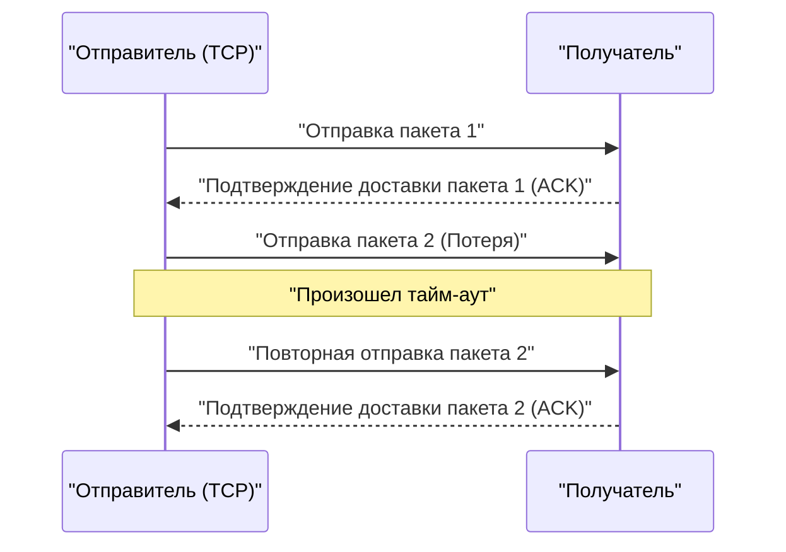

## 1. Скорость или точность. Главный выбор в интернете

Когда мы обмениваемся данными через интернет, в его основе (на транспортном уровне) работают протоколы (правила связи), среди которых можно выделить двух главных действующих лиц.
Один из них — **TCP (Transmission Control Protocol)**, который берет на себя большую часть интернет-трафика, например просмотр веб-сайтов или скачивание файлов.
И второй — главный герой этой статьи, **UDP (User Datagram Protocol)**.

Если TCP — это «аккуратный почтальон с заказными письмами, который никогда не потеряет посылку», то UDP — это «сверхбыстрая машина для подачи мячей, которая бросает посылки одну за другой и не оглядывается, даже если они не доходят».

Почему же в интернете нужен протокол без «гарантии доставки»?

## 2. Ограничения TCP: задержки, вызванные «точностью»

Чтобы понять необходимость UDP, давайте сначала посмотрим на работу его соперника — TCP.

TCP является протоколом, **ориентированным на соединение**. Перед отправкой данных он обязательно проводит предварительное подтверждение с получателем (трехэтапное рукопожатие): «Можно ли отправить вам данные?» — «Да, можно».
Кроме того, когда данные отправляются небольшими частями (пакетами), каждому пакету присваивается порядковый номер, и отправитель ждет подтверждения получения (ACK) от получателя: «Номер 1 получен», «Номер 2 получен». Если где-то по пути 3-й пакет теряется в сети и подтверждение не приходит, TCP обнаруживает это с помощью таймера и повторяет отправку: «Отправляю номер 3 заново».

Благодаря этому механизму мы можем просматривать красивые изображения без потери единого байта или скачивать программы.
Однако этот процесс «подтверждения» и «повторной отправки» порождает **фатальную временную задержку (латентность)**.

## 3. Философия UDP: «Неважно, если не дойдет, отправляй прямо сейчас»

В приложениях, где критически важна работа в реальном времени, таких как «онлайн-игры (шутеры от первого лица и файтинги)», «видеозвонки, например Zoom» или «прямые спортивные трансляции», тщательность TCP, наоборот, становится помехой.

Предположим, во время видеозвонка аудиоданные прервались на долю секунды. Если бы использовался TCP, система бы решила: «Аудиоданные 0,5-секундной давности не доставлены, отправляю их заново. До тех пор видео полностью приостанавливается». В результате изображение на экране начнет дергаться и зависать.
Для человека при звонке в реальном времени гораздо важнее, чтобы «текущий звук продолжал идти, пусть даже с небольшим шумом», чем чтобы «звук 0,5-секундной давности дошел с опозданием, но в идеальном качестве».

Здесь на сцену выходит протокол **без установления соединения** — UDP.

UDP вообще не проверяет, готов ли получатель принять данные. Он не присваивает пакетам порядковые номера, не проверяет их доставку и не выполняет повторную отправку.
Он просто берет данные от приложения, добавляет к ним заголовок (небольшое количество метаданных, таких как информация об адресате) и безоглядно «выбрасывает» их в океан сети.

### Заголовок UDP предельно легок
В то время как заголовок TCP обычно содержит различные управляющие данные размером 20 байт, заголовок UDP составляет всего **8 байт**.
1. Номер порта отправителя (2 байта)
2. Номер порта получателя (2 байта)
3. Длина пакета (2 байта)
4. Контрольная сумма (2 байта: минимальная проверка на отсутствие повреждений данных)

Эта подавляющая легкость и простота обработки максимально снижают задержку связи, делая возможным взаимодействие в реальном времени.

## 4. Где используется UDP

Свойство UDP — «легкий и быстрый, но ненадежный» — повсеместно используется в современной интернет-инфраструктуре.

* **DNS (Domain Name System)**
  Система преобразования URL (например, google.com) в IP-адреса. Запрос к DNS — это очень маленький объем данных, и если ответ не приходит, достаточно просто отправить запрос еще раз, поэтому используется быстрый UDP.
* **NTP (Network Time Protocol)**
  Связь для точной настройки часов на ПК и смартфонах. Информация о времени теряет смысл, если она устарела, поэтому оптимально использовать UDP, который избегает задержек из-за повторных отправок.
* **Потоковое вещание и VoIP**
  Прямые трансляции на YouTube, звонки в LINE или голосовые чаты в Discord реализуют связь через UDP без задержек путем программной интерполяции (прогнозирования и заполнения) части потерянных пакетов.

## 5. Новая эволюция: Протокол «QUIC»

Долгие годы интернет делился на «точный TCP» и «быстрый UDP», но в последние годы произошла революция, изменившая эту историю.
Это протокол **QUIC (Квик)**, разработанный Google и ставший основой для текущего стандарта «HTTP/3».

Компания Google, желая еще больше ускорить отображение веб-сайтов, поняла, что «задержки при начальном приветствии (рукопожатии)» TCP достигли своего предела. Поэтому они решили не улучшать TCP, а, **как ни удивительно, взять за основу UDP и создать поверх него собственную «быструю и точную процедуру связи», управляемую программным обеспечением**.

Поскольку базой QUIC является UDP, он может обходить сложное TCP-управление ядра ОС, и, выполняя одновременно рукопожатие уникального зашифрованного соединения (TLS), он кардинально сократил время до начала обмена данными. Сегодня, когда мы смотрим YouTube или используем сервисы Google, в фоновом режиме данные передаются с огромной скоростью не через TCP, а через основанный на UDP протокол QUIC.

Тот факт, что UDP, который долгое время называли «ненадежным», благодаря изобретательности превратился в фундамент самой передовой веб-инфраструктуры современности, говорит о том, насколько мощным оружием в проектировании компьютерных сетей могут быть «легкость и простота».
