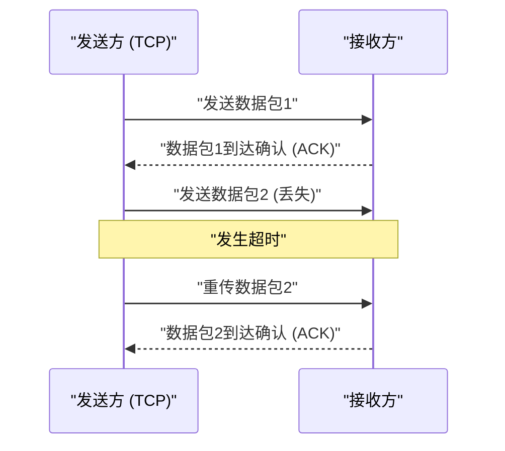

## 1. 速度还是准确性？互联网的终极选择

当我们通过互联网进行数据交换时，在其底层（传输层）运行的协议（通信规则）中，主要分为两个主角。
其中之一是承担着网页浏览和文件下载等互联网绝大部分通信的“ **TCP（Transmission Control Protocol）** ”。
而另一个，就是本文的主角“ **UDP（User Datagram Protocol）** ”。

如果说TCP是“绝对不会把包裹弄丢、像挂号信一样严谨的邮递员”，那么UDP就像是“不断投掷包裹、即使没送达也绝不回头看一眼的超高速发球机”。

为什么互联网需要一种“没有送达保证”的协议呢？

## 2. TCP的局限性：“准确性”带来的延迟

为了理解UDP的必要性，我们首先来看看它的竞争对手TCP是如何运作的。

TCP是一种“ **面向连接** ”的协议。在发送数据之前，它一定会向对方进行事前确认（三次握手）：“我现在可以发送了吗？”“可以的”。
此外，当将数据分割成小块（数据包）发送时，它会为所有数据包分配顺序编号，并等待对方的接收确认（ACK），例如“1号送达了”“2号送达了”。如果中途3号数据包在网络中迷路，没有收到接收确认，TCP就会通过计时器检测到这一点，并重新执行“重传3号数据包”的操作。

得益于这一机制，我们才能看到毫无1字节缺失的高清图像，或者下载程序。
然而，这种“确认”和“重传”的过程，却产生了 **致命的时间延迟（Latency）** 。

## 3. UDP的哲学：“送不到也没关系，现在马上发”

在实时性极其重要的应用程序中，例如“在线游戏（FPS或格斗游戏）”、“Zoom等视频通话”、“体育赛事直播”等，TCP的细致反而成了累赘。

假设在视频通话中，音频数据瞬间中断了一下。如果使用的是TCP，系统就会执行以下处理：“因为刚才0.5秒前的音频数据没有送到，所以需要重传。在此之前，暂停整个视频流。”结果就会导致画面卡顿。
对于人类来说，在实时通话中，“延迟收到0.5秒前的清晰音频”远不如“即使稍微有点杂音，也要让现在的音频继续播放”来得重要。

在这里大显身手的就是“ **无连接型** ”的UDP。

UDP完全不确认对方是否做好了接收准备。它既不给数据包分配顺序，也不确认是否送达，更不进行重传处理。
它只是单纯地给应用程序传来的数据加上头部信息（仅包含目标地址等少量元数据），然后毫不留情地将其“抛入”网络的汪洋大海。

### UDP的头部极其轻量
TCP的头部通常包含20字节的各种控制信息，而UDP的头部只有区区“ **8字节** ”。
1. 源端口号 (2字节)
2. 目标端口号 (2字节)
3. 数据包长度 (2字节)
4. 校验和 (2字节：确认数据是否损坏的最低限度检查)

这种压倒性的轻量化和处理的简单性，将通信延迟削减到了极致，从而实现了实时的体验。

## 4. UDP的活跃舞台

UDP“轻量快速，但不可靠”的特性，被广泛应用于现代互联网基础设施的各个角落。

* **DNS (Domain Name System)**
  这是一个将URL（例如: google.com）转换为IP地址的系统。对DNS的查询是非常小的数据，如果没收到回复，只需再查询一次即可，因此使用了高速的UDP。
* **NTP (Network Time Protocol)**
  用于精确同步电脑或智能手机时间的通信。由于时间信息一旦过时就失去了意义，因此讨厌重传带来延迟的UDP是最优选择。
* **流媒体传输与VoIP**
  YouTube的直播、LINE通话、Discord语音通话等，通过在软件层面插值补全（预测并填补）部分丢失的数据包，实现了无延迟的UDP通信。

## 5. 新的进化：“QUIC”协议

长久以来，互联网一直被分为“准确的TCP”和“快速的UDP”，但近年来，发生了一场改变这一历史的革命。
那就是由Google开发，并成为当前“HTTP/3”基础的协议——“ **QUIC** ”。

为了进一步加快网页显示速度，Google发现TCP的“初次问候（握手）所产生的延迟”已经达到了极限。于是，他们没有去改良TCP，而是 **竟然以UDP为基础，在其之上通过软件控制构建了独特的“快速且准确的通信步骤”** 。

由于QUIC基于UDP，它可以绕过OS内核复杂的TCP控制，并同时进行独特的加密通信（TLS）握手，从而大幅缩短了开始通信所需的时间。现在，当我们观看YouTube或使用Google服务时，其背后并非TCP，而是基于UDP的QUIC在以极速传输数据。

一直被批评为“不可靠”的UDP，凭借巧妙的设计，成功逆袭成为现代最尖端Web基础设施的基石，这一事实充分说明了在计算机网络设计中，“轻巧与简单”是多么强大的武器。
