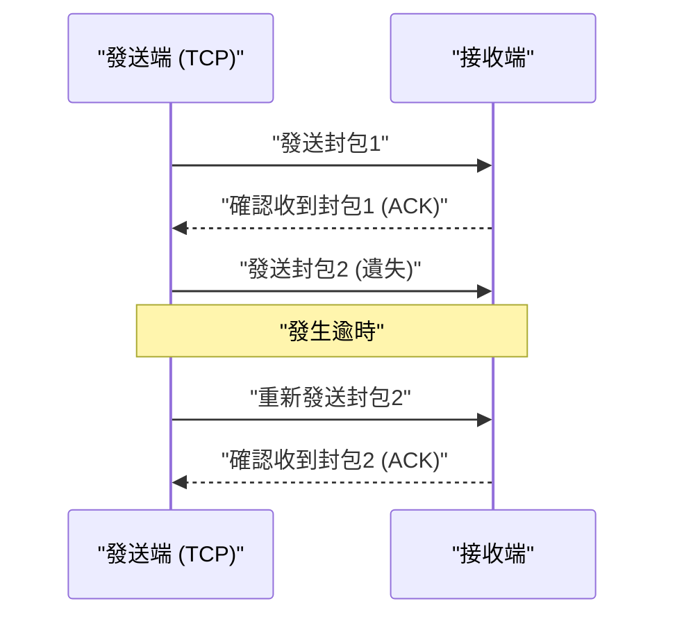

## 1. 速度，還是準確性？網際網路的終極選擇

當我們透過網際網路交換資料時，在其底層（傳輸層）運作的協定（通訊規範）中，主要有兩個主角。
其一是在瀏覽網站或下載檔案等，負責大部分網際網路通訊的「 **TCP（Transmission Control Protocol）** 」。
而另一個主角，也就是本文的主題，則是「 **UDP（User Datagram Protocol）** 」。

如果說 TCP 是「絕對不會弄丟包裹，如同掛號信般細心的郵差」，那麼 UDP 就是「不斷投擲包裹，即使沒送到也不會回頭看，有如超高速發球機」般的存在。

為什麼網際網路上會需要這種「沒有送達保證」的協定呢？

## 2. TCP 的極限：「準確性」所帶來的延遲

為了理解 UDP 的必要性，我們首先來看看它的競爭對手 TCP 是如何運作的。

TCP 是「 **連線導向 (Connection-oriented)** 」的協定。在發送資料之前，它一定會向對方進行事前確認（三向交握，3-way handshake）：「我現在可以發送資料給你嗎？」、「可以喔」。
此外，當資料被切割成小塊（封包）來發送時，它會為所有封包編上順序號碼，並等待對方回覆「我收到1號了」、「我收到2號了」等接收確認（ACK）。如果3號封包在網路上迷路了，遲遲等不到接收確認，TCP 的計時器就會偵測到這點，並重新執行「重新發送3號封包」的步驟。

多虧了這個機制，我們才能看到連 1 byte 也沒有缺失的清晰圖片，或是成功下載程式。
然而，這個「確認」與「重傳」的過程，卻會產生 **致命的時間延遲（Latency）** 。

## 3. UDP 的哲學：「就算送不到也沒關係，現在馬上送出」

對於極度重視即時性的應用程式而言，例如「線上遊戲（FPS 或格鬥遊戲）」、「Zoom 等視訊通話」、「體育賽事直播」等，TCP 的細心反而會成為阻礙。

假設在視訊通話中，語音資料瞬間中斷了一下。如果使用 TCP，系統就會執行「因為 0.5 秒前的語音資料沒有送達，所以要重新發送。在此之前會先暫停整段影片」的處理。結果就會導致畫面卡頓。
對人類來說，在即時通話中，「稍微夾帶一點雜音，但把現在的語音繼續順暢播出」，遠比「讓 0.5 秒前的過去語音延遲且清晰地送達」重要得多。

在此大顯身手的就是「 **無連線導向 (Connectionless)** 」的 UDP。

UDP 完全不確認對方是否已經準備好接收。它不為封包編號，不確認是否送達，也不進行重傳處理。
它只是單純地將應用程式傳來的資料加上標頭（如目的地資訊等極少量的元資料），然後「丟了就跑」地拋入網路的汪洋中。

### UDP 的標頭輕量到了極點
TCP 的標頭通常帶有 20 byte 的各種控制資訊，相對之下，UDP 的標頭僅有短短的「 **8 byte** 」。
1. 來源連接埠號碼 (2 byte)
2. 目的連接埠號碼 (2 byte)
3. 封包長度 (2 byte)
4. 檢查碼 (2 byte：確認資料是否損壞的最基本驗證)

這種壓倒性的輕量與處理的單純性，將通訊延遲削減到了極限，從而實現了即時性的體驗。

## 4. UDP 活躍的領域

UDP「輕快但不可靠」的特性，被廣泛應用於現代網際網路基礎設施的各個角落。

* **DNS (Domain Name System)**
  將 URL（例：google.com）轉換為 IP 位址的系統。由於向 DNS 查詢的資料非常小，即使沒有收到回覆，只要再詢問一次即可，因此採用了高速的 UDP。
* **NTP (Network Time Protocol)**
  用於準確校時電腦或手機時鐘的通訊。由於時間資訊一旦過期便毫無意義，因此非常適合厭惡重傳延遲的 UDP。
* **串流直播與 VoIP**
  YouTube 直播、LINE 通話、Discord 語音通話等，都是透過軟體端去補間（預測並填補）部分遺失的封包，藉此實現無延遲的 UDP 通訊。

## 5. 全新的進化：「QUIC」協定

長年以來，網際網路被劃分為「準確的 TCP」與「快速的 UDP」兩大陣營，但在近年來，一場改變這段歷史的革命發生了。
那就是由 Google 開發，且作為現今「HTTP/3」基礎的協定——「 **QUIC (Quick UDP Internet Connections)** 」。

為了進一步加速網站的顯示速度，Google 意識到 TCP 在「最初打招呼（交握）所花費的延遲」已經達到了極限。因此他們並未改良 TCP，而是 **以 UDP 為基礎，在之上透過軟體控制，打造出獨有的「快速又準確的通訊程序」** 。

由於 QUIC 以 UDP 為基礎，它可以繞過 OS 核心中複雜的 TCP 控制，並同時進行獨有的加密通訊（TLS）交握，戲劇性地縮短了通訊開始前的等待時間。現在當我們觀看 YouTube 或使用 Google 服務時，背後運載資料的早已不是 TCP，而是以 UDP 為基礎、速度極快的 QUIC。

一直被說「不可靠」的 UDP，透過巧妙的設計，如今竟搖身一變成為現代最尖端 Web 基礎設施的基石。這個事實訴說著，在電腦網路的設計中，「輕量與單純」是一項多麼強大的武器。
