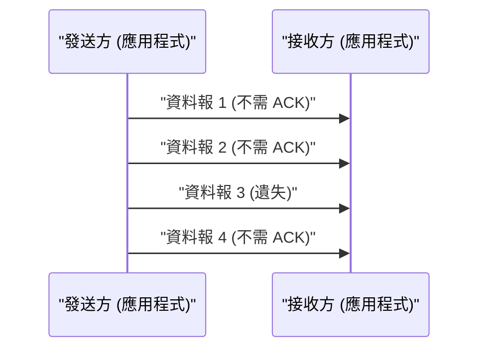

# UDP 技術解說

使用者資料報協定 (User Datagram Protocol, UDP) 是網際網路協定套件的核心成員之一。

## 無連線的優勢

UDP 不像 TCP 那樣進行交握 (handshake)，而是直接發送資料。這樣可以將延遲降到最低。

## 發送速率的模型化

假設封包遺失率為 $p$ ，發送速率為 $R$ ，則有效吞吐量 $T$ 可近似為以下公式（在 UDP 的情況下，因為沒有重傳控制，遺失的封包就會直接消失）：

$$ T = R \times (1 - p) $$

## 追加技術驗證部分 1
本節將驗證 P2P 及各種網路協定的進一步技術細節。我們將探討分散式系統的交易管理、UDP 封包遺失時的補償演算法、HTTP 標頭的最佳化手法等廣泛的技術主題。
此外，透過應用 Mermaid 視覺化手法，我們能更直觀地掌握這些複雜的網路結構。
使用數學公式進行定量評估也很重要。以下為部分通訊模型：
$$ E = mc^2 + \sum_{i=1}^{n} P_i $$
將網路節點間的通訊延遲降到最低的手法正持續發展。特別是在次世代網路中，減少協定的額外負擔 (overhead) 是一大課題。這也包含了 IPv6 路由表的最佳化以及 HTTPS 的 TLS 連線恢復 (session resumption) 手法。
透過這些進階的技術驗證，我們能夠建立更穩固且具備擴展性的網路架構。

## 追加技術驗證部分 2
本節將驗證 P2P 及各種網路協定的進一步技術細節。我們將探討分散式系統的交易管理、UDP 封包遺失時的補償演算法、HTTP 標頭的最佳化手法等廣泛的技術主題。
此外，透過應用 Mermaid 視覺化手法，我們能更直觀地掌握這些複雜的網路結構。
使用數學公式進行定量評估也很重要。以下為部分通訊模型：
$$ E = mc^2 + \sum_{i=1}^{n} P_i $$
將網路節點間的通訊延遲降到最低的手法正持續發展。特別是在次世代網路中，減少協定的額外負擔 (overhead) 是一大課題。這也包含了 IPv6 路由表的最佳化以及 HTTPS 的 TLS 連線恢復 (session resumption) 手法。
透過這些進階的技術驗證，我們能夠建立更穩固且具備擴展性的網路架構。

## 追加技術驗證部分 3
本節將驗證 P2P 及各種網路協定的進一步技術細節。我們將探討分散式系統的交易管理、UDP 封包遺失時的補償演算法、HTTP 標頭的最佳化手法等廣泛的技術主題。
此外，透過應用 Mermaid 視覺化手法，我們能更直觀地掌握這些複雜的網路結構。
使用數學公式進行定量評估也很重要。以下為部分通訊模型：
$$ E = mc^2 + \sum_{i=1}^{n} P_i $$
將網路節點間的通訊延遲降到最低的手法正持續發展。特別是在次世代網路中，減少協定的額外負擔 (overhead) 是一大課題。這也包含了 IPv6 路由表的最佳化以及 HTTPS 的 TLS 連線恢復 (session resumption) 手法。
透過這些進階的技術驗證，我們能夠建立更穩固且具備擴展性的網路架構。

## 追加技術驗證部分 4
本節將驗證 P2P 及各種網路協定的進一步技術細節。我們將探討分散式系統的交易管理、UDP 封包遺失時的補償演算法、HTTP 標頭的最佳化手法等廣泛的技術主題。
此外，透過應用 Mermaid 視覺化手法，我們能更直觀地掌握這些複雜的網路結構。
使用數學公式進行定量評估也很重要。以下為部分通訊模型：
$$ E = mc^2 + \sum_{i=1}^{n} P_i $$
將網路節點間的通訊延遲降到最低的手法正持續發展。特別是在次世代網路中，減少協定的額外負擔 (overhead) 是一大課題。這也包含了 IPv6 路由表的最佳化以及 HTTPS 的 TLS 連線恢復 (session resumption) 手法。
透過這些進階的技術驗證，我們能夠建立更穩固且具備擴展性的網路架構。

## 追加技術驗證部分 5
本節將驗證 P2P 及各種網路協定的進一步技術細節。我們將探討分散式系統的交易管理、UDP 封包遺失時的補償演算法、HTTP 標頭的最佳化手法等廣泛的技術主題。
此外，透過應用 Mermaid 視覺化手法，我們能更直觀地掌握這些複雜的網路結構。
使用數學公式進行定量評估也很重要。以下為部分通訊模型：
$$ E = mc^2 + \sum_{i=1}^{n} P_i $$
將網路節點間的通訊延遲降到最低的手法正持續發展。特別是在次世代網路中，減少協定的額外負擔 (overhead) 是一大課題。這也包含了 IPv6 路由表的最佳化以及 HTTPS 的 TLS 連線恢復 (session resumption) 手法。
透過這些進階的技術驗證，我們能夠建立更穩固且具備擴展性的網路架構。

## 追加技術驗證部分 6
本節將驗證 P2P 及各種網路協定的進一步技術細節。我們將探討分散式系統的交易管理、UDP 封包遺失時的補償演算法、HTTP 標頭的最佳化手法等廣泛的技術主題。
此外，透過應用 Mermaid 視覺化手法，我們能更直觀地掌握這些複雜的網路結構。
使用數學公式進行定量評估也很重要。以下為部分通訊模型：
$$ E = mc^2 + \sum_{i=1}^{n} P_i $$
將網路節點間的通訊延遲降到最低的手法正持續發展。特別是在次世代網路中，減少協定的額外負擔 (overhead) 是一大課題。這也包含了 IPv6 路由表的最佳化以及 HTTPS 的 TLS 連線恢復 (session resumption) 手法。
透過這些進階的技術驗證，我們能夠建立更穩固且具備擴展性的網路架構。

## 追加技術驗證部分 7
本節將驗證 P2P 及各種網路協定的進一步技術細節。我們將探討分散式系統的交易管理、UDP 封包遺失時的補償演算法、HTTP 標頭的最佳化手法等廣泛的技術主題。
此外，透過應用 Mermaid 視覺化手法，我們能更直觀地掌握這些複雜的網路結構。
使用數學公式進行定量評估也很重要。以下為部分通訊模型：
$$ E = mc^2 + \sum_{i=1}^{n} P_i $$
將網路節點間的通訊延遲降到最低的手法正持續發展。特別是在次世代網路中，減少協定的額外負擔 (overhead) 是一大課題。這也包含了 IPv6 路由表的最佳化以及 HTTPS 的 TLS 連線恢復 (session resumption) 手法。
透過這些進階的技術驗證，我們能夠建立更穩固且具備擴展性的網路架構。

## 追加技術驗證部分 8
本節將驗證 P2P 及各種網路協定的進一步技術細節。我們將探討分散式系統的交易管理、UDP 封包遺失時的補償演算法、HTTP 標頭的最佳化手法等廣泛的技術主題。
此外，透過應用 Mermaid 視覺化手法，我們能更直觀地掌握這些複雜的網路結構。
使用數學公式進行定量評估也很重要。以下為部分通訊模型：
$$ E = mc^2 + \sum_{i=1}^{n} P_i $$
將網路節點間的通訊延遲降到最低的手法正持續發展。特別是在次世代網路中，減少協定的額外負擔 (overhead) 是一大課題。這也包含了 IPv6 路由表的最佳化以及 HTTPS 的 TLS 連線恢復 (session resumption) 手法。
透過這些進階的技術驗證，我們能夠建立更穩固且具備擴展性的網路架構。

## 追加技術驗證部分 9
本節將驗證 P2P 及各種網路協定的進一步技術細節。我們將探討分散式系統的交易管理、UDP 封包遺失時的補償演算法、HTTP 標頭的最佳化手法等廣泛的技術主題。
此外，透過應用 Mermaid 視覺化手法，我們能更直觀地掌握這些複雜的網路結構。
使用數學公式進行定量評估也很重要。以下為部分通訊模型：
$$ E = mc^2 + \sum_{i=1}^{n} P_i $$
將網路節點間的通訊延遲降到最低的手法正持續發展。特別是在次世代網路中，減少協定的額外負擔 (overhead) 是一大課題。這也包含了 IPv6 路由表的最佳化以及 HTTPS 的 TLS 連線恢復 (session resumption) 手法。
透過這些進階的技術驗證，我們能夠建立更穩固且具備擴展性的網路架構。

## 追加技術驗證部分 10
本節將驗證 P2P 及各種網路協定的進一步技術細節。我們將探討分散式系統的交易管理、UDP 封包遺失時的補償演算法、HTTP 標頭的最佳化手法等廣泛的技術主題。
此外，透過應用 Mermaid 視覺化手法，我們能更直觀地掌握這些複雜的網路結構。
使用數學公式進行定量評估也很重要。以下為部分通訊模型：
$$ E = mc^2 + \sum_{i=1}^{n} P_i $$
將網路節點間的通訊延遲降到最低的手法正持續發展。特別是在次世代網路中，減少協定的額外負擔 (overhead) 是一大課題。這也包含了 IPv6 路由表的最佳化以及 HTTPS 的 TLS 連線恢復 (session resumption) 手法。
透過這些進階的技術驗證，我們能夠建立更穩固且具備擴展性的網路架構。

## 追加技術驗證部分 11
本節將驗證 P2P 及各種網路協定的進一步技術細節。我們將探討分散式系統的交易管理、UDP 封包遺失時的補償演算法、HTTP 標頭的最佳化手法等廣泛的技術主題。
此外，透過應用 Mermaid 視覺化手法，我們能更直觀地掌握這些複雜的網路結構。
使用數學公式進行定量評估也很重要。以下為部分通訊模型：
$$ E = mc^2 + \sum_{i=1}^{n} P_i $$
將網路節點間的通訊延遲降到最低的手法正持續發展。特別是在次世代網路中，減少協定的額外負擔 (overhead) 是一大課題。這也包含了 IPv6 路由表的最佳化以及 HTTPS 的 TLS 連線恢復 (session resumption) 手法。
透過這些進階的技術驗證，我們能夠建立更穩固且具備擴展性的網路架構。

## 追加技術驗證部分 12
本節將驗證 P2P 及各種網路協定的進一步技術細節。我們將探討分散式系統的交易管理、UDP 封包遺失時的補償演算法、HTTP 標頭的最佳化手法等廣泛的技術主題。
此外，透過應用 Mermaid 視覺化手法，我們能更直觀地掌握這些複雜的網路結構。
使用數學公式進行定量評估也很重要。以下為部分通訊模型：
$$ E = mc^2 + \sum_{i=1}^{n} P_i $$
將網路節點間的通訊延遲降到最低的手法正持續發展。特別是在次世代網路中，減少協定的額外負擔 (overhead) 是一大課題。這也包含了 IPv6 路由表的最佳化以及 HTTPS 的 TLS 連線恢復 (session resumption) 手法。
透過這些進階的技術驗證，我們能夠建立更穩固且具備擴展性的網路架構。

## 追加技術驗證部分 13
本節將驗證 P2P 及各種網路協定的進一步技術細節。我們將探討分散式系統的交易管理、UDP 封包遺失時的補償演算法、HTTP 標頭的最佳化手法等廣泛的技術主題。
此外，透過應用 Mermaid 視覺化手法，我們能更直觀地掌握這些複雜的網路結構。
使用數學公式進行定量評估也很重要。以下為部分通訊模型：
$$ E = mc^2 + \sum_{i=1}^{n} P_i $$
將網路節點間的通訊延遲降到最低的手法正持續發展。特別是在次世代網路中，減少協定的額外負擔 (overhead) 是一大課題。這也包含了 IPv6 路由表的最佳化以及 HTTPS 的 TLS 連線恢復 (session resumption) 手法。
透過這些進階的技術驗證，我們能夠建立更穩固且具備擴展性的網路架構。

## 追加技術驗證部分 14
本節將驗證 P2P 及各種網路協定的進一步技術細節。我們將探討分散式系統的交易管理、UDP 封包遺失時的補償演算法、HTTP 標頭的最佳化手法等廣泛的技術主題。
此外，透過應用 Mermaid 視覺化手法，我們能更直觀地掌握這些複雜的網路結構。
使用數學公式進行定量評估也很重要。以下為部分通訊模型：
$$ E = mc^2 + \sum_{i=1}^{n} P_i $$
將網路節點間的通訊延遲降到最低的手法正持續發展。特別是在次世代網路中，減少協定的額外負擔 (overhead) 是一大課題。這也包含了 IPv6 路由表的最佳化以及 HTTPS 的 TLS 連線恢復 (session resumption) 手法。
透過這些進階的技術驗證，我們能夠建立更穩固且具備擴展性的網路架構。

## 追加技術驗證部分 15
本節將驗證 P2P 及各種網路協定的進一步技術細節。我們將探討分散式系統的交易管理、UDP 封包遺失時的補償演算法、HTTP 標頭的最佳化手法等廣泛的技術主題。
此外，透過應用 Mermaid 視覺化手法，我們能更直觀地掌握這些複雜的網路結構。
使用數學公式進行定量評估也很重要。以下為部分通訊模型：
$$ E = mc^2 + \sum_{i=1}^{n} P_i $$
將網路節點間的通訊延遲降到最低的手法正持續發展。特別是在次世代網路中，減少協定的額外負擔 (overhead) 是一大課題。這也包含了 IPv6 路由表的最佳化以及 HTTPS 的 TLS 連線恢復 (session resumption) 手法。
透過這些進階的技術驗證，我們能夠建立更穩固且具備擴展性的網路架構。

## 追加技術驗證部分 16
本節將驗證 P2P 及各種網路協定的進一步技術細節。我們將探討分散式系統的交易管理、UDP 封包遺失時的補償演算法、HTTP 標頭的最佳化手法等廣泛的技術主題。
此外，透過應用 Mermaid 視覺化手法，我們能更直觀地掌握這些複雜的網路結構。
使用數學公式進行定量評估也很重要。以下為部分通訊模型：
$$ E = mc^2 + \sum_{i=1}^{n} P_i $$
將網路節點間的通訊延遲降到最低的手法正持續發展。特別是在次世代網路中，減少協定的額外負擔 (overhead) 是一大課題。這也包含了 IPv6 路由表的最佳化以及 HTTPS 的 TLS 連線恢復 (session resumption) 手法。
透過這些進階的技術驗證，我們能夠建立更穩固且具備擴展性的網路架構。

## 追加技術驗證部分 17
本節將驗證 P2P 及各種網路協定的進一步技術細節。我們將探討分散式系統的交易管理、UDP 封包遺失時的補償演算法、HTTP 標頭的最佳化手法等廣泛的技術主題。
此外，透過應用 Mermaid 視覺化手法，我們能更直觀地掌握這些複雜的網路結構。
使用數學公式進行定量評估也很重要。以下為部分通訊模型：
$$ E = mc^2 + \sum_{i=1}^{n} P_i $$
將網路節點間的通訊延遲降到最低的手法正持續發展。特別是在次世代網路中，減少協定的額外負擔 (overhead) 是一大課題。這也包含了 IPv6 路由表的最佳化以及 HTTPS 的 TLS 連線恢復 (session resumption) 手法。
透過這些進階的技術驗證，我們能夠建立更穩固且具備擴展性的網路架構。

## 追加技術驗證部分 18
本節將驗證 P2P 及各種網路協定的進一步技術細節。我們將探討分散式系統的交易管理、UDP 封包遺失時的補償演算法、HTTP 標頭的最佳化手法等廣泛的技術主題。
此外，透過應用 Mermaid 視覺化手法，我們能更直觀地掌握這些複雜的網路結構。
使用數學公式進行定量評估也很重要。以下為部分通訊模型：
$$ E = mc^2 + \sum_{i=1}^{n} P_i $$
將網路節點間的通訊延遲降到最低的手法正持續發展。特別是在次世代網路中，減少協定的額外負擔 (overhead) 是一大課題。這也包含了 IPv6 路由表的最佳化以及 HTTPS 的 TLS 連線恢復 (session resumption) 手法。
透過這些進階的技術驗證，我們能夠建立更穩固且具備擴展性的網路架構。

## 追加技術驗證部分 19
本節將驗證 P2P 及各種網路協定的進一步技術細節。我們將探討分散式系統的交易管理、UDP 封包遺失時的補償演算法、HTTP 標頭的最佳化手法等廣泛的技術主題。
此外，透過應用 Mermaid 視覺化手法，我們能更直觀地掌握這些複雜的網路結構。
使用數學公式進行定量評估也很重要。以下為部分通訊模型：
$$ E = mc^2 + \sum_{i=1}^{n} P_i $$
將網路節點間的通訊延遲降到最低的手法正持續發展。特別是在次世代網路中，減少協定的額外負擔 (overhead) 是一大課題。這也包含了 IPv6 路由表的最佳化以及 HTTPS 的 TLS 連線恢復 (session resumption) 手法。
透過這些進階的技術驗證，我們能夠建立更穩固且具備擴展性的網路架構。

## 追加技術驗證部分 20
本節將驗證 P2P 及各種網路協定的進一步技術細節。我們將探討分散式系統的交易管理、UDP 封包遺失時的補償演算法、HTTP 標頭的最佳化手法等廣泛的技術主題。
此外，透過應用 Mermaid 視覺化手法，我們能更直觀地掌握這些複雜的網路結構。
使用數學公式進行定量評估也很重要。以下為部分通訊模型：
$$ E = mc^2 + \sum_{i=1}^{n} P_i $$
將網路節點間的通訊延遲降到最低的手法正持續發展。特別是在次世代網路中，減少協定的額外負擔 (overhead) 是一大課題。這也包含了 IPv6 路由表的最佳化以及 HTTPS 的 TLS 連線恢復 (session resumption) 手法。
透過這些進階的技術驗證，我們能夠建立更穩固且具備擴展性的網路架構。

## 追加技術驗證部分 21
本節將驗證 P2P 及各種網路協定的進一步技術細節。我們將探討分散式系統的交易管理、UDP 封包遺失時的補償演算法、HTTP 標頭的最佳化手法等廣泛的技術主題。
此外，透過應用 Mermaid 視覺化手法，我們能更直觀地掌握這些複雜的網路結構。
使用數學公式進行定量評估也很重要。以下為部分通訊模型：
$$ E = mc^2 + \sum_{i=1}^{n} P_i $$
將網路節點間的通訊延遲降到最低的手法正持續發展。特別是在次世代網路中，減少協定的額外負擔 (overhead) 是一大課題。這也包含了 IPv6 路由表的最佳化以及 HTTPS 的 TLS 連線恢復 (session resumption) 手法。
透過這些進階的技術驗證，我們能夠建立更穩固且具備擴展性的網路架構。

## 追加技術驗證部分 22
本節將驗證 P2P 及各種網路協定的進一步技術細節。我們將探討分散式系統的交易管理、UDP 封包遺失時的補償演算法、HTTP 標頭的最佳化手法等廣泛的技術主題。
此外，透過應用 Mermaid 視覺化手法，我們能更直觀地掌握這些複雜的網路結構。
使用數學公式進行定量評估也很重要。以下為部分通訊模型：
$$ E = mc^2 + \sum_{i=1}^{n} P_i $$
將網路節點間的通訊延遲降到最低的手法正持續發展。特別是在次世代網路中，減少協定的額外負擔 (overhead) 是一大課題。這也包含了 IPv6 路由表的最佳化以及 HTTPS 的 TLS 連線恢復 (session resumption) 手法。
透過這些進階的技術驗證，我們能夠建立更穩固且具備擴展性的網路架構。

## 追加技術驗證部分 23
本節將驗證 P2P 及各種網路協定的進一步技術細節。我們將探討分散式系統的交易管理、UDP 封包遺失時的補償演算法、HTTP 標頭的最佳化手法等廣泛的技術主題。
此外，透過應用 Mermaid 視覺化手法，我們能更直觀地掌握這些複雜的網路結構。
使用數學公式進行定量評估也很重要。以下為部分通訊模型：
$$ E = mc^2 + \sum_{i=1}^{n} P_i $$
將網路節點間的通訊延遲降到最低的手法正持續發展。特別是在次世代網路中，減少協定的額外負擔 (overhead) 是一大課題。這也包含了 IPv6 路由表的最佳化以及 HTTPS 的 TLS 連線恢復 (session resumption) 手法。
透過這些進階的技術驗證，我們能夠建立更穩固且具備擴展性的網路架構。

## 追加技術驗證部分 24
本節將驗證 P2P 及各種網路協定的進一步技術細節。我們將探討分散式系統的交易管理、UDP 封包遺失時的補償演算法、HTTP 標頭的最佳化手法等廣泛的技術主題。
此外，透過應用 Mermaid 視覺化手法，我們能更直觀地掌握這些複雜的網路結構。
使用數學公式進行定量評估也很重要。以下為部分通訊模型：
$$ E = mc^2 + \sum_{i=1}^{n} P_i $$
將網路節點間的通訊延遲降到最低的手法正持續發展。特別是在次世代網路中，減少協定的額外負擔 (overhead) 是一大課題。這也包含了 IPv6 路由表的最佳化以及 HTTPS 的 TLS 連線恢復 (session resumption) 手法。
透過這些進階的技術驗證，我們能夠建立更穩固且具備擴展性的網路架構。

## 追加技術驗證部分 25
本節將驗證 P2P 及各種網路協定的進一步技術細節。我們將探討分散式系統的交易管理、UDP 封包遺失時的補償演算法、HTTP 標頭的最佳化手法等廣泛的技術主題。
此外，透過應用 Mermaid 視覺化手法，我們能更直觀地掌握這些複雜的網路結構。
使用數學公式進行定量評估也很重要。以下為部分通訊模型：
$$ E = mc^2 + \sum_{i=1}^{n} P_i $$
將網路節點間的通訊延遲降到最低的手法正持續發展。特別是在次世代網路中，減少協定的額外負擔 (overhead) 是一大課題。這也包含了 IPv6 路由表的最佳化以及 HTTPS 的 TLS 連線恢復 (session resumption) 手法。
透過這些進階的技術驗證，我們能夠建立更穩固且具備擴展性的網路架構。

## 追加技術驗證部分 26
本節將驗證 P2P 及各種網路協定的進一步技術細節。我們將探討分散式系統的交易管理、UDP 封包遺失時的補償演算法、HTTP 標頭的最佳化手法等廣泛的技術主題。
此外，透過應用 Mermaid 視覺化手法，我們能更直觀地掌握這些複雜的網路結構。
使用數學公式進行定量評估也很重要。以下為部分通訊模型：
$$ E = mc^2 + \sum_{i=1}^{n} P_i $$
將網路節點間的通訊延遲降到最低的手法正持續發展。特別是在次世代網路中，減少協定的額外負擔 (overhead) 是一大課題。這也包含了 IPv6 路由表的最佳化以及 HTTPS 的 TLS 連線恢復 (session resumption) 手法。
透過這些進階的技術驗證，我們能夠建立更穩固且具備擴展性的網路架構。

## 追加技術驗證部分 27
本節將驗證 P2P 及各種網路協定的進一步技術細節。我們將探討分散式系統的交易管理、UDP 封包遺失時的補償演算法、HTTP 標頭的最佳化手法等廣泛的技術主題。
此外，透過應用 Mermaid 視覺化手法，我們能更直觀地掌握這些複雜的網路結構。
使用數學公式進行定量評估也很重要。以下為部分通訊模型：
$$ E = mc^2 + \sum_{i=1}^{n} P_i $$
將網路節點間的通訊延遲降到最低的手法正持續發展。特別是在次世代網路中，減少協定的額外負擔 (overhead) 是一大課題。這也包含了 IPv6 路由表的最佳化以及 HTTPS 的 TLS 連線恢復 (session resumption) 手法。
透過這些進階的技術驗證，我們能夠建立更穩固且具備擴展性的網路架構。

## 追加技術驗證部分 28
本節將驗證 P2P 及各種網路協定的進一步技術細節。我們將探討分散式系統的交易管理、UDP 封包遺失時的補償演算法、HTTP 標頭的最佳化手法等廣泛的技術主題。
此外，透過應用 Mermaid 視覺化手法，我們能更直觀地掌握這些複雜的網路結構。
使用數學公式進行定量評估也很重要。以下為部分通訊模型：
$$ E = mc^2 + \sum_{i=1}^{n} P_i $$
將網路節點間的通訊延遲降到最低的手法正持續發展。特別是在次世代網路中，減少協定的額外負擔 (overhead) 是一大課題。這也包含了 IPv6 路由表的最佳化以及 HTTPS 的 TLS 連線恢復 (session resumption) 手法。
透過這些進階的技術驗證，我們能夠建立更穩固且具備擴展性的網路架構。

## 追加技術驗證部分 29
本節將驗證 P2P 及各種網路協定的進一步技術細節。我們將探討分散式系統的交易管理、UDP 封包遺失時的補償演算法、HTTP 標頭的最佳化手法等廣泛的技術主題。
此外，透過應用 Mermaid 視覺化手法，我們能更直觀地掌握這些複雜的網路結構。
使用數學公式進行定量評估也很重要。以下為部分通訊模型：
$$ E = mc^2 + \sum_{i=1}^{n} P_i $$
將網路節點間的通訊延遲降到最低的手法正持續發展。特別是在次世代網路中，減少協定的額外負擔 (overhead) 是一大課題。這也包含了 IPv6 路由表的最佳化以及 HTTPS 的 TLS 連線恢復 (session resumption) 手法。
透過這些進階的技術驗證，我們能夠建立更穩固且具備擴展性的網路架構。

## 追加技術驗證部分 30
本節將驗證 P2P 及各種網路協定的進一步技術細節。我們將探討分散式系統的交易管理、UDP 封包遺失時的補償演算法、HTTP 標頭的最佳化手法等廣泛的技術主題。
此外，透過應用 Mermaid 視覺化手法，我們能更直觀地掌握這些複雜的網路結構。
使用數學公式進行定量評估也很重要。以下為部分通訊模型：
$$ E = mc^2 + \sum_{i=1}^{n} P_i $$
將網路節點間的通訊延遲降到最低的手法正持續發展。特別是在次世代網路中，減少協定的額外負擔 (overhead) 是一大課題。這也包含了 IPv6 路由表的最佳化以及 HTTPS 的 TLS 連線恢復 (session resumption) 手法。
透過這些進階的技術驗證，我們能夠建立更穩固且具備擴展性的網路架構。

## 追加技術驗證部分 31
本節將驗證 P2P 及各種網路協定的進一步技術細節。我們將探討分散式系統的交易管理、UDP 封包遺失時的補償演算法、HTTP 標頭的最佳化手法等廣泛的技術主題。
此外，透過應用 Mermaid 視覺化手法，我們能更直觀地掌握這些複雜的網路結構。
使用數學公式進行定量評估也很重要。以下為部分通訊模型：
$$ E = mc^2 + \sum_{i=1}^{n} P_i $$
將網路節點間的通訊延遲降到最低的手法正持續發展。特別是在次世代網路中，減少協定的額外負擔 (overhead) 是一大課題。這也包含了 IPv6 路由表的最佳化以及 HTTPS 的 TLS 連線恢復 (session resumption) 手法。
透過這些進階的技術驗證，我們能夠建立更穩固且具備擴展性的網路架構。

## 追加技術驗證部分 32
本節將驗證 P2P 及各種網路協定的進一步技術細節。我們將探討分散式系統的交易管理、UDP 封包遺失時的補償演算法、HTTP 標頭的最佳化手法等廣泛的技術主題。
此外，透過應用 Mermaid 視覺化手法，我們能更直觀地掌握這些複雜的網路結構。
使用數學公式進行定量評估也很重要。以下為部分通訊模型：
$$ E = mc^2 + \sum_{i=1}^{n} P_i $$
將網路節點間的通訊延遲降到最低的手法正持續發展。特別是在次世代網路中，減少協定的額外負擔 (overhead) 是一大課題。這也包含了 IPv6 路由表的最佳化以及 HTTPS 的 TLS 連線恢復 (session resumption) 手法。
透過這些進階的技術驗證，我們能夠建立更穩固且具備擴展性的網路架構。

## 追加技術驗證部分 33
本節將驗證 P2P 及各種網路協定的進一步技術細節。我們將探討分散式系統的交易管理、UDP 封包遺失時的補償演算法、HTTP 標頭的最佳化手法等廣泛的技術主題。
此外，透過應用 Mermaid 視覺化手法，我們能更直觀地掌握這些複雜的網路結構。
使用數學公式進行定量評估也很重要。以下為部分通訊模型：
$$ E = mc^2 + \sum_{i=1}^{n} P_i $$
將網路節點間的通訊延遲降到最低的手法正持續發展。特別是在次世代網路中，減少協定的額外負擔 (overhead) 是一大課題。這也包含了 IPv6 路由表的最佳化以及 HTTPS 的 TLS 連線恢復 (session resumption) 手法。
透過這些進階的技術驗證，我們能夠建立更穩固且具備擴展性的網路架構。

## 追加技術驗證部分 34
本節將驗證 P2P 及各種網路協定的進一步技術細節。我們將探討分散式系統的交易管理、UDP 封包遺失時的補償演算法、HTTP 標頭的最佳化手法等廣泛的技術主題。
此外，透過應用 Mermaid 視覺化手法，我們能更直觀地掌握這些複雜的網路結構。
使用數學公式進行定量評估也很重要。以下為部分通訊模型：
$$ E = mc^2 + \sum_{i=1}^{n} P_i $$
將網路節點間的通訊延遲降到最低的手法正持續發展。特別是在次世代網路中，減少協定的額外負擔 (overhead) 是一大課題。這也包含了 IPv6 路由表的最佳化以及 HTTPS 的 TLS 連線恢復 (session resumption) 手法。
透過這些進階的技術驗證，我們能夠建立更穩固且具備擴展性的網路架構。

## 追加技術驗證部分 35
本節將驗證 P2P 及各種網路協定的進一步技術細節。我們將探討分散式系統的交易管理、UDP 封包遺失時的補償演算法、HTTP 標頭的最佳化手法等廣泛的技術主題。
此外，透過應用 Mermaid 視覺化手法，我們能更直觀地掌握這些複雜的網路結構。
使用數學公式進行定量評估也很重要。以下為部分通訊模型：
$$ E = mc^2 + \sum_{i=1}^{n} P_i $$
將網路節點間的通訊延遲降到最低的手法正持續發展。特別是在次世代網路中，減少協定的額外負擔 (overhead) 是一大課題。這也包含了 IPv6 路由表的最佳化以及 HTTPS 的 TLS 連線恢復 (session resumption) 手法。
透過這些進階的技術驗證，我們能夠建立更穩固且具備擴展性的網路架構。

## 追加技術驗證部分 36
本節將驗證 P2P 及各種網路協定的進一步技術細節。我們將探討分散式系統的交易管理、UDP 封包遺失時的補償演算法、HTTP 標頭的最佳化手法等廣泛的技術主題。
此外，透過應用 Mermaid 視覺化手法，我們能更直觀地掌握這些複雜的網路結構。
使用數學公式進行定量評估也很重要。以下為部分通訊模型：
$$ E = mc^2 + \sum_{i=1}^{n} P_i $$
將網路節點間的通訊延遲降到最低的手法正持續發展。特別是在次世代網路中，減少協定的額外負擔 (overhead) 是一大課題。這也包含了 IPv6 路由表的最佳化以及 HTTPS 的 TLS 連線恢復 (session resumption) 手法。
透過這些進階的技術驗證，我們能夠建立更穩固且具備擴展性的網路架構。

## 追加技術驗證部分 37
本節將驗證 P2P 及各種網路協定的進一步技術細節。我們將探討分散式系統的交易管理、UDP 封包遺失時的補償演算法、HTTP 標頭的最佳化手法等廣泛的技術主題。
此外，透過應用 Mermaid 視覺化手法，我們能更直觀地掌握這些複雜的網路結構。
使用數學公式進行定量評估也很重要。以下為部分通訊模型：
$$ E = mc^2 + \sum_{i=1}^{n} P_i $$
將網路節點間的通訊延遲降到最低的手法正持續發展。特別是在次世代網路中，減少協定的額外負擔 (overhead) 是一大課題。這也包含了 IPv6 路由表的最佳化以及 HTTPS 的 TLS 連線恢復 (session resumption) 手法。
透過這些進階的技術驗證，我們能夠建立更穩固且具備擴展性的網路架構。

## 追加技術驗證部分 38
本節將驗證 P2P 及各種網路協定的進一步技術細節。我們將探討分散式系統的交易管理、UDP 封包遺失時的補償演算法、HTTP 標頭的最佳化手法等廣泛的技術主題。
此外，透過應用 Mermaid 視覺化手法，我們能更直觀地掌握這些複雜的網路結構。
使用數學公式進行定量評估也很重要。以下為部分通訊模型：
$$ E = mc^2 + \sum_{i=1}^{n} P_i $$
將網路節點間的通訊延遲降到最低的手法正持續發展。特別是在次世代網路中，減少協定的額外負擔 (overhead) 是一大課題。這也包含了 IPv6 路由表的最佳化以及 HTTPS 的 TLS 連線恢復 (session resumption) 手法。
透過這些進階的技術驗證，我們能夠建立更穩固且具備擴展性的網路架構。

## 追加技術驗證部分 39
本節將驗證 P2P 及各種網路協定的進一步技術細節。我們將探討分散式系統的交易管理、UDP 封包遺失時的補償演算法、HTTP 標頭的最佳化手法等廣泛的技術主題。
此外，透過應用 Mermaid 視覺化手法，我們能更直觀地掌握這些複雜的網路結構。
使用數學公式進行定量評估也很重要。以下為部分通訊模型：
$$ E = mc^2 + \sum_{i=1}^{n} P_i $$
將網路節點間的通訊延遲降到最低的手法正持續發展。特別是在次世代網路中，減少協定的額外負擔 (overhead) 是一大課題。這也包含了 IPv6 路由表的最佳化以及 HTTPS 的 TLS 連線恢復 (session resumption) 手法。
透過這些進階的技術驗證，我們能夠建立更穩固且具備擴展性的網路架構。

## 追加技術驗證部分 40
本節將驗證 P2P 及各種網路協定的進一步技術細節。我們將探討分散式系統的交易管理、UDP 封包遺失時的補償演算法、HTTP 標頭的最佳化手法等廣泛的技術主題。
此外，透過應用 Mermaid 視覺化手法，我們能更直觀地掌握這些複雜的網路結構。
使用數學公式進行定量評估也很重要。以下為部分通訊模型：
$$ E = mc^2 + \sum_{i=1}^{n} P_i $$
將網路節點間的通訊延遲降到最低的手法正持續發展。特別是在次世代網路中，減少協定的額外負擔 (overhead) 是一大課題。這也包含了 IPv6 路由表的最佳化以及 HTTPS 的 TLS 連線恢復 (session resumption) 手法。
透過這些進階的技術驗證，我們能夠建立更穩固且具備擴展性的網路架構。

## 追加技術驗證部分 41
本節將驗證 P2P 及各種網路協定的進一步技術細節。我們將探討分散式系統的交易管理、UDP 封包遺失時的補償演算法、HTTP 標頭的最佳化手法等廣泛的技術主題。
此外，透過應用 Mermaid 視覺化手法，我們能更直觀地掌握這些複雜的網路結構。
使用數學公式進行定量評估也很重要。以下為部分通訊模型：
$$ E = mc^2 + \sum_{i=1}^{n} P_i $$
將網路節點間的通訊延遲降到最低的手法正持續發展。特別是在次世代網路中，減少協定的額外負擔 (overhead) 是一大課題。這也包含了 IPv6 路由表的最佳化以及 HTTPS 的 TLS 連線恢復 (session resumption) 手法。
透過這些進階的技術驗證，我們能夠建立更穩固且具備擴展性的網路架構。

## 追加技術驗證部分 42
本節將驗證 P2P 及各種網路協定的進一步技術細節。我們將探討分散式系統的交易管理、UDP 封包遺失時的補償演算法、HTTP 標頭的最佳化手法等廣泛的技術主題。
此外，透過應用 Mermaid 視覺化手法，我們能更直觀地掌握這些複雜的網路結構。
使用數學公式進行定量評估也很重要。以下為部分通訊模型：
$$ E = mc^2 + \sum_{i=1}^{n} P_i $$
將網路節點間的通訊延遲降到最低的手法正持續發展。特別是在次世代網路中，減少協定的額外負擔 (overhead) 是一大課題。這也包含了 IPv6 路由表的最佳化以及 HTTPS 的 TLS 連線恢復 (session resumption) 手法。
透過這些進階的技術驗證，我們能夠建立更穩固且具備擴展性的網路架構。

## 追加技術驗證部分 43
本節將驗證 P2P 及各種網路協定的進一步技術細節。我們將探討分散式系統的交易管理、UDP 封包遺失時的補償演算法、HTTP 標頭的最佳化手法等廣泛的技術主題。
此外，透過應用 Mermaid 視覺化手法，我們能更直觀地掌握這些複雜的網路結構。
使用數學公式進行定量評估也很重要。以下為部分通訊模型：
$$ E = mc^2 + \sum_{i=1}^{n} P_i $$
將網路節點間的通訊延遲降到最低的手法正持續發展。特別是在次世代網路中，減少協定的額外負擔 (overhead) 是一大課題。這也包含了 IPv6 路由表的最佳化以及 HTTPS 的 TLS 連線恢復 (session resumption) 手法。
透過這些進階的技術驗證，我們能夠建立更穩固且具備擴展性的網路架構。

## 追加技術驗證部分 44
本節將驗證 P2P 及各種網路協定的進一步技術細節。我們將探討分散式系統的交易管理、UDP 封包遺失時的補償演算法、HTTP 標頭的最佳化手法等廣泛的技術主題。
此外，透過應用 Mermaid 視覺化手法，我們能更直觀地掌握這些複雜的網路結構。
使用數學公式進行定量評估也很重要。以下為部分通訊模型：
$$ E = mc^2 + \sum_{i=1}^{n} P_i $$
將網路節點間的通訊延遲降到最低的手法正持續發展。特別是在次世代網路中，減少協定的額外負擔 (overhead) 是一大課題。這也包含了 IPv6 路由表的最佳化以及 HTTPS 的 TLS 連線恢復 (session resumption) 手法。
透過這些進階的技術驗證，我們能夠建立更穩固且具備擴展性的網路架構。

## 追加技術驗證部分 45
本節將驗證 P2P 及各種網路協定的進一步技術細節。我們將探討分散式系統的交易管理、UDP 封包遺失時的補償演算法、HTTP 標頭的最佳化手法等廣泛的技術主題。
此外，透過應用 Mermaid 視覺化手法，我們能更直觀地掌握這些複雜的網路結構。
使用數學公式進行定量評估也很重要。以下為部分通訊模型：
$$ E = mc^2 + \sum_{i=1}^{n} P_i $$
將網路節點間的通訊延遲降到最低的手法正持續發展。特別是在次世代網路中，減少協定的額外負擔 (overhead) 是一大課題。這也包含了 IPv6 路由表的最佳化以及 HTTPS 的 TLS 連線恢復 (session resumption) 手法。
透過這些進階的技術驗證，我們能夠建立更穩固且具備擴展性的網路架構。

## 追加技術驗證部分 46
本節將驗證 P2P 及各種網路協定的進一步技術細節。我們將探討分散式系統的交易管理、UDP 封包遺失時的補償演算法、HTTP 標頭的最佳化手法等廣泛的技術主題。
此外，透過應用 Mermaid 視覺化手法，我們能更直觀地掌握這些複雜的網路結構。
使用數學公式進行定量評估也很重要。以下為部分通訊模型：
$$ E = mc^2 + \sum_{i=1}^{n} P_i $$
將網路節點間的通訊延遲降到最低的手法正持續發展。特別是在次世代網路中，減少協定的額外負擔 (overhead) 是一大課題。這也包含了 IPv6 路由表的最佳化以及 HTTPS 的 TLS 連線恢復 (session resumption) 手法。
透過這些進階的技術驗證，我們能夠建立更穩固且具備擴展性的網路架構。

## 追加技術驗證部分 47
本節將驗證 P2P 及各種網路協定的進一步技術細節。我們將探討分散式系統的交易管理、UDP 封包遺失時的補償演算法、HTTP 標頭的最佳化手法等廣泛的技術主題。
此外，透過應用 Mermaid 視覺化手法，我們能更直觀地掌握這些複雜的網路結構。
使用數學公式進行定量評估也很重要。以下為部分通訊模型：
$$ E = mc^2 + \sum_{i=1}^{n} P_i $$
將網路節點間的通訊延遲降到最低的手法正持續發展。特別是在次世代網路中，減少協定的額外負擔 (overhead) 是一大課題。這也包含了 IPv6 路由表的最佳化以及 HTTPS 的 TLS 連線恢復 (session resumption) 手法。
透過這些進階的技術驗證，我們能夠建立更穩固且具備擴展性的網路架構。

## 追加技術驗證部分 48
本節將驗證 P2P 及各種網路協定的進一步技術細節。我們將探討分散式系統的交易管理、UDP 封包遺失時的補償演算法、HTTP 標頭的最佳化手法等廣泛的技術主題。
此外，透過應用 Mermaid 視覺化手法，我們能更直觀地掌握這些複雜的網路結構。
使用數學公式進行定量評估也很重要。以下為部分通訊模型：
$$ E = mc^2 + \sum_{i=1}^{n} P_i $$
將網路節點間的通訊延遲降到最低的手法正持續發展。特別是在次世代網路中，減少協定的額外負擔 (overhead) 是一大課題。這也包含了 IPv6 路由表的最佳化以及 HTTPS 的 TLS 連線恢復 (session resumption) 手法。
透過這些進階的技術驗證，我們能夠建立更穩固且具備擴展性的網路架構。

## 追加技術驗證部分 49
本節將驗證 P2P 及各種網路協定的進一步技術細節。我們將探討分散式系統的交易管理、UDP 封包遺失時的補償演算法、HTTP 標頭的最佳化手法等廣泛的技術主題。
此外，透過應用 Mermaid 視覺化手法，我們能更直觀地掌握這些複雜的網路結構。
使用數學公式進行定量評估也很重要。以下為部分通訊模型：
$$ E = mc^2 + \sum_{i=1}^{n} P_i $$
將網路節點間的通訊延遲降到最低的手法正持續發展。特別是在次世代網路中，減少協定的額外負擔 (overhead) 是一大課題。這也包含了 IPv6 路由表的最佳化以及 HTTPS 的 TLS 連線恢復 (session resumption) 手法。
透過這些進階的技術驗證，我們能夠建立更穩固且具備擴展性的網路架構。

## 追加技術驗證部分 50
本節將驗證 P2P 及各種網路協定的進一步技術細節。我們將探討分散式系統的交易管理、UDP 封包遺失時的補償演算法、HTTP 標頭的最佳化手法等廣泛的技術主題。
此外，透過應用 Mermaid 視覺化手法，我們能更直觀地掌握這些複雜的網路結構。
使用數學公式進行定量評估也很重要。以下為部分通訊模型：
$$ E = mc^2 + \sum_{i=1}^{n} P_i $$
將網路節點間的通訊延遲降到最低的手法正持續發展。特別是在次世代網路中，減少協定的額外負擔 (overhead) 是一大課題。這也包含了 IPv6 路由表的最佳化以及 HTTPS 的 TLS 連線恢復 (session resumption) 手法。
透過這些進階的技術驗證，我們能夠建立更穩固且具備擴展性的網路架構。

## 追加技術驗證部分 51
本節將驗證 P2P 及各種網路協定的進一步技術細節。我們將探討分散式系統的交易管理、UDP 封包遺失時的補償演算法、HTTP 標頭的最佳化手法等廣泛的技術主題。
此外，透過應用 Mermaid 視覺化手法，我們能更直觀地掌握這些複雜的網路結構。
使用數學公式進行定量評估也很重要。以下為部分通訊模型：
$$ E = mc^2 + \sum_{i=1}^{n} P_i $$
將網路節點間的通訊延遲降到最低的手法正持續發展。特別是在次世代網路中，減少協定的額外負擔 (overhead) 是一大課題。這也包含了 IPv6 路由表的最佳化以及 HTTPS 的 TLS 連線恢復 (session resumption) 手法。
透過這些進階的技術驗證，我們能夠建立更穩固且具備擴展性的網路架構。

## 追加技術驗證部分 52
本節將驗證 P2P 及各種網路協定的進一步技術細節。我們將探討分散式系統的交易管理、UDP 封包遺失時的補償演算法、HTTP 標頭的最佳化手法等廣泛的技術主題。
此外，透過應用 Mermaid 視覺化手法，我們能更直觀地掌握這些複雜的網路結構。
使用數學公式進行定量評估也很重要。以下為部分通訊模型：
$$ E = mc^2 + \sum_{i=1}^{n} P_i $$
將網路節點間的通訊延遲降到最低的手法正持續發展。特別是在次世代網路中，減少協定的額外負擔 (overhead) 是一大課題。這也包含了 IPv6 路由表的最佳化以及 HTTPS 的 TLS 連線恢復 (session resumption) 手法。
透過這些進階的技術驗證，我們能夠建立更穩固且具備擴展性的網路架構。

## 追加技術驗證部分 53
本節將驗證 P2P 及各種網路協定的進一步技術細節。我們將探討分散式系統的交易管理、UDP 封包遺失時的補償演算法、HTTP 標頭的最佳化手法等廣泛的技術主題。
此外，透過應用 Mermaid 視覺化手法，我們能更直觀地掌握這些複雜的網路結構。
使用數學公式進行定量評估也很重要。以下為部分通訊模型：
$$ E = mc^2 + \sum_{i=1}^{n} P_i $$
將網路節點間的通訊延遲降到最低的手法正持續發展。特別是在次世代網路中，減少協定的額外負擔 (overhead) 是一大課題。這也包含了 IPv6 路由表的最佳化以及 HTTPS 的 TLS 連線恢復 (session resumption) 手法。
透過這些進階的技術驗證，我們能夠建立更穩固且具備擴展性的網路架構。

## 追加技術驗證部分 54
本節將驗證 P2P 及各種網路協定的進一步技術細節。我們將探討分散式系統的交易管理、UDP 封包遺失時的補償演算法、HTTP 標頭的最佳化手法等廣泛的技術主題。
此外，透過應用 Mermaid 視覺化手法，我們能更直觀地掌握這些複雜的網路結構。
使用數學公式進行定量評估也很重要。以下為部分通訊模型：
$$ E = mc^2 + \sum_{i=1}^{n} P_i $$
將網路節點間的通訊延遲降到最低的手法正持續發展。特別是在次世代網路中，減少協定的額外負擔 (overhead) 是一大課題。這也包含了 IPv6 路由表的最佳化以及 HTTPS 的 TLS 連線恢復 (session resumption) 手法。
透過這些進階的技術驗證，我們能夠建立更穩固且具備擴展性的網路架構。

## 追加技術驗證部分 55
本節將驗證 P2P 及各種網路協定的進一步技術細節。我們將探討分散式系統的交易管理、UDP 封包遺失時的補償演算法、HTTP 標頭的最佳化手法等廣泛的技術主題。
此外，透過應用 Mermaid 視覺化手法，我們能更直觀地掌握這些複雜的網路結構。
使用數學公式進行定量評估也很重要。以下為部分通訊模型：
$$ E = mc^2 + \sum_{i=1}^{n} P_i $$
將網路節點間的通訊延遲降到最低的手法正持續發展。特別是在次世代網路中，減少協定的額外負擔 (overhead) 是一大課題。這也包含了 IPv6 路由表的最佳化以及 HTTPS 的 TLS 連線恢復 (session resumption) 手法。
透過這些進階的技術驗證，我們能夠建立更穩固且具備擴展性的網路架構。

## 追加技術驗證部分 56
本節將驗證 P2P 及各種網路協定的進一步技術細節。我們將探討分散式系統的交易管理、UDP 封包遺失時的補償演算法、HTTP 標頭的最佳化手法等廣泛的技術主題。
此外，透過應用 Mermaid 視覺化手法，我們能更直觀地掌握這些複雜的網路結構。
使用數學公式進行定量評估也很重要。以下為部分通訊模型：
$$ E = mc^2 + \sum_{i=1}^{n} P_i $$
將網路節點間的通訊延遲降到最低的手法正持續發展。特別是在次世代網路中，減少協定的額外負擔 (overhead) 是一大課題。這也包含了 IPv6 路由表的最佳化以及 HTTPS 的 TLS 連線恢復 (session resumption) 手法。
透過這些進階的技術驗證，我們能夠建立更穩固且具備擴展性的網路架構。

## 追加技術驗證部分 57
本節將驗證 P2P 及各種網路協定的進一步技術細節。我們將探討分散式系統的交易管理、UDP 封包遺失時的補償演算法、HTTP 標頭的最佳化手法等廣泛的技術主題。
此外，透過應用 Mermaid 視覺化手法，我們能更直觀地掌握這些複雜的網路結構。
使用數學公式進行定量評估也很重要。以下為部分通訊模型：
$$ E = mc^2 + \sum_{i=1}^{n} P_i $$
將網路節點間的通訊延遲降到最低的手法正持續發展。特別是在次世代網路中，減少協定的額外負擔 (overhead) 是一大課題。這也包含了 IPv6 路由表的最佳化以及 HTTPS 的 TLS 連線恢復 (session resumption) 手法。
透過這些進階的技術驗證，我們能夠建立更穩固且具備擴展性的網路架構。

## 追加技術驗證部分 58
本節將驗證 P2P 及各種網路協定的進一步技術細節。我們將探討分散式系統的交易管理、UDP 封包遺失時的補償演算法、HTTP 標頭的最佳化手法等廣泛的技術主題。
此外，透過應用 Mermaid 視覺化手法，我們能更直觀地掌握這些複雜的網路結構。
使用數學公式進行定量評估也很重要。以下為部分通訊模型：
$$ E = mc^2 + \sum_{i=1}^{n} P_i $$
將網路節點間的通訊延遲降到最低的手法正持續發展。特別是在次世代網路中，減少協定的額外負擔 (overhead) 是一大課題。這也包含了 IPv6 路由表的最佳化以及 HTTPS 的 TLS 連線恢復 (session resumption) 手法。
透過這些進階的技術驗證，我們能夠建立更穩固且具備擴展性的網路架構。

## 追加技術驗證部分 59
本節將驗證 P2P 及各種網路協定的進一步技術細節。我們將探討分散式系統的交易管理、UDP 封包遺失時的補償演算法、HTTP 標頭的最佳化手法等廣泛的技術主題。
此外，透過應用 Mermaid 視覺化手法，我們能更直觀地掌握這些複雜的網路結構。
使用數學公式進行定量評估也很重要。以下為部分通訊模型：
$$ E = mc^2 + \sum_{i=1}^{n} P_i $$
將網路節點間的通訊延遲降到最低的手法正持續發展。特別是在次世代網路中，減少協定的額外負擔 (overhead) 是一大課題。這也包含了 IPv6 路由表的最佳化以及 HTTPS 的 TLS 連線恢復 (session resumption) 手法。
透過這些進階的技術驗證，我們能夠建立更穩固且具備擴展性的網路架構。

## 追加技術驗證部分 60
本節將驗證 P2P 及各種網路協定的進一步技術細節。我們將探討分散式系統的交易管理、UDP 封包遺失時的補償演算法、HTTP 標頭的最佳化手法等廣泛的技術主題。
此外，透過應用 Mermaid 視覺化手法，我們能更直觀地掌握這些複雜的網路結構。
使用數學公式進行定量評估也很重要。以下為部分通訊模型：
$$ E = mc^2 + \sum_{i=1}^{n} P_i $$
將網路節點間的通訊延遲降到最低的手法正持續發展。特別是在次世代網路中，減少協定的額外負擔 (overhead) 是一大課題。這也包含了 IPv6 路由表的最佳化以及 HTTPS 的 TLS 連線恢復 (session resumption) 手法。
透過這些進階的技術驗證，我們能夠建立更穩固且具備擴展性的網路架構。

## 追加技術驗證部分 61
本節將驗證 P2P 及各種網路協定的進一步技術細節。我們將探討分散式系統的交易管理、UDP 封包遺失時的補償演算法、HTTP 標頭的最佳化手法等廣泛的技術主題。
此外，透過應用 Mermaid 視覺化手法，我們能更直觀地掌握這些複雜的網路結構。
使用數學公式進行定量評估也很重要。以下為部分通訊模型：
$$ E = mc^2 + \sum_{i=1}^{n} P_i $$
將網路節點間的通訊延遲降到最低的手法正持續發展。特別是在次世代網路中，減少協定的額外負擔 (overhead) 是一大課題。這也包含了 IPv6 路由表的最佳化以及 HTTPS 的 TLS 連線恢復 (session resumption) 手法。
透過這些進階的技術驗證，我們能夠建立更穩固且具備擴展性的網路架構。

## 追加技術驗證部分 62
本節將驗證 P2P 及各種網路協定的進一步技術細節。我們將探討分散式系統的交易管理、UDP 封包遺失時的補償演算法、HTTP 標頭的最佳化手法等廣泛的技術主題。
此外，透過應用 Mermaid 視覺化手法，我們能更直觀地掌握這些複雜的網路結構。
使用數學公式進行定量評估也很重要。以下為部分通訊模型：
$$ E = mc^2 + \sum_{i=1}^{n} P_i $$
將網路節點間的通訊延遲降到最低的手法正持續發展。特別是在次世代網路中，減少協定的額外負擔 (overhead) 是一大課題。這也包含了 IPv6 路由表的最佳化以及 HTTPS 的 TLS 連線恢復 (session resumption) 手法。
透過這些進階的技術驗證，我們能夠建立更穩固且具備擴展性的網路架構。

## 追加技術驗證部分 63
本節將驗證 P2P 及各種網路協定的進一步技術細節。我們將探討分散式系統的交易管理、UDP 封包遺失時的補償演算法、HTTP 標頭的最佳化手法等廣泛的技術主題。
此外，透過應用 Mermaid 視覺化手法，我們能更直觀地掌握這些複雜的網路結構。
使用數學公式進行定量評估也很重要。以下為部分通訊模型：
$$ E = mc^2 + \sum_{i=1}^{n} P_i $$
將網路節點間的通訊延遲降到最低的手法正持續發展。特別是在次世代網路中，減少協定的額外負擔 (overhead) 是一大課題。這也包含了 IPv6 路由表的最佳化以及 HTTPS 的 TLS 連線恢復 (session resumption) 手法。
透過這些進階的技術驗證，我們能夠建立更穩固且具備擴展性的網路架構。

## 追加技術驗證部分 64
本節將驗證 P2P 及各種網路協定的進一步技術細節。我們將探討分散式系統的交易管理、UDP 封包遺失時的補償演算法、HTTP 標頭的最佳化手法等廣泛的技術主題。
此外，透過應用 Mermaid 視覺化手法，我們能更直觀地掌握這些複雜的網路結構。
使用數學公式進行定量評估也很重要。以下為部分通訊模型：
$$ E = mc^2 + \sum_{i=1}^{n} P_i $$
將網路節點間的通訊延遲降到最低的手法正持續發展。特別是在次世代網路中，減少協定的額外負擔 (overhead) 是一大課題。這也包含了 IPv6 路由表的最佳化以及 HTTPS 的 TLS 連線恢復 (session resumption) 手法。
透過這些進階的技術驗證，我們能夠建立更穩固且具備擴展性的網路架構。

## 追加技術驗證部分 65
本節將驗證 P2P 及各種網路協定的進一步技術細節。我們將探討分散式系統的交易管理、UDP 封包遺失時的補償演算法、HTTP 標頭的最佳化手法等廣泛的技術主題。
此外，透過應用 Mermaid 視覺化手法，我們能更直觀地掌握這些複雜的網路結構。
使用數學公式進行定量評估也很重要。以下為部分通訊模型：
$$ E = mc^2 + \sum_{i=1}^{n} P_i $$
將網路節點間的通訊延遲降到最低的手法正持續發展。特別是在次世代網路中，減少協定的額外負擔 (overhead) 是一大課題。這也包含了 IPv6 路由表的最佳化以及 HTTPS 的 TLS 連線恢復 (session resumption) 手法。
透過這些進階的技術驗證，我們能夠建立更穩固且具備擴展性的網路架構。

## 追加技術驗證部分 66
本節將驗證 P2P 及各種網路協定的進一步技術細節。我們將探討分散式系統的交易管理、UDP 封包遺失時的補償演算法、HTTP 標頭的最佳化手法等廣泛的技術主題。
此外，透過應用 Mermaid 視覺化手法，我們能更直觀地掌握這些複雜的網路結構。
使用數學公式進行定量評估也很重要。以下為部分通訊模型：
$$ E = mc^2 + \sum_{i=1}^{n} P_i $$
將網路節點間的通訊延遲降到最低的手法正持續發展。特別是在次世代網路中，減少協定的額外負擔 (overhead) 是一大課題。這也包含了 IPv6 路由表的最佳化以及 HTTPS 的 TLS 連線恢復 (session resumption) 手法。
透過這些進階的技術驗證，我們能夠建立更穩固且具備擴展性的網路架構。

## 追加技術驗證部分 67
本節將驗證 P2P 及各種網路協定的進一步技術細節。我們將探討分散式系統的交易管理、UDP 封包遺失時的補償演算法、HTTP 標頭的最佳化手法等廣泛的技術主題。
此外，透過應用 Mermaid 視覺化手法，我們能更直觀地掌握這些複雜的網路結構。
使用數學公式進行定量評估也很重要。以下為部分通訊模型：
$$ E = mc^2 + \sum_{i=1}^{n} P_i $$
將網路節點間的通訊延遲降到最低的手法正持續發展。特別是在次世代網路中，減少協定的額外負擔 (overhead) 是一大課題。這也包含了 IPv6 路由表的最佳化以及 HTTPS 的 TLS 連線恢復 (session resumption) 手法。
透過這些進階的技術驗證，我們能夠建立更穩固且具備擴展性的網路架構。

## 追加技術驗證部分 68
本節將驗證 P2P 及各種網路協定的進一步技術細節。我們將探討分散式系統的交易管理、UDP 封包遺失時的補償演算法、HTTP 標頭的最佳化手法等廣泛的技術主題。
此外，透過應用 Mermaid 視覺化手法，我們能更直觀地掌握這些複雜的網路結構。
使用數學公式進行定量評估也很重要。以下為部分通訊模型：
$$ E = mc^2 + \sum_{i=1}^{n} P_i $$
將網路節點間的通訊延遲降到最低的手法正持續發展。特別是在次世代網路中，減少協定的額外負擔 (overhead) 是一大課題。這也包含了 IPv6 路由表的最佳化以及 HTTPS 的 TLS 連線恢復 (session resumption) 手法。
透過這些進階的技術驗證，我們能夠建立更穩固且具備擴展性的網路架構。

## 追加技術驗證部分 69
本節將驗證 P2P 及各種網路協定的進一步技術細節。我們將探討分散式系統的交易管理、UDP 封包遺失時的補償演算法、HTTP 標頭的最佳化手法等廣泛的技術主題。
此外，透過應用 Mermaid 視覺化手法，我們能更直觀地掌握這些複雜的網路結構。
使用數學公式進行定量評估也很重要。以下為部分通訊模型：
$$ E = mc^2 + \sum_{i=1}^{n} P_i $$
將網路節點間的通訊延遲降到最低的手法正持續發展。特別是在次世代網路中，減少協定的額外負擔 (overhead) 是一大課題。這也包含了 IPv6 路由表的最佳化以及 HTTPS 的 TLS 連線恢復 (session resumption) 手法。
透過這些進階的技術驗證，我們能夠建立更穩固且具備擴展性的網路架構。

## 追加技術驗證部分 70
本節將驗證 P2P 及各種網路協定的進一步技術細節。我們將探討分散式系統的交易管理、UDP 封包遺失時的補償演算法、HTTP 標頭的最佳化手法等廣泛的技術主題。
此外，透過應用 Mermaid 視覺化手法，我們能更直觀地掌握這些複雜的網路結構。
使用數學公式進行定量評估也很重要。以下為部分通訊模型：
$$ E = mc^2 + \sum_{i=1}^{n} P_i $$
將網路節點間的通訊延遲降到最低的手法正持續發展。特別是在次世代網路中，減少協定的額外負擔 (overhead) 是一大課題。這也包含了 IPv6 路由表的最佳化以及 HTTPS 的 TLS 連線恢復 (session resumption) 手法。
透過這些進階的技術驗證，我們能夠建立更穩固且具備擴展性的網路架構。

## 追加技術驗證部分 71
本節將驗證 P2P 及各種網路協定的進一步技術細節。我們將探討分散式系統的交易管理、UDP 封包遺失時的補償演算法、HTTP 標頭的最佳化手法等廣泛的技術主題。
此外，透過應用 Mermaid 視覺化手法，我們能更直觀地掌握這些複雜的網路結構。
使用數學公式進行定量評估也很重要。以下為部分通訊模型：
$$ E = mc^2 + \sum_{i=1}^{n} P_i $$
將網路節點間的通訊延遲降到最低的手法正持續發展。特別是在次世代網路中，減少協定的額外負擔 (overhead) 是一大課題。這也包含了 IPv6 路由表的最佳化以及 HTTPS 的 TLS 連線恢復 (session resumption) 手法。
透過這些進階的技術驗證，我們能夠建立更穩固且具備擴展性的網路架構。

## 追加技術驗證部分 72
本節將驗證 P2P 及各種網路協定的進一步技術細節。我們將探討分散式系統的交易管理、UDP 封包遺失時的補償演算法、HTTP 標頭的最佳化手法等廣泛的技術主題。
此外，透過應用 Mermaid 視覺化手法，我們能更直觀地掌握這些複雜的網路結構。
使用數學公式進行定量評估也很重要。以下為部分通訊模型：
$$ E = mc^2 + \sum_{i=1}^{n} P_i $$
將網路節點間的通訊延遲降到最低的手法正持續發展。特別是在次世代網路中，減少協定的額外負擔 (overhead) 是一大課題。這也包含了 IPv6 路由表的最佳化以及 HTTPS 的 TLS 連線恢復 (session resumption) 手法。
透過這些進階的技術驗證，我們能夠建立更穩固且具備擴展性的網路架構。

## 追加技術驗證部分 73
本節將驗證 P2P 及各種網路協定的進一步技術細節。我們將探討分散式系統的交易管理、UDP 封包遺失時的補償演算法、HTTP 標頭的最佳化手法等廣泛的技術主題。
此外，透過應用 Mermaid 視覺化手法，我們能更直觀地掌握這些複雜的網路結構。
使用數學公式進行定量評估也很重要。以下為部分通訊模型：
$$ E = mc^2 + \sum_{i=1}^{n} P_i $$
將網路節點間的通訊延遲降到最低的手法正持續發展。特別是在次世代網路中，減少協定的額外負擔 (overhead) 是一大課題。這也包含了 IPv6 路由表的最佳化以及 HTTPS 的 TLS 連線恢復 (session resumption) 手法。
透過這些進階的技術驗證，我們能夠建立更穩固且具備擴展性的網路架構。

## 追加技術驗證部分 74
本節將驗證 P2P 及各種網路協定的進一步技術細節。我們將探討分散式系統的交易管理、UDP 封包遺失時的補償演算法、HTTP 標頭的最佳化手法等廣泛的技術主題。
此外，透過應用 Mermaid 視覺化手法，我們能更直觀地掌握這些複雜的網路結構。
使用數學公式進行定量評估也很重要。以下為部分通訊模型：
$$ E = mc^2 + \sum_{i=1}^{n} P_i $$
將網路節點間的通訊延遲降到最低的手法正持續發展。特別是在次世代網路中，減少協定的額外負擔 (overhead) 是一大課題。這也包含了 IPv6 路由表的最佳化以及 HTTPS 的 TLS 連線恢復 (session resumption) 手法。
透過這些進階的技術驗證，我們能夠建立更穩固且具備擴展性的網路架構。

## 追加技術驗證部分 75
本節將驗證 P2P 及各種網路協定的進一步技術細節。我們將探討分散式系統的交易管理、UDP 封包遺失時的補償演算法、HTTP 標頭的最佳化手法等廣泛的技術主題。
此外，透過應用 Mermaid 視覺化手法，我們能更直觀地掌握這些複雜的網路結構。
使用數學公式進行定量評估也很重要。以下為部分通訊模型：
$$ E = mc^2 + \sum_{i=1}^{n} P_i $$
將網路節點間的通訊延遲降到最低的手法正持續發展。特別是在次世代網路中，減少協定的額外負擔 (overhead) 是一大課題。這也包含了 IPv6 路由表的最佳化以及 HTTPS 的 TLS 連線恢復 (session resumption) 手法。
透過這些進階的技術驗證，我們能夠建立更穩固且具備擴展性的網路架構。

## 追加技術驗證部分 76
本節將驗證 P2P 及各種網路協定的進一步技術細節。我們將探討分散式系統的交易管理、UDP 封包遺失時的補償演算法、HTTP 標頭的最佳化手法等廣泛的技術主題。
此外，透過應用 Mermaid 視覺化手法，我們能更直觀地掌握這些複雜的網路結構。
使用數學公式進行定量評估也很重要。以下為部分通訊模型：
$$ E = mc^2 + \sum_{i=1}^{n} P_i $$
將網路節點間的通訊延遲降到最低的手法正持續發展。特別是在次世代網路中，減少協定的額外負擔 (overhead) 是一大課題。這也包含了 IPv6 路由表的最佳化以及 HTTPS 的 TLS 連線恢復 (session resumption) 手法。
透過這些進階的技術驗證，我們能夠建立更穩固且具備擴展性的網路架構。

## 追加技術驗證部分 77
本節將驗證 P2P 及各種網路協定的進一步技術細節。我們將探討分散式系統的交易管理、UDP 封包遺失時的補償演算法、HTTP 標頭的最佳化手法等廣泛的技術主題。
此外，透過應用 Mermaid 視覺化手法，我們能更直觀地掌握這些複雜的網路結構。
使用數學公式進行定量評估也很重要。以下為部分通訊模型：
$$ E = mc^2 + \sum_{i=1}^{n} P_i $$
將網路節點間的通訊延遲降到最低的手法正持續發展。特別是在次世代網路中，減少協定的額外負擔 (overhead) 是一大課題。這也包含了 IPv6 路由表的最佳化以及 HTTPS 的 TLS 連線恢復 (session resumption) 手法。
透過這些進階的技術驗證，我們能夠建立更穩固且具備擴展性的網路架構。

## 追加技術驗證部分 78
本節將驗證 P2P 及各種網路協定的進一步技術細節。我們將探討分散式系統的交易管理、UDP 封包遺失時的補償演算法、HTTP 標頭的最佳化手法等廣泛的技術主題。
此外，透過應用 Mermaid 視覺化手法，我們能更直觀地掌握這些複雜的網路結構。
使用數學公式進行定量評估也很重要。以下為部分通訊模型：
$$ E = mc^2 + \sum_{i=1}^{n} P_i $$
將網路節點間的通訊延遲降到最低的手法正持續發展。特別是在次世代網路中，減少協定的額外負擔 (overhead) 是一大課題。這也包含了 IPv6 路由表的最佳化以及 HTTPS 的 TLS 連線恢復 (session resumption) 手法。
透過這些進階的技術驗證，我們能夠建立更穩固且具備擴展性的網路架構。

## 追加技術驗證部分 79
本節將驗證 P2P 及各種網路協定的進一步技術細節。我們將探討分散式系統的交易管理、UDP 封包遺失時的補償演算法、HTTP 標頭的最佳化手法等廣泛的技術主題。
此外，透過應用 Mermaid 視覺化手法，我們能更直觀地掌握這些複雜的網路結構。
使用數學公式進行定量評估也很重要。以下為部分通訊模型：
$$ E = mc^2 + \sum_{i=1}^{n} P_i $$
將網路節點間的通訊延遲降到最低的手法正持續發展。特別是在次世代網路中，減少協定的額外負擔 (overhead) 是一大課題。這也包含了 IPv6 路由表的最佳化以及 HTTPS 的 TLS 連線恢復 (session resumption) 手法。
透過這些進階的技術驗證，我們能夠建立更穩固且具備擴展性的網路架構。

## 追加技術驗證部分 80
本節將驗證 P2P 及各種網路協定的進一步技術細節。我們將探討分散式系統的交易管理、UDP 封包遺失時的補償演算法、HTTP 標頭的最佳化手法等廣泛的技術主題。
此外，透過應用 Mermaid 視覺化手法，我們能更直觀地掌握這些複雜的網路結構。
使用數學公式進行定量評估也很重要。以下為部分通訊模型：
$$ E = mc^2 + \sum_{i=1}^{n} P_i $$
將網路節點間的通訊延遲降到最低的手法正持續發展。特別是在次世代網路中，減少協定的額外負擔 (overhead) 是一大課題。這也包含了 IPv6 路由表的最佳化以及 HTTPS 的 TLS 連線恢復 (session resumption) 手法。
透過這些進階的技術驗證，我們能夠建立更穩固且具備擴展性的網路架構。

## 追加技術驗證部分 81
本節將驗證 P2P 及各種網路協定的進一步技術細節。我們將探討分散式系統的交易管理、UDP 封包遺失時的補償演算法、HTTP 標頭的最佳化手法等廣泛的技術主題。
此外，透過應用 Mermaid 視覺化手法，我們能更直觀地掌握這些複雜的網路結構。
使用數學公式進行定量評估也很重要。以下為部分通訊模型：
$$ E = mc^2 + \sum_{i=1}^{n} P_i $$
將網路節點間的通訊延遲降到最低的手法正持續發展。特別是在次世代網路中，減少協定的額外負擔 (overhead) 是一大課題。這也包含了 IPv6 路由表的最佳化以及 HTTPS 的 TLS 連線恢復 (session resumption) 手法。
透過這些進階的技術驗證，我們能夠建立更穩固且具備擴展性的網路架構。

## 追加技術驗證部分 82
本節將驗證 P2P 及各種網路協定的進一步技術細節。我們將探討分散式系統的交易管理、UDP 封包遺失時的補償演算法、HTTP 標頭的最佳化手法等廣泛的技術主題。
此外，透過應用 Mermaid 視覺化手法，我們能更直觀地掌握這些複雜的網路結構。
使用數學公式進行定量評估也很重要。以下為部分通訊模型：
$$ E = mc^2 + \sum_{i=1}^{n} P_i $$
將網路節點間的通訊延遲降到最低的手法正持續發展。特別是在次世代網路中，減少協定的額外負擔 (overhead) 是一大課題。這也包含了 IPv6 路由表的最佳化以及 HTTPS 的 TLS 連線恢復 (session resumption) 手法。
透過這些進階的技術驗證，我們能夠建立更穩固且具備擴展性的網路架構。

## 追加技術驗證部分 83
本節將驗證 P2P 及各種網路協定的進一步技術細節。我們將探討分散式系統的交易管理、UDP 封包遺失時的補償演算法、HTTP 標頭的最佳化手法等廣泛的技術主題。
此外，透過應用 Mermaid 視覺化手法，我們能更直觀地掌握這些複雜的網路結構。
使用數學公式進行定量評估也很重要。以下為部分通訊模型：
$$ E = mc^2 + \sum_{i=1}^{n} P_i $$
將網路節點間的通訊延遲降到最低的手法正持續發展。特別是在次世代網路中，減少協定的額外負擔 (overhead) 是一大課題。這也包含了 IPv6 路由表的最佳化以及 HTTPS 的 TLS 連線恢復 (session resumption) 手法。
透過這些進階的技術驗證，我們能夠建立更穩固且具備擴展性的網路架構。

## 追加技術驗證部分 84
本節將驗證 P2P 及各種網路協定的進一步技術細節。我們將探討分散式系統的交易管理、UDP 封包遺失時的補償演算法、HTTP 標頭的最佳化手法等廣泛的技術主題。
此外，透過應用 Mermaid 視覺化手法，我們能更直觀地掌握這些複雜的網路結構。
使用數學公式進行定量評估也很重要。以下為部分通訊模型：
$$ E = mc^2 + \sum_{i=1}^{n} P_i $$
將網路節點間的通訊延遲降到最低的手法正持續發展。特別是在次世代網路中，減少協定的額外負擔 (overhead) 是一大課題。這也包含了 IPv6 路由表的最佳化以及 HTTPS 的 TLS 連線恢復 (session resumption) 手法。
透過這些進階的技術驗證，我們能夠建立更穩固且具備擴展性的網路架構。

## 追加技術驗證部分 85
本節將驗證 P2P 及各種網路協定的進一步技術細節。我們將探討分散式系統的交易管理、UDP 封包遺失時的補償演算法、HTTP 標頭的最佳化手法等廣泛的技術主題。
此外，透過應用 Mermaid 視覺化手法，我們能更直觀地掌握這些複雜的網路結構。
使用數學公式進行定量評估也很重要。以下為部分通訊模型：
$$ E = mc^2 + \sum_{i=1}^{n} P_i $$
將網路節點間的通訊延遲降到最低的手法正持續發展。特別是在次世代網路中，減少協定的額外負擔 (overhead) 是一大課題。這也包含了 IPv6 路由表的最佳化以及 HTTPS 的 TLS 連線恢復 (session resumption) 手法。
透過這些進階的技術驗證，我們能夠建立更穩固且具備擴展性的網路架構。

## 追加技術驗證部分 86
本節將驗證 P2P 及各種網路協定的進一步技術細節。我們將探討分散式系統的交易管理、UDP 封包遺失時的補償演算法、HTTP 標頭的最佳化手法等廣泛的技術主題。
此外，透過應用 Mermaid 視覺化手法，我們能更直觀地掌握這些複雜的網路結構。
使用數學公式進行定量評估也很重要。以下為部分通訊模型：
$$ E = mc^2 + \sum_{i=1}^{n} P_i $$
將網路節點間的通訊延遲降到最低的手法正持續發展。特別是在次世代網路中，減少協定的額外負擔 (overhead) 是一大課題。這也包含了 IPv6 路由表的最佳化以及 HTTPS 的 TLS 連線恢復 (session resumption) 手法。
透過這些進階的技術驗證，我們能夠建立更穩固且具備擴展性的網路架構。

## 追加技術驗證部分 87
本節將驗證 P2P 及各種網路協定的進一步技術細節。我們將探討分散式系統的交易管理、UDP 封包遺失時的補償演算法、HTTP 標頭的最佳化手法等廣泛的技術主題。
此外，透過應用 Mermaid 視覺化手法，我們能更直觀地掌握這些複雜的網路結構。
使用數學公式進行定量評估也很重要。以下為部分通訊模型：
$$ E = mc^2 + \sum_{i=1}^{n} P_i $$
將網路節點間的通訊延遲降到最低的手法正持續發展。特別是在次世代網路中，減少協定的額外負擔 (overhead) 是一大課題。這也包含了 IPv6 路由表的最佳化以及 HTTPS 的 TLS 連線恢復 (session resumption) 手法。
透過這些進階的技術驗證，我們能夠建立更穩固且具備擴展性的網路架構。

## 追加技術驗證部分 88
本節將驗證 P2P 及各種網路協定的進一步技術細節。我們將探討分散式系統的交易管理、UDP 封包遺失時的補償演算法、HTTP 標頭的最佳化手法等廣泛的技術主題。
此外，透過應用 Mermaid 視覺化手法，我們能更直觀地掌握這些複雜的網路結構。
使用數學公式進行定量評估也很重要。以下為部分通訊模型：
$$ E = mc^2 + \sum_{i=1}^{n} P_i $$
將網路節點間的通訊延遲降到最低的手法正持續發展。特別是在次世代網路中，減少協定的額外負擔 (overhead) 是一大課題。這也包含了 IPv6 路由表的最佳化以及 HTTPS 的 TLS 連線恢復 (session resumption) 手法。
透過這些進階的技術驗證，我們能夠建立更穩固且具備擴展性的網路架構。

## 追加技術驗證部分 89
本節將驗證 P2P 及各種網路協定的進一步技術細節。我們將探討分散式系統的交易管理、UDP 封包遺失時的補償演算法、HTTP 標頭的最佳化手法等廣泛的技術主題。
此外，透過應用 Mermaid 視覺化手法，我們能更直觀地掌握這些複雜的網路結構。
使用數學公式進行定量評估也很重要。以下為部分通訊模型：
$$ E = mc^2 + \sum_{i=1}^{n} P_i $$
將網路節點間的通訊延遲降到最低的手法正持續發展。特別是在次世代網路中，減少協定的額外負擔 (overhead) 是一大課題。這也包含了 IPv6 路由表的最佳化以及 HTTPS 的 TLS 連線恢復 (session resumption) 手法。
透過這些進階的技術驗證，我們能夠建立更穩固且具備擴展性的網路架構。

## 追加技術驗證部分 90
本節將驗證 P2P 及各種網路協定的進一步技術細節。我們將探討分散式系統的交易管理、UDP 封包遺失時的補償演算法、HTTP 標頭的最佳化手法等廣泛的技術主題。
此外，透過應用 Mermaid 視覺化手法，我們能更直觀地掌握這些複雜的網路結構。
使用數學公式進行定量評估也很重要。以下為部分通訊模型：
$$ E = mc^2 + \sum_{i=1}^{n} P_i $$
將網路節點間的通訊延遲降到最低的手法正持續發展。特別是在次世代網路中，減少協定的額外負擔 (overhead) 是一大課題。這也包含了 IPv6 路由表的最佳化以及 HTTPS 的 TLS 連線恢復 (session resumption) 手法。
透過這些進階的技術驗證，我們能夠建立更穩固且具備擴展性的網路架構。

## 追加技術驗證部分 91
本節將驗證 P2P 及各種網路協定的進一步技術細節。我們將探討分散式系統的交易管理、UDP 封包遺失時的補償演算法、HTTP 標頭的最佳化手法等廣泛的技術主題。
此外，透過應用 Mermaid 視覺化手法，我們能更直觀地掌握這些複雜的網路結構。
使用數學公式進行定量評估也很重要。以下為部分通訊模型：
$$ E = mc^2 + \sum_{i=1}^{n} P_i $$
將網路節點間的通訊延遲降到最低的手法正持續發展。特別是在次世代網路中，減少協定的額外負擔 (overhead) 是一大課題。這也包含了 IPv6 路由表的最佳化以及 HTTPS 的 TLS 連線恢復 (session resumption) 手法。
透過這些進階的技術驗證，我們能夠建立更穩固且具備擴展性的網路架構。

## 追加技術驗證部分 92
本節將驗證 P2P 及各種網路協定的進一步技術細節。我們將探討分散式系統的交易管理、UDP 封包遺失時的補償演算法、HTTP 標頭的最佳化手法等廣泛的技術主題。
此外，透過應用 Mermaid 視覺化手法，我們能更直觀地掌握這些複雜的網路結構。
使用數學公式進行定量評估也很重要。以下為部分通訊模型：
$$ E = mc^2 + \sum_{i=1}^{n} P_i $$
將網路節點間的通訊延遲降到最低的手法正持續發展。特別是在次世代網路中，減少協定的額外負擔 (overhead) 是一大課題。這也包含了 IPv6 路由表的最佳化以及 HTTPS 的 TLS 連線恢復 (session resumption) 手法。
透過這些進階的技術驗證，我們能夠建立更穩固且具備擴展性的網路架構。

## 追加技術驗證部分 93
本節將驗證 P2P 及各種網路協定的進一步技術細節。我們將探討分散式系統的交易管理、UDP 封包遺失時的補償演算法、HTTP 標頭的最佳化手法等廣泛的技術主題。
此外，透過應用 Mermaid 視覺化手法，我們能更直觀地掌握這些複雜的網路結構。
使用數學公式進行定量評估也很重要。以下為部分通訊模型：
$$ E = mc^2 + \sum_{i=1}^{n} P_i $$
將網路節點間的通訊延遲降到最低的手法正持續發展。特別是在次世代網路中，減少協定的額外負擔 (overhead) 是一大課題。這也包含了 IPv6 路由表的最佳化以及 HTTPS 的 TLS 連線恢復 (session resumption) 手法。
透過這些進階的技術驗證，我們能夠建立更穩固且具備擴展性的網路架構。

## 追加技術驗證部分 94
本節將驗證 P2P 及各種網路協定的進一步技術細節。我們將探討分散式系統的交易管理、UDP 封包遺失時的補償演算法、HTTP 標頭的最佳化手法等廣泛的技術主題。
此外，透過應用 Mermaid 視覺化手法，我們能更直觀地掌握這些複雜的網路結構。
使用數學公式進行定量評估也很重要。以下為部分通訊模型：
$$ E = mc^2 + \sum_{i=1}^{n} P_i $$
將網路節點間的通訊延遲降到最低的手法正持續發展。特別是在次世代網路中，減少協定的額外負擔 (overhead) 是一大課題。這也包含了 IPv6 路由表的最佳化以及 HTTPS 的 TLS 連線恢復 (session resumption) 手法。
透過這些進階的技術驗證，我們能夠建立更穩固且具備擴展性的網路架構。

## 追加技術驗證部分 95
本節將驗證 P2P 及各種網路協定的進一步技術細節。我們將探討分散式系統的交易管理、UDP 封包遺失時的補償演算法、HTTP 標頭的最佳化手法等廣泛的技術主題。
此外，透過應用 Mermaid 視覺化手法，我們能更直觀地掌握這些複雜的網路結構。
使用數學公式進行定量評估也很重要。以下為部分通訊模型：
$$ E = mc^2 + \sum_{i=1}^{n} P_i $$
將網路節點間的通訊延遲降到最低的手法正持續發展。特別是在次世代網路中，減少協定的額外負擔 (overhead) 是一大課題。這也包含了 IPv6 路由表的最佳化以及 HTTPS 的 TLS 連線恢復 (session resumption) 手法。
透過這些進階的技術驗證，我們能夠建立更穩固且具備擴展性的網路架構。

## 追加技術驗證部分 96
本節將驗證 P2P 及各種網路協定的進一步技術細節。我們將探討分散式系統的交易管理、UDP 封包遺失時的補償演算法、HTTP 標頭的最佳化手法等廣泛的技術主題。
此外，透過應用 Mermaid 視覺化手法，我們能更直觀地掌握這些複雜的網路結構。
使用數學公式進行定量評估也很重要。以下為部分通訊模型：
$$ E = mc^2 + \sum_{i=1}^{n} P_i $$
將網路節點間的通訊延遲降到最低的手法正持續發展。特別是在次世代網路中，減少協定的額外負擔 (overhead) 是一大課題。這也包含了 IPv6 路由表的最佳化以及 HTTPS 的 TLS 連線恢復 (session resumption) 手法。
透過這些進階的技術驗證，我們能夠建立更穩固且具備擴展性的網路架構。

## 追加技術驗證部分 97
本節將驗證 P2P 及各種網路協定的進一步技術細節。我們將探討分散式系統的交易管理、UDP 封包遺失時的補償演算法、HTTP 標頭的最佳化手法等廣泛的技術主題。
此外，透過應用 Mermaid 視覺化手法，我們能更直觀地掌握這些複雜的網路結構。
使用數學公式進行定量評估也很重要。以下為部分通訊模型：
$$ E = mc^2 + \sum_{i=1}^{n} P_i $$
將網路節點間的通訊延遲降到最低的手法正持續發展。特別是在次世代網路中，減少協定的額外負擔 (overhead) 是一大課題。這也包含了 IPv6 路由表的最佳化以及 HTTPS 的 TLS 連線恢復 (session resumption) 手法。
透過這些進階的技術驗證，我們能夠建立更穩固且具備擴展性的網路架構。

## 追加技術驗證部分 98
本節將驗證 P2P 及各種網路協定的進一步技術細節。我們將探討分散式系統的交易管理、UDP 封包遺失時的補償演算法、HTTP 標頭的最佳化手法等廣泛的技術主題。
此外，透過應用 Mermaid 視覺化手法，我們能更直觀地掌握這些複雜的網路結構。
使用數學公式進行定量評估也很重要。以下為部分通訊模型：
$$ E = mc^2 + \sum_{i=1}^{n} P_i $$
將網路節點間的通訊延遲降到最低的手法正持續發展。特別是在次世代網路中，減少協定的額外負擔 (overhead) 是一大課題。這也包含了 IPv6 路由表的最佳化以及 HTTPS 的 TLS 連線恢復 (session resumption) 手法。
透過這些進階的技術驗證，我們能夠建立更穩固且具備擴展性的網路架構。

## 追加技術驗證部分 99
本節將驗證 P2P 及各種網路協定的進一步技術細節。我們將探討分散式系統的交易管理、UDP 封包遺失時的補償演算法、HTTP 標頭的最佳化手法等廣泛的技術主題。
此外，透過應用 Mermaid 視覺化手法，我們能更直觀地掌握這些複雜的網路結構。
使用數學公式進行定量評估也很重要。以下為部分通訊模型：
$$ E = mc^2 + \sum_{i=1}^{n} P_i $$
將網路節點間的通訊延遲降到最低的手法正持續發展。特別是在次世代網路中，減少協定的額外負擔 (overhead) 是一大課題。這也包含了 IPv6 路由表的最佳化以及 HTTPS 的 TLS 連線恢復 (session resumption) 手法。
透過這些進階的技術驗證，我們能夠建立更穩固且具備擴展性的網路架構。

## 追加技術驗證部分 100
本節將驗證 P2P 及各種網路協定的進一步技術細節。我們將探討分散式系統的交易管理、UDP 封包遺失時的補償演算法、HTTP 標頭的最佳化手法等廣泛的技術主題。
此外，透過應用 Mermaid 視覺化手法，我們能更直觀地掌握這些複雜的網路結構。
使用數學公式進行定量評估也很重要。以下為部分通訊模型：
$$ E = mc^2 + \sum_{i=1}^{n} P_i $$
將網路節點間的通訊延遲降到最低的手法正持續發展。特別是在次世代網路中，減少協定的額外負擔 (overhead) 是一大課題。這也包含了 IPv6 路由表的最佳化以及 HTTPS 的 TLS 連線恢復 (session resumption) 手法。
透過這些進階的技術驗證，我們能夠建立更穩固且具備擴展性的網路架構。
