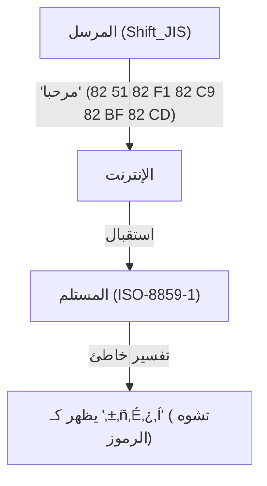
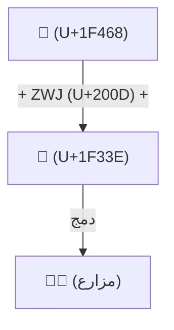

# تاريخ اليونيكود: كيف وحدت المعركة ضد تشوه الرموز أحرف العالم

عندما كان العالم الرقمي لا يزال في فجر عصر المعلومات النصية، كانت الأحرف التي يمكن لأجهزة الكمبيوتر التعامل معها محدودة للغاية. إن حقيقة أننا نستطيع اليوم قراءة وكتابة اليابانية والصينية والعربية على هواتفنا الذكية وأجهزة الكمبيوتر الشخصية بشكل طبيعي، وحتى إرسال واستقبال رموز تعبيرية مثل "😂" حول العالم، ترجع إلى الأسلاف الذين واصلوا لسنوات طويلة محاربة عدو قوي يُعرف باسم "تشوه الرموز" (Mojibake)، وتمكنوا من تحقيق الإنجاز الهائل المتمثل في توحيد ترميز الأحرف.

في هذه المقالة، سنتعمق في القصة الملحمية لـ "توحيد الأحرف" في تاريخ الحوسبة، بدءاً من ولادة ASCII، والفوضى العارمة التي سببتها الترميزات المحلية في مختلف البلدان، والولادة الطموحة لليونيكود (Unicode)، والتصميم العبقري لـ UTF-8 على يد كين تومسون وروب بايك، ومشكلة الأزواج البديلة (Surrogate pairs)، وصولاً إلى توحيد معايير الإيموجي (Emoji).

## 1. البداية مع ASCII (قيود الـ 7 بت)

لكي يتعامل الكمبيوتر مع الأحرف، فإنه يحتاج إلى "ترميز أحرف" يربط الأحرف بالقيم العددية. تم وضع **ASCII (الشيفرة القياسية الأمريكية لتبادل المعلومات)** في الولايات المتحدة في الستينيات، وكان المعيار الأساسي لذلك.

استخدم ASCII سبعة بتات (0 إلى 127) لتحديد الحروف الأبجدية الكبيرة والصغيرة، والأرقام، والرموز الأساسية، وأحرف التحكم. كان هذا كافياً للاستخدام في البلدان الناطقة باللغة الإنجليزية، ولكنه كان عاجزاً تماماً أمام حقيقة أن "هناك عدداً لا يحصى من اللغات في العالم بخلاف الإنجليزية". مع وجود 128 مساحة فقط، لم يتمكن ASCII حتى من تمثيل الأحرف ذات علامات التشكيل في اللغات الأوروبية (مثل é و ñ).

## 2. برج بابل: عصر الترميزات المحلية و"تشوه الرموز"

مع انتشار أجهزة الكمبيوتر حول العالم، طورت كل دولة تلو الأخرى ترميزاتها الخاصة باستخدام "النصف المتبقي" من ASCII (البت الثامن من 128 إلى 255)، أو بدمج بايتات متعددة.

- **عائلة ISO-8859**: مجموعة من ترميزات الـ 8 بت المصممة للغات الأوروبية (مثل ISO-8859-1 و Latin-1).
- **Shift_JIS (SJIS)**: طريقة مستخدمة على نطاق واسع في أجهزة الكمبيوتر الشخصية اليابانية (خاصة في MS-DOS و Windows) تمزج بين أحرف البايت الواحد (مثل كاتاكانا نصف العرض) وأحرف البايت المزدوج (الكانجي والهيراغانا).
- **EUC-JP**: ترميز ياباني يُستخدم غالباً في أنظمة UNIX.
- **GB2312 / Big5**: ترميزات للمناطق الناطقة بالصينية.

سمح هذا بتمثيل اللغات الوطنية على أجهزة الكمبيوتر، لكنه أدى إلى مشكلة رئيسية جديدة: ظاهرة حيث **"عند تبادل البيانات بين ترميزات أحرف مختلفة، يتم تفسيرها كأحرف مختلفة تماماً"**. هذا هو ما يُعرف بالسمعة السيئة باسم **تشوه الرموز (Mojibake)**.

على سبيل المثال، عند فتح رسالة بريد إلكتروني مُرسلة من اليابان بترميز Shift_JIS على جهاز كمبيوتر أوروبي (بإعداد Latin-1)، يتم تعيين سلسلة البايتات إلى أحرف مختلفة تماماً، وتظهر كسلسلة من الرموز غير المفهومة. كان تشوه الرموز على مواقع الويب ورسائل البريد الإلكتروني أمراً يومياً، وبالنسبة للمطورين، كان إنشاء برامج تدعم لغات متعددة (التدويل: i18n) بمثابة كابوس.

## 3. ولادة اليونيكود: جميع الأحرف في رمز واحد

من أجل كسر هذا الوضع الفوضوي، في أواخر الثمانينيات، اجتمع مهندسون من شركات مثل Apple و Xerox (جو بيكر، ولي كولينز، ومارك ديفيس وغيرهم) وأطلقوا مشروعاً طموحاً. كان هذا هو **اليونيكود (Unicode)**.

كانت رؤيتهم بسيطة وطموحة: "تضمين جميع الأحرف والرموز في العالم، وحتى الأحرف التاريخية من الماضي، في مجموعة أحرف موحدة واحدة (Character Set)".

بدأ اليونيكود في البداية بافتراض متفائل (UCS-2) بأن "16 بت (65,536 مساحة) ستكون كافية لاستيعاب جميع أحرف العالم". ومع ذلك، أثناء إضافة المقاطع الصينية المستخدمة في الصين واليابان وكوريا (مقاطع CJK الموحدة)، سرعان ما أصبح من الواضح أن الـ 16 بت لن تكون كافية. تم توسيع اليونيكود في النهاية إلى مساحة 21 بت (حوالي 1.11 مليون حرف)، ولا تزال الأحرف الجديدة تُضاف حتى يومنا هذا.

## 4. التصميم العبقري لـ UTF-8: كين تومسون وروب بايك

حتى مع وجود "قاموس أحرف" ضخم مثل اليونيكود، ظلت هناك مشكلة كيفية حفظه وتوصيله كسلسلة من البايتات على أجهزة الكمبيوتر (طريقة الترميز).

حاولت الترميزات المبكرة مثل UCS-2 و UTF-16 تمثيل جميع الأحرف في 2 بايت (أو 4 بايت). ومع ذلك، كان لهذا عيب خطير. إذا تم إدخال هذه البيانات في الأنظمة الحالية التي تتكون فقط من ASCII (مثل برامج UNIX أو لغة C)، فإن "0x00 (بايت فارغ - NULL)" سيظهر بشكل متكرر في المنتصف، مما يؤدي إلى تعطل النظام لاعتقاده الخاطئ بأنه نهاية السلسلة.

تم حل هذه المشكلة بأناقة من قبل **كين تومسون (Ken Thompson)** أبو الـ UNIX، و **روب بايك (Rob Pike)**. خلال العشاء في عام 1992، قاما برسم تخطيطي لطريقة ترميز ثورية على ظهر مفرش المائدة. كان هذا هو **UTF-8**.

يُقال إن تصميم UTF-8 هو أحد أجمل الاختراقات (hacks) في تاريخ علوم الكمبيوتر.
- **التوافق الكامل مع الإصدارات السابقة لـ ASCII**: يتم تمثيل أحرف ASCII (0-127) كما هي في بايت واحد، لذا فإن الأنظمة الغربية الحالية ودوال لغة C تعمل دون تغيير.
- **ترميز متغير الطول**: يغير الطول من بايت واحد إلى 4 بايتات اعتماداً على الحرف (تستغرق اليابانية في الغالب 3 بايتات).
- **التزامن الذاتي**: بمجرد النظر إلى نمط البتات في بداية البايت (مثل `0xxxxxxx`، `110xxxxx`، `10xxxxxx`)، يمكنك تحديد ما إذا كان هو البايت الأول من الحرف أم بايت تابع بشكل فوري. نتيجة لذلك، حتى لو بدأت القراءة من منتصف السلسلة، فلن يحدث تشوه في الرموز.

بفضل هذا التصميم العبقري، أصبح UTF-8 المعيار الفعلي العالمي في غمضة عين، واليوم يتم ترميز أكثر من 98% من الصفحات على الويب بـ UTF-8.

## 5. مشكلة الأزواج البديلة وفجر الإيموجي (Emoji)

عندما تجاوز اليونيكود حاجز الـ 16 بت (حوالي 60,000 حرف) وتم توسيعه، اضطرت طريقة ترميز UTF-16 إلى تقديم آلية معقدة تُعرف باسم "الأزواج البديلة" (Surrogate pairs). هذا يعني الجمع بين قيمتين من فئة 16 بت لتمثيل حرف واحد في المنطقة الموسعة. لا تزال هذه الآلية تمثل أرضاً خصبة للأخطاء (bugs)، مثل "العد غير الصحيح لعدد الأحرف" في بعض لغات البرمجة كـ JavaScript.

ثم، في العقد الأول من القرن الحادي والعشرين (2010s)، حدثت ثورة جديدة في اليونيكود. تم اعتماد **الإيموجي (Emoji)** بشكل رسمي كمعيار في اليونيكود (Unicode 6.0)، وهي التي تم تنفيذها بشكل مستقل من قبل شركات الهاتف المحمول اليابانية (DoCoMo و au و SoftBank).

مع إدخال الإيموجي، تجاوز اليونيكود كونه مجرد "أحرف" وتطور إلى لغة بصرية عالمية تنقل المشاعر والمفاهيم. بالإضافة إلى ذلك، تم تباعاً إضافة مواصفات معقدة لتعكس التنوع الحديث، مثل القدرة على تغيير لون البشرة (Skin Tone Modifier)، وآلية الجمع بين عدة رموز تعبيرية لإنشاء رمز واحد (ZWJ: Zero Width Joiner).

## الخاتمة: أساس يربط المعرفة البشرية بالمستقبل

يضم اتحاد اليونيكود اليوم كل شيء، من الهيروغليفية المصرية القديمة إلى الكتابة المسمارية، ولغات الأقليات، وأحدث الإيموجي.

بعد الفوضى والإحباط الناجمين عن عدد لا يحصى من حالات "تشوه الرموز"، وبفضل شغف وتعاون عدد لا يحصى من المهندسين، وصل تاريخ ترميز الأحرف الذي بدأ بـ 128 حرفاً فقط في ASCII إلى النقطة التي تم فيها دمج جميع أحرف البشرية في نظام ضخم واحد.

وراء رمز "😂" الذي نرسله بشكل عرضي، تكمن دراما عقود من "المعركة ضد تشوه الرموز" التي خاضها هؤلاء المهندسون.
