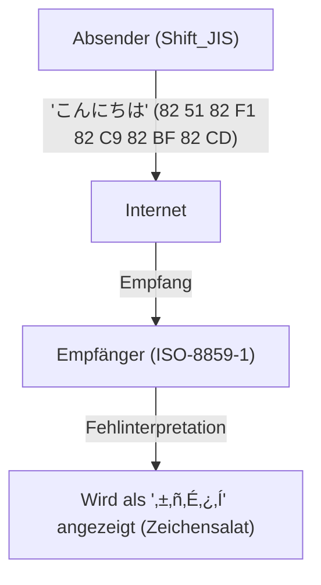
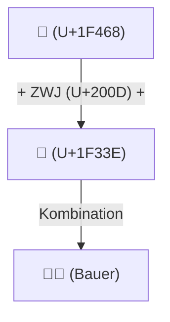

# Die Geschichte von Unicode: Wie der Kampf gegen Zeichensalat die Schriften der Welt vereinte

Als die digitale Welt noch in den Kindertagen der Textinformation steckte, waren die Zeichen, die Computer verarbeiten konnten, sehr begrenzt. Dass wir heute auf unseren Smartphones und PCs wie selbstverständlich Japanisch, Chinesisch oder Arabisch lesen und schreiben, und sogar Emojis wie „😂“ in die ganze Welt senden können, verdanken wir unseren Vorgängern, die jahrelang gegen den übermächtigen Feind „Zeichensalat“ (Mojibake) kämpften und die gewaltige Leistung erbrachten, die Zeichenkodierungen zu vereinheitlichen.

In diesem Artikel tauchen wir tief in die epische Geschichte der „Zeichenvereinheitlichung“ in der Computergeschichte ein: beginnend mit der Geburt von ASCII, über das durch lokale Kodierungen der verschiedenen Länder verursachte große Chaos, die ambitionierte Entstehung von Unicode, das geniale Design von UTF-8 durch Ken Thompson und Rob Pike, das Problem der Surrogate Pairs bis hin zur Standardisierung von Emojis.

## 1. Der Ursprung: ASCII (Die 7-Bit-Einschränkung)

Damit Computer Zeichen verarbeiten können, benötigen sie einen „Zeichencode“, der Zeichen bestimmten Zahlen zuordnet. Der in den 1960er Jahren in den USA festgelegte **ASCII (American Standard Code for Information Interchange)** war die grundlegendste Norm dafür.

ASCII definierte Groß- und Kleinbuchstaben, Zahlen, grundlegende Symbole sowie Steuerzeichen unter Verwendung von 7 Bit (0 bis 127). Für den Gebrauch im englischsprachigen Raum war dies ausreichend, aber gegenüber der Tatsache, dass „es auf der Welt unzählige Sprachen außer Englisch gibt“, war es völlig machtlos. Mit seinem Rahmen von nur 128 Plätzen konnte ASCII nicht einmal die akzentuierten Buchstaben europäischer Sprachen (wie é oder ñ) darstellen.

## 2. Der Turm zu Babel: Die Ära der lokalen Kodierungen und des „Zeichensalats“

Mit der weltweiten Verbreitung von Computern entwickelten verschiedene Länder nach und nach die „verbleibende Hälfte“ von ASCII (das 8. Bit, von 128 bis 255) oder eigene Kodierungsmethoden, die mehrere Bytes kombinierten.

- **ISO-8859-Familie**: Eine für europäische Sprachen entwickelte Gruppe von 8-Bit-Kodierungen (wie ISO-8859-1 und Latin-1).
- **Shift_JIS (SJIS)**: Ein auf japanischen PCs (insbesondere MS-DOS und Windows) weit verbreitetes System, das 1-Byte-Zeichen (wie Half-Width-Katakana) und 2-Byte-Zeichen (Kanji, Hiragana) mischte.
- **EUC-JP**: Eine häufig auf UNIX-Systemen verwendete japanische Kodierung.
- **GB2312 / Big5**: Kodierungen für den chinesischsprachigen Raum.

Dadurch wurde es zwar möglich, die jeweilige Landessprache auf Computern darzustellen, jedoch trat ein neues großes Problem auf. Das Phänomen, dass **„beim Austausch von Daten zwischen verschiedenen Zeichencodes diese als völlig andere Zeichen interpretiert werden“**. Dies ist das berüchtigte **Mojibake (Zeichensalat)**.

Wenn beispielsweise eine aus Japan in Shift_JIS gesendete E-Mail auf einem europäischen PC (mit Latin-1-Einstellung) geöffnet wurde, wurde die Bytefolge völlig anderen Zeichen zugeordnet und als eine bedeutungslose Aneinanderreihung von Symbolen angezeigt. Zeichensalat auf Websites oder in E-Mails war an der Tagesordnung, und für Entwickler war es ein wahrer Albtraum, Software zu entwickeln, die mehrere Sprachen unterstützt (Multilingualisierung: i18n).

## 3. Die Geburt von Unicode: Alle Zeichen in einem Code

Um diese chaotische Situation zu überwinden, versammelten sich Ende der 1980er Jahre Ingenieure von Unternehmen wie Apple und Xerox (darunter Joe Becker, Lee Collins, Mark Davis) und starteten ein ambitioniertes Projekt. Das war **Unicode**.

Ihre Vision war einfach, aber ehrgeizig: „Alle Zeichen, Symbole und sogar historische Zeichen aus der Vergangenheit der ganzen Welt in einem einzigen, einheitlichen Zeichensatz (Character Set) unterzubringen.“

Der frühe Unicode startete mit der optimistischen Annahme (UCS-2), dass „16 Bit (65.536 Zeichen) ausreichen würden, um alle Zeichen der Welt unterzubringen“. Bei der Aufnahme der chinesischen, japanischen und koreanischen Kanji (CJK Unified Ideographs) stellte sich jedoch schnell heraus, dass 16 Bit nicht genug Platz boten. Unicode wurde schließlich zu einem 21-Bit-Raum (etwa 1,11 Millionen Zeichen) erweitert, und noch heute werden ständig neue Zeichen hinzugefügt.

## 4. Das geniale Design von UTF-8: Ken Thompson und Rob Pike

Selbst nachdem Unicode als riesiges „Zeichenwörterbuch“ geschaffen war, blieb das Problem, wie dieses auf Computern als Bytefolge gespeichert und übertragen werden sollte (die Kodierungsmethode).

Die anfangs entwickelten Formate UCS-2 und UTF-16 versuchten, alle Zeichen mit 2 Bytes (oder 4 Bytes) darzustellen. Dies hatte jedoch einen gravierenden Nachteil: Wenn diese Daten in bestehende, rein auf ASCII basierende Systeme (wie UNIX oder C-Programme) eingespeist wurden, tauchte häufig das „0x00 (NULL-Byte)“ auf. Dies führte dazu, dass Systeme fälschlicherweise das Ende einer Zeichenfolge erkannten und abstürzten.

Dieses Problem wurde von den Vätern von UNIX, **Ken Thompson** und **Rob Pike**, auf elegante Weise gelöst. An einem Abend im Jahr 1992 skizzierten sie während des Abendessens auf der Rückseite eines Tischsets (Placemat) eine revolutionäre Kodierungsmethode. Das war **UTF-8**.

Das Design von UTF-8 gilt als einer der schönsten Hacks in der Geschichte der Informatik.
- **Vollständige Abwärtskompatibilität zu ASCII**: Da ASCII-Zeichen (0-127) wie gewohnt als 1 Byte dargestellt werden, funktionieren bestehende westliche Systeme und C-Funktionen ohne Änderungen weiter.
- **Kodierung mit variabler Länge**: Die Länge variiert je nach Zeichen von 1 bis 4 Bytes (Japanisch besteht z. B. meist aus 3 Bytes).
- **Selbstsynchronisation**: Allein durch das Betrachten des Bitmusters am Anfang eines Bytes (wie `0xxxxxxx`, `110xxxxx`, `10xxxxxx`) lässt sich sofort feststellen, ob es sich um das erste oder ein nachfolgendes Byte eines Zeichens handelt. Dadurch entsteht selbst beim Lesen ab der Mitte einer Zeichenfolge kein Zeichensalat.

Durch dieses geniale Design wurde UTF-8 in kürzester Zeit zum weltweiten De-facto-Standard, und heute sind über 98 % der Seiten im Web in UTF-8 kodiert.

## 5. Das Problem der Surrogate Pairs und die Dämmerung der Emojis

Als Unicode die Grenze von 16 Bit (ca. 60.000 Zeichen) überschritt, musste in der UTF-16-Kodierung ein komplexer Mechanismus namens „Surrogate Pair“ (Ersatzpaar) eingeführt werden. Hierbei werden zwei 16-Bit-Werte kombiniert, um ein einziges Zeichen aus dem erweiterten Bereich darzustellen. Dieser Mechanismus ist in einigen Programmiersprachen wie JavaScript noch heute eine Brutstätte für Fehler, beispielsweise wenn die „Anzahl der Zeichen falsch berechnet wird“.

In den 2010er Jahren erlebte Unicode dann eine weitere Revolution. Die von japanischen Mobilfunkanbietern (Docomo, au, SoftBank) unabhängig voneinander entwickelten **Emojis** wurden offiziell als Unicode-Standard (Unicode 6.0) übernommen.

Mit der Einführung von Emojis ging Unicode über den bloßen Rahmen von „Zeichen“ hinaus und entwickelte sich zu einer universellen visuellen Sprache, um Emotionen und Konzepte zu vermitteln. Darüber hinaus wurden nach und nach komplexe Spezifikationen hinzugefügt, um die heutige Vielfalt (Diversity) widerzuspiegeln, wie etwa Modifikatoren für die Hautfarbe (Skin Tone Modifier) oder die Möglichkeit, mehrere Emojis zu einem einzigen zu kombinieren (ZWJ: Zero Width Joiner).

## Fazit: Das Fundament, das das Wissen der Menschheit mit der Zukunft verbindet

Heute umfasst das Unicode-Konsortium alles von alten ägyptischen Hieroglyphen über Keilschrift, Sprachen ethnischer Minderheiten bis hin zu den neuesten Emojis.

Die Geschichte der Zeichenkodierung, die mit den bescheidenen 128 Zeichen von ASCII begann, hat durch unzählige Verwirrungen und Frustrationen durch „Zeichensalat“ hindurch und dank der Leidenschaft und Zusammenarbeit zahlloser Ingenieure dazu geführt, dass alle Schriften der Menschheit in einem einzigen riesigen System vereint wurden.

Hinter dem „😂“, das wir so beiläufig versenden, verbirgt sich das jahrzehntelange Drama der Ingenieure in ihrem „Kampf gegen den Zeichensalat“.
