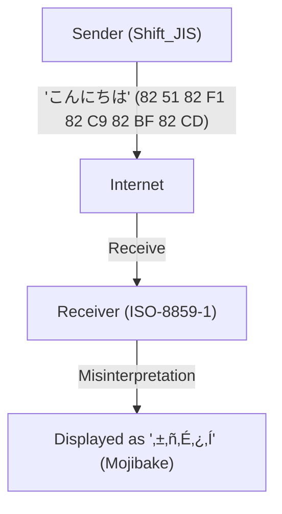
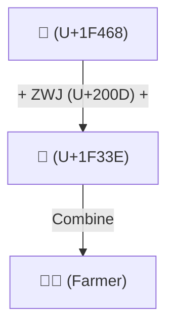

# History of Unicode: How the Battle Against Mojibake Unified the World's Characters

Back when the digital world was in the dawn of text information, the characters that computers could handle were extremely limited. The reason we can now casually read and write Japanese, Chinese, and Arabic on our smartphones and PCs, and even send and receive emojis like "😂" globally, is because our predecessors fought a long battle against the formidable enemy known as "Mojibake" (character corruption) and achieved the monumental feat of unifying character encodings.

This article delves deep into the epic story of "character unification" in computer history, starting from the birth of ASCII, the massive confusion caused by local encodings of various countries, the ambitious birth of Unicode, the genius design of UTF-8 by Ken Thompson and Rob Pike, the surrogate pair problem, and up to the standardization of Emoji.

## 1. ASCII as the Origin (The 7-bit Constraint)

For computers to handle characters, a "character encoding" that maps characters to numerical values is necessary. The **ASCII (American Standard Code for Information Interchange)**, established in the United States in the 1960s, was the most fundamental standard for this.

ASCII used 7 bits (0 to 127) to define uppercase and lowercase alphabets, numbers, basic symbols, and control characters. While this was sufficient for use in the English-speaking world, it was completely powerless against the fact that "there are countless languages in the world other than English." With only 128 slots, ASCII could not even represent characters with accent marks used in European languages (such as é and ñ).

## 2. The Tower of Babel: The Era of Local Encodings and "Mojibake"

As computers spread around the world, countries successively developed their own encoding methods combining multiple bytes or utilizing the "remaining half" of ASCII's space (the 8th bit, from 128 to 255).

- **ISO-8859 series**: A group of 8-bit encodings designed for European languages (like ISO-8859-1 and Latin-1).
- **Shift_JIS (SJIS)**: A method widely popularized in Japanese personal computers (especially MS-DOS and Windows) that mixes 1-byte characters (like half-width Katakana) and 2-byte characters (Kanji and Hiragana).
- **EUC-JP**: A Japanese encoding commonly used in UNIX-like systems.
- **GB2312 / Big5**: Encodings for the Chinese-speaking world.

This allowed each country's language to be represented on computers, but it created a new, massive problem. That was the phenomenon where **"when data is exchanged between different character encodings, it is interpreted as completely different characters."** This is the infamous **Mojibake**.

For example, if an email sent from Japan in Shift_JIS was opened on a European PC (set to Latin-1), the byte sequence would be mapped to completely different characters, displaying a string of incomprehensible symbols. Mojibake on websites and emails was a daily occurrence, and for developers, creating software that supported multiple languages (multilingual support: i18n) was a nightmare.

## 3. The Birth of Unicode: All Characters in a Single Code

To break through this chaotic situation, in the late 1980s, engineers from Apple, Xerox, and others (such as Joe Becker, Lee Collins, and Mark Davis) gathered and launched an ambitious project. That was **Unicode**.

Their vision was simple and ambitious: "To fit all characters, symbols, and even historical characters of the world into a single, unified Character Set."

Early Unicode started with the optimistic assumption (UCS-2) that "all the world's characters could fit within 16 bits (65,536 characters)." However, as they began to include Chinese, Japanese, and Korean kanji (CJK Unified Ideographs), it quickly became apparent that 16 bits would not be enough. Unicode was eventually expanded to a 21-bit space (about 1.11 million characters), and new characters continue to be added today.

## 4. The Genius Design of UTF-8: Ken Thompson and Rob Pike

Even with the creation of the massive "dictionary of characters" that is Unicode, the problem remained of how to store and transmit them as byte sequences on computers (the encoding method).

Early proposed methods like UCS-2 and UTF-16 tried to represent all characters with 2 bytes (or 4 bytes). However, this had a fatal flaw. When this data was fed into existing systems built entirely around ASCII (such as UNIX or C programming applications), "0x00 (NULL bytes)" would frequently appear in the middle of the data. Systems would misinterpret this as the end of a string and crash.

The people who elegantly solved this problem were the fathers of UNIX, **Ken Thompson** and **Rob Pike**. During dinner in 1992, they sketched out a groundbreaking encoding method on the back of a placemat. This was **UTF-8**.

The design of UTF-8 is hailed as one of the most beautiful hacks in the history of computer science.
- **Complete backwards compatibility with ASCII**: ASCII characters (0-127) are represented in exactly 1 byte, meaning existing systems aimed at the West and C language functions work out of the box.
- **Variable-length encoding**: The length changes from 1 byte to 4 bytes depending on the character (Japanese and others are mainly 3 bytes).
- **Self-synchronizing**: Just by looking at the bit pattern at the beginning of a byte (such as `0xxxxxxx`, `110xxxxx`, or `10xxxxxx`), you can instantly determine whether it is the leading byte of a character or a continuation byte. Because of this, you won't get Mojibake even if you start reading from the middle of a string.

Thanks to this genius design, UTF-8 quickly became the de facto standard of the world, and today over 98% of web pages are encoded in UTF-8.

## 5. The Surrogate Pair Problem and the Dawn of Emoji

When Unicode expanded beyond the 16-bit (about 60,000 characters) barrier, the UTF-16 encoding method had to introduce a complex mechanism called "surrogate pairs." This involves combining two 16-bit values to represent a single character in the expanded region. This mechanism remains a hotbed for bugs even today, such as "inaccurate character counts" in certain programming languages like JavaScript.

Then, in the 2010s, a new revolution occurred in Unicode. The **Emoji** independently implemented by Japanese mobile carriers (Docomo, au, SoftBank) were officially adopted as a Unicode standard (Unicode 6.0).

With the introduction of Emoji, Unicode evolved beyond the bounds of mere "characters" into a universal visual language for conveying emotions and concepts. Furthermore, complex specifications are continuously being added to reflect modern diversity, such as the ability to change skin colors (Skin Tone Modifier) and the mechanism to combine multiple emojis into one (ZWJ: Zero Width Joiner).

## Conclusion: A Foundation Connecting Human Knowledge to the Future

Today, the Unicode Consortium includes everything from ancient Egyptian hieroglyphs to cuneiform, minority languages, and the latest emojis.

The history of character encodings, which started with just 128 ASCII characters, has gone through countless confusing and frustrating experiences with "Mojibake," and through the passion and cooperation of countless engineers, it has achieved the integration of all human characters into a single massive system.

Behind the "😂" we casually send, hides the drama of these engineers' decades-long "battle against Mojibake."
