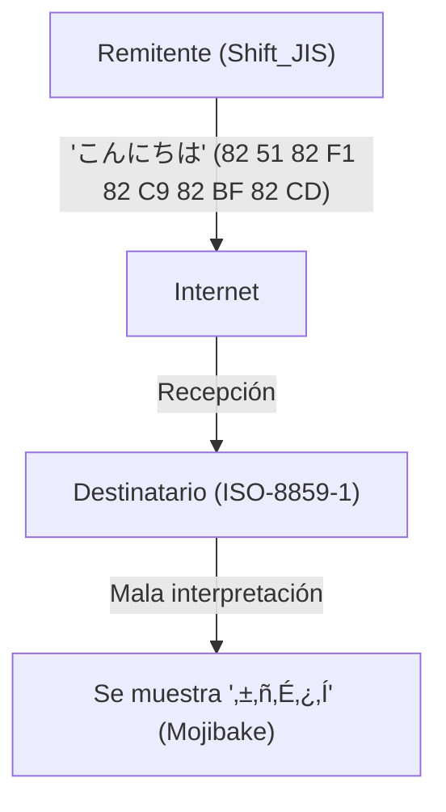
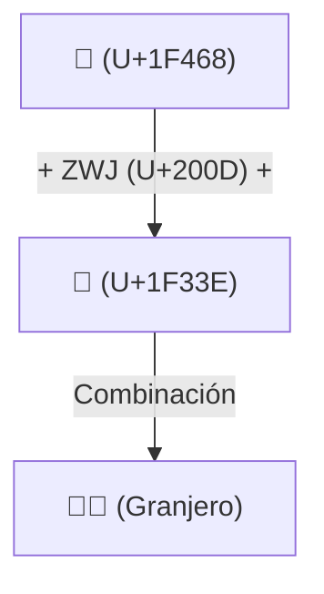

# La historia de Unicode: Cómo la batalla contra el Mojibake unificó los caracteres del mundo

Cuando el mundo digital aún estaba en los albores de la información textual, los caracteres que las computadoras podían manejar eran muy limitados. El hecho de que hoy en día podamos leer y escribir en japonés, chino o árabe en nuestros teléfonos inteligentes y PC con total normalidad, e incluso enviar y recibir emojis como "😂" en todo el mundo, se debe a que nuestros predecesores lucharon durante mucho tiempo contra el formidable enemigo llamado "Mojibake" (texto corrupto o caracteres extraños) y lograron la monumental hazaña de unificar las codificaciones de caracteres.

En este artículo, profundizaremos en la épica historia de la "unificación de caracteres" en la historia de la computación, comenzando con el nacimiento de ASCII, el gran caos causado por las codificaciones locales de varios países, el ambicioso nacimiento de Unicode, el diseño genial de UTF-8 por Ken Thompson y Rob Pike, el problema de los pares subrogados y, finalmente, la estandarización de los emojis (Emoji).

## 1. El origen: ASCII (La restricción de 7 bits)

Para que las computadoras manejen texto, necesitan una "codificación de caracteres" (character code) que asigne caracteres a valores numéricos. **ASCII (American Standard Code for Information Interchange)**, establecido en los Estados Unidos en la década de 1960, fue el estándar más fundamental.

ASCII utilizaba 7 bits (del 0 al 127) para definir letras mayúsculas y minúsculas del alfabeto, números, símbolos básicos y caracteres de control. Esto era suficiente para su uso en países de habla inglesa, pero era completamente inútil frente al hecho de que "hay innumerables idiomas aparte del inglés en el mundo". Con un espacio de solo 128 posiciones, ASCII ni siquiera podía representar caracteres con acentos de lenguajes europeos (como é o ñ).

## 2. La Torre de Babel: La era de las codificaciones locales y el "Mojibake"

A medida que las computadoras se propagaban por el mundo, varios países desarrollaron sucesivamente sus propios sistemas de codificación utilizando la "otra mitad del espacio" de ASCII (del 128 al 255 del octavo bit) o combinando múltiples bytes.

- **Serie ISO-8859**: Grupos de codificación de 8 bits diseñados para lenguajes europeos (como ISO-8859-1 y Latin-1).
- **Shift_JIS (SJIS)**: Un sistema ampliamente adoptado en las computadoras japonesas (especialmente MS-DOS y Windows) que mezclaba caracteres de 1 byte (como el katakana de ancho medio) y caracteres de 2 bytes (kanji e hiragana).
- **EUC-JP**: Una codificación japonesa utilizada frecuentemente en sistemas tipo UNIX.
- **GB2312 / Big5**: Codificaciones para la región de habla china.

Esto permitió representar sus propios idiomas en las computadoras, pero generó un nuevo y gran problema. El fenómeno en el que **"si se intercambian datos entre diferentes codificaciones de caracteres, se interpretan como caracteres completamente distintos"**. Este es el infame **Mojibake** (texto ilegible).

Por ejemplo, si un correo electrónico enviado desde Japón en Shift_JIS se abría en una PC europea (configurada en Latin-1), la secuencia de bytes se mapeaba a caracteres completamente diferentes, mostrando una cadena de símbolos sin sentido. El Mojibake en sitios web y correos electrónicos era algo de todos los días, y para los desarrolladores, crear software que soportara múltiples idiomas (internacionalización: i18n) era una tarea de pesadilla.

## 3. El nacimiento de Unicode: Todos los caracteres en un solo código

Para superar esta situación caótica, a finales de la década de 1980, ingenieros de empresas como Apple y Xerox (Joe Becker, Lee Collins, Mark Davis, entre otros) se reunieron y lanzaron un ambicioso proyecto. Eso es **Unicode**.

Su visión era simple y ambiciosa. El objetivo era "albergar todos los caracteres y símbolos del mundo, e incluso caracteres históricos del pasado, en un único conjunto de caracteres (Character Set) unificado".

El Unicode inicial comenzó con la premisa optimista de que "todos los caracteres del mundo cabrían en 16 bits (65.536 caracteres)" (UCS-2). Sin embargo, al ir incluyendo los kanjis de China, Japón y Corea (Ideogramas Unificados CJK), pronto se hizo evidente que 16 bits no serían suficientes. Finalmente, Unicode se expandió a un espacio de 21 bits (alrededor de 1,11 millones de caracteres), y hasta el día de hoy se siguen añadiendo nuevos caracteres.

## 4. El diseño genial de UTF-8: Ken Thompson y Rob Pike

Incluso después de crear el gigantesco "diccionario de caracteres" que es Unicode, quedaba el problema de cómo guardar y transmitir esto como secuencias de bytes en las computadoras (sistema de codificación).

UCS-2 y UTF-16, ideados al principio, intentaron representar todos los caracteres en 2 bytes (o 4 bytes). Sin embargo, esto tenía un defecto grave. Si se introducían estos datos en sistemas existentes construidos solo para ASCII (programas en UNIX o C), el "0x00 (byte NULL)" aparecía con frecuencia, lo que provocaba que el sistema lo interpretara erróneamente como el final de una cadena y colapsara.

Quienes resolvieron elegantemente este problema fueron el padre de UNIX, **Ken Thompson**, y **Rob Pike**. Durante la cena en 1992, en el reverso de un mantel individual, dibujaron el boceto de un sistema de codificación revolucionario. Este es **UTF-8**.

Se dice que el diseño de UTF-8 es uno de los hacks más hermosos en la historia de las ciencias de la computación.
- **Compatibilidad total hacia atrás con ASCII**: Dado que los caracteres ASCII (0-127) se representan tal cual en 1 byte, los sistemas occidentales existentes y las funciones del lenguaje C funcionan sin problemas.
- **Codificación de longitud variable**: Cambia la longitud de 1 a 4 bytes dependiendo del carácter (el japonés, por ejemplo, utiliza principalmente 3 bytes).
- **Autosincronización**: Con solo mirar el patrón de bits inicial del byte (como `0xxxxxxx`, `110xxxxx`, `10xxxxxx`), se puede determinar inmediatamente si es el primer byte de un carácter o un byte subsiguiente. Gracias a esto, aunque se empiece a leer desde la mitad de la cadena, no ocurre el mojibake.

Gracias a este genial diseño, UTF-8 se convirtió rápidamente en el estándar de facto mundial, y hoy en día más del 98% de las páginas en la web están codificadas en UTF-8.

## 5. El problema de los pares subrogados y el amanecer de los emojis (Emoji)

Cuando Unicode superó la barrera de los 16 bits (unos 60.000 caracteres) y se expandió, en el sistema de codificación UTF-16 no hubo más remedio que introducir un mecanismo complejo llamado "pares subrogados" (surrogate pairs). Consiste en combinar dos valores de 16 bits para representar un solo carácter en el área de expansión. Este mecanismo sigue siendo fuente de errores en algunos lenguajes de programación actuales, como JavaScript, donde "el conteo de caracteres se desfasa".

Y en la década de 2010, ocurrió una nueva revolución en Unicode. Los **emojis (Emoji)**, implementados de forma independiente por las operadoras de telefonía móvil japonesas (Docomo, au, SoftBank), fueron adoptados oficialmente como estándar de Unicode (Unicode 6.0).

Con la introducción de los emojis, Unicode trascendió los límites de ser meros "caracteres" y evolucionó hasta convertirse en un lenguaje visual universal para transmitir emociones y conceptos. Además, continuamente se añaden especificaciones complejas para reflejar la diversidad moderna, como los modificadores de tono de piel (Skin Tone Modifier) y el mecanismo para combinar varios emojis en uno solo (ZWJ: Zero Width Joiner).

## Conclusión: La base que conecta el conocimiento humano con el futuro

Hoy en día, el Consorcio Unicode incluye desde jeroglíficos del antiguo Egipto hasta escritura cuneiforme, lenguas de minorías étnicas y los emojis más recientes.

La historia de los códigos de caracteres, que comenzó con solo los 128 caracteres de ASCII, ha pasado por la confusión y la frustración de innumerables "mojibakes", y gracias a la pasión y cooperación de innumerables ingenieros, ha logrado integrar todos los caracteres de la humanidad en un único y gigantesco sistema.

Detrás de ese "😂" que enviamos de forma casual, se esconde el drama de la "batalla contra el mojibake" librada por los ingenieros durante décadas.
