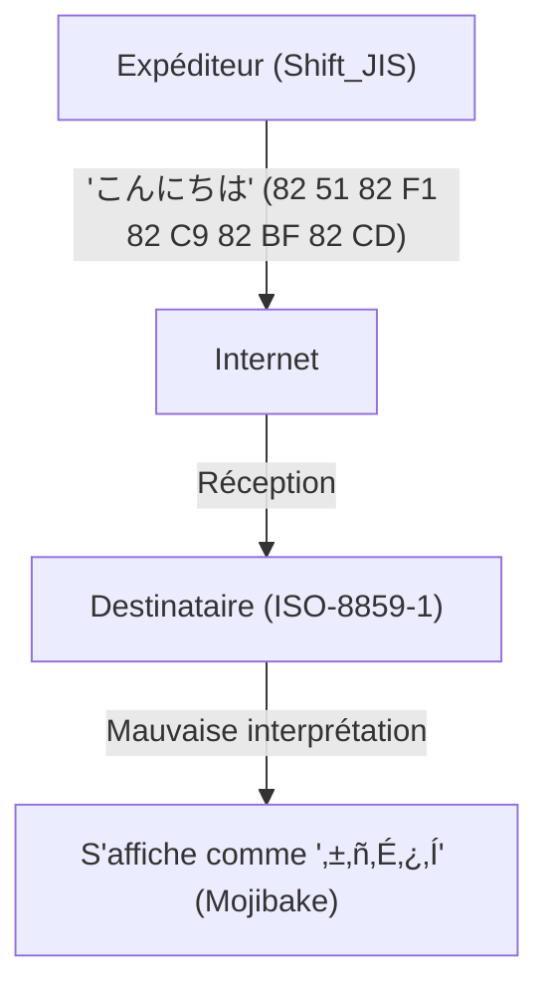
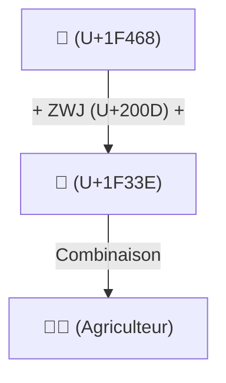

# Histoire d'Unicode : Comment la lutte contre le Mojibake a unifié les caractères du monde

Lorsque le monde numérique n'en était qu'aux prémices de l'information textuelle, les caractères que les ordinateurs pouvaient manipuler étaient extrêmement limités. Si nous pouvons aujourd'hui lire et écrire naturellement en japonais, chinois ou arabe sur nos smartphones et PC, et même envoyer ou recevoir des emojis comme « 😂 » partout dans le monde, c'est parce que nos prédécesseurs ont combattu pendant de nombreuses années un formidable ennemi appelé « Mojibake » (caractères corrompus) et ont accompli l'exploit monumental d'unifier les encodages de caractères.

Cet article plonge au cœur de l'histoire épique de « l'unification des caractères » dans l'histoire de l'informatique : de la naissance de l'ASCII et du chaos massif causé par les encodages locaux de chaque pays, à la naissance ambitieuse d'Unicode, la conception géniale de l'UTF-8 par Ken Thompson et Rob Pike, le problème des paires de substitution, jusqu'à la standardisation des emojis.

## 1. L'origine : L'ASCII (La limite des 7 bits)

Pour qu'un ordinateur puisse traiter des caractères, il a besoin d'un « encodage de caractères » qui associe un caractère à une valeur numérique. L'**ASCII (American Standard Code for Information Interchange)**, établi aux États-Unis dans les années 1960, a été la norme la plus fondamentale pour cela.

L'ASCII utilisait 7 bits (0 à 127) pour définir les lettres majuscules et minuscules de l'alphabet, les chiffres, les symboles de base et les caractères de contrôle. Bien que cela fût suffisant pour une utilisation dans le monde anglophone, c'était totalement impuissant face au fait qu'« il existe d'innombrables langues autres que l'anglais dans le monde ». Avec seulement 128 espaces disponibles, l'ASCII ne pouvait même pas représenter les caractères accentués des langues européennes (comme é ou ñ).

## 2. La Tour de Babel : L'ère des encodages locaux et du « Mojibake »

À mesure que les ordinateurs se répandaient dans le monde, différents pays ont commencé à développer leurs propres systèmes d'encodage en utilisant la « moitié restante » de l'ASCII (le 8e bit, de 128 à 255) ou en combinant plusieurs octets.

- **Famille ISO-8859** : Groupes d'encodages 8 bits conçus pour les langues européennes (comme ISO-8859-1 et Latin-1).
- **Shift_JIS (SJIS)** : Une méthode largement répandue sur les PC japonais (notamment MS-DOS et Windows) qui mélangeait des caractères sur un octet (comme les katakanas demi-chasse) et sur deux octets (kanjis et hiraganas).
- **EUC-JP** : Encodage japonais souvent utilisé dans les systèmes UNIX.
- **GB2312 / Big5** : Encodages de la sphère sinophone.

Bien que cela ait permis de représenter les langues nationales sur des ordinateurs, un nouveau problème majeur est apparu. Il s'agit du phénomène où **« l'échange de données entre différents encodages de caractères entraîne leur interprétation comme des caractères totalement différents »**. C'est le tristement célèbre **Mojibake**.

Par exemple, lorsqu'un e-mail envoyé du Japon en Shift_JIS était ouvert sur un PC européen (configuré en Latin-1), la séquence d'octets était associée à des caractères totalement différents, s'affichant comme une série de symboles incompréhensibles. Le Mojibake sur les sites web et dans les e-mails était monnaie courante, et créer des logiciels supportant plusieurs langues (internationalisation : i18n) était une tâche cauchemardesque pour les développeurs.

## 3. La naissance d'Unicode : Tous les caractères dans un seul code

Pour surmonter cette situation chaotique, des ingénieurs d'entreprises comme Apple et Xerox (Joe Becker, Lee Collins, Mark Davis, etc.) se sont rassemblés à la fin des années 1980 pour lancer un projet grandiose. C'est **Unicode**.

Leur vision était à la fois simple et ambitieuse. Il s'agissait de « rassembler tous les caractères du monde, les symboles, et même les caractères historiques du passé dans un seul et unique jeu de caractères unifié (Character Set) ».

Le premier Unicode a démarré avec l'hypothèse optimiste que « tous les caractères du monde pourraient tenir dans 16 bits (65 536 caractères) » (UCS-2). Cependant, en intégrant les caractères chinois, japonais et coréens (les kanjis unifiés CJK), il est vite devenu évident que 16 bits ne suffiraient pas. Unicode a finalement été étendu à un espace de 21 bits (environ 1,11 million de caractères), et de nouveaux caractères continuent d'y être ajoutés aujourd'hui.

## 4. La conception géniale de l'UTF-8 : Ken Thompson et Rob Pike

Même avec la création de cet immense « dictionnaire de caractères » qu'est Unicode, il restait le problème de savoir comment l'enregistrer et le transmettre sous forme de séquence d'octets sur un ordinateur (méthode d'encodage).

Les premiers systèmes conçus, UCS-2 et UTF-16, tentaient de représenter tous les caractères avec 2 octets (ou 4 octets). Cependant, cela présentait un défaut majeur. Lorsqu'on injectait ces données dans des systèmes existants basés uniquement sur l'ASCII (comme UNIX ou des programmes en langage C), l'octet « 0x00 (octet NULL) » apparaissait fréquemment, et le système plantait en croyant à tort qu'il s'agissait de la fin de la chaîne de caractères.

Ce problème a été résolu avec élégance par les pères d'UNIX, **Ken Thompson** et **Rob Pike**. En 1992, lors d'un dîner, ils ont dessiné au dos d'un set de table le croquis d'une méthode d'encodage révolutionnaire. Il s'agissait de l'**UTF-8**.

La conception de l'UTF-8 est considérée comme l'un des plus beaux hacks de l'histoire de l'informatique.
- **Rétrocompatibilité totale avec l'ASCII** : Puisque les caractères ASCII (0-127) sont représentés tels quels sur 1 octet, les systèmes occidentaux existants et les fonctions du langage C fonctionnent sans aucune modification.
- **Encodage à longueur variable** : La longueur varie de 1 à 4 octets selon le caractère (le japonais utilise principalement 3 octets).
- **Auto-synchronisation** : Rien qu'en regardant le motif de bits de départ d'un octet (comme `0xxxxxxx`, `110xxxxx`, `10xxxxxx`, etc.), il est possible de déterminer immédiatement s'il s'agit du premier octet d'un caractère ou d'un octet suivant. Ainsi, même si l'on commence à lire au milieu d'une chaîne, il n'y a pas de Mojibake.

Grâce à cette conception géniale, l'UTF-8 est rapidement devenu le standard de fait mondial, et aujourd'hui, plus de 98 % des pages sur le web sont encodées en UTF-8.

## 5. Le problème des paires de substitution et l'aube des emojis

Lorsqu'Unicode a franchi la barrière des 16 bits (environ 60 000 caractères), la méthode d'encodage UTF-16 a dû introduire un mécanisme complexe appelé « paire de substitution » (Surrogate Pair). Cela consistait à combiner deux valeurs de 16 bits pour représenter un seul caractère situé dans la zone étendue. Ce mécanisme reste aujourd'hui une source de bugs, comme le « décalage dans le comptage du nombre de caractères », dans certains langages de programmation comme JavaScript.

Puis, dans les années 2010, une nouvelle révolution a eu lieu au sein d'Unicode. Les **emojis**, implémentés à l'origine de manière propriétaire par les opérateurs de téléphonie mobile japonais (Docomo, au, SoftBank), ont été officiellement adoptés comme standard Unicode (Unicode 6.0).

Avec l'introduction des emojis, Unicode a dépassé le simple cadre des « caractères » pour évoluer vers un langage visuel universel permettant de transmettre des émotions et des concepts. De plus, pour refléter la diversité du monde moderne, des spécifications complexes ont été ajoutées l'une après l'autre, comme la modification de la couleur de peau (Skin Tone Modifier) ou le mécanisme de combinaison de plusieurs emojis pour en créer un nouveau (ZWJ : Zero Width Joiner).

## Conclusion : Une fondation pour relier le savoir de l'humanité à l'avenir

Aujourd'hui, le consortium Unicode intègre aussi bien des hiéroglyphes de l'Égypte antique que l'écriture cunéiforme, les langues de minorités ethniques, et les tout derniers emojis.

L'histoire de l'encodage de caractères, qui a commencé avec les maigres 128 caractères de l'ASCII, a traversé une période de chaos et de frustration causée par d'innombrables « Mojibake », pour aboutir, grâce à la passion et à la coopération d'innombrables ingénieurs, à l'intégration de tous les caractères de l'humanité dans un seul et immense système.

Derrière ce simple « 😂 » que nous envoyons avec insouciance se cache tout le drame de cette « lutte contre le Mojibake » menée par les ingénieurs pendant plusieurs décennies.
