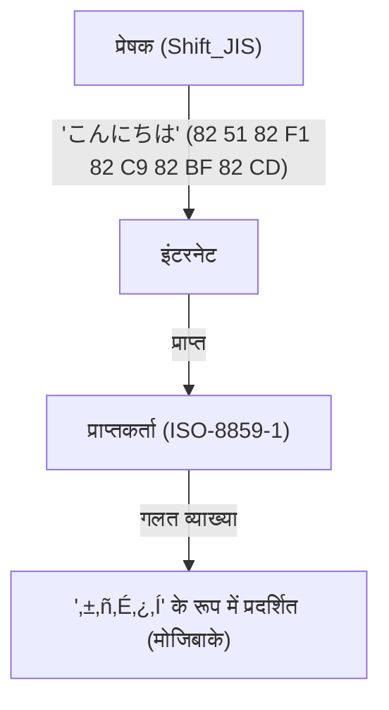
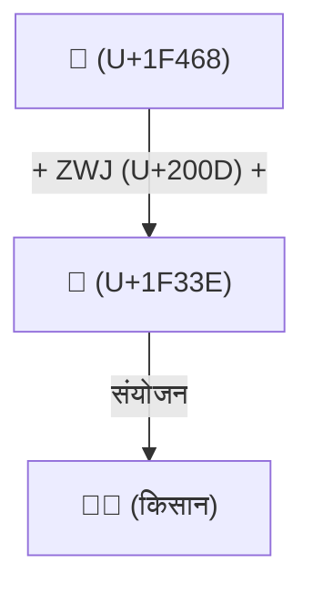

# यूनिकोड का इतिहास: मोजिबाके (Mojibake) के खिलाफ लड़ाई ने दुनिया भर के वर्णों को कैसे एकजुट किया

डिजिटल दुनिया के शुरुआती दिनों में जब टेक्स्ट जानकारी अभी अपने शैशवावस्था में थी, कंप्यूटर जिन वर्णों को संभाल सकते थे वे बहुत सीमित थे। आज हम अपने स्मार्टफ़ोन और पीसी पर स्वाभाविक रूप से जापानी, चीनी और अरबी पढ़ और लिख सकते हैं, और यहाँ तक कि दुनिया भर में "😂" जैसे इमोजी भेज और प्राप्त कर सकते हैं। ऐसा इसलिए संभव हुआ क्योंकि हमारे पूर्वजों ने "मोजिबाके (Mojibake)" यानी कैरेक्टर करप्शन (character corruption) नामक एक दुर्जेय दुश्मन से सालों तक लड़ाई लड़ी, और वर्ण कोडिंग को एकजुट करने की असाधारण उपलब्धि हासिल की।

इस लेख में, हम कंप्यूटर इतिहास में "वर्णों के एकीकरण" की महाकाव्य कहानी की गहराई में जाएँगे। यह ASCII के जन्म से शुरू होकर विभिन्न देशों की स्थानीय एन्कोडिंग के कारण हुई अराजकता, यूनिकोड की महत्वाकांक्षी शुरुआत, केन थॉम्पसन और रॉब पाइक द्वारा UTF-8 की शानदार डिज़ाइन, सरोगेट पेयर (surrogate pair) की समस्या, और अंत में इमोजी (Emoji) के मानकीकरण तक जाती है।

## 1. मूल बिंदु के रूप में ASCII (7-बिट की सीमा)

कंप्यूटरों के लिए वर्णों को संभालने के लिए, एक "कैरेक्टर कोड (character code)" की आवश्यकता होती है जो वर्णों को संख्याओं में मैप करता है। 1960 के दशक में अमेरिका में स्थापित **ASCII (अमेरिकन स्टैंडर्ड कोड फॉर इंफॉर्मेशन इंटरचेंज)** इसका सबसे बुनियादी मानक था।

ASCII ने 7 बिट्स (0 से 127) का उपयोग करके अपरकेस और लोअरकेस अंग्रेजी अक्षर, संख्याएँ, बुनियादी प्रतीक और नियंत्रण वर्णों (control characters) को परिभाषित किया। यह अंग्रेजी भाषी दुनिया में उपयोग के लिए पर्याप्त था, लेकिन "दुनिया में अंग्रेजी के अलावा अनगिनत भाषाएँ हैं" इस तथ्य के सामने पूरी तरह से असहाय था। केवल 128 स्लॉट वाले ASCII में यूरोपीय भाषाओं के उच्चारण चिह्नों वाले वर्णों (जैसे é या ñ) को भी प्रदर्शित नहीं किया जा सकता था।

## 2. बैबल की मीनार: स्थानीय एन्कोडिंग और "मोजिबाके" का युग

जैसे-जैसे कंप्यूटर दुनिया भर में फैले, देशों ने ASCII के "बाकी आधे हिस्से" (8वें बिट के 128 से 255) का उपयोग करते हुए, या कई बाइट्स को मिलाकर अपनी स्वयं की एन्कोडिंग योजनाएँ विकसित करना शुरू कर दिया।

- **ISO-8859 सीरीज़**: यूरोपीय भाषाओं के लिए डिज़ाइन किए गए 8-बिट एन्कोडिंग समूह (ISO-8859-1, Latin-1, आदि)।
- **Shift_JIS (SJIS)**: एक ऐसी प्रणाली जो 1-बाइट वर्णों (हाफ-विड्थ काताकाना, आदि) और 2-बाइट वर्णों (कांजी और हीरागाना) को मिलाती है, और जापानी पीसी (विशेष रूप से MS-DOS और Windows) में व्यापक रूप से उपयोग की गई।
- **EUC-JP**: जापानी एन्कोडिंग जो आमतौर पर UNIX सिस्टम पर उपयोग की जाती थी।
- **GB2312 / Big5**: चीनी भाषी क्षेत्रों की एन्कोडिंग।

हालांकि इससे कंप्यूटरों पर अपनी भाषाओं का प्रतिनिधित्व करना संभव हो गया, एक नई बड़ी समस्या पैदा हो गई। **"जब अलग-अलग कैरेक्टर कोड्स के बीच डेटा का आदान-प्रदान किया जाता है, तो इसकी पूरी तरह से अलग वर्णों के रूप में व्याख्या की जाती है।"** यही कुख्यात **मोजिबाके (Mojibake)** है।

उदाहरण के लिए, यदि जापान से Shift_JIS में भेजा गया कोई ईमेल किसी यूरोपीय पीसी (Latin-1 सेटिंग के साथ) पर खोला जाता है, तो बाइट अनुक्रम को पूरी तरह से अलग वर्णों में मैप कर दिया जाता था, और यह अर्थहीन प्रतीकों की एक शृंखला के रूप में दिखाई देता था। वेबसाइटों और ईमेलों पर मोजिबाके एक दैनिक घटना थी, और डेवलपर्स के लिए कई भाषाओं का समर्थन करने वाले सॉफ़्टवेयर (मल्टीलिंग्वल सपोर्ट: i18n) बनाना एक दुःस्वप्न जैसा काम था।

## 3. यूनिकोड का जन्म: एक कोड में सभी वर्ण

इस अराजक स्थिति को दूर करने के लिए, 1980 के दशक के उत्तरार्ध में Apple और Xerox (जो बेकर, ली कॉलिन्स, मार्क डेविस, आदि) के इंजीनियर एक साथ आए और एक महत्वाकांक्षी प्रोजेक्ट शुरू किया। वह **यूनिकोड (Unicode)** था।

उनका दृष्टिकोण सरल और महत्वाकांक्षी था: "दुनिया के सभी वर्णों, प्रतीकों और यहाँ तक कि ऐतिहासिक वर्णों को एक ही एकीकृत कैरेक्टर सेट (Character Set) में शामिल करना।"

प्रारंभिक यूनिकोड इस आशावादी धारणा (UCS-2) के साथ शुरू हुआ कि "दुनिया के सभी वर्ण 16 बिट्स (65,536 वर्णों) में फिट हो जाएँगे।" हालाँकि, जैसे ही चीन, जापान और कोरिया (CJK एकीकृत कांजी) के कांजी वर्णों को शामिल किया गया, यह तुरंत स्पष्ट हो गया कि 16 बिट्स पर्याप्त नहीं होंगे। यूनिकोड को अंततः 21-बिट स्पेस (लगभग 1.11 मिलियन वर्णों) में विस्तारित किया गया, और आज भी इसमें नए वर्ण जोड़े जा रहे हैं।

## 4. UTF-8 की शानदार डिज़ाइन: केन थॉम्पसन और रॉब पाइक

यूनिकोड के विशाल "वर्णों के शब्दकोश" के बन जाने के बाद भी, यह समस्या बनी रही कि कंप्यूटर पर उन्हें बाइट्स (एन्कोडिंग विधि) के अनुक्रम के रूप में कैसे सहेजा और संप्रेषित किया जाए।

शुरुआत में तैयार किए गए UCS-2 और UTF-16 ने सभी वर्णों को 2 बाइट्स (या 4 बाइट्स) में दर्शाने का प्रयास किया। लेकिन इसमें एक गंभीर खामी थी। जब यह डेटा मौजूदा सिस्टम (जैसे UNIX या C प्रोग्राम) में भेजा जाता था जो केवल ASCII का उपयोग करते थे, तो "0x00 (NULL बाइट)" अक्सर बीच में दिखाई देता था। इसके कारण सिस्टम इसे स्ट्रिंग का अंत समझ कर क्रैश हो जाता था।

इस समस्या को UNIX के पिता **केन थॉम्पसन (Ken Thompson)** और **रॉब पाइक (Rob Pike)** ने बहुत ही खूबसूरती से हल किया। 1992 में रात के खाने के समय, उन्होंने एक प्लेसमैट (लंचन मैट) के पीछे एक क्रांतिकारी एन्कोडिंग विधि का स्केच तैयार किया। यही **UTF-8** था।

UTF-8 की डिज़ाइन को कंप्यूटर विज्ञान के इतिहास में सबसे खूबसूरत हैक (hack) में से एक माना जाता है।
- **ASCII के साथ पूर्ण बैकवर्ड संगतता**: चूंकि ASCII वर्णों (0-127) को 1 बाइट के रूप में वैसे ही दर्शाया जाता है, मौजूदा पश्चिमी सिस्टम और C भाषा के फ़ंक्शन बिना किसी बदलाव के काम करते हैं।
- **वेरिएबल-लेंथ एन्कोडिंग**: वर्ण के आधार पर लंबाई 1 बाइट से 4 बाइट्स तक बदलती है (जापानी वर्ण मुख्य रूप से 3 बाइट्स लेते हैं)।
- **स्वयं-सिंक्रोनाइज़िंग (Self-synchronizing)**: किसी बाइट का पहला बिट पैटर्न (`0xxxxxxx`, `110xxxxx`, `10xxxxxx`, आदि) देखकर आप तुरंत बता सकते हैं कि यह किसी वर्ण का पहला बाइट है या बाद वाला बाइट। इससे यह सुनिश्चित होता है कि स्ट्रिंग के बीच से पढ़ने पर भी वर्ण विकृत (मोजिबाके) नहीं होते हैं।

इस प्रतिभाशाली डिज़ाइन के कारण, UTF-8 जल्दी ही विश्व का वास्तविक मानक (de facto standard) बन गया, और आज वेब पर 98% से अधिक पेज UTF-8 में एन्कोड किए गए हैं।

## 5. सरोगेट पेयर समस्या और इमोजी (Emoji) का उदय

जब यूनिकोड ने 16-बिट (लगभग 60,000 वर्ण) की बाधा को पार किया और इसका विस्तार हुआ, तो UTF-16 नामक एन्कोडिंग विधि को "सरोगेट पेयर (surrogate pair)" नामक एक जटिल तंत्र पेश करना पड़ा। इसके तहत विस्तारित क्षेत्र के वर्णों को दर्शाने के लिए दो 16-बिट मानों को जोड़कर एक वर्ण को दर्शाया जाता है। यह तंत्र आज भी जावास्क्रिप्ट (JavaScript) जैसी कुछ प्रोग्रामिंग भाषाओं में "गलत कैरेक्टर काउंट" जैसे बग्स का एक प्रमुख कारण है।

फिर 2010 के दशक में, यूनिकोड में एक नई क्रांति आई। जापानी मोबाइल फोन वाहकों (Docomo, au, SoftBank) द्वारा स्वतंत्र रूप से लागू किए गए **इमोजी (Emoji)** को आधिकारिक तौर पर यूनिकोड मानक (यूनिकोड 6.0) के रूप में अपनाया गया।

इमोजी की शुरुआत के साथ, यूनिकोड "वर्णों" की सीमा को पार कर गया और भावनाओं और अवधारणाओं को संप्रेषित करने वाली एक सार्वभौमिक दृश्य भाषा (visual language) में विकसित हो गया। इसके अलावा, आधुनिक विविधता (diversity) को दर्शाने के लिए स्किन टोन बदलने (Skin Tone Modifier) और कई इमोजी को जोड़कर एक नया इमोजी बनाने के तंत्र (ZWJ: Zero Width Joiner) जैसे जटिल विनिर्देश भी एक के बाद एक जोड़े गए हैं।

## निष्कर्ष: मानव ज्ञान को भविष्य से जोड़ने की नींव

आज, यूनिकोड कंसोर्टियम में प्राचीन मिस्र के चित्रलिपि (hieroglyphs) से लेकर क्यूनिफॉर्म (cuneiform) वर्णों, अल्पसंख्यक भाषाओं और नवीनतम इमोजी तक सब कुछ शामिल है।

ASCII के मात्र 128 वर्णों से शुरू होकर, कैरेक्टर कोड का इतिहास अनगिनत "मोजिबाके" के कारण हुए भ्रम और हताशा से गुज़रा है। अब, अनगिनत इंजीनियरों के जुनून और सहयोग की बदौलत, इसने मानव जाति के सभी वर्णों को एक विशाल प्रणाली में एकीकृत कर दिया है।

हम जिन "😂" इमोजी को यूं ही भेज देते हैं, उनके पीछे इन तकनीशियनों द्वारा लड़ी गई दशकों पुरानी "मोजिबाके के खिलाफ लड़ाई" का ड्रामा छिपा है।
