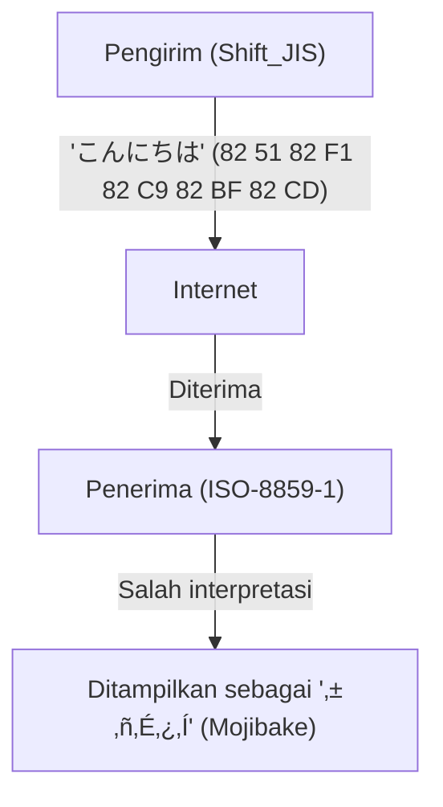
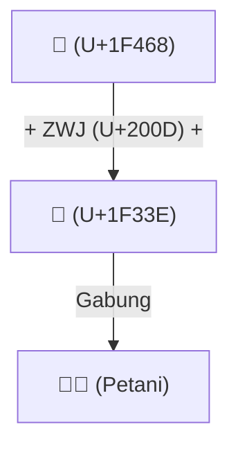

# Sejarah Unicode: Bagaimana Perjuangan Melawan Mojibake Menyatukan Karakter di Seluruh Dunia

Ketika dunia digital masih berada pada awal masa informasi teks, karakter yang dapat diproses oleh komputer sangatlah terbatas. Alasan mengapa saat ini kita dapat dengan mudah membaca dan menulis bahasa Jepang, Mandarin, atau Arab di ponsel pintar dan PC kita, bahkan mengirim dan menerima emoji seperti "😂" ke seluruh dunia, adalah karena para pendahulu kita berjuang bertahun-tahun melawan musuh tangguh yang disebut "teks berantakan (Mojibake)", dan berhasil mencapai prestasi luar biasa dalam menyatukan kode karakter.

Dalam artikel ini, kita akan menggali lebih dalam kisah epik "penyatuan karakter" dalam sejarah komputer, mulai dari kelahiran ASCII, kekacauan besar yang disebabkan oleh penyandian lokal di berbagai negara, kelahiran ambisius Unicode, desain jenius UTF-8 oleh Ken Thompson dan Rob Pike, masalah surrogate pair, hingga standardisasi Emoji.

## 1. ASCII sebagai Titik Awal (Batasan 7-bit)

Agar komputer dapat memproses karakter, diperlukan "kode karakter" yang memetakan karakter ke nilai numerik. **ASCII (American Standard Code for Information Interchange)**, yang ditetapkan di Amerika Serikat pada tahun 1960-an, merupakan standar paling dasar untuk hal ini.

ASCII menggunakan 7 bit (0 hingga 127) untuk mendefinisikan huruf besar dan kecil dalam alfabet, angka, simbol dasar, dan karakter kontrol. Ini cukup untuk digunakan di negara-negara berbahasa Inggris, tetapi sama sekali tidak berdaya menghadapi fakta bahwa "ada banyak bahasa selain bahasa Inggris di dunia". Dengan hanya 128 slot, ASCII bahkan tidak dapat mewakili karakter dengan tanda aksen (seperti é atau ñ) dalam bahasa-bahasa Eropa.

## 2. Menara Babel: Era Penyandian Lokal dan "Mojibake"

Seiring dengan menyebarnya komputer ke seluruh dunia, berbagai negara mulai mengembangkan metode penyandian (encoding) mereka sendiri menggunakan "setengah ruang yang tersisa" dari ASCII (bit ke-8, yaitu 128 hingga 255) atau dengan menggabungkan beberapa byte.

- **Keluarga ISO-8859**: Kelompok penyandian 8-bit yang dirancang untuk bahasa-bahasa Eropa (seperti ISO-8859-1 dan Latin-1).
- **Shift_JIS (SJIS)**: Metode yang mencampur karakter 1-byte (seperti katakana half-width) dan karakter 2-byte (kanji, hiragana) yang menyebar luas di PC Jepang (terutama MS-DOS dan Windows).
- **EUC-JP**: Penyandian bahasa Jepang yang sering digunakan pada sistem berbasis UNIX.
- **GB2312 / Big5**: Penyandian untuk wilayah berbahasa Mandarin.

Hal ini memang memungkinkan setiap negara untuk merepresentasikan bahasanya sendiri di komputer, namun menimbulkan masalah besar yang baru. Yaitu fenomena di mana **"saat bertukar data antar kode karakter yang berbeda, data tersebut akan diinterpretasikan sebagai karakter yang sama sekali berbeda"**. Inilah yang dikenal sebagai **teks berantakan (Mojibake)** yang terkenal keburukannya.

Sebagai contoh, jika sebuah email yang dikirim dari Jepang dalam format Shift_JIS dibuka di PC Eropa (dengan pengaturan Latin-1), urutan byte-nya akan dipetakan ke karakter yang sama sekali berbeda, sehingga ditampilkan sebagai deretan simbol yang tidak bermakna. Mojibake di situs web dan email adalah kejadian sehari-hari, dan membuat perangkat lunak yang mendukung berbagai bahasa (dukungan multibahasa: i18n) merupakan pekerjaan yang terasa seperti mimpi buruk bagi para pengembang.

## 3. Kelahiran Unicode: Semua Karakter dalam Satu Kode

Untuk mengatasi situasi yang kacau ini, para insinyur dari perusahaan seperti Apple dan Xerox (termasuk Joe Becker, Lee Collins, dan Mark Davis) berkumpul pada akhir 1980-an dan meluncurkan proyek yang ambisius. Itulah **Unicode**.

Visi mereka sederhana namun ambisius: "Memasukkan semua karakter, simbol di seluruh dunia, bahkan hingga karakter historis dari masa lalu ke dalam satu Set Karakter (Character Set) yang terpadu."

Pada awalnya, Unicode dimulai dengan asumsi optimis (UCS-2) bahwa "semua karakter di dunia akan muat dalam 16 bit (65.536 slot)". Namun, ketika mulai menyertakan kanji (karakter Tiongkok) dari Tiongkok, Jepang, dan Korea (Han CJK), segera disadari bahwa 16 bit tidaklah cukup. Unicode pada akhirnya diperluas menjadi ruang 21-bit (sekitar 1,11 juta karakter), dan karakter-karakter baru terus ditambahkan hingga saat ini.

## 4. Desain Jenius UTF-8: Ken Thompson dan Rob Pike

Meskipun "kamus karakter" raksasa bernama Unicode telah dibuat, masih ada masalah tentang bagaimana menyimpannya dan mengomunikasikannya sebagai urutan byte di komputer (metode penyandian).

UCS-2 dan UTF-16 yang dirancang pada awalnya mencoba merepresentasikan semua karakter dengan 2 byte (atau 4 byte). Namun, ada kelemahan fatal dalam hal ini. Jika data ini dimasukkan ke dalam sistem yang sudah ada yang hanya berbasis ASCII (seperti UNIX atau program bahasa C), sistem sering menjumpai "0x00 (NULL byte)" di tengah data, dan salah mengiranya sebagai akhir string, sehingga menyebabkan sistem menjadi macet (crash).

Masalah ini diselesaikan secara elegan oleh Bapak UNIX, **Ken Thompson** dan **Rob Pike**. Pada saat makan malam di tahun 1992, mereka membuat sketsa metode penyandian revolusioner di balik alas piring (placemat) mereka. Inilah **UTF-8**.

Desain UTF-8 disebut-sebut sebagai salah satu peretasan (hack) terindah dalam sejarah ilmu komputer.
- **Kompatibilitas mundur sepenuhnya dengan ASCII**: Karakter ASCII (0-127) tetap direpresentasikan dalam 1 byte, sehingga sistem Barat yang sudah ada maupun fungsi-fungsi dalam bahasa C dapat berjalan tanpa modifikasi.
- **Penyandian dengan panjang variabel**: Panjangnya bervariasi dari 1 hingga 4 byte tergantung pada karakternya (sebagai contoh, bahasa Jepang sebagian besar menggunakan 3 byte).
- **Sinkronisasi mandiri**: Hanya dengan melihat pola bit awal dari suatu byte (seperti `0xxxxxxx`, `110xxxxx`, `10xxxxxx`), kita bisa segera mengetahui apakah itu byte pertama dari suatu karakter atau byte berikutnya. Hal ini mencegah terjadinya mojibake bahkan jika kita mulai membaca dari tengah string.

Berkat desain jenius ini, UTF-8 dengan cepat menjadi standar de facto dunia, dan saat ini lebih dari 98% halaman di web menggunakan penyandian UTF-8.

## 5. Masalah Surrogate Pair dan Fajar Emoji

Ketika Unicode diperluas melampaui batas 16 bit (sekitar 60.000 karakter), metode penyandian UTF-16 harus memperkenalkan mekanisme rumit yang disebut "surrogate pair (pasangan pengganti)". Untuk merepresentasikan karakter di area yang diperluas, mekanisme ini menggabungkan dua nilai 16-bit menjadi satu karakter. Bahkan hingga saat ini, mekanisme ini menjadi sumber masalah (bug) seperti "jumlah karakter yang tidak tepat" pada beberapa bahasa pemrograman, misalnya JavaScript.

Kemudian, pada tahun 2010-an, sebuah revolusi baru terjadi di Unicode. **Emoji**, yang sebelumnya diimplementasikan secara independen oleh operator seluler Jepang (Docomo, au, SoftBank), secara resmi diadopsi sebagai standar Unicode (Unicode 6.0).

Dengan hadirnya Emoji, Unicode berevolusi melampaui kerangka "karakter" menjadi bahasa visual universal untuk menyampaikan emosi dan konsep. Selain itu, spesifikasi yang kompleks juga terus ditambahkan untuk merepresentasikan keragaman (diversitas) modern, seperti pengubah warna kulit (Skin Tone Modifier) dan mekanisme untuk menggabungkan beberapa emoji menjadi satu emoji (ZWJ: Zero Width Joiner).

## Penutup: Fondasi untuk Menghubungkan Pengetahuan Umat Manusia ke Masa Depan

Saat ini, Konsorsium Unicode mencakup semuanya mulai dari hieroglif Mesir kuno, huruf paku (cuneiform), bahasa minoritas, hingga emoji-emoji terbaru.

Sejarah kode karakter yang dimulai hanya dengan 128 karakter ASCII, melalui banyak kebingungan dan frustrasi yang disebabkan oleh "teks berantakan" yang tak terhitung jumlahnya, dan berkat semangat serta kolaborasi dari banyak insinyur yang tak terhitung jumlahnya, pada akhirnya telah berhasil menyatukan semua karakter umat manusia ke dalam satu sistem raksasa.

Di balik emoji "😂" yang kita kirimkan dengan santai, tersembunyi drama "perjuangan melawan teks berantakan (mojibake)" oleh para teknisi selama beberapa dekade.
