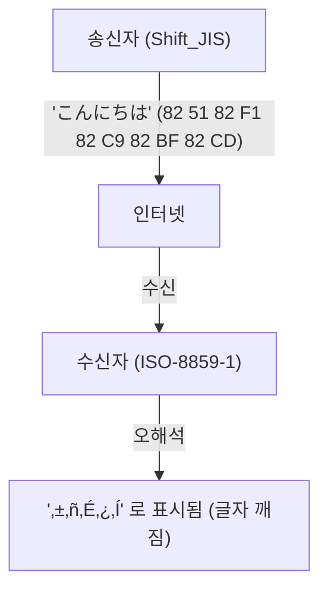
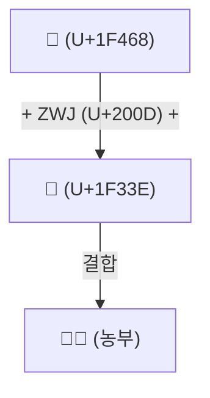

# 유니코드의 역사: 글자 깨짐과의 전쟁은 어떻게 세계의 문자를 통일했는가

디지털 세계가 텍스트 정보의 여명기에 있었을 무렵, 컴퓨터가 다룰 수 있는 문자는 매우 제한적이었습니다. 우리가 오늘날 스마트폰이나 PC에서 당연하다는 듯이 한국어, 일본어, 중국어, 아랍어를 읽고 쓰며, 나아가 '😂'와 같은 이모지를 전 세계로 주고받을 수 있는 것은, 선인들이 '글자 깨짐(Mojibake)'이라는 강적과 오랜 세월 싸워오며 문자 코드를 통일한다는 엄청난 위업을 달성했기 때문입니다.

본 기사에서는 ASCII의 탄생부터 시작하여 각국의 로컬 인코딩이 야기한 대혼란, 유니코드의 야심 찬 탄생, 켄 톰슨과 롭 파이크에 의한 UTF-8의 천재적인 설계, 서로게이트 페어 문제, 그리고 이모지(Emoji)의 표준화에 이르기까지, 컴퓨터 역사상 장대한 '문자의 통일' 이야기를 깊이 파헤쳐 봅니다.

## 1. 원점으로서의 ASCII (7비트의 제약)

컴퓨터가 문자를 다루기 위해서는 문자를 수치에 대응시키는 '문자 코드'가 필요합니다. 1960년대 미국에서 제정된 **ASCII (American Standard Code for Information Interchange)**는 그 가장 기초가 되는 규격이었습니다.

ASCII는 7비트(0~127)를 사용하여 알파벳 대소문자, 숫자, 기본적인 기호, 그리고 제어 문자를 정의했습니다. 이는 영어권에서 사용하기에는 충분했지만, '세계에는 영어 이외의 언어가 무수히 많다'는 사실에 대해서는 완전히 무력했습니다. 단 128개의 빈칸만 가진 ASCII로는 유럽 언어의 악센트 기호가 붙은 문자(é나 ñ 등)조차 표현할 수 없었던 것입니다.

## 2. 바벨탑: 로컬 인코딩과 '글자 깨짐'의 시대

컴퓨터가 전 세계에 보급됨에 따라, 각국은 ASCII의 '나머지 절반 영역'(8비트째인 128~255)이나 여러 바이트를 조합한 독자적인 인코딩 방식을 차례차례 개발했습니다.

- **ISO-8859 계열**: 유럽 언어를 위해 설계된 8비트 인코딩군 (ISO-8859-1이나 Latin-1 등).
- **Shift_JIS (SJIS)**: 일본의 PC(특히 MS-DOS나 Windows)에서 널리 보급된, 1바이트 문자(반각 가타카나 등)와 2바이트 문자(한자, 히라가나)를 혼재시키는 방식.
- **EUC-JP**: UNIX 계열 시스템에서 자주 사용된 일본어 인코딩.
- **GB2312 / Big5**: 중화권의 인코딩.

이로 인해 자국의 언어를 컴퓨터로 표현할 수는 있게 되었지만, 새로운 큰 문제가 발생했습니다. **"다른 문자 코드 간에 데이터를 주고받으면 전혀 다른 문자로 해석되어 버린다"**는 현상입니다. 이것이 바로 악명 높은 **글자 깨짐 (Mojibake)**입니다.

예를 들어, 일본에서 Shift_JIS로 보낸 이메일을 유럽의 PC(Latin-1 설정)에서 열면 바이트 열이 전혀 다른 문자에 매핑되어 의미 불명의 기호 나열로 표시되었습니다. 웹사이트나 이메일에서의 글자 깨짐은 다반사였고, 개발자에게도 여러 언어를 지원하는 소프트웨어(다국어 지원: i18n)를 만드는 것은 악몽 같은 작업이었습니다.

## 3. 유니코드의 탄생: 모든 문자를 하나의 코드로

이 혼돈스러운 상황을 타개하기 위해 1980년대 후반 Apple이나 Xerox 등의 엔지니어(조 베커, 리 콜린스, 마크 데이비스 등)가 집결하여 장대한 프로젝트를 출범시켰습니다. 그것이 바로 **유니코드(Unicode)**입니다.

그들의 비전은 단순하고도 야심 찼습니다. '전 세계의 모든 문자, 기호, 그리고 과거의 역사적 문자까지 단 하나의 통일된 문자 집합(Character Set)에 담는다'는 것이었습니다.

초기의 유니코드는 '전 세계의 문자는 16비트(65,536개)면 모두 들어갈 것이다'라는 낙관적인 전제(UCS-2)로 출발했습니다. 그러나 중국·일본·한국의 한자(CJK 통합 한자)를 수록해 나가는 과정에서 곧바로 16비트로는 자리가 부족하다는 것이 판명됩니다. 유니코드는 최종적으로 21비트 공간(약 111만 문자)으로 확장되었으며, 현재도 새로운 문자가 계속해서 추가되고 있습니다.

## 4. UTF-8의 천재적 설계: 켄 톰슨과 롭 파이크

유니코드라는 거대한 '문자 사전'이 생겼어도, 그것을 컴퓨터상에서 어떻게 바이트 열로 저장하고 통신할 것인가(인코딩 방식) 하는 문제가 남아 있었습니다.

초기에 고안된 UCS-2나 UTF-16은 모든 문자를 2바이트(또는 4바이트)로 표현하려고 했습니다. 그러나 여기에는 중대한 결함이 있었습니다. ASCII로만 구성된 기존 시스템(UNIX나 C 언어 프로그램)에 이 데이터를 흘려보내면 중간에 '0x00(NULL 바이트)'이 빈번하게 등장하기 때문에, 문자열의 끝으로 오인하여 시스템이 크래시되어 버리는 것이었습니다.

이 문제를 우아하게 해결한 것이 UNIX의 아버지인 **켄 톰슨(Ken Thompson)**과 **롭 파이크(Rob Pike)**입니다. 1992년 저녁 식사 때, 그들은 플레이스매트(런천 매트) 뒷면에 어떤 획기적인 인코딩 방식의 스케치를 그렸습니다. 이것이 바로 **UTF-8**입니다.

UTF-8의 설계는 컴퓨터 과학 역사상 가장 아름다운 해킹 중 하나로 불립니다.
- **ASCII와의 완전한 하위 호환성**: ASCII 문자(0-127)는 그대로 1바이트로 표현되기 때문에 기존의 구미권 대상 시스템이나 C 언어의 함수가 그대로 동작합니다.
- **가변 길이 인코딩**: 문자에 따라 1바이트에서 4바이트까지 길이를 변경합니다(한국어나 일본어 등은 주로 3바이트).
- **자기 동기화(Self-synchronization)**: 바이트의 첫 비트 패턴(`0xxxxxxx`, `110xxxxx`, `10xxxxxx` 등)을 보는 것만으로 그것이 문자의 첫 바이트인지, 후속 바이트인지 즉시 판별할 수 있습니다. 이로 인해 문자열의 중간부터 읽기 시작해도 글자가 깨지지 않습니다.

이 천재적인 설계 덕분에 UTF-8은 순식간에 세계의 사실상 표준(De facto standard)이 되었고, 현재 웹상의 페이지 중 98% 이상이 UTF-8로 인코딩되어 있습니다.

## 5. 서로게이트 페어 문제와 이모지(Emoji)의 새벽

유니코드가 16비트(약 6만 문자)의 벽을 넘어 확장되었을 때, UTF-16이라는 인코딩 방식에서는 '서로게이트 페어(대용쌍)'라는 복잡한 구조를 도입할 수밖에 없었습니다. 이는 확장 영역의 문자를 표현하기 위해 두 개의 16비트 값을 조합하여 하나의 문자를 나타내는 것입니다. 이 구조는 현재도 JavaScript 등 일부 프로그래밍 언어에서 '문자 수 카운트가 어긋나는' 등의 버그를 일으키는 온상이 되고 있습니다.

그리고 2010년대, 유니코드에 새로운 혁명이 일어납니다. 일본의 휴대전화 통신사(도코모, au, 소프트뱅크)가 독자적으로 구현하고 있던 **이모지(Emoji)**가 유니코드 표준으로 정식 채택된 것입니다 (Unicode 6.0).

이모지의 도입으로 유니코드는 단순한 '문자'의 틀을 넘어, 감정과 개념을 전달하는 세계 공통의 시각 언어로 진화했습니다. 나아가 피부색 변경(Skin Tone Modifier)이나 여러 이모지를 결합하여 하나의 이모지를 만드는 구조(ZWJ: Zero Width Joiner) 등, 현대의 다양성(Diversity)을 반영하기 위한 복잡한 사양도 차례차례 추가되고 있습니다.

## 맺음말: 인류의 지식을 미래로 잇는 기반

현재 유니코드 컨소시엄에는 고대 이집트의 상형문자부터 쐐기문자, 소수 민족의 언어, 그리고 최신 이모지까지 수록되어 있습니다.

ASCII의 단 128문자에서 시작된 문자 코드의 역사는 무수한 '글자 깨짐'으로 인한 혼란과 좌절을 거쳐, 셀 수 없이 많은 엔지니어들의 열정과 협력 덕분에 인류의 모든 문자를 하나의 거대한 체계로 통합하기에 이르렀습니다.

우리가 무심코 전송하는 '😂'의 이면에는 이러한 수십 년에 걸친 기술자들의 '글자 깨짐과의 전쟁' 드라마가 숨겨져 있는 것입니다.
