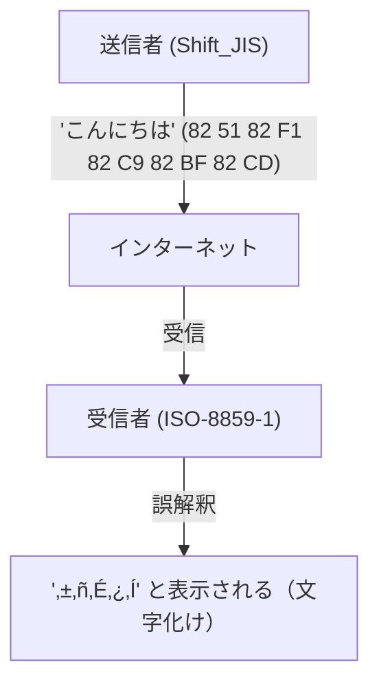
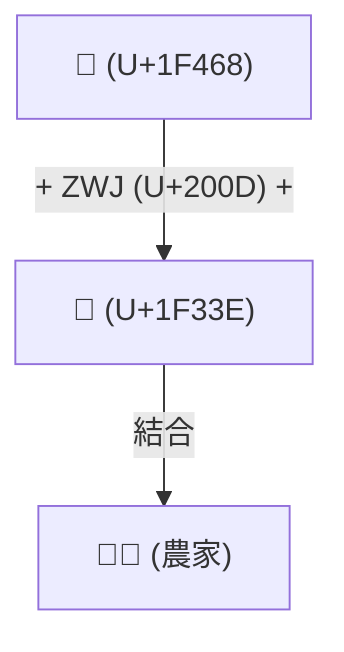

# Unicodeの歴史：文字化けとの戦いはいかに世界の文字を統一したか

デジタル世界がまだテキスト情報の黎明期にあった頃、コンピュータが扱える文字は非常に限定的でした。私たちが今日、スマートフォンやPCで当たり前のように日本語や中国語、アラビア語を読み書きし、さらには「😂」のような絵文字を世界中で送受信できるのは、先人たちが「文字化け（Mojibake）」という強敵と長年戦い続け、文字コードを統一するという途方もない偉業を成し遂げたからです。

本記事では、ASCIIの誕生から始まり、各国のローカルエンコーディングが引き起こした大混乱、Unicodeの野心的な誕生、ケン・トンプソンとロブ・パイクによるUTF-8の天才的設計、サロゲートペア問題、そして絵文字（Emoji）の標準化に至るまで、コンピュータ史における壮大な「文字の統一」の物語を深く掘り下げます。

## 1. 原点としてのASCII（7ビットの制約）

コンピュータが文字を扱うためには、文字を数値に対応付ける「文字コード」が必要です。1960年代にアメリカで制定された **ASCII (American Standard Code for Information Interchange)** は、その最も基礎となる規格でした。

ASCIIは7ビット（0〜127）を用いて、アルファベットの大文字・小文字、数字、基本的な記号、そして制御文字を定義しました。これは英語圏での使用には十分でしたが、「世界には英語以外の言語が無数にある」という事実に対しては完全に無力でした。わずか128個の枠しか持たないASCIIでは、ヨーロッパ言語のアクセント記号付き文字（éやñなど）すら表現できなかったのです。

## 2. バベルの塔：ローカルエンコーディングと「文字化け」の時代

コンピュータが世界中に普及するにつれ、各国はASCIIの「残り半分の領域」（8ビット目の128〜255）や、複数のバイトを組み合わせた独自のエンコーディング方式を次々と開発しました。

- **ISO-8859系**: ヨーロッパ言語向けに設計された8ビットエンコーディング群（ISO-8859-1やLatin-1など）。
- **Shift_JIS (SJIS)**: 日本のパソコン（特にMS-DOSやWindows）で広く普及した、1バイト文字（半角カタカナなど）と2バイト文字（漢字・ひらがな）を混在させる方式。
- **EUC-JP**: UNIX系システムでよく使われた日本語エンコーディング。
- **GB2312 / Big5**: 中国語圏のエンコーディング。

これにより、自国の言語をコンピュータで表現できるようにはなりましたが、新たな大問題が発生しました。**「異なる文字コード間でデータをやり取りすると、全く別の文字として解釈されてしまう」** という現象です。これが悪名高き **文字化け (Mojibake)** です。

例えば、日本からShift_JISで送られたメールを、ヨーロッパのPC（Latin-1設定）で開くと、バイト列が全く異なる文字にマッピングされ、意味不明な記号の羅列として表示されました。ウェブサイトやメールでの文字化けは日常茶飯事であり、開発者にとっても複数言語をサポートするソフトウェア（多言語対応：i18n）を作ることは悪夢のような作業でした。

## 3. Unicodeの誕生：すべての文字をひとつのコードで

この混沌とした状況を打開するため、1980年代後半にAppleやXeroxなどのエンジニア（ジョー・ベッカー、リー・コリンズ、マーク・デイヴィスら）が集結し、壮大なプロジェクトを立ち上げました。それが **Unicode** です。

彼らのビジョンはシンプルかつ野心的でした。「世界中のすべての文字、記号、そして過去の歴史的文字までを、たった一つの統一された文字集合（Character Set）に収める」というものです。

初期のUnicodeは、「世界中の文字は16ビット（65,536個）あればすべて収まるだろう」という楽観的な前提（UCS-2）でスタートしました。しかし、中国・日本・韓国の漢字（CJK統合漢字）を収録していく中で、すぐに16ビットでは枠が足りないことが判明します。Unicodeは最終的に21ビット空間（約111万文字）へと拡張され、現在も新しい文字が追加され続けています。

## 4. UTF-8の天才的設計：ケン・トンプソンとロブ・パイク

Unicodeという巨大な「文字の辞書」ができても、それをコンピュータ上でどうバイト列として保存・通信するか（エンコーディング方式）という問題が残っていました。

初期に考案されたUCS-2やUTF-16は、すべての文字を2バイト（または4バイト）で表現しようとしました。しかし、これには重大な欠点がありました。ASCIIだけで構成された既存のシステム（UNIXやC言語のプログラム）にこれらのデータを流し込むと、途中に「0x00（NULLバイト）」が頻繁に登場するため、文字列の終端と誤認してシステムがクラッシュしてしまうのです。

この問題をエレガントに解決したのが、UNIXの父である **ケン・トンプソン (Ken Thompson)** と **ロブ・パイク (Rob Pike)** です。1992年の夕食時、彼らはプレースマット（ランチョンマット）の裏に、ある画期的なエンコーディング方式のスケッチを描きました。これが **UTF-8** です。

UTF-8の設計は、コンピュータサイエンス史上最も美しいハックの一つと言われています。
- **ASCIIとの完全な後方互換性**: ASCII文字（0-127）はそのまま1バイトで表現されるため、既存の欧米向けシステムやC言語の関数がそのまま動きます。
- **可変長エンコーディング**: 文字によって1バイトから4バイトまで長さを変えます（日本語などは主に3バイト）。
- **自己同期性**: バイトの先頭のビットパターン（`0xxxxxxx`, `110xxxxx`, `10xxxxxx`など）を見るだけで、それが文字の先頭バイトなのか、後続バイトなのかが即座に判別できます。これにより、文字列の途中から読み始めても文字化けしません。

この天才的な設計により、UTF-8はまたたく間に世界のデファクトスタンダードとなり、現在ではウェブ上のページの98%以上がUTF-8でエンコードされています。

## 5. サロゲートペア問題と絵文字（Emoji）の夜明け

Unicodeが16ビット（約6万文字）の壁を超えて拡張された際、UTF-16というエンコーディング方式では「サロゲートペア（代用対）」という複雑な仕組みを導入せざるを得ませんでした。これは、拡張領域の文字を表現するために、2つの16ビットの値を組み合わせて1つの文字を表すというものです。この仕組みは、現在でもJavaScriptなどの一部のプログラミング言語で「文字数のカウントがずれる」といったバグの温床となっています。

そして2010年代、Unicodeに新たな革命が起こります。日本の携帯電話キャリア（ドコモ、au、ソフトバンク）が独自に実装していた **絵文字（Emoji）** が、Unicode標準として正式に採用されたのです（Unicode 6.0）。

絵文字の導入により、Unicodeは単なる「文字」の枠を超え、感情や概念を伝える世界共通の視覚言語へと進化しました。さらに、肌の色の変更（Skin Tone Modifier）や、複数の絵文字を結合して一つの絵文字を作る仕組み（ZWJ: Zero Width Joiner）など、現代の多様性（ダイバーシティ）を反映するための複雑な仕様も次々と追加されています。

## 結び：人類の知識を未来へつなぐ基盤

現在、Unicodeコンソーシアムには古代エジプトのヒエログリフから、楔形文字、少数民族の言語、そして最新の絵文字までが収録されています。

ASCIIのわずか128文字から始まった文字コードの歴史は、無数の「文字化け」による混乱とフラストレーションを経て、数え切れないほどのエンジニアたちの情熱と協力により、人類のすべての文字を一つの巨大な体系に統合するまでに至りました。

私たちが何気なく送信している「😂」の裏には、こうした数十年にわたる技術者たちの「文字化けとの戦い」のドラマが隠されているのです。
