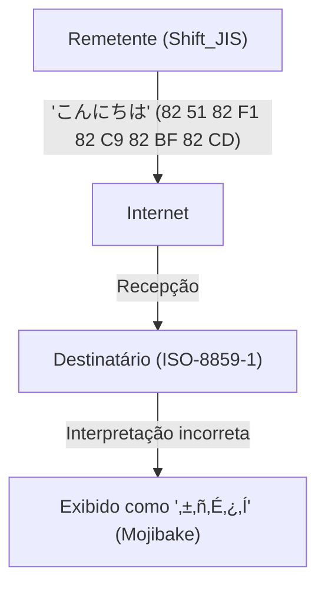
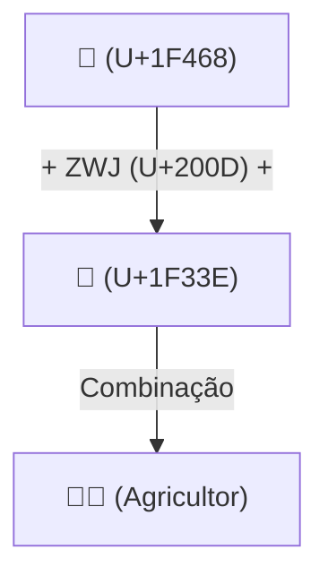

# A História do Unicode: Como a Batalha Contra o Mojibake Unificou os Caracteres do Mundo

Quando o mundo digital ainda estava nos primórdios da informação em texto, os caracteres que os computadores podiam manipular eram extremamente limitados. O fato de que hoje podemos ler e escrever naturalmente em japonês, chinês e árabe em nossos smartphones e PCs, e até mesmo enviar e receber emojis como "😂" em todo o mundo, deve-se aos nossos predecessores que lutaram durante anos contra o formidável inimigo chamado "Mojibake" (caracteres corrompidos), alcançando a tremenda proeza de unificar as codificações de caracteres.

Neste artigo, vamos explorar profundamente a épica história da "unificação de caracteres" na história da computação, começando com o nascimento do ASCII, a grande confusão causada pelas codificações locais em cada país, o ambicioso nascimento do Unicode, o genial design do UTF-8 por Ken Thompson e Rob Pike, o problema dos pares substitutos (surrogate pairs) e a padronização dos emojis.

## 1. A Origem: ASCII (A Restrição de 7 bits)

Para que um computador lide com caracteres, é necessário um "código de caracteres" (character code) que associe caracteres a valores numéricos. O **ASCII (American Standard Code for Information Interchange)**, criado nos Estados Unidos na década de 1960, foi o padrão mais fundamental para isso.

O ASCII usava 7 bits (0 a 127) para definir letras maiúsculas e minúsculas do alfabeto, números, símbolos básicos e caracteres de controle. Isso era suficiente para o uso em países de língua inglesa, mas era completamente inútil diante do fato de que "existem inúmeras línguas além do inglês no mundo". Com apenas 128 espaços disponíveis, o ASCII não conseguia nem mesmo representar caracteres acentuados de línguas europeias (como é ou ñ).

## 2. A Torre de Babel: Codificações Locais e a Era do "Mojibake"

À medida que os computadores se espalhavam pelo mundo, os países começaram a desenvolver seus próprios esquemas de codificação, utilizando a "metade restante" do ASCII (o oitavo bit, de 128 a 255) ou combinando múltiplos bytes.

- **Série ISO-8859**: Um grupo de codificações de 8 bits projetado para línguas europeias (como ISO-8859-1 e Latin-1).
- **Shift_JIS (SJIS)**: Um esquema amplamente difundido em PCs japoneses (especialmente MS-DOS e Windows) que misturava caracteres de 1 byte (como katakana de meia largura) e caracteres de 2 bytes (kanji e hiragana).
- **EUC-JP**: Uma codificação japonesa frequentemente usada em sistemas UNIX.
- **GB2312 / Big5**: Codificações da esfera de língua chinesa.

Embora isso permitisse que cada país representasse sua própria língua no computador, gerou um novo e grande problema. O fenômeno em que **"a troca de dados entre diferentes códigos de caracteres faz com que sejam interpretados como caracteres completamente diferentes"**. Este é o infame **Mojibake** (caracteres corrompidos).

Por exemplo, se um e-mail enviado do Japão em Shift_JIS fosse aberto em um PC na Europa (configurado para Latin-1), a sequência de bytes seria mapeada para caracteres completamente diferentes, exibindo uma sequência de símbolos sem sentido. O Mojibake em sites e e-mails era uma ocorrência diária, e para os desenvolvedores, criar software que suportasse múltiplos idiomas (internacionalização: i18n) era um trabalho de pesadelo.

## 3. O Nascimento do Unicode: Todos os Caracteres em um Único Código

Para romper com essa situação caótica, engenheiros de empresas como Apple e Xerox (Joe Becker, Lee Collins, Mark Davis, entre outros) se reuniram no final da década de 1980 e lançaram um projeto ambicioso. Esse projeto era o **Unicode**.

A visão deles era simples e ambiciosa: "Reunir todos os caracteres, símbolos e até mesmo caracteres históricos do passado de todo o mundo em um único conjunto de caracteres (Character Set) unificado".

O Unicode inicial começou com a premissa otimista (UCS-2) de que "16 bits (65.536 caracteres) seriam suficientes para acomodar todos os caracteres do mundo". No entanto, ao incluir os kanjis da China, Japão e Coreia (Kanjis Unificados CJK), logo ficou claro que 16 bits não seriam suficientes. O Unicode acabou sendo expandido para um espaço de 21 bits (cerca de 1,11 milhões de caracteres), e novos caracteres continuam a ser adicionados até hoje.

## 4. O Design Genial do UTF-8: Ken Thompson e Rob Pike

Mesmo com a criação do enorme "dicionário de caracteres" que é o Unicode, restava o problema de como salvar e comunicar isso como sequências de bytes nos computadores (esquema de codificação).

Os esquemas iniciais, UCS-2 e UTF-16, tentavam representar todos os caracteres usando 2 bytes (ou 4 bytes). No entanto, isso tinha uma falha grave. Se você inserisse esses dados em sistemas existentes baseados puramente em ASCII (programas em UNIX ou C), o "0x00 (byte NULL)" apareceria com frequência no meio dos dados, fazendo com que o sistema o confundisse com o fim da string (terminador) e travasse.

Quem resolveu elegantemente esse problema foram o pai do UNIX, **Ken Thompson**, e **Rob Pike**. Durante o jantar, em 1992, eles desenharam no verso de um jogo americano o rascunho de um esquema de codificação revolucionário. Isso se tornou o **UTF-8**.

O design do UTF-8 é considerado um dos "hacks" mais belos da história da ciência da computação.
- **Total compatibilidade retroativa com ASCII**: Os caracteres ASCII (0-127) são representados por 1 byte exatamente como antes, então os sistemas ocidentais existentes e as funções da linguagem C funcionam sem modificações.
- **Codificação de comprimento variável**: O comprimento varia de 1 a 4 bytes, dependendo do caractere (o japonês, por exemplo, usa principalmente 3 bytes).
- **Autossincronização**: Apenas observando o padrão de bits no início de um byte (como `0xxxxxxx`, `110xxxxx`, `10xxxxxx`), é possível determinar instantaneamente se ele é o byte inicial de um caractere ou um byte subsequente. Assim, mesmo que você comece a ler do meio de uma string, os caracteres não serão corrompidos.

Graças a esse design genial, o UTF-8 rapidamente se tornou o padrão de fato global, e hoje mais de 98% das páginas na web são codificadas em UTF-8.

## 5. O Problema dos Pares Substitutos e o Amanhecer dos Emojis

Quando o Unicode foi expandido além da barreira dos 16 bits (cerca de 60.000 caracteres), o esquema de codificação UTF-16 teve que introduzir um mecanismo complexo chamado "pares substitutos" (surrogate pairs). Para representar caracteres na área expandida, dois valores de 16 bits são combinados para representar um único caractere. Esse mecanismo ainda é fonte de bugs em algumas linguagens de programação, como o JavaScript, onde "a contagem do número de caracteres fica incorreta".

E, na década de 2010, ocorreu uma nova revolução no Unicode. Os **Emojis**, implementados originalmente de forma proprietária pelas operadoras de telefonia móvel japonesas (Docomo, au, SoftBank), foram adotados oficialmente como padrão Unicode (Unicode 6.0).

Com a introdução dos emojis, o Unicode foi além dos meros "caracteres", evoluindo para uma linguagem visual universal que transmite emoções e conceitos. Além disso, especificações complexas para refletir a diversidade moderna continuam a ser adicionadas, como modificadores de tom de pele (Skin Tone Modifier) e o mecanismo de combinar múltiplos emojis para criar um único emoji (ZWJ: Zero Width Joiner).

## Conclusão: A Fundação para Conectar o Conhecimento Humano ao Futuro

Atualmente, o Consórcio Unicode abrange desde hieróglifos do Egito Antigo até caracteres cuneiformes, idiomas de minorias e os emojis mais recentes.

A história das codificações de caracteres, que começou com apenas 128 caracteres do ASCII, passou por confusões e frustrações causadas por inúmeros casos de "Mojibake", e através da paixão e colaboração de incontáveis engenheiros, finalmente conseguiu unificar todos os caracteres da humanidade em um único sistema gigante.

Por trás do "😂" que enviamos casualmente, esconde-se o drama dessas décadas de "batalha contra o Mojibake" travada pelos engenheiros.
