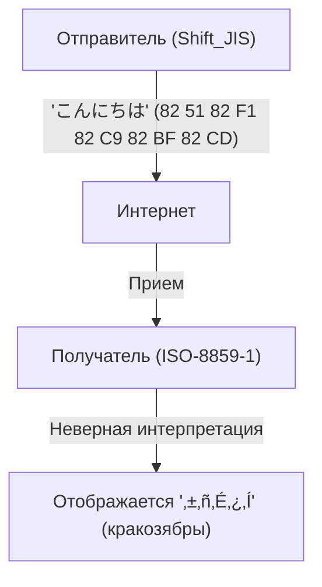
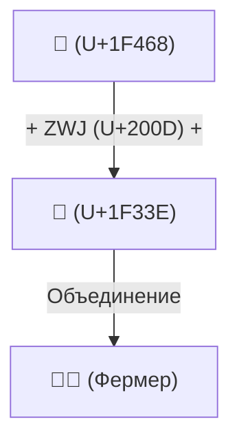

# История Unicode: Как борьба с кракозябрами объединила символы всего мира

В эпоху зарождения цифрового мира возможности компьютеров по обработке текста были крайне ограничены. Тот факт, что сегодня мы легко читаем и пишем на японском, китайском или арабском языках на наших смартфонах и ПК, а также отправляем по всему миру эмодзи вроде «😂», стал возможным благодаря тому, что наши предшественники вели долгую борьбу с грозным врагом — «кракозябрами» (Mojibake), совершив невероятный подвиг по унификации кодировок символов.

В этой статье мы подробно рассмотрим грандиозную историю «объединения символов» в компьютерной истории: начиная с появления ASCII, через хаос, вызванный локальными кодировками разных стран, к амбициозному созданию Unicode, гениальному проектированию UTF-8 Кеном Томпсоном и Робом Пайком, проблеме суррогатных пар и вплоть до стандартизации эмодзи (Emoji).

## 1. ASCII как отправная точка (Ограничение в 7 бит)

Чтобы компьютеры могли работать с текстом, им нужна «кодировка», связывающая символы с числами. Самым базовым стандартом стал **ASCII (American Standard Code for Information Interchange)**, созданный в США в 1960-х годах.

ASCII использовал 7 бит (от 0 до 127) для определения заглавных и строчных букв латинского алфавита, цифр, основных знаков препинания и управляющих символов. Этого было достаточно для англоязычного мира, но абсолютно бесполезно перед лицом того факта, что в мире существует бесчисленное множество языков помимо английского. Имея всего 128 позиций, ASCII не мог отобразить даже буквы европейских языков с диакритическими знаками (например, é или ñ).

## 2. Вавилонская башня: Эпоха локальных кодировок и «кракозябр»

По мере распространения компьютеров по всему миру, разные страны начали разрабатывать собственные методы кодирования, используя «оставшуюся половину» пространства ASCII (8-й бит, от 128 до 255) или комбинируя несколько байтов.

- **Семейство ISO-8859**: Группа 8-битных кодировок, разработанных для европейских языков (например, ISO-8859-1 или Latin-1).
- **Shift_JIS (SJIS)**: Широко распространенная на японских ПК (особенно в MS-DOS и Windows) система, смешивающая 1-байтовые (полуширинная катакана) и 2-байтовые символы (кандзи, хирагана).
- **EUC-JP**: Кодировка японского языка, часто используемая в UNIX-системах.
- **GB2312 / Big5**: Кодировки для китайского языка.

Благодаря этому стало возможным отображать родные языки на компьютерах, но возникла новая огромная проблема. Это явление, когда **«при обмене данными между разными кодировками они интерпретируются как совершенно другие символы»**. Это и есть пресловутые **кракозябры (Mojibake)**.

Например, если письмо, отправленное из Японии в Shift_JIS, открыть на европейском ПК (с настройкой Latin-1), последовательность байтов отобразится на совершенно другие символы, превратившись в бессмысленный набор знаков. Искажение текста на веб-сайтах и в электронных письмах было повседневным явлением, а для разработчиков создание программного обеспечения с поддержкой нескольких языков (i18n) превращалось в сущий кошмар.

## 3. Рождение Unicode: Все символы в одном коде

Чтобы выйти из этого хаоса, в конце 1980-х годов инженеры из Apple, Xerox и других компаний (такие как Джо Беккер, Ли Коллинз, Марк Дэвис) объединились и запустили грандиозный проект. Так появился **Unicode**.

Их видение было простым, но амбициозным: «Собрать все буквы, символы со всего мира, а также исторические письменности прошлого в единый универсальный набор символов (Character Set)».

Ранний Unicode стартовал с оптимистичного предположения (UCS-2), что «всех символов в мире хватит на 16 бит (65 536 позиций)». Однако при добавлении китайских, японских и корейских иероглифов (унифицированные иероглифы CJK) быстро выяснилось, что 16 бит недостаточно. В итоге пространство Unicode было расширено до 21 бита (около 1,11 миллиона символов), и новые символы продолжают добавляться по сей день.

## 4. Гениальный дизайн UTF-8: Кен Томпсон и Роб Пайк

Даже после создания огромного «словаря символов» Unicode, оставалась проблема того, как сохранять и передавать их в виде последовательности байтов на компьютерах (метод кодирования).

Ранние системы, такие как UCS-2 и UTF-16, пытались представлять все символы двумя (или четырьмя) байтами. Однако у этого был серьезный недостаток. При передаче таких данных в существующие системы, работающие только с ASCII (программы на C или UNIX), часто встречался «нулевой байт» (0x00). Система ошибочно принимала его за конец строки и давала сбой.

Эту проблему элегантно решили отцы UNIX **Кен Томпсон (Ken Thompson)** и **Роб Пайк (Rob Pike)**. Во время ужина в 1992 году они набросали на обратной стороне салфетки (ланчмата) схему революционного метода кодирования. Так появился **UTF-8**.

Дизайн UTF-8 считается одним из самых красивых хаков в истории информатики:
- **Полная обратная совместимость с ASCII**: Символы ASCII (0-127) кодируются одним байтом, как и раньше, поэтому существующие западные системы и функции на C работают без изменений.
- **Кодирование переменной длины**: В зависимости от символа длина может составлять от 1 до 4 байт (японские символы в основном занимают 3 байта).
- **Самосинхронизация**: Просто посмотрев на битовый шаблон начала байта (например, `0xxxxxxx`, `110xxxxx`, `10xxxxxx`), можно сразу определить, является ли он начальным байтом символа или последующим. Благодаря этому, даже если начать чтение с середины строки, текст не исказится.

Благодаря этому гениальному дизайну UTF-8 в мгновение ока стал мировым стандартом де-факто, и сегодня более 98% страниц в Интернете закодированы в UTF-8.

## 5. Проблема суррогатных пар и рассвет эмодзи (Emoji)

Когда Unicode преодолел барьер в 16 бит (около 60 000 символов), в кодировке UTF-16 пришлось ввести сложный механизм «суррогатных пар» (Surrogate Pairs). Это означает объединение двух 16-битных значений для представления одного символа в расширенной области. Этот механизм до сих пор является источником багов в некоторых языках программирования, таких как JavaScript, где «подсчет количества символов сбивается».

А в 2010-х годах в Unicode произошла новая революция. **Эмодзи (Emoji)**, изначально разработанные японскими операторами мобильной связи (Docomo, au, SoftBank), были официально приняты как стандарт Unicode (Unicode 6.0).

С внедрением эмодзи Unicode вышел за рамки просто «букв» и превратился во всемирный визуальный язык для передачи эмоций и концепций. Кроме того, для отражения современного разнообразия (diversity) постоянно добавляются сложные спецификации, такие как изменение цвета кожи (Skin Tone Modifier) или механизм объединения нескольких эмодзи в один (ZWJ: Zero Width Joiner).

## Заключение: Фундамент, передающий знания человечества в будущее

В настоящее время консорциум Unicode включает в себя всё: от древнеегипетских иероглифов и клинописи до языков меньшинств и новейших эмодзи.

История кодировки, начавшаяся всего со 128 символов ASCII, прошла через хаос и разочарования бесчисленных «кракозябр», и, благодаря страсти и сотрудничеству бесчисленного множества инженеров, привела к объединению всех символов человечества в одну гигантскую систему.

За безобидным «😂», которое мы отправляем, скрывается драма этой многолетней «битвы с кракозябрами» инженеров.
