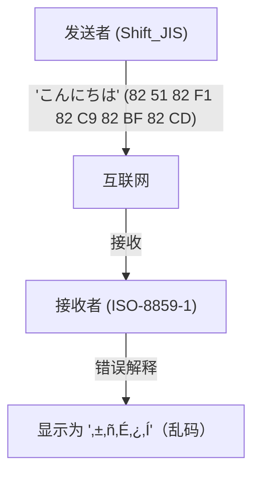
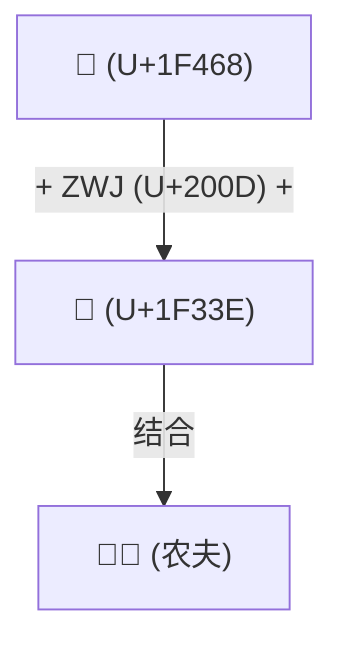

# Unicode的历史：与乱码的战争是如何统一世界文字的

在数字世界还处于文本信息黎明期的时代，计算机能处理的字符非常有限。我们今天之所以能在智能手机和PC上理所当然地读写日语、中文、阿拉伯语，甚至在全世界发送和接收像“😂”这样的Emoji表情，是因为先驱者们与名为“乱码（Mojibake）”的强敌进行了长期的斗争，完成了统一字符编码这一了不起的壮举。

本文将深入探讨计算机史上宏大的“文字统一”故事：从ASCII的诞生开始，讲述各国本地编码引发的大混乱、Unicode雄心勃勃的诞生、Ken Thompson和Rob Pike对UTF-8的天才设计、代理对（Surrogate Pair）问题，直到Emoji（表情符号）的标准化。

## 1. 作为原点的ASCII（7位的限制）

为了让计算机处理文字，必须有将文字映射到数值的“字符编码”。20世纪60年代在美国制定的 **ASCII (American Standard Code for Information Interchange)** 就是其中最基础的标准。

ASCII使用7位（0到127）定义了英文字母的大小写、数字、基本符号以及控制字符。这在英语国家使用是足够的，但面对“世界上有无数非英语语言”这一事实却完全无能为力。仅有128个位置的ASCII，甚至无法表示欧洲语言中带有重音符号的字母（如é或ñ）。

## 2. 巴别塔：本地编码与“乱码”时代

随着计算机在全球的普及，各国开始利用ASCII的“剩下的一半空间”（第8位的128到255）或组合多个字节，陆续开发出各自独立的编码方式。

- **ISO-8859系列**: 为欧洲语言设计的8位编码群（如ISO-8859-1或Latin-1）。
- **Shift_JIS (SJIS)**: 在日本个人电脑（尤其是MS-DOS和Windows）上广泛普及的混合单字节字符（如半角片假名）和双字节字符（汉字、平假名）的编码方式。
- **EUC-JP**: UNIX类系统中常用的日语编码。
- **GB2312 / Big5**: 中文圈的编码。

虽然这让各国能够用计算机表示自己的语言，却引发了一个新的大问题：**“在不同字符编码之间传输数据时，会被解释成完全不同的字符”**。这就是臭名昭著的 **乱码 (Mojibake)**。

例如，将从日本用Shift_JIS发送的邮件在欧洲的PC（设置为Latin-1）上打开时，字节序列会被映射到完全不同的字符，显示为一堆意义不明的符号。网站和电子邮件中的乱码成了家常便饭，对于开发者来说，编写支持多语言（国际化，即i18n）的软件也是一场噩梦。

## 3. Unicode的诞生：用一个编码涵盖所有文字

为了打破这种混乱的局面，20世纪80年代后期，来自Apple、Xerox等公司的工程师们（如Joe Becker、Lee Collins、Mark Davis等）聚集在一起，启动了一个宏大的项目。这就是 **Unicode**。

他们的愿景简单而野心勃勃：“将世界上所有的文字、符号，甚至过去的古代历史文字，全部收录到一个统一的字符集（Character Set）中”。

早期的Unicode基于一个乐观的前提（UCS-2），即“世界上的文字用16位（65,536个）就足够容纳了”。然而，在收录中、日、韩的汉字（CJK统一表意文字）的过程中，很快就发现16位的空间是不够的。Unicode最终扩展到了21位空间（约111万个字符），并且至今仍在不断添加新字符。

## 4. UTF-8的天才设计：Ken Thompson与Rob Pike

即使有了Unicode这本巨大的“字符词典”，仍然存在一个问题：在计算机上如何将其作为字节序列进行保存和通信（编码方式）。

早期构想的UCS-2和UTF-16试图用2个字节（或4个字节）来表示所有字符。但这有一个致命的缺陷：如果将这些数据输入到仅由ASCII构成的现有系统（如UNIX或C语言程序）中，因为数据中会频繁出现“0x00（NULL字节）”，系统会误将其认作字符串的结尾而导致崩溃。

优雅地解决这个问题的是UNIX之父 **Ken Thompson** 和 **Rob Pike**。1992年的一次晚餐时，他们在餐垫的背面画下了某种革命性编码方式的草图。这就是 **UTF-8**。

UTF-8的设计被誉为计算机科学史上最优美的Hack之一。
- **与ASCII完全向后兼容**: ASCII字符（0-127）直接原样用1个字节表示，因此现有的针对欧美的系统和C语言函数可以原封不动地运行。
- **可变长度编码**: 根据字符的不同，长度在1到4个字节之间变化（中文和日文等主要使用3个字节）。
- **自同步特性**: 只需查看字节开头的位模式（如`0xxxxxxx`、`110xxxxx`、`10xxxxxx`等），就能立刻判断它是字符的起始字节还是后续字节。这样一来，即使从字符串中间开始读取也不会产生乱码。

凭借这一天才般的设计，UTF-8迅速成为世界的公认标准（De facto standard），如今网络上超过98%的页面都在使用UTF-8编码。

## 5. 代理对问题与Emoji的黎明

当Unicode突破16位（约6万个字符）的壁垒进行扩展时，名为UTF-16的编码方式不得不引入一种被称为“代理对（Surrogate Pair）”的复杂机制。为了表示扩展区域的字符，它将两个16位的值组合起来表示一个字符。这个机制至今仍是一些编程语言（如JavaScript）中产生“字符数计算不准”等Bug的温床。

随后到了2010年代，Unicode迎来了新的革命。日本手机运营商（Docomo、au、SoftBank）独自实现的 **Emoji（表情符号）** 被正式采纳为Unicode标准（Unicode 6.0）。

Emoji的引入，让Unicode超越了单纯“文字”的范畴，进化为传达情感和概念的世界通用视觉语言。此外，为了反映现代的多样性，它还陆续添加了复杂的规范，如改变肤色（Skin Tone Modifier），以及将多个Emoji结合成一个Emoji的机制（ZWJ: Zero Width Joiner）等。

## 结语：将人类知识传承到未来的基石

如今，Unicode联盟已经收录了从古埃及圣书体到楔形文字、少数民族语言，以及最新的Emoji等众多字符。

从仅有128个字符的ASCII开始，字符编码的历史经历了无数次“乱码”带来的混乱与挫折。经过无数工程师的辛勤努力和合作，终于将人类所有的文字统一到了一个庞大的体系之中。

我们不经意间发送的一个“😂”，其背后隐藏的正是几十年来技术人员们“与乱码战斗”的戏剧性历程。
