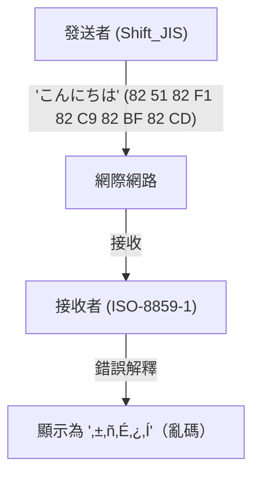
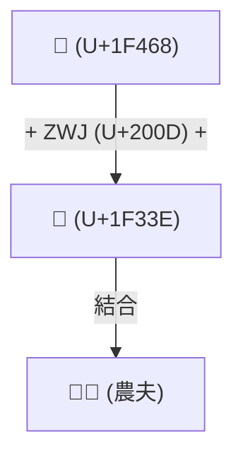

# Unicode的歷史：與亂碼的戰鬥如何統一了世界的文字

當數位世界還處於文字資訊的黎明期時，電腦能處理的文字非常有限。我們今天能理所當然地在智慧型手機和電腦上讀寫日文、中文、阿拉伯文，甚至在世界各地發送和接收像「😂」這樣的表情符號，都是因為前人們與「亂碼（Mojibake）」這個強敵進行了長年的戰鬥，並完成了統一字元編碼這項艱鉅的偉業。

本文將從ASCII的誕生開始，深入探討各國在地化編碼所引起的大混亂、Unicode雄心勃勃的誕生、Ken Thompson與Rob Pike對UTF-8的天才設計、代理對（Surrogate Pair）問題，直到表情符號（Emoji）的標準化，為您揭開電腦史上宏大的「文字統一」故事。

## 1. 原點：ASCII（7位元的限制）

為了讓電腦處理文字，需要有將文字對應到數值的「字元編碼」。1960年代在美國制定的 **ASCII (American Standard Code for Information Interchange)**，是其中最基礎的標準。

ASCII使用7位元（0〜127）來定義英文字母的大寫與小寫、數字、基本符號以及控制字元。這對於英語圈的使用已經足夠，但面對「世界上有著無數非英語語言」的事實卻完全無能為力。僅有128個空間的ASCII，甚至無法表示歐洲語言中帶有重音符號的文字（如é或ñ）。

## 2. 巴別塔：在地化編碼與「亂碼」的時代

隨著電腦普及到世界各地，各國開始利用ASCII「剩下的另一半空間」（第8位元的128〜255），或組合多個位元組，陸續開發出各自獨特的編碼方式。

- **ISO-8859系列**: 專為歐洲語言設計的8位元編碼群（如ISO-8859-1和Latin-1等）。
- **Shift_JIS (SJIS)**: 在日本的個人電腦（尤其是MS-DOS和Windows）上廣泛普及，混合了單字節字元（如半形片假名）和雙字節字元（漢字、平假名）的方式。
- **EUC-JP**: UNIX系列系統中常用的日文編碼。
- **GB2312 / Big5**: 中文圈的編碼。

雖然這使得各國語言能夠在電腦上顯示，但也引發了新的大問題。那就是 **「在不同的字元編碼間交換資料時，會被解釋成完全不同的文字」** 的現象。這就是惡名昭彰的 **亂碼 (Mojibake)**。

例如，將日本用Shift_JIS發送的電子郵件在歐洲的電腦（設定為Latin-1）上打開時，位元組序列會被對應到完全不同的文字，顯示為意義不明的符號組合。網站或電子郵件中的亂碼是家常便飯，對於開發者來說，開發支援多語言的軟體（多語言支援：i18n）簡直是一場噩夢。

## 3. Unicode的誕生：用單一編碼涵蓋所有文字

為了解決這個混亂的局面，1980年代後期，來自Apple和Xerox等公司的工程師（Joe Becker、Lee Collins、Mark Davis等人）集結起來，發起了一個宏大的專案。那就是 **Unicode**。

他們的願景既簡單又充滿野心：「將世界上所有的文字、符號，甚至是過去的歷史文字，全部收錄在一個統一的字元集（Character Set）中。」

早期的Unicode是以「只要有16位元（65,536個）就能容納世界上所有文字」這樣樂觀的前提（UCS-2）開始的。然而，在收錄中、日、韓的漢字（CJK統一漢字）的過程中，很快就發現16位元的空間根本不夠。Unicode最終被擴充到21位元的空間（約111萬個文字），並且直到現在仍不斷有新文字被加入。

## 4. UTF-8的天才設計：Ken Thompson與Rob Pike

即使有了Unicode這本巨大的「文字辭典」，仍留下了一個問題：在電腦上該如何將其作為位元組序列來儲存和通訊（編碼方式）。

早期設計的UCS-2和UTF-16試圖用2個位元組（或4個位元組）來表示所有的文字。然而，這有一個嚴重的缺點。如果將這些資料輸入到完全由ASCII組成的現有系統（UNIX或C語言程式）中，會因為中途頻繁出現「0x00（NULL位元組）」，而被系統誤認為是字串的結尾，進而導致系統崩潰。

優雅地解決這個問題的，是UNIX之父 **Ken Thompson** 和 **Rob Pike**。在1992年的一場晚餐上，他們在餐墊（placemat）的背面畫下了一種革命性編碼方式的草圖。這就是 **UTF-8**。

UTF-8的設計被認為是電腦科學史上最美麗的駭客技巧（hack）之一。
- **與ASCII完全向後相容**: ASCII字元（0-127）直接以1個位元組表示，因此現有的歐美系統和C語言函式可以原封不動地運作。
- **可變長度編碼**: 根據文字的不同，長度從1個位元組到4個位元組不等（日文等主要為3個位元組）。
- **自我同步性**: 只要看位元組開頭的位元模式（如`0xxxxxxx`, `110xxxxx`, `10xxxxxx`等），就能立刻判斷它是文字的第一個位元組，還是後續的位元組。這樣一來，即使從字串中間開始讀取，也不會產生亂碼。

憑藉這項天才的設計，UTF-8瞬間成為了世界上的事實標準（de facto standard）。現在網路上98%以上的網頁都是使用UTF-8編碼的。

## 5. 代理對問題與表情符號（Emoji）的黎明

當Unicode突破16位元（約6萬字）的限制進行擴充時，UTF-16這種編碼方式不得不引入稱為「代理對（Surrogate Pair）」的複雜機制。這是為了表示擴充區域的文字，將兩個16位元的值組合起來表示一個文字。這個機制直到現在仍然是JavaScript等部分程式語言中「字元計數出現偏差」等錯誤的溫床。

然後在2010年代，Unicode發生了一場新的革命。由日本手機營運商（Docomo、au、SoftBank）各自開發的 **表情符號（Emoji）**，被正式採納為Unicode標準（Unicode 6.0）。

隨著表情符號的引入，Unicode超越了單純「文字」的範疇，進化為能夠傳達情感與概念的世界共通視覺語言。此外，為了反映現代的多樣性（Diversity），也陸續加入了更改膚色（Skin Tone Modifier）、以及結合多個表情符號來組成一個新表情符號的機制（ZWJ: Zero Width Joiner）等複雜的規格。

## 結語：將人類知識連結至未來的基礎

現在，Unicode聯盟（Unicode Consortium）的收錄範圍從古埃及的聖書體、楔形文字、少數民族的語言，一直到最新的表情符號。

從ASCII僅有的128個字元開始的字元編碼歷史，經歷了無數次「亂碼」帶來的混亂與挫折，憑藉著無數工程師的熱情與合作，最終將人類所有的文字整合到了一個巨大的體系中。

在我們漫不經心地發送著「😂」的背後，其實隱藏著這些技術人員數十年來與「亂碼戰鬥」的戲劇性故事。
