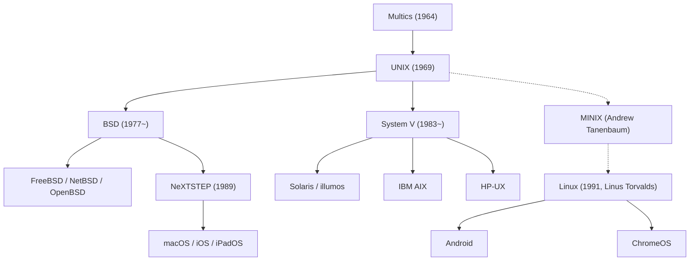

## المقدمة: المارد الخفي الذي يحرك العالم الرقمي

كل هاتف ذكي في جيوبنا، وكل خادم سحابي يدير حركة بيانات الإنترنت، ومحطات عمل macOS المفضلة لدى مهندسي البرمجيات حول العالم، تعود أصولها المعمارية إلى نظام تشغيل واحد وُلد عام 1969 في مختبرات بل (Bell Labs) التابعة لشركة AT&T: إنه نظام **UNIX**.

بعد مرور أكثر من نصف قرن على ابتكاره، لا تزال فلسفة تصميم وهندسة UNIX تتربع على عرش البنية التحتية لتكنولوجيا المعلومات. كيف استطاع نظام بسيط، طوره عدد قليل من الباحثين فقط لرغبتهم في بيئة مريحة لكتابة البرامج، أن يتجاوز كل التحولات التكنولوجية الكبرى ويسيطر على عالم الحوسبة؟

يقدم هذا المقال مراجعة تاريخية وتقنية شاملة لنظام UNIX: من دروس مشروع Multics وولادته على حاسوب PDP-7 المتواضع، مروراً بابتكار لغة C ومفهوم قابلية النقل، وفلسفة UNIX الخالدة، وحروب UNIX الشرسة، وصولاً إلى ثورة المصادر المفتوحة مع Linux وامتداده الأصيل في macOS و iOS.

## 1. ما قبل UNIX: طموحات مشروع Multics ودروس الإخفاق

تبدأ القصة في منتصف ستينيات القرن الماضي مع مشروع نظام المشاركة الزمنية (Time-Sharing) الطموح **Multics (خدمة المعلومات والحوسبة المتعددة)**. في ذلك الوقت، كانت الحواسيب تعمل بنظام المعالجة بالدفعات (Batch Processing)، حيث كان المبرمجون يقدمون البطاقات المثقوبة وينتظرون لساعات أو أيام للحصول على النتائج المطبوعة.

اتحدت ثلاث جهات عملاقة لبناء نظام المستقبل: معهد ماساتشوستس للتكنولوجيا (MIT)، وجنرال إلكتريك (GE)، ومختبرات بل التابعة لـ AT&T. سعى مشروع Multics إلى جعل الحوسبة خدمة عامة مثل الماء والكهرباء، تتيح لمئات المستخدمين مشاركة موارد النظام بأمان عبر أطراف توصيل تفاعلية، مقدماً مفاهيم مبتكرة مثل نظام الملفات الهرمي والربط الديناميكي وحلقات الأمان متعددة المستويات.

غير أن Multics غرق تحت وطأة طموحاته المفرطة. أدى السعي لدمج كل الميزات المعقدة دفعة واحدة إلى تضخم هائل في البرمجيات وتأخر مزمن في التطوير مع أداء شديد الضعف. وبعد استثمار ملايين الدولارات دون جدوى، قررت إدارة مختبرات بل الانسحاب نهائياً من المشروع في أوائل عام 1969.

## 2. عام 1969: Space Travel وحاسوب PDP-7 وولادة UNICS

شكل الانسحاب من Multics خيبة أمل مريرة لاثنين من عباقرة مختبرات بل: **كين طومسون (Ken Thompson)** و**دينيس ريتشي (Dennis Ritchie)**. فبعد أن اختبرا حرية العمل التفاعلي، رفضا العودة إلى عصر البطاقات المثقوبة البدائي.

في ذلك الوقت، كان كين طومسون قد كتب لعبة محاكاة لحركة الكواكب والمركبات الفضائية باسم *"Space Travel"*. وبعد فقدان الوصول إلى حواسيب Multics الضخمة، عثر في زاوية مهملة من مختبر موراي هيل على حاسوب صغير قديم من طراز **PDP-7** أنتجته شركة DEC. كان الحاسوب متواضعاً للغاية: ذاكرته 8,192 كلمة بطول 18 بت (نحو 18 كيلوبايت فقط) ولا يمتلك نظام تشغيل ملائماً.

لتشغيل لعبته بسلاسة، قرر طومسون وريتشي بناء نظام تشغيل خاص بهما من الصفر، مستفيدين من دروس إخفاق Multics: أن يكون النظام **بسيطاً للغاية وصغيراً ونقياً**. وخلال أسابيع قليلة من البرمجة المكثفة بلغة التجميع (Assembly)، قاما ببناء إدارة العمليات ونظام الملفات الهرمي ومفسر الأوامر.

وحين رأى زميلهما برايان كيرنيغان هذا النظام الرشيق، أطلق عليه مازحاً اسم **UNICS (نظام المعلومات والحوسبة أحادي المسار)** في مقارنة ساخرة مع Multics المعقد ("Uni" مقابل "Multi"). وتحول الاسم لاحقاً إلى **UNIX**. وفي عام 1969، انطلقت رسمياً أعظم ملحمة في تاريخ أنظمة التشغيل.

## 3. ابتكار لغة C ومعجزة قابلية النقل (Portability)

كُتبت الإصدارات الأولى من UNIX بلغة التجميع الخاصة بحواسيب PDP، مما جعل النظام مقيداً تماماً بتلك المعمارية؛ وأي انتقال لحاسوب جديد كان يتطلب إعادة كتابة الكود بالكامل.

ولكسر هذا القيد، ابتكر دينيس ريتشي بين عامي 1971 و 1973 لغة برمجة عالية المستوى جديدة كلياً: **لغة C**. جمعت لغة C بين وضوح وهيكلية اللغات عالية المستوى والقدرة الفائقة للغات منخفضة المستوى على التحكم المباشر في الذاكرة والمؤشرات.

وفي عام 1973، حقق طومسون وريتشي إنجازاً تاريخياً حطم المسلمات السائدة آنذاك: **أعادا كتابة نواة UNIX بالكامل بلغة C**.

حتى تلك اللحظة، كان يُعتقد أن أنظمة التشغيل يجب أن تُكتب بلغة التجميع حصراً لضمان السرعة. لكن UNIX أثبت أن الفقدان الضئيل في الأداء لا يُذكر مقارنة بالميزة الهائلة: **قابلية النقل (Portability)**. فما دام الحاسوب يمتلك مصرفاً للغة C، يمكن نقل UNIX إليه في غضون بضعة أشهر. لقد حرر UNIX البرمجيات من قيود العتاد، ليصبح أول نظام تشغيل قياسي عالمي مفتوح. ونال طومسون وريتشي جائزة تورينغ المرموقة عام 1983 تقديراً لهذا الإنجاز العظيم.

## 4. فلسفة UNIX الخالدة

يرجع بقاء UNIX وازدهاره إلى مجموعة من المبادئ الهندسية الرفيعة المعروفة باسم **فلسفة UNIX**:

### 1. "كل شيء عبارة عن ملف" (Everything is a file)
يجرد نظام UNIX كافة موارد النظام (الملفات النصية، المجلدات، الأقراص الصلبة، لوحة المفاتيح، الشاشة، ومقابس الشبكة) في واجهة موحدة كتدفق من البايتات. ويمكن للمبرمج التعامل مع أي جهاز طرفي بنفس استدعاءات النظام القياسية (`open`, `read`, `write`, `close`) دون الحاجة لتعلم واجهات برمجية خاصة بكل عتاد.

### 2. "افعل شيئاً واحداً وأتقنه تماماً" (Do one thing and do it well)
بدلاً من بناء برمجيات ضخمة ومترابطة تحاول القيام بكل شيء، تشجع فلسفة UNIX على بناء أدوات برمجية صغيرة ومحددة الهدف. أوامر مثل `cat`, `grep`, `sort`, `uniq`, `awk`, و `sed` تؤدي وظيفة واحدة بدقة وكفاءة واستقرار لا مثيل له.

### 3. "الأنابيب والمصفيات" (Pipes)
تعد ميزة **الأنبوب (`|`)** التي اقترحها دوغلاس ماكلروي عام 1973 جوهرة فلسفة UNIX. فهي تتيح توجيه المخرجات القياسية (`stdout`) لبرنامج ما لتكون مباشرة مدخلات قياسية (`stdin`) لبرنامج آخر في تدفق مستمر:

```bash
cat access.log | awk '{print $1}' | sort | uniq -c | sort -nr
```

ومن خلال ربط الأدوات الصغيرة مثل قطع الليغو، يستطيع المطور معالجة وتصفية البيانات المعقدة فورياً عبر سطر الأوامر. وهذه الفكرة هي الأساس الذي قامت عليه بنية الخدمات المصغرة (Microservices) الحديثة.

## 5. الانقسام و"حروب UNIX" (UNIX Wars)

في أواخر السبعينيات، وبسبب قيود مكافحة الاحتكار، حُظرت AT&T من بيع برمجيات الحواسيب تجارياً. لذلك وزعت الشركة شفرة المصدر لنظام UNIX على الجامعات ومراكز الأبحاث مجاناً تقريباً.

وفي جامعة كاليفورنيا في بيركلي، قاد طالب الدراسات العليا **بيل جوي** (أحد مؤسسي Sun Microsystems لاحقاً) وفريق CSRG تطويرات ثورية، حيث أضافوا الذاكرة الافتراضية، ونظام الملفات السريع FFS، وحزمة بروتوكولات TCP/IP المدمجة مع واجهة مآخذ التوصيل (Sockets API)، مطلقين نظام **BSD (Berkeley Software Distribution)**.



وفي الثمانينيات، رُفعت القيود القانونية عن AT&T، فأدركت القيمة المالية الضخمة لنظام UNIX، وأغلقت شفرة المصدر وأطلقت الإصدار التجاري **System V** بتراخيص باهظة وشروط قاسية.

أشعل هذا ما عُرف بـ **"حروب UNIX" (UNIX Wars)** بين معسكر System V ومعسكر BSD، وتسببت الخلافات القضائية وعدم التوافق في إرباك السوق وإعطاء فرصة لنظام Windows NT من مايكروسوفت للتغلغل في قطاع الأعمال. وفي النهاية، اتجهت الصناعة لتبني معايير قياسية مثل **POSIX** و **Single UNIX Specification (SUS)** لتوحيد واجهات النظام البرمجية.

## 6. ثورة المصادر المفتوحة والهيمنة الشاملة لنظام Linux

بحلول مطلع التسعينيات، كانت أنظمة UNIX التجارية مقتصرة على محطات عمل باهظة الثمن، بعيدة عن متناول الطلاب والمهتمين الذين يملكون حواسيب شخصية بمعالجات Intel 386.

وفي أغسطس 1991، نشر الطالب الفنلندي **لينوس تورفالدس (Linus Torvalds)** نواته المستقلة على شبكة الإنترنت: **Linux**.

صُممت نواة Linux دون استخدام أي شفرة من AT&T، ولكن وفقاً لمعايير POSIX لتكون شبيهة بنظام UNIX (UNIX-like). وعندما اتحدت مع مترجم GCC وغلاف bash والأدوات البرمجية التابعة لـ **مشروع GNU** الذي أسسه ريتشارد ستولمان، ولد نظام تشغيل متكامل وحر: **GNU/Linux**.

وبفضل نموذج التطوير المفتوح والتعاوني عبر الإنترنت، اكتسح Linux السوق التجارية. واليوم، يهيمن Linux على:
- 100% من أقوى 500 حاسوب عملاق في العالم.
- أكثر من 90% من خوادم السحابة في AWS و Google Cloud.
- محركات التداول في كبرى البورصات العالمية.
- مليارات الهواتف المحمولة عبر نظام Android.

## 7. النسب الأصيل: أنظمة macOS و iOS و UNIX المعتمد

بينما سيطر Linux على مراكز البيانات، استمر النسب المباشر لـ BSD في التألق بأبهى صوره داخل أجهزة شركة Apple.

فعندما غادر ستيف جوبز شركة Apple عام 1985، أسس شركة NeXT وطور نظام التشغيل كائني التوجه **NeXTSTEP** القائم على النواة الميكروية Mach ونظام 4.3BSD. وحين استحوذت Apple على NeXT عام 1996، أصبح NeXTSTEP الأساس المعماري لنظام **Mac OS X** (المعروف اليوم باسم **macOS**).

تعد نواة Darwin في macOS سليلة نظام BSD، وتحمل شهادة الاعتماد الرسمية **UNIX 03** من The Open Group كـ UNIX أصيل. كما تشترك أنظمة iOS و iPadOS في هذا الأساس المتين. ولهذا يفضل المهندسون حواسيب Mac؛ لأنها تجمع بين واجهة رسومية فائقة الجمال وقوة طرفية UNIX الحقيقية.

## الخاتمة: معمارية برمجية خالدة عبر الأزمان

في عام 1969، في أحد مكاتب مختبرات بل الهادئة، أراد كين طومسون ودينيس ريتشي فقط بناء بيئة يستمتعان فيها بكتابة البرمجيات.

وعلى مدى أكثر من نصف قرن، اختفت حواسيب وأنظمة تشغيل وشركات عملاقة، لكن المبادئ التي أرساها UNIX — القابلية للنقل عبر لغة C، ومبدأ تجريد كل شيء في ملف، وربط الأدوات عبر الأنابيب — أثبتت خلودها وقدرتها على تحدي الزمن.

من الحواسيب الخارقة التي تدرب نماذج الذكاء الاصطناعي إلى الهاتف الذكي في راحة يدك، ينبض عقل وروح UNIX في صميم كل إنجاز للتقنية الحديثة.
