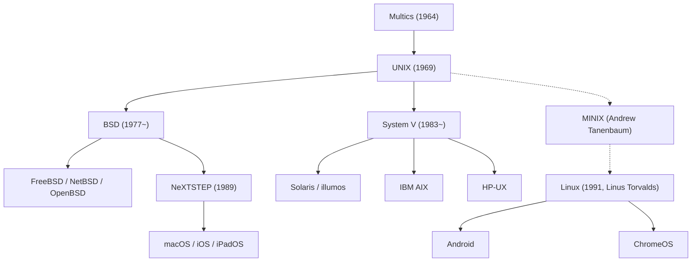

## Einleitung: Der unsichtbare Riese der digitalen Welt

Jedes moderne Smartphone in unseren Händen, jeder Cloud-Server im weltweiten Datenverkehr und die macOS-Rechner auf den Schreibtischen von Softwareentwicklern haben gemeinsame architektonische Wurzeln: Ein Betriebssystem, das 1969 in den Bell Laboratories von AT&T das Licht der Welt erblickte: **UNIX**.

Mehr als ein halbes Jahrhundert nach seiner Entstehung bilden die Konstruktionsprinzipien und die Philosophie von UNIX das unverrückbare Fundament der globalen Informationstechnologie. Wie konnte ein minimalistisches System, das von wenigen Ingenieuren lediglich aus dem Wunsch nach einer angenehmen Programmierumgebung geschaffen wurde, sämtliche Paradigmenwechsel überdauern und die digitale Welt erobern?

Dieser Artikel liefert eine detaillierte historische und technische Rekonstruktion: Von den Lehren aus dem Multics-Debakel über die Anfänge auf der PDP-7, die Erfindung der Sprache C und die Portabilitätsrevolution bis hin zur UNIX-Philosophie, den erbitterten UNIX-Kriegen, dem Siegeszug von Linux und dem Fortleben in macOS und iOS.

## 1. Vor UNIX: Der Traum und das Scheitern von Multics

Die Vorgeschichte von UNIX ist untrennbar mit dem ambitionierten Timesharing-Projekt **Multics (Multiplexed Information and Computing Service)** der 1960er Jahre verknüpft. Damals beherrschte die Stapelverarbeitung (Batch Processing) die Rechenzentren: Programmierer reichten Lochkartenstapel ein und mussten oft viele Stunden auf Ausdrucke warten.

Um dies zu ändern, schlossen sich das MIT, General Electric (GE) und die Bell Labs von AT&T zusammen. Multics sollte Rechenleistung wie Strom oder Wasser aus der Steckdose bereitstellen: Hunderte Benutzer sollten gleichzeitig über Terminals auf geteilte Ressourcen zugreifen können, geschützt durch ausgeklügelte mehrstufige Sicherheitsringe und ein hierarchisches Dateisystem.

Doch Multics erlag seiner eigenen Maßlosigkeit. Der Versuch, sämtliche erdenklichen Features und Sicherheitsarchitekturen auf einmal zu implementieren, überforderte Hard- und Software. Das Projekt versank im Chaos, verzögerte sich drastisch und lieferte eine ernüchternde Performance. Nach enormen Investitionen zog das Management der Bell Labs 1969 die Notbremse und beendete die Zusammenarbeit.

## 2. 1969: Space Travel, die PDP-7 und die Entstehung von UNICS

Der Ausstieg aus Multics traf die beiden Bell-Labs-Forscher **Ken Thompson** und **Dennis Ritchie** schwer. Einmal an interaktives Arbeiten gewöhnt, weigerten sie sich, wieder in die zeitraubende Ära der Lochkarten zurückzukehren.

Zu dieser Zeit hatte Thompson ein Simulationsspiel namens *"Space Travel"* programmiert, das Planetenbahnen und Raumschiffbewegungen berechnete. Ohne Zugang zum Multics-Großrechner stieß er in einer Ecke des Labors in Murray Hill auf eine ausgemusterte, verstaubte Minicomputer-Anlage: die **PDP-7** von DEC. Die Maschine war extrem leistungsschwach: Sie besaß lediglich 8.192 18-Bit-Wörter Arbeitsspeicher (etwa 18 Kilobyte) und verfügte über kein brauchbares Betriebssystem.

Um sein Spiel flüssig ausführen zu können, entschlossen sich Thompson und Ritchie, ein völlig eigenständiges Betriebssystem zu schreiben. Sie machten sich die Lehren aus dem Multics-Fehlschlag zunutze: Das neue System sollte **radikal einfach, schlank und modular** sein. In wenigen Wochen intensiver Assembler-Programmierung implementierten sie ein Prozessmodell, ein Verzeichnisdateisystem und eine Befehlszeilen-Shell.

Ihr Kollege Brian Kernighan nannte das neue System scherzhaft **UNICS (Uniplexed Information and Computing System)** – eine bewusste Anspielung auf die Überladung von Multics ("Uni" statt "Multi"). Später wandelte sich die Schreibweise zu **UNIX**. 1969 war die Geburtsstunde der modernen Systemarchitektur.

## 3. Die Erfindung der Sprache C und das Wunder der Portabilität

Die ersten Versionen von UNIX waren vollständig in der Assemblersprache der PDP-Rechner geschrieben. Dadurch war das Betriebssystem fest an die Hardware gebunden; ein Wechsel auf einen anderen Computertyp erforderte eine Neuentwicklung von Grund auf.

Um diesen Hardware-Käfig aufzubrechen, entwickelte Dennis Ritchie zwischen 1971 und 1973 eine neuartige Programmiersprache: **C**. C vereinte die strukturierten Konzepte und Kontrollflüsse einer höheren Sprache mit der Möglichkeit, Hardware-Register und Speicherzeiger direkt auf Maschinenebene anzusprechen.

1973 vollbrachten Thompson und Ritchie eine Pioniertat, die der damaligen Lehrmeinung der Informatik widersprach: **Sie schrieben den gesamten UNIX-Kernel in C neu**.

Bis dahin galt es als unumstößliches Gesetz, dass Betriebssysteme aus Performancegründen zwingend in Assembler verfasst werden müssten. UNIX bewies das Gegenteil: Die winzigen Einbußen bei der Laufzeit fielen angesichts schnellerer Prozessoren kaum ins Gewicht, während der Gewinn an **Portabilität** die Computerwelt revolutionierte. Sobald für eine neue Prozessorarchitektur ein C-Compiler existierte, konnte UNIX innerhalb weniger Monate portiert werden. Software war fortan unabhängig von Hardware-Herstellern. 1983 erhielten Thompson und Ritchie für diesen Durchbruch den renommierten Turing Award.

## 4. Die zeitlose UNIX-Philosophie

Die Faszination und Langlebigkeit von UNIX beruht auf einem Satz klarer Entwurfsprinzipien, die als **UNIX-Philosophie** in die Geschichte eingegangen sind:

### 1. „Alles ist eine Datei“ (Everything is a file)
UNIX abstrahiert sämtliche Systemkomponenten (Textdateien, Verzeichnisse, Festplatten, Tastaturen, Bildschirme und Netzwerkverbindungen) als einheitlichen Bytestrom. Entwickler steuern Hardwareressourcen über dieselben standardisierten Systemaufrufe (`open`, `read`, `write`, `close`), ohne herstellerspezifische Schnittstellen erlernen zu müssen.

### 2. „Mache eine Sache, und mache sie gut“ (Do one thing and do it well)
Statt aufgeblähte, unübersichtliche Programme zu schaffen, setzt UNIX auf kompakte, spezialisierte Werkzeuge. Befehle wie `cat`, `grep`, `sort`, `uniq`, `awk` und `sed` erfüllen eng umrissene Aufgaben mit kompromissloser Präzision und Stabilität.

### 3. „Pipes und Filter“ (Pipes)
Die 1973 von Douglas McIlroy vorgeschlagene **Pipe (`|`)** erlaubt es, die Standardausgabe (`stdout`) eines Programms direkt in die Standardeingabe (`stdin`) eines anderen Programms als Datenstrom umzuleiten:

```bash
cat access.log | awk '{print $1}' | sort | uniq -c | sort -nr
```

Durch das Aneinanderreihen kleiner Werkzeuge wie Bausteine lassen sich hochkomplexe Datenanalysen unmittelbar auf der Kommandozeile realisieren. Dieses Paradigma gilt als direkter Vorläufer moderner Microservice- und Streaming-Architekturen.

## 5. Die Spaltung und die „UNIX-Kriege“

Ende der 1970er Jahre war es AT&T durch ein Kartellurteil untersagt, gewinnorientiert im Computermarkt aufzutreten. Daher stellte das Unternehmen Universitäten und Forschungslaboren den UNIX-Quellcode gegen eine geringe Bereitstellungsgebühr fast kostenlos zur Verfügung.

An der University of California, Berkeley, entwickelten Forscher um den Studenten **Bill Joy** (späterer Mitgründer von Sun Microsystems) die sogenannte **BSD-Linie (Berkeley Software Distribution)**. Sie integrierten virtuellen Speicher, das Fast File System (FFS) und als Weltpremiere den TCP/IP-Netzwerkstack samt der Sockets-API.



In den 1980er Jahren wurden die Kartellbeschränkungen aufgehoben. AT&T erkannte das gewaltige Potenzial, schloss den Quellcode und vermarktete das kommerzielle **System V** unter restriktiven Lizenzmodellen.

Dies löste die berüchtigten **„UNIX-Kriege“ (UNIX Wars)** zwischen der System-V-Gruppe (IBM AIX, HP-UX, Sun Solaris) und dem BSD-Lager aus. Urheberrechtsklagen und inkompatible Varianten schadeten dem Ökosystem nachhaltig und schufen für Microsofts Windows NT den Einstieg in Unternehmen. Erst durch IEEE-Standards wie **POSIX** und die **Single UNIX Specification (SUS)** kehrte allmählich wieder Einigkeit auf Schnittstellenebene ein.

## 6. Die Open-Source-Welle und die Herrschaft von Linux

Anfang der 1990er Jahre dominierten teure UNIX-Workstations die Geschäftswelt, blieben für normale PC-Besitzer mit Intel 386-Prozessoren aber unerschwinglich.

Im August 1991 stellte der finnische Student **Linus Torvalds** ein unabhängig entwickeltes Systemprojekt ins Usenet: **Linux**.

Linux enthielt keine einzige Zeile proprietären AT&T-Codes, orientierte sich jedoch streng an den POSIX-Standards als UNIX-ähnliches System. In Kombination mit den Werkzeugen des von Richard Stallman gegründeten **GNU-Projekts** (GCC-Compiler, bash-Shell, Standard-Utilities) entstand ein vollwertiges, offenes Betriebssystem: **GNU/Linux**.

Getragen von der globalen Hacker-Gemeinschaft über das Internet verdrängte Linux die klassischen kommerziellen UNIX-Varianten. Heute beherrscht Linux:
- 100 % der schnellsten 500 Supercomputer der Welt.
- Über 90 % aller Cloud-Instanzen bei AWS, Azure und Google Cloud.
- Die Ausführungssysteme der weltweiten Börsenhandelsplätze.
- Milliarden mobiler Endgeräte über das Betriebssystem Android.

## 7. Die direkte Traditionslinie: macOS, iOS und echtes UNIX

Während Linux das Backend und Android eroberte, fand die ursprüngliche BSD-Linie bei Apple ihre Perfektion für Endanwender.

Nach seinem Abschied von Apple 1985 gründete Steve Jobs die Firma NeXT und entwickelte das objektorientierte Betriebssystem **NeXTSTEP** auf Basis des Mach-Kernels und 4.3BSD. Nach der Übernahme von NeXT durch Apple im Jahr 1996 wurde NeXTSTEP zum Fundament von **Mac OS X** (heute **macOS**).

Der Kern von macOS, Darwin, ist ein reinrassiges BSD-UNIX und trägt das offizielle **UNIX 03-Zertifikat** der Open Group. Auch iOS, iPadOS und watchOS basieren auf diesem Kern. Softwareentwickler weltweit bevorzugen den Mac, weil er eine elegante Benutzeroberfläche mit der ungezähmten Stärke eines echten nativen UNIX-Terminals verbindet.

## Fazit: Eine unvergängliche Architektur

Im Jahr 1969 wollten Ken Thompson und Dennis Ritchie in den Bell Labs lediglich eine Umgebung schaffen, in der sie produktiv und mit Freude Software schreiben konnten.

Über fünfzig Jahre später sind zahllose Großrechner, Chip-Generationen und Betriebssysteme verschwunden. Doch die Kernideen von UNIX – die Portabilität durch C, modulare Werkzeuge und das Dateiprinzip – haben sich als unsterblich erwiesen.

Von den gigantischen Supercomputern, die künstliche Intelligenz trainieren, bis hin zum Smartphone in unserer Handtasche schlägt in jedem digitalen Herzschlag der Geist von UNIX.
