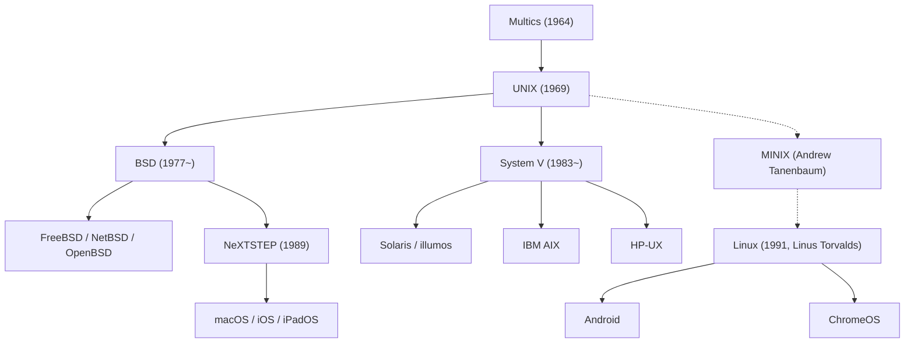

## Introduction: The Invisible Giant Powering the Modern World

Every smartphone in our pockets, every cloud server orchestrating web traffic, and the macOS workstations favored by software engineers worldwide all trace their architectural lineage to a single operating system born at AT&T Bell Laboratories in 1969: **UNIX**.

More than half a century after its inception, the architectural paradigms and design philosophy of UNIX remain the bedrock of modern computing. How did a minimalist system, created in a corporate research laboratory by a handful of engineers seeking a pleasant environment to write software, survive decades of technological disruption to conquer the digital world?

This article explores the comprehensive history of UNIX: the failure of Multics, the birth of UNIX on the PDP-7, the creation of the C programming language and OS portability, the UNIX Philosophy, the brutal Unix Wars, the open-source revolution of Linux, and the enduring lineage running inside Apple's macOS and iOS.

## 1. Before UNIX: The Ambition and Failure of Multics

The prologue to UNIX begins with **Multics (Multiplexed Information and Computing Service)**, an ambitious time-sharing system initiated in the mid-1960s. At that time, batch processing dominated computing—computers executed one punch-card job at a time, leaving developers waiting hours or days for output.

Three corporate and academic heavyweights joined forces to create the future of computing: the Massachusetts Institute of Technology (MIT), General Electric (GE), and AT&T Bell Labs. Multics aimed to deliver computing power as a utility (like electricity or water), enabling hundreds of users to share system resources simultaneously with unprecedented security, dynamic linking, and a hierarchical file system.

However, Multics became crushed under the weight of its own ambition. Striving for exhaustive features and intricate multilevel security mechanisms, the software spiraled into intractable complexity. Development dragged on for years, performance degraded severely, and budgets ballooned. In early 1969, having spent millions of dollars without producing a viable production system, Bell Labs management pulled the plug and withdrew from the project.

## 2. 1969: Space Travel, the PDP-7, and the Genesis of UNICS

The cancellation of Multics left Bell Labs researchers **Ken Thompson** and **Dennis Ritchie** deeply disoriented. They had tasted the freedom of an interactive, multi-user time-sharing environment and refused to return to the stone age of batch-processed punch cards.

Around this time, Ken Thompson had authored an interactive game called *"Space Travel"*, which simulated the orbital mechanics of planetary bodies and spaceflight. With access to GE-645 mainframes cut off, Thompson discovered a neglected Digital Equipment Corporation (DEC) PDP-7 minicomputer tucked away in a corner of the Murray Hill laboratory. The PDP-7 was an obsolete machine with only 8,192 18-bit words of memory (about 18 kilobytes) and a rudimentary vector display.

To run *Space Travel* smoothly, Thompson needed a responsive operating system. Drawing sharp lessons from the Multics catastrophe, Thompson and Ritchie set out to build an operating system that was radically small, simple, and transparent. They implemented a clean filesystem, a process management subsystem, and a command interpreter.

Observing the project, their colleague Brian Kernighan playfully coined the name **UNICS (Uniplexed Information and Computing System)**—a tongue-in-cheek play on Multics, emphasizing that this new system did one thing simply rather than many things multiplexed. UNICS soon evolved into the spelling that would dominate computing history: **UNIX**.

## 3. The Invention of C and the Miracle of Portability

The earliest versions of UNIX (the 1st through 3rd Editions) were written entirely in PDP assembly language. While fast and compact, this tied the operating system inextricably to the specific processor architecture of DEC hardware. Rewriting the entire OS from scratch for every new computer model was unsustainable.

To overcome this fundamental hardware lock-in, **Dennis Ritchie** designed a new high-level programming language between 1971 and 1973: **the C language**. C struck an unprecedented balance: it provided high-level language structures (data types, loops, structured functions) while maintaining the raw ability to manipulate memory addresses and machine pointers directly.

In 1973, Thompson and Ritchie accomplished an audacious feat that defied contemporary computer science dogma: **they rewrote the entire UNIX kernel in C**.

Until then, conventional wisdom dictated that an operating system had to be written in assembly to achieve acceptable speed. By compiling the C kernel on new architectures, UNIX achieved true **portability**. As long as a target computer had a C compiler, UNIX could be ported to it in a matter of months. UNIX decoupled software from hardware, transforming an operating system into a vendor-independent, universal software platform. In 1983, Thompson and Ritchie received the prestigious Turing Award for this monumental breakthrough.

## 4. The Timeless UNIX Philosophy

UNIX's enduring brilliance stems not merely from its technical code, but from an overarching engineering mindset known as the **UNIX Philosophy**:

### 1. "Everything is a File"
In UNIX, every system resource is abstracted through the common, universal interface of a byte stream (a file). Text files, directories, physical hard drives, keyboard inputs, terminal displays, printer ports, and network communication sockets all use the same core system calls: `open()`, `read()`, `write()`, and `close()`. Programmers interact with diverse hardware without having to master specialized, vendor-specific device APIs.

### 2. "Do One Thing and Do It Well"
Rather than engineering colossal, monolithic programs that attempt to satisfy every possible requirement, UNIX advocates writing modular, single-purpose utilities. Classic utilities like `cat`, `grep`, `sort`, `uniq`, `awk`, and `sed` have narrow, precisely defined functions, executed with impeccable performance and reliability.

### 3. "Pipes and Filters"
In 1973, Douglas McIlroy proposed the **pipe (`|`)**, a feature that allowed the standard output (`stdout`) of one program to be fed directly into the standard input (`stdin`) of another as a streaming data pipeline:

```bash
cat access.log | awk '{print $1}' | sort | uniq -c | sort -nr
```

By snapping together small, focused utilities like Lego blocks, developers could assemble sophisticated data-processing pipelines on the fly without writing custom compiled programs. This architectural paradigm anticipated modern microservices and reactive stream architectures by several decades.

## 5. The Schism and the "UNIX Wars"

In the late 1970s, under a federal consent decree settling an antitrust lawsuit, AT&T was prohibited from commercializing software outside telecommunications. As a result, AT&T licensed UNIX source code to universities and research institutions for the nominal cost of distribution media, practically giving it away.

At the University of California, Berkeley, graduate student **Bill Joy** (later co-founder of Sun Microsystems) and the Computer Systems Research Group (CSRG) introduced profound architectural enhancements. They added virtual memory management, the Fast File System (FFS), and an integrated TCP/IP networking stack with the revolutionary Sockets API, releasing their work as **BSD (Berkeley Software Distribution)**. BSD became the darling of academia and the nascent workstation industry.



In the 1980s, the breakup of the Bell System allowed AT&T to enter commercial computing. Recognizing the massive commercial value of UNIX, AT&T locked down its source code and launched commercial **System V (SysV)** under restrictive, expensive licensing.

This sparked the ferocious **"UNIX Wars"** between the BSD camp and the System V camp (Sun's SunOS/Solaris, IBM's AIX, HP's HP-UX). The resulting fragmentation, licensing lawsuits, and incompatible system libraries confused customers and opened the door for Microsoft's proprietary Windows NT to capture corporate desktops and servers. In response, the industry eventually rallied around standardized APIs like IEEE **POSIX** and the **Single UNIX Specification (SUS)**.

## 6. The Open-Source Revolution and the Rise of Linux

By 1991, commercial UNIX dominated mission-critical servers, but running it required high-end proprietary hardware and exorbitant licenses. Hobbyists and students using cheap Intel 386 PCs were locked out.

In August 1991, Finnish university student **Linus Torvalds** released a hobby kernel he had written from scratch: **Linux**.

Linus designed Linux without using any proprietary AT&T code, making it free from legal entanglements, but engineered it to be fully POSIX-compliant and UNIX-like. Paired with the compilers (GCC), shells (bash), and userland utilities developed by Richard Stallman's **GNU Project**, Linux formed a complete, free, production-ready operating system: **GNU/Linux**.

The open-source bazaar development model, enabled by the early Internet, ignited phenomenal collaborative innovation. Linux swallowed the enterprise server market, displacing commercial proprietary UNIX. Today, Linux powers:
- 100% of the world's Top 500 supercomputers.
- Over 90% of public cloud instances across AWS, Azure, and Google Cloud.
- Millions of web servers and enterprise databases.
- Billions of mobile smartphones via the Android operating system.

## 7. The Direct Bloodline: macOS, iOS, and Certified UNIX

While Linux conquered the data center and Android, the direct BSD lineage of UNIX found its most elegant consumer expression inside Apple.

When Steve Jobs was ousted from Apple in 1985, he founded NeXT and built **NeXTSTEP**, an object-oriented OS built upon the Mach microkernel and 4.3BSD Unix. When Apple acquired NeXT in 1996, NeXTSTEP became the architectural core of **Mac OS X** (now **macOS**).

The Darwin operating system underpinning macOS is certified under The Open Group's rigorous **UNIX 03** standard—making the Mac a genuine, certified UNIX workstation. Furthermore, iOS, iPadOS, watchOS, and tvOS all share this same BSD-derived Darwin core. Software engineers gravitate toward the Mac because it marries an exquisite graphical interface with the raw power of a true native UNIX terminal.

## Conclusion: An Eternal Architecture

In 1969, in a quiet office in Murray Hill, Ken Thompson and Dennis Ritchie sought only to create an environment where they could enjoy writing programs. 

Over the ensuing five decades, computing witnessed the birth and demise of countless architectures, operating systems, and commercial empires. Yet the fundamental ideas born with UNIX—portability via C, modular tools cooperating through pipes, and universal file abstractions—have proven practically timeless.

From the supercomputers calculating climate models to the smartphone in your palm, the spirit of UNIX endures. It is more than software; it is the enduring conceptual architecture of digital civilization.
