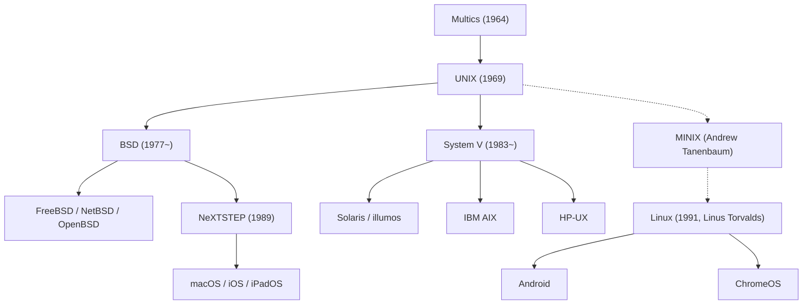

## Introducción: El Gigante Invisible que Gobierna el Mundo Digital

Cada teléfono inteligente en nuestro bolsillo, cada servidor en la nube que gestiona el tráfico web global y las estaciones de trabajo macOS utilizadas por ingenieros de software de todo el mundo tienen una raíz arquitectónica común: un sistema operativo nacido en 1969 en los Laboratorios Bell de AT&T: **UNIX**.

Más de medio siglo después de su creación, la filosofía de diseño y la arquitectura de UNIX continúan siendo el pilar indestructible de la industria tecnológica. ¿Cómo logró un sistema minimalista, desarrollado en un rincón de un laboratorio por un puñado de ingenieros que solo deseaban un entorno agradable para programar, sobrevivir a múltiples cambios de paradigma y conquistar el mundo entero?

Este artículo ofrece un análisis exhaustivo y profesional de la historia de UNIX: desde el fracaso de Multics y el nacimiento en la humilde PDP-7, pasando por la invención del lenguaje C y la portabilidad, la Filosofía UNIX, las Guerras de UNIX, la revolución de código abierto de Linux, hasta el linaje directo preservado en macOS e iOS.

## 1. Antes de UNIX: La Ambición y el Fracaso de Multics

Para comprender el origen de UNIX es imprescindible retroceder a mediados de los años 60 y analizar el proyecto **Multics (Multiplexed Information and Computing Service)**. En aquella época, la informática estaba dominada por el procesamiento por lotes (Batch Processing): los programadores entregaban tarjetas perforadas y debían esperar horas o días para ver los resultados impresos.

Tres entidades colosales unieron sus fuerzas para crear el sistema del futuro: el MIT, General Electric (GE) y los Laboratorios Bell de AT&T. Multics aspiraba a suministrar potencia de cálculo como un servicio público (igual que la electricidad o el agua), permitiendo que cientos de usuarios compartieran recursos simultáneamente a través de terminales interactivas con seguridad avanzada, enlaces dinámicos y un sistema de archivos jerárquico.

Sin embargo, Multics colapsó bajo el peso de su propia ambición. En su afán por incluir todas las funciones imaginables y capas de seguridad extremas, la complejidad del software se desbordó. El desarrollo sufrió enormes retrasos y el rendimiento real fue catastrófico. Tras gastar millones de dólares sin lograr un producto utilizable, la dirección de Bell Labs decidió cancelar su participación y abandonar el proyecto a principios de 1969.

## 2. 1969: Space Travel, la PDP-7 y el Nacimiento de UNICS

La retirada de Multics dejó a dos brillantes investigadores de Bell Labs, **Ken Thompson** y **Dennis Ritchie**, en una profunda frustración. Habiendo experimentado la libertad de programar en un entorno interactivo de tiempo compartido, no estaban dispuestos a regresar al arcaico mundo de las tarjetas perforadas.

En ese periodo, Thompson había programado un simulador del movimiento planetario y naves espaciales llamado *"Space Travel"*. Al perder el acceso al mainframe de Multics, descubrió una minicomputadora **PDP-7** de Digital Equipment Corporation (DEC) arrumbada y cubierta de polvo en un rincón del laboratorio de Murray Hill. La PDP-7 era una máquina modesta con apenas 8.192 palabras de 18 bits de memoria (aproximadamente 18 kilobytes) y carecía de un sistema operativo funcional.

Para que *Space Travel* corriera fluidamente, Thompson y Ritchie decidieron crear su propio sistema operativo desde cero, aplicando la lección fundamental del fracaso de Multics: hacerlo **radicalmente simple, pequeño y limpio**. En pocas semanas, escribieron en ensamblador un subsistema de procesos, un sistema de archivos jerárquico y un intérprete de comandos.

Al ver el resultado, su compañero Brian Kernighan bautizó humorísticamente al sistema como **UNICS (Uniplexed Information and Computing System)**, en un juego de palabras que contrastaba con la complejidad de Multics ("Uni" frente a "Multi"). Más adelante la grafía evolucionó a **UNIX**, marcando en 1969 el comienzo de la era dorada de los sistemas operativos.

## 3. La Invención del Lenguaje C y el Milagro de la Portabilidad

Las primeras tres ediciones de UNIX estaban escritas en el lenguaje ensamblador de la PDP-7 y PDP-11. Esto ataba el sistema operativo a la arquitectura del hardware; migrar a una computadora diferente requería reescribir todo el código desde cero.

Para romper esta limitación, Dennis Ritchie diseñó entre 1971 y 1973 un nuevo lenguaje de alto nivel: **el lenguaje C**. C combinaba la sintaxis estructurada y la abstracción de tipos de los lenguajes de alto nivel con la potencia de bajo nivel para manipular punteros y direcciones de memoria directamente.

En 1973, Thompson y Ritchie lograron una hazaña legendaria que desafió los dogmas informáticos de la época: **reescribieron casi todo el núcleo de UNIX en lenguaje C**.

Hasta entonces se creía que un sistema operativo debía estar escrito en ensamblador para ser rápido. UNIX demostró que la pequeña pérdida teórica de rendimiento era insignificante frente al beneficio extraordinario de la **portabilidad**. Si una computadora disponía de un compilador de C, UNIX podía adaptarse a ella en cuestión de meses. UNIX desacopló el software del hardware, convirtiéndose en el primer sistema operativo verdaderamente abierto y universal. Por este logro histórico, Thompson y Ritchie recibieron el Premio Turing en 1983.

## 4. La Filosofía UNIX: Principios de Diseño Eternos

El impacto trascendental de UNIX proviene de un conjunto armónico de directrices de ingeniería conocido como la **Filosofía UNIX**:

### 1. «Todo es un archivo» (Everything is a file)
UNIX abstrae todos los recursos del sistema (archivos de texto, carpetas, discos duros, teclado, pantalla y conexiones de red en sockets) bajo una interfaz unificada: el flujo de bytes. Los programadores pueden manipular cualquier dispositivo usando las mismas llamadas al sistema estándar (`open`, `read`, `write`, `close`), eliminando la necesidad de aprender APIs propietarias para cada periférico.

### 2. «Haz una sola cosa y hazla bien» (Do one thing and do it well)
En lugar de crear programas monolíticos colosales, UNIX promueve herramientas pequeñas y especializadas. Comandos como `cat`, `grep`, `sort`, `uniq`, `awk` y `sed` ejecutan tareas muy concretas con una fiabilidad y un rendimiento insuperables.

### 3. «Tuberías y Filtros» (Pipes)
Ideada en 1973 por Douglas McIlroy, la **tubería (`|`)** permite conectar directamente la salida estándar (`stdout`) de un proceso con la entrada estándar (`stdin`) de otro en un flujo continuo de datos:

```bash
cat access.log | awk '{print $1}' | sort | uniq -c | sort -nr
```

Al ensamblar pequeños utilitarios como piezas de Lego, los desarrolladores pueden resolver complejas tareas de análisis de datos de forma instantánea. Este concepto es el antecesor directo de las modernas arquitecturas de microservicios y procesamiento de streams.

## 5. La Ruptura y las «Guerras de UNIX»

A finales de los 70, debido a un acuerdo antimonopolio, AT&T tenía prohibido comercializar software informático. Por ello, distribuyó el código fuente de UNIX a universidades casi de forma gratuita.

En la Universidad de California en Berkeley, el estudiante de posgrado **Bill Joy** (posterior cofundador de Sun Microsystems) y el grupo CSRG enriquecieron profundamente UNIX, añadiendo memoria virtual, el sistema de archivos FFS y la primera pila de red TCP/IP del mundo con su API de Sockets, publicando el resultado como **BSD (Berkeley Software Distribution)**.



En los años 80, levantadas las restricciones legales, AT&T descubrió el inmenso valor económico de UNIX, cerró su código fuente y lanzó al mercado la versión comercial **System V**.

Se desataron así las encarnizadas **«Guerras de UNIX» (UNIX Wars)**: el bando de System V (IBM AIX, HP-UX, Sun Solaris) y el bando de BSD se enzarzaron en batallas legales y disputas de estándares. La fragmentación provocó confusión en el mercado, permitiendo que Microsoft penetrara el sector corporativo con Windows NT. Finalmente, la industria consensuó estándares como **POSIX** del IEEE y la **Single UNIX Specification (SUS)** para garantizar la compatibilidad de APIs.

## 6. La Revolución del Código Abierto y el Dominio de Linux

A principios de los 90, los sistemas UNIX comerciales dominaban los servidores empresariales, pero sus costosas licencias impedían que los estudiantes los usaran en sus PCs domésticas con chips Intel 386.

En agosto de 1991, el estudiante finlandés **Linus Torvalds** anunció en Internet un núcleo creado desde cero: **Linux**.

Linux no utilizaba ni una sola línea del código propietario de AT&T, pero fue diseñado como un sistema compatible con UNIX (UNIX-like) bajo los estándares POSIX. Al unirse al compilador GCC, al shell bash y a las herramientas creadas por el **Proyecto GNU** de Richard Stallman, se configuró un sistema operativo completo y libre: **GNU/Linux**.

Gracias a la colaboración global de miles de programadores a través de Internet, Linux conquistó el mundo empresarial. Hoy en día, Linux domina:
- El 100% de las 500 supercomputadoras más potentes del planeta.
- Más del 90% de las instancias de computación en nubes como AWS y Google Cloud.
- La infraestructura de los mayores mercados financieros mundiales.
- Miles de millones de teléfonos móviles a través del sistema Android.

## 7. El Linaje Directo: macOS, iOS y la Certificación Oficial UNIX

Mientras Linux dominaba los centros de datos, el linaje original derivado de BSD encontró su máxima expresión en los dispositivos de Apple.

Tras ser expulsado de Apple en 1985, Steve Jobs fundó NeXT y desarrolló el sistema operativo **NeXTSTEP**, basado en el microkernel Mach y 4.3BSD. Cuando Apple adquirió NeXT en 1996, NeXTSTEP se convirtió en el cimiento de **Mac OS X** (actual **macOS**).

El núcleo Darwin de macOS desciende directamente de BSD y cuenta con la rigurosa certificación oficial **UNIX 03** otorgada por The Open Group. Asimismo, iOS, iPadOS y watchOS comparten este mismo núcleo. Los desarrolladores eligen Mac porque combina una interfaz visual sublime con la potencia indestructible de una terminal UNIX auténtica.

## Conclusión: Una Arquitectura Imperecedera

En 1969, en un tranquilo rincón de Bell Labs, Ken Thompson y Dennis Ritchie solo buscaban construir un entorno donde disfrutar programando.

Durante más de cincuenta años, incontables sistemas operativos han nacido y desaparecido. Sin embargo, las ideas esenciales de UNIX (portabilidad en C, todo es un archivo, herramientas modulares unidas por tuberías) han demostrado una resistencia inquebrantable ante el paso del tiempo.

Desde los centros de supercomputación hasta el teléfono móvil que llevamos a diario, el espíritu de UNIX sigue latiendo con fuerza. No es simplemente un software del pasado; es la base conceptual eterna de la civilización digital.
