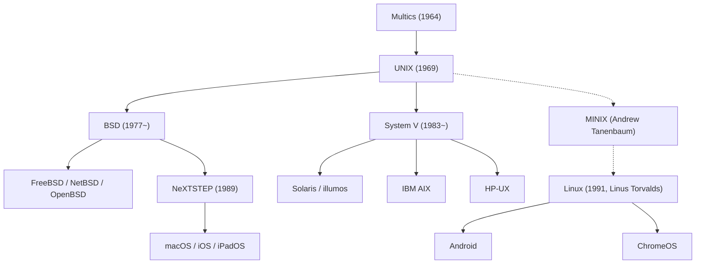

## Introduction : Le Géant Invisible au Cœur du Monde Connecté

Chaque smartphone que nous tenons en main, chaque serveur cloud qui achemine le trafic mondial du web et les postes de travail macOS plébiscités par les développeurs ont une ascendance architecturale directe : un système d'exploitation né en 1969 aux Laboratoires Bell d'AT&T : **UNIX**.

Plus d'un demi-siècle après sa création, la philosophie de conception et l'architecture d'UNIX demeurent le socle inaltérable des technologies de l'information. Comment un système minimaliste, conçu dans un bureau discret par une poignée d'ingénieurs en quête d'un environnement de programmation convivial, a-t-il pu traverser toutes les révolutions technologiques pour régner sur le monde numérique ?

Cet article propose une analyse historique et technique approfondie d'UNIX : des leçons tirées de l'échec de Multics à la genèse sur le PDP-7, de l'invention du langage C et de la portabilité aux principes intemporels de la Philosophie UNIX, en passant par les Guerres d'UNIX, le triomphe de Linux et l'héritage vivant au sein de macOS et iOS.

## 1. Avant UNIX : L'Ambition Démesurée et l'Échec de Multics

Pour retracer la genèse d'UNIX, il faut remonter au milieu des années 1960 avec le projet **Multics (Multiplexed Information and Computing Service)**. À cette époque, l'informatique reposait sur le traitement par lots (Batch Processing) : les ingénieurs devaient soumettre des paquets de cartes perforées et attendre des heures, voire des jours, pour récupérer leurs listings imprimés.

Trois institutions d'élite unirent leurs efforts pour inventer l'informatique de demain : le MIT, General Electric (GE) et les Laboratoires Bell d'AT&T. Multics visait à transformer la puissance de calcul en un service universel accessible en temps partagé (Time-Sharing) par des centaines d'utilisateurs simultanés, introduisant pour la première fois un système de fichiers hiérarchique, l'édition de liens dynamique et une sécurité sophistiquée en anneaux.

Mais Multics croula sous sa propre complexité. À force de vouloir tout intégrer, le projet s'enlisa, accumulant retards et surcoûts faramineux, tandis que les performances réelles s'avéraient médiocres. Devant l'absence de débouché commercial concret, la direction des Laboratoires Bell décida au début de l'année 1969 d'abandonner définitivement le projet.

## 2. 1969 : Space Travel, le PDP-7 et la Naissance d'UNICS

Le retrait de Multics plongea deux chercheurs d'exception, **Ken Thompson** et **Dennis Ritchie**, dans un grand désarroi. Ayant goûté au confort extraordinaire du travail interactif, ils refusaient de retourner à l'âge de pierre des cartes perforées.

À cette époque, Thompson avait développé un jeu de simulation de trajectoires spatiales baptisé *"Space Travel"*. Privé d'accès à l'ordinateur central de Multics, il dénicha dans un recoin poussiéreux du laboratoire un mini-ordinateur **PDP-7** de DEC, totalement délaissé. La machine était rudimentaire : elle ne disposait que de 8 192 mots de 18 bits de mémoire (environ 18 kilo-octets) et n'avait aucun système d'exploitation exploitable.

Afin de faire tourner son jeu, Thompson et Ritchie entreprirent d'écrire leur propre système d'exploitation en appliquant la leçon essentielle de l'échec de Multics : concevoir un système **extrêmement simple, compact et transparent**. En quelques semaines de programmation intense en assembleur, ils mirent au point la gestion des processus, un système de fichiers arborescent et un interpréteur de commandes.

Impressionné par cette élégance, leur collègue Brian Kernighan proposa par dérision le nom **UNICS (Uniplexed Information and Computing System)**, raillant la démesure de Multics ("Uni" s'opposant à "Multi"). Le nom devint rapidement **UNIX**, ouvrant en 1969 le chapitre fondateur de l'informatique moderne.

## 3. L'Invention du Langage C et le Miracle de la Portabilité

Les premières versions d'UNIX étaient rédigées en assembleur propre aux processeurs PDP. Le système était donc prisonnier de son matériel hôte : le porter sur une nouvelle machine exigeait une réécriture intégrale.

Pour surmonter cet obstacle majeur, Dennis Ritchie conçut entre 1971 et 1973 un tout nouveau langage de programmation : **le langage C**. C mariait avec brio la lisibilité et les structures de contrôle des langages de haut niveau avec la capacité d'accès direct à la mémoire et aux registres matériels.

En 1973, Thompson et Ritchie accomplirent un tour de force qui renversa les dogmes de l'époque : **ils réécrivirent la quasi-totalité du noyau UNIX en C**.

Jusqu'alors, la règle d'or voulait qu'un OS soit impérativement écrit en assembleur pour être rapide. UNIX démontra que la perte minime de performance était infiniment compensée par le bénéfice colossal de la **portabilité**. Dès lors qu'une machine disposait d'un compilateur C, UNIX pouvait y être adapté en quelques mois. UNIX venait de découpler le logiciel du matériel, s'imposant comme la première plateforme universelle de l'histoire. En 1983, Ken Thompson et Dennis Ritchie reçurent le prestigieux prix Turing pour cette contribution fondamentale.

## 4. La Philosophie UNIX : Un Idéal d'Ingénierie Intemporel

La longévité d'UNIX s'explique avant tout par son socle philosophique et esthétique, connu sous le nom de **Philosophie UNIX** :

### 1. « Tout est fichier » (Everything is a file)
UNIX unifie l'ensemble des ressources physiques et logiques (fichiers textes, répertoires, disques durs, clavier, écran, liaisons réseau) sous une interface universelle de flux d'octets. Grâce aux appels système standards (`open`, `read`, `write`, `close`), un développeur manipule n'importe quel périphérique sans avoir à maîtriser des API propriétaires spécifiques.

### 2. « Ne faire qu'une seule chose, et la faire bien » (Do one thing and do it well)
Au lieu de logiciels monolithiques tentaculaires, UNIX privilégie des utilitaires modulaires et spécialisés. Des outils comme `cat`, `grep`, `sort`, `uniq`, `awk` et `sed` n'ont qu'une mission étroite, mais ils l'accomplissent avec une rigueur et une efficacité irréprochables.

### 3. « Les Tubes et Filtres » (Pipes)
Proposé en 1973 par Douglas McIlroy, le mécanisme du **tube (`|`)** permet de connecter directement la sortie standard (`stdout`) d'un utilitaire à l'entrée standard (`stdin`) d'un autre en continu :

```bash
cat access.log | awk '{print $1}' | sort | uniq -c | sort -nr
```

En agençant ces petits outils modulaires à la manière de briques Lego, les développeurs créent instantanément des chaînes de traitement de données très avancées. Ce modèle constitue la genèse directe des architectures de microservices modernes.

## 5. Les Schismes et les « Guerres d'UNIX »

À la fin des années 1970, un accord antitrust interdisait à AT&T toute activité commerciale hors des télécommunications. L'entreprise distribua donc le code source d'UNIX aux universités pour un coût dérisoire de reproduction.

À l'Université de Californie à Berkeley, l'étudiant **Bill Joy** (qui cofondera ensuite Sun Microsystems) et le groupe de recherche CSRG perfectionnèrent UNIX en intégrant la mémoire virtuelle, le système de fichiers FFS et la première implémentation de la pile réseau TCP/IP avec l'API des Sockets. Cette déclinaison fut baptisée **BSD (Berkeley Software Distribution)** et conquit le monde universitaire.



Dans les années 1980, les contraintes juridiques pesant sur AT&T furent levées. Prenant conscience de la valeur marchande colossale d'UNIX, AT&T verrouilla les sources et commercialisa **System V** sous des licences coûteuses et restrictives.

Ce revirement déclencha les fameuses **« Guerres d'UNIX » (UNIX Wars)** entre les partisans de System V (IBM AIX, HP-UX, Sun Solaris) et le monde BSD. Les procès et les incompatibilités logicielles épuisèrent le marché, offrant à Microsoft un boulevard pour imposer Windows NT dans les entreprises. Pour remédier à cette fragmentation, l'industrie finit par adopter la norme **POSIX** de l'IEEE et la **Single UNIX Specification (SUS)**.

## 6. L'Éclosion de l'Open Source et le Règne Absolu de Linux

Au début des années 1990, les stations UNIX propriétaires étaient hors de prix pour les étudiants et passionnés qui s'équipaient de PC compatibles Intel 386.

En août 1991, l'étudiant finlandais **Linus Torvalds** publia sur Internet le noyau qu'il avait conçu de toutes pièces : **Linux**.

Linux ne comportait pas une seule ligne de code AT&T, échappant ainsi aux litiges juridiques, tout en respectant scrupuleusement les spécifications POSIX. Associé aux compilateurs GCC, au shell bash et aux outils créés par le **Projet GNU** de Richard Stallman, ce noyau forma un système d'exploitation complet, performant et libre : **GNU/Linux**.

Porté par l'intelligence collective des développeurs du monde entier, Linux a conquis la planète. Il anime aujourd'hui :
- 100 % des 500 supercalculateurs les plus puissants au monde.
- Plus de 90 % des infrastructures cloud chez AWS et Google Cloud.
- Les plateformes boursières internationales les plus critiques.
- Des milliards de terminaux mobiles par le biais d'Android.

## 7. La Filiation Directe : macOS, iOS et la Certification Officielle UNIX

Tandis que Linux s'imposait sur les serveurs, la lignée originelle issue de BSD trouvait son expression la plus raffinée chez Apple.

Évincé d'Apple en 1985, Steve Jobs fonda NeXT et créa **NeXTSTEP**, un système d'exploitation orienté objet s'appuyant sur le micro-noyau Mach et 4.3BSD. Lorsque Apple racheta NeXT en 1996, NeXTSTEP devint le cœur architectural de **Mac OS X** (l'actuel **macOS**).

Le noyau Darwin de macOS est un authentique dérivé de BSD, certifié selon la norme **UNIX 03** par The Open Group. Les systèmes iOS, iPadOS et watchOS reposent sur cette même base éprouvée. Si les ingénieurs privilégient aujourd'hui le Mac, c'est parce qu'il offre l'alliance parfaite d'une interface graphique irréprochable et de la puissance brute d'un terminal UNIX natif.

## Conclusion : Une Architecture Éternelle

En 1969, au cœur des Laboratoires Bell, Ken Thompson et Dennis Ritchie voulaient simplement se doter d'un outil agréable pour programmer.

En plus de cinquante ans, les machines ont troqué leurs armoires géantes pour des puces nanométriques, et des centaines de systèmes propriétaires ont sombré dans l'oubli. Mais les piliers fondateurs d'UNIX — la portabilité en C, l'abstraction de fichiers et la composition modulaire par tubes — ont démontré une vitalité immortelle.

Des superordinateurs qui simulent le climat jusqu'au smartphone dans votre poche, la pensée d'UNIX façonne silencieusement chaque parcelle du monde connecté.
