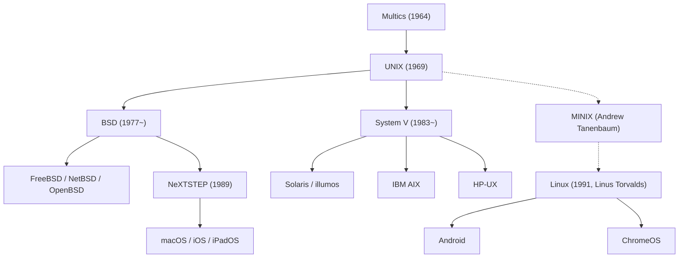

## प्रस्तावना: आधुनिक डिजिटल दुनिया को चलाने वाला अदृश्य स्तंभ

आज हमारी जेब में मौजूद स्मार्टफोन, इंटरनेट ट्रैफिक संभालने वाले क्लाउड सर्वर और डेवलपर्स के पसंदीदा macOS लैपटॉप—इन सभी की जड़ें 1969 में AT&T की बेल लैबोरेटरीज (Bell Labs) में जन्मे एक क्रांतिकारी ऑपरेटिंग सिस्टम से जुड़ी हैं: **UNIX (यूनिक्स)**।

अपनी रचना के आधी सदी से भी अधिक समय बाद, यूनिक्स के डिजाइन सिद्धांत आधुनिक सूचना प्रौद्योगिकी के सबसे मजबूत स्तंभ बने हुए हैं। एक प्रयोगशाला में कुछ इंजीनियरों द्वारा सिर्फ "आसानी से प्रोग्राम लिखने" के लिए बनाया गया एक छोटा सा सिस्टम कैसे पूरी दुनिया के कंप्यूटरों का आधार बन गया?

यह लेख यूनिक्स के पूरे इतिहास का विश्लेषण करता है: मल्टिक्स (Multics) की विफलता, PDP-7 पर इसका जन्म, C भाषा का आविष्कार और पोर्टेबिलिटी, यूनिक्स दर्शन, यूनिक्स युद्ध, लिनक्स की क्रांति और macOS व iOS में इसकी जीवित विरासत।

## 1. यूनिक्स से पहले: मल्टिक्स (Multics) की विफलता और सीख

यूनिक्स की शुरुआत को समझने के लिए 1960 के दशक के टाइम-शेयरिंग प्रोजेक्ट **Multics (Multiplexed Information and Computing Service)** को जानना आवश्यक है। उस समय बैच प्रोसेसिंग का दौर था: प्रोग्रामर पंच कार्ड जमा करते थे और परिणामों के लिए घंटों या दिनों तक इंतजार करते थे।

MIT, जनरल इलेक्ट्रिक (GE) और बेल लैब्स ने मिलकर एक भविष्यवादी ऑपरेटिंग सिस्टम बनाने का प्रयास किया। मल्टिक्स का उद्देश्य कंप्यूटर को बिजली या पानी की तरह एक सार्वजनिक उपयोगिता बनाना था, जिससे सैकड़ों लोग एक साथ कंप्यूटर का उपयोग कर सकें। इसमें डायरेक्टरी सिस्टम, डायनामिक लिंकिंग और सुरक्षा के कई नए विचार पेश किए गए।

लेकिन मल्टिक्स अपनी अत्यधिक महत्वाकांक्षा के कारण विफल हो गया। सभी सुविधाओं को एक साथ जोड़ने के प्रयास में सिस्टम बहुत जटिल हो गया, परियोजना में वर्षों की देरी हुई और प्रदर्शन बहुत धीमा रहा। लाखों डॉलर खर्च करने के बाद 1969 की शुरुआत में बेल लैब्स ने इस प्रोजेक्ट से हाथ खींच लिए।

## 2. 1969: स्पेस ट्रैवल, PDP-7 और UNICS का जन्म

मल्टिक्स के बंद होने से बेल लैब्स के दो युवा वैज्ञानिक—**केन थॉम्पसन (Ken Thompson)** और **डेनिस रिची (Dennis Ritchie)**—काफी निराश हुए। इंटरैक्टिव सिस्टम की स्वतंत्रता का अनुभव करने के बाद वे फिर से पुराने पंच कार्ड के युग में वापस नहीं जाना चाहते थे।

उस समय केन थॉम्पसन ने ग्रहों की गति का अनुकरण करने वाला एक गेम लिखा था जिसका नाम था *"Space Travel"*। जब मल्टिक्स कंप्यूटर बंद हो गया, तो उन्होंने प्रयोगशाला के एक कोने में धूल खा रहे पुराने मिनीकंप्यूटर **PDP-7** को चुना। PDP-7 बहुत साधारण कंप्यूटर था: इसमें केवल 18 किलोबाइट मेमोरी थी और कोई अच्छा ऑपरेटिंग सिस्टम नहीं था।

अपने गेम को चलाने के लिए थॉम्पसन और रिची ने मल्टिक्स की गलतियों से सीखकर एक **बेहद सरल, छोटा और स्पष्ट** ऑपरेटिंग सिस्टम खुद लिखने का फैसला किया। कुछ ही हफ्तों में उन्होंने असेंबली भाषा में प्रोसेस शेड्यूलिंग, फाइल सिस्टम और कमांड लाइन शेल तैयार कर लिया।

उनके साथी ब्रायन कर्निघन ने मल्टिक्स की जटिलता पर व्यंग्य करते हुए इस नए सिस्टम का नाम **UNICS (Uniplexed Information and Computing System)** रखा ("Multi" के विपरीत "Uni")। बाद में इसका नाम बदलकर **UNIX** हो गया। इस तरह 1969 में आधुनिक ऑपरेटिंग सिस्टम के इतिहास की शुरुआत हुई।

## 3. C भाषा का जन्म और पोर्टेबिलिटी (Portability) का चमत्कार

शुरुआती यूनिक्स पूरी तरह से PDP कंप्यूटर की असेंबली भाषा में लिखा गया था। इसका मतलब यह था कि हार्डवेयर बदलते ही पूरे ऑपरेटिंग सिस्टम को दोबारा नए सिरे से लिखना पड़ता था।

इस समस्या को हल करने के लिए डेनिस रिची ने 1971 से 1973 के बीच एक नई प्रोग्रामिंग भाषा विकसित की: **C भाषा**। C भाषा में हाई-लेवल भाषा की सरलता और लो-लेवल हार्डवेयर नियंत्रण (जैसे पॉइंटर्स और मेमोरी एक्सेस) दोनों का अद्भुत संतुलन था।

1973 में थॉम्पसन और रिची ने एक ऐसा साहसिक कदम उठाया जिसने उस समय के कंप्यूटर जगत को चौंका दिया: **उन्होंने यूनिक्स के पूरे कर्नल को C भाषा में दोबारा लिखा।**

तब तक यह माना जाता था कि ऑपरेटिंग सिस्टम को तेज़ चलाने के लिए असेंबली भाषा में ही लिखा जाना चाहिए। लेकिन यूनिक्स ने साबित कर दिया कि C भाषा में लिखने से थोड़ा गति नुकसान भले ही हो, लेकिन इसका सबसे बड़ा लाभ **पोर्टेबिलिटी** था। यदि किसी नए कंप्यूटर के लिए C कंपाइलर उपलब्ध था, तो यूनिक्स को उस पर कुछ ही महीनों में चलाया जा सकता था। यूनिक्स हार्डवेयर से स्वतंत्र होने वाला दुनिया का पहला मानक ओएस बन गया। इस महान योगदान के लिए 1983 में थॉम्पसन और रिची को ट्यूरिंग पुरस्कार से सम्मानित किया गया।

## 4. अमर 'यूनिक्स दर्शन' (UNIX Philosophy)

यूनिक्स की सफलता का असली रहस्य इसके कुछ मौलिक डिजाइन सिद्धांत हैं जिन्हें **यूनिक्स दर्शन** कहा जाता है:

### 1. "सब कुछ एक फाइल है" (Everything is a file)
यूनिक्स सिस्टम के सभी संसाधनों (टेक्स्ट फाइल, डायरेक्टरी, हार्ड डिस्क, कीबोर्ड, मॉनिटर और नेटवर्क सॉकेट्स) को बाइट्स की एक फाइल के रूप में देखता है। डेवलपर्स को हर डिवाइस के लिए अलग एपीआई सीखने की जरूरत नहीं है; वे सामान्य सिस्टम कॉल (`open`, `read`, `write`, `close`) से किसी भी डिवाइस को नियंत्रित कर सकते हैं।

### 2. "एक काम करो और उसे अच्छी तरह करो" (Do one thing and do it well)
विशाल और जटिल प्रोग्राम बनाने के बजाय यूनिक्स छोटे और विशिष्ट टूल्स बनाने पर जोर देता है। `cat`, `grep`, `sort`, `uniq`, `awk`, और `sed` जैसे कमांड केवल एक विशिष्ट कार्य करते हैं, लेकिन पूरी मजबूती और सटीकता से करते हैं।

### 3. "पाइप और फिल्टर्स" (Pipes)
1973 में डगलस मैकलरॉय द्वारा सुझाया गया **पाइप (`|`)** तंत्र यूनिक्स की सबसे बड़ी शक्ति है। यह एक प्रोग्राम के आउटपुट (`stdout`) को सीधे दूसरे प्रोग्राम के इनपुट (`stdin`) से जोड़ देता है:

```bash
cat access.log | awk '{print $1}' | sort | uniq -c | sort -nr
```

छोटे-छोटे टूल्स को लेगो ब्लॉक की तरह जोड़कर जटिल डेटा प्रोसेसिंग को तुरंत पूरा किया जा सकता है। यह विचार आज के आधुनिक माइक्रोसर्विसेज का पूर्वज है।

## 5. विभाजन और "यूनिक्स युद्ध" (UNIX Wars)

1970 के दशक के अंत में एंटीट्रस्ट कानूनों के कारण AT&T को कंप्यूटर व्यवसाय में सीधे सॉफ्टवेयर बेचने की अनुमति नहीं थी। इसलिए AT&T ने विश्वविद्यालयों को यूनिक्स का सोर्स कोड मुफ्त जैसा उपलब्ध कराया।

कैलिफोर्निया विश्वविद्यालय, बर्कले में छात्र **बिल जॉय** (जिन्होंने बाद में सन माइक्रोसिस्टम्स की स्थापना की) और CSRG टीम ने वर्चुअल मेमोरी, नया फाइल सिस्टम और दुनिया का पहला TCP/IP नेटवर्क स्टैक जोड़कर **BSD (Berkeley Software Distribution)** तैयार किया।



1980 के दशक में कानूनी प्रतिबंध हटने के बाद AT&T को यूनिक्स की अपार व्यावसायिक कीमत का अहसास हुआ। उन्होंने सोर्स कोड बंद कर दिया और महंगे लाइसेंस के साथ **System V** लॉन्च किया।

इसके बाद BSD और System V के बीच **"यूनिक्स युद्ध" (UNIX Wars)** छिड़ गया। मुकदमों और सिस्टम की भिन्नता ने ग्राहकों को परेशान कर दिया, जिससे माइक्रोसॉफ्ट के Windows NT को बाजार में जगह मिल गई। अंततः IEEE के **POSIX** मानकों और **Single UNIX Specification (SUS)** ने इस विवाद को सुलझाया।

## 6. ओपन सोर्स क्रांति और लिनक्स (Linux) का साम्राज्य

1990 के दशक की शुरुआत में व्यावसायिक यूनिक्स बहुत महंगे कंप्यूटरों तक सीमित था और आम पीसी उपयोगकर्ताओं की पहुंच से बाहर था।

अगस्त 1991 में फिनलैंड के छात्र **लिनस टोरवाल्ड्स (Linus Torvalds)** ने इंटरनेट पर अपना स्वतंत्र कर्नल जारी किया: **Linux**।

लिनक्स में AT&T का कोई कोड नहीं था, लेकिन इसे POSIX मानकों के अनुसार यूनिक्स जैसा (UNIX-like) बनाया गया था। रिचर्ड स्टॉलमैन के **GNU प्रोजेक्ट** के टूल्स (GCC कंपाइलर, bash शेल) के साथ मिलकर यह एक पूर्ण ऑपरेटिंग सिस्टम बन गया: **GNU/Linux**।

इंटरनेट के जरिए दुनिया भर के डेवलपर्स के सहयोग से लिनक्स ने पुरानी कंपनियों को पीछे छोड़ दिया। आज लिनक्स चलाता है:
- दुनिया के 500 सबसे तेज सुपरकंप्यूटरों का 100%।
- AWS और गूगल क्लाउड का 90% से अधिक इंफ्रास्ट्रक्चर।
- दुनिया के प्रमुख शेयर बाजार।
- एंड्रॉइड के जरिए अरबों स्मार्टफोन।

## 7. प्रत्यक्ष वंशज: macOS, iOS और प्रमाणित यूनिक्स

जहाँ लिनक्स ने सर्वर पर राज किया, वहीं बर्कले की BSD शाखा ने एप्पल (Apple) के उत्पादों में अपना सबसे सुंदर रूप पाया।

1985 में एप्पल छोड़ने के बाद स्टीव जॉब्स ने NeXT की स्थापना की और BSD पर आधारित **NeXTSTEP** विकसित किया। 1996 में जब एप्पल ने NeXT को खरीदा, तो NeXTSTEP **Mac OS X** (वर्तमान में **macOS**) का दिल बन गया।

macOS का डार्विन (Darwin) कर्नल शुद्ध BSD आधारित है और इसे The Open Group से आधिकारिक **UNIX 03 प्रमाणन** प्राप्त है। इसी तरह iOS, iPadOS और watchOS भी इसी कर्नल पर चलते हैं। डेवलपर्स मैक को इसलिए पसंद करते हैं क्योंकि इसमें बेहतरीन ग्राफिक्स के साथ असली यूनिक्स टर्मिनल की शक्ति मिलती है।

## निष्कर्ष: समय से परे एक अमर वास्तुकला

1969 में बेल लैब्स के एक कमरे में केन थॉम्पसन और डेनिस रिची केवल एक ऐसा सिस्टम चाहते थे जहाँ वे खुशी से कोड लिख सकें।

पांच दशकों में अनगिनत कंप्यूटर और ऑपरेटिंग सिस्टम आए और गए। लेकिन यूनिक्स के मूल विचार—C भाषा में पोर्टेबिलिटी, सब कुछ एक फाइल, और पाइप से टूल्स जोड़ना—समय की कसौटी पर हमेशा खरे उतरे हैं।

सुपरकंप्यूटरों से लेकर हमारी जेब में रखे फोन तक, यूनिक्स की आत्मा आधुनिक तकनीक की हर सांस में धड़क रही है।
