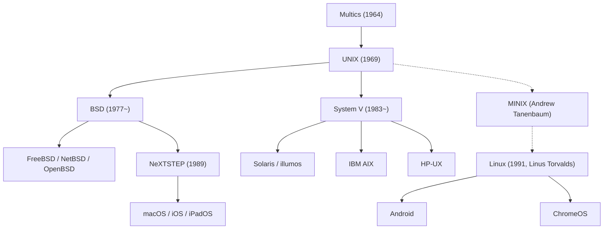

## Pendahuluan: Raksasa Tak Terlihat Penggerak Peradaban Digital

Setiap smartphone di genggaman kita, server cloud yang memproses lalu lintas data dunia, hingga stasiun kerja macOS yang menjadi andalan para insinyur perangkat lunak, semuanya bermuara pada satu sistem operasi legendaris yang lahir pada tahun 1969 di Bell Labs milik AT&T: **UNIX**.

Lebih dari setengah abad sejak kelahirannya, arsitektur dan filosofi UNIX tetap menjadi fondasi yang menopang seluruh industri teknologi informasi modern. Bagaimana sebuah sistem minimalis yang dirancang oleh segelintir insinyur agar "nyaman menulis program" mampu bertahan melewati berbagai disrupsi teknologi dan mendominasi komputasi dunia?

Artikel ini mengupas sejarah komprehensif UNIX: dari kegagalan proyek Multics dan kelahiran di atas komputer tua PDP-7, penemuan bahasa C dan revolusi portabilitas, Filosofi UNIX yang abadi, Perang UNIX, revolusi sumber terbuka Linux, hingga garis keturunan aslinya yang hidup di dalam macOS dan iOS.

## 1. Sebelum UNIX: Ambisi Besar dan Pelajaran dari Kegagalan Multics

Kisah UNIX bermula pada pertengahan dekade 1960-an melalui proyek sistem time-sharing ambisius bernama **Multics (Multiplexed Information and Computing Service)**. Saat itu, komputasi didominasi oleh pemrosesan tumpak (Batch Processing): pengguna harus menyerahkan setumpuk kartu berlubang (punch card) dan menunggu hasilnya berjam-jam atau berhari-hari.

Tiga lembaga raksasa bergabung untuk membangun sistem masa depan: MIT, General Electric (GE), dan Bell Labs milik AT&T. Multics bercita-cita menjadikan daya komputasi seperti layanan listrik atau air yang dapat diakses ratusan pengguna secara bersamaan, memperkenalkan sistem berkas hierarkis, dynamic linking, serta sistem keamanan cincin bertingkat.

Namun, Multics runtuh akibat ambisinya yang terlalu berlebihan. Keinginan mengimplementasikan terlalu banyak fitur rumit membuat arsitektur membengkak tak terkendali. Proyek tersendat, biaya membengkak, dan kinerjanya sangat mengecewakan. Setelah menghabiskan dana besar tanpa hasil nyata, manajemen Bell Labs memutuskan mundur dari proyek Multics pada awal tahun 1969.

## 2. 1969: Space Travel, PDP-7, dan Kelahiran UNICS

Mundurnya Bell Labs dari Multics meninggalkan rasa kecewa mendalam bagi dua penelitinya: **Ken Thompson** dan **Dennis Ritchie**. Karena telah merasakan keleluasaan lingkungan interaktif, mereka menolak kembali ke era kaku pemrosesan kartu berlubang.

Pada waktu itu, Ken Thompson telah memprogram sebuah game simulasi orbit antariksa bernama *"Space Travel"*. Kehilangan akses ke komputer Multics membuatnya mencari alternatif hingga menemukan sebuah komputer mini usang yang terbengkalai di sudut laboratorium Murray Hill: **PDP-7** buatan DEC. Mesin tersebut sangat terbatas: memorinya hanya 8.192 kata 18-bit (sekitar 18 kilobita) dan tidak memiliki sistem operasi yang memadai.

Agar game tersebut dapat berjalan lancar, Thompson dan Ritchie bertekad membangun sistem operasi sendiri. Mengambil pelajaran dari kegagalan Multics, mereka merancang sistem yang **sangat sederhana, ramping, dan bersih**. Hanya dalam beberapa minggu pengkodean bahasa rakitan (assembly), mereka membangun subsistem proses, sistem berkas hierarkis, dan shell baris perintah.

Melihat kesederhanaan sistem baru ini, rekan mereka Brian Kernighan secara berseloroh menamakannya **UNICS (Uniplexed Information and Computing System)** untuk memparodikan kerumitan Multics ("Uni" sebagai lawan dari "Multi"). Ejaan tersebut kemudian disederhanakan menjadi **UNIX**. Pada tahun 1969, babak baru sejarah sistem operasi resmi dimulai.

## 3. Penemuan Bahasa C dan Keajaiban Portabilitas

Versi-versi awal UNIX ditulis sepenuhnya dalam bahasa assembly PDP. Hal ini mengikat sistem operasi secara kaku pada perangkat keras tertentu; menjalankannya pada komputer model lain mengharuskan penulisan ulang kode dari awal.

Untuk mendobrak keterbatasan ini, Dennis Ritchie mengembangkan bahasa tingkat tinggi baru antara tahun 1971 hingga 1973: **bahasa C**. Bahasa C memadukan struktur sintaksis yang elegan dari bahasa tingkat tinggi dengan kemampuan manipulasi pointer dan memori tingkat rendah secara langsung.

Pada tahun 1973, Thompson dan Ritchie melakukan langkah revolusioner yang mendobrak dogma ilmu komputer: **mereka menulis ulang hampir seluruh kernel UNIX menggunakan bahasa C**.

Sebelumnya, pakar meyakini bahwa sistem operasi harus ditulis dalam assembly agar memiliki performa tinggi. UNIX membuktikan bahwa sedikit penurunan performa tidak ada artinya dibanding manfaat luar biasa dari **portabilitas (portability)**. Selama komputer tujuan memiliki kompilator C, UNIX dapat diporting dalam hitungan bulan. UNIX membebaskan perangkat lunak dari belenggu perangkat keras. Atas kontribusi monumental ini, Ken Thompson dan Dennis Ritchie dianugerahi penghargaan Turing Award pada tahun 1983.

## 4. Filosofi UNIX yang Abadi

Kunci ketahanan UNIX selama puluhan tahun terletak pada keanggunan prinsip-prinsip desainnya yang dikenal sebagai **Filosofi UNIX**:

### 1. "Semuanya adalah berkas" (Everything is a file)
UNIX mengabstraksikan semua sumber daya komputasi (dokumen teks, direktori, cakram keras, papan tik, monitor, hingga soket komunikasi jaringan) ke dalam antarmuka aliran bita (berkas). Pengembang dapat mengontrol perangkat apa pun menggunakan panggilan sistem standar (`open`, `read`, `write`, `close`) tanpa perlu mempelajari API khusus untuk setiap perangkat keras.

### 2. "Kerjakan satu hal, dan kerjakan dengan baik" (Do one thing and do it well)
Alih-alih membuat program raksasa yang monolitik, UNIX mendorong pembuatan perkakas kecil yang terspesialisasi. Perintah-perintah seperti `cat`, `grep`, `sort`, `uniq`, `awk`, dan `sed` hanya menjalankan satu tugas spesifik dengan kecepatan dan keandalan maksimal.

### 3. "Pipa dan Penyaring" (Pipes)
Diciptakan pada tahun 1973 atas usulan Douglas McIlroy, mekanisme **pipa (`|`)** memungkinkan keluaran standar (`stdout`) suatu program dialirkan langsung menjadi masukan standar (`stdin`) program lain secara kontinu:

```bash
cat access.log | awk '{print $1}' | sort | uniq -c | sort -nr
```

Dengan merangkai utilitas kecil bagaikan balok Lego, pengembang dapat menyusun pemrosesan data yang rumit seketika di baris perintah. Pendekatan ini merupakan cikal bakal arsitektur microservices modern.

## 5. Perpecahan dan "Perang UNIX" (UNIX Wars)

Pada akhir 1970-an, regulasi antimonopoli melarang AT&T berbisnis komersial di luar telekomunikasi. Oleh karena itu, AT&T mendistribusikan kode sumber UNIX ke universitas dan lembaga riset secara cuma-cuma.

Di Universitas California, Berkeley, mahasiswa pascasarjana **Bill Joy** (kelak mendirikan Sun Microsystems) bersama kelompok CSRG memperkaya UNIX secara drastis dengan menambahkan memori virtual, Fast File System (FFS), serta tumpukan protokol TCP/IP dan Sockets API, melahirkan varian **BSD (Berkeley Software Distribution)**.



Pada 1980-an, larangan hukum dicabut. AT&T menyadari nilai komersial UNIX yang luar biasa, lalu menutup kode sumbernya dan merilis **System V** dengan biaya lisensi yang mahal.

Hal ini memicu **"Perang UNIX" (UNIX Wars)** antara kubu System V (IBM AIX, HP-UX, Sun Solaris) melawan kubu BSD. Sengketa hukum dan ketidakcocokan sistem membingungkan para pengguna, memberi peluang bagi Windows NT buatan Microsoft untuk merambah sektor korporat. Persaingan ini akhirnya reda setelah disepakatinya standar antarmuka **POSIX** dari IEEE dan **Single UNIX Specification (SUS)**.

## 6. Gelombang Sumber Terbuka dan Dominasi Mutlak Linux

Pada awal 1990-an, sistem UNIX komersial hanya terpasang pada stasiun kerja yang mahal, sehingga tidak terjangkau bagi para mahasiswa yang memiliki PC Intel 386.

Pada Agustus 1991, mahasiswa asal Finlandia bernama **Linus Torvalds** merilis kernel independen di Internet: **Linux**.

Linux tidak mengandung baris kode milik AT&T sedikit pun, namun dirancang menyerupai UNIX (UNIX-like) yang patuh pada standar POSIX. Dipadukan dengan kompilator GCC, shell bash, dan utilitas inti dari **Proyek GNU** milik Richard Stallman, lahirlah sistem operasi bebas dan terbuka: **GNU/Linux**.

Melalui kolaborasi global para pengembang di seluruh dunia via Internet, Linux berkembang pesat dan merebut pasar UNIX komersial. Saat ini Linux menguasai:
- 100% dari 500 superkomputer tercepat di dunia.
- Lebih dari 90% komputasi awan di AWS, Azure, dan Google Cloud.
- Pusat transaksi bursa saham terpenting di dunia.
- Miliaran perangkat seluler melalui Android.

## 7. Garis Keturunan Asli: macOS, iOS, dan UNIX Resmi

Saat Linux mendominasi pusat data, garis keturunan langsung BSD berkembang elegan dalam ekosistem Apple.

Setelah keluar dari Apple pada 1985, Steve Jobs mendirikan NeXT dan menciptakan sistem operasi **NeXTSTEP** berbasis microkernel Mach dan 4.3BSD. Saat Apple mengakuisisi NeXT pada 1996, NeXTSTEP menjadi fondasi utama **Mac OS X** (kini **macOS**).

Inti Darwin pada macOS merupakan turunan murni BSD dan memegang sertifikasi resmi **UNIX 03** dari The Open Group. Begitu pula iOS, iPadOS, dan watchOS yang berbagi arsitektur kernel yang sama. Banyak pengembang menyukai Mac karena menghadirkan antarmuka grafis yang menawan berpadu dengan kekuatan terminal UNIX sejati.

## Kesimpulan: Arsitektur Abadi Melintasi Zaman

Pada tahun 1969 di Bell Labs, Ken Thompson dan Dennis Ritchie hanya ingin menciptakan sebuah lingkungan yang menyenangkan untuk menulis program komputer.

Selama lima puluh tahun lebih, ribuan sistem operasi dan arsitektur mesin telah lahir dan mati. Namun, gagasan pokok UNIX — portabilitas bahasa C, abstraksi serba berkas, dan penyusunan alat melalui pipa — telah terbukti abadi.

Dari superkomputer yang memproses kecerdasan buatan hingga ponsel di saku kita, napas dan jiwa UNIX terus menghidupkan denyut teknologi peradaban modern.
