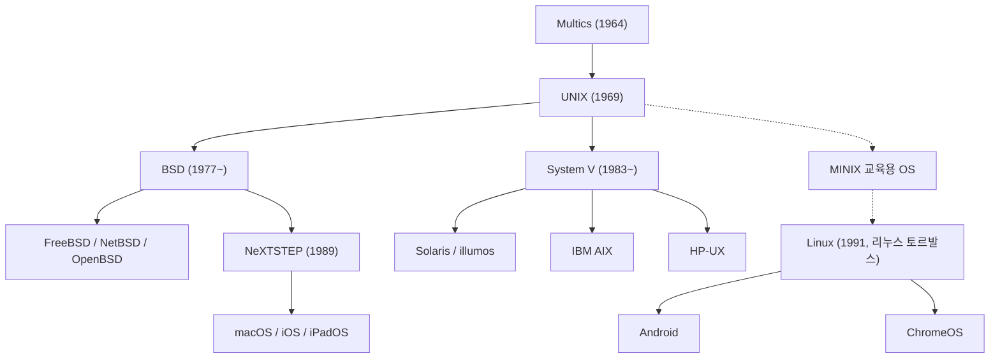

## 서론: 현대 디지털 문명을 움직이는 보이지 않는 거인

오늘날 우리가 손에 쥐고 있는 스마트폰, 웹 트래픽을 처리하는 전 세계의 클라우드 서버, 소프트웨어 개발자들의 필수 장비인 macOS에 이르기까지, 현대 컴퓨팅 환경의 모든 뿌리는 1969년 미국 AT&T 벨 연구소(Bell Labs)에서 탄생한 하나의 전설적인 운영체제로 이어집니다. 그 이름은 바로 **UNIX(유닉스)** 입니다.

탄생 후 반세기가 넘게 흐른 지금도 유닉스의 설계 사상과 아키텍처는 IT 산업의 가장 견고한 초석으로 군림하고 있습니다. 일개 기업 연구소의 구석에서 연구원 몇 명이 "편안하게 프로그램을 개발하기 위해" 만든 작은 시스템이 어떻게 수많은 기술적 격변을 이겨내고 전 세계의 컴퓨터를 지배하게 되었을까요?

본 글에서는 Multics 프로젝트의 좌절과 교훈, PDP-7에서의 유닉스 탄생, C 언어 개발과 이식성(Portability) 혁명, 시대를 초월한 유닉스 철학, 유닉스 전쟁, 리눅스의 오픈소스 반란, 그리고 macOS와 iOS로 이어지는 정통 유닉스의 혈통을 깊이 있게 추적합니다.

## 1. 유닉스 전야: 거대 프로젝트 'Multics'의 좌절과 교훈

유닉스의 역사를 이해하기 위해서는 1960년대 중반에 시작된 시분할 시스템(TSS) 프로젝트인 **Multics(Multiplexed Information and Computing Service)** 를 먼저 살펴보아야 합니다. 당시 컴퓨터는 펀치 카드를 기계에 넣고 결과를 수 시간씩 기다려야 하는 일괄 처리(Batch Processing) 방식이 지배적이었습니다.

MIT, 제너럴 일렉트릭(GE), 그리고 AT&T 벨 연구소라는 세 거대 기관이 손을 잡고 컴퓨터를 수도나 전기처럼 누구나 동시에 쓸 수 있는 유틸리티로 만들겠다는 야심 찬 비전 아래 Multics 프로젝트를 시작했습니다. 계층형 파일 시스템, 동적 링킹, 다단계 보안 링 등 현대 OS의 핵심 개념들이 이때 처음 고안되었습니다.

하지만 Multics는 지나치게 이상주의적이었습니다. 모든 기능과 엄격한 보안을 한꺼번에 구현하려다 보니 아키텍처가 걷잡을 수 없이 복잡해졌고, 개발은 진흙탕에 빠졌으며 성능은 처참했습니다. 결국 막대한 자금을 쏟아부었던 벨 연구소 경영진은 1969년 초 Multics 프로젝트에서 전격 철수 결정을 내렸습니다.

## 2. 1969년: '스페이스 트래블', PDP-7, 그리고 유닉스의 탄생

Multics 프로젝트 철수는 벨 연구소의 천재 연구원이었던 **켄 톰슨(Ken Thompson)** 과 **[데니스 리치](/p/biography-dennis-ritchie/)(Dennis Ritchie)** 에게 깊은 상실감을 안겨주었습니다. 대화형 인터랙티브 환경의 자유로움을 맛본 그들은 결코 과거의 지루한 펀치 카드 시대로 되돌아갈 수 없었습니다.

당시 톰슨은 행성의 공전 궤도를 시뮬레이션하는 《스페이스 트래블(Space Travel)》이라는 게임을 개발하고 있었습니다. Multics 메인프레임 접속이 차단되자, 그는 연구소 한구석에 방치되어 먼지를 뒤집어쓰고 있던 DEC의 구형 미니컴퓨터 **PDP-7** 에 눈을 돌렸습니다. PDP-7은 메모리가 8,192개 18비트 워드(약 18KB)에 불과하고 제대로 된 운영체제조차 없는 초라한 장비였습니다.

톰슨과 리치는 Multics의 뼈아픈 실패를 반면교사 삼아 "극도로 단순하고, 작고, 명료한" 독립 운영체제를 직접 어셈블리어로 작성하기 시작했습니다. 프로세스 관리, 계층형 파일 시스템, 커맨드라인 셸을 단 몇 주 만에 구현해 냈습니다.

이 작고 날렵한 시스템을 본 동료 브라이언 커니핸(Brian Kernighan)은 복잡하고 거대했던 Multics를 패러디하여 "하나만 단순하게 잘하는 시스템"이라는 뜻으로 **UNICS(Uniplexed Information and Computing System)** 라는 이름을 붙였습니다. 이 이름은 곧 철자가 다듬어져 **UNIX** 가 되었고, 1969년 현대 OS의 새 역사가 시작되었습니다.

## 3. C 언어의 탄생과 '이식성(Portability)'의 기적

초기 유닉스 커널은 특정 하드웨어(PDP-7, PDP-11)의 어셈블리어로 작성되어 있었습니다. 이는 기계가 바뀌면 운영체제 코드를 처음부터 다시 짜야 한다는 치명적인 한계를 의미했습니다.

이 하드웨어 종속성의 굴레를 깨부수기 위해 [데니스 리치](/p/biography-dennis-ritchie/)는 1971년부터 1973년에 걸쳐 **C 언어** 를 개발했습니다. C 언어는 구조화된 제어 흐름과 데이터 타입을 제공하는 고급 언어의 편의성과, 메모리 주소를 직접 다룰 수 있는 저급 언어의 강력함을 완벽하게 결합한 혁신적인 언어였습니다.

1973년, 톰슨과 리치는 컴퓨터 공학계의 오랜 불문율을 깨부수는 결단을 내렸습니다: **유닉스 커널 전체를 C 언어로 완전히 재작성한 것입니다.**

그때까지 운영체제는 성능 때문에 반드시 어셈블리어로만 짜야 한다는 것이 상식이었습니다. 하지만 C 언어로 작성된 유닉스는 C 컴파일러만 갖추어지면 어떤 새로운 아키텍처의 컴퓨터로도 수개월 만에 쉽게 이식될 수 있는 전무후무한 **'이식성(Portability)'** 을 획득했습니다. 유닉스는 특정 하드웨어 제조사에 종속되지 않는 최초의 '범용 개방형 표준 OS'가 되었습니다. 1983년, 켄 톰슨과 데니스 리치는 이 혁혁한 공로로 컴퓨터 과학의 노벨상인 튜링상(Turing Award)을 수상했습니다.

## 4. 시대를 초월하는 '유닉스 철학(UNIX Philosophy)'

유닉스가 반세기 동안 사랑받으며 현대 소프트웨어 공학의 바이블로 남은 비결은 우아한 설계 사상인 **[유닉스 철학](/p/philosophy-unix-modular-design/)** 에 있습니다:

### 1. "모든 것은 파일이다 (Everything is a file)"
유닉스는 텍스트 문서, 디렉터리는 물론 하드디스크 파티션, 키보드 입력, 모니터 화면, 네트워크 소켓 등 시스템의 모든 리소스를 '바이트 스트림(파일)'이라는 단일 인터페이스로 추상화했습니다. 프로그래머는 장치마다 별도의 복잡한 API를 익힐 필요 없이 `open`, `read`, `write`, `close`라는 공통 시스템 콜만으로 모든 장치를 투명하게 제어할 수 있게 되었습니다.

### 2. "한 번에 한 가지만 제대로 하라 (Do one thing and do it well)"
모든 기능을 한곳에 때려 넣은 거대한 프로그램을 지양하고, 하나의 기능에 특화된 단순하고 견고한 도구를 만듭니다. `cat`, `grep`, `sort`, `uniq`, `awk`, `sed` 같은 명령어들은 각자의 역할이 극도로 제한적이지만, 그 임무를 완벽하게 수행합니다.

### 3. "파이프를 통한 조립 (Pipes)"
1973년 더글러스 매킬로이(Douglas McIlroy)의 제안으로 추가된 **파이프(`|`)**는 유닉스 철학의 정점입니다. 한 프로그램의 출력(stdout)을 다른 프로그램의 입력(stdin)으로 직접 연결해 주는 기능입니다:

```bash
cat access.log | awk '{print $1}' | sort | uniq -c | sort -nr
```

작고 날렵한 명령어들을 마치 레고 블록처럼 이어 붙여 복잡한 데이터 분석과 가공을 찰나의 순간에 해결할 수 있습니다. 이 '파이프와 필터' 아키텍처는 수십 년 후 등장한 마이크로서비스 아키텍처와 리액티브 스트림의 모태가 되었습니다.

## 5. 분열과 '유닉스 전쟁(UNIX Wars)'

1970년대 후반 반독점 규제로 컴퓨터 사업 진출이 금지되어 있던 AT&T는 유닉스 소스 코드를 대학과 연구소에 실비 수준으로 무상 배포했습니다.

UC 버클리 대학의 대학원생 **빌 조이(Bill Joy, 훗날 썬 마이크로시스템즈 공동 설립자)** 가 이끄는 CSRG 연구팀은 가상 메모리 관리, 고성능 파일 시스템(FFS), 그리고 오늘날 인터넷의 근간이 된 TCP/IP 프로토콜 스택과 소켓 API를 세계 최초로 유닉스에 통합하여 **BSD(Berkeley Software Distribution)** 를 탄생시켰습니다. BSD는 학계와 워크스테이션 시장을 단숨에 사로잡았습니다.



1980년대 독점 규제가 해제되자 AT&T는 유닉스의 막대한 상업적 가치를 깨닫고 소스 코드를 비공개로 전환하며 고가의 상용 라이선스를 요구하는 **System V** 를 발표했습니다.

이로 인해 AT&T의 System V 진영(IBM AIX, HP-UX, Sun Solaris)과 버클리의 BSD 진영 사이에 치열한 주도권 다툼인 **'유닉스 전쟁(UNIX Wars)'** 이 발발했습니다. 진영 간의 파편화와 소송전은 사용자들에게 큰 혼란을 안겼고, 그 틈을 타 마이크로소프트의 Windows NT가 기업용 시장을 잠식하는 결과를 낳았습니다. 결국 업계는 IEEE **POSIX** 표준과 **Single UNIX Specification(SUS)** 을 제정하며 API 차원의 통합을 이루게 됩니다.

## 6. 오픈소스 혁명과 리눅스(Linux)의 세계 제패

1990년대 초 상용 유닉스는 비싼 워크스테이션에 갇혀 있었고, 개인용 PC를 가진 학생들은 유닉스를 마음껏 다룰 수 없었습니다.

1991년 핀란드 헬싱키 대학교의 학생 **리누스 토르발스(Linus Torvalds)** 가 인텔 386 PC에서 돌아가는 독립 커널인 **리눅스(Linux)** 를 인터넷에 공개했습니다.

리눅스는 AT&T의 코드를 일절 쓰지 않고 밑바닥부터 작성되었지만, POSIX 표준을 완벽히 준수하는 유닉스 클론(UNIX-like)이었습니다. 리처드 스톨먼의 **GNU 프로젝트** 가 완성해 둔 GCC 컴파일러, bash 셸, 기본 유틸리티들과 결합하면서 완전한 무료 운영체제인 **GNU/Linux** 가 탄생했습니다.

인터넷을 통한 전 세계 해커들의 집단지성은 리눅스를 무시무시한 속도로 진화시켰고, 기존 상용 유닉스 시장을 완벽히 흡수했습니다. 오늘날 리눅스는:
- 세계 500대 슈퍼컴퓨터의 100%
- AWS, 구글 클라우드 등 퍼블릭 클라우드 인프라의 90% 이상
- 전 세계 주요 증권거래소의 초단타 매매 엔진
- 안드로이드(Android)를 통해 수십억 대의 모바일 기기
를 완벽히 지배하고 있습니다.

## 7. 현대에 살아 숨 쉬는 '정통 유닉스'의 혈통: macOS와 iOS

리눅스가 서버와 클라우드를 점령하는 동안, BSD 계열의 정통 유닉스 혈통은 애플(Apple)의 생태계에서 가장 우아한 모습으로 꽃을 피웠습니다.

1985년 [스티브 잡스](/p/biography-steve-jobs/)가 애플에서 쫓겨난 후 설립한 NeXT사는 Mach 마이크로커널과 4.3BSD를 기반으로 차세대 객체지향 OS인 **NeXTSTEP** 을 개발했습니다. 1996년 애플이 NeXT를 인수하고 잡스가 복귀하면서, NeXTSTEP은 **Mac OS X**(현 **macOS**)의 핵심 코어로 이식되었습니다.

macOS의 기반 커널인 다윈(Darwin)은 순수한 BSD 유닉스 혈통이며, The Open Group으로부터 정식으로 **UNIX 03 인증** 을 획득한 진짜 공인 유닉스입니다. 또한 macOS에서 파생된 iOS와 iPadOS 역시 이 강력한 유닉스 기반 위에서 구동됩니다. 수많은 엔지니어들이 맥북을 애용하는 이유는, 아름다운 레티나 UI 뒤편에 강력하고 신뢰할 수 있는 네이티브 유닉스 터미널 환경이 고스란히 살아 숨 쉬고 있기 때문입니다.

## 결론: 영원한 생명력을 지닌 아키텍처

1969년 벨 연구소의 조용한 연구실에서 켄 톰슨과 [데니스 리치](/p/biography-dennis-ritchie/)가 추구했던 것은 단지 "자신들이 즐겁게 코드를 작성할 수 있는 환경"이었습니다.

그 후 50년 동안 컴퓨터는 거대한 캐비닛에서 나노미터 크기의 칩으로 진화했고, 무수한 상용 OS들이 흥망성쇠를 겪으며 사라졌습니다. 하지만 유닉스가 남긴 'C 언어를 통한 이식성', '모든 것은 파일이라는 추상화', '파이프로 작은 도구를 엮는 지혜'는 어떤 기술적 파도 속에서도 흔들리지 않는 영원한 생명력을 증명했습니다.

당신의 손안에 들린 스마트폰부터 인공지능을 학습시키는 수만 대의 슈퍼컴퓨터에 이르기까지, 현대 디지털 문명의 모든 맥박 속에는 유닉스의 사상이 힘차게 고동치고 있습니다.
