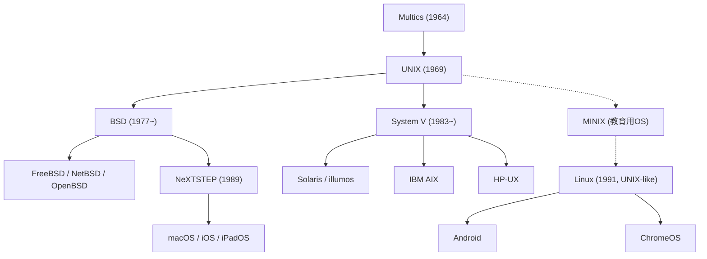

## はじめに：現代を動かす見えざる巨人

今日、私たちが手にしているスマートフォン、ウェブサイトをホストするクラウドサーバー、あるいは開発者が日常的に使用しているmacOS。これらすべては、1969年にアメリカのベル研究所（Bell Labs）で生まれたひとつのオペレーティングシステムに強固なルーツを持っています。その名も**「UNIX（ユニックス）」**です。

誕生から半世紀以上が経過した現在でも、UNIXの設計思想やアーキテクチャはIT業界の基盤として君臨し続けています。なぜ、一企業の研究所で生まれたシステムが、これほどまでに世界を席巻し、数々の技術的パラダイムシフトを乗り越えて長期にわたって生き残ることができたのでしょうか。

本記事では、UNIX誕生の前夜から、技術的な革新、その後の発展と分岐の歴史、そして現代のテクノロジー社会に与えた計り知れない影響について、プロフェッショナルな視点から詳細に紐解いていきます。

## 1. UNIX前夜：巨大プロジェクト「Multics」の挫折と教訓

UNIXの歴史を語る上で欠かせないのが、その前身とも言えるタイムシェアリングシステム（TSS）プロジェクト**「Multics（Multiplexed Information and Computing Service）」**です。

1960年代半ば、マサチューセッツ工科大学（MIT）、ゼネラル・エレクトリック（GE）、そしてAT&Tのベル研究所という3つの巨大組織が共同で、画期的なOSの開発に乗り出しました。当時のコンピュータはバッチ処理が主流で、一度に一つのプログラムしか実行できませんでした。Multicsは、複数のユーザーが同時にコンピュータにアクセスし、リソースを安全かつ効率的に共有できる、当時としては極めて高度で夢のようなシステムを目指していました。階層型ファイルシステムや動的リンクなど、後のOSに受け継がれる多くの概念がここで考案されました。

しかし、Multicsはあまりにも野心的すぎました。機能の豊富さとセキュリティを追求するあまり、システムの複雑さは限界を超え、開発は泥沼化して大幅に遅延。パフォーマンスも期待を大きく下回るものとなってしまいました。莫大な資金と時間を投資したものの、成果が見込めないと判断したベル研究所は、1969年にMulticsプロジェクトからの撤退を余儀なくされます。

## 2. 1969年：PDP-7と「スペース・トラベル」、そしてUNIXの誕生

Multicsプロジェクトからの撤退は、ベル研究所の研究員であった**ケン・トンプソン（Ken Thompson）**と**デニス・リッチー（Dennis Ritchie）**に大きな喪失感をもたらしました。彼らは、優れた開発環境と、OSを自らの手で創り上げるという情熱の行き場を失ってしまったのです。

当時トンプソンは、「スペース・トラベル（Space Travel）」という宇宙船の軌道をシミュレーションするゲームを開発していました。Multicsのインフラが使えなくなった彼は、研究所の片隅で埃を被っていた旧式のミニコンピュータ「PDP-7」にこのゲームを移植することを思いつきます。しかし、PDP-7には彼らが満足にプログラムを動かせるような、まともなオペレーティングシステムが存在しませんでした。

そこでトンプソンとリッチーは、Multicsの失敗から得た教訓を活かし、「小さく、シンプルで、クリーンな」独自のオペレーティングシステムを自らの手で書き上げ始めました。Multicsが「複雑で多機能（Multi）」であったことへの皮肉と反骨精神を込めて、同僚のブライアン・カーニハン（Brian Kernighan）は、この新しい「単機能でシンプルな（Uni）」システムを**「UNICS（Uniplexed Information and Computing System）」**と名付けました。これが後に綴りを変え、**「UNIX」**となったのです。1969年、まさに現代OSの歴史が幕を開けた瞬間でした。

## 3. C言語の誕生と「移植性（ポータビリティ）」の獲得

初期のUNIXは、PDP-7のアセンブリ言語で書かれていました。これはつまり、ハードウェアに完全に依存しており、他のアーキテクチャのコンピュータでUNIXを動かすためには、コードを一から書き直さなければならないことを意味していました。

この致命的な限界を突破するため、デニス・リッチーは1972年に**「C言語」**という新しい高級プログラミング言語を開発します。C言語は、ハードウェアを直接操作できる低水準な処理能力と、人間が読み書きしやすい高水準な抽象化を兼ね備えた、まさにOS記述のための言語でした。

1973年、トンプソンとリッチーはUNIXのカーネルの大半をC言語で完全に書き直すという、当時としては常識外れの偉業を成し遂げました。OSをアセンブリ言語ではなく高級言語で記述するということは、Cコンパイラさえ用意すれば、どのようなハードウェアアーキテクチャでもUNIXを容易に動かせることを意味しました。

この**「移植性（ポータビリティ）」**こそが、UNIXが爆発的に普及する最大の原動力となりました。メインフレームからミニコン、さらには後のマイクロプロセッサに至るまで、新しいハードウェアが登場するたびにUNIXは新しい環境へと移植され、ハードウェアベンダーに依存しない「オープンな標準OS」としての地位を確立していくことになります。1983年、トンプソンとリッチーはこの多大な功績により、計算機科学のノーベル賞と称される「チューリング賞」を受賞しました。

## 4. 時代を超越する「UNIX哲学（UNIX Philosophy）」

UNIXが長きにわたって愛され、今日のソフトウェアエンジニアリングにも深く影響を与え続けている最大の理由は、その根底に流れる**「UNIX哲学（UNIX Philosophy）」**と呼ばれる一貫したエレガントな設計思想にあります。

### 1. 「すべてはファイルである（Everything is a file）」
UNIXを象徴する最も有名で強力な概念です。テキストファイルやディレクトリはもちろん、ハードディスク、キーボード入力、ディスプレイ出力、ネットワークのソケット、さらにはメモリ空間に至るまで、すべての入出力デバイスやシステムリソースを「ファイル」という共通のインターフェースとして抽象化しました。これにより、プログラマーはデバイスごとの特殊なAPIを学ぶ必要がなく、通常のファイルの読み書きと同じ共通のシステムコール（`read`, `write`, `open`, `close`）で、あらゆるリソースを透過的に操作できるようになりました。

### 2. 「一つのことを、うまくやれ（Do one thing and do it well）」
複雑で巨大で多機能な（モナリシックな）プログラムを作るのではなく、単一の機能に特化した、シンプルで小さく、堅牢なプログラム（ツール）を作るべきだという思想です。`ls`, `grep`, `awk`, `sed`などのUNIXコマンドは、それぞれが極めて限定的な役割しか持ちませんが、その役割を完璧にこなします。

### 3. 「パイプによる連携（Pipes）」
1973年にダグラス・マキルロイ（Douglas McIlroy）の提案によって実装された「パイプ（`|`）」機能は、UNIX哲学の真骨頂です。あるプログラムの出力（標準出力）を、別のプログラムの入力（標準入力）として直接ストリームで繋ぐことを可能にしました。

```bash
cat access.log | awk '{print $1}' | sort | uniq -c | sort -nr
```

このように、シンプルで小さなツール群をレゴブロックのように自由自在に組み合わせて、複雑で高度なデータ処理を即座に構築できるという、比類なき柔軟性と表現力を持つコマンドライン環境が実現しました。この「パイプとフィルタ」のアーキテクチャは、現代のマイクロサービスアーキテクチャの先駆けとも言えます。

## 5. UNIXの枝分かれと「UNIX戦争（UNIX Wars）」

1970年代後半、独占禁止法によりコンピュータ市場への直接参入を禁じられていたAT&Tは、UNIXのソースコードを大学や研究機関に実費のみで（事実上無償で）配布しました。

このオープンな環境の中で、カリフォルニア大学バークレー校（UC Berkeley）の学生だったビル・ジョイ（Bill Joy、後のサン・マイクロシステムズ共同創業者）らが中心となり、UNIXカーネルの大幅な改良を行いました。彼らは仮想記憶システムや、インターネットの基盤技術となるTCP/IPネットワーキング機能を世界に先駆けてUNIXに統合し、**「BSD（Berkeley Software Distribution）」**としてリリースしました。BSD系UNIXは学術界や新興のワークステーション市場で圧倒的な支持を集めました。

一方、1980年代に入って反トラスト法訴訟の和解に伴いコンピュータビジネスへの参入が許可されたAT&Tは、UNIXの大きな商業的価値に気づき、方針を転換します。彼らはUNIXを商用化し、厳格なライセンスの下で**「System V（システム・ファイブ）」**として販売を開始しました。

こうして1980年代から90年代初頭にかけて、AT&T陣営の「System V」系（SunOSのちのSolaris、IBMのAIX、HPのHP-UXなど）と、バークレー陣営の「BSD」系による、UNIX標準化の主導権を巡る激しい覇権争い、通称**「UNIX戦争（UNIX Wars）」**が勃発します。

この激しい競争は、互換性の欠如と市場の分裂を引き起こし、ユーザーやソフトウェアベンダーに多大な混乱とコストをもたらしました。「UNIX戦争」の隙を突く形で、MicrosoftのWindows NTがエンタープライズ市場でシェアを伸ばす結果にもなりました。最終的には、IEEEによる「POSIX」規格や「Single UNIX Specification（SUS）」といった標準API規格が制定されることで、UNIX間の互換性は徐々に確保される方向へと向かいました。



## 6. オープンソースの波とLinuxの圧倒的台頭

1990年代に入ると、商用UNIXは企業のミッションクリティカルなサーバー市場を支配していましたが、ライセンスが高額でソースコードも非公開となっていました。時を同じくして、Intelのx86アーキテクチャを中心とする安価なPC（パーソナルコンピュータ）が爆発的に普及し始めます。PC上で手軽に、かつ自由に内部をいじれるUNIX環境が強く求められていました。

そんな中、1991年にフィンランドの大学生**リーナス・トーバルズ（Linus Torvalds）**が、386PC上で動作する独自開発のOSカーネル**「Linux（リナックス）」**をインターネット上で公開しました。

Linuxは、AT&TのUNIXソースコードを一切使用せずゼロから書かれていたため、著作権やライセンスの制約を受けない完全な別物でした。しかし、POSIX規格に準拠し、外側からはUNIXと全く同じように操作できる「UNIXクローン（UNIXライク）」OSとして設計されていました。

Linuxカーネルは、リチャード・ストールマン（Richard Stallman）率いるGNUプロジェクトが開発していたCコンパイラ（GCC）やシェル（bash）、各種コアツール群と完璧に組み合わさることで、完全な無償のUNIX互換オペレーティングシステム（GNU/Linux）として機能するようになりました。

インターネットを介した世界中のハッカーたちによるオープンソース型の共同開発モデルは、かつてのUNIX開発における「ハッカー文化」の再来でもありました。Linuxはまたたく間に進化し、エンタープライズ市場における商用UNIXのシェアを次々と奪っていきました。現在では、世界のWebサーバー、パブリッククラウドインフラ（AWS、Google Cloud、Azure）、世界トップ500のスーパーコンピュータの100%、そしてAndroidスマートフォンに至るまで、Linuxが圧倒的な支配力を誇っています。商用UNIXが担っていた役割の多くを、オープンソースであるLinuxが完全に引き継いだと言えるでしょう。

## 7. 現代に生きる「正統なUNIX」の血脈：macOSとiOS

Linuxが世界を席巻する一方で、AT&Tから派生した正統なUNIXの血脈（BSD系）も、決して途絶えることなく進化を続けています。その最も成功した例が、Appleのプラットフォームです。

1985年にスティーブ・ジョブズがAppleを追放されて設立したNeXT社は、次世代のオブジェクト指向OS「NeXTSTEP」を開発しました。このNeXTSTEPの基盤（Machカーネル）として採用されていたのが、BSD系のUNIX技術でした。

1996年、業績不振に陥っていたAppleは次世代OSの基盤を求めてNeXT社を買収し、スティーブ・ジョブズがAppleに復帰します。NeXTSTEPの高度な技術と美しいUIは、Mac OS X（現在のmacOS）のコアとして見事に統合されました。

現在のmacOSのコアOSである「Darwin」は、BSDをベースにした正真正銘のUNIXであり、標準化団体「The Open Group」から正式に「UNIX 03」の認証を受けています。そして、macOSから派生し、モバイル向けに最適化されたiOSによって動く何億台ものiPhoneやiPadもまた、UNIXの直系の子孫なのです。多くの開発者がMacを好んで使う理由は、その美しいハードウェアとUIの裏側に、堅牢で強力なUNIXのターミナル環境とコマンド体系がそのまま息づいているからに他なりません。

## おわりに：永遠の生命力を持つアーキテクチャ

1969年、ベル研究所の片隅で、たった二人の天才エンジニアが「自分たちが心地よくプログラムを書ける環境」を求めて生み出した小さなシステム。それがUNIXの始まりでした。

半世紀の間に、IT業界はメインフレームからPCへ、インターネットの普及、クラウドコンピューティング、そしてモバイルやAIへと、劇的なパラダイムシフトを何度も経験してきました。数え切れないほどの新しいハードウェアアーキテクチャやOSが生まれ、そして消え去っていきました。

しかし、「C言語によるポータビリティ」「すべてはファイルという抽象化」「シンプルなツール群のパイプ連携」というUNIXが提示した本質的で普遍的な設計アーキテクチャは、いかなる時代の変化にも耐えうる柔軟性を持っていました。

私たちがポケットに入れているスマートフォンから、世界中のAIやWebを動かす巨大なデータセンターまで、現代のデジタル社会の至る所に、ケン・トンプソンとデニス・リッチーが描いたUNIXの思想が脈々と息づいています。UNIXの歴史は、単なる古いソフトウェアの歴史ではありません。それは、現代のコンピューティングそのものの歴史であり、優れたソフトウェア設計が持つ「永遠の生命力」を見事に証明する、輝かしい金字塔なのです。
