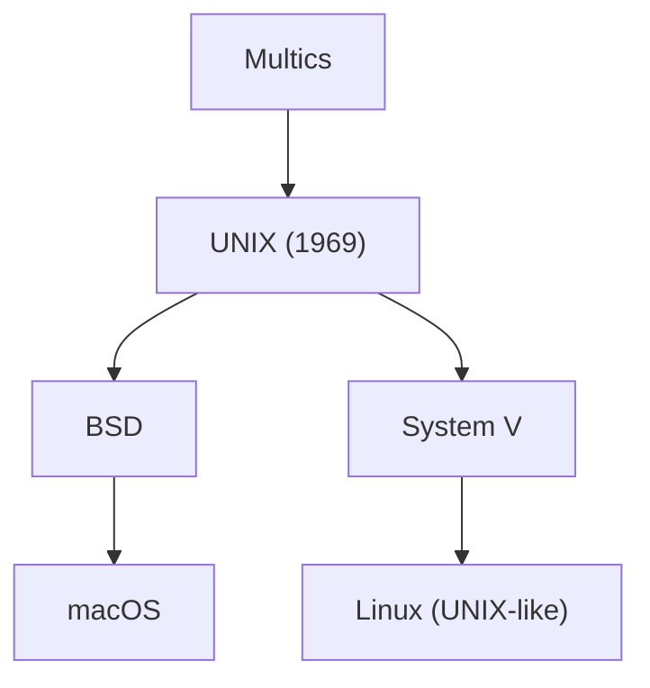

## はじめに
UNIXは、現代のオペレーティングシステムの基礎を築いた重要なソフトウェアです。

```mermaid
graph TD
    A["Multics"] --> B["UNIX (1969)"]
    B --> C["BSD"]
    B --> D["System V"]
    C --> E["macOS"]
    D --> F["Linux (UNIX-like)"]
```

## 設計思想
「すべてはファイルである」というシンプルな哲学が、UNIXの拡張性を支えています。

