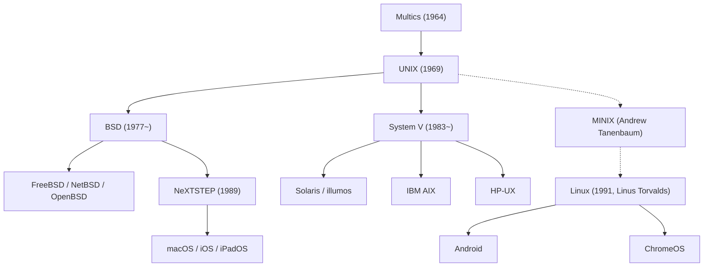

## Introdução: O Gigante Invisível que Move o Mundo Moderno

Cada smartphone em nossos bolsos, cada servidor na nuvem que processa o tráfego global da Internet e os computadores macOS utilizados por engenheiros de software têm uma linhagem arquitetônica direta: um sistema operacional nascido em 1969 nos Laboratórios Bell da AT&T: o **UNIX**.

Mais de meio século após a sua criação, a filosofia de design e a arquitetura do UNIX continuam reinando como o alicerce fundamental da tecnologia moderna. Como um sistema minimalista, construído por poucos engenheiros que buscavam apenas um ambiente agradável para programar, conseguiu atravessar sucessivas disrupções tecnológicas e dominar o mundo digital?

Este artigo examina a história detalhada do UNIX: desde as lições do fracasso do Multics e o surgimento no PDP-7, até a criação da linguagem C, a Filosofia UNIX, as Guerras do UNIX, a revolução do Linux e a linhagem direta preservada no macOS e no iOS.

## 1. Antes do UNIX: A Ambição e o Fracasso do Multics

A pré-história do UNIX tem início em meados dos anos 1960 com o projeto **Multics (Multiplexed Information and Computing Service)**. Naquela época, o processamento em lote (Batch Processing) era o padrão: os programadores entregavam caixas de cartões perfurados e aguardavam horas ou dias para receber listagens impressas.

Três gigantes uniram forças para construir o sistema operacional do futuro: o MIT, a General Electric (GE) e os Bell Labs da AT&T. O Multics pretendia fornecer computação como um serviço de utilidade pública (como água ou eletricidade), permitindo que centenas de usuários dividissem recursos simultaneamente com segurança avançada, sistema de arquivos hierárquico e ligação dinâmica.

Contudo, o Multics foi esmagado pela sua própria ambição. Ao tentar implementar todos os recursos de uma só vez, a complexidade saiu de controle, os prazos estouraram e o desempenho revelou-se inaceitável. Após investir milhões de dólares sem resultados práticos, a diretoria dos Bell Labs encerrou a sua participação no início de 1969.

## 2. 1969: Space Travel, o PDP-7 e o Surgimento do UNICS

A desistência do Multics causou enorme frustração em dois pesquisadores brilhantes dos Bell Labs: **Ken Thompson** e **Dennis Ritchie**. Acostumados à agilidade do ambiente interativo, eles se recusavam a retornar ao arcaico sistema de cartões perfurados.

Naquele período, Thompson havia desenvolvido um jogo de simulação de trajetórias orbitais chamado *"Space Travel"*. Sem acesso ao mainframe do Multics, ele encontrou um minicomputador **PDP-7** da DEC encostado e empoeirado em um canto do laboratório de Murray Hill. O PDP-7 era um equipamento extremamente modesto: tinha apenas 8.192 palavras de 18 bits de memória (cerca de 18 kilobytes) e não dispunha de um sistema operacional utilizável.

Para rodar seu jogo com fluidez, Thompson e Ritchie decidiram criar um sistema próprio do zero. Aplicando as lições do Multics, buscaram criar algo **radicalmente simples, enxuto e transparente**. Em poucas semanas de programação intensiva em assembly, implementaram o gerenciador de processos, um sistema de arquivos hierárquico e um interpretador de comandos.

Ao ver a elegância do novo sistema, o colega Brian Kernighan sugeriu de forma bem-humorada o nome **UNICS (Uniplexed Information and Computing System)**, satirizando a complexidade do Multics ("Uni" em contraste com "Multi"). Posteriormente, a grafia foi refinada para **UNIX**, marcando em 1969 o início da computação moderna.

## 3. A Invenção da Linguagem C e o Milagre da Portabilidade

As primeiras edições do UNIX foram programadas em linguagem assembly dos computadores PDP. Isso prendia o sistema àquela arquitetura física; executá-lo em outra máquina exigiria reprogramar todo o sistema do zero.

Para quebrar esse isolamento, Dennis Ritchie desenvolveu entre 1971 e 1973 a **linguagem C**. O C combinava a elegância estruturada das linguagens de alto nível com o controle de baixo nível sobre ponteiros e endereços de memória.

Em 1973, Thompson e Ritchie realizaram uma façanha que contrariou o consenso da época: **reescreveram praticamente todo o núcleo do UNIX em linguagem C**.

Até então, acreditava-se que sistemas operacionais deveriam ser feitos exclusivamente em assembly para manter alto desempenho. O UNIX provou o contrário: a leve perda de desempenho era irrelevante diante da revolucionária **portabilidade**. Bastava compilar o código em qualquer computador com um compilador C para que o UNIX funcionasse rapidamente. O UNIX desvinculou o software do hardware, tornando-se a primeira plataforma aberta universal. Em 1983, Ken Thompson e Dennis Ritchie receberam o prestigiado Prêmio Turing por essa conquista.

## 4. A Eterna Filosofia UNIX

O motivo da durabilidade do UNIX é a sua elegância conceitual, conhecida mundialmente como a **Filosofia UNIX**:

### 1. "Tudo é um arquivo" (Everything is a file)
O UNIX abstrai recursos físicos e lógicos (arquivos de texto, pastas, discos rígidos, teclado, tela e conexões de rede em sockets) como um fluxo contínuo de bytes. Os desenvolvedores manipulam dispositivos diversos através das mesmas chamadas de sistema básicas (`open`, `read`, `write`, `close`), sem precisar aprender APIs proprietárias para cada periférico.

### 2. "Faça apenas uma coisa, e faça bem" (Do one thing and do it well)
Em vez de programas monolíticos gigantescos, o UNIX prioriza utilitários pequenos e modulares. Comandos como `cat`, `grep`, `sort`, `uniq`, `awk` e `sed` desempenham funções específicas com altíssima eficiência e robustez.

### 3. "Pipes e Filtros" (Pipes)
Criado em 1973 por proposta de Douglas McIlroy, o **pipe (`|`)** permite direcionar a saída padrão (`stdout`) de um programa diretamente para a entrada padrão (`stdin`) de outro em streaming:

```bash
cat access.log | awk '{print $1}' | sort | uniq -c | sort -nr
```

Ao unir comandos enxutos como peças de Lego, os desenvolvedores montam tarefas complexas de filtragem e processamento em segundos. Essa estrutura antecipou os conceitos modernos de microsserviços e processamento reativo de fluxos de dados.

## 5. As Guerras do UNIX e a Padronização

No final dos anos 1970, sob um acordo antitruste judicial, a AT&T estava proibida de comercializar produtos fora das telecomunicações. Ela distribuía o código-fonte do UNIX para universidades quase sem custos comerciais.

Na Universidade da Califórnia em Berkeley, a equipe liderada por **Bill Joy** (posterior cofundador da Sun Microsystems) aprimorou o sistema, introduzindo memória virtual, o sistema de arquivos FFS e a primeira pilha TCP/IP integrada do mundo com a API de Sockets, lançando o **BSD (Berkeley Software Distribution)**.



Na década de 1980, após o fim das restrições legais, a AT&T percebeu o valor astronômico do UNIX, fechou os códigos e lançou o comercial **System V** com licenças caras e restritivas.

Iniciaram-se as intensas **"Guerras do UNIX" (UNIX Wars)**: o campo do System V (IBM AIX, HP-UX, Sun Solaris) e o campo do BSD travaram disputas ferozes. A fragmentação gerou insegurança no mercado e abriu espaço para o Windows NT da Microsoft nos negócios corporativos. Diante disso, a indústria estabeleceu normas comuns através do padrão **POSIX** do IEEE e da **Single UNIX Specification (SUS)**.

## 6. A Revolução do Código Aberto e o Triunfo do Linux

No início dos anos 1990, os sistemas UNIX comerciais estavam confinados a estações de trabalho de alto custo, longe do alcance de estudantes com PCs Intel 386.

Em agosto de 1991, o estudante finlandês **Linus Torvalds** anunciou na Internet o seu próprio núcleo de sistema operacional: o **Linux**.

O Linux foi criado do zero, sem código da AT&T, mas concebido como um clone totalmente compatível com UNIX e aderente ao padrão POSIX. Quando associado ao compilador GCC, ao interpretador bash e às ferramentas do **Projeto GNU** de Richard Stallman, surgiu um sistema completo e livre: o **GNU/Linux**.

Graças ao desenvolvimento aberto e colaborativo global via Internet, o Linux superou os antigos sistemas proprietários. Atualmente, o Linux domina:
- 100% dos 500 maiores supercomputadores do planeta.
- Mais de 90% das instâncias de computação em nuvem na AWS e Google Cloud.
- Os sistemas das principais bolsas de valores internacionais.
- Bilhões de dispositivos móveis através do sistema operacional Android.

## 7. O Legado Direto: macOS, iOS e o UNIX Certificado

Enquanto o Linux assumiu a liderança nos servidores, a linhagem direta do BSD encontrou a sua melhor tradução nos produtos da Apple.

Após sair da Apple em 1985, Steve Jobs fundou a NeXT e criou o **NeXTSTEP**, construído sobre o microkernel Mach e o 4.3BSD. Em 1996, com a compra da NeXT pela Apple, o NeXTSTEP tornou-se o coração do **Mac OS X** (atual **macOS**).

O núcleo Darwin do macOS descende diretamente do BSD e possui a certificação oficial **UNIX 03** concedida pelo The Open Group. Além disso, o iOS, iPadOS e watchOS compartilham dessa mesma fundação. Os engenheiros adoram o Mac porque ele une uma interface impecável à força incomparável de um terminal UNIX autêntico.

## Conclusão: Uma Arquitetura Imperecível

Em 1969, em uma sala discreta nos Bell Labs, Ken Thompson e Dennis Ritchie queriam apenas um ambiente agradável para programar.

Mais de cinquenta anos depois, centenas de sistemas operacionais e arquiteturas de hardware caíram no esquecimento. No entanto, as ideias trazidas pelo UNIX — portabilidade em C, tudo é um arquivo e ferramentas unidas por pipes — continuam mais vivas do que nunca.

Dos supercomputadores que alimentam a inteligência artificial ao smartphone no seu bolso, a mente e o espírito do UNIX continuam guiando cada avanço da civilização digital.
