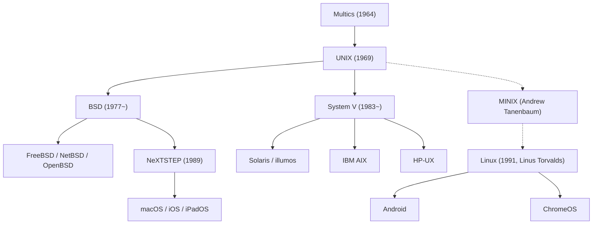

## Введение: Невидимый гигант цифровой цивилизации

Каждый смартфон в нашем кармане, каждый облачный сервер, обслуживающий мировой интернет-трафик, и рабочие станции macOS, столь любимые разработчиками программного обеспечения, ведут свою родословную от одной операционной системы, появившейся в 1969 году в лабораториях Bell Labs компании AT&T: **UNIX**.

Спустя более чем полвека после своего создания философия и архитектурные принципы UNIX остаются незыблемой основой современных информационных технологий. Каким образом компактная система, созданная в тихом кабинете горсткой инженеров лишь для того, чтобы «было удобно писать программы», смогла пережить все технологические эпохи и стать фундаментом цифрового мира?

В этой статье представлен детальный профессиональный разбор истории UNIX: от уроков проекта Multics и рождения на скромном PDP-7 до создания языка C, бессмертной философии UNIX, жестоких войн стандартов, триумфа Linux и прямого наследия в macOS и iOS.

## 1. Предыстория UNIX: Амбиции и провал проекта Multics

История UNIX неразрывно связана с проектом разделения времени (Time-Sharing) середины 1960-х годов под названием **Multics (Multiplexed Information and Computing Service)**. В те годы в вычислениях царила пакетная обработка данных: программисты сдавали колоды перфокарт операторам и ждали результатов распечатки часами или даже сутками.

Три гиганта объединили усилия для создания системы будущего: Массачусетский технологический институт (MIT), General Electric (GE) и Bell Labs. Multics задумывалась как коммунальная служба вычислений (подобно водопроводу или электричеству), позволяющая сотням пользователей одновременно взаимодействовать с ЭВМ через терминалы. Именно в Multics впервые были предложены иерархическая файловая система, динамическое связывание и многоуровневая система безопасности.

Однако Multics пала жертвой собственного масштаба. Стремление внедрить все мыслимые функции одновременно привело к неконтролируемому усложнению архитектуры. Разработка затянулась, бюджеты росли, а производительность оказалась крайне низкой. Потратив миллионы долларов без видимой отдачи, руководство Bell Labs в начале 1969 года приняло волевое решение выйти из проекта.

## 2. 1969 год: Space Travel, PDP-7 и рождение UNICS

Закрытие проекта Multics вызвало глубокое разочарование у ведущих исследователей лаборатории — **Кена Томпсона** и **Денниса Ритчи**. Почувствовав вкус интерактивного программирования, они категорически не хотели возвращаться в архаичную эпоху перфокарт.

В то время Томпсон написал игру под названием *"Space Travel"*, симулирующую гравитационные маневры космического корабля в Солнечной системе. Потеряв доступ к мейнфрейму Multics, он нашел в дальнем углу лаборатории в Мюррей-Хилл заброшенный и покрытый пылью мини-компьютер **PDP-7** компании DEC. Эта машина обладала скромнейшими ресурсами: всего 8 192 18-битных слова памяти (около 18 килобайт) и не имела удобной операционной системы.

Чтобы игра работала плавно, Томпсон и Ритчи решили создать операционную систему с нуля. Учтя горький опыт Multics, они стремились сделать её **предельно простой, компактной и прозрачной**. За считанные недели они написали на ассемблере диспетчер процессов, древовидную файловую систему и командную строку.

Наблюдая за их работой, коллега Брайан Керниган в шутку назвал новую систему **UNICS (Uniplexed Information and Computing System)**, обыгрывая громоздкость Multics («Uni» вместо «Multi»). Позднее название трансформировалось в **UNIX**. В 1969 году началась новая эпоха в истории вычислительной техники.

## 3. Создание языка C и революция переносимости (Portability)

Первые три редакции UNIX были написаны на ассемблере для конкретных процессоров PDP. Это означало жесткую привязку к физическому оборудованию: перенос системы на другой компьютер требовал ее полного переписывания.

Чтобы преодолеть эту аппаратную изоляцию, Деннис Ритчи в период с 1971 по 1973 год разработал новый язык программирования высокого уровня — **язык C**. Язык C гармонично сочетал в себе абстракции и структуры управления высокого уровня с возможностью прямого манипулирования указателями и ячейками памяти.

В 1973 году Томпсон и Ритчи совершили дерзкий поступок, бросивший вызов догмам компьютерных наук того времени: **они полностью переписали ядро UNIX на языке C**.

До этого считалось непреложным правилом, что операционные системы ради быстродействия должны создаваться исключительно на ассемблере. UNIX доказал обратное: незначительное снижение скорости работы полностью компенсировалось колоссальным преимуществом — **переносимостью**. Имея компилятор C, UNIX можно было перенести на любую новую аппаратную архитектуру за несколько месяцев. UNIX стал первой в истории машинно-независимой универсальной платформой. В 1983 году Кен Томпсон и Деннис Ритчи были удостоены премии Тьюринга за это фундаментальное достижение.

## 4. Неувядающая философия UNIX (UNIX Philosophy)

Непреходящее величие UNIX заключается в ее элегантных проектных принципах, известных как **философия UNIX**:

### 1. «Всё есть файл» (Everything is a file)
UNIX представляет все системные ресурсы (текстовые файлы, каталоги, жесткие диски, клавиатуру, вывод на экран и сетевые сокеты) в виде единого интерфейса байтового потока. Разработчики взаимодействуют с любым устройством через универсальные системные вызовы (`open`, `read`, `write`, `close`), не изучая специализированные фирменные API.

### 2. «Делай что-то одно, но делай это хорошо» (Do one thing and do it well)
Вместо монолитных громоздких программ UNIX поощряет создание компактных, узкоспециализированных утилит. Команды вроде `cat`, `grep`, `sort`, `uniq`, `awk` и `sed` выполняют строго определенную задачу с безупречной эффективностью и стабильностью.

### 3. «Конвейеры и фильтры» (Pipes)
Предложенный в 1973 году Дугласом Макилроем механизм **конвейера (`|`)** позволил напрямую передавать стандартный вывод (`stdout`) одной программы на стандартный ввод (`stdin`) другой в виде непрерывного потока:

```bash
cat access.log | awk '{print $1}' | sort | uniq -c | sort -nr
```

Соединяя небольшие утилиты подобно деталям конструктора, разработчики могут мгновенно создавать сложные цепочки обработки данных. Эта архитектура стала прямым предшественником современных микросервисов и потоковой обработки данных.

## 5. Раскол и «Войны UNIX» (UNIX Wars)

В конце 1970-х годов из-за антимонопольного соглашения компании AT&T было запрещено продавать программное обеспечение на коммерческом рынке. Поэтому AT&T передавала исходный код UNIX университетам и институтам практически бесплатно, взимая лишь плату за носители.

В Калифорнийском университете в Беркли аспирант **Билл Джой** (будущий сооснователь Sun Microsystems) и исследовательская группа CSRG внедрили в UNIX виртуальную память, быструю файловую систему FFS и первый в мире сетевой стек TCP/IP с интерфейсом сокетов, выпустив систему **BSD (Berkeley Software Distribution)**.



В 1980-х годах антимонопольные ограничения с AT&T были сняты. Осознав огромную ценность системы, корпорация закрыла исходный код и вывела на рынок коммерческую версию **System V** под дорогими лицензиями.

Это породило ожесточенные **«Войны UNIX» (UNIX Wars)**: лагерь System V (IBM AIX, HP-UX, Sun Solaris) и мир BSD вели бесконечные судебные баталии и споры вокруг стандартов. Разобщенность запутала заказчиков, дав корпорации Microsoft шанс захватить корпоративный рынок с системой Windows NT. В итоге индустрия пришла к консенсусу, приняв стандарты **POSIX** и **Single UNIX Specification (SUS)**.

## 6. Открытый исходный код и глобальный триумф Linux

К началу 1990-х годов коммерческие UNIX-системы оставались недоступны обычным энтузиастам из-за непомерной стоимости рабочих станций.

В августе 1991 года финский студент **Линус Торвальдс** опубликовал в Интернете созданное им независимое ядро: **Linux**.

Linux не содержал ни одной строки проприетарного кода AT&T, но был спроектирован как UNIX-подобная система в строгом соответствии со стандартами POSIX. Объединившись с компилятором GCC, оболочкой bash и системными утилитами **Проекта GNU** Ричарда Столлмана, это ядро образовало полноценную свободную операционную систему: **GNU/Linux**.

Благодаря коллективной разработке через Интернет Linux вытеснил старые коммерческие UNIX-системы. Сегодня Linux управляет:
- 100% из 500 мощнейших суперкомпьютеров планеты.
- Более чем 90% всех облачных серверов на AWS, Azure и Google Cloud.
- Ключевыми финансовыми биржами мира.
- Миллиардами мобильных устройств на базе Android.

## 7. Прямая родословная: macOS, iOS и сертифицированный UNIX

В то время как Linux завоевывал серверы, прямая ветвь BSD нашла идеальное воплощение в экосистеме Apple.

После ухода из Apple в 1985 году Стив Джобс основал компанию NeXT и создал систему **NeXTSTEP** на базе микроядра Mach и 4.3BSD. Когда Apple приобрела NeXT в 1996 году, NeXTSTEP легла в основу **Mac OS X** (ныне **macOS**).

Ядро Darwin в macOS является прямым потомком BSD и имеет официальный сертификат **UNIX 03** от The Open Group. Мобильные платформы iOS, iPadOS и watchOS работают на этом же ядре. Разработчики выбирают Mac именно потому, что он сочетает превосходный графический интерфейс с мощью нативного терминала настоящего UNIX.

## Заключение: Архитектура сквозь эпохи

В 1969 году в Bell Labs Кен Томпсон и Деннис Ритчи хотели лишь создать удобную среду для собственного творчества.

За полвека сменились десятки поколений процессоров и канули в лету сотни операционных систем. Однако идеи UNIX — переносимость на C, принцип «всё есть файл» и объединение инструментов через каналы — доказали свое абсолютное превосходство над временем.

От суперкомпьютеров, обучающих искусственный интеллект, до смартфона в наших руках — дух UNIX продолжает определять архитектуру мировой цивилизации.
