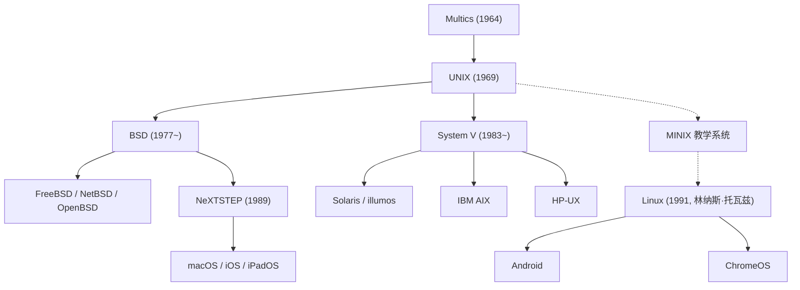

## 序言：驱动现代文明的隐形巨人

今天，无论是我们口袋里的智能手机、托管全球互联网流量的云端服务器，还是无数软件工程师桌上优雅的 macOS 开发工作站，其底层血脉无一例外都可以追溯到 1969 年在美国电话电报公司（AT&T）贝尔实验室诞生的传奇操作系统——**UNIX** 。

在诞生半个多世纪后的今天，UNIX 的架构思想与设计哲学依然稳坐全球信息技术的王者宝座。为何一个最初由几位研究员在实验室角落因“想舒服写程序”而捣鼓出的极简系统，能够历经数轮技术范式变革而不衰，并最终主宰现代数字世界？

本文将从专业视角全面复盘 UNIX 的发展史：Multics 项目的挫折与教训、PDP-7 上的破晓、C 语言的创造与操作系统的可移植性革命、被奉为经典的 UNIX 哲学、惊心动魄的 UNIX 战争、Linux 开源风暴的全面接管，以及延续至今的 macOS/iOS 正统血脉。

## 1. UNIX 前夜：雄心与挫折交织的 Multics 项目

探索 UNIX 的历史，必须回到 20 世纪 60 年代中期的一个划时代分时系统项目——**Multics（多路信息与计算服务）** 。当时的主流计算机依然采用批处理模式，程序员必须将穿孔卡片送入机房，等待数小时乃至数天才能拿到打印结果。

为了改变这一现状，麻省理工学院（MIT）、通用电气（GE）以及 AT&T 贝尔实验室三巨头强强联手，立项研发下一代分时操作系统 Multics。Multics 构想将计算资源变成像水和电一样的公共公用事业，允许多名用户同时通过终端交互使用计算机，并首次提出了层次化文件系统、动态链接以及多级环状安全保护机制。

然而，Multics 的野心超出了当时软硬件能力的极限。为了追求极致的多功能与严苛的安全防御，系统架构异常臃肿复杂，开发陷入了不可自拔的泥潭，工期一拖再拖，性能更是令人大失所望。在耗费巨额资金后，贝尔实验室管理层认为该项目毫无商业前景，于 1969 年初断然宣布撤出 Multics 项目。

## 2. 1969 年：太空旅行、PDP-7 与 UNICS 的诞生

撤出 Multics 项目让贝尔实验室的两位天才研究员——**肯·汤普森（Ken Thompson）** 与 **[丹尼斯·里奇](/p/biography-dennis-ritchie/)（Dennis Ritchie）** 陷入了极度沮丧。他们深知交互式分时系统带来的极致开发自由，再也不愿退回到原始低效的批处理打孔卡时代。

当时，肯·汤普森在 Multics 机器上用 Fortran 编写了一个名为《太空旅行》（Space Travel）的航天飞行动力学模拟游戏。随着 Multics 主机访问权限被收回，汤普森在贝尔实验室的库房角落里找到了一台闲置落灰的 DEC **PDP-7** 小型机。这台机器极其简陋，内存仅有 8,192 个 18 位字（约 18KB），并且缺乏任何可用的操作系统。

为了让《太空旅行》顺畅运行，汤普森和里奇决定吸取 Multics 失败的惨痛教训，亲自动手编写一个“极致小巧、简单且透明”的独立操作系统。他们仅用了数周时间，就手工用汇编语言实现了进程调度、分层文件系统以及命令行 Shell。

目睹这一精巧成果的同僚布莱恩·柯林汉（Brian Kernighan）打趣地将其命名为 **UNICS（单路信息与计算系统）** ，用来调侃 Multics 的臃肿庞杂（将“Multi”反讽为“Uni”）。后来，这个名字简化为了名垂青史的 **UNIX** 。1969 年，现代操作系统的序幕正式拉开。

## 3. C 语言的诞生与操作系统“可移植性”的奇迹

早期的 UNIX 内核（第 1 版至第 3 版）完全使用 PDP-7 和 PDP-11 的底层汇编语言编写。汇编语言与特定硬件架构深度绑定，这意味着只要换一台不同架构的计算机，整个操作系统就必须彻底重写。

为了冲破硬件锁定的铁锁，[丹尼斯·里奇](/p/biography-dennis-ritchie/)在 1971 至 1973 年间发明了一门全新的高级程序设计语言——**C 语言** 。C 语言融合了高级语言的结构化语法与低级语言对底层内存指针的精细操控能力。

1973 年，汤普森和里奇做出了一项震动整个计算机界的壮举： **用 C 语言彻底重写了整个 UNIX 内核** 。

在此之前，业界普遍认为操作系统由于对性能有极致要求，必须由汇编编写。而 UNIX 用事实证明，高级语言编写内核的微小性能损耗，在硬件性能日新月异的发展面前微不足道；更重要的是，它带来了震撼业界的 **“可移植性（Portability）”** 。只要在新机器上移植一个 C 编译器，UNIX 就能在极短时间内迁移运行。1983 年，汤普森和里奇因在操作系统理论与实现方面的开创性贡献，荣膺计算机领域最高荣誉——图灵奖。

## 4. 历久弥新的“UNIX 哲学”

UNIX 之所以能跨越半个世纪成为一代代程序员的精神图腾，关键在于其内核中蕴含的一套优雅而深邃的设计美学——**[UNIX 哲学](/p/philosophy-unix-modular-design/)** ：

### 1. “一切皆文件”（Everything is a file）
UNIX 将整个系统的硬件与逻辑资源高度抽象为统一的字节流（文件）。无论是文本配置、磁盘分区、键盘输入、屏幕终端，还是网络通信套接字，程序员都可以使用统一的标准系统调用（`open`, `read`, `write`, `close`）进行读写交互。这种终极抽象抹平了硬件差异，极大降低了编程的认知负荷。

### 2. “做好一件事”（Do one thing and do it well）
拒绝设计包罗万象的庞然大物，主张构建高度专注的小型工具。`cat`, `grep`, `sort`, `uniq`, `awk`, `sed` 等基础命令，每一个都只专注于极其狭窄明确的单一功能，并将其打磨到极致稳健。

### 3. “管道与过滤器”（Pipes）
1973 年由道格拉斯·麦克罗伊（Douglas McIlroy）提出的**管道（`|`）**机制，是 UNIX 设计理念的皇冠。它允许将一个程序的标准输出（stdout）无缝重定向为另一个程序的标准输入（stdin）：

```bash
cat access.log | awk '{print $1}' | sort | uniq -c | sort -nr
```

像搭乐高积木一样将微型工具串联起来，瞬间完成复杂的数据过滤与统计处理。这种“管道与过滤器”模式，正是几十年后现代微服务架构与响应式流计算的原型。

## 5. UNIX 的技术分裂与“UNIX 战争”

20 世纪 70 年代末，受制于反垄断和解协议，AT&T 被禁止直接涉足计算机商业市场。因此，AT&T 仅收取极低的介质成本，将 UNIX 源码几乎无偿分发给了各大高校与科研机构。

在加州大学伯克利分校，研究生 **比尔·乔伊（Bill Joy，后联合创办 Sun）** 带领 CSRG 团队对 UNIX 进行了大刀阔斧的革新，率先引入虚拟内存、快速文件系统（FFS）以及影响深远的 TCP/IP 网络协议栈与套接字（Sockets API），推出了著名的 **BSD（伯克利软件发行版）** 。BSD 迅速成为学术界与图形工作站的首选操作系统。



进入 20 世纪 80 年代，随着反垄断禁令解除，AT&T 意识到了 UNIX 蕴藏的巨大商业价值，收回了开源许可，推出了昂贵且闭源的 **System V** 商业版本。

由此，业界爆发了旷日持久的 **“UNIX 战争”（UNIX Wars）** ：AT&T 的 System V 阵营（IBM AIX, HP-UX, Sun Solaris）与加州大学的 BSD 阵营展开了残酷的互诉与标准撕扯。长期的分裂和兼容性内耗重创了生态，给微软的 Windows NT 渗透企业级市场留下了巨大契机。最终，在 IEEE 制定的 **POSIX** 与国际开放群组的 **Single UNIX Specification (SUS)** 规范推动下，UNIX 标准才逐渐实现 API 层的形式统一。

## 6. 开源浪潮与 Linux 的全面统治

到了 20 世纪 90 年代初，商业 UNIX 盘踞在昂贵的小型机与工作站上，高昂的授权费用让拥有个人 PC 的普通爱好者望而却步。

1991 年 8 月，芬兰赫尔辛基大学学生 **林纳斯·托瓦兹（Linus Torvalds）** 在 Intel 386 PC 上开发出了一个全新的操作系统内核——**Linux** 。

Linux 不含任何 AT&T 专有代码，完全基于 POSIX 规范以“类 UNIX（UNIX-like）”方式从零构建。结合理查德·斯托曼（Richard Stallman）创办的 **GNU 项目** 所贡献的 GCC 编译器、bash shell 和核心工具集，一个完全免费、自由开放的操作系统 **GNU/Linux** 诞生了。

借助全球互联网的黑客协作，Linux 展现出了令人惊骇的进化速度，并在企业级市场彻底取代了昂贵的商业 UNIX。今天，Linux 统治了：
- 全球超级计算机 Top 500 的 100%；
- AWS、Google Cloud 等公有云 90% 以上的计算实例；
- 全球各大顶级证券交易所的交易撮合引擎；
- 通过 Android 驱动着全球数十亿台智能移动终端。

## 7. 现代延续的“正统血统”：macOS 与 iOS

当 Linux 席卷服务器与云端时，源自 BSD 的正统 UNIX 血脉在消费电子领域找到了最完美的归宿——苹果公司的操作系统生态。

1985 年[史蒂夫·乔布斯](/p/biography-steve-jobs/)离开苹果创立 NeXT 公司，开发了基于 Mach 微内核与 4.3BSD 的 **NeXTSTEP** 操作系统。1996 年苹果收购 NeXT，乔布斯重掌苹果帅印，NeXTSTEP 成为了 **Mac OS X** （现 **macOS** ）的核心基石。

macOS 的底层内核 Darwin 拥有纯正的 BSD 血脉，且获得了 The Open Group 颁发的最高级别 **UNIX 03 官方认证** 。从 macOS 衍生出来的 iOS、iPadOS 同样运行在这一高度优化的内核之上。广大工程师之所以钟爱 Mac 进行软件开发，正是因为其兼备优雅视网膜 UI 与原汁原味的原生 UNIX 终端命令体系。

## 结语：超越时代的永恒架构

1969 年，在贝尔实验室昏暗的走廊里，肯·汤普森与[丹尼斯·里奇](/p/biography-dennis-ritchie/)只想搭建一个能够自由编写程序的干净角落。

半个多世纪以来，硬件形态从几吨重的机柜演进到纳米级芯片，操作系统与商业巨头如过眼云烟。然而，UNIX 所奠定的“C语言可移植性”、“一切皆文件”以及“管道组合小工具”的架构哲学，展现出了近乎神圣的永恒生命力。

从口袋里的移动设备到运行大语言模型训练的超级算力集群，UNIX 的思想血液无处不在。这不仅是一部操作系统的发展史，更是一座属于全人类软件工程的崇高丰碑。
