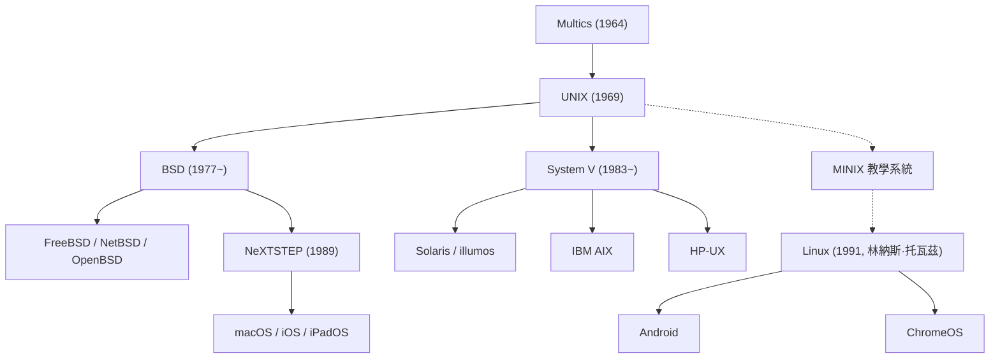

## 序言：驅動現代文明的隱形巨人

今天，無論是我們口袋裡的智慧型手機、託管全球網際網路流量的雲端伺服器，還是無數軟體工程師桌上優雅的 macOS 開發工作站，其底層血脈無一例外都可以追溯到 1969 年在美國電話電報公司（AT&T）貝爾實驗室誕生的傳奇作業系統——**UNIX** 。

在誕生半個多世紀後的今天，UNIX 的架構思想與設計哲學依然穩坐全球資訊技術的王者寶座。為何一個最初由幾位研究員在實驗室角落因「想舒服寫程式」而搗鼓出的極簡系統，能夠歷經數輪技術範式變革而不衰，並最終主宰現代數位世界？

本文將從專業視角全面復盤 UNIX 的發展史：Multics 專案的挫折與教訓、PDP-7 上的破曉、C 語言的創造與作業系統的可移植性革命、被奉為經典的 UNIX 哲學、驚心動魄的 UNIX 戰爭、Linux 開源風暴的全面接管，以及延續至今的 macOS/iOS 正統血脈。

## 1. UNIX 前夜：雄心與挫折交織的 Multics 專案

探索 UNIX 的歷史，必須回到 20 世紀 60 年代中期的一個劃時代分時系統專案——**Multics（多路資訊與計算服務）** 。當時的主流電腦依然採用批次處理模式，程式設計師必須將打孔卡送入機房，等待數小時乃至數天才能拿到列印結果。

為了改變這一現狀，麻省理工學院（MIT）、奇異公司（GE）以及 AT&T 貝爾實驗室三巨頭強強聯手，立項研發下一代分時作業系統 Multics。Multics 構想將計算資源變成像水和電一樣的公共公用事業，允許多名使用者同時透過終端機互動使用電腦，並首次提出了階層化檔案系統、動態連結以及多級環狀安全保護機制。

然而，Multics 的野心超出了當時軟硬體能力的極限。為了追求極致的多功能與嚴苛的安全防禦，系統架構異常臃腫複雜，開發陷入了不可自拔的泥潭，工期一拖再拖，效能更是令人大失所望。在耗費巨額資金後，貝爾實驗室管理層認為該專案毫無商業前景，於 1969 年初斷然宣布撤出 Multics 專案。

## 2. 1969 年：太空旅行、PDP-7 與 UNICS 的誕生

撤出 Multics 專案讓貝爾實驗室的兩位天才研究員——**肯·湯普森（Ken Thompson）** 與 **[丹尼斯·里奇](/p/biography-dennis-ritchie/)（Dennis Ritchie）** 陷入了極度沮喪。他們深知互動式分時系統帶來的極致開發自由，再也不願退回到原始低效的批次處理打孔卡時代。

當時，肯·湯普森在 Multics 機器上用 Fortran 編寫了一個名為《太空旅行》（Space Travel）的航太飛行動力學模擬遊戲。隨著 Multics 主機存取權限被收回，湯普森在貝爾實驗室的庫房角落裡找到了一台閒置落灰的 DEC **PDP-7** 迷你電腦。這台機器極其簡陋，記憶體僅有 8,192 個 18 位元字（約 18KB），並且缺乏任何可用的作業系統。

為了讓《太空旅行》順暢運行，湯普森和里奇決定吸取 Multics 失敗的慘痛教訓，親自動手編寫一個「極致小巧、簡單且透明」的獨立作業系統。他們僅用了數週時間，就手工用組合語言實現了行程排程、階層式檔案系統以及命令列 Shell。

目睹這一精巧成果的同僚布萊恩·柯林漢（Brian Kernighan）打趣地將其命名為 **UNICS（單路資訊與計算系統）** ，用來調侃 Multics 的臃腫龐雜（將「Multi」反諷為「Uni」）。後來，這個名字簡化為了名垂青史的 **UNIX** 。1969 年，現代作業系統的序幕正式拉開。

## 3. C 語言的誕生與作業系統「可移植性」的奇蹟

早期的 UNIX 核心（第 1 版至第 3 版）完全使用 PDP-7 和 PDP-11 的底層組合語言編寫。組合語言與特定硬體架構深度綁定，這意味著只要換一台不同架構的電腦，整個作業系統就必須徹底重寫。

為了衝破硬體鎖定的鐵鎖，[丹尼斯·里奇](/p/biography-dennis-ritchie/)在 1971 至 1973 年間發明了一門全新的高階程式設計語言——**C 語言** 。C 語言融合了高階語言的結構化語法與低階語言對底層記憶體指標的精細操控能力。

1973 年，湯普森和里奇做出了一項震動整個電腦界的壯舉： **用 C 語言徹底重寫了整個 UNIX 核心** 。

在此之前，業界普遍認為作業系統由於對效能有極致要求，必須由組合語言編寫。而 UNIX 用事實證明，高階語言編寫核心的微小效能損耗，在硬體效能日新月異的發展面前微不足道；更重要的是，它帶來了震撼業界的 **「可移植性（Portability）」** 。只要在新機器上移植一個 C 編譯器，UNIX 就能在極短時間內遷移運行。1983 年，湯普森和里奇因在作業系統理論與實現方面的開創性貢獻，榮膺電腦領域最高榮譽——圖靈獎。

## 4. 歷久彌新的「UNIX 哲學」

UNIX 之所以能跨越半個世紀成為一代代工程師的精神圖騰，關鍵在於其核心中蘊含的一套優雅而深邃的設計美學——**[UNIX 哲學](/p/philosophy-unix-modular-design/)** ：

### 1. 「一切皆檔案」（Everything is a file）
UNIX 將整個系統的硬體與邏輯資源高度抽象為統一的位元組流（檔案）。無論是文字設定檔、磁碟分割區、鍵盤輸入、螢幕終端機，還是網路通訊通訊端，程式設計師都可以使用統一的標準系統呼叫（`open`, `read`, `write`, `close`）進行讀寫互動。這種終極抽象抹平了硬體差異，極大降低了編程的認知負荷。

### 2. 「做好一件事」（Do one thing and do it well）
拒絕設計包羅萬象的龐然大物，主張構建高度專注的小型工具。`cat`, `grep`, `sort`, `uniq`, `awk`, `sed` 等基礎指令，每一個都只專注於極其狹窄明確的單一功能，並將其打磨到極致穩健。

### 3. 「管線與過濾器」（Pipes）
1973 年由道格拉斯·麥克羅伊（Douglas McIlroy）提出的**管線（`|`）**機制，是 UNIX 設計理念的皇冠。它允許將一個程式的標準輸出（stdout）無縫重定向為另一個程式的標準輸入（stdin）：

```bash
cat access.log | awk '{print $1}' | sort | uniq -c | sort -nr
```

像搭樂高積木一樣將微型工具串聯起來，瞬間完成複雜的資料過濾與統計處理。這種「管線與過濾器」模式，正是幾十年後現代微服務架構與響應式流計算的原型。

## 5. UNIX 的技術分裂與「UNIX 戰爭」

20 世紀 70 年代末，受制於反壟斷和解協議，AT&T 被禁止直接涉足電腦商業市場。因此，AT&T 僅收取極低的介質成本，將 UNIX 原始碼幾乎無償分發給了各大高校與科研機構。

在加州大學柏克萊分校，研究生 **比爾·喬伊（Bill Joy，後聯合創辦 Sun）** 帶領 CSRG 團隊對 UNIX 進行了大刀闊斧的革新，率先引入虛擬記憶體、快速檔案系統（FFS）以及影響深遠的 TCP/IP 網路協定堆疊與通訊端（Sockets API），推出了著名的 **BSD（柏克萊軟體發行版）** 。BSD 迅速成為學術界與圖形工作站的首選作業系統。



進入 20 世紀 80 年代，隨著反壟斷禁令解除，AT&T 意識到了 UNIX 蘊藏的巨大商業價值，收回了開源許可，推出了昂貴且閉源的 **System V** 商業版本。

由此，業界爆發了曠日持久的 **「UNIX 戰爭」（UNIX Wars）** ：AT&T 的 System V 陣營（IBM AIX, HP-UX, Sun Solaris）與加州大學的 BSD 陣營展開了殘酷的互訴與標準撕扯。長期的分裂和相容性內耗重創了生態，給微軟的 Windows NT 滲透企業級市場留下了巨大契機。最終，在 IEEE 制定的 **POSIX** 與國際開放群組的 **Single UNIX Specification (SUS)** 規範推動下，UNIX 標準才逐漸實現 API 層的形式統一。

## 6. 開源浪潮與 Linux 的全面統治

到了 20 世紀 90 年代初，商業 UNIX 盤踞在昂貴的小型機與工作站上，高昂的授權費用讓擁有個人 PC 的普通愛好者望而卻步。

1991 年 8 月，芬蘭赫爾辛基大學學生 **林納斯·托瓦茲（Linus Torvalds）** 在 Intel 386 PC 上開發出了一個全新的作業系統核心——**Linux** 。

Linux 不含任何 AT&T 專有程式碼，完全基於 POSIX 規範以「類 UNIX（UNIX-like）」方式從零構建。結合理查·斯托曼（Richard Stallman）創辦的 **GNU 專案** 所貢獻的 GCC 編譯器、bash shell 和核心工具集，一個完全免費、自由開放的作業系統 **GNU/Linux** 誕生了。

借助全球網際網路的駭客協作，Linux 展現出了令人驚駭的進化速度，並在企業級市場徹底取代了昂貴的商業 UNIX。今天，Linux 統治了：
- 全球超級電腦 Top 500 的 100%；
- AWS、Google Cloud 等公有雲 90% 以上的計算執行個體；
- 全球各大頂級證券交易所的交易撮合引擎；
- 透過 Android 驅動著全球數十億台智慧行動終端。

## 7. 現代延續的「正統血統」：macOS 與 iOS

當 Linux 席捲伺服器與雲端時，源自 BSD 的正統 UNIX 血脈在消費電子領域找到了最完美的歸宿——蘋果公司的作業系統生態。

1985 年[史蒂夫·賈伯斯](/p/biography-steve-jobs/)離開蘋果創立 NeXT 公司，開發了基於 Mach 微核心與 4.3BSD 的 **NeXTSTEP** 作業系統。1996 年蘋果收購 NeXT，賈伯斯重掌蘋果帥印，NeXTSTEP 成為了 **Mac OS X** （現 **macOS** ）的核心基石。

macOS 的底層核心 Darwin 擁有純正的 BSD 血脈，且獲得了 The Open Group 頒發的最高級別 **UNIX 03 官方認證** 。從 macOS 衍生出來的 iOS、iPadOS 同樣運行在這一高度最佳化的核心之上。廣大工程師之所以鍾愛 Mac 進行軟體開發，正是因為其兼備優雅視網膜 UI 與原汁原味的原生 UNIX 終端機命令體系。

## 結語：超越時代的永恆架構

1969 年，在貝爾實驗室昏暗的走廊裡，肯·湯普森與[丹尼斯·里奇](/p/biography-dennis-ritchie/)只想搭建一個能夠自由編寫程式的乾淨角落。

半個多世紀以來，硬體形態從幾噸重的機櫃演進到奈米級晶片，作業系統與商業巨頭如過眼雲煙。然而，UNIX 所奠定的「C語言可移植性」、「一切皆檔案」以及「管線組合小工具」的架構哲學，展現出了近乎神聖的永恆生命力。

從口袋裡的行動裝置到運行大語言模型訓練的超級算力叢集，UNIX 的思想血液無處不在。這不僅是一部作業系統的發展史，更是一座屬於全人類軟體工程的崇高豐碑。
