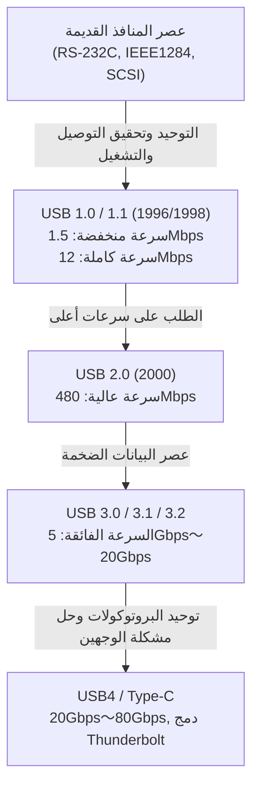

# تاريخ USB: لماذا تطور من منافذ ذات وجهين إلى USB-C

## 1. مقدمة: الفوضى التي جلبتها المنافذ القديمة ومعاناة المستخدمين

قبل ظهور "USB (Universal Serial Bus)" الذي نستخدمه اليوم كأمر مسلم به، كان الجزء الخلفي من أجهزة الكمبيوتر الشخصية في أواخر الثمانينيات وأوائل التسعينيات فوضى عارمة. وعلى عكس الواجهات الأنيقة التي نراها في أجهزة الكمبيوتر وMac الحديثة، كانت هناك مجموعة متنوعة من المنافذ المتزاحمة، مما أدى إلى ارتباك المستخدمين لدرجة لا يمكن تخيلها من المظهر الخارجي الأنيق.

### حدود المنافذ التسلسلية والمتوازية
من أبرز الواجهات في ذلك الوقت "المنفذ التسلسلي (RS-232C)". كان يُستخدم بشكل أساسي لتوصيل أجهزة المودم والماوس. كانت سرعة الاتصال بطيئة جداً، حيث تراوحت السرعات الأولية بين بضعة كيلوبت وعشرات الكيلوبتات في الثانية (kbps). كما كانت الإعدادات معقدة للغاية، حيث اضطر المستخدمون غالباً لضبط التفاصيل الدقيقة لبروتوكولات الاتصال يدوياً، مثل معدل البود (baud rate)، بتات التوقف (stop bits)، وبتات التكافؤ (parity bits) في نظام التشغيل أو البرنامج.

من ناحية أخرى، تم استخدام "المنفذ المتوازي (مثل IEEE 1284)" لتوصيل الطابعات والماسحات الضوئية. نشأ هذا المنفذ من معيار Centronics وكان يرسل بتات متعددة في نفس الوقت، مما جعله أسرع من المنفذ التسلسلي، لكن الكابلات كانت سميكة وثقيلة ويصعب التعامل معها. علاوة على ذلك، كان الموصل نفسه ضخماً، واحتل مساحة كبيرة في المساحة المحدودة خلف جهاز الكمبيوتر.

### جدار منافذ PS/2 و SCSI
كواجهة إدخال، كان هناك منفذ "PS/2". جاء الاسم من استخدامه في أجهزة Personal System/2 من شركة IBM، وتم توفيره في نسختين: واحدة للوحة المفاتيح (بنفسجي) وأخرى للماوس (أخضر). كان العيب الأكبر أنه لا يدعم "التبديل السريع (Hot Swap)". أي أنه إذا تم فصل الماوس وتوصيله بينما كان جهاز الكمبيوتر قيد التشغيل، فلن يتم التعرف عليه، وفي أسوأ الحالات، كان هناك خطر احتراق وحدة التحكم في اللوحة الأم مادياً.

إضافة إلى ذلك، تم استخدام "SCSI (Small Computer System Interface)" لمحركات الأقراص الصلبة الخارجية، والماسحات الضوئية عالية الأداء، ومحركات الأقراص MO التي تتطلب نقل بيانات عالي السرعة. ورغم أن SCSI كان عالي الأداء، إلا أنه تطلب معرفة متخصصة مثل التوصيل المادي لـ "جهاز الإنهاء (Terminator)" عند استخدام توصيل متسلسل (Daisy chain)، وتعيين "معرف SCSI (SCSI ID)" غير مكرر لكل جهاز. لقد كان معياراً صارماً حيث يمكن لخطأ واحد في الإعداد أن يؤدي إلى تجميد النظام بالكامل.

وهكذا، كان لكل جهاز طرفي شكل موصل مختلف، وكانت الإعدادات معقدة، وكانت المشاكل الناجمة عن تعارض طلبات المقاطعة (IRQ)، الوصول المباشر للذاكرة (DMA)، وعناوين الإدخال والإخراج (I/O) تحدث بشكل يومي. ففي كل مرة يشتري فيها المستخدم جهازاً جديداً، كان يضطر إلى قراءة كتيبات الإرشادات السميكة، وفي بعض الأحيان، فتح غطاء الكمبيوتر لاستخدام ملقط لتعديل دبابيس التوصيل (Jumper pins) على بطاقات التوسعة - وهي معاناة لا يمكن تصورها في الوقت الحاضر.

## 2. تحقيق حلم "التوصيل والتشغيل" وولادة USB 1.0

للتغلب على هذا الوضع المزري وخلق عالم حيث يمكن للجميع توسيع أجهزة الكمبيوتر الخاصة بهم بسهولة، نهض عمالقة صناعة تكنولوجيا المعلومات. بناءً على فكرة فريق يقوده أجاي بهات (Ajay Bhatt) من شركة Intel، اجتمعت 7 شركات: Compaq، Microsoft، IBM، DEC، Nortel، و NEC، وشكلوا مجموعة صياغة المعايير التي أصبحت سلفاً لمنتدى منفذي USB (USB-IF). وفي عام 1996، تم الإعلان رسمياً عن معيار "USB 1.0".

### المعنى الحقيقي لـ "العالمي (Universal)" الذي طمحوا إليه
الهدف الأكبر لـ USB، كما يوحي اسم "Universal" (عالمي/شامل)، كان توحيد جميع الأجهزة الطرفية تحت معيار واحد وشكل موصل واحد. وكان التركيز الأكبر على تحقيق "التوصيل والتشغيل (Plug and Play)" و"التبديل السريع (Hot Swap)". يمكن للمستخدمين توصيل الكابلات وفصلها بحرية أثناء تشغيل جهاز الكمبيوتر، وسيقوم نظام التشغيل تلقائياً بالتعرف على الجهاز وتثبيت برنامج التشغيل. لن يضطر المستخدم إلى القلق بشأن أية إعدادات معقدة. كانت هذه هي الرؤية النهائية لـ USB.

### مواصفات USB 1.0/1.1 وعقبة الانتشار واسع النطاق
في USB 1.0، تم تحديد وضعين لسرعة الاتصال:
* **سرعة منخفضة (Low-Speed - 1.5 Mbps)**: مخصص بشكل أساسي للأجهزة ذات معدل نقل البيانات المنخفض والتي لا يعتبر فيها التأخير أمراً بالغ الأهمية، مثل لوحات المفاتيح والماوس.
* **سرعة كاملة (Full-Speed - 12 Mbps)**: مخصص للطابعات، وحدات التخزين الخارجية، معدات الصوت، وغيرها.

من منظور اليوم، تعتبر "12 ميجابت في الثانية" سرعة بطيئة بشكل لا يصدق (يمكن إرسال حوالي 1.5 ميجابايت فقط في الثانية)، ولكنها كانت كافية لاستبدال المنافذ التسلسلية في ذلك الوقت (مثل 115.2 كيلوبت في الثانية). كما تبنى بنية ثورية سمحت بتوصيل ما يصل إلى 127 جهازاً في هيكل شجري.

ومع ذلك، لم يكن USB 1.0 سلسًا تماماً بعد الإعلان عنه. لم تدعم الإصدارات الأولى من Windows 95 الـ USB بشكل أصلي، ورغم إضافة الدعم في إصدار OSR2.1 لاحقاً، إلا أن العملية كانت غير مستقرة، لدرجة أنه سخر منها واطلق عليها "التوصيل والصلاة" بدلاً من "التوصيل والتشغيل".

### قرار Apple: الاختراق الذي أحدثه جهاز iMac
كان الحدث الحاسم الذي جعل USB ينتشر بشكل حقيقي في جميع أنحاء العالم هو إصدار Windows 98 في عام 1998 (والذي شهد تحسينات كبيرة في دعم USB)، وقبل كل شيء، إصدار "iMac" الأول (Bondi Blue) من Apple في نفس العام.

بقيادة ستيف جوبز، اتخذت شركة Apple خطوة جذرية بالتخلص من محرك الأقراص المرنة بالإضافة إلى جميع الواجهات القديمة التي كانت مستخدمة في أجهزة Macintosh، مثل ADB (Apple Desktop Bus)، والمنافذ التسلسلية، ومنافذ SCSI، وقررت قصر منافذ التوسعة الخارجية على "USB فقط".
في ذلك الوقت، كان هناك عدد قليل جداً من الأجهزة الطرفية المتوافقة مع USB في السوق، لذلك تعرض هذا القرار لانتقادات لاذعة من الصناعة. ومع ذلك، عندما حقق iMac نجاحاً هائلاً عالمياً، حولت شركات الأجهزة الطرفية اهتمامها نحو تطوير منتجات متوافقة مع USB من أجل البقاء. ونتيجة لذلك، يُعتقد أن قرار Apple القوي سرّع من انتشار USB لعدة سنوات. في نفس العام، تم إصدار "USB 1.1" الذي تضمن إصلاحات للأخطاء وتحسينات في التوافق، مما رسخ أسس المعيار.

## 3. ثورة السرعة والعصر الذهبي: سيطرة USB 2.0

يعد "USB 2.0" الذي تم الإعلان عنه في أبريل عام 2000، أحد أكبر الإنجازات في تاريخ USB، وهو المعيار العظيم الذي لا يزال يستخدم على نطاق واسع وأطول فترة حتى يومنا هذا.

تم رفع سرعة الاتصال القصوى إلى "سرعة عالية (High-Speed - 480 Mbps)"، محققاً تطوراً دراماتيكياً بلغ 40 ضعفاً مقارنة بالسرعة الكاملة لـ USB 1.1 (12 Mbps). لم تكن هذه الزيادة في السرعة مجرد تلاعب بالأرقام في المواصفات، بل كانت تمتلك القدرة على تغيير حياتنا الرقمية من جذورها.

### الاستخدام العملي للأجهزة ذات السعة الكبيرة
بفضل الحصول على عرض نطاق ترددي يبلغ 480 ميجابت في الثانية، أصبحت الأجهزة ذات السعات الكبيرة، والتي كانت غير واقعية عبر اتصال USB، ممكنة وقابلة للاستخدام العملي واحدة تلو الأخرى.
أصبحت الأقراص الصلبة الخارجية، محركات الأقراص CD-R/RW و DVD، نقل البيانات من الكاميرات الرقمية عالية الجودة التي تبلغ دقتها عدة ميجابكسل، وحتى مستقبلات التلفزيون وواجهات الصوت عالية الجودة، تعمل جميعها بسلاسة عبر منفذ USB. وكان الانتشار الهائل لـ "ذاكرة USB (الفلاش درايف)" بشكل خاص سبباً في جعل الوسائط القابلة للإزالة القديمة، مثل الأقراص المرنة وأقراص MO، شيئاً من الماضي تماماً.

علاوة على ذلك، حافظ USB 2.0 على توافق خلفي كامل، وهو تصميم ممتاز سمح للأجهزة التي تدعم USB 1.1 بالعمل دون أي تعديل. في هذه الفترة، تجاوز USB عالم الكمبيوتر ليتم دمجه في أجهزة التلفزيون، ومسجلات DVD/BD، وأجهزة الألعاب المنزلية، وأنظمة الملاحة في السيارات، وغيرها من الأجهزة الإلكترونية بشتى أنواعها، مرسخاً مكانته كـ "معيار عالمي حقيقي".

## 4. فوضى المعايير ومأساة الموصلات: ظهور عصر الأجهزة المحمولة و Micro-B

مع نجاح USB 2.0، بدا وكأن حلم ربط جميع الأجهزة عبر USB قد تحقق. ومع ذلك، فإن الموجة الجديدة نحو تصغير وتخفيف الأجهزة المحمولة (مثل الهواتف المحمولة، والكاميرات الرقمية، ومشغلات MP3) قد جلبت مشاكل خطيرة لشكل موصل USB.

### توزيع الأدوار بين Type-A و Type-B
في فلسفة التصميم الأصلية لـ USB، كانت هناك قاعدة صارمة بأن الجانب المضيف (الذي يتحكم، مثل الكمبيوتر) يستخدم موصل "Type-A (مستطيل مسطح)"، بينما الجانب الجهاز (الذي يتم التحكم فيه، مثل الطابعة أو الماسح الضوئي) يستخدم موصل "Type-B (شكل أقرب للمربع)". منع هذا فعلياً المستخدمين من توصيل جهازي كمبيوتر معاً عن طريق الخطأ، مما قد يتسبب في حدوث تماس كهربائي أو أعطال.

### فوضى الموصلات المصغرة
ومع ذلك، بينما كان موصل Type-B مناسباً للأجهزة الكبيرة مثل الطابعات، فقد كان كبيراً جداً بحيث لا يمكن تركيبه في الهواتف المحمولة والكاميرات الرقمية الرفيعة. وبالتالي، في محاولة للتصغير، تم توحيد "Mini-A" و "Mini-B". انتشر Mini-B بشكل خاص على نطاق واسع في الكاميرات الرقمية ومحركات الأقراص الصلبة المحمولة المبكرة.
ولكن مع تزايد رقة الأجهزة، أصبح حتى Mini-B يعتبر سميكاً ومزعجاً. وهكذا في عام 2007، تم الإعلان عن "Micro-A" و "Micro-B" بتصميم أرق ومتانة أعلى.

على وجه الخصوص، اكتسب "Micro-B" حصة ساحقة كالموصل القياسي العالمي لنقل البيانات والشحن في الهواتف الذكية، وبشكل خاص أجهزة Android التي بدأت تنتشر بسرعة. في أوروبا، ومن منظور حماية البيئة (الحد من النفايات الإلكترونية)، كانت هناك ضغوط قوية لتوحيد أطراف شحن الهواتف المحمولة لتكون Micro-USB، مما دعم انتشارها.

### USB شرودنجر: "مشكلة الوجهين" التي أرقت البشرية
كانت المأساة الأكبر التي ظهرت هنا، والتي ستبقى محفورة في تاريخ البشرية، هي "مشكلة وجهي منفذ USB".
كل من منفذ Type-A القياسي ومنفذ Micro-B المصغر لهما أشكال غير متماثلة من الأعلى والأسفل، ولا يمكن إدخالهما إلا في الاتجاه الصحيح. ومع ذلك، كان تصميمهم غريباً لدرجة أنه "من الصعب جداً معرفة أي الجانبين هو الأعلى للوهلة الأولى".

"تحاول إدخاله فتجد مقاومة -> تقلبه لمحاولة إدخاله مرة أخرى، لكنه لا يدخل -> تقلبه مرة ثالثة، ولسبب ما، يدخل بسلاسة"

أصبحت هذه الظاهرة الغامضة تعرف بـ "التراكب الكمي لـ USB" أو "موصل الأبعاد الأربعة" وتحولت إلى "ميم" على الإنترنت حول العالم، مما أدى إلى استنزاف الوقت الثمين والطاقة العقلية للناس. كما وقعت حوادث مأساوية عديدة حيث دُمرت أطراف الهواتف الذكية جراء الإدخال بالقوة في الاتجاه المعاكس. حتى مخترع USB، السيد أجاي بهات، عبر عن ندمه ومعضلة التطوير في مقابلات لاحقة قائلاً: "كان ينبغي علينا أن نجعله قابلاً للعكس منذ البداية، ولكن في ذلك الوقت اضطررنا لتنفيذه في اتجاه واحد فقط لتقليل التكاليف".

## 5. قدوم عصر السرعة الفائقة وفوضى قواعد التسمية: سلسلة USB 3.x

في أواخر العقد الأول من القرن الحادي والعشرين، قفزت أحجام الملفات مثل بيانات فيديو عالية الوضوح (HD) وبيانات الألعاب الكبيرة لتصل إلى فئة التيرابايت، وأصبحت سرعة 480 ميجابت في الثانية الخاصة بـ USB 2.0 غير كافية بشكل واضح.
ولذلك، تم الإعلان عن "USB 3.0" في عام 2008.

### الموصل الأزرق والسرعة الفائقة
سميت سرعة الاتصال القصوى لـ USB 3.0 بـ "السرعة الفائقة (SuperSpeed - 5 Gbps)"، مما حقق عرض نطاق ترددي هائل يبلغ أكثر من 10 أضعاف سرعة USB 2.0.
كهيكل مادي، اعتمد هيكلاً ذو 9 دبابيس عن طريق إضافة 5 دبابيس جديدة لنقل البيانات فائق السرعة (دبوسان للإرسال، دبوسان للاستقبال، ودبوس أرضي GND) إلى جانب الدبابيس الأربعة التقليدية حتى USB 2.0 (الطاقة، GND، D+، D-).
كانت الميزة الأبرز خارجياً هي تحديد لون الجزء البلاستيكي داخل الموصل ليكون "أزرق (Pantone 300C)" لتمييزه عن الموصلات السابقة. بفضل هذا، تمكن المستخدمون من الفهم البديهي بأن "توصيل الأطراف الزرقاء معاً بكابل أزرق سيعني سرعة أكبر".

### التسميات المربكة
ومع ذلك، وعلى النقيض من النجاح التقني، قام قسم التسويق في USB-IF بتغييرات غير مفهومة للأسماء مراراً وتكراراً، مما أوقع المستهلكين وصناعة الكمبيوتر في دوامة عميقة من الارتباك.

* **2013**: تم الإعلان عن "USB 3.1"، وزادت السرعة إلى 10 جيجابت في الثانية (SuperSpeed+). هذا بحد ذاته كان أمراً جيداً، ولكن في الوقت نفسه تمت إعادة تسمية USB 3.0 القديم (5 جيجابت في الثانية) إلى "USB 3.1 Gen 1"، وتم تسمية الإصدار الجديد ذو 10 جيجابت في الثانية بـ "USB 3.1 Gen 2".
* **2017**: تم الإعلان عن "USB 3.2" الذي زاد السرعة إلى 20 جيجابت في الثانية. ومرة أخرى، قرروا تغيير أسماء المعايير السابقة: تم تسمية 5 جيجابت في الثانية بـ "USB 3.2 Gen 1"، و 10 جيجابت في الثانية بـ "USB 3.2 Gen 2"، والإصدار الجديد 20 جيجابت في الثانية بـ "USB 3.2 Gen 2x2".

ونتيجة لذلك، حتى لو كُتب بحروف بارزة "متوافق مع USB 3.2!" على عبوات المنتجات المعروضة في متاجر الإلكترونيات، أصبح من المستحيل على المستهلك العادي، ناهيك عن الخبراء، معرفة ما إذا كانت السرعة 5 جيجابت في الثانية أو 20 جيجابت في الثانية دون القراءة المتأنية لورقة المواصفات. وقد أدى هذا إلى أسوأ وضع ممكن، مما قوض مصداقية المعيار نفسه.

## 6. الموصل المثالي "Type-C" وثورة الإمداد بالطاقة "Power Delivery"

لحل كل هذه المشاكل في خطوة واحدة - التعقيد الناجم عن كثرة أشكال الموصلات، والإحباط من مشكلة الوجهين، وأسماء الإصدارات المعقدة والغريبة - جمعت USB-IF جهودها وأعلنت في عام 2014 عما يمكن اعتباره تتويجاً لتاريخ USB: "USB Type-C (USB-C)".

### 3 ثورات جلبها Type-C
لم يكن Type-C مجرد شكل جديد للموصل، بل كان يمتلك ثلاث ميزات مبتكرة غيّرت مفهوم الحوسبة:

1. **تحقيق الهيكل القابل للعكس**
   من خلال ترتيب الدبابيس الداخلية (24 دبوساً) بشكل متماثل، أصبح من الممكن إدخال الموصل من أي جهة (للأعلى أو للأسفل). كانت هذه هي اللحظة التي تم فيها حل "مشكلة USB شرودنجر" التي أزعجت البشرية لسنوات عديدة نهائياً. حافظ الموصل نفسه على حجم مدمج مكافئ لـ Micro-B، مما أتاح تركيبه في جميع الأجهزة بدءاً من الهواتف الذكية فائقة النحافة وحتى أجهزة الكمبيوتر المكتبية الضخمة.
2. **إلغاء التمييز بين المضيف والجهاز ودبابيس CC**
   تم إلغاء التمييز المادي بين Type-A و Type-B، وأصبح الكابل القياسي هو الذي يحتوي على منفذ Type-C في كلا الطرفين. سيعمل بغض النظر عن الجانب الذي يتم توصيله بأي جهاز. لتحقيق ذلك، تم توفير دبابيس اتصال جديدة تسمى "CC (Configuration Channel)" في منفذ Type-C. أتاح هذا آلية ذكية حيث تتفاوض الأجهزة بشكل متقدم (حوار عبر بروتوكول الاتصال) بمجرد توصيلها لتحديد "من هو المضيف ومن هو الجهاز" و "في أي اتجاه سيتم إرسال الطاقة".
3. **الوضع البديل (Alternate Mode)**
   لم يقتصر الكابل على اتصالات بيانات USB فحسب، بل أصبح من الممكن أيضاً تمرير بروتوكولات شركات أخرى عبر كابل Type-C. وأشهر مثال على ذلك هو "DisplayPort Alternate Mode". بفضل هذا، أصبح من الممكن إخراج إشارات فيديو عالية الدقة من الكمبيوتر إلى الشاشة باستخدام كابل Type-C واحد فقط، دون الحاجة إلى استخدام كابلات HDMI أو DisplayPort مخصصة.

### ثورة إمداد الطاقة بواسطة USB Power Delivery (USB PD)
ما أخرج إمكانات Type-C إلى أقصى حد هو معيار إمداد الطاقة المسمى "USB Power Delivery (USB PD)"، والذي تطور في نفس الوقت.
كانت قدرة الإمداد بالطاقة في منافذ USB 1.0/2.0 القديمة مجرد 2.5 واط (5 فولت / 0.5 أمبير) كحد أقصى، وكان بالكاد يكفي لتشغيل ماوس أو لوحة مفاتيح. وحتى مع USB 3.0، كانت القدرة 4.5 واط (5 فولت / 0.9 أمبير)، وهو رقم بالكاد يكفي للشحن السريع للهواتف الذكية.

ومع ذلك، أتاح USB PD توفير قدرة كهربائية هائلة تصل إلى "100 واط" بحد أقصى (20 فولت / 5 أمبير). وعلاوة على ذلك، في تحديث "USB PD EPR (Extended Power Range)" لعام 2021، تم توسيعه ليصل إلى "240 واط" (48 فولت / 5 أمبير).
قوة تتراوح بين 100 و 240 واط ليست كافية فقط للشحن السريع للهواتف الذكية والأجهزة اللوحية، بل يمكنها أيضاً تشغيل أجهزة الكمبيوتر المحمولة المتطورة التي تستهلك طاقة كبيرة مثل MacBook Pro أو أجهزة كمبيوتر الألعاب، وحتى توفير الطاقة لشاشات الكريستال السائل (LCD) الكبيرة.

"من شاشة مزودة بمخرج فيديو، يتم إرسال الفيديو إلى جهاز كمبيوتر محمول عبر كابل Type-C واحد، وفي نفس الوقت تقوم الشاشة بشحن الكمبيوتر بطاقة عالية."
في الماضي، كانت هذه البيئة تتطلب ثلاثة كابلات: كابل طاقة، وكابل فيديو، وكابل بيانات USB. أما الآن، فقد اكتمل كل شيء باستخدام كابل Type-C واحد فقط. لقد حقق هذا الطابع الذكي النهائي في بيئات المكاتب والعمل عن بعد.

## 7. الاندماج التاريخي مع المنافس القوي "Thunderbolt"

عند الحديث عن تاريخ تطور USB، فإن الوجود الآخر الذي لا غنى عنه هو "Thunderbolt".
يُعد Thunderbolt معيار واجهة فائق السرعة تم تطويره بالتعاون بين شركتي Intel و Apple. كان يُطلق عليه في الأصل الاسم الرمزي "Light Peak"، وكانت الفكرة هي استخدام كابلات الألياف الضوئية، ولكن بسبب مشاكل التكلفة، تم إطلاقه كمعيار يعتمد على الأسلاك النحاسية تحت اسم "Thunderbolt 1" في عام 2011.

### فلسفات تصميم مختلفة
بينما كان هدف USB هو "توصيل مختلف الأجهزة الطرفية بسهولة وبتكلفة منخفضة"، تبنى Thunderbolt مقاربة فائقة الأداء تعتمد على القوة الخالصة، وهي "استخراج ناقل PCI Express ومخرج الفيديو (DisplayPort) من داخل الكمبيوتر مباشرة إلى الخارج". لذلك، تم تقديره في الاستخدامات الاحترافية التي كانت مستحيلة بواسطة USB بسبب قيود وقت الاستجابة (Latency) وعرض النطاق الترددي، مثل توصيل وحدات معالجة الرسومات الخارجية (eGPU) أو وحدات تخزين RAID فائقة السرعة.

في البداية، استخدم Thunderbolt 1 و 2 نفس شكل الموصل الخاص بـ Mini DisplayPort، وتم تسويقهما كميزة حصرية لأجهزة Mac. ومع ذلك، شعرت Intel بالقلق إزاء بطء اعتماده في أجهزة الكمبيوتر الشخصية التي تعمل بنظام Windows، واتخذت قراراً تاريخياً في "Thunderbolt 3" الذي أُعلن عنه في عام 2015، لتغيير شكل الموصل من شكله الخاص إلى "USB Type-C".

### فوضى Type-C والطريق إلى الدمج
أدى توحيد الموصل ليصبح Type-C إلى تحسين سهولة الاستخدام، ولكنه أدى في الوقت نفسه إلى حدوث ارتباك جديد ومعقد وغير مرئي للمستخدمين، والذي كان على مستوى مختلف تماماً عن فوضى تعدد المنافذ السابقة: "على الرغم من أن منفذ وكابل Type-C يبدوان متطابقين تماماً من الخارج، إلا أن بروتوكول الاتصال الداخلي قد يكون USB أو قد يكون Thunderbolt 3. وأحياناً يكون هناك توافق وأحياناً لا يوجد".

لحل هذا الوضع المعقد للغاية من جذوره، اتخذت Intel خطوة مفاجئة في عام 2019 بـ "تقديم (تبرع)" مواصفات بروتوكول Thunderbolt 3 لـ USB-IF "مجانًا".
إن معيار الجيل القادم الذي تمت صياغته بناءً على هذه التكنولوجيا المقدمة من Intel هو "USB4".

### USB4: المعيار الموحد المثالي
مع ظهور USB4، حقق USB و Thunderbolt "الاندماج" بالاسم والواقع معاً. يتميز USB4 قياسياً بسرعة اتصال تصل إلى 40 جيجابت في الثانية (يصل إصدار USB4 Version 2.0 الأحدث إلى 80 جيجابت في الثانية، وفي الوضع غير المتماثل يصل إلى 120 جيجابت في الثانية كحد أقصى)، ودعم بشكل رسمي تمرير بيانات PCIe (PCIe Tunneling).
بعبارة أخرى، أصبحت الأشياء التي كانت في السابق امتيازاً حصرياً لـ Thunderbolt، مثل "توصيل وحدة معالجة الرسومات الخارجية (eGPU)"، متاحة كمعيار قياسي في USB. في الوقت نفسه، تم التخلي عن الأسماء شديدة التعقيد مثل "USB 3.2 Gen 2x2"، وبدأت الجهود للعودة إلى أسماء العلامات التجارية التي تشير مباشرة إلى السرعة مثل "USB 40Gbps".

## 8. التنظيمات البيئية والمستقبل: سيطرة Type-C والتحديات المستقبلية

لم يشهد تطور USB نقاط تحول رئيسية من الناحية الفنية فحسب، بل من النواحي السياسية والبيئية أيضاً.

### تشريع توحيد منافذ الشحن في الاتحاد الأوروبي (EU)
في عام 2022، أقر البرلمان الأوروبي للاتحاد الأوروبي (EU) تشريعاً يلزم "بتوحيد منافذ الشحن لتكون USB Type-C" للأجهزة الإلكترونية الصغيرة مثل الهواتف الذكية والأجهزة اللوحية والكاميرات الرقمية. الغرض الرئيسي من هذا التشريع هو تقليل "النفايات الإلكترونية (E-waste)" التي تصل إلى عشرات الآلاف من الأطنان سنوياً، من خلال توفير تكلفة وموارد شراء المستهلكين لكابلات وشواحن مختلفة لكل جهاز.

كان الهدف الأكبر لهذه اللائحة هو هواتف iPhone من شركة Apple، والتي استمرت في استخدام معيارها الخاص "Lightning" لسنوات عديدة. قاومت Apple قائلة إن هذا سيؤدي إلى "إعاقة الابتكار"، ولكن في النهاية لم تستطع تجاهل سوق الاتحاد الأوروبي الضخم، وفي سلسلة iPhone 15 التي صدرت في عام 2023، تخلت أخيراً عن Lightning واعتمدت USB Type-C.
نتيجة لذلك، تم تحقيق "السيطرة الشاملة" الكاملة حيث يمكن شحن جميع الأجهزة التي تعمل بالبطاريات تقريباً والتي نستخدمها يومياً، مثل أجهزة Android و iPhone و Mac وأجهزة كمبيوتر Windows و iPad و Nintendo Switch وسماعات الأذن اللاسلكية وغيرها، باستخدام كابل Type-C واحد فقط.

### التحديات المتبقية: "يانصيب الكابلات" (Cable Gacha)
مع توحيد منافذ الأجهزة لتكون Type-C، زادت مستويات الراحة إلى أقصى حد ممكن. ومع ذلك، لم تختف جميع تحديات المستقبل.
حالياً، المشكلة الأكبر التي تزعج المستخدمين هي ما يُسمى بمشكلة "يانصيب الكابلات" (Cable Gacha).

حتى إذا كان الكابل يحتوي على موصل Type-C في كلا الطرفين، فهناك اختلافات كارثية في الأداء بناءً على ما بداخله (مثل وجود أو عدم وجود شريحة eMarker المدمجة، وعدد الأسلاك الداخلية المتصلة):
* كابلات رفيعة للغاية تدعم الشحن فقط ونقل البيانات بسرعة USB 2.0 (480 ميجابت في الثانية).
* كابلات تدعم الشحن بقدرة 60 واط، ولكنها لا تدعم إخراج الفيديو.
* كابلات Thunderbolt 4 باهظة الثمن وسميكة وقصيرة جداً، تدعم الشحن بقدرة 100 واط (أو 240 واط) ونقل البيانات بسرعة 40 جيجابت في الثانية وإخراج الفيديو بدقة 8K.

نظراً لأنها تبدو متطابقة تماماً ولكن أداؤها يختلف كلياً، يجب على المستخدمين التدقيق في الرموز الصغيرة المطبوعة على عبوة الكابل أو جزء الموصل للتمييز بينها. إنها حقيقة ساخرة أن "توحيد المنافذ أدى إلى إحداث فوضى في محتويات الكابلات".

## 9. خاتمة: الرحلة اللامتناهية نحو "العالمية (Universal)"

في عام 1996، في عالم أجهزة الكمبيوتر الذي كان يعاني من وجود عدد لا يحصى من المنافذ المختلفة في الخلف والنزاعات حول IRQ، وُلد USB حاملاً حلماً كبيراً بـ "توصيل كل شيء بمنفذ واحد متعدد الاستخدامات".

لم تكن مسيرته سلسة على الإطلاق. فقد شهدت تنازلات بسبب السرعة غير الكافية، وفوضى صاحبت تصغير الموصلات، وإحباط بسبب مشكلة الوجهين، وارتباك في الأسماء نتيجة لتخبط في التسويق، علاوة على علاقة معقدة مع منافس قوي كـ Thunderbolt.
ومع ذلك، في كل مرة، جمع USB حكمة صناعة تكنولوجيا المعلومات واستمر في التطور مع الحفاظ على التوافق (بما في ذلك التخلي عن بعض المبادئ بشجاعة في بعض الأحيان).

قفزت سرعة النقل عشرات الآلاف من المرات من 1.5 ميجابت في الثانية إلى 80 جيجابت في الثانية، وزادت قدرة إمداد الطاقة بحوالي 100 مرة من 2.5 واط إلى 240 واط. ومع حصوله على "الوعاء" المتفوق مادياً ووظيفياً وهو Type-C، حقق USB أخيراً الفكرة المثالية لـ "Universal" التي سعى إليها في البداية، وذلك بعد مرور ربع قرن على ولادته.

بغض النظر عن الاسم الذي ستحمله المعايير المستقبلية والسرعات التي ستحققها، فمن المؤكد أن حزم الكابلات القبيحة وغير الضرورية ستختفي من حول مكاتبنا، وسيستمر توفير تجارب اتصال أبسط وأقوى وأكثر تطوراً. إن التطور من منافذ غير مريحة ذات اتجاه واحد إلى USB-C يمكن اعتباره واحداً من أعظم الإنجازات في تاريخ أجهزة تكنولوجيا المعلومات، وهو يجسد سعي البشرية المستمر للراحة والعقلانية.
