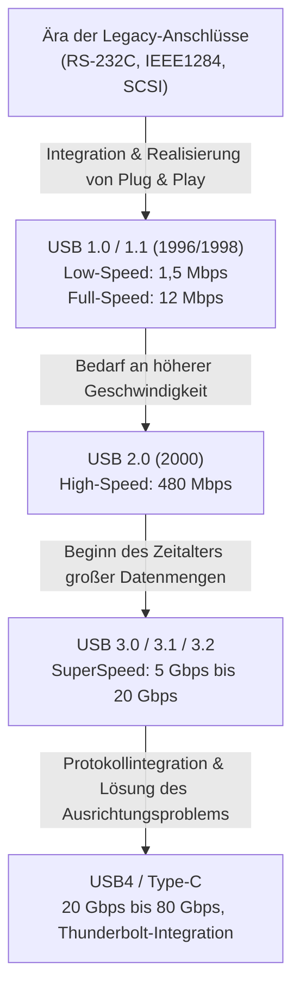

# Die Geschichte von USB: Warum sich der Stecker von asymmetrisch zu USB-C entwickelt hat

## 1. Einleitung: Das Chaos der alten Anschlüsse und das Leiden der Benutzer

Bevor der "USB (Universal Serial Bus)", den wir heute als selbstverständlich ansehen, auf den Markt kam, war die Rückseite von Personal Computern Ende der 1980er bis Anfang der 1990er Jahre das reinste Chaos. Von dem eleganten Erscheinungsbild heutiger PCs und Macs mit ihren aufgeräumten Schnittstellen hätte man damals nicht einmal träumen können. Stattdessen drängte sich eine Vielzahl unterschiedlicher Anschlüsse aneinander und stürzte die Nutzer in Verwirrung.

### Die Grenzen von seriellen und parallelen Anschlüssen
Als typische Schnittstelle dieser Zeit ist zunächst der "serielle Anschluss (RS-232C)" zu nennen. Dieser wurde hauptsächlich für den Anschluss von Modems oder Mäusen verwendet. Die Kommunikationsgeschwindigkeit war extrem langsam, in der Anfangszeit lag sie nur bei wenigen kbps bis hin zu einigen Dutzend kbps. Auch die Konfiguration war äußerst komplex: Oft mussten die Nutzer detaillierte Parameter des Kommunikationsprotokolls wie Baudrate, Stoppbits und Paritätsbits manuell im Betriebssystem oder in der Software einstellen.

Andererseits wurde für den Anschluss von Druckern und Scannern der "parallele Anschluss (wie IEEE 1284)" verwendet. Dieser Port, der auf den Centronics-Standard zurückgeht, übertrug mehrere Bits gleichzeitig parallel und war damit schneller als die damaligen seriellen Ports. Die Kabel waren jedoch dick, schwer und sehr unhandlich zu verlegen. Zudem war der Stecker selbst riesig und beanspruchte einen großen Teil des ohnehin knappen Platzes auf der Rückseite des PCs.

### PS/2-Anschlüsse und die Hürde von SCSI
Als Eingabeschnittstelle gab es den "PS/2-Anschluss". Der Name stammt von der Verwendung in IBMs Personal System/2; es gab zwei Anschlüsse: einen für die Tastatur (lila) und einen für die Maus (grün). Der größte Nachteil war, dass "Hot Swapping" (Austausch im laufenden Betrieb) nicht unterstützt wurde. Zog man also die Maus bei eingeschaltetem PC ab und steckte sie wieder ein, wurde sie nicht erkannt, und im schlimmsten Fall bestand sogar die Gefahr, dass der Controller auf dem Motherboard physisch durchbrannte.

Darüber hinaus wurde für externe Festplatten, Hochleistungsscanner, MO-Laufwerke und andere Geräte, die schnelle Datenübertragungen erforderten, "SCSI (Small Computer System Interface)" verwendet. SCSI war extrem leistungsfähig, erforderte jedoch spezielles Fachwissen, etwa für die physische Verbindung von "Terminatoren" (Abschlusswiderständen) beim Daisy-Chaining oder für die Zuweisung einer eindeutigen "SCSI ID" an jedes Gerät. Es war ein anspruchsvoller Standard, bei dem ein einziger Konfigurationsfehler das gesamte System einfrieren lassen konnte.

So hatte jedes Peripheriegerät eine andere Steckerform und komplizierte Einstellungen. Probleme durch Konflikte bei IRQ (Interrupt Request), DMA (Direct Memory Access) und I/O-Adressen waren an der Tagesordnung. Jedes Mal, wenn Nutzer ein neues Peripheriegerät kauften, mussten sie sich mit dicken Handbüchern herumschlagen und in manchen Fällen das PC-Gehäuse öffnen, um mit einer Pinzette Jumper-Pins auf Erweiterungskarten umzustecken – eine Tortur, die heute unvorstellbar ist.

## 2. Der Traum von "Plug and Play" und die Geburt von USB 1.0

Um dieser desaströsen Situation ein Ende zu setzen und eine Welt zu schaffen, in der jeder seinen PC problemlos erweitern kann, traten die Giganten der IT-Branche auf den Plan. Auf Initiative eines Teams um Ajay Bhatt von Intel schlossen sich sieben Unternehmen (Compaq, Microsoft, IBM, DEC, Nortel, NEC) zusammen und bildeten eine Standardisierungsgruppe, die als Vorgänger des USB Implementers Forum (USB-IF) fungierte. Und 1996 wurde schließlich der Standard "USB 1.0" offiziell angekündigt.

### Die wahre Bedeutung von "Universal"
Das größte Ziel von USB war, wie der Name "Universal" schon sagt, alle Peripheriegeräte in einem einzigen Standard und mit einer einzigen Steckerform zu vereinen. Dabei wurde vor allem auf die Realisierung von "Plug and Play" und "Hot Swap" Wert gelegt. Nutzer können Kabel beliebig ein- und ausstecken, während der PC eingeschaltet ist, und das Betriebssystem erkennt das Gerät automatisch und installiert den Treiber. Die Nutzer müssen sich um keine detaillierten Einstellungen mehr kümmern. Dies war die ultimative Vision von USB.

### Spezifikationen von USB 1.0/1.1 und Hürden bei der Verbreitung
Bei USB 1.0 wurden zwei Modi für die Kommunikationsgeschwindigkeit definiert:
* **Low-Speed (1,5 Mbps)**: Hauptsächlich für Geräte wie Tastaturen und Mäuse, bei denen die Datenmenge gering ist und Latenzen nicht kritisch sind.
* **Full-Speed (12 Mbps)**: Für Drucker, externe Speichermedien, Audiogeräte usw.

Aus heutiger Sicht sind "12 Mbps" unglaublich langsam (nur etwa 1,5 MB pro Sekunde), aber es reichte völlig aus, um die damaligen seriellen Anschlüsse (wie 115,2 kbps) zu ersetzen. Außerdem verfügte es über eine revolutionäre Architektur, die den baumartigen Anschluss von bis zu 127 Geräten ermöglichte.

Dennoch verlief der Start von USB 1.0 nach seiner Ankündigung nicht reibungslos. Die frühe Version von Windows 95 bot keine native Unterstützung für USB. Obwohl sie später in OSR2.1 hinzugefügt wurde, war sie so instabil, dass das Ganze nicht als "Plug and Play", sondern eher als "Plug and Pray" (Einstecken und Beten) verspottet wurde.

### Apples Entscheidung: Der Durchbruch durch den iMac
Der entscheidende Wendepunkt für die weltweite Verbreitung von USB war die Veröffentlichung von Windows 98 im Jahr 1998 (mit massiv verbesserter USB-Unterstützung) und vor allem der erste "iMac (Bondi Blue)", den Apple im selben Jahr auf den Markt brachte.

Das von Steve Jobs geführte Unternehmen Apple verfolgte ein extrem radikales Design, indem es herkömmliche Macintosh-Schnittstellen wie den ADB (Apple Desktop Bus), den seriellen Anschluss und den SCSI-Anschluss zusammen mit dem Diskettenlaufwerk gnadenlos verbannte und externe Erweiterungsanschlüsse "nur auf USB" beschränkte.
Da es zu dieser Zeit fast keine USB-kompatiblen Peripheriegeräte auf dem Markt gab, stieß diese Entscheidung in der Industrie auf heftige Kritik. Da der iMac jedoch ein weltweiter Hit wurde, wechselten die Hersteller von Peripheriegeräten schlagartig zur Entwicklung USB-kompatibler Produkte, um zu überleben. Im Ergebnis wird Apples fast schon erzwungen wirkende Entscheidung dafür verantwortlich gemacht, die Verbreitung von USB um Jahre beschleunigt zu haben. Im selben Jahr wurde auch "USB 1.1" mit Fehlerbehebungen und verbesserter Kompatibilität veröffentlicht, was das Fundament des Standards festigte.

## 3. Die Geschwindigkeitsrevolution und das Goldene Zeitalter: Die Herrschaft von USB 2.0

Das im April 2000 angekündigte "USB 2.0" war einer der größten Durchbrüche in der Geschichte von USB und ein großartiger Standard, der bis heute am längsten und weitesten genutzt wird.

Die maximale Kommunikationsgeschwindigkeit wurde auf "High-Speed (480 Mbps)" erhöht, was im Vergleich zum Full-Speed von USB 1.1 (12 Mbps) eine dramatische Leistungssteigerung um das 40-fache bedeutete. Diese Geschwindigkeitssteigerung war nicht nur eine Spielerei mit Zahlen auf dem Datenblatt, sondern besaß die Kraft, das digitale Leben der Menschen grundlegend zu verändern.

### Praktischer Einsatz von Geräten mit großer Kapazität
Durch den Erhalt einer Bandbreite von 480 Mbps wurden nacheinander hochkapazitive Geräte praxistauglich, die zuvor über USB-Verbindungen unrealistisch gewesen waren.
Externe Festplatten, CD-R/RW- und DVD-Laufwerke, Datenübertragung von hochauflösenden Digitalkameras im Megapixel-Bereich sowie TV-Tuner und hochwertige Audio-Interfaces ließen sich nun problemlos über USB betreiben. Insbesondere die explosionsartige Verbreitung von "USB-Sticks (Flash-Laufwerke)" machte veraltete Wechselmedien wie Disketten und MO-Disketten komplett obsolet.

Zudem bot USB 2.0 eine vollständige Abwärtskompatibilität, sodass USB 1.1-Geräte einfach angeschlossen werden konnten und reibungslos funktionierten. In dieser Zeit sprang USB über die PC-Welt hinaus und etablierte sich als "wahrer universeller Standard", der in alle Arten von elektronischen Geräten integriert wurde, darunter Fernseher, DVD/BD-Rekorder, Heimkonsolen und Auto-Navigationssysteme.

## 4. Steckersalat und Stecker-Tragödie: Die mobile Ära und Micro-B

Mit dem Erfolg von USB 2.0 schien der Traum, alle Geräte über USB zu verbinden, wahr geworden zu sein. Allerdings brachte die neue Welle der Verkleinerung und Verschlankung mobiler Geräte (wie Mobiltelefone, Digitalkameras und MP3-Player) ernste Probleme für die Form des USB-Anschlusses mit sich.

### Aufgabenteilung zwischen Type-A und Type-B
In der ursprünglichen Design-Philosophie von USB gab es eine strikte Regel, dass die Host-Seite (wie ein PC, die steuernde Seite) einen "Type-A (flach und rechteckig)" Anschluss und die Geräte-Seite (wie Drucker oder Scanner, die gesteuerte Seite) einen "Type-B (nahezu quadratisch)" Anschluss verwendet. Dadurch wurde physisch verhindert, dass Nutzer versehentlich zwei PCs direkt miteinander verbanden und Kurzschlüsse oder Schäden verursachten.

### Die Vielzahl an kleinen Anschlüssen
Der Type-B-Anschluss war jedoch für große Geräte wie Drucker geeignet, aber viel zu riesig, um in Mobiltelefone oder flache Digitalkameras eingebaut zu werden. Daher wurden auf der Suche nach Miniaturisierung "Mini-A" und "Mini-B" standardisiert. Insbesondere Mini-B wurde bei Digitalkameras und frühen portablen Festplatten weit verbreitet.
Als die Geräte jedoch noch dünner wurden, empfand man selbst den Mini-B als zu dick und störend. Daraufhin wurden 2007 "Micro-A" und "Micro-B" angekündigt, die dünner waren und eine höhere Haltbarkeit aufwiesen.

Vor allem "Micro-B" gewann rasch an überwältigenden Marktanteilen als weltweiter Standardanschluss für Laden und Datenkommunikation, insbesondere für Android-Smartphones, die begannen, sich rasant zu verbreiten. In Europa gab es unter dem Aspekt des Umweltschutzes (Reduzierung von Elektroschrott) starken Druck, die Ladeanschlüsse für Mobiltelefone auf Micro-USB zu vereinheitlichen, was die Verbreitung weiter vorantrieb.

### Schrödingers USB: Das Problem mit der Ausrichtung, das die Menschheit quälte
Hier entstand die größte Tragödie, die sich tief in die Geschichte der Menschheit einprägen sollte: das "USB-Ausrichtungsproblem".
Sowohl der Standard-Type-A als auch der verkleinerte Micro-B haben eine asymmetrische Form oben und unten, sodass sie nur in der richtigen Ausrichtung eingesteckt werden können. Die Form hatte jedoch das tückische Design, dass "auf den ersten Blick sehr schwer zu erkennen ist, wo oben ist".

"Man versucht ihn einzustecken, spürt Widerstand -> Man dreht ihn um und versucht es erneut, aber er passt wieder nicht -> Man dreht ihn noch einmal um, und plötzlich gleitet er mühelos hinein."

Dieses unerklärliche Phänomen wurde weltweit zum Internet-Meme als "USB-Superposition (Quantenüberlagerung)" oder "4-dimensionaler Stecker" und raubte den Menschen wertvolle Zeit und mentale Energie. Es kam häufig zu katastrophalen Vorfällen, bei denen Anschlüsse in Smartphones zerstört wurden, weil sie mit Gewalt falsch herum eingesteckt wurden. Selbst Ajay Bhatt, der Erfinder von USB, äußerte in späteren Interviews Bedauern und sprach über das damalige Dilemma bei der Entwicklung: "Es wäre besser gewesen, ihn von Anfang an reversibel (beidseitig steckbar) zu machen, aber aus Kostengründen hatten wir keine andere Wahl, als ihn einseitig auszuführen."

## 5. Die Ankunft von SuperSpeed und das Chaos bei den Bezeichnungen: Die USB 3.x-Serie

Ende der 2000er Jahre sprangen Dateigrößen wie HD-Videos und massive Spieldaten in den Terabyte-Bereich, wodurch die 480 Mbps von USB 2.0 zunehmend als unzureichend empfunden wurden.
Als Antwort darauf wurde 2008 "USB 3.0" vorgestellt.

### Der blaue Stecker und SuperSpeed
Die maximale Kommunikationsgeschwindigkeit von USB 3.0 wurde "SuperSpeed (5 Gbps)" getauft, womit eine überwältigende Bandbreite realisiert wurde, die mehr als zehnmal so hoch war wie bei USB 2.0.
Physikalisch nutzte es eine 9-Pin-Struktur, bei der zusätzlich zu den vier bisherigen Pins von USB 2.0 (Strom, GND, D+, D-) fünf neue Pins für die ultraschnelle Datenübertragung (zwei zum Senden, zwei zum Empfangen, GND) hinzugefügt wurden.
Das auffälligste äußere Merkmal war, dass die Kunststoffteile im Inneren des Steckers als "Blau (Pantone 300C)" spezifiziert wurden, um ihn von älteren Anschlüssen zu unterscheiden. Dies ermöglichte es den Benutzern, intuitiv zu verstehen: "Wenn man blaue Stecker mit einem blauen Kabel verbindet, ist es schnell."

### Verwirrende Namensgebung
Trotz des technischen Erfolgs führte die Marketingabteilung des USB-IF wiederholt unverständliche Namensänderungen durch, was Verbraucher und die PC-Industrie in tiefe Verwirrung stürzte.

* **2013**: "USB 3.1" wurde angekündigt, mit einer auf 10 Gbps (SuperSpeed+) erhöhten Geschwindigkeit. Das war noch in Ordnung, aber gleichzeitig wurde der Name des bestehenden USB 3.0 (5 Gbps) in "USB 3.1 Gen 1" und die neuen 10 Gbps in "USB 3.1 Gen 2" umgeändert.
* **2017**: "USB 3.2", das die Geschwindigkeit auf 20 Gbps erhöhte, wurde angekündigt. Erneut entschied man sich, die Namen der alten Standards zu ändern, und nannte 5 Gbps "USB 3.2 Gen 1", 10 Gbps "USB 3.2 Gen 2" und die neuen 20 Gbps "USB 3.2 Gen 2x2".

Als Konsequenz führte dies zu einem Worst-Case-Szenario, das die Glaubwürdigkeit des Standards untergrub: Selbst wenn auf der Verpackung eines Produkts in Elektronikmärkten groß "USB 3.2-kompatibel!" stand, konnten normale Verbraucher, ganz zu schweigen von Experten, ohne genaues Studium der Spezifikationen nicht erkennen, ob es sich um 5 Gbps oder 20 Gbps handelte.

## 6. Der ultimative Anschluss "Type-C" und die Stromversorgungs-Revolution "Power Delivery"

Um den Frust über das Ausrichtungsproblem, das Chaos bei den Steckertypen und die verwirrenden Versionsnamen ein für alle Mal zu lösen, bündelte das USB-IF all seine Kräfte und stellte 2014 "USB Type-C (USB-C)" vor, das man als den Höhepunkt der USB-Geschichte betrachten kann.

### Drei Revolutionen durch Type-C
Type-C war nicht nur ein Anschluss in neuer Form, sondern brachte drei revolutionäre Eigenschaften mit sich, die das Computing verändern sollten.

1. **Realisierung einer reversiblen Struktur**
   Durch die punktsymmetrische Anordnung der Pins im Stecker (24 Pins) konnte dieser von beiden Seiten eingesteckt werden. Das war der Moment, in dem das "Schrödingers USB-Problem", das die Menschheit lange geplagt hatte, endlich und vollständig gelöst war. Der Stecker selbst behielt eine Kompaktheit, die der von Micro-B entsprach, und konnte in alle Arten von Geräten eingebaut werden, von extrem dünnen Smartphones bis hin zu massiven Desktop-PCs.
2. **Abschaffung der Unterscheidung zwischen Host und Gerät und CC-Pins**
   Die physische Trennung zwischen Type-A und Type-B wurde abgeschafft, und Kabel mit Type-C an beiden Enden wurden zum Standard. Es funktionierte unabhängig davon, welches Ende wo eingesteckt wurde. Um dies zu erreichen, wurde Type-C um "CC (Configuration Channel)"-Pins für die Kommunikation erweitert. Damit wurde ein intelligentes System eingeführt, durch das verbundene Geräte sofort komplex aushandeln konnten (über Kommunikationsprotokolle), "wer Host und wer Gerät ist" und "in welche Richtung Strom fließt".
3. **Alternate Mode (Alternativer Modus)**
   Neben der USB-Datenkommunikation konnten nun auch Protokolle anderer Unternehmen über das Type-C-Kabel übertragen werden. Ein typisches Beispiel ist der "DisplayPort Alternate Mode". Damit wurde es möglich, hochauflösende Videosignale von einem PC an einen Monitor über ein einziges Type-C-Kabel auszugeben, ohne spezielle HDMI- oder DisplayPort-Kabel zu benötigen.

### Die Stromversorgungs-Revolution durch USB Power Delivery (USB PD)
Was das Potenzial von Type-C voll ausschöpfte, war der parallel dazu weiterentwickelte Stromversorgungsstandard namens "USB Power Delivery (USB PD)".
Die Energieversorgung der frühen USB 1.0/2.0-Versionen lag bei mageren 2,5 W (5V/0,5A) – gerade genug, um eine Maus oder Tastatur zu betreiben. Selbst bei USB 3.0 waren es nur 4,5 W (5V/0,9A), was selbst für schnelles Laden von Smartphones knapp bemessen war.

USB PD jedoch machte es möglich, gewaltige Leistungen von bis zu "100 W" (20V/5A) zu liefern. Mit dem Update "USB PD EPR (Extended Power Range)" im Jahr 2021 wurde dies auf beeindruckende "240 W" (48V/5A) erweitert.
Leistungen von 100 W bis 240 W reichen nicht nur für das schnelle Aufladen von Smartphones und Tablets, sondern können auch High-End-Laptops, die viel Strom verbrauchen (wie MacBook Pros oder Gaming-PCs), antreiben und sogar große LCD-Monitore mit Strom versorgen.

"Über ein einziges Type-C-Kabel von einem Monitor mit Videoausgang Videos an einen Laptop senden und den Computer gleichzeitig vom Monitor aus mit hoher Leistung aufladen."
Eine Umgebung, die früher drei Kabel erforderte (Stromkabel, Videokabel und ein USB-Datenkabel), wird nun mit einem einzigen Type-C-Kabel realisiert. Dies führte zu einer ultimativen Vereinfachung in Büroumgebungen und beim Arbeiten von zu Hause (Telearbeit).

## 7. Die historische Fusion mit dem starken Rivalen "Thunderbolt"

Wenn man über die Geschichte der Entwicklung von USB spricht, darf die Präsenz von "Thunderbolt" auf keinen Fall fehlen.
Thunderbolt ist ein ultraschneller Schnittstellenstandard, der gemeinsam von Intel und Apple entwickelt wurde. Ursprünglich unter dem Codenamen "Light Peak" konzipiert, sollte er auf Glasfasern basieren. Aus Kostengründen erschien er 2011 jedoch als "Thunderbolt 1" auf Kupferbasis.

### Unterschiedliche Design-Philosophien
Während USB das Ziel verfolgte, "verschiedene Peripheriegeräte einfach und kostengünstig zu verbinden", verfolgte Thunderbolt einen extrem brachialen, leistungsorientierten Ansatz: "den internen PCI-Express-Bus des PCs und den Videoausgang (DisplayPort) direkt nach außen zu führen". Daher war es sehr gefragt für professionelle Anwendungen, die aufgrund der Latenz- oder Bandbreitenbeschränkungen von USB nicht realisierbar waren, wie etwa externe GPUs und ultraschneller RAID-Speicher.

Anfangs nutzten Thunderbolt 1 und 2 denselben Anschluss wie Mini DisplayPort und wurden als exklusive Funktionen auf dem Mac eingeführt. Aus Sorge, dass die Verbreitung bei Windows-PCs nur schleppend verlief, traf Intel jedoch 2015 bei der Ankündigung von "Thunderbolt 3" die historische Entscheidung, von dem proprietären Anschluss auf "USB Type-C" umzusteigen.

### Type-C-Verwirrung und der Weg zur Integration
Die Vereinheitlichung auf Type-C verbesserte zwar die Benutzerfreundlichkeit, führte jedoch gleichzeitig zu einer neuen Art von Verwirrung, die sich völlig von der früheren Anschlüssevielfalt unterschied. Die Komplexität lag darin, dass "die Anschlüsse und Kabel optisch identische Type-C waren, das darin laufende Kommunikationsprotokoll aber manchmal USB und manchmal Thunderbolt 3 sein konnte. Und manchmal gab es Kompatibilität, manchmal nicht."

Um diese übermäßig komplexe Situation grundlegend zu lösen, unternahm Intel 2019 den erstaunlichen Schritt und stellte dem USB-IF die Protokollspezifikationen für Thunderbolt 3 "kostenlos zur Verfügung".
Der Next-Generation-Standard, der auf Basis dieses Technologietransfers von Intel entwickelt wurde, ist "USB4".

### USB4: Der ultimative einheitliche Standard
Mit der Einführung von USB4 haben USB und Thunderbolt sowohl namentlich als auch faktisch eine "Fusion" vollzogen. USB4 bietet standardmäßig eine maximale Kommunikationsgeschwindigkeit von 40 Gbps (die neueste USB4 Version 2.0 erreicht 80 Gbps und im asymmetrischen Modus sogar 120 Gbps) und unterstützt offiziell das PCIe-Tunneling.
Mit anderen Worten: Features, die bisher Thunderbolt vorbehalten waren (wie der "Anschluss externer GPUs"), konnten nun als Teil des USB-Standards genutzt werden. Gleichzeitig wurden hochkomplexe Bezeichnungen wie "USB 3.2 Gen 2x2" abgeschafft, und man bemühte sich, zu Markennamen zurückzukehren, die die Geschwindigkeit direkt widerspiegeln, wie "USB 40Gbps".

## 8. Umweltvorschriften und die Zukunft: Die Weltherrschaft von Type-C und zukünftige Herausforderungen

Die Entwicklung von USB hat nicht nur in technologischer Hinsicht einen wichtigen Wendepunkt erreicht, sondern auch in politischer und umweltbezogener Hinsicht.

### Verordnung der Europäischen Union (EU) zur Vereinheitlichung von Ladeanschlüssen
Im Jahr 2022 verabschiedete das Europäische Parlament der Europäischen Union (EU) einen Gesetzesentwurf, der vorschreibt, dass Ladeanschlüsse für kleine elektronische Geräte wie Smartphones, Tablets und Digitalkameras "auf USB Type-C vereinheitlicht werden". Das Hauptziel dieses Gesetzesentwurfs besteht darin, den "Elektroschrott (E-Waste)", der sich auf Zehntausende Tonnen jährlich beläuft, zu reduzieren, indem die Verschwendung beim Kauf von unterschiedlichen Kabeln und Ladegeräten für verschiedene Geräte vermieden wird.

Das wichtigste Ziel dieser Regulierung war Apples iPhone, das über viele Jahre den proprietären "Lightning"-Anschluss verwendete. Apple wehrte sich und argumentierte, dies würde "Innovationen behindern", aber letztlich konnte das Unternehmen den riesigen EU-Markt nicht ignorieren. In der 2023 veröffentlichten iPhone-15-Serie wurde Lightning schließlich abgeschafft und USB Type-C eingeführt.
Damit wurde eine "komplette Weltherrschaft" erreicht: Fast alle batteriebetriebenen Geräte, die wir täglich nutzen – Android-Geräte, iPhones, Macs, Windows-PCs, iPads, Nintendo Switches, kabellose Kopfhörer – können nun mit einem einzigen Type-C-Kabel aufgeladen werden.

### Verbleibende Herausforderungen: Kabel-Gacha (Die Kabel-Lotterie)
Durch die Vereinheitlichung der Hardwareanschlüsse auf Type-C wurde die Benutzerfreundlichkeit auf ein Maximum gesteigert. Aber es sind nicht alle zukünftigen Herausforderungen verschwunden.
Das Problem, das die Nutzer derzeit am meisten frustriert, wird oft als "Kabel-Lotterie (Kabel-Gacha)" bezeichnet.

Auch wenn es sich um ein Kabel mit Type-C an beiden Enden handelt, gibt es verheerende Leistungsunterschiede, die davon abhängen, was sich im Inneren befindet (Vorhandensein des eMarker-Chips und die Anzahl der verbundenen Adern):
* Extrem dünne Kabel, die nur das Aufladen unterstützen, wobei die Datenübertragung auf USB 2.0 (480 Mbps) beschränkt ist.
* Kabel, die 60 W Ladung unterstützen, jedoch keine Videoausgabe zulassen.
* Sehr dicke, kurze und teure Thunderbolt-4-Kabel, die 100 W (oder 240 W) Ladung, 40-Gbps-Datenkommunikation sowie 8K-Videoausgabe unterstützen.

Da sie äußerlich identisch aussehen, sich in der Leistung jedoch völlig unterscheiden, müssen Benutzer die winzigen aufgedruckten Logos auf der Verpackung oder am Kabelanschluss aufmerksam prüfen. Die ironische Realität ist: "Die Vereinheitlichung der Anschlüsse hat im Inneren der Kabel zu Chaos geführt."

## 9. Fazit: Die endlose Reise zur Universalität (Universal)

1996 wurde USB mit dem großen Traum geboren, "alles mit nur einem universellen Anschluss zu verbinden" – in einer PC-Welt, die auf der Rückseite eine unendliche Anzahl verschiedener Anschlüsse aufwies und mit IRQ-Konflikten zu kämpfen hatte.

Die Reise verlief alles andere als reibungslos. Es gab Kompromisse durch mangelnde Geschwindigkeit, eine wachsende Vielfalt im Zuge der Verkleinerung der Anschlüsse, Frustration über das Ausrichtungsproblem, Namenschaos durch verwirrte Marketingentscheidungen und eine komplexe Beziehung zum starken Konkurrenten Thunderbolt.
Dennoch bündelte USB jedes Mal das Know-how der IT-Industrie und entwickelte sich kontinuierlich weiter, während die Kompatibilität gewahrt blieb (und teils mutige Kurskorrekturen vorgenommen wurden).

Die Übertragungsgeschwindigkeit sprang um ein Zehntausendfaches (von 1,5 Mbps auf 80 Gbps), und die Kapazität der Stromversorgung erhöhte sich um etwa das Hundertfache (von 2,5 W auf 240 W). Und durch die Erlangung der hervorragenden physischen und funktionalen Form "Type-C" hat USB nach einem Vierteljahrhundert seit seiner Entstehung endlich das ursprünglich angestrebte Ideal "Universal" verwirklicht.

Egal, wie die Namen der nächsten Standards lauten und welche Geschwindigkeiten sie erreichen werden, es steht außer Zweifel, dass die unansehnlichen Bündel unnötiger Kabel von unseren Schreibtischen verschwinden werden und weiterhin eine einfachere, leistungsfähigere und elegantere Verbindungserfahrung geboten wird. Die Entwicklung vom asymmetrischen und unpraktischen Stecker hin zu USB-C ist sicherlich einer der größten Meilensteine in der Geschichte der IT-Hardware – auf der ständigen Suche der Menschheit nach Bequemlichkeit und Rationalität.
