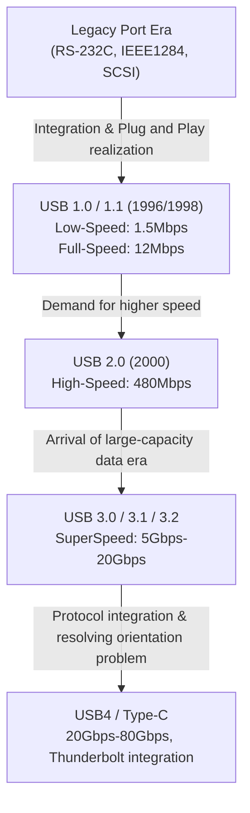

# History of USB: Why It Evolved from Non-Reversible Ports to USB-C

## 1. Introduction: The Chaos and User Agony Brought by Legacy Ports

Before the "USB (Universal Serial Bus)", which we take for granted today, made its appearance, the back of personal computers from the late 1980s to the early 1990s was pure chaos. It was hard to imagine from the sleek appearance of modern PCs and Macs with their clean interfaces, a myriad of different ports were crowded together, plunging users into confusion.

### The Limits of Serial and Parallel Ports
A representative interface at the time was the "Serial Port (RS-232C)". This was primarily used for connecting modems and mice. The communication speed was extremely slow, with early ones ranging from a few kbps to tens of kbps. Configuration was also extremely complex, often requiring the user to manually set detailed communication protocol parameters such as baud rate, stop bits, and parity bits within the OS or software.

On the other hand, the "Parallel Port (such as IEEE 1284)" was used for connecting printers and scanners. Originating from the Centronics standard, this port sent multiple bits in parallel at the same time, so it was faster than the serial ports of the time, but the cables were thick, heavy, and very difficult to handle. Also, the connector itself was huge, taking up a large portion of the limited space on the back of the PC.

### The Wall of PS/2 Ports and SCSI
As input interfaces, there were "PS/2 ports". Named after their adoption in IBM's Personal System/2, two were provided: one for the keyboard (purple) and one for the mouse (green). Their biggest drawback was the lack of support for "hot swapping". In other words, pulling out a mouse while the PC was powered on and plugging it back in would not be recognized, and in the worst case, there was even a danger of physically burning out the motherboard's controller.

Furthermore, for external hard drives, high-performance scanners, and MO drives that required high-speed data transfer, "SCSI (Small Computer System Interface)" was used. SCSI was highly capable, but it required specialized knowledge, such as physically connecting a "terminator" (terminating resistor) for daisy-chain connections and assigning non-overlapping "SCSI IDs" to each device. It was a strict standard where a single configuration mistake could freeze the entire system.

Thus, the shape of the terminal differed for each peripheral device, configuration was cumbersome, and troubles caused by conflicts in IRQ (Interrupt Request), DMA (Direct Memory Access), and I/O addresses were everyday occurrences. Every time users bought a new peripheral, they were forced into a struggle with thick manuals, and sometimes even having to open the PC case and manipulate the jumper pins on expansion cards with tweezers—an agonizing task unimaginable today.

## 2. The Long-Sought "Plug and Play" and the Birth of USB 1.0

To break out of this disastrous situation and create a world where anyone could easily expand their PC, the giants of the IT industry rose up. Driven by a team led by Intel's Ajay Bhatt, seven companies—Compaq, Microsoft, IBM, DEC, Nortel, and NEC—gathered to form the standard specification group that would become the predecessor of the USB Implementers Forum (USB-IF). Then, in 1996, the "USB 1.0" standard was officially announced.

### The True Meaning of "Universal" Aimed For
As the name suggests, the ultimate goal of USB was to unify all peripheral devices under a single standard and a single connector shape. And what was prioritized above all else was the realization of "Plug and Play" and "Hot Swap". Users could freely plug and unplug cables while the PC was turned on, and the OS would automatically recognize the device and install the driver. Users wouldn't need to worry about detailed settings at all. This was the ultimate vision that USB set out to achieve.

### USB 1.0/1.1 Specs and the Wall of Adoption
In USB 1.0, two modes were defined for communication speed:
* **Low-Speed (1.5 Mbps)**: Primarily for devices like keyboards and mice where data transfer volume is low and latency is not fatal.
* **Full-Speed (12 Mbps)**: For printers, external storage, audio equipment, etc.

From today's perspective, "12 Mbps" is incredibly slow (able to send only about 1.5MB per second), but it was sufficiently capable of replacing the serial ports of the time (such as 115.2 kbps). It also adopted an innovative architecture capable of connecting up to 127 devices in a tree topology.

However, USB 1.0 was not smooth sailing right after its announcement. Early versions of Windows 95 did not natively support USB, and although it was finally added in the later OSR2.1, its operation was unstable, earning it the mockery of being called "Plug and Pray" instead of "Plug and Play".

### Apple's Decision: The Breakthrough Brought by the iMac
The decisive catalyst for USB to truly spread globally was the release of Windows 98 in 1998 (which vastly improved USB support), and above all, the presence of the original "iMac (Bondi Blue)" announced by Apple the same year.

Apple, led by Steve Jobs, adopted a highly radical design for the iMac, ruthlessly abandoning the floppy disk drive along with all legacy interfaces like ADB (Apple Desktop Bus), serial ports, and SCSI ports used in previous Macintosh computers, narrowing external expansion ports solely down to "USB only".
At the time, there were hardly any USB-compatible peripherals on the market, so this decision faced fierce criticism from the industry. However, when the iMac became a massive global hit, peripheral manufacturers shifted their development to USB-compatible products all at once to survive. As a result, Apple's arguably forceful decision is credited with accelerating the adoption of USB by several years. In the same year, "USB 1.1", which included bug fixes and improved compatibility, was released, solidifying its foothold as a standard.

## 3. The Speed Revolution and the Golden Age: The Reign of USB 2.0

"USB 2.0", announced in April 2000, was one of the biggest breakthroughs in the history of USB and remains a great standard that has been widely used for the longest time up to this day.

The maximum communication speed was raised to "High-Speed (480 Mbps)", achieving a dramatic 40-fold evolution at once compared to the full speed of USB 1.1 (12 Mbps). This speed improvement was not just a play on spec numbers; it had the power to fundamentally change people's digital lives.

### Practical Application of High-Capacity Devices
By gaining a bandwidth of 480 Mbps, high-capacity devices that were previously unrealistic over a USB connection were put into practical use one after another.
External hard drives, CD-R/RW and DVD drives, multi-megapixel high-resolution digital camera data transfers, and even TV tuners and high-quality audio interfaces began to operate comfortably via USB. Above all, the explosive spread of "USB memory (flash drives)" completely rendered legacy removable media like floppy disks and MO disks obsolete.

Moreover, USB 2.0 maintained perfect backward compatibility, an excellent design that allowed USB 1.1 devices to function just as they were when connected. During this period, USB jumped out of the PC world and established its position as the "true universal standard" equipped on every kind of electronic device, including TVs, DVD/BD recorders, home game consoles, and car navigation systems.

## 4. Standard Proliferation and Connector Tragedy: The Mobile Era and Micro-B

With the success of USB 2.0, it seemed the dream of connecting all devices via USB had come true. However, a new wave of miniaturization and thinning of mobile devices (mobile phones, digital cameras, MP3 players, etc.) brought serious problems to the USB connector shape.

### Role Division of Type-A and Type-B
In the original design philosophy of USB, there was a strict rule: adopt a "Type-A (flat rectangle)" connector on the host side (the controlling side, like a PC), and a "Type-B (near-square shape)" connector on the device side (the controlled side, like a printer or scanner). This physically prevented users from mistakenly connecting PCs directly to each other with a cable, avoiding short circuits or malfunctions.

### Proliferation of Miniaturized Connectors
However, while the Type-B connector was suited for large equipment like printers, it was far too massive to be equipped on mobile phones or thin digital cameras. Thus, aiming for miniaturization, "Mini-A" and "Mini-B" were standardized. Mini-B, in particular, became widely adopted in digital cameras and early portable HDDs.
But as devices became even thinner, even Mini-B started being called thick and obtrusive. So in 2007, thinner and more durable "Micro-A" and "Micro-B" were announced.

"Micro-B", in particular, gained overwhelming market share as the global standard connector for charging and data communication in rapidly proliferating mobile devices, mainly Android smartphones. In Europe, strong pressure was applied to unify mobile phone charging terminals to Micro-USB from the perspective of environmental protection (reducing e-waste), which spurred its widespread adoption.

### Schrödinger's USB: The "Orientation Problem" That Plagued Humanity
The greatest tragedy that occurred here, deeply etched into human history, was the "USB orientation problem".
Both the standard Type-A and the miniaturized Micro-B have an asymmetrical top and bottom shape, allowing them to be inserted in only the correct orientation. However, their shape featured an exquisite design where "it is very difficult to tell which side is up just by a glance".

"Try to plug it in but encounter resistance -> flip it over to try again but it still won't go in -> flip it over once more and it somehow goes in smoothly."

This inexplicable phenomenon became an internet meme worldwide as "USB superposition (quantum superposition)" or the "4-dimensional connector", chipping away at people's precious time and mental energy. Tragic accidents where forcing it in backwards destroyed the terminal on the smartphone side occurred frequently. Even Ajay Bhatt, the creator of USB, spoke in a later interview of his regret and the dilemma at the time of development regarding this issue, saying, "In hindsight, it would have been better to make it reversible from the beginning, but at the time, we had to implement a single-sided design to cut costs."

## 5. The Arrival of SuperSpeed and Naming Convention Chaos: The USB 3.x Series

Entering the late 2000s, handling file sizes like HD-quality video data and massive game data jumped to the terabyte class, and even the 480 Mbps speed of USB 2.0 began to noticeably lack speed.
In response, "USB 3.0" was announced in 2008.

### The Blue Connector and SuperSpeed
The maximum communication speed of USB 3.0 was named "SuperSpeed (5 Gbps)", achieving an overwhelming bandwidth more than ten times that of USB 2.0.
As for its physical structure, in addition to the traditional 4 pins up to USB 2.0 (Power, GND, D+, D-), it adopted a 9-pin structure adding 5 new pins for ultra-high-speed data transfer (2 for transmission, 2 for reception, GND).
Its biggest visual feature was that the plastic part inside the connector was designated "Blue (Pantone 300C)" to distinguish it from older terminals. This enabled a intuitive understanding for users: "If you connect blue terminals together with a blue cable, it will be fast."

### Wandering Naming
However, contrary to its technical success, the marketing department of the USB-IF repeatedly made incomprehensible name changes, plunging consumers and the PC industry into a deep vortex of confusion.

* **2013**: "USB 3.1" was announced, increasing the speed to 10 Gbps (SuperSpeed+). So far so good, but at the same time, they renamed the previous USB 3.0 (5 Gbps) to "USB 3.1 Gen 1", and the new 10 Gbps to "USB 3.1 Gen 2".
* **2017**: "USB 3.2" was announced, further raising the speed to 20 Gbps. And once again, they decided to change the names of past standards, calling the 5 Gbps "USB 3.2 Gen 1", the 10 Gbps "USB 3.2 Gen 2", and the new 20 Gbps "USB 3.2 Gen 2x2".

As a result, even if "Supports USB 3.2!" was written boldly on a product package at an electronics retail store, it led to the worst situation that damaged its credibility as a standard, where let alone general consumers, even experts could not tell whether it was 5 Gbps or 20 Gbps without carefully reading the spec sheet.

## 6. The Ultimate Connector "Type-C" and the Power Supply Revolution "Power Delivery"

To resolve at once the hassle caused by the proliferation of connector shapes, the frustration of the orientation problem, and the bizarrely complex version naming, the USB-IF rallied all its forces to announce "USB Type-C (USB-C)" in 2014, which can be said to be the culmination of USB's history.

### Three Revolutions Brought by Type-C
Type-C was not just a new shape of connector, but it carried three innovative features that changed the nature of computing.

1. **Realization of a Reversible Structure**
   By arranging the pins inside the connector (24 pins) point-symmetrically, it became possible to plug it in either side up. This was the moment when the "Schrödinger's USB problem", which had long plagued humanity, was finally completely solved. The connector itself maintained a compactness equivalent to Micro-B, allowing it to be equipped on any device, from ultra-thin smartphones to large desktop PCs.
2. **Abolition of Host/Device Distinction and the CC Pin**
   The physical distinction between Type-A and Type-B was abolished, and a cable with Type-C on both ends was made standard. It functions no matter which side is plugged into which. To realize this, a new "CC (Configuration Channel)" communication pin was introduced to Type-C, incorporating a smart mechanism that highly negotiates (dialogue via communication protocols) between devices the moment they are connected, deciding things like "which is the host and which is the device" or "in which direction power should be sent."
3. **Alternate Mode**
   It became possible to run not only USB data communication but also other companies' protocols through a Type-C cable. A representative example is "DisplayPort Alternate Mode". As a result, it became possible to output high-resolution video signals from a PC to a monitor with just a single Type-C cable, without using a dedicated HDMI or DisplayPort cable.

### The Power Supply Revolution by USB Power Delivery (USB PD)
What pushed the potential of Type-C to its absolute limit was the simultaneous evolution of the power supply standard called "USB Power Delivery (USB PD)".
The power supply capability of early USB 1.0/2.0 was a mere 2.5W (5V/0.5A), barely enough to power a mouse or keyboard. Even USB 3.0 was 4.5W (5V/0.9A), a tough figure even for fast charging a smartphone.

However, USB PD made it possible to supply a massive power of up to 20V/5A, which is "100W". Furthermore, the 2021 "USB PD EPR (Extended Power Range)" update extended this to a maximum of 48V/5A, or "240W".
A power of 100W to 240W is a figure capable of covering not only the fast charging of smartphones and tablets, but also driving high-end notebooks that consume massive power like MacBook Pros and gaming PCs, and even powering large LCD monitors.

"From a monitor equipped with video output, sending video to a laptop via a single Type-C cable while simultaneously rapidly charging the PC from the monitor."
An environment that once required three lines—a power cable, a video cable, and a data USB cable—was now completed by just a single Type-C cable. This realized the ultimate smartification in office environments and remote work.

## 7. Historical Fusion with the Powerful Rival "Thunderbolt"

In talking about the history of USB evolution, another presence that absolutely cannot be left out is "Thunderbolt".
Thunderbolt is an ultra-high-speed interface standard jointly developed by Intel and Apple. Originally called by the codename "Light Peak", the concept was to use optical fiber, but due to cost issues, it debuted on a copper wire basis as "Thunderbolt 1" in 2011.

### Different Design Philosophies
While USB aimed to "connect various peripheral devices easily and cheaply", Thunderbolt adopted an extremely forceful and high-performance approach of "drawing the PC's internal PCI Express bus and video output (DisplayPort) out externally as they are". As a result, it was prized in professional applications impossible with USB due to latency and bandwidth constraints, such as connecting external GPUs and ultra-high-speed RAID storage.

Initially, Thunderbolt 1 and 2 adopted the same terminal shape as Mini DisplayPort, and were deployed as exclusive features of Macs. However, Intel, feeling a sense of crisis over the sluggish adoption in the Windows PC camp, made a historical decision in "Thunderbolt 3" announced in 2015 to switch the connector shape from its proprietary form to "USB Type-C".

### The Type-C Confusion and the Road to Integration
Unifying the connector to Type-C increased convenience, but at the same time, it brought a new, highly invisible confusion to users—a confusion on a different dimension from the past proliferation of terminals: "Even though they are identical looking Type-C terminals and cables, the communication protocol inside could be USB or Thunderbolt 3. And there may or may not be compatibility."

To fundamentally resolve this overly complex situation, Intel took the surprising action in 2019 of providing (donating) the Thunderbolt 3 protocol specification to the USB-IF "royalty-free".
The next-generation standard formulated based on this technology provided by Intel was none other than "USB4".

### USB4: The Ultimate Unified Standard
With the appearance of USB4, USB and Thunderbolt achieved a "fusion" in both name and reality. USB4 boasts a standard maximum communication speed of 40 Gbps (the latest USB4 Version 2.0 reaches 80 Gbps, and up to 120 Gbps in asymmetric mode), and officially supported PCIe tunneling.
In other words, things like "external GPU connections", which were previously a privilege of Thunderbolt, could now be utilized as a standard feature of USB. At the same time, extremely baffling names like "USB 3.2 Gen 2x2" were abolished, and an effort began to return to brand names that directly indicate speed, such as "USB 40Gbps".

## 8. Environmental Regulations and the Future: Unification Under Type-C and Remaining Challenges

The evolution of USB has reached a major turning point not only from a technological aspect but also from political and environmental aspects.

### The European Union's (EU) Common Charger Directive
In 2022, the European Parliament of the European Union (EU) passed a law mandating the unification of charging terminals for small electronic devices such as smartphones, tablets, and digital cameras to "USB Type-C". The main purpose of this law is to eliminate the waste of consumers purchasing different cables and chargers for each device, and to reduce "electronic waste (e-waste)" amounting to tens of thousands of tons annually.

The biggest target of this regulation was Apple's iPhone, which had continued to use its proprietary "Lightning" connector for many years. Apple resisted, claiming it would "stifle innovation", but ultimately could not ignore the massive EU market, and in the iPhone 15 series released in 2023, it finally abolished Lightning and adopted USB Type-C.
With this, a "complete unification" was achieved where almost all battery-powered devices we use daily—Android, iPhone, Mac, Windows PCs, iPads, Nintendo Switches, wireless earbuds, etc.—can be charged with a single Type-C cable.

### Remaining Challenge: The "Cable Gacha"
By unifying hardware terminals to Type-C, convenience was maximized to its absolute limit. However, not all challenges for the future have vanished.
Currently, the problem most plaguing users is what is called the "cable gacha" (lottery).

Even if a cable has Type-C on both ends, depending on what is inside (the presence or absence of a built-in eMarker chip, or the number of wired cores), there exist hopelessly frustrating performance differences such as the following:
* Extremely thin cables supporting only charging, with data transfer limited to USB 2.0 (480 Mbps).
* Cables that support 60W charging but do not support video output.
* Very thick, short, and expensive Thunderbolt 4 cables that support 100W (or 240W) charging, 40Gbps data communication, and 8K video output.

Because they look exactly the same but have completely different performance capabilities, users must stare at and discern the small logo marks printed on the cable packaging or terminal parts. It is an ironic reality that "as a result of unifying the terminal, it invited chaos in the contents of the cable."

## 9. Conclusion: The Endless Journey Towards Universal

In 1996, in a PC world burdened with myriad different ports on the back and plagued by IRQ conflicts, USB was born with the grand dream of "connecting everything with a single versatile terminal."

Its path was never flat. There were compromises due to lack of speed, a proliferation caused by connector miniaturization, frustration from the orientation problem, name confusion from marketing missteps, and a complex relationship with its powerful rival, Thunderbolt.
However, every time, USB gathered the wisdom of the IT industry and continued to evolve while maintaining compatibility (sometimes even including bold self-denial).

The transfer speed jumped from 1.5 Mbps to 80 Gbps, tens of thousands of times faster, and power supply capacity was boosted roughly 100-fold from 2.5W to 240W. And by acquiring a vessel called Type-C that is physically and functionally superior, USB finally realized its initial ideal of "Universal" a quarter-century after its birth.

Regardless of what the next generation standards will be named and what speeds they will achieve, there is no doubt that the ugly, unnecessary bundles of cables will disappear from around our desks, and a simpler, more powerful, and more refined connection experience will continue to be provided. The evolution from inconvenient, unidirectional terminals to USB-C can truly be called one of the greatest trajectories in IT hardware history, where humanity continuously pursued convenience and rationality.
