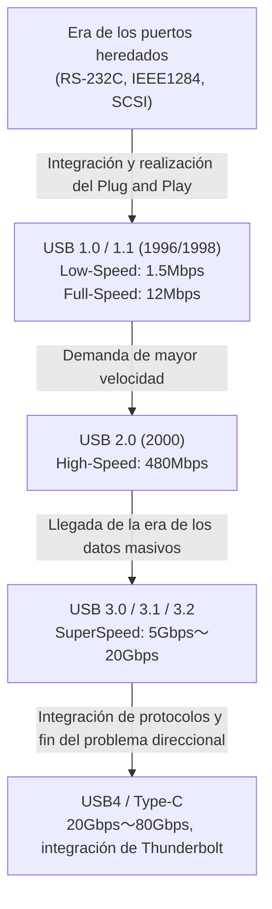

# La historia del USB: por qué evolucionamos de conectores direccionales a USB-C

## 1. Prólogo: El caos provocado por los puertos heredados y la agonía del usuario

Antes de la aparición del "USB (Universal Serial Bus)" que hoy utilizamos como algo habitual, la parte trasera de los ordenadores personales a finales de los 80 y principios de los 90 era un auténtico caos. Lejos del aspecto elegante e interfaces limpias de los PC y Mac modernos, había una multitud de puertos diferentes amontonados que causaban gran confusión a los usuarios.

### Las limitaciones de los puertos serie y paralelo
Uno de los puertos más representativos de la época era el "puerto serie (RS-232C)", utilizado principalmente para conectar módems y ratones. La velocidad de comunicación era muy lenta, desde unos pocos kbps hasta decenas de kbps en las versiones iniciales. La configuración era extremadamente compleja, y a menudo los usuarios tenían que establecer manualmente parámetros detallados del protocolo de comunicación, como los baudios, los bits de parada y los bits de paridad en el sistema operativo o el software.

Por otro lado, el "puerto paralelo (IEEE 1284, etc.)" se usaba para conectar impresoras y escáneres. Originado en el estándar Centronics, este puerto transmitía múltiples bits de forma paralela simultáneamente, haciéndolo más rápido que el puerto serie de entonces, pero el cable era grueso, pesado y muy difícil de manejar. Además, el conector en sí era enorme y ocupaba gran parte del limitado espacio en la parte trasera del PC.

### El muro de los puertos PS/2 y SCSI
Como interfaz de entrada existía el "puerto PS/2". Recibió su nombre por haber sido adoptado en el Personal System/2 de IBM, y había dos conectores: uno para el teclado (morado) y otro para el ratón (verde). Su mayor desventaja era que no admitía la "conexión en caliente" (hot swap). Esto significaba que si se desconectaba y volvía a conectar el ratón mientras el PC estaba encendido, no era reconocido e incluso existía el riesgo de dañar físicamente el controlador de la placa base en el peor de los casos.

Además, los discos duros externos, escáneres de alto rendimiento, unidades MO y otros dispositivos que requerían transferencia de datos a alta velocidad utilizaban "SCSI (Small Computer System Interface)". Aunque SCSI ofrecía un gran rendimiento, requería conocimientos especializados, como la conexión física de "terminadores" (resistencias de terminación) al crear conexiones en cadena (daisy chain) y la asignación de "ID SCSI" únicos a cada dispositivo. Era un estándar tan estricto que un solo error en la configuración podía hacer que todo el sistema se congelara.

De este modo, los conectores tenían diferentes formas para cada periférico, las configuraciones eran engorrosas y los problemas causados por conflictos de IRQ (peticiones de interrupción), DMA (acceso directo a memoria) y direcciones de E/S eran cosa de todos los días. Cada vez que los usuarios compraban un nuevo periférico, se veían obligados a lidiar con manuales gruesos y, en algunos casos, abrir la carcasa del PC para manipular los pines de los puentes (jumpers) de las tarjetas de expansión con pinzas, un calvario inimaginable hoy en día.

## 2. El anhelado "Plug and Play" y el nacimiento del USB 1.0

Para superar esta desastrosa situación y crear un mundo donde cualquiera pudiera expandir fácilmente su PC, los gigantes de la industria de TI se unieron. Por iniciativa de un equipo liderado por Ajay Bhatt de Intel, se reunieron 7 empresas: Compaq, Microsoft, IBM, DEC, Nortel y NEC, formando el grupo de estandarización que sería el predecesor del USB Implementers Forum (USB-IF). Y en 1996, el estándar "USB 1.0" fue anunciado oficialmente.

### El verdadero significado del objetivo "Universal"
El mayor objetivo del USB era, como indica su nombre "Universal", unificar todos los periféricos en un solo estándar y una sola forma de conector. Y lo que más se enfatizó fue la realización del "Plug and Play" y el "Hot Swap". Los usuarios podrían conectar y desconectar cables libremente con el PC encendido, y el sistema operativo reconocería automáticamente el dispositivo e instalaría el controlador. El usuario no tendría que preocuparse en absoluto por configuraciones detalladas. Esta fue la visión definitiva que propuso el USB.

### Las especificaciones del USB 1.0/1.1 y las barreras para su adopción
El USB 1.0 definió dos modos de velocidad de comunicación:
* **Low-Speed (1.5 Mbps)**: Principalmente para teclados y ratones, donde el volumen de transferencia de datos es pequeño y la latencia no es crítica.
* **Full-Speed (12 Mbps)**: Para impresoras, almacenamiento externo, equipos de audio, etc.

Visto desde la actualidad, "12 Mbps" es increíblemente lento (solo puede enviar alrededor de 1,5 MB por segundo), pero en aquel entonces era rendimiento suficiente para reemplazar el puerto serie (como el de 115,2 kbps). También adoptó una arquitectura revolucionaria que permitía conectar en árbol hasta 127 dispositivos.

Sin embargo, el USB 1.0 inmediatamente después de su anuncio no fue todo un éxito. Las versiones iniciales de Windows 95 no admitían USB de forma nativa, y aunque el soporte se agregó finalmente en el posterior OSR2.1, el funcionamiento era inestable, llegando a ser ridiculizado como "Plug and Pray" (conecta y reza) en lugar de "Plug and Play".

### La decisión de Apple: El gran avance que trajo el iMac
La verdadera oportunidad decisiva para que el USB se popularizara a nivel mundial fue el lanzamiento de Windows 98 en 1998 (con grandes mejoras en el soporte USB), y sobre todo, el primer "iMac (Bondi Blue)" anunciado por Apple ese mismo año.

Apple, liderada por Steve Jobs, tomó la decisión extremadamente radical de eliminar sin piedad la unidad de disquete de sus iMac, junto con todas las interfaces heredadas utilizadas en los Macintosh anteriores, como el puerto ADB (Apple Desktop Bus), el puerto serie y el puerto SCSI, limitando los puertos de expansión externos a "solo USB".
Como apenas existían periféricos compatibles con USB en el mercado en ese momento, esta decisión fue ferozmente criticada por la industria. Sin embargo, cuando el iMac se convirtió en un gran éxito mundial, los fabricantes de periféricos apostaron por su supervivencia y comenzaron simultáneamente a desarrollar productos compatibles con USB. Como resultado, se considera que la decisión casi forzada de Apple aceleró la adopción del USB en varios años. Ese mismo año se lanzó el "USB 1.1", que corregía errores y mejoraba la compatibilidad, consolidando su posición como estándar.

## 3. La revolución de la velocidad y la era dorada: El reinado del USB 2.0

Anunciado en abril de 2000, el "USB 2.0" fue uno de los mayores avances en la historia del USB y es el gran estándar que sigue siendo el más utilizado y de mayor duración hasta el día de hoy.

La velocidad máxima de comunicación se elevó a "High-Speed (480 Mbps)", una evolución dramática que fue 40 veces más rápida que el Full-Speed del USB 1.1 (12 Mbps). Esta mejora en la velocidad no fue solo un juego de números en las especificaciones, sino que tuvo el poder de cambiar fundamentalmente la vida digital de las personas.

### La implementación práctica de dispositivos de gran capacidad
Al obtener un ancho de banda de 480 Mbps, se empezaron a utilizar de forma práctica uno tras otro dispositivos de gran capacidad que antes eran irreales con las conexiones USB.
Los discos duros externos, las unidades de CD-R/RW y DVD, las transferencias de datos de cámaras digitales de alta calidad de varios megapíxeles, e incluso los sintonizadores de TV y las interfaces de audio de alta calidad comenzaron a funcionar cómodamente a través de USB. En particular, la explosiva popularidad de la "memoria USB (unidad flash)" dejó completamente en el pasado a los medios extraíbles heredados, como los disquetes y los discos MO.

Además, el USB 2.0 mantuvo una retrocompatibilidad perfecta; un diseño excelente que permitía que los dispositivos USB 1.1 funcionaran sin problemas al conectarlos. Durante este período, el USB saltó del mundo de los PC y estableció su posición como un "verdadero estándar universal" instalado en todo tipo de dispositivos electrónicos, desde televisores y grabadoras de DVD/BD hasta consolas de videojuegos domésticas y sistemas de navegación para automóviles.

## 4. La proliferación de estándares y la tragedia de los conectores: La llegada de la era móvil y el Micro-B

Con el éxito del USB 2.0, parecía que el sueño de que todos los dispositivos estuvieran conectados por USB se había hecho realidad. Sin embargo, la nueva ola de miniaturización y adelgazamiento de los dispositivos móviles (teléfonos móviles, cámaras digitales, reproductores MP3, etc.) traería un grave problema a la forma de los conectores USB.

### La división de roles entre Type-A y Type-B
En la filosofía de diseño original del USB, había una regla estricta de adoptar un conector "Type-A (rectangular plano)" en el lado del host (el lado que controla, como un PC) y un conector "Type-B (forma casi cuadrada)" en el lado del dispositivo (el lado controlado, como una impresora o un escáner). Esto evitaba físicamente que los usuarios conectaran accidentalmente dos PC directamente con un cable, lo que habría causado cortocircuitos o averías.

### La proliferación de conectores pequeños
Sin embargo, aunque el conector Type-B era adecuado para dispositivos grandes como las impresoras, era demasiado gigante para incluirlo en teléfonos móviles y cámaras digitales delgadas. Por lo tanto, con el objetivo de miniaturizarlos, se estandarizaron los conectores "Mini-A" y "Mini-B". En particular, el Mini-B se adoptó ampliamente en cámaras digitales y los primeros discos duros portátiles.
Sin embargo, a medida que los dispositivos se hacían aún más delgados, incluso el Mini-B empezó a ser considerado demasiado grueso y molesto. Así que en 2007 se anunciaron los conectores "Micro-A" y "Micro-B", que eran más delgados y duraderos.

El "Micro-B" en particular ganó una cuota de mercado abrumadora como conector estándar mundial para la carga y comunicación de datos, centrado en los teléfonos inteligentes Android que empezaron a popularizarse rápidamente. En Europa, desde la perspectiva de la protección medioambiental (reducción de basura electrónica), hubo una fuerte presión para estandarizar el puerto de carga de los teléfonos móviles a Micro-USB, lo que impulsó su adopción.

### El USB de Schrödinger: El "problema direccional" que atormentó a la humanidad
La mayor tragedia que surgió aquí y que quedaría profundamente grabada en la historia humana es el "problema direccional del USB".
Tanto el Type-A estándar como el Micro-B miniaturizado tienen una forma asimétrica superior/inferior, por lo que solo se pueden insertar en la dirección correcta. Sin embargo, la forma tenía un diseño tan sutil que era "muy difícil saber cuál lado iba arriba a simple vista".

"Intentas insertarlo pero hay resistencia → intentas darle la vuelta e insertarlo, pero aún no entra → le das la vuelta una vez más y, por alguna razón, entra sin problemas"

Este fenómeno incomprensible se convirtió en un meme de Internet en todo el mundo, llamado "superposición cuántica del USB" o "conector de cuarta dimensión", y consumió un valioso tiempo y energía mental de las personas. También hubo muchos accidentes trágicos en los que los usuarios lo insertaron a la fuerza en la dirección equivocada, rompiendo el conector del teléfono inteligente. Incluso el inventor del USB, Ajay Bhatt, confesó en una entrevista años después su arrepentimiento y el dilema que enfrentaron durante el desarrollo: "Ojalá lo hubiéramos hecho reversible (de doble cara) desde el principio, pero en ese momento no tuvimos más remedio que implementarlo de un solo lado para reducir costes".

## 5. La llegada de SuperSpeed y la confusión en las nomenclaturas: La serie USB 3.x

A finales de la década de 2000, los tamaños de los archivos que se manejaban, como datos de vídeo en calidad HD y juegos de gran capacidad, se dispararon al nivel de los terabytes, y la falta de velocidad del USB 2.0 a 480 Mbps comenzó a hacerse evidente.
Fue entonces cuando se anunció el "USB 3.0" en 2008.

### El conector azul y SuperSpeed
La velocidad máxima de comunicación del USB 3.0 se denominó "SuperSpeed (5 Gbps)" y logró un ancho de banda abrumador de más de 10 veces el del USB 2.0.
En cuanto a la estructura física, además de los 4 pines de los anteriores USB 2.0 (alimentación, GND, D+, D-), adoptó una estructura de 9 pines que añadía 5 pines nuevos para la transferencia de datos a ultra alta velocidad (2 para transmisión, 2 para recepción, GND).
La mayor característica visual fue que la parte de plástico dentro del conector se designó de "color azul (Pantone 300C)" para distinguirla de los conectores anteriores. Esto permitió a los usuarios tener una comprensión intuitiva de que "conectar conectores azules entre sí con un cable azul significa que es rápido".

### Nombrado engañoso
Sin embargo, contrariamente a su éxito técnico, el departamento de marketing del USB-IF repitió cambios de nombre incomprensibles, arrastrando a los consumidores y a la industria del PC a un profundo torbellino de confusión.

* **2013**: Se anunció el "USB 3.1", aumentando la velocidad a 10 Gbps (SuperSpeed+). Hasta aquí todo bien, pero al mismo tiempo cambiaron el nombre del USB 3.0 anterior (5 Gbps) a "USB 3.1 Gen 1" y rebautizaron la nueva versión de 10 Gbps como "USB 3.1 Gen 2".
* **2017**: Se anuncia el "USB 3.2", que aumentó aún más la velocidad a 20 Gbps. Y de nuevo, decidieron cambiar los nombres de los estándares anteriores, denominando a los 5 Gbps "USB 3.2 Gen 1", a los 10 Gbps "USB 3.2 Gen 2", y a los nuevos 20 Gbps "USB 3.2 Gen 2x2".

Como resultado, incluso si los paquetes de productos en las tiendas de electrónica tenían un texto gigante diciendo "¡Compatible con USB 3.2!", los consumidores generales, e incluso los expertos, no podían distinguir si eran 5 Gbps o 20 Gbps sin leer detenidamente la hoja de especificaciones, lo que provocó la peor situación posible de pérdida de credibilidad en el estándar.

## 6. El conector definitivo "Type-C" y la revolución de la alimentación de energía "Power Delivery"

Para solucionar de una vez por todas la molestia de la proliferación de formas de conectores, la frustración del problema direccional y los nombres de versiones complejos y extraños, el USB-IF aunó fuerzas y anunció en 2014 lo que podría llamarse la culminación de la historia del USB: el "USB Type-C (USB-C)".

### Las 3 revoluciones que trajo el Type-C
Type-C no era solo una nueva forma de conector; tenía tres características innovadoras que cambiarían la forma de entender la informática.

1. **La realización de una estructura reversible**
   Al organizar los pines (24 pines) dentro del conector de manera simétrica, fue posible insertarlo en cualquier dirección. Ese fue el momento en que el "problema del USB de Schrödinger" que había atormentado a la humanidad durante tantos años finalmente se resolvió por completo. El conector en sí mantiene un tamaño compacto equivalente al Micro-B, lo que le permite integrarse en todo tipo de dispositivos, desde teléfonos inteligentes ultradelgados hasta grandes PC de escritorio.
2. **Eliminación de la distinción entre host y dispositivo, y el pin CC**
   Se eliminó la distinción física entre Type-A y Type-B, estableciendo como estándar un cable con Type-C en ambos extremos. Funciona independientemente de qué extremo se conecte a qué puerto. Para lograr esto, se introdujo un nuevo pin de comunicación llamado "CC (Configuration Channel)" en el Type-C, junto con un sistema inteligente en el que los dispositivos "negocian" de forma avanzada (dialogando a través del protocolo de comunicación) en el momento en que se conectan para decidir "quién es el host y quién el dispositivo" o "en qué dirección enviar la energía".
3. **Modo Alternativo (Alternate Mode)**
   Además de la comunicación de datos USB, ahora era posible transmitir protocolos de otras empresas a través del cable Type-C. Un ejemplo típico es el "DisplayPort Alternate Mode". Esto hizo posible emitir señales de vídeo de alta resolución desde el PC al monitor con un solo cable Type-C, sin necesidad de usar cables HDMI o DisplayPort dedicados.

### La revolución energética mediante USB Power Delivery (USB PD)
Lo que llevó el potencial del Type-C a su límite absoluto fue el estándar de alimentación de energía "USB Power Delivery (USB PD)", que evolucionó al mismo tiempo.
La capacidad de alimentación de los primeros USB 1.0/2.0 era de apenas 2,5 W (5V/0,5A), lo que apenas bastaba para hacer funcionar un ratón o un teclado. Incluso con USB 3.0 era de 4,5 W (5V/0,9A), una cifra difícil incluso para la carga rápida de un teléfono inteligente.

Sin embargo, USB PD hizo posible suministrar una enorme potencia de hasta "100 W" a 20V/5A. Además, con la actualización "USB PD EPR (Extended Power Range)" de 2021, se amplió hasta "240 W" a 48V/5A.
Las potencias de 100 W a 240 W no solo son suficientes para cargar rápidamente teléfonos inteligentes y tabletas, sino también para alimentar ordenadores portátiles de gama alta que consumen mucha energía, como los MacBook Pro y los PC de juegos, e incluso para encender monitores LCD de gran tamaño.

"Con un solo cable Type-C desde un monitor con salida de vídeo, puedes enviar la señal de vídeo al portátil mientras cargas el portátil a alta potencia desde el monitor".
El entorno que antes requería tres cables (un cable de alimentación, un cable de vídeo y un cable de datos USB) ahora se puede lograr con un único cable Type-C. Esto proporcionó la máxima inteligencia y comodidad para entornos de oficina y teletrabajo.

## 7. La fusión histórica con su poderoso rival "Thunderbolt"

Al hablar de la historia evolutiva del USB, hay otro elemento que no podemos ignorar: "Thunderbolt".
Thunderbolt es un estándar de interfaz de ultra alta velocidad desarrollado conjuntamente por Intel y Apple. Originalmente llamado "Light Peak" en clave, la idea era usar fibra óptica, pero por cuestiones de costes apareció como "Thunderbolt 1" en 2011 basado en cableado de cobre.

### Diferentes filosofías de diseño
Mientras que el USB pretendía "conectar diversos periféricos de forma fácil y económica", Thunderbolt adoptó un enfoque extremadamente potente y de alto rendimiento: "extraer el bus PCI Express interno del PC y la salida de vídeo (DisplayPort) directamente hacia el exterior". Por lo tanto, fue muy apreciado para uso profesional, donde los periféricos como GPU externas o el almacenamiento RAID ultrarrápido eran imposibles de implementar con USB debido a las restricciones de latencia y ancho de banda.

Inicialmente, Thunderbolt 1 y 2 utilizaban el mismo diseño de conector que el Mini DisplayPort, implementándose como una característica exclusiva de los Mac. Sin embargo, ante el temor por la lenta penetración en los PC con Windows, Intel tomó una decisión histórica al anunciar el "Thunderbolt 3" en 2015: cambiar la forma del conector de uno propietario al "USB Type-C".

### La confusión del Type-C y el camino hacia la integración
Si bien unificar el conector al Type-C mejoró la comodidad, al mismo tiempo trajo a los usuarios una nueva e invisible confusión muy superior a la que existía con la proliferación de diferentes terminales: "El aspecto es exactamente el mismo terminal y cable Type-C, pero el protocolo de comunicación interno puede ser USB o puede ser Thunderbolt 3. Y a veces hay compatibilidad y otras veces no".

Para resolver de raíz esta situación excesivamente compleja, Intel tomó una medida sorprendente en 2019: ofrecer (donar) las especificaciones del protocolo Thunderbolt 3 al USB-IF "sin coste alguno".
El estándar de próxima generación desarrollado en base a esta tecnología proporcionada por Intel es, de hecho, el "USB4".

### USB4: El estándar de integración definitivo
Con la llegada del USB4, USB y Thunderbolt se "fusionaron" tanto en nombre como en la realidad. El USB4 estándar cuenta con una velocidad de comunicación máxima de 40 Gbps (en el último USB4 versión 2.0 alcanza 80 Gbps y hasta 120 Gbps en modo asimétrico) y soporta oficialmente el túnel PCIe.
En otras palabras, la conexión de GPU externas, que había sido un privilegio exclusivo de Thunderbolt, se hizo disponible como un estándar USB oficial. Al mismo tiempo, se descartaron los nombres extremadamente confusos como "USB 3.2 Gen 2x2" y comenzaron los esfuerzos por volver a marcas que indicaran directamente la velocidad, como "USB 40Gbps".

## 8. Las normativas medioambientales y el futuro: El dominio global del Type-C y los retos por venir

La evolución del USB ha llegado a un punto de inflexión importante no solo desde el aspecto técnico, sino también desde los ámbitos político y medioambiental.

### La legislación de unificación de puertos de carga de la Unión Europea (UE)
En 2022, el Parlamento Europeo de la Unión Europea (UE) aprobó una ley que exige que el puerto de carga para pequeños dispositivos electrónicos como teléfonos inteligentes, tabletas y cámaras digitales esté "unificado en USB Type-C". El principal objetivo de esta legislación es evitar a los consumidores la necesidad de comprar diferentes cables y cargadores para cada dispositivo y reducir las decenas de miles de toneladas de "basura electrónica (E-waste)" anuales.

El principal objetivo de esta regulación fue el iPhone de Apple, que había seguido utilizando su puerto patentado "Lightning" durante muchos años. Apple se resistió argumentando que esto "frenaría la innovación", pero al final no pudo ignorar el enorme mercado de la UE, y en la serie iPhone 15 lanzada en 2023, finalmente abandonó Lightning y adoptó USB Type-C.
Como resultado, se logró el "dominio global completo", permitiendo que casi todos los dispositivos alimentados por batería que utilizamos a diario, como Android, iPhone, Mac, PC con Windows, iPad, Nintendo Switch y auriculares inalámbricos, se puedan cargar con un solo cable Type-C.

### El reto restante: La lotería de los cables
La comodidad alcanzó su punto máximo al unificar los conectores de hardware al Type-C. Sin embargo, los problemas de cara al futuro no han desaparecido por completo.
El problema que más afecta a los usuarios actualmente se conoce como la "lotería de los cables".

Incluso si un cable tiene un Type-C en ambos extremos, hay diferencias de rendimiento abismales dependiendo de su interior (la presencia o ausencia del chip eMarker incorporado y el número de hilos de núcleo conectados):
* Cables ultrafinos que solo soportan carga, y la transferencia de datos es solo USB 2.0 (480 Mbps).
* Cables que soportan carga de 60 W, pero no soportan salida de vídeo.
* Cables Thunderbolt 4 que son compatibles con carga de 100 W (o 240 W), comunicación de datos de 40 Gbps y salida de vídeo 8K, pero son extremadamente gruesos, cortos y caros.

Como el exterior es exactamente igual pero el rendimiento es completamente distinto, los usuarios deben fijarse en el embalaje del cable o escrutar los pequeños logotipos impresos en el área del conector para identificarlos. Es una realidad irónica que "el resultado de unificar el conector llevó al caos en el interior de los cables".

## 9. Conclusión: El viaje interminable hacia lo Universal

En 1996, en un mundo de PC con innumerables puertos diferentes en la parte trasera que sufrían por conflictos de IRQ, el USB nació con un sueño grandioso: "Conectarlo todo con un solo conector universal".

Su viaje nunca fue un camino de rosas. Hubo compromisos debidos a la falta de velocidad, proliferación de tipos por la miniaturización de los conectores, frustración por el problema direccional, confusión de nombres debido a errores de marketing, y una relación compleja con su poderoso rival, Thunderbolt.
Sin embargo, el USB ha seguido evolucionando integrando la sabiduría de la industria de TI en cada ocasión, y manteniendo la compatibilidad (a veces de la mano de una audaz negación de sí mismo).

La velocidad de transferencia se ha multiplicado por decenas de miles, pasando de 1,5 Mbps a 80 Gbps, y el suministro de energía ha aumentado unas 100 veces, de 2,5 W a 240 W. Y al conseguir un "recipiente" física y funcionalmente superior llamado Type-C, el USB ha logrado por fin convertir en realidad su ideal inicial de ser "Universal", un cuarto de siglo después de su nacimiento.

Sin importar qué nombre adopte el estándar de la próxima generación y cuánta velocidad alcance, es indudable que desaparecerán los montones de cables antiestéticos e innecesarios de nuestros escritorios, y seguiremos recibiendo una experiencia de conexión más simple, potente y sofisticada en el futuro. La evolución de unos conectores direccionales e incómodos al USB-C puede considerarse como una de las más grandes trayectorias en la historia del hardware de TI, producto de la continua búsqueda de comodidad y racionalidad por parte de la humanidad.
