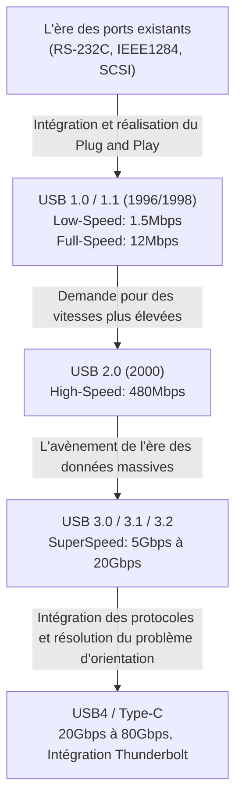

# L'histoire de l'USB : Pourquoi nous sommes passés des connecteurs asymétriques à l'USB-C

## 1. Introduction : Le chaos provoqué par les ports existants et la détresse des utilisateurs

Avant l'avènement de l'"USB (Universal Serial Bus)", que nous utilisons aujourd'hui comme une évidence, l'arrière des ordinateurs personnels entre la fin des années 1980 et le début des années 1990 était un véritable chaos. Contrairement aux PC et Mac modernes qui présentent une interface épurée et intelligente, une multitude de ports divers et variés s'y entassaient, plongeant les utilisateurs dans la confusion.

### Les limites des ports série et parallèle
L'interface représentative de l'époque était d'abord le "port série (RS-232C)". Il était principalement utilisé pour connecter des modems et des souris. La vitesse de communication était extrêmement lente, de l'ordre de quelques kbps à quelques dizaines de kbps pour les premiers modèles. La configuration était également extrêmement complexe : les utilisateurs devaient souvent définir manuellement les paramètres détaillés du protocole de communication, tels que le débit en bauds, les bits d'arrêt et les bits de parité, du côté du système d'exploitation ou du logiciel.

D'autre part, le "port parallèle (IEEE 1284, etc.)" était utilisé pour connecter des imprimantes et des scanners. Ce port, issu de la norme Centronics, transmettait plusieurs bits simultanément, ce qui le rendait plus rapide que les ports série de l'époque, mais les câbles étaient épais, lourds et très difficiles à manipuler. De plus, le connecteur lui-même était énorme et occupait une grande partie de l'espace limité à l'arrière du PC.

### Le mur du port PS/2 et du SCSI
Comme interface d'entrée, il y avait le "port PS/2". Il tire son nom de son adoption dans le Personal System/2 d'IBM, et deux ports étaient prévus : un pour le clavier (violet) et un pour la souris (vert). Le plus gros inconvénient était l'incompatibilité avec le "remplacement à chaud (hot swap)". En d'autres termes, si vous débranchiez la souris pendant que le PC était allumé et que vous la rebranchiez, elle n'était pas reconnue, et dans le pire des cas, il y avait même un risque d'endommager physiquement le contrôleur de la carte mère.

De plus, le "SCSI (Small Computer System Interface)" était utilisé pour les disques durs externes, les scanners hautes performances et les lecteurs MO nécessitant des transferts de données à haut débit. Le SCSI était très performant, mais des connaissances spécialisées étaient indispensables, comme la connexion physique d'une "résistance de terminaison (terminator)" lors d'une connexion en guirlande (daisy chain), et l'attribution d'un "SCSI ID" unique à chaque périphérique. C'était une norme stricte où la moindre erreur de configuration pouvait bloquer l'ensemble du système.

Ainsi, chaque périphérique avait une forme de connecteur différente, les configurations étaient fastidieuses et les problèmes dus aux conflits d'IRQ (demande d'interruption), de DMA (accès direct à la mémoire) et d'adresses d'E/S étaient monnaie courante. Chaque fois que les utilisateurs achetaient un nouveau périphérique, ils étaient contraints de lutter avec d'épais manuels et, dans certains cas, d'ouvrir le boîtier du PC pour manipuler les cavaliers (jumpers) des cartes d'extension avec des pincettes, une véritable épreuve inimaginable aujourd'hui.

## 2. Le souhait ardent du "Plug and Play" et la naissance de l'USB 1.0

Pour surmonter cette situation désastreuse et créer un monde où n'importe qui pourrait facilement étendre les capacités de son PC, les géants de l'industrie informatique se sont levés. À l'initiative d'une équipe dirigée par Ajay Bhatt d'Intel, sept entreprises (Compaq, Microsoft, IBM, DEC, Nortel et NEC) se sont réunies pour former un groupe de normalisation qui allait devenir le précurseur de l'USB Implementers Forum (USB-IF). Et en 1996, la norme "USB 1.0" a finalement été annoncée officiellement.

### La véritable signification du mot "Universal"
Le but ultime de l'USB, comme l'indique le nom "Universal (Universel)", était d'unifier tous les périphériques avec une seule norme et une seule forme de connecteur. Et par-dessus tout, l'accent a été mis sur la réalisation du "Plug and Play" et du "Hot Swap (remplacement à chaud)". Les utilisateurs pouvaient librement brancher et débrancher des câbles pendant que le PC était allumé, et le système d'exploitation reconnaissait automatiquement l'appareil et installait les pilotes. L'utilisateur n'avait à se soucier d'aucun réglage détaillé. C'était la vision ultime portée par l'USB.

### Les spécifications de l'USB 1.0/1.1 et les obstacles à son adoption
L'USB 1.0 définissait deux modes de vitesse de communication :
* **Low-Speed (1.5 Mbps)** : Principalement pour les claviers et les souris, des appareils avec un faible volume de transfert de données où la latence n'est pas fatale.
* **Full-Speed (12 Mbps)** : Pour les imprimantes, le stockage externe, les équipements audio, etc.

De notre point de vue actuel, "12 Mbps" est incroyablement lent (seulement environ 1,5 Mo par seconde), mais c'était suffisant pour remplacer les ports série de l'époque (115,2 kbps, etc.). Il a également adopté une architecture révolutionnaire permettant de connecter jusqu'à 127 appareils sous forme d'arborescence.

Cependant, juste après son annonce, l'USB 1.0 n'a pas connu un succès immédiat. Les premières versions de Windows 95 ne prenaient pas en charge nativement l'USB, et bien que le support ait finalement été ajouté plus tard dans l'OSR2.1, son fonctionnement était instable, au point d'être ironiquement qualifié de "Plug and Pray (Branche et Prie)" plutôt que de "Plug and Play".

### La décision d'Apple : La percée apportée par l'iMac
L'événement décisif qui a véritablement popularisé l'USB dans le monde entier a été la sortie de Windows 98 en 1998 (avec une amélioration significative du support USB), et surtout la sortie du premier "iMac (Bleu Bondi)" annoncé par Apple la même année.

L'Apple dirigé par Steve Jobs a adopté une conception extrêmement radicale pour l'iMac, en supprimant impitoyablement le lecteur de disquettes, ainsi que toutes les anciennes interfaces telles que l'ADB (Apple Desktop Bus), le port série et le port SCSI utilisés dans les Macintosh précédents, pour limiter les ports d'extension externes "uniquement à l'USB".
À l'époque, il n'y avait presque aucun périphérique compatible USB sur le marché, cette décision a donc été violemment critiquée par l'industrie. Cependant, l'iMac a connu un succès mondial, poussant les fabricants de périphériques à s'orienter massivement vers le développement de produits compatibles USB pour survivre. En conséquence, il est estimé que la décision, bien que brutale, d'Apple a accéléré l'adoption de l'USB de plusieurs années. La même année, "l'USB 1.1", qui corrigeait des bugs et améliorait la compatibilité, a été publié, consolidant ainsi la norme.

## 3. Révolution de la vitesse et âge d'or : Le règne de l'USB 2.0

L'"USB 2.0", annoncé en avril 2000, est l'une des plus grandes percées de l'histoire de l'USB et reste la norme la plus importante et la plus utilisée à ce jour.

La vitesse de communication maximale a été portée à "High-Speed (480 Mbps)", marquant une évolution spectaculaire, soit 40 fois plus rapide que la vitesse Full-Speed (12 Mbps) de l'USB 1.1. Cette augmentation de la vitesse n'était pas seulement un jeu sur les spécifications techniques, elle avait le pouvoir de changer fondamentalement la vie numérique des gens.

### La banalisation des périphériques de grande capacité
Grâce à la bande passante de 480 Mbps, des appareils de grande capacité, jusqu'alors irréalistes avec une connexion USB, ont été successivement mis sur le marché.
Les disques durs externes, les lecteurs CD-R/RW et DVD, le transfert de données d'appareils photo numériques haute résolution de plusieurs mégapixels, ainsi que les tuners TV et les interfaces audio de haute qualité ont commencé à fonctionner confortablement via USB. En particulier, la popularité explosive de la "clé USB (lecteur flash)" a complètement relégué au passé les supports amovibles obsolètes tels que les disquettes et les disques MO.

De plus, l'USB 2.0 maintenait une parfaite rétrocompatibilité, c'est-à-dire qu'un appareil USB 1.1 connecté fonctionnait sans problème. C'est à cette époque que l'USB est sorti de l'univers des PC pour s'imposer comme le "véritable standard universel", étant intégré dans toutes sortes d'appareils électroniques tels que les téléviseurs, les enregistreurs DVD/BD, les consoles de jeux de salon et les systèmes de navigation automobile.

## 4. Prolifération des normes et tragédie des connecteurs : L'ère mobile et le Micro-B

Avec le succès de l'USB 2.0, le rêve de connecter tous les appareils en USB semblait s'être réalisé. Cependant, une nouvelle vague, celle de la miniaturisation et de l'amincissement des appareils mobiles (téléphones portables, appareils photo numériques, lecteurs MP3, etc.), allait poser un sérieux problème pour la forme du connecteur USB.

### Répartition des rôles entre le Type-A et le Type-B
Dans la philosophie de conception originale de l'USB, il existait une règle stricte : l'hôte (le PC, celui qui contrôle) utilisait un connecteur "Type-A (rectangle plat)", et le périphérique (l'imprimante ou le scanner, celui qui est contrôlé) utilisait un connecteur "Type-B (forme presque carrée)". Cela empêchait physiquement les utilisateurs de connecter par erreur deux PC entre eux, ce qui aurait pu provoquer des courts-circuits ou des pannes.

### Prolifération des connecteurs miniatures
Cependant, bien que le connecteur Type-B convienne aux grands appareils comme les imprimantes, il était beaucoup trop gros pour être intégré aux téléphones portables ou aux appareils photo numériques fins. C'est pourquoi le "Mini-A" et le "Mini-B" ont été standardisés dans un souci de miniaturisation. Le Mini-B s'est particulièrement répandu dans les appareils photo numériques et les premiers disques durs portables.
Cependant, avec l'amincissement croissant des appareils, même le Mini-B a commencé à être considéré comme trop épais et encombrant. C'est alors qu'en 2007, le "Micro-A" et le "Micro-B", plus fins et plus durables, ont été annoncés.

Le "Micro-B", en particulier, a acquis une part de marché écrasante en tant que connecteur standard mondial pour la charge et la communication de données des appareils mobiles, en particulier les smartphones Android dont la popularité explosait. En Europe, pour des raisons de protection de l'environnement (réduction des déchets électroniques), une forte pression a été exercée pour unifier les ports de charge des téléphones portables vers le Micro-USB, ce qui a accéléré son adoption.

### L'USB de Schrödinger : Le problème du sens qui a tourmenté l'humanité
La plus grande tragédie qui en a découlé, et qui restera gravée dans l'histoire de l'humanité, est "le problème du sens de l'USB".
Que ce soit le Type-A standard ou le Micro-B miniaturisé, ils avaient tous deux une forme asymétrique (haut/bas) et ne pouvaient être insérés que dans le bon sens. Cependant, leur conception était si subtile qu'il était très difficile de déterminer le haut du bas d'un simple coup d'œil.

"On essaie de l'insérer, mais ça résiste -> On le retourne pour essayer de l'insérer, mais ça ne rentre toujours pas -> On le retourne encore une fois, et inexplicablement, ça rentre sans problème."

Ce phénomène incompréhensible est devenu un mème sur Internet dans le monde entier, qualifié de "superposition USB (superposition quantique)" ou de "connecteur en 4 dimensions", et a fait perdre un temps et une énergie mentale précieux aux gens. De nombreux accidents tragiques se sont également produits, où des utilisateurs ont forcé l'insertion à l'envers, détruisant ainsi le port de leur smartphone. Même le père de l'USB, Ajay Bhatt, a déclaré dans des interviews ultérieures : "Il aurait été préférable de le rendre réversible dès le début, mais à l'époque, pour des raisons de réduction des coûts, nous n'avions pas d'autre choix que d'implémenter des broches sur un seul côté", exprimant ses regrets face à ce problème et le dilemme lors de son développement.

## 5. L'arrivée du SuperSpeed et la confusion des noms : La série USB 3.x

À la fin des années 2000, la taille des fichiers manipulés a explosé pour atteindre l'ordre du téraoctet, avec les données vidéo en résolution HD et les jeux volumineux. Ainsi, même les 480 Mbps de l'USB 2.0 ont commencé à montrer leurs limites en termes de vitesse.
C'est pourquoi l'"USB 3.0" a été annoncé en 2008.

### Connecteurs bleus et SuperSpeed
La vitesse de communication maximale de l'USB 3.0 a été nommée "SuperSpeed (5 Gbps)", offrant une bande passante impressionnante, plus de 10 fois supérieure à celle de l'USB 2.0.
Structurellement, en plus des 4 broches traditionnelles (Alimentation, Terre, D+, D-) de l'USB 2.0, il adoptait une structure à 9 broches avec l'ajout de 5 nouvelles broches pour le transfert de données à très haut débit (2 pour la transmission, 2 pour la réception, et une Terre).
La caractéristique visuelle la plus marquante était que la partie en plastique à l'intérieur du connecteur a été désignée comme "bleue (Pantone 300C)" pour la distinguer des anciens ports. Cela permettait aux utilisateurs de comprendre intuitivement que "connecter des ports bleus avec un câble bleu signifie que c'est rapide".

### Une dénomination chaotique
Cependant, malgré le succès technique, le département marketing de l'USB-IF a procédé à des changements de noms incompréhensibles et répétés, plongeant les consommateurs et l'industrie du PC dans une profonde confusion.

* **2013** : L'"USB 3.1" a été annoncé, augmentant la vitesse à 10 Gbps (SuperSpeed+). Jusque-là, tout allait bien, mais simultanément, ils ont renommé l'ancienne norme USB 3.0 (5 Gbps) en "USB 3.1 Gen 1", et la nouvelle norme 10 Gbps en "USB 3.1 Gen 2".
* **2017** : L'"USB 3.2", poussant la vitesse à 20 Gbps, est annoncé. Et encore une fois, ils ont décidé de changer les noms des normes précédentes, appelant le 5 Gbps "USB 3.2 Gen 1", le 10 Gbps "USB 3.2 Gen 2", et le nouveau 20 Gbps "USB 3.2 Gen 2x2".

En conséquence, même s'il était écrit en gros "Compatible USB 3.2 !" sur l'emballage d'un produit dans un magasin d'électronique grand public, le grand public, et même les experts, ne pouvaient pas savoir s'il s'agissait de 5 Gbps ou de 20 Gbps sans lire attentivement la fiche technique, provoquant la pire situation qui a ruiné la fiabilité de la norme.

## 6. Le connecteur ultime "Type-C" et la révolution de l'alimentation "Power Delivery"

Pour résoudre d'un seul coup les problèmes de complexité dus à la prolifération des formes de connecteurs, la frustration du sens de branchement et les noms de versions alambiqués, l'USB-IF a réuni toutes ses forces pour annoncer en 2014 ce qui peut être considéré comme l'aboutissement de l'histoire de l'USB : l'"USB Type-C (USB-C)".

### Les trois révolutions apportées par le Type-C
Le Type-C n'était pas seulement une nouvelle forme de connecteur, il présentait trois caractéristiques innovantes qui allaient changer la façon dont nous utilisons l'informatique.

1. **Structure réversible**
   En disposant les broches à l'intérieur du connecteur (24 broches) de manière symétrique par rapport à un point, il est devenu possible de l'insérer dans n'importe quel sens, vers le haut ou vers le bas. C'était le moment où le "problème de l'USB de Schrödinger", qui a longtemps tourmenté l'humanité, a finalement été complètement résolu. Le connecteur lui-même est resté aussi compact que le Micro-B, lui permettant d'être intégré dans n'importe quel appareil, des smartphones ultra-fins aux grands PC de bureau.
2. **Suppression de la distinction entre hôte et périphérique et broches CC**
   La distinction physique entre le Type-A et le Type-B a été abolie, et un câble avec des connecteurs Type-C aux deux extrémités est devenu la norme. Il fonctionne quel que soit le côté branché. Pour y parvenir, le Type-C est équipé de nouvelles broches de communication appelées "CC (Configuration Channel)". Dès la connexion, un mécanisme intelligent permet aux appareils de négocier de manière avancée (dialogue via protocole de communication) pour déterminer "qui est l'hôte et qui est le périphérique" et "dans quelle direction envoyer le courant".
3. **Alternate Mode (Mode alternatif)**
   Outre la communication de données USB, les protocoles d'autres entreprises peuvent également circuler dans le câble Type-C. L'exemple le plus représentatif est le "DisplayPort Alternate Mode". Cela permet de transmettre des signaux vidéo haute résolution d'un PC vers un moniteur à l'aide d'un seul câble Type-C, sans avoir besoin d'un câble HDMI ou DisplayPort dédié.

### La révolution de l'alimentation avec l'USB Power Delivery (USB PD)
Ce qui a poussé le potentiel du Type-C à ses limites extrêmes, c'est la norme d'alimentation "USB Power Delivery (USB PD)", qui a évolué simultanément.
La capacité d'alimentation des premiers USB 1.0/2.0 n'était que de 2.5W (5V/0.5A), à peine suffisante pour faire fonctionner une souris ou un clavier. Même l'USB 3.0, avec ses 4.5W (5V/0.9A), était insuffisant pour la charge rapide d'un smartphone.

Cependant, l'USB PD a rendu possible la fourniture d'une puissance colossale de "100W" à 20V/5A maximum. De plus, lors de la mise à jour "USB PD EPR (Extended Power Range)" en 2021, elle a été étendue à "240W" à 48V/5A maximum.
Une puissance de 100W à 240W est suffisante non seulement pour recharger rapidement des smartphones et des tablettes, mais aussi pour alimenter des ordinateurs portables haut de gamme très gourmands en énergie comme les MacBook Pro ou les PC portables de jeu, et même pour alimenter de grands écrans LCD.

"Envoyer la vidéo d'un ordinateur portable vers un écran doté d'une sortie vidéo avec un seul câble Type-C, tout en chargeant simultanément l'ordinateur portable depuis l'écran avec une forte puissance."
Là où trois câbles étaient autrefois nécessaires (câble d'alimentation, câble vidéo, câble USB de données), un seul câble Type-C suffit désormais. Cela a permis de simplifier à l'extrême les environnements de bureau et le télétravail.

## 7. La fusion historique avec le redoutable rival "Thunderbolt"

En évoquant l'histoire de l'évolution de l'USB, il est impossible de ne pas mentionner l'existence du "Thunderbolt".
Thunderbolt est une norme d'interface ultra-rapide développée conjointement par Intel et Apple. Appelée à l'origine sous le nom de code "Light Peak", elle devait utiliser la fibre optique, mais en raison de problèmes de coût, elle a été lancée en 2011 sous le nom de "Thunderbolt 1" avec des câbles en cuivre.

### Des philosophies de conception différentes
Alors que l'USB visait à "connecter facilement et à moindre coût une variété de périphériques", Thunderbolt a adopté une approche brutale et très performante visant à "étendre le bus PCI Express interne du PC et la sortie vidéo (DisplayPort) tels quels vers l'extérieur". Par conséquent, il était très apprécié pour les usages professionnels, tels que la connexion de GPU externes ou le stockage RAID ultra-rapide, qui étaient impossibles avec l'USB en raison des contraintes de latence et de bande passante.

Au départ, Thunderbolt 1 et 2 utilisaient la même forme de connecteur que le Mini DisplayPort et étaient exclusifs aux Mac. Cependant, craignant que son adoption sur les PC Windows ne soit trop lente, Intel a pris la décision historique, lors de l'annonce de "Thunderbolt 3" en 2015, de remplacer la forme de son connecteur propriétaire par l'"USB Type-C".

### La confusion du Type-C et le chemin vers l'intégration
Bien que l'unification du connecteur vers le Type-C ait amélioré la commodité, elle a également semé une nouvelle confusion, d'un niveau différent de la prolifération précédente des connecteurs : "L'apparence du port et du câble Type-C est exactement la même, mais le protocole de communication interne peut être de l'USB ou du Thunderbolt 3. Et la compatibilité est parfois là, parfois non."

Pour résoudre fondamentalement cette situation trop complexe, Intel a pris la décision surprenante en 2019 d'offrir (de faire don) gratuitement les spécifications du protocole Thunderbolt 3 à l'USB-IF.
La norme de nouvelle génération élaborée sur la base de cette technologie offerte par Intel n'est autre que l'"USB4".

### USB4 : La norme d'intégration ultime
Avec l'arrivée de l'USB4, l'USB et Thunderbolt ont fusionné, en nom et en fait. L'USB4 affiche une vitesse de communication standard allant jusqu'à 40 Gbps (la dernière version USB4 2.0 atteint 80 Gbps, et jusqu'à 120 Gbps en mode asymétrique) et prend officiellement en charge le tunneling PCIe.
En d'autres termes, des fonctionnalités comme la "connexion de GPU externes", qui étaient auparavant le privilège du Thunderbolt, sont devenues disponibles en tant que fonctionnalités standard de l'USB. Dans le même temps, les noms extrêmement compliqués comme "USB 3.2 Gen 2x2" ont été abandonnés au profit de noms de marque qui indiquent directement la vitesse, comme "USB 40Gbps".

## 8. Réglementations environnementales et avenir : L'unification autour du Type-C et les défis à venir

L'évolution de l'USB a atteint un tournant majeur non seulement sur le plan technique, mais aussi d'un point de vue politique et environnemental.

### La loi sur l'unification des ports de charge par l'Union Européenne (UE)
En 2022, le Parlement européen de l'Union européenne (UE) a adopté un projet de loi rendant obligatoire "l'unification autour de l'USB Type-C" des ports de charge pour les petits appareils électroniques tels que les smartphones, les tablettes et les appareils photo numériques. L'objectif principal de cette loi est d'éviter aux consommateurs d'avoir à acheter des câbles et des chargeurs différents pour chaque appareil, réduisant ainsi les "déchets électroniques (E-waste)" qui atteignent plusieurs dizaines de milliers de tonnes par an.

La principale cible de cette réglementation était l'iPhone d'Apple, qui utilisait sa norme propriétaire "Lightning" depuis de nombreuses années. Apple s'y est opposé, affirmant que cela "étoufferait l'innovation", mais n'a finalement pas pu ignorer l'immense marché de l'UE et a finalement abandonné le Lightning pour adopter l'USB Type-C sur la série iPhone 15 lancée en 2023.
Grâce à cela, presque tous les appareils fonctionnant sur batterie que nous utilisons quotidiennement (Android, iPhone, Mac, PC Windows, iPad, Nintendo Switch, écouteurs sans fil, etc.) peuvent désormais être rechargés avec un seul câble Type-C. L'"unification totale" est accomplie.

### Le défi restant : La loterie des câbles
Avec l'unification matérielle des ports vers le Type-C, la commodité a atteint son apogée. Cependant, tous les défis de l'avenir n'ont pas disparu.
Actuellement, le problème qui tourmente le plus les utilisateurs est connu sous le nom de "loterie des câbles".

Même s'il s'agit d'un câble Type-C aux deux extrémités, il existe des écarts de performances considérables selon son contenu (la présence d'une puce eMarker intégrée et le nombre de fils connectés) :
* Câble très fin, prenant uniquement en charge la charge, avec des transferts de données limités à l'USB 2.0 (480 Mbps).
* Câble prenant en charge la charge de 60W, mais sans prise en charge de la sortie vidéo.
* Câble Thunderbolt 4, très épais, court et coûteux, prenant en charge la charge de 100W (ou 240W), les transferts de données à 40Gbps et la sortie vidéo 8K.

Bien qu'ils se ressemblent tous, leurs performances sont complètement différentes. Les utilisateurs doivent donc examiner attentivement l'emballage du câble ou les petits logos imprimés sur le connecteur pour les distinguer. C'est une ironie du sort de constater que "l'unification du port a conduit au chaos à l'intérieur du câble".

## 9. Conclusion : Un voyage sans fin vers l'universel (Universal)

L'USB, né en 1996 avec le rêve grandiose de "tout connecter avec un seul connecteur universel" dans un monde de PC encombré par d'innombrables ports différents à l'arrière et en proie à des conflits d'IRQ.

Son parcours a été loin d'être un long fleuve tranquille. Des compromis en raison d'un manque de vitesse, la prolifération due à la miniaturisation des connecteurs, la frustration du sens de branchement, la confusion des noms à cause d'errements marketing, et la relation complexe avec son puissant rival, Thunderbolt.
Cependant, à chaque fois, l'USB a rassemblé la sagesse de l'industrie informatique et a continué d'évoluer, tout en maintenant la compatibilité (et incluant parfois une part d'auto-négation audacieuse).

La vitesse de transfert a été multipliée par des dizaines de milliers, passant de 1.5 Mbps à 80 Gbps, et la capacité d'alimentation a été multipliée par près de 100, passant de 2.5W à 240W. Et en acquérant le "récipient" exceptionnel, tant sur le plan physique que fonctionnel, qu'est le Type-C, l'USB a finalement concrétisé l'idéal "Universal" qu'il s'était fixé à l'origine, un quart de siècle après sa naissance.

Quel que soit le nom de la prochaine norme et les vitesses qu'elle atteindra, il est certain que les enchevêtrements disgracieux et inutiles de câbles autour de nos bureaux vont disparaître, et qu'une expérience de connexion plus simple, plus puissante et plus raffinée continuera d'être offerte. L'évolution des connecteurs asymétriques peu pratiques vers l'USB-C est sans aucun doute l'une des plus grandes réalisations de l'histoire du matériel informatique, fruit de la quête incessante de commodité et de rationalité de l'humanité.
