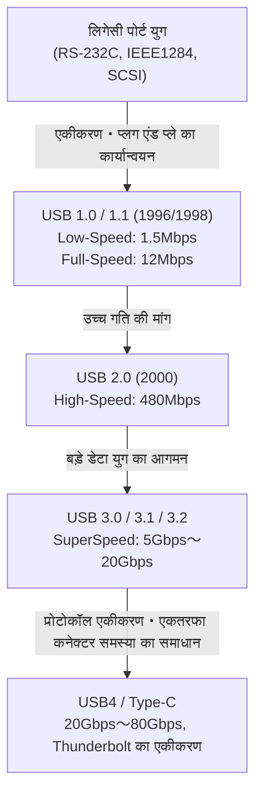

# USB का इतिहास: एकतरफा कनेक्टर्स से USB-C तक का विकास क्यों हुआ

## 1. प्रस्तावना: लिगेसी पोर्ट्स द्वारा लाई गई अराजकता और उपयोगकर्ताओं की पीड़ा

हम जिस "USB (Universal Serial Bus)" का आज बिना सोचे-समझे उपयोग करते हैं, उसके आने से पहले, 1980 के दशक के अंत से 1990 के दशक के शुरुआती दौर में पर्सनल कंप्यूटर का पिछला हिस्सा पूरी तरह से अराजक (अव्यवस्थित) था। आधुनिक पीसी और मैक के साफ-सुथरे इंटरफेस वाले स्मार्ट लुक से विपरीत, उस समय अनगिनत प्रकार के पोर्ट्स एक साथ मौजूद थे, जो उपयोगकर्ताओं को भारी भ्रम में डालते थे।

### सीरियल पोर्ट और पैरेलल पोर्ट की सीमाएँ
उस समय के प्रमुख इंटरफेस के रूप में, सबसे पहले "सीरियल पोर्ट (RS-232C)" का नाम आता है। इसका उपयोग मुख्य रूप से मॉडेम और माउस को जोड़ने के लिए किया जाता था। संचार गति बहुत धीमी थी, शुरुआती समय में केवल कुछ kbps से लेकर कुछ दसियों kbps तक। सेटिंग्स भी बेहद जटिल थीं; बॉड रेट, स्टॉप बिट, और पैरिटी बिट जैसे संचार प्रोटोकॉल के विस्तृत मापदंडों को अक्सर उपयोगकर्ता द्वारा ओएस या सॉफ्टवेयर में मैन्युअल रूप से सेट करना पड़ता था।

दूसरी ओर, प्रिंटर और स्कैनर जैसे उपकरणों को जोड़ने के लिए "पैरेलल पोर्ट (IEEE 1284 आदि)" का उपयोग किया जाता था। सेंट्रोनिक्स मानक से उत्पन्न यह पोर्ट एक ही समय में समानांतर रूप से कई बिट्स भेज सकता था, जिससे यह तत्कालीन सीरियल पोर्ट की तुलना में तेज था, लेकिन इसकी केबल मोटी, भारी और संभालने में बहुत कठिन थी। इसके अलावा, कनेक्टर स्वयं बहुत बड़ा था और पीसी के पीछे की सीमित जगह का एक बड़ा हिस्सा घेरता था।

### PS/2 पोर्ट और SCSI की बाधा
इनपुट इंटरफेस के रूप में "PS/2 पोर्ट" मौजूद था। IBM के Personal System/2 में अपनाए जाने के कारण इसका यह नाम पड़ा, जिसमें कीबोर्ड (बैंगनी) और माउस (हरा) के लिए दो अलग-अलग पोर्ट होते थे। इसकी सबसे बड़ी खामी "हॉट स्वैपिंग (लाइव इंसर्शन/एक्सट्रैक्शन)" का समर्थन न करना था। यानी, यदि पीसी चालू होने पर आप माउस निकालते और फिर से लगाते, तो वह पहचाना नहीं जाता, और सबसे खराब स्थिति में, मदरबोर्ड का नियंत्रक भौतिक रूप से जल भी सकता था।

इसके अलावा, बाहरी हार्ड डिस्क, उच्च प्रदर्शन वाले स्कैनर, और MO ड्राइव जिनके लिए तेज़ डेटा ट्रांसफर की आवश्यकता थी, उनमें "SCSI (Small Computer System Interface)" का उपयोग किया जाता था। SCSI बहुत उच्च प्रदर्शन वाला था, लेकिन डेज़ी चेन कनेक्शन स्थापित करते समय "टर्मिनेटर (टर्मिनेटिंग रेसिस्टर)" का भौतिक कनेक्शन, और प्रत्येक डिवाइस के लिए अद्वितीय "SCSI ID" असाइन करने जैसी तकनीकी जानकारी होना आवश्यक था। एक गलत सेटिंग भी पूरे सिस्टम को फ्रीज करने का कारण बन सकती थी; यह एक बहुत सख्त मानक था।

इस प्रकार, प्रत्येक परिधीय उपकरण के लिए टर्मिनलों के आकार भिन्न थे, सेटिंग्स जटिल थीं, और IRQ (इंटरप्ट रिक्वेस्ट), DMA (डायरेक्ट मेमोरी एक्सेस), और I/O एड्रेस के टकराव से संबंधित समस्याएं रोज़मर्रा की बात थीं। हर बार नया उपकरण खरीदने पर उपयोगकर्ताओं को मोटे मैनुअल के साथ संघर्ष करना पड़ता था, और कभी-कभी पीसी का केस खोलकर चिमटी की मदद से विस्तार कार्ड के जम्पर पिन सेट करने पड़ते थे—एक ऐसी पीड़ा जिसकी आज कल्पना भी नहीं की जा सकती।

## 2. "प्लग एंड प्ले" का सपना और USB 1.0 का जन्म

इस दर्दनाक स्थिति को दूर करने और एक ऐसी दुनिया बनाने के लिए जहां कोई भी आसानी से पीसी का विस्तार कर सके, आईटी उद्योग के दिग्गज आगे आए। इंटेल के अजय भट्ट (Ajay Bhatt) की टीम के विचार से, 7 कंपनियों—Compaq, Microsoft, IBM, DEC, Nortel, NEC—का एक समूह बना, जिसने USB इम्प्लीमेंटर्स फोरम (USB-IF) का आधार तैयार किया। और अंततः 1996 में, "USB 1.0" मानक की आधिकारिक घोषणा की गई।

### "Universal" का असली उद्देश्य
जैसा कि इसके नाम "Universal (सार्वभौमिक)" से पता चलता है, USB का सबसे बड़ा लक्ष्य सभी उपकरणों को एक ही मानक और एक ही कनेक्टर आकार में एकीकृत करना था। और सबसे अधिक जोर "प्लग एंड प्ले (Plug and Play)" तथा "हॉट स्वैप (Hot Swap)" को साकार करने पर था। पीसी चालू रहने के दौरान भी उपयोगकर्ता स्वतंत्र रूप से केबल को लगा और निकाल सकते हैं, और ओएस स्वचालित रूप से डिवाइस को पहचानकर ड्राइवर इंस्टॉल कर लेगा। उपयोगकर्ताओं को जटिल सेटिंग्स के बारे में चिंता करने की आवश्यकता नहीं होगी। यही USB का अंतिम दृष्टिकोण था।

### USB 1.0/1.1 के विनिर्देश और अपनाने में बाधाएँ
USB 1.0 में संचार गति के दो तरीके परिभाषित किए गए थे:
* **Low-Speed (1.5 Mbps)**: मुख्य रूप से कीबोर्ड और माउस जैसे उपकरणों के लिए, जहां डेटा ट्रांसफर कम होता है और थोड़ी देरी कोई बड़ी समस्या नहीं होती।
* **Full-Speed (12 Mbps)**: प्रिंटर, बाहरी स्टोरेज, और ऑडियो उपकरणों के लिए।

आज के नजरिए से "12 Mbps" अविश्वसनीय रूप से धीमा है (1 सेकंड में केवल लगभग 1.5MB भेज सकता है), लेकिन यह तत्कालीन सीरियल पोर्ट (जैसे 115.2 kbps) की जगह लेने के लिए पर्याप्त से अधिक था। इसमें एक क्रांतिकारी आर्किटेक्चर भी अपनाया गया था जिससे 127 उपकरणों तक को ट्री (पेड़) संरचना में जोड़ा जा सकता था।

हालांकि, घोषणा के तुरंत बाद USB 1.0 का सफर आसान नहीं रहा। विंडोज 95 के शुरुआती संस्करणों में मूल रूप से USB समर्थन नहीं था, और बाद में OSR2.1 में समर्थन जोड़ा गया, लेकिन यह इतना अस्थिर था कि इसे "प्लग एंड प्ले" के बजाय "प्लग एंड प्रे (प्लग करो और प्रार्थना करो)" कहकर मजाक उड़ाया गया।

### Apple का फैसला: iMac ने लाई सफलता
USB के दुनिया भर में सचमुच लोकप्रिय होने का एक निर्णायक क्षण 1998 में विंडोज 98 का रिलीज (जिसमें USB समर्थन में भारी सुधार हुआ) था, और उससे भी ज्यादा उसी साल Apple द्वारा पेश किया गया पहला "iMac (बोंडी ब्लू)" था।

स्टीव जॉब्स के नेतृत्व में Apple ने फ्लॉपी डिस्क ड्राइव के साथ-साथ पारंपरिक Macintosh में उपयोग किए जाने वाले ADB (Apple Desktop Bus), सीरियल पोर्ट और SCSI पोर्ट जैसे सभी लिगेसी इंटरफेस को बेरहमी से हटा दिया, और बाहरी विस्तार पोर्ट को पूरी तरह से "सिर्फ USB" तक सीमित करने का बेहद कट्टरपंथी निर्णय लिया।
उस समय बाजार में USB संगत उपकरण लगभग ना के बराबर थे, इसलिए उद्योग ने इस निर्णय की कड़ी आलोचना की। हालांकि, जब iMac एक वैश्विक ब्लॉकबस्टर हिट बन गया, तो पेरिफेरल निर्माताओं ने अपने अस्तित्व के लिए तुरंत USB संगत उत्पाद विकसित करना शुरू कर दिया। नतीजतन, यह माना जाता है कि Apple के इस दबंग निर्णय ने USB के प्रसार को कई साल तेज कर दिया। उसी वर्ष, बग फिक्स और बेहतर अनुकूलता के साथ "USB 1.1" जारी किया गया, जिसने मानक के रूप में इसकी नींव मजबूत की।

## 3. गति की क्रांति और स्वर्ण युग: USB 2.0 का शासन

अप्रैल 2000 में घोषित "USB 2.0" USB के इतिहास की सबसे बड़ी सफलताओं में से एक था, और यह आज तक का सबसे लंबा और व्यापक रूप से इस्तेमाल किया जाने वाला महान मानक बना हुआ है।

अधिकतम संचार गति को "High-Speed (480 Mbps)" तक बढ़ा दिया गया था, जो USB 1.1 की फुल-स्पीड (12 Mbps) की तुलना में एकमुश्त 40 गुना की नाटकीय छलांग थी। गति में यह वृद्धि केवल कागज़ों पर एक संख्या का खेल नहीं थी, बल्कि इसमें लोगों के डिजिटल जीवन को मौलिक रूप से बदलने की शक्ति थी।

### बड़ी क्षमता वाले उपकरणों का व्यावसायीकरण
480 Mbps बैंडविड्थ मिलने से बड़े क्षमता वाले उपकरण, जो पहले USB के माध्यम से अवास्तविक थे, एक के बाद एक व्यावहारिक रूप से उपयोग में आने लगे।
बाहरी हार्ड ड्राइव, CD-R/RW और DVD ड्राइव, मल्टी-मेगापिक्सेल उच्च-गुणवत्ता वाले डिजिटल कैमरों का डेटा ट्रांसफर, टीवी ट्यूनर और उच्च-गुणवत्ता वाले ऑडियो इंटरफेस USB के माध्यम से सुचारू रूप से काम करने लगे। इनमें से "USB मेमोरी (फ्लैश ड्राइव)" की विस्फोटक लोकप्रियता ने फ्लॉपी डिस्क और MO डिस्क जैसे लिगेसी रिमूवेबल मीडिया को पूरी तरह से अतीत का हिस्सा बना दिया।

साथ ही, USB 2.0 ने पूर्ण रूप से पश्चगामी संगतता (बैकवर्ड कम्पैटिबिलिटी) बनाए रखी, जिसका अर्थ है कि यदि आप USB 1.1 उपकरण को जोड़ते हैं, तो वह बिना किसी समस्या के काम करेगा। इस अवधि के दौरान, USB पीसी की दुनिया से बाहर निकलकर टीवी, डीवीडी/बीडी रिकॉर्डर, होम वीडियो गेम कंसोल, कार नेविगेशन सिस्टम जैसे लगभग सभी इलेक्ट्रॉनिक उपकरणों में "वास्तविक यूनिवर्सल मानक" के रूप में स्थापित हो गया।

## 4. मानकों का भ्रम और कनेक्टर्स की त्रासदी: मोबाइल युग का आगमन और Micro-B

USB 2.0 की सफलता के साथ, यह लगने लगा कि सभी उपकरणों को USB के माध्यम से जोड़ने का सपना पूरा हो गया है। हालांकि, मोबाइल उपकरणों (मोबाइल फोन, डिजिटल कैमरा, MP3 प्लेयर आदि) के छोटे और पतले होने की नई लहर ने USB कनेक्टर के आकार में एक गंभीर समस्या पैदा कर दी।

### Type-A और Type-B के बीच भूमिकाओं का विभाजन
मूल USB डिजाइन दर्शन के अनुसार, एक सख्त नियम था कि होस्ट साइड (पीसी आदि, जो नियंत्रण करते हैं) "Type-A (चपटा आयताकार)" कनेक्टर का उपयोग करेगा, और डिवाइस साइड (प्रिंटर और स्कैनर, जो नियंत्रित होते हैं) "Type-B (लगभग वर्गाकार आकार)" कनेक्टर का उपयोग करेगा। इसने उपयोगकर्ताओं को गलती से दो पीसी को एक केबल से सीधे जोड़ने से भौतिक रूप से रोका, जिससे शॉर्ट सर्किट या खराबी हो सकती थी।

### छोटे कनेक्टर्स की भरमार
हालांकि, Type-B कनेक्टर प्रिंटर जैसे बड़े उपकरणों के लिए उपयुक्त था, लेकिन यह मोबाइल फोन और पतले डिजिटल कैमरों में उपयोग के लिए बहुत विशाल था। इसलिए, छोटे आकार के लक्ष्य के साथ "Mini-A" और "Mini-B" को मानकीकृत किया गया। विशेष रूप से Mini-B डिजिटल कैमरों और शुरुआती पोर्टेबल हार्ड ड्राइव में व्यापक रूप से लोकप्रिय हुआ।
लेकिन जैसे-जैसे डिवाइस और पतले होते गए, Mini-B को भी मोटा और बोझिल माना जाने लगा। 2007 में, और भी पतले और अधिक टिकाऊ "Micro-A" और "Micro-B" पेश किए गए।

विशेष रूप से "Micro-B" ने भारी लोकप्रियता हासिल की, जो तेजी से बढ़ते एंड्रॉइड स्मार्टफोन और अन्य मोबाइल उपकरणों के लिए चार्जिंग और डेटा संचार के वैश्विक मानक कनेक्टर के रूप में हावी हो गया। यूरोप में, पर्यावरण संरक्षण (ई-कचरा कम करने) के दृष्टिकोण से मोबाइल फोन के चार्जिंग टर्मिनलों को माइक्रो-यूएसबी तक मानकीकृत करने का भारी दबाव था, जिसने इसके प्रसार को और बढ़ावा दिया।

### श्रोडिंगर का USB: "एकतरफा समस्या" जिसने मानवता को परेशान किया
यहाँ जो सबसे बड़ी त्रासदी हुई, वह मानव इतिहास में गहराई से उकेरी जाने वाली "USB की एकतरफा समस्या (सही दिशा खोजने की समस्या)" थी।
मानक Type-A और छोटे Micro-B दोनों का आकार ऊपर और नीचे से असममित (Asymmetrical) था, जिसका अर्थ है कि उन्हें केवल एक सही दिशा में डाला जा सकता था। हालांकि, उनका डिज़ाइन ऐसा था कि "पहली नज़र में यह बताना बहुत मुश्किल था कि कौन सा भाग ऊपर है।"

"इसे डालने की कोशिश करें लेकिन प्रतिरोध महसूस हो → इसे पलट कर डालें लेकिन यह अभी भी फिट न हो → इसे फिर से पलटें, और किसी तरह यह आसानी से अंदर चला जाए"

यह समझ से बाहर घटना पूरी दुनिया में "USB का सुपरपोजिशन (क्वांटम सुपरपोजिशन)" या "4-आयामी कनेक्टर" जैसे मीम्स का रूप ले चुकी थी, जिससे लोगों का कीमती समय और मानसिक ऊर्जा बर्बाद होती थी। इसे जबरदस्ती उल्टा डालने से स्मार्टफोन की तरफ के पोर्ट के टूटने जैसी दुखद दुर्घटनाएं भी अक्सर होती थीं। यहां तक कि USB के निर्माता अजय भट्ट ने भी बाद के एक साक्षात्कार में कहा था, "हमें इसे शुरू से ही रिवर्सिबल (दोनों तरफ से काम करने वाला) बनाना चाहिए था, लेकिन उस समय लागत कम करने के लिए इसे एकतरफा बनाना हमारी मजबूरी थी," उन्होंने इस समस्या के प्रति अपना पछतावा और विकास के समय की दुविधा साझा की।

## 5. SuperSpeed का आगमन और नामकरण के नियम में भ्रम: USB 3.x सीरीज़

2000 के दशक के उत्तरार्ध में, HD-गुणवत्ता वाले वीडियो डेटा और बड़े गेम डेटा जैसी फाइलों का आकार टेराबाइट्स तक पहुंच गया, जिससे USB 2.0 का 480 Mbps भी स्पष्ट रूप से धीमा महसूस होने लगा।
इसलिए 2008 में "USB 3.0" की घोषणा की गई।

### नीला कनेक्टर और SuperSpeed
USB 3.0 की अधिकतम संचार गति को "SuperSpeed (5 Gbps)" का नाम दिया गया, जो USB 2.0 के 10 गुना से अधिक की जबरदस्त बैंडविड्थ प्रदान करता था।
भौतिक संरचना के संदर्भ में, पारंपरिक USB 2.0 तक के 4 पिनों (Power, GND, D+, D-) के अलावा, इसने हाई-स्पीड डेटा ट्रांसफर (2 ट्रांसमिटिंग, 2 रिसीविंग, और 1 GND) के लिए 5 नए पिन जोड़कर 9-पिन संरचना अपनाई।
इसकी सबसे बड़ी बाहरी विशेषता यह थी कि इसे पुराने टर्मिनलों से अलग करने के लिए, कनेक्टर के अंदर का प्लास्टिक भाग "नीला (Pantone 300C)" निर्दिष्ट किया गया था। इससे उपयोगकर्ताओं को यह सहज रूप से समझने में मदद मिली कि "यदि आप नीले टर्मिनलों को नीली केबल से जोड़ते हैं, तो यह तेज़ होगा।"

### नामकरण में भटकाव
हालांकि, तकनीकी सफलता के बावजूद, USB-IF के मार्केटिंग विभाग ने बार-बार नाम बदलकर उपभोक्ताओं और पीसी उद्योग को गहरे भ्रम में डाल दिया।

* **2013**: "USB 3.1" की घोषणा की गई, जिससे गति 10 Gbps (SuperSpeed+) तक बढ़ गई। यहाँ तक सब ठीक था, लेकिन साथ ही उन्होंने पुराने USB 3.0 (5 Gbps) का नाम बदलकर "USB 3.1 Gen 1" कर दिया, और नए 10 Gbps को "USB 3.1 Gen 2" का नाम दे दिया।
* **2017**: "USB 3.2" की घोषणा की गई, जिसने गति को 20 Gbps तक बढ़ा दिया। और फिर से, पिछले मानकों के नाम बदल दिए गए, 5 Gbps को "USB 3.2 Gen 1", 10 Gbps को "USB 3.2 Gen 2", और नए 20 Gbps को "USB 3.2 Gen 2x2" कहने का निर्णय लिया गया।

परिणामस्वरूप, भले ही किसी इलेक्ट्रॉनिक्स स्टोर में एक उत्पाद के पैकेज पर गर्व से "USB 3.2 संगत!" लिखा हो, सामान्य उपभोक्ता—और यहां तक कि विशेषज्ञ भी—जब तक स्पेसिफिकेशन शीट को ध्यान से नहीं पढ़ते, वे यह नहीं बता सकते थे कि यह 5 Gbps था या 20 Gbps। इसने एक मानक के रूप में इसकी विश्वसनीयता को नुकसान पहुँचाया, जो एक अत्यंत बुरी स्थिति थी।

## 6. परम कनेक्टर "Type-C" और चार्जिंग क्रांति "Power Delivery"

कनेक्टर्स के प्रसार से पैदा हुई जटिलता, एकतरफा डालने की झुंझलाहट, और जटिल संस्करण नामों को एक ही बार में हल करने के लिए, USB-IF ने अपनी सारी ताकत झोंक दी और 2014 में "USB Type-C (USB-C)" की घोषणा की, जिसे USB इतिहास का शिखर कहा जा सकता है।

### 3 क्रांतियां जो Type-C लाया
Type-C केवल कनेक्टर का नया आकार नहीं था, बल्कि इसमें 3 नवीन विशेषताएँ थीं जिन्होंने कंप्यूटिंग के तरीके को बदल दिया।

1. **रिवर्सिबल संरचना की प्राप्ति**
   कनेक्टर के अंदर पिन लेआउट (24 पिन) को सममित रूप से रखकर, इसे किसी भी दिशा में (ऊपर या नीचे) प्लग करना संभव हो गया। "श्रोडिंगर का USB समस्या" जो मानवता को वर्षों से परेशान कर रही थी, अंततः पूरी तरह से हल हो गई। कनेक्टर खुद Micro-B जितना ही कॉम्पैक्ट था, जिससे इसे अल्ट्रा-थिन स्मार्टफोन से लेकर बड़े डेस्कटॉप पीसी तक किसी भी डिवाइस में लगाया जा सकता था।
2. **होस्ट और डिवाइस के बीच का अंतर समाप्त होना और CC पिन**
   Type-A और Type-B के बीच भौतिक अंतर को समाप्त कर दिया गया, और दोनों सिरों पर Type-C वाली केबल को मानक बना दिया गया। आप किस सिरे को कहाँ लगाते हैं, इससे कोई फर्क नहीं पड़ता। इसे संभव बनाने के लिए, Type-C में संचार के लिए एक नया "CC (Configuration Channel)" पिन जोड़ा गया, और एक स्मार्ट तंत्र पेश किया गया जो उपकरणों को जुड़ते ही अत्यधिक बातचीत (संचार प्रोटोकॉल के माध्यम से बातचीत) करने की अनुमति देता है कि "होस्ट कौन है और डिवाइस कौन है" और "बिजली किस दिशा में भेजी जानी चाहिए"।
3. **अल्टरनेट मोड (Alternate Mode)**
   USB डेटा संचार के अलावा, अन्य कंपनियों के प्रोटोकॉल को भी Type-C केबल से प्रवाहित किया जा सकता है। इसका एक विशिष्ट उदाहरण "DisplayPort Alternate Mode" है। यह पीसी से मॉनिटर तक उच्च-रिज़ॉल्यूशन वीडियो सिग्नल को एक ही Type-C केबल के माध्यम से बिना समर्पित HDMI या DisplayPort केबल के आउटपुट करने की अनुमति देता है।

### USB Power Delivery (USB PD) के साथ पावर क्रांति
Type-C की क्षमता को उसकी सीमा तक ले जाने वाला "USB Power Delivery (USB PD)" नामक चार्जिंग मानक था, जो उसी समय विकसित हुआ।
शुरुआती USB 1.0/2.0 की बिजली आपूर्ति क्षमता मात्र 2.5W (5V/0.5A) थी, जो एक माउस या कीबोर्ड को चलाने के लिए मुश्किल से पर्याप्त थी। यहां तक कि USB 3.0 में यह 4.5W (5V/0.9A) थी, जिससे स्मार्टफोन की फास्ट चार्जिंग भी मुश्किल थी।

हालांकि, USB PD ने "100W" (अधिकतम 20V/5A) जैसी विशाल बिजली की आपूर्ति करना संभव बना दिया। इसके अलावा, 2021 में "USB PD EPR (Extended Power Range)" अपडेट के साथ, इसे "240W" (अधिकतम 48V/5A) तक बढ़ा दिया गया।
100W से 240W तक की शक्ति न केवल स्मार्टफोन और टैबलेट की फास्ट चार्जिंग के लिए, बल्कि मैकबुक प्रो और गेमिंग पीसी जैसे उच्च शक्ति वाले हाई-एंड लैपटॉप चलाने के लिए, और यहां तक कि बड़े एलसीडी मॉनिटर को भी बिजली देने के लिए पर्याप्त है।

"वीडियो आउटपुट से लैस एक मॉनिटर से, आप एक ही Type-C केबल के जरिए लैपटॉप को वीडियो भेज सकते हैं और साथ ही मॉनिटर से भारी मात्रा में बिजली लेकर लैपटॉप को चार्ज कर सकते हैं।"
वह वातावरण जिसे कभी पावर केबल, वीडियो केबल और डेटा USB केबल—यानी 3 केबलों की आवश्यकता होती थी—अब सिर्फ एक Type-C केबल से पूरा हो जाता है। इसने कार्यालय के वातावरण और रिमोट वर्क में बेहतरीन स्मार्टनेस हासिल की।

## 7. एक शक्तिशाली प्रतिद्वंद्वी "Thunderbolt" के साथ ऐतिहासिक विलय

USB के विकास के इतिहास के बारे में बात करते समय एक और चीज जिसे छोड़ा नहीं जा सकता है, वह है "Thunderbolt" का अस्तित्व।
Thunderbolt एक अल्ट्रा-हाई-स्पीड इंटरफेस मानक है जिसे Intel और Apple ने संयुक्त रूप से विकसित किया है। मूल रूप से इसे "Light Peak" कोडनेम से जाना जाता था और इसे ऑप्टिकल फाइबर का उपयोग करने की योजना थी, लेकिन लागत के मुद्दों के कारण इसे 2011 में "Thunderbolt 1" के रूप में तांबे के तारों के आधार पर पेश किया गया।

### विभिन्न डिजाइन दर्शन
जबकि USB का लक्ष्य "विभिन्न परिधीय उपकरणों को आसानी से और सस्ते में जोड़ना" था, Thunderbolt ने एक अत्यंत शक्तिशाली और उच्च-प्रदर्शन दृष्टिकोण अपनाया जिसने "पीसी के आंतरिक PCI Express बस और वीडियो आउटपुट (DisplayPort) को सीधे बाहर निकाल दिया।" इसलिए, इसका उपयोग पेशेवर अनुप्रयोगों में किया गया, जिन्हें USB की लेटेंसी (देरी) और बैंडविड्थ सीमाओं के कारण बाहरी GPU या अल्ट्रा-हाई-स्पीड RAID स्टोरेज के साथ हासिल करना असंभव था।

प्रारंभ में, Thunderbolt 1 और 2 ने Mini DisplayPort के समान ही टर्मिनल आकार का उपयोग किया और मैक के एक विशेष फीचर के रूप में विकसित हुए। हालांकि, यह देखकर कि विंडोज पीसी पर इसे अपनाने की गति बहुत धीमी है, Intel को चिंता हुई और उसने 2015 में "Thunderbolt 3" के साथ एक ऐतिहासिक निर्णय लिया: कनेक्टर के आकार को उसके अनूठे रूप से बदलकर "USB Type-C" कर दिया गया।

### Type-C का भ्रम और एकीकरण का मार्ग
कनेक्टर को Type-C में एकीकृत करने से सुविधा तो बढ़ी, लेकिन साथ ही इसने एक नए, गहरे और अदृश्य भ्रम को जन्म दिया जो पिछले टर्मिनलों की भरमार से कहीं अलग था: "भले ही Type-C पोर्ट और केबल बाहर से बिल्कुल एक जैसे दिखते हों, लेकिन अंदर संचार प्रोटोकॉल या तो USB हो सकता है या Thunderbolt 3। और इनमें आपस में संगतता हो भी सकती है और नहीं भी।"

इस अत्यंत जटिल स्थिति को जड़ से हल करने के लिए, Intel ने 2019 में एक आश्चर्यजनक कदम उठाया और Thunderbolt 3 के प्रोटोकॉल स्पेसिफिकेशन को USB-IF को "मुफ्त (दान के रूप में)" प्रदान किया।
Intel द्वारा प्रदान की गई इस तकनीक के आधार पर तैयार किया गया अगली पीढ़ी का मानक "USB4" है।

### USB4: परम एकीकृत मानक
USB4 के आगमन के साथ, USB और Thunderbolt का नाम और वास्तविकता दोनों में "विलय" हो गया। USB4 मानक के रूप में 40 Gbps तक की अधिकतम संचार गति का दावा करता है (नवीनतम USB4 Version 2.0 के साथ 80 Gbps, और असममित मोड में 120 Gbps तक पहुंचता है), और आधिकारिक तौर पर PCIe टनेलिंग का समर्थन करता है।
दूसरे शब्दों में, "बाहरी GPU को जोड़ना", जो कभी Thunderbolt का विशेषाधिकार था, अब USB मानक के रूप में उपलब्ध हो गया। उसी समय, "USB 3.2 Gen 2x2" जैसे भ्रमित करने वाले नामों को समाप्त कर दिया गया, और ब्रांड नामों को गति दर्शाने वाले "USB 40Gbps" जैसे नाम पर वापस लाने का प्रयास शुरू हुआ।

## 8. पर्यावरण नियमन और भविष्य: Type-C का प्रभुत्व और भविष्य की चुनौतियां

USB का विकास केवल तकनीकी दृष्टि से ही नहीं, बल्कि राजनीतिक और पर्यावरणीय दृष्टिकोण से भी एक बड़े मोड़ पर आ गया है।

### यूरोपीय संघ (EU) का चार्जिंग पोर्ट एकीकरण कानून
2022 में, यूरोपीय संघ (EU) की संसद ने एक कानून पारित किया जिसमें स्मार्टफोन, टैबलेट और डिजिटल कैमरे जैसे छोटे इलेक्ट्रॉनिक उपकरणों के लिए चार्जिंग पोर्ट को "USB Type-C पर एकीकृत" करना अनिवार्य कर दिया गया। इस कानून का मुख्य उद्देश्य उपभोक्ताओं को हर डिवाइस के लिए अलग केबल या चार्जर खरीदने की बर्बादी से बचाना और प्रति वर्ष उत्पन्न होने वाले हजारों टन "ई-कचरे (E-waste)" को कम करना है।

इस नियमन का सबसे बड़ा लक्ष्य Apple का iPhone था, जिसने लंबे समय तक अपने स्वामित्व वाले "Lightning" पोर्ट का इस्तेमाल किया था। Apple ने "यह नवाचार को बाधित करेगा" कहकर इसका विरोध किया, लेकिन अंततः वे विशाल यूरोपीय संघ के बाजार को नजरअंदाज नहीं कर सके, और 2023 में जारी iPhone 15 सीरीज़ में, उन्होंने अंततः Lightning को हटाकर USB Type-C को अपना लिया।
परिणामस्वरूप, एक "पूर्ण विश्व प्रभुत्व" हासिल किया गया है जहां एंड्रॉइड, iPhone, मैक, विंडोज पीसी, आईपैड, निन्टेंडो स्विच और वायरलेस इयरफ़ोन जैसे लगभग सभी बैटरी-संचालित उपकरण जिनका हम प्रतिदिन उपयोग करते हैं, उन्हें एक ही Type-C केबल से चार्ज किया जा सकता है।

### शेष चुनौतियाँ: केबल लॉटरी
चूंकि हार्डवेयर टर्मिनलों को Type-C में एकीकृत कर दिया गया है, सुविधा चरम पर पहुँच गई है। हालांकि, भविष्य की सभी चुनौतियां अभी खत्म नहीं हुई हैं।
वर्तमान में, जो समस्या उपयोगकर्ताओं को सबसे ज्यादा परेशान कर रही है, उसे "केबल लॉटरी (केबल गचा)" कहा जाता है।

भले ही केबल के दोनों सिरों पर Type-C हो, लेकिन अंदरूनी संरचना (निर्मित eMarker चिप की उपस्थिति या अनुपस्थिति, या कनेक्टेड कोर वायर की संख्या) के आधार पर प्रदर्शन में भारी अंतर होता है:
* एक बेहद पतली केबल जो केवल चार्जिंग का समर्थन करती है और डेटा ट्रांसफर USB 2.0 (480 Mbps) तक सीमित है।
* एक केबल जो 60W चार्जिंग को सपोर्ट करती है लेकिन वीडियो आउटपुट का समर्थन नहीं करती है।
* एक बहुत मोटी, छोटी और महंगी Thunderbolt 4 केबल जो 100W (या 240W) चार्जिंग, 40Gbps डेटा कम्युनिकेशन, और 8K वीडियो आउटपुट का समर्थन करती है।

चूंकि वे बाहर से बिल्कुल एक जैसे दिखते हैं, लेकिन उनका प्रदर्शन पूरी तरह से भिन्न होता है, इसलिए उपयोगकर्ताओं को केबल के पैकेज या टर्मिनल भाग पर छोटे अक्षरों में छपे लोगो को ध्यान से देखना पड़ता है ताकि उनकी पहचान की जा सके। यह एक विडंबनापूर्ण वास्तविकता है कि "टर्मिनल को एकीकृत करने के परिणामस्वरूप केबल के अंदरूनी हिस्से में अराजकता पैदा हुई।"

## 9. निष्कर्ष: यूनिवर्सल (सार्वभौमिक) की ओर एक अंतहीन यात्रा

1996 में, पीसी की दुनिया में अनगिनत अलग-अलग पोर्ट्स से भरे पिछले हिस्से और IRQ के टकराव से जूझते हुए, USB का जन्म एक भव्य सपने के साथ हुआ था: "सब कुछ को जोड़ने के लिए केवल एक सार्वभौमिक टर्मिनल।"

उसकी यात्रा कभी आसान नहीं रही। गति की कमी के कारण समझौता, छोटे कनेक्टर की वजह से फैली अव्यवस्था, एकतरफा समस्या की झुंझलाहट, मार्केटिंग की गलतियों के कारण नामकरण में भ्रम, और एक शक्तिशाली प्रतिद्वंद्वी Thunderbolt के साथ इसका जटिल संबंध।
हालांकि, हर बार USB ने आईटी उद्योग की बुद्धिमत्ता को एक साथ लाया, अनुकूलता बनाए रखते हुए (और कभी-कभी खुद পণ্ডিতता रूप से नकारते हुए) विकसित होना जारी रखा।

डेटा ट्रांसफर की गति 1.5 Mbps से बढ़कर 80 Gbps तक पहुँच गई है, जो हजारों गुना है, और बिजली आपूर्ति 2.5W से बढ़कर 240W हो गई है, जो लगभग 100 गुना अधिक है। और Type-C के रूप में एक उत्कृष्ट भौतिक और कार्यात्मक "पात्र" पाकर, USB ने आखिरकार 25 वर्षों बाद अपनी स्थापना के समय देखे गए "Universal" के आदर्श को वास्तविकता बना दिया है।

भले ही अगली पीढ़ी के मानकों का नाम कुछ भी हो और वे कितनी भी गति प्राप्त करें, इसमें कोई संदेह नहीं है कि भद्दे और अनावश्यक केबलों का ढेर हमारे डेस्क से गायब हो जाएगा, और एक सरल, अधिक शक्तिशाली, और अधिक परिष्कृत कनेक्शन अनुभव प्रदान किया जाता रहेगा। एकतरफा और असुविधाजनक कनेक्टर्स से USB-C तक का विकास निस्संदेह आईटी हार्डवेयर के इतिहास में सबसे महान यात्राओं में से एक है, जहां मानवता ने सुविधा और तर्कसंगतता को आगे बढ़ाना जारी रखा है।
