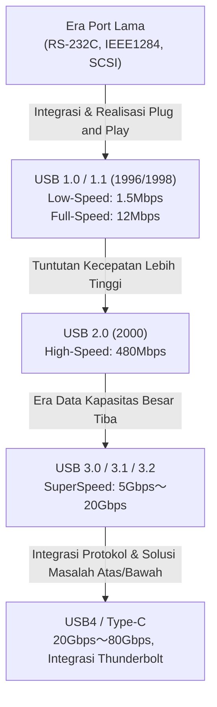

# Sejarah USB: Mengapa Berevolusi dari Port Asimetris ke USB-C

## 1. Pendahuluan: Kekacauan Port Lama dan Penderitaan Pengguna

Sebelum antarmuka "USB (Universal Serial Bus)" yang kini kita gunakan secara lumrah mulai hadir, bagian belakang komputer pribadi pada akhir 1980-an hingga awal 1990-an benar-benar kacau balau. Berbeda dari penampilan PC maupun Mac modern masa kini yang memiliki antarmuka ramping dan rapi, pada masa itu terdapat begitu banyak port yang berdesakan dengan beragam jenis, sehingga memicu kebingungan bagi para pengguna.

### Keterbatasan Port Serial dan Port Paralel
Sebagai antarmuka yang mewakili masa itu, yang pertama dapat disebutkan adalah "Port Serial (RS-232C)". Port ini utamanya dimanfaatkan untuk menyambungkan modem dan mouse. Kecepatan komunikasinya teramat pelan, versi-versi awal hanya beroperasi di kisaran beberapa kbps hingga puluhan kbps. Pengaturannya pun sungguh rumit, pengguna tak jarang diwajibkan menyetel parameter detail dari protokol komunikasi semacam baud rate, stop bit, dan parity bit secara manual pada OS maupun perangkat lunak.

Di sisi lain, untuk menghubungkan alat seperti printer dan pemindai, digunakanlah "Port Paralel (misal IEEE 1284)". Port yang berakar dari standar Centronics ini bisa mengirimkan beberapa bit secara paralel (bersamaan), sehingga terhitung lebih kencang dibanding port serial di eranya, tetapi kabelnya tebal, berbobot berat, dan sungguh merepotkan penempatannya. Di samping itu, ukuran konektornya sendiri sangat besar, banyak memakan ruang terbatas di sisi belakang PC.

### Port PS/2 dan Hambatan SCSI
Sebagai antarmuka input, tersedia "Port PS/2". Istilah ini diturunkan sejak digunakan pada IBM Personal System/2, dimana terdapat dua jenis yang disediakan yakni untuk keyboard (warna ungu) serta untuk mouse (warna hijau). Kekurangan utamanya yakni ia tak mendukung fitur "Hot Swap" (cabut pasang selagi menyala). Ini berarti, andai kita mencabut mouse saat PC tengah menyala lalu menyolokkannya lagi, perangkat tak akan terdeteksi, bahkan pada insiden terburuk terdapat bahaya risiko fisikal yang sanggup menyebabkan hangus atau terbakarnya pengendali (controller) di motherboard.

Lebih jauh, perihal hard disk eksternal, pemindai canggih berperforma tinggi, dan drive MO yang mutlak menuntut transfer data kecepatan super, antarmuka "SCSI (Small Computer System Interface)" lazim diterapkan. Meskipun SCSI luar biasa mutakhir, proses pengaturannya mensyaratkan wawasan teknis khusus semisal pemasangan wujud fisik "Terminator" tatkala melangsungkan susunan daisy-chain, beserta penetapan "SCSI ID" yang wajib unik (tak boleh bertabrakan antar piranti). Ia merupakan standar yang sangat keras di mana sebuah kekeliruan pengaturan kecil saja berpotensi menyebabkan keseluruhan sistem seketika membeku (freeze).

Seperti yang bisa dilihat, rupa colokan berlainan untuk masing-masing periferal, prosedur penyiapan amat kompleks, ditambah problem yang terus menerus menyergap efek konflik IRQ (Interrupt Request), DMA (Direct Memory Access), dan juga alamat I/O yang telah jadi asupan sehari-hari. Setiap kali konsumen menebus perangkat pendukung baru, mereka harus bertarung menghadapi buku panduan berlembar-lembar tebal, bahkan acap kali dipaksa mencopot pelindung bodi PC lalu memodifikasi letak jumper pin pada kartu ekspansi memakai alat jepit pinset—sebuah penderitaan keras yang nyaris tak bisa diimajinasikan sekarang.

## 2. Harapan "Plug and Play" dan Kelahiran USB 1.0

Demi mematahkan situasi naas ini, dan demi menciptakan sebuah semesta di mana semua orang dimampukan menambahi kapasitas PC-nya dengan sederhana, barisan raksasa dari jagat IT angkat bicara. Dikomandoi melalui gagasan dari kelompok yang dimotori oleh sosok Ajay Bhatt dari Intel, 7 entitas perusahaan (Compaq, Microsoft, IBM, DEC, Nortel, NEC) bersatu merajut grup formulasi standar awal yang menjadi benih dari pendirian USB Implementers Forum (USB-IF). Lantas pada tahun 1996, standar "USB 1.0" diproklamirkan resmi.

### Arti Sebenarnya dari "Universal" yang Dituju
Objektif terakbar USB adalah persis selayaknya disematkan pada istilah "Universal" (serba guna / universal), yakni menyatukan segenap periferal menuju satu standar tunggal beserta wujud sejenis rupa konektor. Selain itu yang dipandang paling krusial ialah terealisasinya konsep "Plug and Play" berserta "Hot Swap". Konsumen dibebaskan leluasa menarik colokan ataupun menancapkannya lagi di saat kondisi mesin PC beroperasi menyala, lantas OS akan otomatis membaca deteksi sang alat sekaligus menuntaskan tahapan pemasangan driver. Pengguna sungguh tak usah peduli soal aturan setup serba pelik secuil pun. Itulah impian paling mutlak yang diangkat tinggi-tinggi oleh kubu USB.

### Spesifikasi USB 1.0/1.1 dan Hambatan Adopsi
Pada generasi USB 1.0, disahkan sepasang mode tempo arus data:
* **Low-Speed (1.5 Mbps)**: Utamanya merujuk perangkat yang mengirim beban info tipis dan jedanya tak menyebabkan perkara serius semacam keyboard dan mouse.
* **Full-Speed (12 Mbps)**: Merujuk untuk printer, penyimpanan eksternal, hingga perlengkapan sistem audio.

Jika dipantau di zaman sekarang ukuran "12 Mbps" sukar dinalar lambatnya (sekitar 1.5MB per detiknya), tetapi di waktu itu tergolong cukup tangguh guna menggantikan port serial (misal 115.2 kbps). Lagi pula, USB pun memperkenalkan format arsitektur mutakhir di mana sanggup menyatukan sambungan hingga sebanyak 127 peranti tersusun mengurai mirip wujud pohon (tree).

Namun, peluncuran awal USB 1.0 belumlah lekas mengarungi rute lempang. Sistem Windows 95 edisi awal gagal menyokong USB sedari bawaannya, dan kendati kemudian diimbuhkan sebagai fungsi ekstra menyusul rilisnya edisi OSR2.1, operasi perjalanannya tidaklah menentu serta mengundang cibiran "Plug and Pray (Pasang dan Berdoalah)" bukan sekadar "Plug and Play".

### Keputusan Apple: Terobosan yang Dibawa oleh iMac
Faktor penggerak penentu yang mengantar kebersatuan USB sanggup merajalela melampaui benua ke dunia utuh, bertumpu di waktu perilisan Windows 98 di kurun 1998 (menandai lonjakan besar dalam kemampuan dukungan USB), beserta faktor mahapenting lainnya di tahun identik, yakni kemunculan perdana edisi original "iMac (Bondi Blue)" keluaran pabrikan Apple.

Bernaung di bawah kepemimpinan Steve Jobs, perusahaan Apple menyingkirkan tanpa sisa bermacam rentetan jenis interkoneksi uzur yang membalut lini Macintosh sebelumnya (ADB / Apple Desktop Bus, serial port, SCSI port) beserta pemusnahan unit kelengkapan disket floppy sedari awal pembuatan generasi iMac. Sebagai ganti, Apple banting setir menggunakan filosofi rancangan sangat revolusioner dan hanya menyisakan titik tancap periferal pada format "USB semata".
Ketika momen tersebut, perangkat USB nyaris tidak pernah beredar bebas di ruang pasar komersial, sontak saja gebrakan tersebut memantik caci maki tanpa ampun dari industri. Bagaimanapun, diiringi fakta mencatat pelonjakan popularitas menembus langit skala global yang dibuktikan iMac, industri rakitan periferal seketika kompak membalik haluan menelurkan aneka rupa perlengkapan berhaluan USB demi mempertaruhkan nafas kelangsungan perusahaan. Sebagai pamungkas hasil pertaruhan itu, keputusan Apple yang dirasa dipaksakan ini dihormati lantaran mendorong percepatan eksistensi jangkauan USB bermasa-masa tahun lebih pesat. Saat tahun yang setara "USB 1.1" dipasarkan bersama penyelarasan cacat dan perbaikan kecocokan (kompatibilitas), menancapkan jangkar mantap kualifikasi fondasi standarnya.

## 3. Revolusi Kecepatan dan Masa Keemasan: Kejayaan USB 2.0

Dipertontonkan pertama kali masuk di penghujung April 2000, "USB 2.0" menjelma ibarat titik terobosan termegah selama riwayat keberadaan USB, dan mencatatkan namanya jadi standarisasi paripurna unggul melalang buana bertahan dikonsumsi secara mayoritas lintas jangka awet hingga menit detik ini.

Laju komunikasi batas atas digas menembus "High-Speed (480 Mbps)", jika dibandingkan limit purna USB 1.1 (12 Mbps), lonjakannya menari-nari dahsyat di ambang 40 kali lipat. Pembenahan kecepatan kencang ini usahlah dikerdilkan selaku permainan retorika pada kertas, sebab ia seutuhnya mengantongi daya perombakan pondasi dasar dari aktivitas peradaban digital warga bumi.

### Praktikalisasi Perangkat Kapasitas Besar
Bermodalkan bentang lebar pita mencapai 480 Mbps, kumpulan peranti bermuatan bongsor yang dulu sama sekali utopis bila dikoneksikan ke USB mulai disulap masuk kategori lumrah direalisasikan.
Kini hal semisal keping memori hard disk eksternal, alat pemutar CD-R/RW ataupun piringan keping DVD, aktivitas mengirim data resolusi tinggi mahabesar dari perangkat kamera digital kelas megapiksel, dilanjutkan lagi eksistensi TV tuner plus perangkat pengatur audio mutu andal telah dipastikan beraksi kencang, luwes tanpa masalah dioperasikan memakai medium USB. Di barisan paling mencolok ada fenomena laju gila perluasan sarana penyimpan "USB flash drive (memori USB)", berhasil menjegal sepenuhnya kelangsungan piringan-piringan keping era usang layaknya disket dan modul MO menjadi peninggalan purba semata.

Lebih lanjut, konstruksi USB 2.0 dipuji habis-habisan karena berhasil memastikan perlindungan jaminan kompatibilitas mundur (backward compatibility). Kendati menyusupkan perangkat berformat USB 1.1, piranti akan patuh beroperasi mulus dan aman. Pada momen kurun itu, popularitas port USB telah tumpah melampaui lingkungan teritorial dimensi seputar PC. Ia segera menginvasi aneka piranti alat siar televisi, perekam DVD/BD, aneka sarana hiburan rupa gim dalam rumah, sistem navigasi mobil, plus seluruh aneka benda canggih mengokohkan tapaknya merengkuh takhta mulia bernama "Standar Universal Sejati".

## 4. Kekacauan Standar dan Tragedi Konektor: Tiba Era Mobile dan Micro-B

Didorong popularitas fenomenal dari USB 2.0, angan menyambungkan segala wujud gadget bermuara ke port USB layaknya hampir terkabul. Sayangnya, gejolak gelombang inovasi pengecilan (perangkat seluler layaknya ponsel, kamera digital, piranti MP3, dll) justru memantik krisis serius menghujam desain rupa ujung terminal USB.

### Pembagian Peran Type-A dan Type-B
Dalam filosofi desain awal USB, terdapat aturan ketat di mana konektor "Type-A (konstruksi memanjang tipis mendarat datar)" digunakan di sisi host (pengontrol, seperti PC), dan konektor "Type-B (persegi padat)" digunakan di sisi perangkat (yang dikontrol, seperti printer dan pemindai). Aturan disiplin tersebut mencegah pengguna secara fisik menghubungkan dua PC langsung dengan kabel yang sama, dengan tujuan mencegah risiko korsleting atau kerusakan mesin.

### Kekacauan Konektor Mini
Namun, meskipun Type-B cocok untuk peralatan gempal semacam printer, ukurannya amat jumbo buat menyisip pada ponsel genggam beserta tipisnya kamera digital. Oleh sebab itu dirumuskanlah "Mini-A" dan "Mini-B" demi tujuan miniaturisasi. Khususnya Mini-B yang sangat populer digunakan pada kamera digital dan awal kemunculan hard disk portabel.
Sayangnya, seiring perangkat terus dibuat setipis mungkin, bahkan konektor Mini-B pun mulai dianggap terlalu tebal dan mengganggu. Akhirnya pada tahun 2007, muncullah proklamasi desain "Micro-A" dan "Micro-B" dengan ketebalan yang lebih tipis disokong ketangguhan bahan awet andal.

Khususnya "Micro-B" memperoleh dominasi pasar absolut sebagai standar dunia konektor komunikasi data dan pengisian daya bagi ponsel cerdas Android yang sedang populer-populernya saat itu. Di Eropa, ada desakan melindungi lingkungan (mengurangi limbah elektronik) yang menekan standarisasi kabel pengisian telepon seluler agar selaras menuju Micro-USB, yang mana turut melecut ledakan tren kepopulerannya.

### USB Schrödinger: "Masalah Atas/Bawah" yang Mengganggu Umat Manusia
Akar pusaran duka terdalam yang terlahir saat situasi genting ini, dan lantas dipahat bertahta abadi membebani takdir manusia kelak disematkan julukan mahsyur "Dilema Permasalahan Atas/Bawah USB".
Baik wujud Type-A klasik ataupun Micro-B, masing-masing menyimpan desain asimetris atas dan bawah, dan semata-mata diizinkan merangsek sukses dalam arah yang tepat saja. Bencana utamanya adalah rupa fisiknya "sangat membingungkan mana atas dan mana bawah hanya dengan sekilas pandang."

"Mencoba mencolokkan namun terasa seret → Dibalik mencoba ditusuk sekali lagi tak juga muat → Menukar putaran balikan kedua kalinya, aneh bin ajaib mendadak masuk mulus ringan tanpa rintangan."

Gejala mistis ini di seluruh jejaring netizen dikonversi menjadi sajian meme internet yang menyebut fenomena ini "Superposisi Kuantum ala USB" ataupun "Konektor 4-Dimensi", yang sungguh mengoyak kewarasan jiwa manusia berikut menguras waktu berharga. Terjadi banyak kecelakaan tragis hancurnya terminal ponsel cerdas gara-gara pengguna memaksanya masuk terbalik. Penemu dari mahakarya USB sendiri, yakni Ajay Bhatt di wawancara tahun-tahun setelahnya, membicarakan dilemanya soal rintangan perancangan kala itu, "Seharusnya memang dirancang reversible (bisa dipasang dari kedua muka) sedari awal, tetapi gara-gara tuntutan mengurangi ongkos saat itu, dengan sangat terpaksa harus dirancang sepihak saja."

## 5. Kedatangan SuperSpeed dan Kekacauan Aturan Penamaan: Seri USB 3.x

Ketika memasuki pertengahan hingga akhir tahun 2000-an, ukuran file data menyentuh kapasitas menembus batas Terabyte menyangkut video HD dan data permainan game yang mahabesar, sehingga batas 480 Mbps yang dipunyai USB 2.0 mulai terlihat sangat kurang.
Sebagai responsnya, diluncurkanlah "USB 3.0" pada tahun 2008.

### Konektor Biru dan SuperSpeed
Kecepatan transfer data tertinggi USB 3.0 diberi nama "SuperSpeed (5 Gbps)", mencatatkan bandwidth menembus 10 kali lipat lebih dari USB 2.0.
Secara arsitektur fisik, selain 4 pin awal pendahulu USB 2.0 (Power, GND, D+, dan D-), diperkuat tambahan penempatan 5 pin ekstra murni untuk laju angkut data supercepat (2 untuk transmisi, 2 penerimaan, dan GND) menjadikan total struktur beranggota 9 pin.
Ciri khas penampilannya yang paling menonjol adalah diwajibkannya warna plastik dalam terminal diberikan corak "Biru (Pantone 300C)" agar dapat dibedakan dari yang lama. Berkat pedoman visual tersebut, pengguna bisa paham secara naluriah bahwa "Konektor bernuansa biru dihubungkan dengan kabel biru menghasilkan kecepatan yang amat tinggi".

### Penamaan yang Membingungkan
Walaupun meraih kesuksesan teknis yang memukau, di sisi lain departemen pemasaran dari USB-IF justru melakukan serangkaian perubahan sebutan nama yang tidak masuk akal, menyeret pabrikan PC beserta konsumen awam pada kebingungan masal yang kacau.

* **Tahun 2013**: Diadakan peluncuran meresmikan kehadiran "USB 3.1", mengusung peningkatan kelajuan 10 Gbps (SuperSpeed+). Sampai di sini segalanya baik. Sayangnya secara bersamaan, mereka mengubah merek USB 3.0 lama (5 Gbps) menjadi "USB 3.1 Gen 1", diikuti menamakan standar kecepatan teranyar 10 Gbps sebagai "USB 3.1 Gen 2".
* **Tahun 2017**: Kembali diproklamasikan gebrakan kelajuan ke batas 20 Gbps merujuk edisi termutakhir "USB 3.2". Seakan tak puas membuat bingung, mereka kembali mengganti sebutan versi sebelumnya; 5 Gbps dinamai "USB 3.2 Gen 1", 10 Gbps dinamai "USB 3.2 Gen 2", berkesinambungan mendaulat titel 20 Gbps yang baru dipanggil "USB 3.2 Gen 2x2".

Bencana fatal akibat kericuhan semacam ini memuncak berwujud malapetaka; biarpun pada kardus kemasan produk elektronik mencantumkan stiker promosi raksasa berbunyi "Mendukung USB 3.2!", pada intinya seberapa besaran kecepatan otentiknya apakah sekadar 5 Gbps ataukah benar-benar kecepatan super 20 Gbps, tidak akan bisa dipahami langsung oleh konsumen umum bahkan pakar pun perlu meneliti lembar spesifikasi secara hati-hati, yang mana telah melunturkan keandalan wibawa penamaan regulasi.

## 6. Konektor Ultimate "Type-C" dan Revolusi Daya "Power Delivery"

Terjebak kemelut keragaman konektor, kepelikan masalah colok atas/bawah, beserta rentetan nomenklatur versi edisi yang kompleks dan tiada berdasar. Demi mengatasi kesemuanya secara tuntas dan serempak, USB-IF menggabungkan segala keahliannya lantas meluncurkan mahakarya kulminasi di sejarah panjang perihal USB yang disebut "USB Type-C (USB-C)" di tahun 2014.

### 3 Revolusi yang Dibawa oleh Type-C
Keunggulan Type-C bukanlah semata rupa fisik desain konektor yang segar semata, nyatanya ia dibekali 3 pilar penemuan termutakhir pembawa revolusi yang mengubah cara kerja komputasi.

1. **Realisasi Struktur Reversible**
   Dengan pengaturan internal 24 pin secara simetris atas dan bawah, pengguna pun bisa memasukannya bebas tanpa memikirkan mana posisi atas mana bawah. Inilah titik monumental tatkala masalah yang lama dibicarakan sebagai "Masalah USB Schrödinger" lenyap tuntas disingkirkan dan diselesaikan seutuhnya. Wujud fisiknya sukses menjaga bentuk minimalis setara ukuran mungil Micro-B, bisa dipasang menunjang kelenturan ke ponsel cerdas berdesain super tipis hingga PC desktop berukuran jumbo.
2. **Penghapusan Batas antara Host dan Perangkat, serta Pin CC**
   Runtuhnya pembatasan konektor Type-A dan Type-B menjadikan kawat kabel dua ujung tipe Type-C sebagai suatu standar pokok, bisa saling bolak-balik ujung mana yang dituju tanpa rintangan. Guna mewujudkannya, diperkenalkan tambahan jalur khusus "CC (Configuration Channel)". Tak lama berselang setelah dihubungkan masuk, sistem pintar di kedua ujung tersebut melaksanakan "negosiasi (protokol tatap muka perantara komunikasi)" perihal mengkoordinasikan siapa yang "berposisi sebagai host pelaksana" dan mana yang "berposisi sebagai perangkat hamba", sekaligus bersepakat memutuskan arah tegangan tenaga daya akan disalurkan.
3. **Alternate Mode (Mode Alternatif)**
   Di rentang kehebatannya, pengangkutan bukan sebatas sinyal basis data USB saja, melainkan protokol peranti perusahaan tandingan disokong bebas melintas di kabel Type-C. Utusan yang jadi ikon utamanya yakni "DisplayPort Alternate Mode". Keunggulan ini membuat pengiriman sinyal gambar resolusi tinggi memancar leluasa tanpa dituntut memasangkan konektor khusus layaknya kabel HDMI atau DisplayPort dari PC ke sebuah perangkat monitor luar, murni berbekal konektor kabel tunggal Type-C ini saja.

### Revolusi Catu Daya oleh USB Power Delivery (USB PD)
Potensi Type-C dimaksimalkan dengan standar suplai daya berevolusi tingkat lanjut yang disebut "USB Power Delivery (USB PD)".
Awalnya, kemampuan suplai energi listrik peranti USB 1.0/2.0 hanya di rentang 2.5W (5V/0.5A), nyaris sebatas sanggup menghidupkan fungsi mouse ataupun keyboard saja. Meskipun di era USB 3.0 direngkuh naik merujuk 4.5W (5V/0.9A), rentang ukuran tersebut masih menyiksa manakala dipakai untuk sistem pengisian cepat (fast charging) baterai ponsel pintar.

Akan tetapi, USB PD mengizinkan suplai pasokan daya maha dahsyat yang menyentuh maksimum "100W" melalui sistem 20V/5A. Puncaknya ditahun 2021 berkat peningkatan "USB PD EPR (Extended Power Range)", daya sanggup diekspansi sampai menyentuh maksimum 240W (48V/5A).
Angka kapasitas daya sebesar 100W hingga mencapai 240W tersebut dipastikan bukan sebatas memenuhi porsi beban isi-ulang ponsel maupun komputer tablet saja, melainkan sanggup diandalkan mengangkat daya hidup mesin yang kelaparan akan listrik seperti MacBook Pro dan kelas PC gaming, di samping ampuh memberikan suplai mandiri tanpa penahan menyalakan peranti peraga seperti monitor LCD berukuran raksasa.

"Dari sebuah monitor yang mensupport output visual, mampu melayangkan pancaran video bagi perangkat laptop cuma memanfaatkan 1 jalur kabel tunggal bertipe Type-C, dikombinasi sekaligus sembari menyalurkan curahan pengisian daya batre bertenaga masif yang kembali diterima pihak laptop."
Situasi lingkungan terdahulu yang bergantung meminjam 3 macam belitan ragam kawat pelengkap terpisah (untuk listrik, layar, dan transfer USB), di detik ini berhasil dirangkum terselesaikan menggunakan secarik uluran kawat tipe Type-C yang brilian. Itulah esensi puncak keunggulan cerdas (smart) bagi penunjang sarana kinerja ruang perkantoran dan pola kerja sistem jarak jauh modern.

## 7. Penggabungan Bersejarah dengan Pesaing Kuat "Thunderbolt"

Saat menyinggung mengenai kronologis revolusi kemutakhiran USB, bahasan mutlak lain yang jangan sampai terlewat menempati wacana adalah riwayat keberadaan "Thunderbolt".
Thunderbolt merupakan wujud antarmuka standar berkelas ultra tinggi yang disempurnakan sebagai proyek kolaborasi antara Intel dibarengi campur tangan Apple. Pada mula keberadaannya dirintis memanggul kode "Light Peak" dan bercita-cita mengutus penyebaran memanfaatkan kelebihan teknologi fiber optik. Akan tetapi lantaran dihantam persoalan ganjalan anggaran mahal pada proses pembuatannya, lantas di tahun kelender 2011 perwujudannya dirilis perdana meminjam landasan kawat dasar perunggu (tembaga) bertajuk julukan standar "Thunderbolt 1".

### Filosofi Desain yang Berbeda
Di saat USB membidik idealisme filosofi "Penghubungan aneka alat periferal semudah-mudahnya dengan kucuran kocek serendah-rendahnya", barisan Thunderbolt bertolak belakang melangkah dengan keyakinan mematok prinsip berkinerja ekstrem nan memukau berkutat pada sasaran utama berbunyi "Mengesampingkan dan menyeret porsi saluran bus konektivitas PCI Express tertanam membaur menyatu dengan koneksi jalur sinyal tampilan visual (DisplayPort) dibopong mutlak keluar seutuhnya menuju piranti luar." Gara-gara filosofi fundamental itu jugalah, kemampuannya teramat dipuja oleh pekerja keras industri level profesional manakala menyentuh persoalan rumit meliputi operasi pengandengan pengolah grafis luar semacam unit GPU eksternal dan piranti perangkat simpan RAID super kilat yang tak akan pernah bisa diwujudkan oleh keterbatasan kasta USB pada ukuran hambatan (latency) pita datanya.

Pada awalnya, keberadaan model konektor milik kelas Thunderbolt 1 juga seri versi-2 nya disetarakan saling kembar rupa fisiknya menduplikasi seutuhnya struktur soket Mini DisplayPort serta dikerahkan dengan misi merajai dominasi fungsional fitur terbatas khusus dalam lingkungan perlengkapan mesin perangkat Mac saja. Masalahnya, penyebaran adopsi ke dalam kancah jajaran ranah PC Windows sungguh menemui jalan buntu bergerak selemot-lemotnya. Panik ditimpa situasi krisis penyebaran itu, pihak Intel menyepakati kesimpulan paling sakral bersejarah dalam momen mendebutkan perkenalan seri penerusnya "Thunderbolt 3" di tahun 2015: melepaskan ego merombak keseluruhan penampakan desain orisinil konektor khusus miliknya dan mendaulat tunduk meminjam format kepunyaan "USB Type-C" secara resmi.

### Kekacauan Type-C dan Jalan Menuju Penggabungan
Peralihan mendadak mengesahkan pergantian kepala soket merangkul rupa Type-C memang menjanjikan terobosan kepraktisan, akan tetapi langkah itu sukses mempersembahkan problematika jenis kesemrawutan maya di ranah level protokol yang mendalam bagi rakyat pemakainya: "Meski colokan dan wujud tali kabel di bagian luar jelas mempresentasikan penampilan serupa yang tiada bedanya identik sebagai kelas Type-C semata, hakekat bahasa komunikasi transmisi rahasia dalam lalu-lintasnya bisa saja disugesti sebagai rupa utusan fungsional USB biasa, atau bisa jadi berperan selaku arsitektur kencang Thunderbolt 3. Menambahkan deritanya lagi, diantara keduanya ada masanya diakui punya keselarasan (kompatibilitas) namun tak luput pula terdapat celah nihil sama sekali tak mau terkoneksi mulus."

Bertekad menumpas habis-habisan malapetaka absurd tersebut, Intel melakoni inisiatif gebrakan pada kalender 2019 yakni mempercayakan merelakan segenap pilar resep rahasia rincian keandalan spesifikasi bahasa pergerakan protokol internal Thunderbolt 3 dihibahkan bersatus "sumbangan murni tiada biaya (gratis total)" demi menyokong perbendaharaan lembaga dewan pimpinan USB-IF.
Didukung kontribusi basis kehebatan teknologi dari Intel tersebut lantas disatukan diracik melahirkan tonggak berdirinya nama agung angkatan penerus bernama "USB4".

### USB4: Standar Penggabungan Ultimate
Terkabulnya kehadiran entitas USB4 benar-benar mewujudkan bersatunya wujud USB dan arsitektur gahar Thunderbolt tuntas terpadu bukan cuma gelar nama semata. USB4 secara standar membanggakan kelajuan perlintasan puncak bertengger hingga 40 Gbps (bahkan pada USB4 Version 2.0 terbaru diyakini bertahta sukses meretas limit menembus kelajuan 80 Gbps, dan hingga 120 Gbps dalam mode operasi terbalik/asimetris), plus diikutsertakan menopang kemampuan dukungan utuh fungsionalitas fitur canggih lorong terowongan PCIe tunneling.
Maknanya, pilar kecakapan teknis eksklusif rupa fungsional menancapkan sokongan rakitan perangkat pengolah "kartu visual GPU eksternal" yang lazimnya melulu dimonopoli otoritas hak eksklusif hakiki kekuasaan Thunderbolt di masa sebelumnya, saat ini terbuka dimanfaatkan melayani seutuhnya dipelopori spesifikasi standar bawaan bawaan basis rancangan USB asli. Membuntuti hal positif bersangkutan, kebijakan kejam menggelikan berupa sirkus pembaruan pencatutan penamaan semodel wacana membingungkan "USB 3.2 Gen 2x2" dihempaskan dan diruntuhkan lenyap, mengadopsi penggantian pelabelan merek baru yang jauh lebih transparan mengumandangkan batas kapasitas mutlak kelincahan laju, contoh kasus semisal beriklan menjadi nama mentereng berlabel "USB 40Gbps" dengan segala jerih payahnya kini digalakkan demi kepatutan.

## 8. Regulasi Lingkungan dan Masa Depan: Dominasi Penuh Type-C dan Tantangannya

Pengembangan yang dilalui siklus kebudayaan evolusi USB menolak dianggap cuma melulu membentur keping haluan batasan parameter keteknisan rupa elektronik mekanikal saja, malahan telah menembus mendobrak menderaikan batas pergerakan siklus kebangkitan berlandaskan dorongan faktor pertimbangan ranah kebijakan pandangan politis digandeng pelestarian dimensi perawatan isu ramah iklim kelangsungan pemeliharaan lingkungan alam.

### Undang-Undang Uni Eropa (EU) untuk Penyatuan Terminal Pengisi Daya
Pada tahun kelender pencatatan ke 2022, perwakilan dari anggota majelis Parlemen Eropa dalam Uni Eropa (EU) meresmikan penetapan perundang-undangan baru bagi tata tertib pemenuhan penyamarataan regulasi rupa kelengkapan ujung pengisi daya khusus di kancah lini peranti elektronik skala mungil seperti ragam variasi alat telekomunikasi telepon cerdas, rentetan piranti komputer layar sentuh sekelas sabak elektronik (tablet), beserta jajaran perangkat tustel potret digital, bahwasanya segala rupa bentuk pengisian daya baterainya "mutlak sepenuhnya dilarang lantas dipaksakan tunduk menyamakan wujud seragam beralih cuma memakai varian formasi wujud USB Type-C". Sasaran utama dilahirkannya hukum rancangan perundangan-undangan bersangkutan ini yakni memberangus rutinitas percuma pemborosan uang saku rakyat konsumen di Uni Eropa memboyong merogoh ongkos aneka jenis gonta-ganti kabel berbarengan colokan alat pengecas daya menyesuaikan edisi produk yang berganti tiada ampun, sementara sisi unggulan sekundernya mencanangkan bertekad menebas keras gunungan akumulasi ribuan kubik berton-ton massa tumpukan masalah darurat "Rongsokan Limbah Elektronik (E-waste)" yang terbiarkan menimbun membubung setiap kali rentang kurun tahun berlalu.

Korban terdepan selaku sasaran bidikan incaran terbesar dari hukum perundangan otoriter pelestarian alam tersebut adalah raksasa peranti genggam kelas atas iPhone yang menjadi nafas kebanggaan perusahaan sekelas Apple, di mana gigih tiada henti mempertahankan memonopoli pamor standarisasi eksklusif terminal mandiri julukan "Lightning" di produknya dalam siklus berlarut-larut puluhan zaman durasi riwayat perjalanannya yang dipertahankan penuh rasa tinggi hati. Biarpun di awalnya tim Apple terang-terangan melampiaskan penolakan keras bersikeras menyinggung wacana bahwasanya "ketetapan itu akan membredel kran-kran inovasi masa depan" selaku perisai tangkisannya, hasil klimaks paripurnanya mutlak menempatkan Apple gagal total menyangkal mendebat keharusan tunduk tak berdaya ditundukkan supremasi kemutlakan intervensi kuasa pangsa pasar berlimpah raya milik perhimpunan daratan EU. Sehingga memuncak ditahun eksistensi pemasaran peluncuran kalender 2023 pada siklus rilis piranti ponsel pintar edisi generasi iPhone 15 series, mereka dipaksa harus menelan kekecewaan membumihanguskan pemakaian pemanfaatan colokan abadi warisan rupa Lightning lantas sudi membungkuk menerima patuh mendaulat serah terima menggandeng mematuhi memanfaatkan instalasi tipe soket varian USB Type-C.
Sebagai buah hasil regulasi revolusionernya, meroketlah terwujud impian fiktif "Dominasi Penyatuan Mutlak Global" bertahta tegak di dunia nyata, menghadirkan kemutlakan merajai dominasi bahwasanya nyaris seantero deretan piranti berbekal pemakaian pasokan setrum daya pendorong sel baterai portabel perlintasan hidup masa kini yang selalu kita sentuh, dimotori varian Android, iPhone, Mac, PC Windows, iPad, mesin gim Nintendo Switch, mencapai skala batas mikro merambah pengeras perangkat suara tipe nirkabel (earphone wireless), dipastikan merata seragam dan luwes disuplai pasokan pundi-pundi setrum pengisian listrik diandalani merujuk perantaraan satu helaian seutas kabel penghubung berformat tipe Type-C secara penuh paripurna.

### Tantangan Tersisa: Lotre Kabel (Gacha Kabel)
Lewat penyatuan keras pada colokan perangkat keras berbasis Type-C, efektivitas kemudahan diangkat hingga batasan puncak absolutnya. Biarpun begitu, mustahil menyatakan segala tantangan menyangkut di kemudian hari pudar ditelan bumi semuanya.
Dewasa ini, tantangan terberat yang membentur kalangan pemakai gawai dikenal melalui istilah permasalahan "Lotre Kabel (Gacha Kabel)".

Meskipun dua ujung sebuah kabel dilengkapi terminal Type-C, ada perbedaan drastis performa di dalam kabel (tergantung dari ada atau tidaknya chip eMarker di dalam, begitu pula dari jumlah kawat yang ada).
* Kabel yang hanya mendukung pengisian daya, dan kecepatan transfer data setara USB 2.0 (480 Mbps) yang sangat tipis dan lambat.
* Kabel yang mendukung isi ulang 60W, namun tak mampu mendukung output video.
* Kabel Thunderbolt 4 yang sangat tebal, pendek, dan mahal, tetapi bisa mengisi daya masif 100W (hingga 240W), serta sanggup menyalurkan data komunikasi 40 Gbps dan tak luput mendukung tayangan output video 8K.

Meskipun rupa luarnya tampak sama persis, karena performa di baliknya sangat bertolak belakang jauh berbeda, maka pengguna ditekankan membaca dengan teliti simbol berukuran mini yang dicetak pada bungkusan produk kabelnya. Terdapat sebuah ironi kenyataan pahit, yakni "Sebagai hasil penyatuan bentuk terminal, justru mengundang datangnya kekacauan di bagian dalam kawat kabelnya".

## 9. Penutup: Perjalanan Tanpa Akhir Menuju Kesemestaan (Universal)

Tahun 1996, di tengah kerasnya ekosistem dunia perangkat PC yang memiliki bagian punggung disesaki pilar benteng pertahanan penuh variasi colokan aneka rupa port serta dihantui menderitanya problem abadi akan bentrokan konflik perselisihan konfigurasi IRQ, standar USB dilahirkan melangkah gagah diselimuti impian besar idealis yakni "Menyambungkan seluruh bagian dengan satu andalan wujud jenis colokan eksklusif terminal serba universal tunggal semata".

Perjalanan rekam sejarah lintasan penapakannya tentu tak pernah sepenuhnya diklaim mulus dan mulia datar. Terdapat kompromi kegagalan keterbatasan tak tercapainya batas ekspektasi kecepatan dambaan idaman, kerusuhan kekacauan yang dipicu imbas penciutan rupa pengecilan model raga anatomi konektor yang saling melukai merebut takhta singgasana dominasi, kekesalan amarah rasa frustrasi menguras rintihan jerit tangis kewarasan karena halangan kendala malapetaka orientasi arah bingung saat proses dicolok terbalik, kebingungan masif peningnya tatanan kepatuhan penamaan penyesatan nama julukan identitas produk efek kebodohan pihak periklanan bidang sisi promosi dan pemasaran kampanye, serta seramnya pertempuran intrik bersinggungan ketat sengit dari sosok tangguh siluman rival kembar tanding yakni sang musuh bebuyutan bertenaga sangar bernama Thunderbolt.
Akan tetapi, di setiap jurang lembah gelap penempatan batas kegentingan dari kepahitan momen-momen menengangkan insiden tersebut, di titik persimpangan itulah USB senantiasa mengerahkan menyatukan sumbangsih wujud kumpulan kebijaksanaan pilar intelektual kepintaran cemerlang para pemikir industri terpadu IT seutuhnya, mempertajam idealisme teguh mempertahankan kepatutan penyelarasan fungsi selaras jaminan kompatibilitas ke belakang (meskipun sesekali kudu dengan lapang dada disertai penolakan dari memori kemahsyuran sejarah dari memori jejak usang peranti warisan kebesaran milik diri mereka sendiri), dan terus bermetamorfosis memacu mengembara terus berkembang bertumbuh berlanjut tak pernah menoleh lelah pasrah menyerah sudi berujung berhenti.

Deras kelajuan perpindahan pertukaran data informasi berhasil diakselerasi melonjak menembus laju berpuluh-puluh ribu rentang jumlah nilai kali lipat dari sebatas pergerakan lambat 1.5 Mbps menjadi angka menembus kilat 80 Gbps, berjalan berdampingan selaras menyelaraskan diiringi pembesaran menaikkan nilai lonjakan kemampuan curahan tenaga sirkulasi distribusi setrum suplai kuantitas kekuatan aliran daya kelistrikan sekira rentang limit tembus membelah batas perbesaran melenting 100 rentang lipat terhitung menjalar memanjang 2.5W membumbung menuju batasan titik puncak maksimum ekstrem ke 240W. Pada detik akhir titik kulminasinya menangguk kejayaan keberhasilan mendaki menempati tangga takhta supremasi puncak piala berwujud format bodi tatanan perawakan struktur kelas tertinggi fisik dan kasta fungsional cemerlang unggul terkemuka dan seutuhnya tangguh perwujudan dari balutan wujud interkoneksi murni rupa kemajuan berstatus mutlak tipe Type-C, USB sukses mengubah mentransformasi memanifestasi pilar rintisan idealitas cita awal sedari kelahiran dari pencanangan sumpah sebutan filosofis murni "Universal (seutuhnya kesemestaan kemudahan kebaikan hakiki)" di masanya menjelma rupa dari angan semu terlahir jadi kesempurnaan kenyataan konkret di perputaran jarak tempuh memakan rentang seukuran waktu purna menguras peluh jejak seperempat abad rentang milenium selang kemudian.

Tak usah cemas peduli nama label predikat kebesaran kehebatan apalagi nantinya yang sudi akan disematkan diwakilkan menjadi warisan kebanggaan standar dari edisi angkatan klan penerus ke tingkatan generasi termutakhir selanjutnya ke depan serta mempertontonkan level batas kengerian kegilaan seberapa brutal tingkatan kecepatan kelincahan daya laju menakjubkan yang kelak dibuktikan diukir ditorehkan dicatatkannya pada buku sejarah rekam jejak jejak baru ke masa mendatang, seonggok kumpulan gundukan jerat kekusutan menjalar urat nadi simpul jaring kawat tumpukan kabel pengganggu yang tak sedap ditengok mencoreng keasrian kesederhanaan estetika di selasar kolong meja kehidupan bawah kerja kaki raga kita perlahan-lahan pudar akan merengkuh masa tamat sirna lenyap habis tersapu tuntas selamanya disempurnakan. Penawaran mutlak yang disediakan pilar sistem di muka era kekinian merangkap senantiasa senyatanya akan merestui menghadirkan membentangkan sensasi nikmat mendalam menyentuh pengalaman rasa menghubungkan integrasi piranti serba ringkas efisien tanpa belit tanpa lilit yang dijanjikan jauh lebih menjamin terjamin mutlak terasimilasi sederhana rapi estetik, luwes mutakhir bertenaga gagah dan mempesona, kekal awet super tangguh, dan sangat menjunjung kemutlakan adab nilai elegan beradab menyuguhkan kenikmatan murni demi ditunaikan merata setulus-tulusnya dikhidmatkan terus menancap untuk seterusnya menaungi bumi kelak di era masa-masa pesat ke depan. Jejak ukiran peninggalan rekam jejak migrasi proses pergeseran perlintasan wujud penyatuan sistem koneksi persambungan konektivitas yang dari titik asalnya sungguh sangat membebankan menyusahkan merepotkan dengan hiasan format keruwetan wajah orientasi dualisme ketidakberaturan wujud fisik ganda ganjil tak terbayangkan lantas dengan tegar sanggup disempurnakan bermuara damai hingga bergerak mencapai ujung tangga pencerahan arah evolusi terobosan keseragaman identitas tuntas penyatuan format revolusioner terpadu USB-C ini sungguh sepantasnya direpresentasikan ditasbihkan diakui sebagai langkah mutlak yang luar biasa pergerakan ukiran mahakarya cipta agung karya bakti sepanjang hayat menyokong peradaban menyasar murni kelestarian akan demi mencapai kesentosaan kesejahteraan keseimbangan tata peradaban umat raga manusia untuk menapak meraba meraih pencarian mutlak pemenuhan tuntutan obsesi rupa kesederhanaan rasional logis kemudahan pencapaian kenyamanan sejati paling tinggi agung memukau di atas rute titian terpenting pada galur jalur riwayat hikayat bentangan catatan pustaka dokumentasi tatanan garis alur sejarah jejak inovasi evolusi mesin raga hardware piranti rekam alat teknologi perangkat komputasi arsitektur peradaban IT dunia maha paling mempesona epik menakjubkan brilian terspektakuler tiada banding yang pernah pernah diimpikan ditunaikan disempurnakan ditelurkan dan akhirnya dengan gemilang digapai sudi menorehkan tinta emas kemenangan mutlak berjaya dilangsungkan tegak eksis selamanya di atas permukaan tanah hamparan bentangan kanvas planet singgasana bumi ini.
