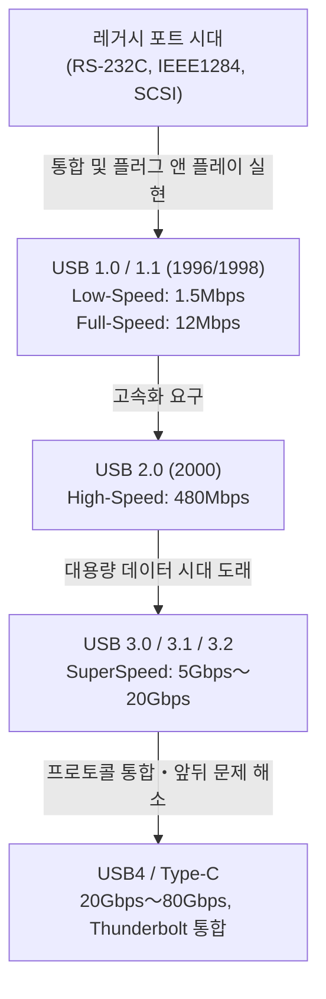

# USB의 역사: 왜 앞뒤가 있는 단자에서 USB-C로 진화했는가

## 1. 서장: 레거시 포트가 가져온 혼란과 사용자의 고뇌

우리가 현재 당연하게 사용하고 있는 'USB (Universal Serial Bus)'가 등장하기 이전, 1980년대 후반부터 1990년대 초반에 걸친 개인용 컴퓨터의 뒷면은 그야말로 카오스(혼돈) 그 자체였습니다. 현대의 PC나 Mac처럼 깔끔한 인터페이스만 갖춘 스마트한 외관에서는 상상도 할 수 없을 정도로 다양하고 많은 포트들이 빼곡히 자리 잡아 사용자를 혼란에 빠뜨렸습니다.

### 직렬 포트와 병렬 포트의 한계
당시의 대표적인 인터페이스로 먼저 '직렬 포트(RS-232C)'를 들 수 있습니다. 이는 주로 모뎀이나 마우스 연결에 사용되었습니다. 통신 속도는 매우 느려서 초기 모델은 수 kbps에서 수십 kbps 정도였습니다. 설정도 극히 복잡하여 보드 레이트, 스톱 비트, 패리티 비트 등 통신 프로토콜의 세부적인 매개변수를 사용자 스스로 OS나 소프트웨어 측에서 수동으로 설정해야 하는 경우가 많았습니다.

한편 프린터나 스캐너 등의 연결에는 '병렬 포트(IEEE 1284 등)'가 사용되었습니다. 센트로닉스 규격에서 비롯된 이 포트는 동시에 여러 비트를 병렬로 전송하기 때문에 당시의 직렬 포트보다는 빨랐지만, 케이블이 굵고 무거워 다루기가 매우 불편했습니다. 또한 커넥터 자체가 거대하여 PC 뒷면의 제한된 공간을 크게 차지하고 있었습니다.

### PS/2 포트와 SCSI의 장벽
입력 인터페이스로는 'PS/2 포트'가 존재했습니다. IBM의 Personal System/2에 채택되어 이런 이름이 붙었지만, 키보드용(보라색)과 마우스용(초록색) 두 가지가 준비되어 있었습니다. 가장 큰 단점은 '핫 스왑(활선 삽발)'을 지원하지 않았다는 점입니다. 즉, PC 전원이 켜진 상태에서 마우스를 뽑고 다시 꽂아도 인식되지 않으며, 최악의 경우 메인보드 컨트롤러가 물리적으로 타버릴 위험성조차 있었습니다.

게다가 빠른 데이터 전송이 필요한 외장 하드 디스크나 고성능 스캐너, MO 드라이브 등에는 'SCSI (Small Computer System Interface)'가 사용되었습니다. SCSI는 매우 고성능이었지만, 데이지 체인 연결을 할 때 '터미네이터(종단 저항)'의 물리적 연결이나 각 장치에 중복되지 않는 'SCSI ID' 할당 등 전문적인 지식이 필수적이었습니다. 설정 하나만 잘못해도 시스템 전체가 멈춰버리는 엄격한 규격이었습니다.

이처럼 주변기기마다 단자 모양이 다르고 설정도 번거로우며, IRQ(인터럽트 요청)나 DMA(직접 메모리 접근), I/O 주소 충돌로 인한 문제들이 일상다반사였습니다. 사용자는 새로운 주변기기를 살 때마다 두꺼운 매뉴얼과 씨름해야 했고, 경우에 따라서는 PC 케이스를 열어 확장 카드의 점퍼 핀을 핀셋으로 조작해야 하는, 지금으로서는 상상할 수 없는 고행을 겪어야 했습니다.

## 2. '플러그 앤 플레이'의 염원과 USB 1.0의 탄생

이러한 참상을 타개하고 누구나 쉽게 PC를 확장할 수 있는 세상을 만들기 위해 IT 업계의 거인들이 나섰습니다. 인텔의 Ajay Bhatt(아자이 바트)를 중심으로 한 팀의 발안으로 Compaq, Microsoft, IBM, DEC, Nortel, NEC 7개 사가 결집하여, USB 구현자 포럼(USB-IF)의 전신이 되는 규격 제정 그룹이 형성되었습니다. 그리고 1996년, 마침내 'USB 1.0' 규격이 공식적으로 발표됩니다.

### 목표로 삼은 'Universal'의 진정한 의미
USB의 최대 목표는 'Universal(범용)'이라는 이름이 뜻하듯 모든 주변기기를 하나의 규격, 하나의 커넥터 모양으로 통일하는 것이었습니다. 그리고 무엇보다 중요시된 것이 '플러그 앤 플레이 (Plug and Play)'와 '핫 스왑 (Hot Swap)'의 실현입니다. 사용자는 PC 전원을 켠 채로 케이블을 자유롭게 꽂고 뽑을 수 있으며, OS가 자동으로 기기를 인식하고 드라이버를 설치합니다. 사용자는 세부 설정을 전혀 신경 쓸 필요가 없습니다. 이것이 USB가 내건 궁극적인 비전이었습니다.

### USB 1.0/1.1의 스펙과 보급의 벽
USB 1.0에서는 통신 속도로 두 가지 모드가 정의되었습니다.
* **Low-Speed (1.5 Mbps)**: 주로 키보드나 마우스 등 데이터 전송량이 적고 지연이 치명적이지 않은 장치용.
* **Full-Speed (12 Mbps)**: 프린터나 외부 저장장치, 오디오 기기 등용.

현재 시점에서 보면 '12 Mbps'는 믿을 수 없을 정도로 느리지만(1초에 약 1.5MB밖에 전송하지 못함), 당시의 직렬 포트(115.2 kbps 등)를 대체하기에는 충분한 성능이었습니다. 또한 최대 127대의 장치를 트리 형태로 연결할 수 있는 획기적인 아키텍처를 채택했습니다.

그러나 발표 직후의 USB 1.0은 순풍에 돛 단 듯하지는 않았습니다. Windows 95 초기 버전은 USB를 기본적으로 지원하지 않았으며, 이후의 OSR2.1에서야 비로소 추가 지원되었으나 동작이 불안정하여 '플러그 앤 플레이'가 아니라 '플러그 앤 플레이(기도하고 꽂기)'라고 조롱받을 정도였습니다.

### 애플의 결단: iMac이 가져온 돌파구
USB가 진정한 의미에서 전 세계에 보급되는 결정적인 계기가 된 것은 1998년 Windows 98의 출시(USB 지원의 대폭적인 개선)와, 무엇보다 같은 해 애플에서 발표한 1세대 'iMac(본다이 블루)'의 존재입니다.

스티브 잡스가 이끄는 애플은 iMac에서 플로피 디스크 드라이브와 함께 기존 매킨토시에서 사용되던 ADB(Apple Desktop Bus)나 직렬 포트, SCSI 포트 등 레거시 인터페이스를 모두 가차 없이 잘라내고, 외부 확장 포트를 'USB만'으로 좁히는 극히 급진적인 설계를 채택했습니다.
당시 시장에는 USB 호환 주변기기가 거의 존재하지 않았기 때문에 이 결단은 업계로부터 맹렬한 비판을 받았습니다. 하지만 iMac이 전 세계적인 대히트를 기록하자, 주변기기 제조사들은 살아남기 위해 일제히 USB 호환 제품 개발로 방향을 틀었습니다. 결과적으로 애플의 강제적이라고도 할 수 있는 결단이 USB의 보급을 몇 년이나 앞당겼다고 평가받고 있습니다. 같은 해 버그 수정 및 호환성 향상을 도모한 'USB 1.1'이 출시되며 규격으로서의 기반이 다져졌습니다.

## 3. 속도 혁명과 황금 시대: USB 2.0의 군림

2000년 4월에 발표된 'USB 2.0'은 USB 역사상 최대의 돌파구 중 하나이며, 오늘날까지 가장 오랫동안 널리 사용되고 있는 위대한 규격입니다.

최대 통신 속도는 'High-Speed (480 Mbps)'로 끌어올려져, USB 1.1의 풀 스피드(12 Mbps)와 비교해 단숨에 40배라는 극적인 진화를 이뤘습니다. 이 속도 향상은 단순한 스펙상의 숫자 장난이 아니라 사람들의 디지털 라이프를 근본부터 바꾸는 힘을 가지고 있었습니다.

### 대용량 장치의 실용화
480 Mbps의 대역폭을 얻게 되면서, 그동안 USB 연결로는 비현실적이었던 대용량 장치들이 차례차례 실용화되었습니다.
외장 하드 디스크, CD-R/RW나 DVD 드라이브, 수 메가픽셀 급의 고화질 디지털 카메라의 데이터 전송, 나아가 TV 튜너나 고품질 오디오 인터페이스 등이 USB를 통해 쾌적하게 동작하게 되었습니다. 그중에서도 'USB 메모리(플래시 드라이브)'의 폭발적인 보급은 플로피 디스크나 MO 디스크와 같은 레거시 이동식 미디어를 완전히 과거의 유물로 만들었습니다.

또한 USB 2.0은 하위 호환성을 완벽하게 유지하여 USB 1.1 기기를 연결해도 그대로 동작하는 뛰어난 설계였습니다. 이 시기에 USB는 PC의 세계를 뛰어넘어 TV, DVD/BD 레코더, 가정용 게임기, 자동차 내비게이션 시스템 등 온갖 전자 기기에 탑재되는 '진정한 유니버설 스탠더드'로서의 지위를 확립했습니다.

## 4. 규격 난립과 커넥터의 비극: 모바일 시대의 도래와 Micro-B

USB 2.0의 성공으로 모든 기기가 USB로 연결되는 꿈이 실현된 것처럼 보였습니다. 그러나 모바일 기기(휴대전화, 디지털 카메라, MP3 플레이어 등)의 소형화 및 박형화라는 새로운 물결이 USB 커넥터 모양에 심각한 문제를 가져오게 됩니다.

### Type-A와 Type-B의 역할 분담
원래의 USB 설계 사상에서는 호스트 측(PC 등, 제어하는 쪽)에는 'Type-A(납작한 직사각형)' 커넥터를, 디바이스 측(프린터나 스캐너 등, 제어받는 쪽)에는 'Type-B(정사각형에 가까운 모양)' 커넥터를 채택한다는 엄격한 규칙이 있었습니다. 이로 인해 사용자가 실수로 PC끼리 케이블로 직접 연결하여 합선이나 고장을 일으키는 것을 물리적으로 막아주었습니다.

### 소형 커넥터의 난립
그러나 Type-B 커넥터는 프린터와 같은 대형 기기에는 적합했지만 휴대전화나 얇은 디지털 카메라에 탑재하기에는 너무 컸습니다. 그래서 소형화를 목표로 규격화된 것이 'Mini-A' 및 'Mini-B'입니다. 특히 Mini-B는 디지털 카메라나 초기의 휴대용 HDD에서 널리 보급되었습니다.
그런데 기기가 더욱 얇아지자 Mini-B조차도 두껍고 거추장스럽다는 말을 듣게 됩니다. 그래서 2007년, 더 얇고 내구성을 높인 'Micro-A'와 'Micro-B'가 발표되었습니다.

특히 'Micro-B'는 급격하게 보급되기 시작한 안드로이드 스마트폰을 중심으로 모바일 단말기의 충전 및 데이터 통신용 세계 표준 커넥터로서 압도적인 점유율을 차지했습니다. 유럽에서는 환경 보호(전자 쓰레기 감소) 측면에서 휴대전화의 충전 단자를 Micro-USB로 통일하라는 강한 압박이 있었고, 이것이 보급을 뒷받침했습니다.

### 슈뢰딩거의 USB: 인류를 괴롭힌 '앞뒤 문제'
여기서 발생한 최대의 비극이 인류 역사에 깊이 새겨지게 될 'USB의 앞뒤 문제'입니다.
표준적인 Type-A도, 소형화된 Micro-B도 상하가 비대칭인 모양을 하고 있어 올바른 방향으로만 꽂을 수 있습니다. 그러나 그 모양은 '언뜻 봐서는 어느 쪽이 위인지 매우 알기 어렵다'는 절묘한 디자인이었습니다.

"꽂으려는데 저항이 있다 → 뒤집어서 꽂으려는데 역시 안 들어간다 → 다시 한 번 뒤집으니 왜인지 순조롭게 들어간다"

이 불가해한 현상은 'USB의 양자 중첩', '4차원 커넥터' 등으로 전 세계 인터넷 밈이 되었고, 사람들의 귀중한 시간과 정신력을 갉아먹었습니다. 무리하게 반대 방향으로 꽂아 스마트폰 측 단자를 파손시키는 비참한 사고도 다발했습니다. USB의 창시자인 아자이 바트조차 후년의 인터뷰에서 "처음부터 리버서블(양면 지원)로 했어야 했지만 당시는 비용 절감을 위해 단면 실장으로 할 수밖에 없었다"며 이 문제에 대한 후회와 개발 당시의 딜레마를 털어놓았습니다.

## 5. SuperSpeed의 도래와 명명 규칙의 혼란: USB 3.x 시리즈

2000년대 후반에 들어서자 HD 화질의 동영상 데이터나 대용량의 게임 데이터 등 다루는 파일 크기가 테라바이트 급으로 껑충 뛰었고, USB 2.0의 480 Mbps로도 속도 부족이 두드러지게 되었습니다.
그래서 2008년에 발표된 것이 'USB 3.0'입니다.

### 파란 커넥터와 SuperSpeed
USB 3.0의 최대 통신 속도는 'SuperSpeed (5 Gbps)'로 명명되어, USB 2.0의 10배 이상이라는 압도적인 대역폭을 실현했습니다.
물리적인 구조로서 기존 USB 2.0까지의 4개의 핀(전원, GND, D+, D-)에 더해, 새롭게 초고속 데이터 전송용 5개의 핀(송신용 2개, 수신용 2개, GND)을 추가한 9핀 구조를 채택했습니다.
외관상의 가장 큰 특징은 기존 단자와 구별하기 위해 커넥터 내부의 플라스틱 부분이 '파란색(Pantone 300C)'으로 지정되었다는 것입니다. 이로 인해 사용자는 '파란 단자끼리 파란 케이블로 연결하면 빠르다'는 직관적인 이해가 가능했습니다.

### 미궁에 빠진 네이밍
그러나 기술적 성공과는 정반대로 USB-IF의 마케팅 부서는 불가해한 명칭 변경을 반복하며 소비자와 PC 업계를 깊은 혼란의 소용돌이로 몰아넣게 됩니다.

* **2013년**: 'USB 3.1'이 발표되어 속도가 10 Gbps (SuperSpeed+)로 향상되었습니다. 여기까지는 좋았지만, 동시에 기존 USB 3.0 (5 Gbps)의 명칭을 'USB 3.1 Gen 1'로, 새로운 10 Gbps를 'USB 3.1 Gen 2'로 개명해버렸습니다.
* **2017년**: 더욱 속도를 20 Gbps로 끌어올린 'USB 3.2'가 발표됩니다. 그리고 또다시 과거 규격의 이름을 변경하여, 5 Gbps를 'USB 3.2 Gen 1', 10 Gbps를 'USB 3.2 Gen 2', 새로운 20 Gbps를 'USB 3.2 Gen 2x2'라고 부르기로 결정했습니다.

이 결과 가전 양판점에 진열된 제품 패키지에 'USB 3.2 호환!'이라고 크게 적혀 있어도, 그것이 5 Gbps인지 20 Gbps인지 일반 소비자는 물론 전문가조차 스펙 시트를 정독하지 않으면 판별할 수 없는, 규격으로서의 신뢰성을 해치는 최악의 사태를 초래했습니다.

## 6. 궁극의 커넥터 'Type-C'와 전력 공급 혁명 'Power Delivery'

커넥터 모양의 난립으로 인한 번거로움, 앞뒤 문제의 짜증, 그리고 복잡기괴한 버전 명칭. 이 문제들을 일거에 해결하기 위해 USB-IF가 총력을 기울여 2014년에 발표한 것이 USB 역사의 집대성이라 할 수 있는 'USB Type-C (USB-C)'입니다.

### Type-C가 가져온 3가지 혁명
Type-C는 단순한 새로운 모양의 커넥터가 아니라 컴퓨팅의 본질을 바꾸는 세 가지 혁신적인 특징을 가지고 있었습니다.

1. **리버서블 구조의 실현**
   커넥터 내부의 핀 배치(24핀)를 점대칭으로 배치하여 위아래 어느 방향으로든 꽂을 수 있게 되었습니다. 인류를 오랫동안 괴롭혀온 '슈뢰딩거의 USB 문제'가 드디어 완전히 해결된 순간입니다. 커넥터 자체도 Micro-B와 동등한 콤팩트함을 유지하여 매우 얇은 스마트폰부터 대형 데스크톱 PC까지 모든 기기에 탑재가 가능합니다.
2. **호스트와 디바이스의 구별 철폐와 CC 핀**
   Type-A와 Type-B라는 물리적 구별을 폐지하고, 양끝이 Type-C인 케이블을 표준으로 삼았습니다. 어느 쪽을 어디에 꽂아도 기능합니다. 이를 구현하기 위해 Type-C에는 새롭게 'CC (Configuration Channel)'라는 통신용 핀이 마련되어, 연결된 순간 기기들끼리 "어느 쪽이 호스트이고 어느 쪽이 디바이스인가", "어느 방향으로 전력을 보낼 것인가" 등을 고도로 협상(통신 프로토콜에 의한 대화)하는 스마트한 구조가 도입되었습니다.
3. **얼터네이트 모드 (Alternate Mode)**
   USB 데이터 통신뿐만 아니라 타사의 프로토콜도 Type-C 케이블 안에 흘려보낼 수 있게 되었습니다. 대표적인 것이 'DisplayPort Alternate Mode'입니다. 이로써 전용 HDMI 케이블이나 DisplayPort 케이블을 사용하지 않아도 Type-C 케이블 1개로 PC에서 모니터로 고해상도 영상 신호를 출력할 수 있게 되었습니다.

### USB Power Delivery (USB PD) 에 의한 전력 공급 혁명
Type-C의 잠재력을 극한까지 끌어낸 것이 동시에 진화를 이룬 'USB Power Delivery (USB PD)'라는 전력 공급 규격입니다.
초기 USB 1.0/2.0의 전력 공급 능력은 겨우 2.5W (5V/0.5A)에 불과해 마우스나 키보드를 작동시키는 것이 고작이었습니다. USB 3.0에서도 4.5W (5V/0.9A)로 스마트폰의 고속 충전조차 어려운 수치였습니다.

그러나 USB PD는 최대 20V/5A의 '100W'라는 거대한 전력을 공급하는 것을 가능하게 했습니다. 나아가 2021년의 'USB PD EPR (Extended Power Range)' 업데이트에서는 최대 48V/5A의 '240W'까지 확장되었습니다.
100W~240W라는 전력은 스마트폰이나 태블릿의 고속 충전은 물론, MacBook Pro나 게이밍 PC처럼 많은 전력을 소비하는 하이엔드 노트북의 구동, 나아가 대형 LCD 모니터의 전원조차 감당할 수 있는 수치입니다.

"영상 출력을 갖춘 모니터에서 Type-C 케이블 1개로 노트북에 영상을 보내면서, 동시에 모니터에서 컴퓨터로 큰 전력을 충전도 한다"
과거에는 전원 케이블, 영상 케이블, 데이터용 USB 케이블이라는 3가닥의 선이 필요했던 환경이 단 1개의 Type-C 케이블로 완결됩니다. 이는 사무실 환경이나 재택근무에서의 궁극적인 스마트화를 실현했습니다.

## 7. 강력한 라이벌 'Thunderbolt'와의 역사적 융합

USB의 진화 역사를 이야기할 때 또 하나 절대 빼놓을 수 없는 것이 'Thunderbolt(썬더볼트)'의 존재입니다.
Thunderbolt는 인텔과 애플이 공동 개발한 초고속 인터페이스 규격입니다. 원래는 'Light Peak'라는 코드네임으로 불렸으며 광섬유를 사용하는 구상이었지만, 비용 문제로 구리선 기반으로 2011년에 'Thunderbolt 1'로 등장했습니다.

### 다른 설계 사상
USB가 '다양한 주변기기를 쉽고 저렴하게 연결하는' 것을 목표로 한 반면, Thunderbolt는 'PC 내부의 PCI Express 버스와 영상 출력(DisplayPort)을 그대로 외부로 끌어내는' 지극히 힘으로 밀어붙이는 고성능 접근법을 채택했습니다. 이 때문에 외장 GPU나 초고속 RAID 스토리지 등, USB에서는 지연 시간(레이턴시)이나 대역폭 제약으로 실현 불가능했던 전문가용으로 중용되었습니다.

당초 Thunderbolt 1 및 2는 Mini DisplayPort와 같은 단자 모양을 채택하여 Mac의 독점적인 기능으로 전개되고 있었습니다. 하지만 Windows PC 진영으로의 보급이 지지부진하자 위기감을 느낀 인텔은 2015년에 발표한 'Thunderbolt 3'에서 커넥터 모양을 독자적인 형태에서 'USB Type-C'로 전환하는 역사적인 결단을 내립니다.

### Type-C의 혼란과 통합으로의 여정
커넥터를 Type-C로 통일한 것은 편의성을 높였지만, 동시에 '겉보기에는 똑같은 Type-C 단자와 케이블인데, 내용물인 통신 프로토콜이 USB인 경우와 Thunderbolt 3인 경우가 있다. 그리고 호환성이 있기도 하고 없기도 하다'는, 과거 단자 난립과는 차원이 다른 복잡하고 눈에 보이지 않는 새로운 혼란을 사용자에게 가져왔습니다.

이 너무나 복잡한 상황을 근본적으로 해결하기 위해 인텔은 2019년, Thunderbolt 3의 프로토콜 사양을 USB-IF에 '무상으로 제공(기증)'하는 놀라운 행동에 나섭니다.
이 인텔의 기술 제공을 기반으로 제정된 차세대 규격이 바로 'USB4'입니다.

### USB4: 궁극의 통합 규격
USB4의 등장으로 USB와 Thunderbolt는 명실공히 '융합'을 이루었습니다. USB4는 표준으로 최대 40 Gbps의 통신 속도를 자랑하며(최신 USB4 Version 2.0에서는 80 Gbps, 비대칭 모드에서는 최대 120 Gbps에 달합니다), PCIe 터널링을 공식적으로 지원하게 되었습니다.
즉, 지금까지 Thunderbolt의 특권이었던 '외장 GPU 연결' 등을 USB 표준 규격으로 이용할 수 있게 된 것입니다. 이와 함께 극도로 난해했던 'USB 3.2 Gen 2x2' 같은 명칭은 폐지되고, 'USB 40Gbps'와 같이 속도를 직접 나타내는 브랜드 이름으로 회귀하려는 노력도 시작되었습니다.

## 8. 환경 규제와 미래: Type-C 천하 통일과 앞으로의 과제

USB의 진화는 기술적 측면뿐만 아니라 정치적, 환경적 측면에서도 큰 전환점을 맞이하고 있습니다.

### 유럽 연합(EU)에 의한 충전 단자 통일 법안
2022년, 유럽 연합(EU)의 유럽 의회는 스마트폰이나 태블릿, 디지털 카메라 등의 소형 전자 기기 충전 단자를 'USB Type-C로 통일'하도록 의무화하는 법안을 가결했습니다. 이 법안의 주요 목적은 소비자가 기기마다 다른 케이블이나 충전기를 구입하는 낭비를 줄이고, 연간 수만 톤에 달하는 '전자 쓰레기(E-waste)'를 감축하는 데 있습니다.

이 규제의 가장 큰 표적이 된 것은 독자 규격인 'Lightning(라이트닝)' 단자를 오랫동안 고수해 오던 애플의 iPhone입니다. 애플은 '혁신을 저해한다'며 저항했지만 결국 EU의 거대 시장을 무시할 수는 없었고, 2023년에 출시된 iPhone 15 시리즈에서 마침내 Lightning을 폐지하고 USB Type-C를 채택했습니다.
이로써 안드로이드, iPhone, Mac, Windows PC, iPad, Nintendo Switch, 무선 이어폰 등 우리가 일상적으로 사용하는 거의 모든 배터리 구동 기기를 Type-C 케이블 1개로 충전할 수 있다는 '완전한 천하 통일'이 이뤄졌습니다.

### 남겨진 과제: 케이블 뽑기(가챠)
하드웨어 단자가 Type-C로 통일됨으로써 편의성은 극한까지 높아졌습니다. 하지만 미래로의 과제가 모두 사라진 것은 아닙니다.
현재 사용자를 가장 괴롭히는 것이 '케이블 뽑기(가챠)'라고 불리는 문제입니다.

양끝이 Type-C인 케이블이라도 그 내용물(내장된 eMarker 칩의 유무나 연결된 심선의 수)에 따라 다음과 같은 절망적인 성능 차이가 존재합니다.
* 충전만 지원하고 데이터 전송은 USB 2.0 (480 Mbps)인 아주 얇은 케이블
* 60W 충전은 지원하지만 영상 출력은 지원하지 않는 케이블
* 100W (또는 240W) 충전을 지원하고, 40Gbps 데이터 통신, 8K 영상 출력에도 대응하지만 매우 굵고 짧으며 비싼 Thunderbolt 4 케이블

겉보기에는 완전히 똑같은데 성능이 전혀 다르기 때문에 사용자는 케이블 패키지나 단자 부분에 작게 인쇄된 로고 마크를 뚫어지게 쳐다보고 판별해야 합니다. "단자를 통일한 결과 케이블 내부의 혼돈화를 초래했다"는 것은 아이러니한 현실입니다.

## 9. 맺음말: 유니버설(보편)을 향한 끝나지 않는 여정

1996년, 뒷면에 수많은 다른 포트들을 안고 IRQ 충돌로 고민하던 PC 세계에 '단 하나의 범용적인 단자로 모든 것을 연결한다'는 장대한 꿈을 내걸고 탄생한 USB.

그 발자취는 결코 평탄하지 않았습니다. 속도 부족으로 인한 타협, 커넥터 소형화에 따른 난립, 앞뒤 문제로 인한 짜증, 마케팅의 미궁에 빠진 명칭 혼란, 그리고 강력한 라이벌인 Thunderbolt와의 복잡한 관계.
그러나 USB는 그때마다 IT 업계의 예지를 결집하여 호환성을 유지하면서(때로는 대담한 자기 부정을 포함하면서) 진화를 계속해 왔습니다.

전송 속도는 1.5 Mbps에서 80 Gbps로 수만 배 뛰어올랐고, 전력 공급량은 2.5W에서 240W로 약 100배 증강되었습니다. 그리고 Type-C라는 물리적으로나 기능적으로나 뛰어난 '그릇'을 손에 넣음으로써, USB는 당초 내걸었던 'Universal'이라는 이상을 탄생 후 사반세기가 지나 마침내 현실로 만든 것입니다.

차세대 규격이 어떤 이름이 되고 얼마나 빠른 속도를 낼지언정, 우리 책상 주위에서 볼품없고 불필요한 케이블 다발이 사라지고 더 단순하고 파워풀하며 세련된 연결 경험이 앞으로도 계속 제공될 것임에는 틀림없습니다. 앞뒤가 있는 불편한 단자에서 USB-C로의 진화는 인류가 편의성과 합리성을 계속 추구해 온 IT 하드웨어 역사상 가장 위대한 궤적 중 하나라고 할 수 있을 것입니다.
