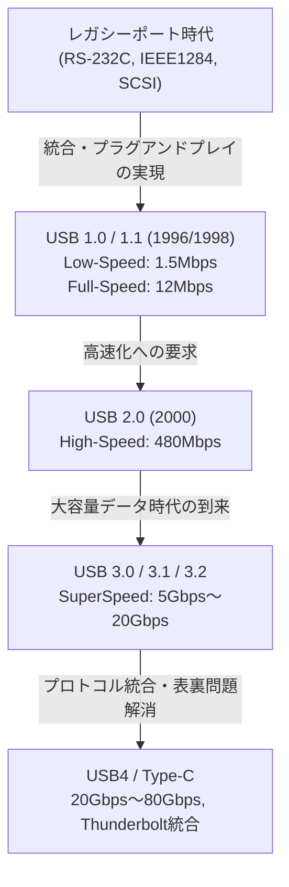

# USBの歴史：なぜ表裏のある端子からUSB-Cへ進化したのか

## 1. 序章：レガシーポートがもたらしたカオスとユーザーの苦悩

私たちが現在当たり前のように使っている「USB (Universal Serial Bus)」が登場する以前、1980年代後半から1990年代前半にかけてのパーソナルコンピュータの背面は、まさにカオス（混沌）そのものでした。現代のPCやMacのように、スッキリとしたインターフェースしか持たないスマートな外観からは想像もつかないほど、多種多様なポートがひしめき合い、ユーザーを混乱に陥れていました。

### シリアルポートとパラレルポートの限界
当時の代表的なインターフェースとして、まず「シリアルポート（RS-232C）」が挙げられます。これは主にモデムやマウスの接続に使用されていました。通信速度は非常に遅く、初期のものは数kbpsから数十kbps程度。設定も極めて複雑で、ボーレート、ストップビット、パリティビットなど、通信プロトコルの詳細なパラメータをユーザー自身がOSやソフトウェア側で手動設定しなければならないことが多々ありました。

一方、プリンターやスキャナーなどの接続には「パラレルポート（IEEE 1284など）」が使われていました。セントロニクス規格に端を発するこのポートは、同時に複数のビットを並行して送信するため、当時のシリアルポートよりは高速でしたが、ケーブルは太く重く、取り回しが非常に困難でした。また、コネクタ自体が巨大で、PCの背面の限られたスペースを大きく占有していました。

### PS/2ポートとSCSIの壁
入力インターフェースとしては「PS/2ポート」が存在しました。IBMのPersonal System/2で採用されたことからこの名が付きましたが、キーボード用（紫色）とマウス用（緑色）の2つが用意されていました。最大の欠点は「ホットスワップ（活線挿抜）」に非対応だったことです。つまり、PCの電源が入っている状態でマウスを引き抜き、再度挿し込んでも認識されず、最悪の場合はマザーボードのコントローラーを物理的に焼損してしまう危険性すらありました。

さらに、高速なデータ転送が必要な外付けハードディスクや高性能スキャナー、MOドライブなどには「SCSI（Small Computer System Interface）」が使用されていました。SCSIは非常に高性能でしたが、デイジーチェーン接続を行う際の「ターミネーター（終端抵抗）」の物理的な接続や、各デバイスへの重複しない「SCSI ID」の割り当てなど、専門的な知識が不可欠でした。設定を一つ間違えればシステム全体がフリーズするようなシビアな規格でした。

このように、周辺機器ごとに端子の形状が異なり、設定も煩雑で、IRQ（割り込み要求）やDMA（ダイレクトメモリアクセス）、I/Oアドレスの競合によるトラブルが日常茶飯事でした。ユーザーは新しい周辺機器を買うたびに、分厚いマニュアルと格闘し、場合によってはPCのケースを開けて拡張カードのジャンパーピンをピンセットで操作するという、今では考えられないような苦行を強いられていたのです。

## 2. 「プラグアンドプレイ」の悲願とUSB 1.0の誕生

この惨状を打開し、誰もが簡単にPCを拡張できる世界を作るため、IT業界の巨人たちが立ち上がりました。IntelのAjay Bhatt（アジャイ・バット）氏を中心とするチームの発案により、Compaq、Microsoft、IBM、DEC、Nortel、NECの7社が結集し、USBインプリメンターズ・フォーラム（USB-IF）の前身となる規格策定グループが形成されました。そして1996年、ついに「USB 1.0」規格が公式に発表されます。

### 目指した「Universal」の真意
USBの最大の目標は「Universal（汎用）」という名前が示す通り、すべての周辺機器を一つの規格、一つのコネクタ形状で統一することでした。そして何より重視されたのが「プラグアンドプレイ (Plug and Play)」と「ホットスワップ (Hot Swap)」の実現です。ユーザーはPCの電源を入れたままケーブルを自由に抜き差しでき、OSが自動的に機器を認識してドライバをインストールする。ユーザーは細かい設定を一切気にする必要がない。これがUSBが掲げた究極のビジョンでした。

### USB 1.0/1.1のスペックと普及の壁
USB 1.0では、通信速度として2つのモードが定義されました。
* **Low-Speed (1.5 Mbps)**: 主にキーボードやマウスなど、データ転送量が少なく遅延が致命的にならないデバイス向け。
* **Full-Speed (12 Mbps)**: プリンターや外部ストレージ、オーディオ機器など向け。

現在から見れば「12 Mbps」は信じられないほど低速（1秒間に約1.5MBしか送れない）ですが、当時のシリアルポート（115.2 kbpsなど）を置き換えるには十分な性能でした。また、最大127台までのデバイスをツリー状に接続できるという画期的なアーキテクチャを採用していました。

しかし、発表直後のUSB 1.0は順風満帆ではありませんでした。Windows 95の初期バージョンはUSBをネイティブにサポートしておらず、後のOSR2.1でようやく追加サポートされたものの、動作は不安定で「プラグアンドプレイ」ならぬ「プラグアンドプレイ（祈ってから挿す）」と揶揄される始末でした。

### Appleの決断：iMacがもたらしたブレイクスルー
USBが真の意味で世界に普及する決定的な契機となったのは、1998年のWindows 98のリリース（USBサポートの大幅な改善）、そして何より同年にAppleから発表された初代「iMac（ボンダイブルー）」の存在です。

スティーブ・ジョブズ率いるAppleは、iMacからフロッピーディスクドライブと共に、従来のMacintoshで使われていたADB（Apple Desktop Bus）やシリアルポート、SCSIポートなどのレガシーインターフェースをすべて容赦なく切り捨て、外部拡張ポートを「USBのみ」に絞るという極めて急進的な設計を採用しました。
当時、市場にはUSB対応の周辺機器がほとんど存在していなかったため、この決断は業界から猛烈な批判を浴びました。しかし、iMacが世界的な大ヒットを記録したことで、周辺機器メーカーは生き残りをかけて一斉にUSB対応製品の開発に舵を切りました。結果として、Appleの強引とも言える決断がUSBの普及を数年分早めたと評価されています。同年にはバグ修正や互換性向上を図った「USB 1.1」がリリースされ、規格としての足場が固まりました。

## 3. 速度革命と黄金時代：USB 2.0の君臨

2000年4月に発表された「USB 2.0」は、USBの歴史において最大のブレイクスルーの一つであり、今日に至るまで最も長く広く使われ続けている偉大な規格です。

最大通信速度は「High-Speed (480 Mbps)」に引き上げられ、USB 1.1のフルスピード（12 Mbps）と比較して一気に40倍という劇的な進化を遂げました。この速度向上は、単なるスペック上の数字の遊びではなく、人々のデジタルライフを根本から変える力を持っていました。

### 大容量デバイスの実用化
480 Mbpsの帯域幅を手に入れたことで、これまでUSB接続では非現実的だった大容量デバイスが次々と実用化されました。
外付けハードディスク、CD-R/RWやDVDドライブ、数メガピクセル級の高画質デジタルカメラのデータ転送、さらにはテレビチューナーや高品質なオーディオインターフェースなどがUSB経由で快適に動作するようになりました。中でも「USBメモリ（フラッシュドライブ）」の爆発的な普及は、フロッピーディスクやMOディスクといったレガシーなリムーバブルメディアを完全に過去のものとしました。

また、USB 2.0は後方互換性を完璧に維持しており、USB 1.1の機器を接続してもそのまま動作するという優れた設計でした。この時期、USBはPCの世界を飛び出し、テレビ、DVD/BDレコーダー、家庭用ゲーム機、カーナビゲーションシステムなど、ありとあらゆる電子機器に搭載される「真のユニバーサル・スタンダード」としての地位を確立しました。

## 4. 規格乱立とコネクタの悲劇：モバイル時代の到来とMicro-B

USB 2.0の成功により、すべてのデバイスがUSBで繋がる夢が実現したかに見えました。しかし、モバイル機器（携帯電話、デジタルカメラ、MP3プレイヤーなど）の小型化・薄型化という新たな波が、USBのコネクタ形状に深刻な問題をもたらすことになります。

### Type-AとType-Bの役割分担
本来のUSBの設計思想では、ホスト側（PCなど、制御する側）には「Type-A（平べったい長方形）」コネクタを、デバイス側（プリンターやスキャナーなど、制御される側）には「Type-B（正方形に近い形状）」コネクタを採用するという厳格なルールがありました。これにより、ユーザーが誤ってPC同士をケーブルで直結してしまい、ショートや故障を引き起こすことを物理的に防いでいました。

### 小型コネクタの乱立
しかし、Type-Bコネクタはプリンターのような大型機器には適していましたが、携帯電話や薄型デジタルカメラに搭載するにはあまりにも巨大すぎました。そこで、小型化を目指して規格化されたのが「Mini-A」および「Mini-B」です。特にMini-Bはデジタルカメラや初期のポータブルHDDで広く普及しました。
ところが、デバイスのさらなる薄型化が進むと、Mini-Bすらも分厚くて邪魔だと言われるようになります。そこで2007年、より薄く耐久性を高めた「Micro-A」と「Micro-B」が発表されました。

特に「Micro-B」は、急激に普及し始めたAndroidスマートフォンを中心とするモバイル端末の充電・データ通信用世界標準コネクタとして、圧倒的なシェアを獲得しました。ヨーロッパでは環境保護（電子ゴミの削減）の観点から、携帯電話の充電端子をMicro-USBに統一するよう強い圧力がかかり、これが普及を後押ししました。

### シュレディンガーのUSB：人類を悩ませた「表裏問題」
ここで生じた最大の悲劇が、人類の歴史に深く刻まれることになる「USBの表裏問題」です。
標準のType-Aも、小型化されたMicro-Bも、上下が非対称な形状をしており、正しい向きでしか挿し込むことができません。しかし、その形状は「一見しただけではどちらが上か非常に分かりにくい」という絶妙なデザインでした。

「挿し込もうとするが抵抗がある → 裏返して挿そうとするがやはり入らない → もう一度裏返すと、なぜかすんなり入る」

この不可解な現象は「USBのスーパーポジション（量子的な重ね合わせ）」「4次元コネクタ」などと世界中でネットミーム化し、人々の貴重な時間と精神力を削り取りました。無理やり逆向きに挿し込んでしまい、スマートフォン側の端子を破壊してしまうという悲惨な事故も多発しました。USBの生みの親であるアジャイ・バット氏でさえ、後年のインタビューで「最初からリバーシブル（両面対応）にしておけば良かったが、当時はコスト削減のために片面実装にするしかなかった」と、この問題についての後悔と開発当時のジレンマを語っています。

## 5. SuperSpeedの到来と命名規則の混乱：USB 3.xシリーズ

2000年代後半に入ると、HD画質の動画データや大容量のゲームデータなど、扱うファイルサイズがテラバイト級に跳ね上がり、USB 2.0の480 Mbpsでも速度不足が目立つようになりました。
そこで2008年に発表されたのが「USB 3.0」です。

### 青いコネクタとSuperSpeed
USB 3.0の最大通信速度は「SuperSpeed (5 Gbps)」と命名され、USB 2.0の10倍以上の圧倒的な帯域幅を実現しました。
物理的な構造として、従来のUSB 2.0までの4本のピン（電源、GND、D+、D-）に加えて、新たに超高速データ転送用の5本のピン（送信用2本、受信用2本、GND）を追加した9ピン構造を採用しました。
外見上の最大の特徴は、従来の端子と区別するために、コネクタ内部のプラスチック部分が「青色（Pantone 300C）」に指定されたことです。これにより、ユーザーは「青い端子同士を青いケーブルで繋げば速い」という直感的な理解が可能でした。

### 迷走するネーミング
しかし、技術的な成功とは裏腹に、USB-IFのマーケティング部門は不可解な名称変更を繰り返し、消費者とPC業界を深い混乱の渦に巻き込みます。

* **2013年**：「USB 3.1」が発表され、速度が10 Gbps (SuperSpeed+) に向上しました。ここまでは良いのですが、同時に従来のUSB 3.0 (5 Gbps) の名称を「USB 3.1 Gen 1」に、新しい10 Gbpsを「USB 3.1 Gen 2」に改名してしまいました。
* **2017年**：さらに速度を20 Gbpsに引き上げた「USB 3.2」が発表されます。そしてまたしても過去の規格の名前を変更し、5 Gbpsを「USB 3.2 Gen 1」、10 Gbpsを「USB 3.2 Gen 2」、新しい20 Gbpsを「USB 3.2 Gen 2x2」と呼ぶことを決定しました。

この結果、家電量販店に並ぶ製品のパッケージに「USB 3.2対応！」とデカデカと書かれていても、それが5 Gbpsなのか20 Gbpsなのか、一般消費者はおろか専門家でさえスペックシートを熟読しなければ判別できないという、規格としての信頼性を損なう最悪の事態を招きました。

## 6. 究極のコネクタ「Type-C」と給電革命「Power Delivery」

コネクタ形状の乱立による煩雑さ、表裏問題のイライラ、そして複雑怪奇なバージョン名称。これらの問題を一挙に解決するべく、USB-IFが総力を結集して2014年に発表したのが、USBの歴史の集大成とも言える「USB Type-C (USB-C)」です。

### Type-Cがもたらした3つの革命
Type-Cは、単なる新しい形のコネクタではなく、コンピューティングのあり方を変える3つの革新的な特徴を持っていました。

1. **リバーシブル構造の実現**
   コネクタ内部のピン配置（24ピン）を点対称に配置することで、上下どちらの向きでも挿し込めるようになりました。人類を長年悩ませてきた「シュレディンガーのUSB問題」がついに完全解決した瞬間です。コネクタ自体もMicro-Bと同等のコンパクトさを維持しており、極薄のスマートフォンから大型のデスクトップPCまで、あらゆるデバイスに搭載可能です。
2. **ホストとデバイスの区別撤廃とCCピン**
   Type-AとType-Bという物理的な区別を廃止し、両端がType-Cのケーブルを標準としました。どちら側をどちらに挿しても機能します。これを実現するため、Type-Cには新たに「CC (Configuration Channel)」という通信用のピンが設けられ、接続された瞬間に機器同士が「どちらがホストでどちらがデバイスか」「どの方向に電力を送るか」などを高度にネゴシエーション（通信プロトコルによる対話）するスマートな仕組みが導入されました。
3. **オルタネートモード (Alternate Mode)**
   USBのデータ通信だけでなく、他社のプロトコルもType-Cケーブルの中に流せるようになりました。代表的なのが「DisplayPort Alternate Mode」です。これにより、専用のHDMIケーブルやDisplayPortケーブルを使わずとも、Type-Cケーブル1本でPCからモニターへ高解像度の映像信号を出力できるようになりました。

### USB Power Delivery (USB PD) による給電革命
Type-Cのポテンシャルを極限まで引き出したのが、同時に進化を遂げた「USB Power Delivery (USB PD)」という給電規格です。
初期のUSB 1.0/2.0の給電能力はわずか 2.5W (5V/0.5A) に過ぎず、マウスやキーボードを動かすのが精一杯でした。USB 3.0でも 4.5W (5V/0.9A) と、スマートフォンの急速充電すら厳しい数値でした。

しかしUSB PDは、最大20V/5Aの「100W」という巨大な電力を供給することを可能にしました。さらに2021年の「USB PD EPR (Extended Power Range)」アップデートでは、最大48V/5Aの「240W」まで拡張されました。
100W〜240Wという電力は、スマートフォンやタブレットの急速充電はもちろん、MacBook ProやゲーミングPCのような大電力を消費するハイエンド・ノートパソコンの駆動、さらには大型の液晶モニターの電源すら賄える数値です。

「映像出力を備えたモニターから、Type-Cケーブル1本でノートパソコンに映像を送りつつ、同時にモニターからパソコンへ大電力で充電も行う」
かつては電源ケーブル、映像ケーブル、データ用USBケーブルと3本の線が必要だった環境が、たった1本のType-Cケーブルで完結する。これはオフィス環境やテレワークにおける究極のスマート化を実現しました。

## 7. 強力なライバル「Thunderbolt」との歴史的融合

USBの進化の歴史を語る上で、もう一つ絶対に外せないのが「Thunderbolt（サンダーボルト）」の存在です。
Thunderboltは、IntelとAppleが共同開発した超高速インターフェース規格です。元々は「Light Peak」というコードネームで呼ばれ、光ファイバーを用いる構想でしたが、コストの問題から銅線ベースで2011年に「Thunderbolt 1」として登場しました。

### 異なる設計思想
USBが「様々な周辺機器を簡単・安価に繋ぐ」ことを目指したのに対し、Thunderboltは「PC内部のPCI Expressバスと映像出力（DisplayPort）を、そのまま外部に引き出す」という極めて力技で高性能なアプローチを採用しました。そのため、外付けGPUや超高速RAIDストレージなど、USBではレイテンシ（遅延）や帯域の制約で実現不可能なプロフェッショナル用途で重宝されました。

当初、Thunderbolt 1および2は、Mini DisplayPortと同じ端子形状を採用し、Macの独占的な機能として展開されていました。しかし、Windows PC陣営への普及が遅々として進まないことに危機感を抱いたIntelは、2015年に発表した「Thunderbolt 3」において、コネクタ形状を独自の形から「USB Type-C」に切り替えるという歴史的な決断を下します。

### Type-Cの混乱と、統合への道程
コネクタをType-Cに統一したことは利便性を高めましたが、同時に「見た目は全く同じType-C端子とケーブルなのに、中身の通信プロトコルがUSBの場合と、Thunderbolt 3の場合がある。そして互換性があったり無かったりする」という、かつての端子乱立とは次元の異なる、高度で目に見えない新たな混乱をユーザーにもたらしました。

この複雑すぎる状況を根本から解決するため、Intelは2019年、Thunderbolt 3のプロトコル仕様をUSB-IFに「無償で提供（寄贈）」するという驚くべき行動に出ます。
このIntelの技術提供をベースにして策定された次世代規格こそが「USB4」です。

### USB4：究極の統合規格
USB4の登場により、USBとThunderboltは名実ともに「融合」を果たしました。USB4は標準で最大40 Gbpsの通信速度を誇り（最新のUSB4 Version 2.0では80 Gbps、非対称モードでは最大120 Gbpsに達します）、PCIeトンネリングを公式にサポートしました。
つまり、これまでThunderboltの特権だった「外付けGPUの接続」などが、USBの標準規格として利用できるようになったのです。同時に、難解を極めた「USB 3.2 Gen 2x2」のような名称は廃止され、「USB 40Gbps」のような速度を直接示すブランド名へと回帰する努力も始まりました。

## 8. 環境規制と未来：Type-C天下統一とこれからの課題

USBの進化は、技術的な側面だけでなく、政治的・環境的な側面からも大きな転換点を迎えています。

### 欧州連合（EU）による充電端子統一法案
2022年、欧州連合（EU）の欧州議会は、スマートフォンやタブレット、デジタルカメラなどの小型電子機器の充電端子を「USB Type-Cに統一する」ことを義務付ける法案を可決しました。この法案の主な目的は、消費者がデバイスごとに異なるケーブルや充電器を購入する無駄を省き、年間数万トンにも及ぶ「電子ゴミ（E-waste）」を削減することにあります。

この規制の最大の標的となったのは、独自規格である「Lightning（ライトニング）」端子を長年使い続けていたAppleのiPhoneです。Appleは「イノベーションを阻害する」と抵抗しましたが、最終的にEUの巨大な市場を無視することはできず、2023年に発売されたiPhone 15シリーズにおいて、ついにLightningを廃止しUSB Type-Cを採用しました。
これにより、Android、iPhone、Mac、Windows PC、iPad、Nintendo Switch、ワイヤレスイヤホンなど、私たちが日常的に使用するほぼすべてのバッテリー駆動デバイスが、Type-Cケーブル1本で充電できるという「完全な天下統一」が成し遂げられました。

### 残された課題：ケーブルガチャ
ハードウェアの端子がType-Cに統一されたことで、利便性は極限まで高まりました。しかし、未来への課題が全て消え去ったわけではありません。
現在、ユーザーを最も悩ませているのが「ケーブルガチャ」と呼ばれる問題です。

両端がType-Cのケーブルであっても、その中身（内蔵されているeMarkerチップの有無や、結線されている芯線の数）によって、以下のような絶望的な性能差が存在します。
* 充電のみ対応で、データ転送はUSB 2.0（480 Mbps）の極薄ケーブル
* 60W充電対応だが、映像出力には非対応のケーブル
* 100W（または240W）充電対応で、40Gbpsデータ通信、8K映像出力にも対応するが、非常に太くて短く高価なThunderbolt 4ケーブル

見た目は全く同じなのに性能が全く異なるため、ユーザーはケーブルのパッケージや端子部分に小さく印字されたロゴマークを凝視して判別しなければなりません。「端子を統一した結果、ケーブルの中身の混沌化を招いた」というのは、皮肉な現実です。

## 9. 結び：ユニバーサル（普遍）への終わりなき旅

1996年、背面に無数の異なるポートを抱え、IRQの競合に悩まされていたPCの世界に「たった一つの汎用的な端子で全てを繋ぐ」という壮大な夢を掲げて誕生したUSB。

その歩みは決して平坦ではありませんでした。速度不足による妥協、コネクタの小型化に伴う乱立、表裏問題による苛立ち、マーケティング上の迷走による名称の混乱、そして強力なライバルであるThunderboltとの複雑な関係。
しかし、USBはその都度、IT業界の叡智を結集し、互換性を維持しながら（時には大胆な自己否定を含みながら）進化を続けてきました。

転送速度は1.5 Mbpsから80 Gbpsへと数万倍に跳ね上がり、電力供給量は2.5Wから240Wへと約100倍に増強されました。そして、Type-Cという物理的にも機能的にも優れた「器」を手に入れたことで、USBは当初掲げた「Universal」という理想を、誕生から四半世紀の時を経てついに現実のものとしたのです。

次世代の規格がどのような名前になり、どれほどの速度を叩き出すにせよ、私たちの机の周りから不格好で不要なケーブルの束が消え去り、よりシンプルで、よりパワフルで、より洗練された接続体験がこれからも提供され続けることは間違いありません。表裏のある不便な端子からUSB-Cへの進化は、人類が利便性と合理性を追求し続けた、ITハードウェア史における最も偉大な軌跡の一つと言えるでしょう。
