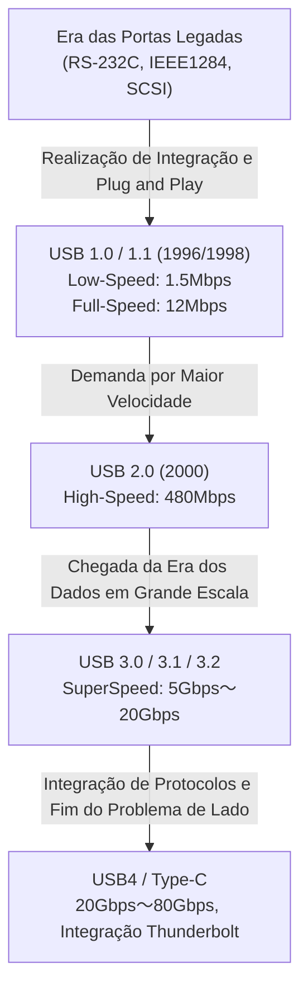

# A História do USB: Por que Evoluímos de Conectores com Lado Certo para o USB-C

## 1. Introdução: O Caos Trazido pelas Portas Legadas e a Agonia do Usuário

Antes do advento do "USB (Universal Serial Bus)", que usamos como garantido hoje, a parte traseira dos computadores pessoais do final dos anos 1980 até o início dos anos 1990 era o puro caos. Inimaginável a partir da aparência inteligente dos PCs e Macs modernos, que têm apenas interfaces limpas, uma grande variedade de portas disputava espaço, mergulhando os usuários em confusão.

### Os Limites das Portas Seriais e Paralelas
Como uma das interfaces representativas da época, a "porta serial (RS-232C)" pode ser mencionada primeiro. Esta era usada principalmente para conectar modems e mouses. A velocidade de comunicação era extremamente lenta, variando de poucos kbps a dezenas de kbps no início. As configurações também eram extremamente complexas, exigindo muitas vezes que os próprios usuários configurassem manualmente parâmetros detalhados do protocolo de comunicação, como taxa de baud, bits de parada e bits de paridade no sistema operacional ou software.

Por outro lado, "portas paralelas (como IEEE 1284)" eram usadas para conectar impressoras, scanners, etc. Esta porta, que teve origem no padrão Centronics, enviava vários bits em paralelo simultaneamente, tornando-a mais rápida do que as portas seriais da época, mas o cabo era grosso e pesado, e extremamente difícil de manusear. O conector em si também era enorme, ocupando um espaço significativo na já limitada traseira do PC.

### Portas PS/2 e a Barreira SCSI
Como interfaces de entrada, as "portas PS/2" existiam. Nomeadas porque foram adotadas no IBM Personal System/2, duas estavam disponíveis: uma para o teclado (roxa) e outra para o mouse (verde). A maior desvantagem era que elas não suportavam "hot swapping" (conexão a quente). Em outras palavras, se você desconectasse o mouse enquanto o PC estivesse ligado e o conectasse novamente, ele não seria reconhecido e, no pior dos casos, havia até o perigo de queimar fisicamente o controlador da placa-mãe.

Além disso, "SCSI (Small Computer System Interface)" era usada para discos rígidos externos, scanners de alto desempenho e unidades MO (Magneto-Ópticas) que exigiam transferência de dados em alta velocidade. O SCSI tinha altíssimo desempenho, mas conhecimento especializado era indispensável, como a conexão física de um "terminador" ao fazer conexões em daisy-chain, ou a alocação de "IDs SCSI" não sobrepostos a cada dispositivo. Era um padrão tão rigoroso que um único erro de configuração poderia congelar todo o sistema.

Assim, a forma do terminal diferia para cada periférico, as configurações eram complicadas e problemas devido a IRQ (Solicitação de Interrupção), DMA (Acesso Direto à Memória) e conflitos de endereços de E/S eram ocorrências diárias. Toda vez que os usuários compravam um novo periférico, eles eram forçados a lutar com manuais grossos e, em alguns casos, abrir o gabinete do PC para manipular os pinos de jumper da placa de expansão com pinças — um sofrimento impensável hoje.

## 2. O Desejo por "Plug and Play" e o Nascimento do USB 1.0

Para superar essa situação desastrosa e criar um mundo onde qualquer um pudesse expandir facilmente seu PC, os gigantes da indústria de TI se uniram. Por ideia de uma equipe liderada por Ajay Bhatt da Intel, sete empresas — Compaq, Microsoft, IBM, DEC, Nortel, NEC e Intel — se uniram para formar um grupo de padronização que se tornaria o antecessor do USB Implementers Forum (USB-IF). Então, em 1996, o padrão "USB 1.0" foi anunciado oficialmente.

### O Verdadeiro Significado de "Universal" Desejado
O maior objetivo do USB era, como o nome "Universal" sugere, unificar todos os periféricos sob um único padrão e formato de conector. E, acima de tudo, grande ênfase foi colocada em alcançar "Plug and Play" e "Hot Swap". Os usuários poderiam plugar e desplugar livremente o cabo enquanto o PC estivesse ligado, e o SO reconheceria automaticamente o dispositivo e instalaria o driver. Os usuários não precisariam se preocupar com nenhuma configuração detalhada. Esta foi a visão final estabelecida pelo USB.

### As Especificações do USB 1.0/1.1 e a Barreira para a Adoção
No USB 1.0, dois modos foram definidos para velocidades de comunicação:
* **Low-Speed (1,5 Mbps)**: Principalmente para dispositivos como teclados e mouses com baixo volume de transferência de dados onde o atraso não é fatal.
* **Full-Speed (12 Mbps)**: Para impressoras, armazenamento externo, equipamentos de áudio, etc.

Pelos padrões atuais, "12 Mbps" é incrivelmente lento (pode enviar apenas cerca de 1,5 MB por segundo), mas era desempenho suficiente para substituir as portas seriais da época (como 115,2 kbps). Ele também adotou uma arquitetura inovadora que permitia conectar até 127 dispositivos em uma estrutura de árvore.

No entanto, o USB 1.0 imediatamente após o anúncio não foi um mar de rosas. As versões iniciais do Windows 95 não suportavam USB nativamente, e embora o suporte adicional tenha sido fornecido mais tarde com o OSR2.1, a operação era instável, a ponto de ser ridicularizado como "Plug and Pray (Conecte e Reze)" em vez de "Plug and Play".

### A Decisão da Apple: O Avanço Trazido pelo iMac
O momento decisivo para o USB se espalhar verdadeiramente pelo mundo foi o lançamento do Windows 98 (que melhorou muito o suporte a USB) e, acima de tudo, a existência do primeiro "iMac (Bondi Blue)" anunciado pela Apple no mesmo ano (1998).

A Apple, liderada por Steve Jobs, adotou um design extremamente radical, cortando impiedosamente o drive de disquete e todas as interfaces legadas usadas em Macintosh anteriores, como ADB (Apple Desktop Bus), portas seriais e portas SCSI do iMac, reduzindo a porta de expansão externa apenas para "USB".
Como quase não havia periféricos compatíveis com USB no mercado na época, essa decisão sofreu severas críticas da indústria. No entanto, o enorme sucesso global do iMac levou os fabricantes de periféricos a mudarem de rumo em massa para o desenvolvimento de produtos compatíveis com USB, a fim de sobreviver. Como resultado, a decisão aparentemente autoritária da Apple é creditada por acelerar a adoção do USB em vários anos. No mesmo ano, o "USB 1.1", que visava corrigir bugs e melhorar a compatibilidade, foi lançado, solidificando a base do padrão.

## 3. A Revolução da Velocidade e a Era de Ouro: O Reinado do USB 2.0

Anunciado em abril de 2000, o "USB 2.0" é um dos maiores avanços da história do USB e um padrão formidável que continuou a ser o mais amplamente e por mais tempo usado até hoje.

A velocidade máxima de comunicação foi aumentada para "High-Speed (480 Mbps)", alcançando uma evolução dramática de 40 vezes de uma só vez em comparação com os 12 Mbps (Full-Speed) do USB 1.1. Essa melhoria de velocidade não foi apenas um jogo de números de especificação, mas tinha o poder de mudar fundamentalmente a vida digital das pessoas.

### A Aplicação Prática de Dispositivos de Grande Capacidade
Ao obter uma largura de banda de 480 Mbps, dispositivos de grande capacidade, que antes eram irreais para conexões USB, entraram em uso prático um após o outro.
Discos rígidos externos, drives de CD-R/RW e DVD, transferências de dados de câmeras digitais de alta qualidade na casa dos megapixels, bem como sintonizadores de TV e interfaces de áudio de alta qualidade, agora operavam confortavelmente via USB. Entre eles, a propagação explosiva da "memória USB (pen drive)" tornou a mídia removível herdada, como disquetes e discos MO, completamente obsoleta.

Além disso, o USB 2.0 manteve perfeita compatibilidade com versões anteriores e teve um design excelente que permitia que dispositivos USB 1.1 fossem conectados e operassem como estão. Durante este período, o USB saltou para fora do mundo dos PCs e estabeleceu sua posição como o "verdadeiro padrão universal", sendo instalado em todos os tipos de dispositivos eletrônicos, incluindo TVs, gravadores de DVD/BD, consoles de videogame domésticos e sistemas de navegação automotiva.

## 4. Proliferação de Padrões e a Tragédia do Conector: A Chegada da Era Móvel e o Micro-B

O sucesso do USB 2.0 fez parecer que o sonho de conectar todos os dispositivos via USB havia sido realizado. No entanto, a nova onda de dispositivos móveis menores e mais finos (telefones celulares, câmeras digitais, players de MP3, etc.) trouxe sérios problemas para os formatos de conectores USB.

### Divisão de Funções Entre Type-A e Type-B
A filosofia original de design do USB tinha uma regra estrita: adotar o conector "Type-A (retangular achatado)" no lado do host (o lado que controla, como um PC) e o conector "Type-B (formato quase quadrado)" no lado do dispositivo (o lado controlado, como uma impressora ou scanner). Isso impedia fisicamente que os usuários conectassem acidentalmente PCs diretamente uns aos outros com um cabo, causando curtos-circuitos ou danos.

### A Proliferação de Conectores Pequenos
No entanto, embora o conector Type-B fosse adequado para equipamentos grandes, como impressoras, ele era simplesmente massivo demais para caber em telefones celulares ou câmeras digitais finas. Portanto, "Mini-A" e "Mini-B" foram padronizados visando à miniaturização. O Mini-B, em particular, tornou-se amplamente utilizado em câmeras digitais e HDDs portáteis da época.
No entanto, conforme os dispositivos se tornaram ainda mais finos, até mesmo o Mini-B passou a ser considerado muito grosso e obstrutivo. Assim, em 2007, o "Micro-A" e o "Micro-B", que eram mais finos e mais duráveis, foram anunciados.

Em particular, o "Micro-B" ganhou uma fatia esmagadora do mercado como o conector padrão mundial para carregamento e comunicação de dados, principalmente para smartphones Android que começaram a se espalhar rapidamente. Na Europa, de uma perspectiva de proteção ambiental (redução do lixo eletrônico), havia forte pressão para unificar o terminal de carregamento de telefones celulares para Micro-USB, o que impulsionou sua popularidade.

### O USB de Schrödinger: O "Problema do Lado Certo" Que Incomodou a Humanidade
A maior tragédia que ocorreu aqui, e que ficaria profundamente gravada na história humana, foi o "problema do lado do USB".
Tanto o Type-A padrão quanto o Micro-B miniaturizado têm formatos verticalmente assimétricos e só podem ser inseridos na orientação correta. No entanto, o formato foi tão perfeitamente concebido para ser "muito difícil de dizer qual lado é o de cima à primeira vista".

"Você tenta inserir e há resistência -> Você o vira para tentar inseri-lo, mas ainda não entra -> Você o vira mais uma vez e, de alguma forma, ele entra facilmente"

Esse fenômeno incompreensível se tornou um meme da internet em todo o mundo como "a superposição do USB (superposição quântica)" ou "conector 4D", desgastando o valioso tempo e a energia mental das pessoas. Incidentes trágicos em que os usuários inseriam à força na direção errada, destruindo o terminal do smartphone, também ocorreram com frequência. Até mesmo Ajay Bhatt, o criador do USB, expressou seu arrependimento e o dilema do desenvolvimento em uma entrevista posterior, dizendo: "Devíamos tê-lo tornado reversível (compatível com os dois lados) desde o início, mas na época não tivemos escolha a não ser implementá-lo em um único lado para reduzir custos."

## 5. A Chegada do SuperSpeed e a Confusão de Nomenclatura: A Série USB 3.x

Entrando no final dos anos 2000, os tamanhos dos arquivos a serem manuseados, como dados de vídeo em qualidade HD e dados de jogos de grande capacidade, saltaram para a classe do terabyte, e a falta de velocidade de 480 Mbps do USB 2.0 tornou-se perceptível.
Como resultado, o "USB 3.0" foi anunciado em 2008.

### Conector Azul e SuperSpeed
A velocidade máxima de comunicação do USB 3.0 foi nomeada "SuperSpeed (5 Gbps)", alcançando uma impressionante largura de banda de mais de 10 vezes a do USB 2.0.
Em termos de estrutura física, adotou uma estrutura de 9 pinos, adicionando 5 novos pinos para transferência de dados de ultra-alta velocidade (2 para transmissão, 2 para recepção e GND) em cima dos 4 pinos convencionais (alimentação, GND, D+, D-) que existiam até o USB 2.0.
A característica mais marcante na aparência foi que a parte de plástico dentro do conector foi designada como "azul (Pantone 300C)" para distingui-lo dos terminais convencionais. Isso permitiu que os usuários entendessem intuitivamente que "se você conectar terminais azuis com um cabo azul, é rápido".

### Nomenclatura Desviada
Contrariando o seu sucesso tecnológico, o departamento de marketing do USB-IF se envolveu em mudanças de nome incompreensíveis e repetidas, arrastando os consumidores e a indústria de PCs para um profundo vórtice de confusão.

* **2013**: O "USB 3.1" foi anunciado, e a velocidade aumentou para 10 Gbps (SuperSpeed+). Isso foi bom, mas ao mesmo tempo, eles renomearam o nome do USB 3.0 convencional (5 Gbps) para "USB 3.1 Gen 1" e o novo 10 Gbps para "USB 3.1 Gen 2".
* **2017**: Além disso, o "USB 3.2", que aumentou a velocidade para 20 Gbps, foi anunciado. E mais uma vez eles decidiram mudar os nomes dos padrões anteriores, chamando os 5 Gbps de "USB 3.2 Gen 1", 10 Gbps de "USB 3.2 Gen 2", e os novos 20 Gbps de "USB 3.2 Gen 2x2".

Como resultado, mesmo que "Compatível com USB 3.2!" estivesse escrito em letras garrafais na embalagem dos produtos alinhados nas lojas de eletrônicos, não apenas os consumidores em geral, mas até mesmo os especialistas não conseguiam dizer se era de 5 Gbps ou 20 Gbps sem ler cuidadosamente a folha de especificações. Isso levou ao pior cenário de minar a confiabilidade do padrão.

## 6. O Conector Definitivo "Type-C" e a Revolução de Energia "Power Delivery"

A confusão devido à proliferação de formatos de conector, a frustração do problema de "lado certo" e os nomes de versão incrivelmente complexos. Para resolver todos esses problemas de uma vez, o USB-IF reuniu todas as suas forças e anunciou o "USB Type-C (USB-C)" em 2014, o que pode ser considerado a culminação da história do USB.

### As Três Revoluções Trazidas pelo Type-C
O Type-C não era apenas um novo formato de conector, mas tinha três recursos inovadores que mudariam a forma como a computação funciona.

1. **Realização de Estrutura Reversível**
   Ao organizar os pinos (24 pinos) dentro do conector assimetricamente (em simetria de pontos), ele agora podia ser inserido em qualquer direção, para cima ou para baixo. O momento em que o "problema do USB de Schrödinger" que atormentou a humanidade por tantos anos foi finalmente e completamente resolvido. O conector em si mantém o mesmo nível de tamanho compacto do Micro-B e pode ser instalado em qualquer dispositivo, desde smartphones ultrafinos até grandes PCs de mesa.
2. **Abolição da Distinção Entre Host e Dispositivo e o Pino CC**
   Aboliu a distinção física entre Type-A e Type-B e fez do cabo com conectores Type-C em ambas as extremidades o padrão. Funciona independentemente de qual extremidade você conecta onde. Para conseguir isso, um novo pino de comunicação chamado "CC (Configuration Channel)" foi instalado no Type-C, e um sistema inteligente foi introduzido onde os dispositivos negociam de forma altamente avançada (diálogo por protocolo de comunicação) sobre "qual é o host e qual é o dispositivo" e "em qual direção enviar energia" no momento em que estão conectados.
3. **Modo Alternativo (Alternate Mode)**
   Além da comunicação de dados do USB, os protocolos de outras empresas também puderam fluir pelo cabo Type-C. Um representante é o "DisplayPort Alternate Mode". Como resultado, tornou-se possível enviar sinais de vídeo de alta resolução de um PC para um monitor com um único cabo Type-C, sem usar um cabo HDMI ou DisplayPort dedicado.

### A Revolução da Energia com o USB Power Delivery (USB PD)
O que tirou o potencial máximo do Type-C foi o padrão de fornecimento de energia "USB Power Delivery (USB PD)", que evoluiu ao mesmo tempo.
A capacidade de fornecimento de energia no início do USB 1.0/2.0 era de apenas 2,5W (5V/0,5A), o que mal dava para alimentar um mouse e um teclado. Mesmo o USB 3.0 tinha 4,5W (5V/0,9A), o que era um número difícil para o carregamento rápido de smartphones.

No entanto, o USB PD tornou possível fornecer uma enorme potência elétrica de até 20V/5A, ou "100W". Além disso, a atualização "USB PD EPR (Extended Power Range)" de 2021 o estendeu para um máximo de 48V/5A, ou "240W".
O poder de 100W a 240W é um valor suficiente para cobrir não apenas o carregamento rápido de smartphones e tablets, mas também laptops topo de linha que consomem grandes quantidades de energia, como o MacBook Pro e PCs para jogos, bem como a alimentação de grandes monitores de cristal líquido.

"A partir de um monitor equipado com saída de vídeo, apenas um único cabo Type-C envia vídeo para um laptop e carrega simultaneamente o computador a partir do monitor com grande potência"
O ambiente que antes exigia três cabos: um cabo de alimentação, um cabo de vídeo e um cabo USB de dados agora é concluído com um único cabo Type-C. Isso percebeu a máxima transformação inteligente em ambientes de escritório e trabalho remoto.

## 7. Uma Fusão Histórica com o Poderoso Rival "Thunderbolt"

Ao discutir a história da evolução do USB, o que absolutamente não pode ser omitido é a existência do "Thunderbolt".
O Thunderbolt é um padrão de interface de altíssima velocidade co-desenvolvido pela Intel e pela Apple. Originalmente codinome "Light Peak", foi planejado usar fibra óptica, mas devido a problemas de custo, apareceu como "Thunderbolt 1" baseado em cobre em 2011.

### Filosofias de Design Diferentes
Enquanto o USB visava "conectar facilmente e a baixo custo vários periféricos", o Thunderbolt adotou uma abordagem extremamente potente e de alto desempenho de "puxar os barramentos PCI Express e saída de vídeo (DisplayPort) diretamente para o lado de fora". Por esse motivo, provou-se útil para usos profissionais que eram impossíveis de alcançar devido a restrições de latência ou largura de banda no USB, como conectar uma GPU externa ou armazenamento RAID de ultra-alta velocidade.

Inicialmente, Thunderbolt 1 e 2 adotaram o mesmo formato de conector que o Mini DisplayPort e foram implementados como um recurso exclusivo para Mac. No entanto, a Intel, sentindo-se ameaçada pelo lento progresso da adoção pela base de PCs com Windows, tomou a decisão histórica no "Thunderbolt 3" anunciado em 2015 para mudar o formato do conector de seu próprio formato proprietário para o "USB Type-C".

### A Confusão do Type-C e o Caminho para a Integração
Unificar o conector para o Type-C aumentou a conveniência, mas também trouxe uma nova confusão avançada e invisível para os usuários, de uma dimensão diferente da profusão anterior de terminais. "Embora a aparência seja exatamente o mesmo terminal e cabo Type-C, os protocolos de comunicação dentro podem ser USB ou Thunderbolt 3. E pode haver ou não haver compatibilidade."

Para resolver radicalmente essa situação excessivamente complexa, a Intel tomou a atitude surpreendente em 2019 de "doar (oferecer sem custo)" a especificação de protocolo do Thunderbolt 3 para o USB-IF.
O padrão de próxima geração formulado com base nesse fornecimento de tecnologia pela Intel é o "USB4".

### USB4: O Padrão de Integração Definitivo
Com o advento do USB4, o USB e o Thunderbolt, tanto no nome e na realidade, alcançaram a "fusão". O USB4 ostenta velocidades de comunicação de até 40 Gbps de fábrica (o mais recente USB4 Versão 2.0 atinge 80 Gbps e até 120 Gbps no modo assimétrico) e oficialmente suporta o tunelamento PCIe.
Em outras palavras, os recursos que antes eram privilégio do Thunderbolt, como "conectar uma GPU externa", agora podem ser usados como especificações padrão do USB. Ao mesmo tempo, esforços para retornar a um nome de marca que mostre diretamente as velocidades, como "USB 40Gbps", também começaram, e nomes extremamente difíceis de entender, como "USB 3.2 Gen 2x2", foram descontinuados.

## 8. Regulamentações Ambientais e o Futuro: Unificação Global Type-C e Desafios Futuros

A evolução do USB alcançou um ponto de virada importante, não apenas de uma perspectiva tecnológica, mas também de uma perspectiva política e ambiental.

### A Lei de Unificação de Terminais de Carga pela União Europeia (UE)
Em 2022, o Parlamento Europeu da União Europeia (UE) aprovou uma lei obrigando que o terminal de carregamento de pequenos dispositivos eletrônicos, como smartphones, tablets e câmeras digitais, seja "unificado para USB Type-C". O principal objetivo deste projeto de lei é evitar o desperdício de consumidores comprando cabos ou carregadores diferentes para cada dispositivo e reduzir as "sucatas eletrônicas (e-waste)" que atingem dezenas de milhares de toneladas por ano.

O maior alvo desta regulamentação foi o iPhone da Apple, que continuou a usar o padrão proprietário terminal "Lightning" por muitos anos. A Apple resistiu, argumentando que isso "inibiria a inovação", mas no final, não pôde ignorar o enorme mercado da UE e, na série iPhone 15 lançada em 2023, finalmente aboliu o Lightning e adotou o USB Type-C.
Como resultado, a "completa unificação do mundo" foi alcançada, pois quase todos os dispositivos movidos a bateria que usamos diariamente, como Android, iPhone, Mac, PCs com Windows, iPad, Nintendo Switch e fones de ouvido sem fio, podem ser carregados com um único cabo Type-C.

### O Desafio Restante: A Loteria dos Cabos
Com a unificação dos terminais de hardware para o Type-C, a conveniência foi maximizada. No entanto, nem todos os desafios para o futuro desapareceram.
Atualmente, o problema que mais atormenta os usuários é conhecido como "loteria dos cabos" (cable gacha).

Mesmo que um cabo tenha terminais Type-C em ambas as extremidades, com base no que está dentro (a presença ou ausência de um chip eMarker integrado, ou o número de fios conectados), existem disparidades de desempenho desesperadoras como as seguintes:
* Um cabo extremamente fino que suporta apenas carregamento e transferência de dados para USB 2.0 (480 Mbps)
* Um cabo que suporta carregamento de 60W, mas não suporta saída de vídeo
* Um cabo Thunderbolt 4 muito grosso, curto e caro que suporta carregamento de 100W (ou 240W), bem como transferência de dados de 40 Gbps e saída de vídeo 8K.

Como parecem exatamente iguais, mas o desempenho difere completamente, o usuário precisa olhar de perto a caixa do cabo e o pequeno logotipo impresso na parte do conector para poder diferenciar. É uma realidade irônica que "como resultado da unificação dos conectores, isso levou a uma confusão no conteúdo dos cabos".

## 9. Conclusão: Uma Jornada Sem Fim Rumo ao Universal

Em 1996, o USB nasceu com o grande sonho de "conectar tudo com apenas um único terminal de uso geral" no mundo dos PCs, que estava atormentado com inúmeras portas diferentes e sofria com conflitos de IRQ.

Seu caminho não tem sido plano. Comprometimentos devido à falta de velocidade, a proliferação causada pela miniaturização dos conectores, a irritação do problema de lado a lado, a confusão de nomes de marketing errôneos, e o relacionamento complexo com seu formidável rival Thunderbolt.
No entanto, o USB a cada vez reuniu a sabedoria da indústria de TI, preservando a compatibilidade (e às vezes incluindo autodestruição audaciosa) para continuar evoluindo.

As velocidades de transferência saltaram de 1,5 Mbps para 80 Gbps em um fator de dezenas de milhares, e a entrega de energia aumentou cerca de 100 vezes de 2,5W para 240W. E ao obter um receptáculo física e funcionalmente superior com o Type-C, o USB finalmente percebeu seu ideal inicial de ser "Universal" um quarto de século após o seu nascimento.

Seja qual for o nome da próxima geração e qual for a velocidade, sem dúvida continuará fornecendo uma experiência de conexão mais simples, poderosa e refinada, à medida que os cabos de aparência desajeitada e desnecessários desaparecerão das proximidades de nossas mesas. A evolução do terminal inconveniente com um lado certo e errado para o USB-C pode ser considerada uma das maiores trajetórias da história do hardware de TI, à medida que a humanidade continuou a buscar conveniência e racionalidade.
