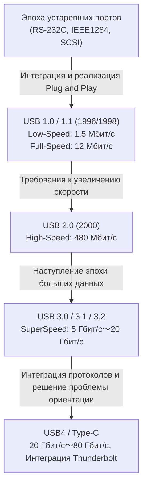

# История USB: почему мы перешли от односторонних разъемов к USB-C

## 1. Введение: хаос устаревших портов и страдания пользователей

До появления «USB (Универсальной последовательной шины)», к которой мы сейчас привыкли, задняя панель персональных компьютеров конца 1980-х — начала 1990-х годов представляла собой настоящий хаос. Трудно представить по сравнению с современными ПК и Mac с их аккуратными интерфейсами, но тогда там теснилось множество различных портов, приводя пользователей в замешательство.

### Ограничения последовательных и параллельных портов
В качестве типичного интерфейса того времени можно назвать «последовательный порт (RS-232C)». В основном он использовался для подключения модемов и мышей. Скорость передачи данных была очень низкой: от нескольких кбит/с до десятков кбит/с в ранних версиях. Настройка была крайне сложной, и пользователям часто приходилось вручную задавать подробные параметры протокола связи (скорость передачи, стоповые биты, биты четности и т. д.) в ОС или программном обеспечении.

С другой стороны, для подключения принтеров и сканеров использовался «параллельный порт (например, IEEE 1284)». Этот порт, берущий начало от стандарта Centronics, передавал несколько битов параллельно, поэтому был быстрее последовательного порта того времени, но кабель был толстым, тяжелым, и с ним было очень трудно обращаться. Кроме того, сам разъем был огромным и занимал значительную часть ограниченного пространства на задней панели ПК.

### Барьеры портов PS/2 и SCSI
В качестве интерфейса ввода существовал «порт PS/2». Он получил свое название благодаря использованию в IBM Personal System/2, и для него были предусмотрены два порта: для клавиатуры (фиолетовый) и для мыши (зеленый). Главным недостатком было отсутствие поддержки «горячей замены (hot swap)». Это означало, что если вытащить мышь при включенном ПК, а затем снова вставить ее, она не распознавалась, а в худшем случае даже существовала опасность физического перегорания контроллера материнской платы.

Кроме того, для внешних жестких дисков, высокопроизводительных сканеров и приводов MO, требовавших высокой скорости передачи данных, использовался интерфейс «SCSI (Small Computer System Interface)». SCSI обладал высокой производительностью, но требовал специальных знаний, таких как физическое подключение «терминатора (согласующего резистора)» при шлейфовом соединении (daisy chain) и назначение уникального «SCSI ID» каждому устройству. Это был строгий стандарт, где одна ошибка в настройках могла привести к зависанию всей системы.

Таким образом, форма разъема различалась для каждого периферийного устройства, настройки были сложными, а проблемы, связанные с конфликтами IRQ (запросов прерываний), DMA (прямого доступа к памяти) и адресов ввода-вывода, были обычным делом. Каждый раз, когда пользователи покупали новое периферийное устройство, они боролись с толстыми руководствами, а иногда им приходилось открывать корпус ПК и пинцетом переключать перемычки на картах расширения — испытание, которое сегодня кажется немыслимым.

## 2. Мечта о «Plug and Play» и рождение USB 1.0

Чтобы преодолеть эту катастрофическую ситуацию и создать мир, где каждый мог бы легко расширить возможности своего ПК, гиганты ИТ-индустрии объединили усилия. По инициативе команды под руководством Аджая Бхатта из Intel, объединились семь компаний: Compaq, Microsoft, IBM, DEC, Nortel и NEC, образовав группу по разработке стандарта, ставшую предшественником USB Implementers Forum (USB-IF). И вот в 1996 году был официально представлен стандарт «USB 1.0».

### Истинный смысл слова «Универсальный»
Главной целью USB, как следует из слова «Универсальный (Universal)» в названии, было унифицировать все периферийные устройства под одним стандартом и одной формой разъема. И что более важно, акцент делался на реализации технологий «Plug and Play» и «Горячая замена (Hot Swap)». Пользователи могли свободно подключать и отключать кабели, пока ПК был включен, а ОС автоматически распознавала устройства и устанавливала драйверы. Пользователям не нужно было беспокоиться ни о каких сложных настройках. Это было конечное видение, заявленное USB.

### Характеристики USB 1.0/1.1 и препятствия для распространения
В USB 1.0 были определены два режима скорости связи:
* **Low-Speed (1.5 Мбит/с)**: В основном для устройств с небольшим объемом передаваемых данных и не критичных к задержкам, таких как клавиатуры и мыши.
* **Full-Speed (12 Мбит/с)**: Для принтеров, внешних накопителей, аудиооборудования и т. д.

С сегодняшней точки зрения «12 Мбит/с» — это невероятно медленно (около 1,5 МБ в секунду), но этого было достаточно, чтобы заменить последовательные порты того времени (например, 115,2 кбит/с). Кроме того, была применена революционная архитектура, позволяющая подключать до 127 устройств в виде дерева.

Однако сразу после анонса дела у USB 1.0 шли не слишком гладко. Ранние версии Windows 95 не поддерживали USB нативно, и, хотя поддержка была наконец добавлена в более поздней версии OSR2.1, она работала нестабильно, что вызывало насмешки: технологию называли «Plug and Pray (Включай и молись)» вместо «Plug and Play».

### Решение Apple: прорыв, принесенный iMac
Решающим моментом, который по-настоящему распространил USB по всему миру, стал выпуск Windows 98 в 1998 году (со значительными улучшениями поддержки USB) и, что самое главное, появление в том же году первого «iMac (цвет Bondi Blue)» от Apple.

Apple под руководством Стива Джобса приняла чрезвычайно радикальное решение для iMac: безжалостно отказаться от дисковода гибких дисков, а также от всех устаревших интерфейсов, таких как ADB (Apple Desktop Bus), последовательных и SCSI-портов, которые использовались в предыдущих компьютерах Macintosh, и оставить только «USB» в качестве внешнего порта расширения.
Поскольку в то время на рынке почти не было периферийных устройств с поддержкой USB, это решение вызвало резкую критику со стороны отрасли. Однако, поскольку iMac стал мировым хитом, производители периферийных устройств немедленно переключились на разработку продуктов, совместимых с USB, чтобы выжить. В результате жесткое решение Apple, как считается, ускорило распространение USB на несколько лет. В том же году была выпущена версия «USB 1.1» с исправленными ошибками и улучшенной совместимостью, что укрепило позиции стандарта.

## 3. Революция скорости и Золотой Век: господство USB 2.0

Анонсированный в апреле 2000 года стандарт «USB 2.0» стал одним из величайших прорывов в истории USB и остается самым долгоживущим и широко используемым стандартом по сей день.

Максимальная скорость связи была увеличена до уровня «High-Speed (480 Мбит/с)», что в 40 раз больше, чем full-speed USB 1.1 (12 Мбит/с). Это увеличение скорости было не просто игрой цифр в спецификациях; оно имело силу кардинально изменить цифровую жизнь людей.

### Практическое использование устройств большой емкости
Получив пропускную способность в 480 Мбит/с, одно за другим стали появляться устройства большой емкости, что раньше было нереально при подключении по USB.
Внешние жесткие диски, приводы CD-R/RW и DVD, передача данных с многомегапиксельных цифровых камер высокого разрешения, а также ТВ-тюнеры и высококачественные аудиоинтерфейсы стали комфортно работать через USB. В частности, взрывное распространение «USB-накопителей (флешек)» сделало устаревшие съемные носители, такие как дискеты и MO-диски, пережитком прошлого.

Кроме того, USB 2.0 сохранил идеальную обратную совместимость, что было отличным дизайнерским решением, позволяющим устройствам USB 1.1 работать так же, как и при подключении. В это время USB вышел за пределы мира ПК и утвердился в качестве «истинно универсального стандарта», применяемого во всех видах электронного оборудования: от телевизоров, DVD/BD-рекордеров и домашних игровых консолей до автомобильных навигационных систем.

## 4. Разнообразие стандартов и трагедия разъемов: наступление мобильной эры и Micro-B

С успехом USB 2.0 казалось, что мечта о подключении всех устройств через USB стала реальностью. Однако новая волна миниатюризации и создания более тонких мобильных устройств (мобильных телефонов, цифровых камер, MP3-плееров и т. д.) привела к серьезным проблемам с формой разъема USB.

### Разделение ролей Type-A и Type-B
Первоначальная концепция USB предполагала строгое правило: на стороне хоста (управляющая сторона, например ПК) используется разъем «Type-A (плоский прямоугольник)», а на стороне устройства (управляемая сторона, например принтер или сканер) — «Type-B (почти квадратный)». Это физически предотвращало ошибочное прямое подключение компьютеров друг к другу кабелем, что могло привести к короткому замыканию и поломке.

### Появление множества компактных разъемов
Однако разъем Type-B подходил для крупных устройств вроде принтеров, но был слишком огромным для установки в мобильные телефоны и тонкие цифровые камеры. В результате для миниатюризации были стандартизированы разъемы «Mini-A» и «Mini-B». В частности, Mini-B получил широкое распространение в цифровых камерах и ранних портативных жестких дисках.
Но по мере того, как устройства становились все тоньше, даже Mini-B стали считать слишком толстым и мешающим. Поэтому в 2007 году были представлены более тонкие и прочные «Micro-A» и «Micro-B».

В частности, «Micro-B» занял подавляющую долю рынка как мировой стандарт для зарядки и передачи данных мобильных терминалов, особенно быстро распространяющихся смартфонов на базе Android. В Европе с целью защиты окружающей среды (сокращения электронных отходов) было оказано сильное давление с целью унификации зарядных терминалов мобильных телефонов под стандарт Micro-USB, что способствовало его популяризации.

### USB Шредингера: «проблема ориентации», которая мучила человечество
Крупнейшая трагедия, которая произошла в этот момент и навсегда останется в истории человечества, — это «проблема ориентации USB».
Как стандартный Type-A, так и компактный Micro-B имеют асимметричную форму сверху и снизу и могут быть вставлены только в правильном направлении. Однако их форма была настолько коварной, что «с первого взгляда очень трудно понять, какая сторона верхняя».

«Пытаешься вставить, но чувствуешь сопротивление → Переворачиваешь и пытаешься вставить, но все равно не идет → Снова переворачиваешь, и почему-то входит легко»

Это необъяснимое явление стало интернет-мемом во всем мире как «суперпозиция USB (квантовая суперпозиция)» или «четырехмерный разъем», отнимая драгоценное время и нервы людей. Также часто происходили трагические случаи, когда попытки вставить разъем силой обратной стороной приводили к разрушению порта смартфона. Даже Аджай Бхатт, создатель USB, в более поздних интервью говорил о своем сожалении и дилемме во время разработки, заявляя: «Нам следовало сделать его двусторонним (reversible) с самого начала, но в то время у нас не было выбора, кроме как сделать его односторонним для снижения затрат».

## 5. Приход SuperSpeed и путаница в названиях: серия USB 3.x

В конце 2000-х годов размеры файлов, таких как видеоданные высокой четкости и данные игр большого объема, достигли уровня терабайт, и скорости USB 2.0 (480 Мбит/с) стало явно не хватать.
Так в 2008 году был представлен «USB 3.0».

### Синий разъем и SuperSpeed
Максимальная скорость связи USB 3.0 получила название «SuperSpeed (5 Гбит/с)», что обеспечило пропускную способность, более чем в 10 раз превышающую USB 2.0.
С точки зрения физической структуры, в дополнение к традиционным 4 контактам (Питание, GND, D+, D-) USB 2.0 была использована 9-контактная структура с 5 новыми контактами для сверхскоростной передачи данных (2 для передачи, 2 для приема, GND).
Самая важная внешняя особенность заключалась в том, что пластиковая часть внутри разъема была обозначена «синим (Pantone 300C)» для отличия от обычных разъемов. Это позволило пользователям интуитивно понять: «Если соединить синие разъемы синим кабелем, будет быстро».

### Путаница с названиями
Однако вопреки техническому успеху, маркетинговый отдел USB-IF проводил непонятные переименования, повергая потребителей и индустрию ПК в глубокую путаницу.

* **2013 год**: Был анонсирован «USB 3.1», и скорость увеличилась до 10 Гбит/с (SuperSpeed+). Все бы ничего, но одновременно они переименовали старый USB 3.0 (5 Гбит/с) в «USB 3.1 Gen 1», а новый (10 Гбит/с) — в «USB 3.1 Gen 2».
* **2017 год**: Был анонсирован «USB 3.2», который еще больше увеличил скорость до 20 Гбит/с. И снова они изменили названия предыдущих стандартов: было решено называть 5 Гбит/с «USB 3.2 Gen 1», 10 Гбит/с — «USB 3.2 Gen 2», а новый (20 Гбит/с) — «USB 3.2 Gen 2x2».

В результате даже если на упаковке продукта в магазине электроники крупными буквами написано «Поддержка USB 3.2!», ни обычные потребители, ни даже эксперты не могут определить, 5 это Гбит/с или 20 Гбит/с, не прочитав внимательно технические характеристики. Это привело к худшей ситуации, подорвав доверие к стандарту.

## 6. Идеальный разъем «Type-C» и революция питания «Power Delivery»

Чтобы одним махом решить проблемы путаницы с формами разъемов, разочарования от проблемы ориентации и сложных названий версий, USB-IF объединил усилия и представил в 2014 году «USB Type-C (USB-C)», который можно назвать кульминацией истории USB.

### Три революции, которые принес Type-C
Type-C — это не просто разъем новой формы, он обладал тремя революционными характеристиками, которые изменили мир вычислений.

1. **Реализация реверсивной структуры**
   Расположив контакты внутри разъема (24 контакта) симметрично относительно центра, его стало возможным вставлять любой стороной. В этот момент была полностью решена проблема «USB Шредингера», которая долгие годы мучила человечество. Сам разъем остался таким же компактным, как Micro-B, и может быть установлен в любое устройство, от ультратонких смартфонов до больших настольных ПК.
2. **Устранение различий между хостом и устройством и контакт CC**
   Физическое различие между Type-A и Type-B было упразднено, и стандартом стал кабель с разъемами Type-C на обоих концах. Он работает независимо от того, какой конец куда вставлен. Чтобы реализовать это, в Type-C был добавлен новый контакт «CC (Configuration Channel)» для связи, внедривший интеллектуальный механизм, с помощью которого устройства в момент подключения ведут сложные переговоры (диалог по протоколу связи) о том, «кто является хостом, а кто устройством» и «в каком направлении подавать питание».
3. **Альтернативный режим (Alternate Mode)**
   В кабель Type-C стала возможной передача не только данных USB, но и протоколов других компаний. Типичным примером является «DisplayPort Alternate Mode». Благодаря этому стало возможным выводить видеосигнал высокого разрешения с ПК на монитор с помощью одного кабеля Type-C без использования специальных кабелей HDMI или DisplayPort.

### Революция электропитания благодаря USB Power Delivery (USB PD)
Потенциал Type-C довел до максимума развивавшийся параллельно стандарт питания «USB Power Delivery (USB PD)».
Мощность ранних версий USB 1.0/2.0 составляла всего 2.5 Вт (5 В/0.5 А), чего едва хватало для работы мыши или клавиатуры. Даже USB 3.0 выдавал 4.5 Вт (5 В/0.9 А), что было недостаточным для быстрой зарядки смартфона.

Однако USB PD позволил подавать огромную мощность — «100 Вт» при максимальном напряжении 20 В/5 А. Более того, с обновлением «USB PD EPR (Extended Power Range)» в 2021 году она была увеличена до «240 Вт» при 48 В/5 А.
Мощность от 100 Вт до 240 Вт — это значение, которое может обеспечить не только быструю зарядку смартфонов и планшетов, но и питание мощных высокопроизводительных ноутбуков, таких как MacBook Pro или игровые ПК, и даже питание больших ЖК-мониторов.

«Монитор с видеовыходом может передавать видео на ноутбук с помощью одного кабеля Type-C, одновременно заряжая ноутбук от монитора большой мощностью».
Среда, для которой когда-то требовались три кабеля: кабель питания, видеокабель и кабель передачи данных USB, теперь завершена всего одним кабелем Type-C. Это позволило добиться предельной оптимизации офисной среды и удаленной работы.

## 7. Историческое слияние с сильным конкурентом «Thunderbolt»

Рассказывая об истории эволюции USB, нельзя не упомянуть о существовании «Thunderbolt».
Thunderbolt — это стандарт сверхвысокоскоростного интерфейса, совместно разработанный компаниями Intel и Apple. Первоначально он назывался кодовым именем «Light Peak» и задумывался как интерфейс на основе оптического волокна, но из-за проблем со стоимостью он появился в 2011 году на медной основе как «Thunderbolt 1».

### Разные концепции проектирования
В то время как USB стремился «просто и недорого подключать различные периферийные устройства», Thunderbolt применил крайне мощный и высокопроизводительный подход: «вывести внутреннюю шину PCI Express и видеовыход (DisplayPort) напрямую из ПК наружу». В результате он стал незаменимым в профессиональных приложениях, таких как внешние графические процессоры или сверхскоростные RAID-массивы, которые были невозможны с использованием USB из-за задержек и ограничений пропускной способности.

Первоначально Thunderbolt 1 и 2 использовали форму разъема Mini DisplayPort и были разработаны как эксклюзивная функция для компьютеров Mac. Однако, осознав опасность того, что распространение среди Windows-ПК шло медленно, Intel приняла историческое решение при анонсе «Thunderbolt 3» в 2015 году перевести форму разъема со своей собственной на «USB Type-C».

### Путаница с Type-C и путь к интеграции
Унификация разъемов под стандарт Type-C повысила удобство, но одновременно внесла новую, более глубокую и невидимую путаницу среди пользователей, отличную от прежнего разнообразия разъемов: «разъемы и кабели выглядят абсолютно одинаково как Type-C, но внутренний протокол связи может быть как USB, так и Thunderbolt 3. И они могут быть совместимы или нет».

Чтобы в корне решить эту слишком сложную ситуацию, в 2019 году Intel предприняла удивительный шаг — «бесплатно предоставила (подарила)» спецификацию протокола Thunderbolt 3 форуму USB-IF.
Именно стандарт следующего поколения, разработанный на основе этой технологии, предоставленной Intel, и есть «USB4».

### USB4: стандарт максимальной интеграции
С появлением USB4, USB и Thunderbolt по-настоящему «слились» как по названию, так и по сути. USB4 стандартно поддерживает максимальную скорость связи 40 Гбит/с (последняя версия USB4 Version 2.0 достигает 80 Гбит/с, а в асимметричном режиме — до 120 Гбит/с) и официально поддерживает туннелирование PCIe.
Другими словами, «подключение внешнего графического процессора», которое раньше было привилегией Thunderbolt, теперь доступно как стандартная функция USB. В то же время были предприняты усилия по отказу от таких чрезвычайно запутанных названий, как «USB 3.2 Gen 2x2», и возвращению к названиям брендов, напрямую указывающим скорость, например, «USB 40Gbps».

## 8. Экологическое регулирование и будущее: Унификация Type-C и будущие задачи

Эволюция USB достигла серьезного поворотного момента не только с технической, но и с политической и экологической точек зрения.

### Законопроект Европейского Союза (ЕС) об унификации зарядных терминалов
В 2022 году Европейский парламент Европейского союза (ЕС) принял законопроект, обязывающий «унифицировать зарядные терминалы» на «USB Type-C» для небольших электронных устройств, таких как смартфоны, планшеты и цифровые камеры. Главная цель этого законопроекта — избавить потребителей от необходимости покупать разные кабели и зарядные устройства для каждого аппарата и сократить объемы «электронных отходов (E-waste)», которые достигают десятков тысяч тонн в год.

Главной мишенью этого регулирования стал iPhone от Apple, который на протяжении многих лет использовал собственный стандартный разъем «Lightning». Apple сопротивлялась, утверждая, что это «препятствует инновациям», но в конце концов не смогла игнорировать огромный рынок ЕС и в серии iPhone 15, выпущенной в 2023 году, наконец, отказалась от Lightning и внедрила USB Type-C.
В результате почти все устройства с батарейным питанием, которые мы используем ежедневно, такие как Android, iPhone, Mac, Windows ПК, iPad, Nintendo Switch и беспроводные наушники, теперь можно заряжать с помощью одного кабеля Type-C, что означает «полную глобальную унификацию».

### Оставшиеся проблемы: «Кабельная лотерея»
С унификацией аппаратных терминалов на Type-C удобство возросло до максимума. Однако не все проблемы будущего исчезли.
В настоящее время проблема, которая больше всего беспокоит пользователей, — это так называемая «кабельная лотерея».

Даже если кабель имеет разъемы Type-C на обоих концах, в зависимости от его содержимого (наличия встроенного чипа eMarker и количества подключенных жил) существует катастрофическая разница в производительности, как показано ниже:
* Тонкие кабели, поддерживающие только зарядку, а передача данных идет по стандарту USB 2.0 (480 Мбит/с)
* Кабели, поддерживающие зарядку 60 Вт, но не поддерживающие вывод видео
* Кабели, поддерживающие зарядку 100 Вт (или 240 Вт), передачу данных 40 Гбит/с, а также вывод видео 8K, но они очень толстые, короткие и дорогие, например, кабели Thunderbolt 4

Поскольку они выглядят абсолютно одинаково, но их производительность совершенно разная, пользователям приходится пристально вглядываться в логотипы, напечатанные мелким шрифтом на упаковке кабеля или на самом разъеме. Ирония судьбы в том, что «унификация терминалов привела к хаосу в начинке кабелей».

## 9. Заключение: бесконечное путешествие к универсальности

В 1996 году, когда мир ПК страдал от множества разных портов на задней панели и конфликтов IRQ, родился USB с грандиозной мечтой «соединить все с помощью всего одного универсального терминала».

Его путь отнюдь не был гладким. Компромиссы из-за недостаточной скорости, путаница с миниатюризацией разъемов, разочарование из-за проблемы ориентации, маркетинговые ошибки, приведшие к путанице в названиях, и сложные отношения с мощным конкурентом Thunderbolt.
Однако каждый раз USB развивался, объединяя мудрость ИТ-индустрии, сохраняя совместимость (иногда путем смелого самоотрицания).

Скорость передачи данных выросла в десятки тысяч раз, с 1,5 Мбит/с до 80 Гбит/с, а мощность питания увеличилась примерно в 100 раз, с 2,5 Вт до 240 Вт. И, получив физически и функционально превосходный «сосуд» Type-C, USB наконец-то воплотил в реальность свой первоначальный идеал «Universal (Универсальности)» спустя четверть века после своего появления.

Независимо от того, как будут называться стандарты следующего поколения и какую скорость они будут обеспечивать, нет сомнений в том, что неприглядные связки ненужных кабелей исчезнут с наших столов, и нам будут продолжать предоставлять более простые, мощные и сложные возможности подключения. Переход от неудобных односторонних разъемов к USB-C — одна из величайших вех в истории ИТ-оборудования, когда человечество продолжало стремиться к удобству и рациональности.
