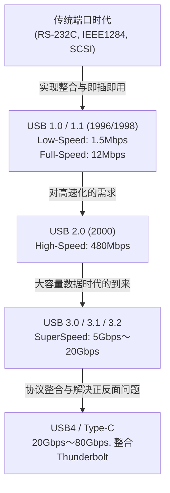

# USB的历史：为什么从有正反面的接口进化到USB-C

## 1. 序章：传统端口带来的混乱与用户的苦恼

在如今我们理所当然地使用的“USB（通用串行总线）”出现之前，在20世纪80年代末到90年代初，个人电脑的背面简直是一片混乱。与现代PC或Mac只有简洁接口的智能外观不同，当时各种各样的端口挤在一起，让用户陷入了困惑。

### 串口和并口的局限性
作为当时具有代表性的接口，首先是“串行端口（RS-232C）”。这主要用于连接调制解调器和鼠标。通信速度非常慢，早期的只有几kbps到几十kbps。设置也极其复杂，波特率、停止位、奇偶校验位等通信协议的详细参数，往往需要用户自己在操作系统或软件端进行手动设置。

另一方面，打印机、扫描仪等设备的连接使用了“并行端口（IEEE 1284等）”。这个源于Centronics标准的端口，由于同时并行发送多个比特，所以比当时的串口快，但线缆粗重，极其不便。此外，连接器本身很巨大，占据了PC背面有限空间的很大一部分。

### PS/2端口与SCSI的壁垒
作为输入接口，还有“PS/2端口”。这个名字来源于它被IBM的Personal System/2所采用，分为键盘用（紫色）和鼠标用（绿色）两种。最大的缺点是不支持“热插拔”。也就是说，在PC开机状态下拔下鼠标再插上，系统也无法识别，最坏的情况下甚至有物理烧毁主板控制器的危险。

此外，对于需要高速数据传输的外置硬盘、高性能扫描仪、MO驱动器等，使用了“SCSI（小型计算机系统接口）”。SCSI性能非常高，但进行菊花链连接时，需要物理连接“终结器（终端电阻）”，以及为每个设备分配不重复的“SCSI ID”，这需要不可或缺的专业知识。如果设置错了一项，就可能导致整个系统死机，是一个要求非常苛刻的标准。

就这样，每个外围设备的端子形状都不同，设置也很繁琐，IRQ（中断请求）、DMA（直接内存访问）、I/O地址冲突引发的故障是家常便饭。用户每次买新的外围设备，都要与厚厚的说明书作斗争，有时还要打开PC机箱，用镊子操作扩展卡的跳线，这在今天看来是难以想象的折磨。

## 2. “即插即用”的夙愿与USB 1.0的诞生

为了打破这种惨状，创造一个任何人都能轻松扩展PC的世界，IT界的巨头们站了出来。在以Intel的Ajay Bhatt为中心的团队的提议下，Compaq、Microsoft、IBM、DEC、Nortel、NEC等7家公司集结起来，组成了后来成为USB开发者论坛（USB-IF）前身的标准制定小组。然后在1996年，正式发布了“USB 1.0”标准。

### 追求“Universal”的真意
USB的最大目标，正如“Universal（通用）”这个名字所代表的那样，是将所有的外围设备统一到一个标准、一种连接器形状上。而其中最被重视的，就是实现“即插即用 (Plug and Play)”和“热插拔 (Hot Swap)”。用户可以在PC开机状态下自由插拔线缆，操作系统会自动识别设备并安装驱动程序。用户完全不需要关心任何细节设置。这就是USB所提出的终极愿景。

### USB 1.0/1.1的规格与普及的壁垒
在USB 1.0中，定义了两种通信速度模式。
* **Low-Speed (1.5 Mbps)**: 主要面向键盘、鼠标等数据传输量小、延迟不致命的设备。
* **Full-Speed (12 Mbps)**: 面向打印机、外部存储、音频设备等。

从现在的角度来看，“12 Mbps”慢得令人难以置信（1秒钟只能传送约1.5MB），但足以取代当时的串行端口（如115.2 kbps）。此外，它还采用了一种革命性的架构，最多可以将127台设备以树状连接。

然而，刚发布时的USB 1.0并非一帆风顺。Windows 95的早期版本原生不支持USB，后来在OSR2.1中终于追加了支持，但运行不稳定，被嘲笑为“不是即插即用，而是即插即祈祷（祈祷后再插）”。

### Apple的决断：iMac带来的突破
让USB真正意义上在世界范围内普及的决定性契机，是1998年Windows 98的发布（大幅改善了对USB的支持），以及同年Apple发布的初代“iMac（邦迪蓝）”。

由史蒂夫·乔布斯领导的Apple，在iMac上采用了一种极其激进的设计，无情地抛弃了软盘驱动器，以及传统Macintosh上使用的ADB（Apple Desktop Bus）、串行端口、SCSI端口等所有传统接口，将外部扩展端口只锁定在“USB”上。
当时市场上几乎没有支持USB的外围设备，因此这个决定遭到了业界的猛烈批评。然而，随着iMac在全球创下惊人的销量，外围设备制造商为了生存，纷纷转向开发支持USB的产品。结果，Apple看似强硬的决定被评价为将USB的普及提前了数年。同年，旨在修复错误和提高兼容性的“USB 1.1”发布，确立了其作为标准的地位。

## 3. 速度革命与黄金时代：USB 2.0的君临

2000年4月发布的“USB 2.0”是USB历史上最大的突破之一，也是至今为止使用时间最长、范围最广的伟大标准。

最大通信速度提升至“High-Speed (480 Mbps)”，与USB 1.1的Full-Speed（12 Mbps）相比，实现了整整40倍的戏剧性进化。这种速度的提升绝非仅仅是规格上数字的把戏，它拥有彻底改变人们数字生活的力量。

### 大容量设备的实用化
凭借480 Mbps的带宽，以前通过USB连接不切实际的大容量设备相继实现了实用化。
外置硬盘、CD-R/RW和DVD驱动器、数百万像素级高画质数码相机的数据传输，甚至电视调谐器和高品质音频接口等，都能通过USB流畅运行。其中，“U盘（闪存盘）”的爆炸性普及，彻底将软盘和MO盘等传统可移动存储媒体变成了历史。

此外，USB 2.0完美地保持了向下兼容性，插入USB 1.1的设备也能照常工作，这是一种优秀的设计。在这一时期，USB走出了PC世界，被搭载在电视、DVD/BD录像机、家用游戏机、车载导航系统等各种各样的电子设备上，确立了其“真正的通用标准”的地位。

## 4. 标准林立与连接器的悲剧：移动时代的到来与Micro-B

随着USB 2.0的成功，所有设备都能通过USB连接的梦想似乎已经实现。然而，移动设备（手机、数码相机、MP3播放器等）小型化、轻薄化的新浪潮，给USB连接器的形状带来了严重的问题。

### Type-A和Type-B的分工
在原本的USB设计理念中，有着严格的规定：主机端（如PC，控制方）采用“Type-A（扁平的长方形）”连接器，设备端（如打印机或扫描仪，被控制方）采用“Type-B（接近正方形的形状）”连接器。这就从物理上防止了用户错误地用线缆将两台PC直接连接起来，从而引发短路或故障。

### 小型连接器的林立
然而，Type-B连接器虽然适合像打印机这样的大型设备，但对于手机或轻薄的数码相机来说实在是太大了。于是，为了实现小型化，“Mini-A”和“Mini-B”被标准化。特别是Mini-B，在数码相机和早期的便携式硬盘中得到了广泛普及。
但是，随着设备进一步变薄，连Mini-B也被认为太厚太碍事。于是在2007年，发布了更薄且提高了耐用性的“Micro-A”和“Micro-B”。

特别是“Micro-B”，作为以快速普及的Android智能手机为中心的移动终端的充电和数据通信的世界标准连接器，获得了压倒性的市场份额。在欧洲，出于环保（减少电子垃圾）的角度，要求将手机充电接口统一为Micro-USB的压力很大，这也推动了它的普及。

### 薛定谔的USB：困扰人类的“正反面问题”
这里产生的最大悲剧，将被深深铭刻在人类历史中的“USB的正反面问题”。
标准的Type-A和小型化的Micro-B都具有上下不对称的形状，只有在正确的方向上才能插入。然而，这种形状有一种绝妙的设计，那就是“乍一看很难分辨哪面是上”。

“试图插进去却遇到阻力 → 翻过来再插还是进不去 → 再次翻过来，不知为何却很顺利地插进去了”

这种不可思议的现象在全世界被称为“USB的叠加态（量子叠加）”、“四维连接器”等网络迷因，消耗了人们宝贵的时间和精神力。强行反向插入，破坏智能手机端子的惨剧也频频发生。就连USB之父Ajay Bhatt在后来的采访中也谈到了对这个问题的遗憾以及开发当时的困境：“如果从一开始就做成可逆转的（双面可用）就好了，但当时为了削减成本，只能做成单面。”

## 5. SuperSpeed的到来与命名规则的混乱：USB 3.x系列

进入2000年代后半期，高清画质的视频数据、大容量的游戏数据等处理的文件大小飙升至太字节（TB）级别，即使是USB 2.0的480 Mbps也明显显得速度不足。
因此，在2008年发布了“USB 3.0”。

### 蓝色的连接器与SuperSpeed
USB 3.0的最大通信速度被命名为“SuperSpeed (5 Gbps)”，实现了比USB 2.0高出10倍以上的压倒性带宽。
在物理结构上，除了传统的USB 2.0的4根针脚（电源、GND、D+、D-）之外，还新采用了增加5根超高速数据传输用针脚（发送2根、接收2根、GND）的9针结构。
外观上最大的特点是，为了与传统端子区分，连接器内部的塑料部分被指定为“蓝色（Pantone 300C）”。这样一来，用户就能直观地理解“用蓝色的线连接蓝色的端子就会很快”。

### 迷失方向的命名
然而，与技术上的成功相反，USB-IF的营销部门不断进行令人费解的名称变更，让消费者和PC行业卷入了深深的混乱之中。

* **2013年**：发布了“USB 3.1”，速度提升至10 Gbps (SuperSpeed+)。到这里为止还不错，但同时他们把以前的USB 3.0 (5 Gbps) 改名为“USB 3.1 Gen 1”，把新的10 Gbps 改名为“USB 3.1 Gen 2”。
* **2017年**：发布了速度进一步提升至20 Gbps的“USB 3.2”。然后他们再次更改了过去标准的名称，决定将5 Gbps称为“USB 3.2 Gen 1”，10 Gbps称为“USB 3.2 Gen 2”，新的20 Gbps称为“USB 3.2 Gen 2x2”。

结果，即使在电器店里摆放的包装上大大的写着“支持USB 3.2！”，别说普通消费者，就连专家如果不仔细阅读规格表，也无法分辨它到底是5 Gbps还是20 Gbps，导致了损害标准可靠性的最坏局面。

## 6. 终极连接器“Type-C”与供电革命“Power Delivery”

连接器形状林立带来的繁琐、正反面问题引发的焦躁、以及错综复杂的版本名称。为了将这些问题一举解决，USB-IF集中力量在2014年发布的，可以说是USB历史集大成者的“USB Type-C (USB-C)”。

### Type-C带来的三大革命
Type-C不仅仅是一种新形状的连接器，它还具有改变计算方式的三项创新特点。

1. **实现可逆转结构**
   通过将连接器内部的针脚（24针）点对称排列，使得无论上下哪个方向都可以插入。长年困扰人类的“薛定谔的USB问题”终于被完全解决。连接器本身也保持了与Micro-B同等的紧凑性，可以搭载在从极薄的智能手机到大型台式PC的所有设备上。
2. **废除主机与设备的区别与CC针脚**
   废除了Type-A和Type-B的物理区别，两端都是Type-C的线缆成为了标准。无论哪一端插入哪一边都能发挥作用。为了实现这一点，Type-C新设了用于通信的“CC (Configuration Channel)”针脚，引入了在连接瞬间设备之间智能地协商（通过通信协议进行对话）“谁是主机，谁是设备”、“向哪个方向输送电力”等机制。
3. **备用模式 (Alternate Mode)**
   除了USB的数据通信，其他公司的协议也能在Type-C线缆中传输。代表性的就是“DisplayPort Alternate Mode”。通过这项技术，无需使用专用的HDMI线或DisplayPort线，只需一根Type-C线就能从PC向显示器输出高分辨率的视频信号。

### USB Power Delivery (USB PD) 带来的供电革命
将Type-C的潜力发挥到极致的，是同时获得进化的“USB Power Delivery (USB PD)”供电标准。
早期的USB 1.0/2.0的供电能力仅仅只有2.5W (5V/0.5A)，勉强能驱动鼠标和键盘。即便是USB 3.0也只有4.5W (5V/0.9A)，连智能手机的快速充电都很困难。

然而USB PD却能提供最大20V/5A的“100W”巨大电力。更在2021年的“USB PD EPR (Extended Power Range)”更新中，扩展到了最大48V/5A的“240W”。
100W〜240W的电力，不仅可以为智能手机和平板电脑快速充电，还能驱动MacBook Pro或游戏PC等消耗巨大电力的高端笔记本电脑，甚至连大型液晶显示器的电源也能满足。

“从带有视频输出的显示器，只用一根Type-C线向笔记本电脑发送视频的同时，显示器也向电脑进行大功率充电”
曾经需要电源线、视频线和数据USB线这3根线缆的环境，现在只需一根Type-C线就能完全解决。这实现了办公环境和远程办公中的终极智能化。

## 7. 与强力对手“Thunderbolt”的历史性融合

在讲述USB进化史时，另一个绝对不能忽视的存在是“Thunderbolt（雷电）”。
Thunderbolt是Intel和Apple共同开发的超高速接口标准。最初代号为“Light Peak”，原本构想是使用光纤，但由于成本问题，在2011年基于铜线以“Thunderbolt 1”的形式登场。

### 不同的设计理念
USB旨在“简单、廉价地连接各种外围设备”，而Thunderbolt则采用了“将PC内部的PCI Express总线和视频输出（DisplayPort）直接引到外部”这种极其暴力且高性能的方法。因此，在外置GPU或超高速RAID存储等对延迟和带宽有严苛要求、USB无法胜任的专业领域，Thunderbolt受到了极大的欢迎。

起初，Thunderbolt 1和2采用了与Mini DisplayPort相同的端子形状，并作为Mac的独占功能展开。然而，由于Windows PC阵营的普及迟迟没有进展，感到危机的Intel在2015年发布的“Thunderbolt 3”中，做出了一个历史性的决定，将连接器形状从其独有形状改为了“USB Type-C”。

### Type-C的混乱与融合之路
统一为Type-C连接器虽然提高了便利性，但也同时带来了“外观完全相同的Type-C端子和线缆，内部的通信协议却有可能是USB或Thunderbolt 3。而且它们之间的兼容性也是时有时无”的问题，这给用户带来了不同于以往端子林立的，一种更加高级且不可见的新混乱。

为了从根本上解决这个过于复杂的情况，Intel在2019年采取了惊人的举动，将Thunderbolt 3的协议规范“免费提供（捐赠）”给了USB-IF。
基于Intel提供的这项技术而制定的下一代标准，正是“USB4”。

### USB4：终极融合标准
随着USB4的登场，USB和Thunderbolt名副其实地实现了“融合”。USB4标配最大40 Gbps的通信速度（在最新的USB4 Version 2.0中达到80 Gbps，非对称模式下最高可达120 Gbps），并正式支持了PCIe隧道技术。
也就是说，以往属于Thunderbolt特权的“连接外置GPU”等功能，现在作为USB的标准规格也能使用了。同时，废除了像“USB 3.2 Gen 2x2”这样极其难懂的名称，开始努力回归到像“USB 40Gbps”这样直接显示速度的品牌名称。

## 8. 环保法规与未来：Type-C一统天下及未来的课题

USB的进化，不仅在技术层面，在政治和环保层面也迎来了重大的转折点。

### 欧盟（EU）的充电端口统一法案
2022年，欧洲联盟（EU）的欧洲议会通过了一项法案，强制要求智能手机、平板电脑和数码相机等小型电子设备的充电端子必须“统一为USB Type-C”。该法案的主要目的是消除消费者为不同设备购买不同线缆和充电器的浪费，从而减少每年高达数万吨的“电子垃圾（E-waste）”。

这项规定最大的目标，是长年坚持使用独有标准“Lightning（闪电）”端子的Apple iPhone。尽管Apple以“阻碍创新”为由进行抵抗，但最终无法无视欧盟庞大的市场，在2023年发售的iPhone 15系列中，终于废除了Lightning，转而采用了USB Type-C。
至此，Android、iPhone、Mac、Windows PC、iPad、Nintendo Switch、无线耳机等，我们日常使用的几乎所有电池驱动设备，都能用一根Type-C线充电，实现了“完全的一统天下”。

### 遗留的课题：抽卡线缆
硬件端子统一为Type-C，将便利性提升到了极致。然而，面向未来的问题并没有完全消失。
目前，最让用户头疼的就是被称为“线缆抽卡”的问题。

即使两端都是Type-C的线缆，根据其内部结构（内置eMarker芯片的有无、连接的芯线数量），也会存在以下令人绝望的性能差异：
* 仅支持充电，数据传输仅为USB 2.0（480 Mbps）的极薄线缆
* 支持60W充电，但不支持视频输出的线缆
* 支持100W（或240W）充电，支持40Gbps数据通信和8K视频输出，但非常粗短且昂贵的Thunderbolt 4线缆

尽管外观完全相同，性能却截然不同，用户必须凝视线缆包装或端子部分印有的小小标志来辨别。“端子统一的结果，却导致了线缆内部的混乱”，这真是一个讽刺的现实。

## 9. 结语：迈向通用（Universal）的无尽之旅

1996年，在背面布满无数不同端口、饱受IRQ冲突困扰的PC世界里，USB带着“仅用一个通用端子连接一切”的宏伟梦想诞生了。

它的历程绝不平坦。速度不足带来的妥协，连接器小型化伴随的标准林立，正反面问题引发的恼怒，营销迷失方向导致的名称混乱，以及与强力对手Thunderbolt的复杂关系。
但是，USB每次都能汇聚IT行业的智慧，在保持兼容性的同时（有时也包含大胆的自我否定）不断进化。

传输速度从1.5 Mbps飙升到80 Gbps，增加了数万倍；供电量从2.5W增强到240W，增加了约100倍。而且，通过获得了在物理和功能上都非常优秀的“容器”Type-C，USB终于在诞生四分之一世纪后，将最初提出的“Universal（通用）”理想变成了现实。

无论下一代标准叫什么名字，速度有多快，我们办公桌周围那些难看且多余的线缆束必定会消失，更加简单、强大、精致的连接体验将继续提供。从有正反面的不便端子到USB-C的进化，可以说是人类不断追求便利性和合理性，在IT硬件史上留下的最伟大的轨迹之一。
