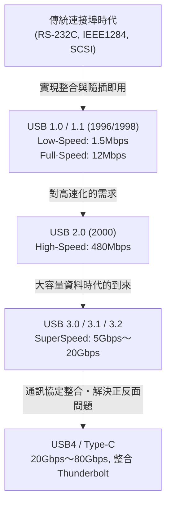

# USB 的歷史：為什麼從有正反面的端子進化為 USB-C

## 1. 序章：傳統連接埠帶來的混亂與使用者的苦惱

在我們現在視為理所當然的「USB (Universal Serial Bus)」出現之前，大約在 1980 年代後半到 1990 年代前半，個人電腦的背面簡直是一片混亂。與現代 PC 或 Mac 只有簡潔介面的俐落外觀不同，當時電腦背面擠滿了各種形狀與規格的連接埠，讓使用者感到無比困惑。

### 序列埠與平行埠的極限
作為當時代表性的介面，首先是「序列埠（RS-232C）」。這主要用於連接數據機和滑鼠。它的通訊速度非常慢，早期只有幾 kbps 到幾十 kbps 左右。設定也極為複雜，使用者往往需要自己在作業系統或軟體中手動設定傳輸速率（Baud rate）、停止位元（Stop bit）、同位元（Parity bit）等通訊協定的詳細參數。

另一方面，印表機和掃描器等設備的連接則使用「平行埠（IEEE 1284 等）」。源自 Centronics 規格的這個連接埠，因為同時並行傳送多個位元，所以比當時的序列埠快，但連接線既粗又重，使用起來非常不便。此外，接頭本身也很巨大，佔據了 PC 背面有限的空間。

### PS/2 埠與 SCSI 的阻礙
在輸入介面方面有「PS/2 埠」。因為被採用於 IBM 的 Personal System/2 而得名，分為鍵盤用（紫色）和滑鼠用（綠色）兩種。它最大的缺點是不支援「熱插拔（Hot swap）」。也就是說，如果在 PC 開機狀態下拔下滑鼠再重新插上，系統會無法辨識，最壞的情況甚至有燒毀主機板控制器的危險。

此外，對於需要高速資料傳輸的外接硬碟、高效能掃描器、MO 光碟機等設備，則使用「SCSI（Small Computer System Interface）」。SCSI 效能非常高，但在進行菊鏈式連接（Daisy chain）時，必須具備實體連接「終端電阻（Terminator）」以及為各設備分配不重複的「SCSI ID」等專業知識。這是一種只要設定錯一個步驟，就可能導致整個系統當機的嚴苛規格。

就這樣，每個周邊設備的端子形狀都不一樣，設定繁瑣，而且因為 IRQ（中斷請求）、DMA（直接記憶體存取）或 I/O 位址衝突而導致的故障簡直是家常便飯。使用者每次購買新的周邊設備，都必須與厚厚的使用手冊奮戰，有時甚至被迫打開 PC 機殼，用鑷子操作擴充卡的跳線帽，這在現在看來簡直是難以想像的折磨。

## 2. 實現「隨插即用」的夙願與 USB 1.0 的誕生

為了解決這種慘狀，創造一個任何人都能輕鬆擴充 PC 的世界，IT 業界的巨頭們站了出來。在以 Intel 的 Ajay Bhatt 為首的團隊倡議下，Compaq、Microsoft、IBM、DEC、Nortel、NEC 等 7 家公司集結，組成了 USB 實作者論壇（USB-IF）的前身——規格制定小組。隨後在 1996 年，終於正式發表了「USB 1.0」規格。

### 追求「Universal（通用）」的真意
USB 最大的目標，就如同「Universal（通用）」這個名稱所示，是將所有周邊設備統一為單一規格、單一接頭形狀。而最被重視的，就是實現「隨插即用 (Plug and Play)」與「熱插拔 (Hot Swap)」。使用者可以在 PC 開機時自由插拔連接線，作業系統會自動辨識設備並安裝驅動程式。使用者完全不需要費心於細部設定。這就是 USB 提出的終極願景。

### USB 1.0/1.1 的規格與普及的阻礙
在 USB 1.0 中，定義了兩種通訊速度模式：
* **Low-Speed (1.5 Mbps)**：主要針對鍵盤、滑鼠等資料傳輸量小、延遲不至於致命的設備。
* **Full-Speed (12 Mbps)**：針對印表機、外接儲存裝置、音訊設備等。

從現在的角度來看，「12 Mbps」慢得令人難以置信（一秒鐘只能傳送約 1.5MB），但對於取代當時的序列埠（如 115.2 kbps）已經綽綽有餘。此外，它還採用了最多可將 127 個設備以樹狀結構連接的劃時代架構。

然而，剛發表的 USB 1.0 並非一帆風順。Windows 95 的早期版本並未原生支援 USB，雖然在後來的 OSR2.1 中終於加入了支援，但運作不穩定，甚至被揶揄為不是「隨插即用」，而是「祈禱後再插」。

### Apple 的決策：iMac 帶來的突破
USB 真正普及到全世界的決定性契機，是 1998 年 Windows 98 的發佈（大幅改善了 USB 支援），以及同年 Apple 發表的第一代「iMac（邦代藍）」。

由史蒂夫·賈伯斯領軍的 Apple，在 iMac 上採取了極為激進的設計：無情地捨棄了軟碟機，以及傳統 Macintosh 使用的 ADB（Apple Desktop Bus）、序列埠、SCSI 埠等所有傳統介面，將外部擴充埠「僅限於 USB」。
由於當時市場上幾乎沒有支援 USB 的周邊設備，這項決定遭到了業界的猛烈批評。然而，隨著 iMac 創下全球熱銷紀錄，周邊設備製造商為了生存，紛紛轉向開發支援 USB 的產品。結果，Apple 這種堪稱強硬的決定，被認為將 USB 的普及提早了好幾年。同年，為了修正錯誤並提升相容性的「USB 1.1」也隨之發佈，穩固了作為標準規格的基礎。

## 3. 速度革命與黃金時代：USB 2.0 的君臨

2000 年 4 月發表的「USB 2.0」，是 USB 歷史上最大的突破之一，也是至今為止使用時間最長、最廣泛的偉大規格。

最高通訊速度提升至「High-Speed (480 Mbps)」，與 USB 1.1 的 Full-Speed (12 Mbps) 相比，一口氣實現了 40 倍的戲劇性進化。這種速度的提升，不僅僅是規格表上數字的遊戲，更具備了從根本上改變人們數位生活的能力。

### 大容量設備的實用化
獲得了 480 Mbps 的頻寬後，過去透過 USB 連接顯得不切實際的大容量設備紛紛投入實用化。
外接硬碟、CD-R/RW 或 DVD 光碟機、數百萬像素級高畫質數位相機的資料傳輸，甚至是電視調諧器和高品質音訊介面等，都能透過 USB 順暢運作。其中，「USB 隨身碟（快閃記憶體）」的爆炸性普及，更是讓軟碟片和 MO 磁碟片等傳統抽取式媒體完全走入歷史。

此外，USB 2.0 完美地維持了向下相容性，即使連接 USB 1.1 的設備也能直接運作，這是一項極佳的設計。在這個時期，USB 跨出了 PC 的領域，確立了作為搭載於電視、DVD/BD 錄影機、家用遊戲機、汽車導航系統等各種電子產品的「真正通用標準」的地位。

## 4. 規格林立與接頭的悲劇：行動時代的到來與 Micro-B

隨著 USB 2.0 的成功，所有的設備都能用 USB 連接的夢想似乎已經實現。然而，行動裝置（手機、數位相機、MP3 播放器等）小型化、薄型化的新浪潮，為 USB 接頭形狀帶來了嚴重的問題。

### Type-A 與 Type-B 的角色分工
在最初的 USB 設計理念中，有一個嚴格的規定：主機端（如 PC，控制方）採用「Type-A（扁平長方形）」接頭，而設備端（如印表機或掃描器，被控制方）採用「Type-B（接近正方形）」接頭。這在實體上防止了使用者誤將 PC 之間用連接線直接相連，從而引發短路或故障。

### 小型接頭的林立
然而，雖然 Type-B 接頭適合印表機等大型設備，但對於搭載在手機或薄型數位相機上來說，體積實在太大了。因此，為了追求小型化而規格化的就是「Mini-A」和「Mini-B」。特別是 Mini-B，在數位相機和早期的可攜式硬碟中被廣泛普及。
但是，隨著設備進一步薄型化，連 Mini-B 都開始被嫌太厚且佔空間。於是在 2007 年，發表了更薄、耐用度更高的「Micro-A」和「Micro-B」。

特別是「Micro-B」，作為以急遽普及的 Android 智慧型手機為中心的行動裝置充電與資料通訊用世界標準接頭，獲得了壓倒性的市佔率。在歐洲，基於保護環境（減少電子垃圾）的觀點，當局強烈施壓要求將手機的充電端子統一為 Micro-USB，這也推動了它的普及。

### 薛丁格的 USB：困擾人類的「正反面問題」
在這裡發生的最大悲劇，也就是深深烙印在人類歷史上的「USB 正反面問題」。
標準的 Type-A 和小型化的 Micro-B，都是上下不對稱的形狀，只能以正確的方向插入。然而，它們的形狀卻有著「只看一眼很難分辨哪邊是上面」這種絕妙（糟糕）的設計。

「試著插進去卻有阻力 → 翻面再插卻還是插不進去 → 再翻面一次，不知為何就很順利地進去了」

這個不可思議的現象在世界各地成為了網路迷因（Meme），被稱為「USB 的量子疊加態」、「四次元接頭」等，消耗了人們寶貴的時間與精神力。勉強反向硬插，導致智慧型手機端的端子損壞的悲慘事故也頻繁發生。就連 USB 的發明者 Ajay Bhatt，在後來的採訪中談到這個問題時也表示了後悔與開發當時的兩難：「當初如果設計成正反可插（雙面支援）就好了，但當時為了降低成本，只能選擇單面實作。」

## 5. SuperSpeed 的到來與命名規則的混亂：USB 3.x 系列

進入 2000 年代後半，隨著高畫質（HD）影片資料和龐大的遊戲資料等，所處理的檔案大小飆升至 Terabyte 等級，USB 2.0 的 480 Mbps 速度不足的問題變得明顯起來。
於是在 2008 年，發表了「USB 3.0」。

### 藍色接頭與 SuperSpeed
USB 3.0 的最高通訊速度被命名為「SuperSpeed (5 Gbps)」，實現了超過 USB 2.0 十倍以上的壓倒性頻寬。
在實體結構上，除了傳統 USB 2.0 為止的 4 根針腳（電源、GND、D+、D-）之外，還採用了新增 5 根超高速資料傳輸專用針腳（傳送用 2 根、接收用 2 根、GND）的 9 針腳結構。
外觀上最大的特徵是，為了與傳統端子區分，接頭內部的塑膠部分被指定為「藍色（Pantone 300C）」。這讓使用者能夠直覺地理解「將藍色端子與藍色連接線接在一起就會很快」。

### 迷失的命名
然而，與技術上的成功相反，USB-IF 的行銷部門反覆進行令人費解的名稱變更，將消費者與 PC 業界捲入了深深的混亂漩渦中。

* **2013 年**：發表了「USB 3.1」，速度提升至 10 Gbps (SuperSpeed+)。到這裡為止都還好，但同時他們卻將傳統 USB 3.0 (5 Gbps) 的名稱改為「USB 3.1 Gen 1」，而將新的 10 Gbps 命名為「USB 3.1 Gen 2」。
* **2017 年**：發表了進一步將速度提升至 20 Gbps 的「USB 3.2」。然後他們再次更改了過去規格的名稱，決定將 5 Gbps 稱為「USB 3.2 Gen 1」，10 Gbps 稱為「USB 3.2 Gen 2」，而新的 20 Gbps 則稱為「USB 3.2 Gen 2x2」。

結果，即使家電量販店架上產品的包裝上大字寫著「支援 USB 3.2！」，一般消費者甚至是專家，如果沒有仔細閱讀規格表，也無法判別它到底是 5 Gbps 還是 20 Gbps。這導致了損害規格可靠性的最壞情況。

## 6. 終極的接頭「Type-C」與供電革命「Power Delivery」

為了徹底解決接頭形狀林立的繁瑣、正反面問題的惱人，以及複雜怪異的版本名稱。USB-IF 集結總力，於 2014 年發表了堪稱 USB 歷史集大成之作的「USB Type-C (USB-C)」。

### Type-C 帶來的 3 項革命
Type-C 不僅僅是新形狀的接頭，它還具備了改變運算方式的 3 項革命性特徵：

1. **實現正反可插（可逆）結構**
   透過將接頭內部的針腳配置（24 針腳）設計為點對稱，無論上下哪個方向都能插入。長年困擾人類的「薛丁格的 USB 問題」終於在這一刻獲得了完全解決。接頭本身也維持了與 Micro-B 相當的輕巧體積，從極薄的智慧型手機到大型桌上型 PC，都能夠搭載於各種設備上。
2. **廢除主機與設備的區別，以及 CC 針腳**
   廢除了 Type-A 與 Type-B 的實體區別，將兩端皆為 Type-C 的連接線作為標準。無論哪一端插在哪裡都能發揮作用。為了實現這一點，Type-C 新增了用於通訊的「CC (Configuration Channel)」針腳，導入了一套智慧機制：在連接的瞬間，設備之間就能高度協商（透過通訊協定對話）「哪邊是主機，哪邊是設備」、「向哪個方向供電」等問題。
3. **替代模式 (Alternate Mode)**
   除了 USB 的資料通訊，其他公司的通訊協定也能透過 Type-C 連接線傳輸。最具代表性的就是「DisplayPort Alternate Mode」。有了這個功能，不需要使用專門的 HDMI 或 DisplayPort 連接線，只需一根 Type-C 連接線就能將高解析度影像訊號從 PC 輸出到顯示器。

### 透過 USB Power Delivery (USB PD) 帶來的供電革命
將 Type-C 的潛力發揮到極致的，是同步進化的「USB Power Delivery (USB PD)」供電規格。
早期 USB 1.0/2.0 的供電能力僅有 2.5W (5V/0.5A)，要推動滑鼠和鍵盤已經很勉強了。即使是 USB 3.0，也只有 4.5W (5V/0.9A)，連智慧型手機的快速充電都難以應付。

然而，USB PD 實現了提供高達 20V/5A 即「100W」的巨大電力。此外，在 2021 年的「USB PD EPR (Extended Power Range)」更新中，更擴充至最高 48V/5A 的「240W」。
100W～240W 的電力，不僅能為智慧型手機和平板電腦快速充電，還能驅動如 MacBook Pro 或電競 PC 等耗電量大的高階筆記型電腦，甚至足以供應大型液晶顯示器的電源。

「只要一根 Type-C 連接線，就能將影像從筆記型電腦傳送到具備影像輸入的顯示器，同時顯示器也能向電腦進行大功率充電」
過去需要電源線、影像線和資料用 USB 線 3 根線的環境，現在只需要 1 根 Type-C 連接線就能搞定。這實現了辦公環境與遠距工作的終極智慧化。

## 7. 與強大對手「Thunderbolt」的歷史性融合

在談論 USB 的進化歷史時，還有一個絕對不能忽略的存在，那就是「Thunderbolt」。
Thunderbolt 是由 Intel 和 Apple 共同開發的超高速介面規格。最初代號為「Light Peak」，原本構想使用光纖，但由於成本問題，最終在 2011 年以銅線為基礎作為「Thunderbolt 1」問世。

### 不同的設計理念
USB 的目標是「簡單、廉價地連接各種周邊設備」，而 Thunderbolt 則是採取了「將 PC 內部的 PCI Express 匯流排和影像輸出（DisplayPort），直接延伸到外部」這種極為暴力且高效能的策略。因此，在外接 GPU 或超高速 RAID 儲存裝置等因 USB 的延遲（Latency）或頻寬限制而無法實現的專業用途中，Thunderbolt 備受重用。

起初，Thunderbolt 1 和 2 採用與 Mini DisplayPort 相同的端子形狀，並作為 Mac 的專有功能展開。然而，對於在 Windows PC 陣營普及遲緩感到危機的 Intel，在 2015 年發表的「Thunderbolt 3」中做出了歷史性的決定：將接頭形狀從獨有的形狀改為「USB Type-C」。

### Type-C 的混亂與邁向整合之路
將接頭統一為 Type-C 雖然提升了便利性，但同時也為使用者帶來了另一種層次完全不同的、高度且看不見的新混亂：「明明外觀完全相同的 Type-C 端子和連接線，但內部的通訊協定卻有 USB 和 Thunderbolt 3 兩種情況。而且相容性時有時無」。

為了解決這個過度複雜的情況，Intel 在 2019 年採取了令人驚訝的行動，宣布將 Thunderbolt 3 的通訊協定規格「無償提供（捐贈）」給 USB-IF。
基於這項 Intel 技術提供而制定出的次世代規格，正是「USB4」。

### USB4：終極的整合規格
隨著 USB4 的出現，USB 和 Thunderbolt 達成了名副其實的「融合」。USB4 標準擁有最高 40 Gbps 的通訊速度（在最新的 USB4 Version 2.0 中達到 80 Gbps，非對稱模式下最高可達 120 Gbps），並正式支援了 PCIe 穿隧技術（PCIe Tunneling）。
也就是說，過去作為 Thunderbolt 特權的「連接外接 GPU」等功能，現在作為 USB 的標準規格也能使用了。同時，也廢除了像「USB 3.2 Gen 2x2」這類極度難懂的名稱，開始努力回歸到如「USB 40Gbps」這樣能直接顯示速度的品牌名稱。

## 8. 環境法規與未來：Type-C 一統天下與未來的課題

USB 的進化，不僅在技術層面上，在政治與環境層面上也迎來了重大轉折點。

### 歐洲聯盟（EU）的充電端子統一法案
2022 年，歐洲聯盟（EU）的歐洲議會通過了一項法案，強制規定智慧型手機、平板電腦、數位相機等小型電子設備的充電端子「必須統一為 USB Type-C」。這項法案的主要目的，是為了省去消費者為不同設備購買不同連接線或充電器的浪費，並減少每年高達數萬噸的「電子垃圾（E-waste）」。

這項法規最大的目標，就是長年堅持使用獨家規格「Lightning」端子的 Apple iPhone。雖然 Apple 曾以「會阻礙創新」為由反抗，但最終無法無視歐盟龐大的市場，在 2023 年發售的 iPhone 15 系列中，終於廢除了 Lightning，採用了 USB Type-C。
至此，包含 Android、iPhone、Mac、Windows PC、iPad、Nintendo Switch、無線耳機等，我們日常使用的幾乎所有電池驅動設備，都能用一根 Type-C 連接線充電的「徹底一統天下」終於達成了。

### 遺留的課題：連接線轉蛋 (Cable Gacha)
由於硬體端子統一為 Type-C，便利性提升到了極致。然而，面向未來的課題並未完全消失。
現在最讓使用者頭痛的，就是被稱為「連接線轉蛋」的問題。

即使兩端都是 Type-C 的連接線，根據其內部構造（是否有內建 eMarker 晶片、接線的芯線數量），存在著以下令人絕望的性能差異：
* 僅支援充電，資料傳輸只有 USB 2.0 (480 Mbps) 的極薄連接線
* 支援 60W 充電，但不支援影像輸出的連接線
* 支援 100W（或 240W）充電，具備 40Gbps 資料通訊、支援 8K 影像輸出，但非常粗、短且昂貴的 Thunderbolt 4 連接線

外觀看起來完全一樣，性能卻截然不同。使用者必須緊盯著連接線包裝或端子部分印著的微小標誌來判別。「統一了端子，結果卻導致了連接線內部的混亂」，這是一個諷刺的現實。

## 9. 結語：邁向通用（Universal）的無盡旅程

1996 年，在背面掛滿無數不同連接埠、飽受 IRQ 衝突困擾的 PC 世界中，懷抱著「只用一個通用端子連接一切」的宏偉夢想，USB 誕生了。

它的發展歷程絕非平坦。速度不足帶來的妥協、接頭小型化導致的規格林立、正反面問題引起的煩躁、行銷迷失造成的名稱混亂，以及與強大對手 Thunderbolt 的複雜關係。
然而，USB 每一次都集結了 IT 業界的智慧，在維持相容性的同時（有時也包含了大膽的自我否定），持續不斷地進化。

傳輸速度從 1.5 Mbps 躍升至 80 Gbps，提升了數萬倍；供電量從 2.5W 增強至 240W，增加了約 100 倍。而隨著獲得了 Type-C 這個在實體上與功能上都極其優異的「載體」，USB 終於在誕生四分之一個世紀後，實現了當初提出的「Universal」理想。

無論未來的次世代規格會叫什麼名字、能達到多快的速度，可以確定的是，我們書桌周圍那些難看且多餘的一大把連接線將會消失，更簡單、更強大、更洗鍊的連接體驗將會持續提供給我們。從有正反面的不便端子進化到 USB-C，可以說是人類不斷追求便利性與合理性，在 IT 硬體史上留下的最偉大軌跡之一。
