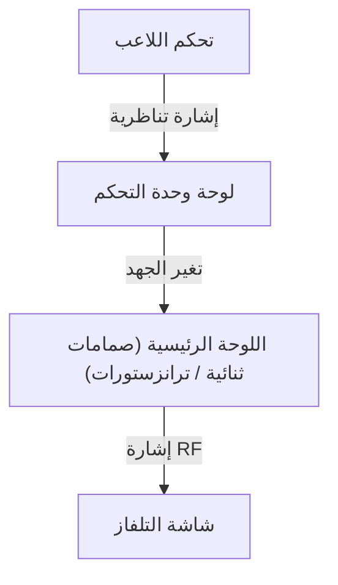
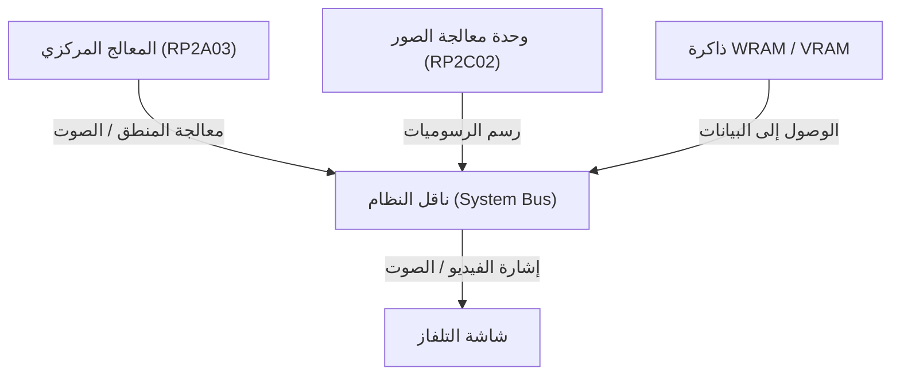

# من أصوات البيب إلى العوالم الافتراضية فائقة الواقعية: 50 عاماً من تاريخ تطور منصات الألعاب المنزلية والابتكار التقني

إن تاريخ منصات ألعاب الفيديو (منصات الألعاب المنزلية) هو في جوهره انعكاس لتاريخ هندسة الحوسبة ذاته. فمن الدوائر المنطقية البسيطة في البدايات إلى الأنظمة الحديثة التي تعتمد على وحدات معالجة الرسوميات (GPU) المتطورة ومحركات الأقراص فائقة السرعة (SSD)، شهدت هذه الصناعة طفرات وابتكارات تقنية مذهلة. في هذا المقال، نستعرض تفصيلياً مسيرة تطور منصات الألعاب المنزلية على مدار الخمسين عاماً الماضية من منظور هندسي وتقني.

## 1. مرحلة البدايات: من الدوائر المنطقية إلى المعالجات الدقيقة (السبعينيات)

بدأت منصات ألعاب الفيديو المنزلية في حقبة لم تكن فيها الأجهزة "تُشغّل" برمجيات بالمعنى الحديث، بل كانت الدوائر المنطقية في العتاد الصلب بحد ذاتها هي التي تؤدي منطق اللعبة بالكامل.

### جهاز Magnavox Odyssey ومنطق العتاد الصلب
طُرح جهاز "Magnavox Odyssey" في عام 1972 بوصفه أول منصة ألعاب فيديو منزلية في العالم، وكان لا يحتوي على وحدة معالجة مركزية (CPU). وبدلاً من ذلك، اعتمد على منطق عتادي خالص يتألف من شبكة من الصمامات الثنائية (Diodes) والترانزستورات لتوليد نقاط مضيئة على الشاشة، حيث يتحكم فيها اللاعب عبر أقراص تدوير تناظرية.



### جهاز Atari 2600 وإدخال المعالجات الدقيقة
في عام 1977، ظهر جهاز "Atari 2600" حاملاً معه معالجاً دقيقاً من طراز (MOS Technology 6507) وشريحة TIA (محول واجهة التلفاز - Television Interface Adapter) لمعالجة الرسوميات والصوتيات، مما أرسى القواعد الأساسية للمنصات الحديثة من خلال إمكانية تبديل البرامج والألعاب عبر خراطيش الـ ROM.

```assembly
; مثال على تجميع 6502 لجهاز Atari 2600 (مسح الذاكرة)
ClearMem:
    LDA #0
    STA $00
    STA $01
    STA $02
    ; ... (يتبع)
```

## 2. فجر عصر 8-بت وجهاز Family Computer (الثمانينيات)

شكّل إطلاق جهاز "Family Computer" (المعروف اختصاراً بـ Famicom أو NES عالمياً) في عام 1983 نقطة تحول محورية واستثنائية في تاريخ منصات الألعاب.

### تطور المعمارية الهندسية ونضجها
تم تزويد الفاميكوم بمعالج مركزي مخصص من تصنيع ريكو (RP2A03، وهو نسخة معدلة من 6502) ووحدة معالجة صور مخصصة PPU (Picture Processing Unit - RP2C02). وبفضل وحدة PPU، أصبح عرض الكائنات المتحركة (Sprites) والتمرير السلس للمشاهد عبر العتاد (Hardware Scrolling) أمراً ممكناً.



من الناحية الرياضية، كان عدد الكائنات المتحركة (Sprites) التي يمكن لوحدة PPU معالجتها في الدفعة الواحدة $S$ وإجمالي عدد وحدات البكسل القابلة للرسم $P$ مقيدين بصرامة بنطاق تردد الذاكرة (Memory Bandwidth) المتاح آنذاك $B$:
$$ P = \sum_{i=1}^{S} (w_i \times h_i) \le \frac{B}{f} $$
(حيث يمثل $f$ معدل الإطارات، وهو عادة 60 هرتز)

## 3. منافسة عصر 16-بت: Mega Drive و Super Famicom (أوائل التسعينيات)

مع الانتقال إلى عصر 16 بت، زادت قدرة المعالجة بفضل توسيع عرض ناقل المعالج (Bit-width)، وتزامن ذلك مع إدخال شرائح صوتية مخصصة ومعالجات مساعدة (Coprocessors).

### معماريات صوتية مميزة ومبتكرة
احتوى جهاز Super Famicom (SNES) على معالج الصوت "SPC700" من تصنيع شركة سوني، والذي مكّن المطورين من إنتاج موسيقى تصويرية أوركسترالية غنية باستخدام العينات الصوتية الرقمية (Audio Sampling). في المقابل، اعتمد جهاز Sega Mega Drive (Genesis) على شريحة توليد الصوت الترددي FM الشهيرة "YM2612" من ياماها، والتي تميزت بنغماتها المعدنية القوية وإيقاعاتها الحيوية الفريدة.

## 4. ثورة الرسوميات ثلاثية الأبعاد والأقراص الضوئية (أواخر التسعينيات)

مع ظهور الجيل الأول من أجهزة PlayStation وSega Saturn وNintendo 64، شهدت صناعة الألعاب قفزة نوعية من البعد الثنائي (2D) إلى العوالم ثلاثية الأبعاد (3D)، وتحولت وسائط التخزين من خراطيش الـ ROM الصلبة إلى الأقراص المدمجة الضوئية (CD-ROM).

### رسم المضلعات والحسابات الهندسية (Geometry Processing)
يرتكز أساس الرسوميات ثلاثية الأبعاد على التحويلات المصفوفية لإحداثيات الرؤوس (Vertices). حيث يتم تحويل النقطة في الفضاء ثلاثي الأبعاد $V (x,y,z,1)$ إلى نقطة على الشاشة ثنائية الأبعاد $V'$ عبر ضربها بمصفوفات التحويل الهندسي للنموذج (Model)، وزاوية الرؤية (View)، والإسقاط (Projection):

$$ V' = P \cdot V_{view} \cdot M \cdot V $$

زوّد جهاز PlayStation بمعالج مساعد مخصص يُعرف باسم "GTE (محرك نقل الهندسة - Geometry Transfer Engine)" لإجراء عمليات ضرب المصفوفات والحسابات الهندسية هذه بسرعة فائقة على مستوى العتاد.


## 5. عصر المظللات القابلة للبرمجة والوضوح العالي HD (عقد 2000 إلى 2010)

مع حلول حقبة PlayStation 3 وXbox 360، تبنّت منصات الألعاب "المظللات القابلة للبرمجة" (Programmable Shaders)، مما أتاح إجراء حسابات إضاءة معقدة ومحاكاة خامات واقعية على مستوى كل بكسل بمفرده (مثل التصيير المعتمد على الفيزياء - Physically Based Rendering).

### صعود المعالجات متعددة الأنوية
اعتمد معالج "Cell Broadband Engine" في جهاز PS3 معمارية غير متماثلة متعددة الأنوية (Asymmetric Multi-core Architecture)، ضمت نواة رئيسية مبنية على PowerPC تُعرف بـ (PPE) بجانب 8 معالجات موجهة مساعدة للمتجهات (SPE).

```cpp
// كود توضيحي للمعالجة الموجهة لوحدات SPE في معالج Cell
void spe_main() {
    float4 vector_a = spu_splats(1.0f);
    float4 vector_b = spu_splats(2.0f);
    float4 result = spu_add(vector_a, vector_b);
    // إعادة الكتابة إلى الذاكرة الرئيسية عبر نقل DMA
}
```

## 6. المعماريات الحديثة ووحدات الإدخال والإخراج فائقة السرعة (عقد 2020)

في الجيل الأحدث المتمثل في PlayStation 5 وXbox Series X/S، تقاربت معمارية العتاد بصورة كبيرة مع أجهزة الحاسوب الشخصي (القائمة على معمارية x86-64)، إلا أن وحدة التحكم المخصصة لأقراص SSD وقنوات الإدخال/الإخراج فائقة السرعة (Ultra-fast I/O) شكّلت الابتكار الأبرز لنقل تدفقات البيانات بدون أوقات تحميل تقريباً.

### تتبع الأشعة والتسريع العتادي (Ray Tracing)
أصبحت تقنية تتبع الأشعة (Ray Tracing) — التي تحاكي المسار الفيزيائي الدقيق للضوء وانكساراته وانعكاساته — مدعومة ومسرّعة عتادياً بالكامل، مما مكّن المطورين من تقديم إضاءة واقعية تحاكي العالم الحقيقي في الوقت الفعلي (Real-time).

### نحو المستقبل
مع ظهور الحوسبة السحابية للألعاب (Cloud Gaming) والاندماج المتسارع مع الواقع الافتراضي والمعزز (VR/AR)، تواصل منصات الألعاب تطورها وإعادة تعريف هويتها، إلا أن فلسفتها الجوهرية المتمثلة في "تقديم أفضل تجربة ترفيهية ممكنة عبر عتاد متفوق ومخصص" لا تزال حية ومستمرة منذ عصر Odyssey وحتى يومنا هذا.
