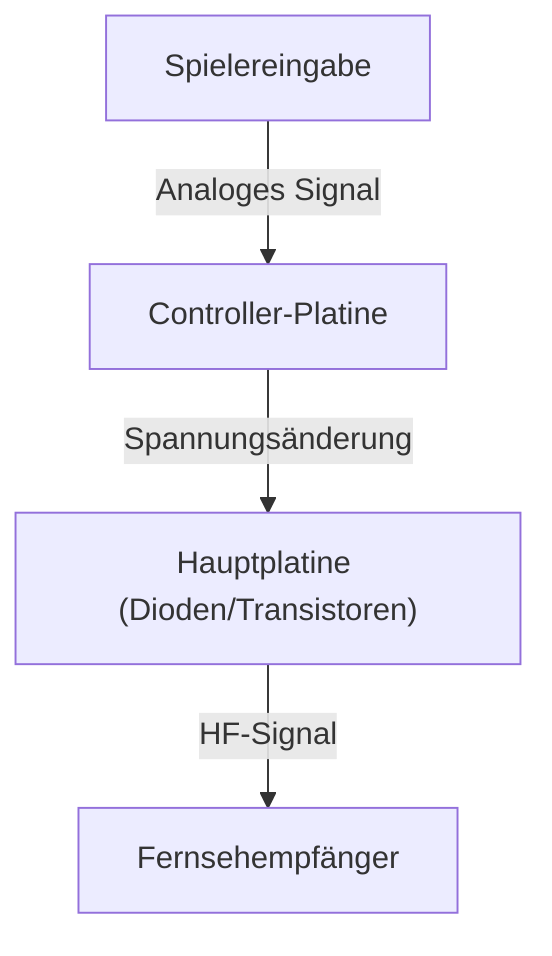
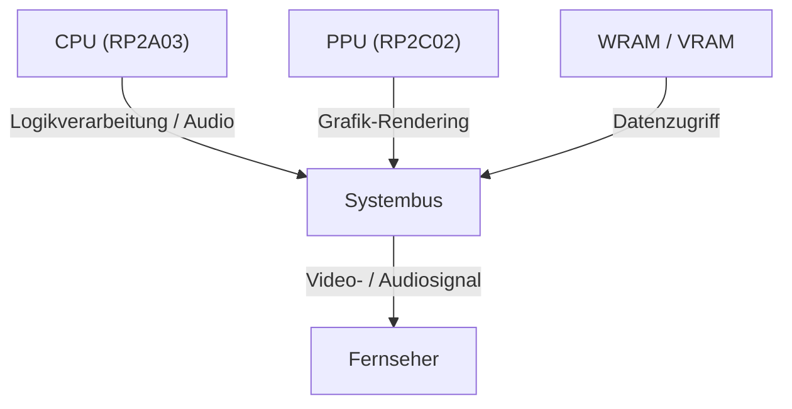

# Von Pieptönen zu fotorealistischen virtuellen Welten: 50 Jahre Entwicklungsgeschichte und technische Innovationen von Videospielkonsolen

Die Geschichte der Videospielkonsolen (Heimkonsolen) ist zugleich die Geschichte der Computertechnologie selbst. Von den einfachen logischen Schaltungen der Anfangstage bis hin zu modernen Systemen, die hochentwickelte GPUs und blitzschnelle SSDs nutzen, sind die technologischen Innovationen bemerkenswert. In diesem Artikel beleuchten wir die Entwicklung der Heimkonsolen der letzten 50 Jahre aus technischer Sicht im Detail.

## 1. Die Anfangsjahre: Von Logikschaltungen zu Mikroprozessoren (1970er Jahre)

Heimvideospielkonsolen begannen in einer Ära, in der Software nicht einfach „ausgeführt“ wurde, sondern die logischen Schaltungen der Hardware selbst als Spiellogik fungierten.

### Magnavox Odyssey und Hardware-Logik
Die 1972 veröffentlichte „Magnavox Odyssey“, die weltweit erste Heimvideospielkonsole, besaß keine CPU. Sie basierte auf reiner Hardware-Logik aus einer Kombination von Dioden und Transistoren, um Lichtpunkte auf dem Bildschirm zu erzeugen, die der Spieler über Drehregler steuern konnte.



### Atari 2600 und die Einführung des Mikroprozessors
Das 1977 erschienene „Atari 2600“ war mit einer CPU (MOS Technology 6507) und dem TIA (Television Interface Adapter) für Grafik und Sound ausgestattet und legte mit austauschbaren ROM-Modulen das Fundament für moderne Spielkonsolen.

```assembly
; Atari 2600 6502-Assembler-Beispiel (Bildschirm leeren)
ClearMem:
    LDA #0
    STA $00
    STA $01
    STA $02
    ; ... (Fortsetzung)
```

## 2. Der Beginn der 8-Bit-Ära und das Famicom (1980er Jahre)

Das Erscheinen des „Family Computer“ (Famicom / im Westen als NES bekannt) im Jahr 1983 markierte einen bemerkenswerten Wendepunkt in der Geschichte der Videospielkonsolen.

### Verfeinerung der Architektur
Das Famicom war mit einer von Ricoh gefertigten Custom-CPU (RP2A03, ein modifizierter 6502) und einer PPU (Picture Processing Unit) ausgestattet. Die PPU ermöglichte Hardware-Sprites und flüssiges Hardware-Scrolling.



Mathematisch ausgedrückt unterlagen die Anzahl der Sprites $S$, die die PPU gleichzeitig verarbeiten konnte, und die Anzahl der darstellbaren Pixel $P$ strengen Beschränkungen durch die damalige Speicherbandbreite $B$:
$$ P = \sum_{i=1}^{S} (w_i \times h_i) \le \frac{B}{f} $$
($f$ ist die Bildwiederholrate, üblicherweise 60 Hz)

## 3. Der 16-Bit-Wettstreit: Mega Drive und Super Famicom (Frühe 1990er Jahre)

Mit dem Beginn der 16-Bit-Ära stieg die Rechenleistung durch die Erweiterung der CPU-Bitbreite, und es wurden dedizierte Soundchips und Coprozessoren eingeführt.

### Eigenständige Soundarchitekturen
Das Super Famicom (Super Nintendo / SNES) war mit dem von Sony entwickelten „SPC700“ ausgestattet und ermöglichte dank Sample-basierter Klangsynthese orchestrale Soundtracks. Demgegenüber setzte das Mega Drive (Genesis) auf Yamahas FM-Synthese-Chip „YM2612“, der für seinen unverwechselbaren, metallischen und kraftvollen Sound bekannt war.

## 4. Die 3D-Grafikrevolution und optische Medien (Späte 1990er Jahre)

In dieser Ära, geprägt durch das Erscheinen der ersten PlayStation, des Sega Saturn und des Nintendo 64, vollzog das Gaming den Sprung von 2D zu 3D und die Speichermedien entwickelten sich von ROM-Modulen hin zu CD-ROMs.

### Polygon-Rendering und Geometrieberechnung
Das Fundament der 3D-Grafik bildet die Matrizentransformation von Vertex-Koordinaten. Ein Punkt $V (x,y,z,1)$ im dreidimensionalen Raum wird durch Multiplikation mit den Modell-, View- und Projektionsmatrizen in einen zweidimensionalen Punkt $V'$ auf dem Bildschirm transformiert:

$$ V' = P \cdot V_{view} \cdot M \cdot V $$

Die PlayStation verfügte über einen dedizierten Coprozessor namens „GTE“ (Geometry Transfer Engine), der diese Matrixberechnungen mit hoher Geschwindigkeit durchführte.


## 5. Die Ära programmierbarer Shader und HD (2000er bis 2010er Jahre)

Mit der PlayStation 3 und der Xbox 360 hielten programmierbare Shader Einzug in Konsolen. Dadurch wurden komplexe pixelgenaue Beleuchtungseffekte sowie realistische Materialdarstellungen (physikalisch basiertes Rendering, PBR) möglich.

### Der Aufstieg von Mehrkernprozessoren
Die „Cell Broadband Engine“ der PS3 setzte auf eine asymmetrische Multi-Core-Architektur, bestehend aus einem PowerPC-Kern (PPE) und acht Vektorprozessoren (SPEs).

```cpp
// Pseudocode für SPE-Verarbeitung auf dem Cell-Prozessor
void spe_main() {
    float4 vector_a = spu_splats(1.0f);
    float4 vector_b = spu_splats(2.0f);
    float4 result = spu_add(vector_a, vector_b);
    // Rückschreiben in den Hauptspeicher via DMA-Transfer
}
```

## 6. Moderne Architekturen und ultra-schnelle I/O (2020er Jahre)

In der aktuellen Konsolengeneration wie der PlayStation 5 und der Xbox Series X/S konvergiert die Hardwarearchitektur zwar weitgehend mit Standard-PCs (x86-64-Basis), doch spezialisierte, maßgeschneiderte SSD-Controller für extrem schnelle I/O-Zugriffe stellen die größte Innovation dar.

### Raytracing und Hardware-Beschleunigung
Raytracing – die physikalisch korrekte Berechnung von Lichtbrechung und Reflexionen – wird nun direkt auf Hardware-Ebene beschleunigt und ermöglicht eine realitätsnahe Ausleuchtung in Echtzeit.

### Ein Blick in die Zukunft
Ob Cloud-Gaming oder die Verschmelzung mit VR/AR – die Form von Konsolen wandelt sich stetig. Doch der grundlegende Gedanke, „mit dedizierter Hardware erstklassige Unterhaltung zu liefern“, besteht seit den Tagen der Odyssey bis heute unverändert fort.
